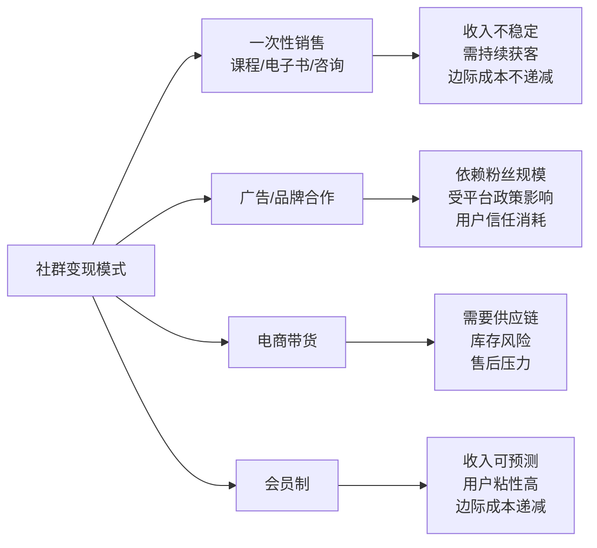
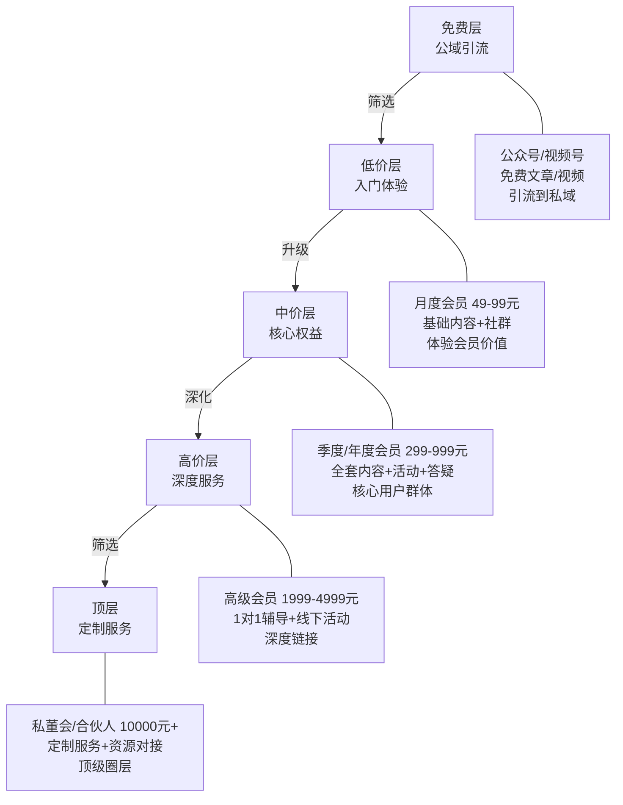
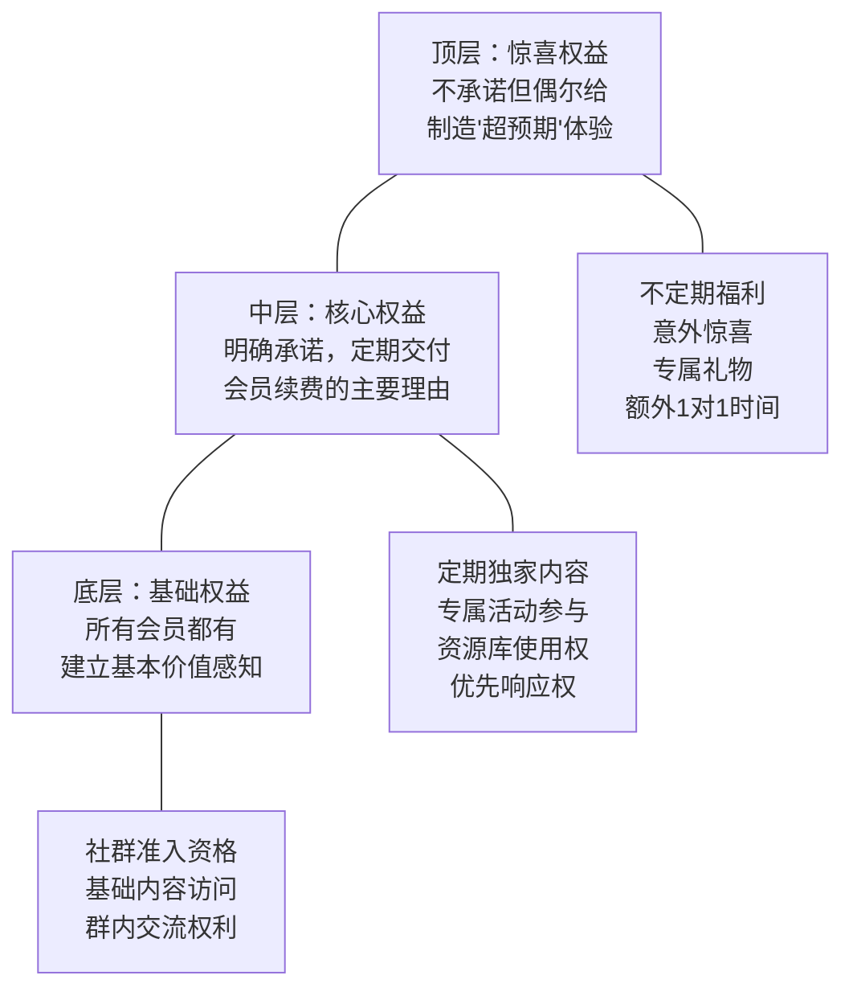
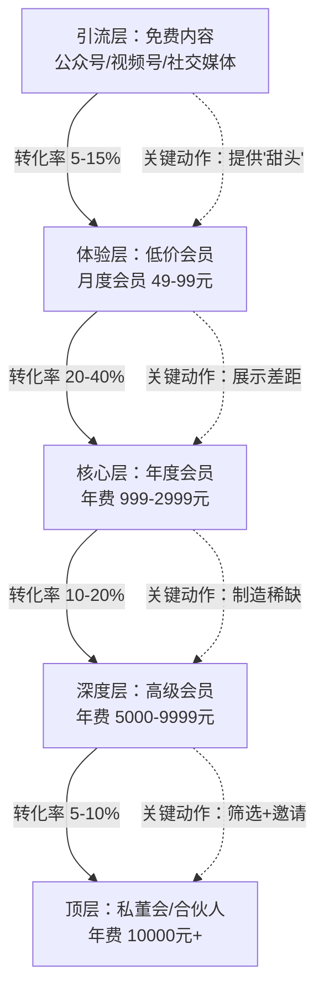
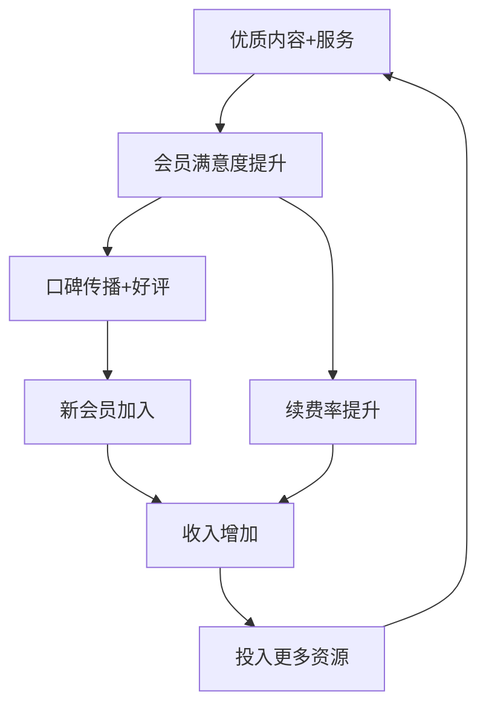

## 四、会员制商业模式设计

会员制是社群变现最稳定、最具可持续性的商业模式之一。它的核心逻辑很简单：**用户为"持续获得价值的权利"付费，而非为某一次具体的产品或服务付费。** 这与一次性卖课、单次咨询的本质区别在于——会员制创造的是"持续性收入"（Recurring Revenue），而非"一次性收入"。

为什么这个区别至关重要？举一个直观的数字：假设你做一次线上分享收费99元，每月做一次，10个人参加，月收入990元。但如果你做一个年费999元的会员社群，第一个月招募10人，此后每月自然增长3-5人，到第12个月你有50名会员——其中大部分是续费的老会员——年收入接近5万元。两种模式的差距不是线性的，而是指数级的，因为会员制的核心优势在于**留存带来的复利效应**。

本节将从会员制的底层逻辑出发，系统讲解会员体系的类型选择、定价策略、权益设计、升级路径、续费机制、防流失策略，以及从0到1的完整落地流程。

***

### 1. 会员制的底层逻辑：为什么用户愿意"持续付费"？

#### 1.1 会员制的经济学本质

会员制的本质是一种**社会契约**：用户承诺持续付费，运营者承诺持续交付价值。这个契约之所以能成立，是因为双方都从中获得了比"一次性交易"更大的收益。

从用户角度：

| 交易模式 | 用户获得 | 用户付出 | 用户感受 |
|---------|---------|---------|---------|
| 一次性购买 | 单次产品/服务 | 一次性全额付款 | "买完就走"，无归属感 |
| 会员制 | 持续的价值流（内容+社群+资源+机会） | 定期小额付费 | "我是这里的人"，有归属感 |

从运营者角度：

| 交易模式 | 收入特征 | 客户关系 | 运营压力 |
|---------|---------|---------|---------|
| 一次性销售 | 不可预测，需持续获客 | 交易关系，容易流失 | 高——每月从零开始 |
| 会员制 | 可预测的经常性收入（MRR） | 长期关系，有粘性 | 低——老会员自动续费 |

**关键指标：MRR（Monthly Recurring Revenue，月经常性收入）**

MRR是衡量会员制健康度的核心指标。计算公式：

```text
MRR = 付费会员数 × 月均会员费
```

举例：你有200名月度会员（99元/月）+ 50名年度会员（999元/年折合83.25元/月），则：

```text
MRR = 200 × 99 + 50 × 83.25 = 19,800 + 4,162.5 = 23,962.5 元/月
年化收入 ARR = 23,962.5 × 12 = 287,550 元/年
```

#### 1.2 会员制成功的三个必要条件

并非所有社群都适合做会员制。会员制能运转起来，必须同时满足三个条件：

**条件一：持续交付的能力**

会员付费不是为了"买一个群的入场券"，而是为了持续获得价值。如果你的内容输出能力只能支撑3个月，之后就"弹尽粮绝"，那么会员制会在第4个月崩溃。持续交付能力包括：定期内容更新、稳定的活动节奏、可复用的资源库、不断扩展的人脉网络。

**条件二：可感知的价值差距**

用户续费的唯一理由是"留在里面的收获 > 继续付费的成本"。这意味着你的会员权益必须让用户清晰地感知到"如果不续费，我会失去什么"。模糊的权益（如"优质内容"）不如具体的权益（如"每周三晚8点独家直播+回放"）。

**条件三：筛选机制**

会员制最怕的不是没人来，而是"什么人都来"。没有筛选的会员群会迅速劣化——大量低质量用户涌入，拉低社群氛围，高价值用户离开，形成恶性循环。价格本身就是最好的筛选器，除此之外还可以设置入群门槛（申请制、邀请制、面试制）。

#### 1.3 会员制 vs 其他变现模式的对比



**会员制的独特优势在于：**

1. **收入可预测**：老会员续费 + 新会员加入 = 稳定增长的收入曲线，不需要每月从零开始
2. **用户粘性高**：付费会员的身份认同感远强于普通粉丝，退群/取关的心理成本更高
3. **边际成本递减**：你为100个会员和为200个会员提供的内容成本几乎相同
4. **数据积累**：长期会员关系让你深入了解用户需求，可以精准推出高客单价产品
5. **口碑裂变**：满意的会员是最强的推荐人，他们的推荐转化率远高于广告

***

### 2. 会员体系的五种类型及适用场景

会员制不是一个单一的模式，而是一个包含多种类型的"家族"。选择哪种类型，取决于你的社群定位、内容类型、目标用户和变现目标。

#### 2.1 内容订阅型会员

**模式描述：** 用户为持续获取优质内容付费。类似"知识版Netflix"。

**适用场景：**
- 你有稳定且高质量的内容输出能力
- 你的内容具有"成瘾性"（用户看了还想看）
- 你的领域有信息差（用户很难免费获取同等质量的内容）

**典型权益：**
- 每日/每周独家深度文章
- 独家音频/视频节目
- 行业报告和数据分析
- 内容存档的完整访问权限

**定价参考：**

| 档位 | 月费 | 年费 | 典型权益 |
|------|------|------|---------|
| 基础档 | 29-49元 | 299-499元 | 每周1-2篇独家文章 |
| 进阶档 | 99-199元 | 999-1999元 | 基础档 + 独家音频/视频 + 月报 |
| VIP档 | 299-499元 | 2999-4999元 | 进阶档 + 1对1答疑 + 优先参与活动 |

**成功案例参考：** 财经类公众号"饭统戴老板"的付费知识星球，年费365元（日均1元），通过持续输出高质量财经分析，维持数万名付费会员。

#### 2.2 社交人脉型会员

**模式描述：** 用户为"进入一个高质量圈子"付费，核心价值是人脉和资源。

**适用场景：**
- 你的社群聚集了某个行业的从业者或决策者
- 社群成员之间有明确的合作/对接需求
- 你有能力维护社群的"准入门槛"

**典型权益：**
- 会员通讯录（经授权的联系方式）
- 定期线下/线上社交活动
- 资源对接服务（帮你找到你需要的人）
- 行业信息共享

**定价参考：**

| 档位 | 年费 | 典型权益 |
|------|------|---------|
| 普通会员 | 999-2999元 | 通讯录 + 月度线上活动 + 群内资源对接 |
| 核心会员 | 5000-9999元 | 普通会员 + 季度线下活动 + 1对1引荐 |
| VIP会员 | 10000-50000元 | 核心会员 + 专属顾问 + 优先合作机会 |

**关键成功因素：** 这类会员制的核心不是"内容"而是"人"。如果群里全是小白，没有真正的行业资源，这个模式就无法成立。因此，严格筛选入群成员是第一要务。很多成功的行业社群采用"邀请制"——只有现有会员推荐才能加入。

#### 2.3 工具服务型会员

**模式描述：** 用户为使用某种工具、平台或服务付费。社群只是附属的"用户社区"。

**适用场景：**
- 你开发了某个工具/模板/系统
- 你提供的服务有明确的使用频次
- 你的工具/服务有"用过就离不开"的特性

**典型权益：**
- 工具/模板的持续使用权和更新
- 技术支持和使用指导
- 新功能优先体验
- 社群交流和问题解答

**定价参考：**

| 档位 | 月费 | 年费 | 典型权益 |
|------|------|------|---------|
| 基础版 | 19-39元 | 199-399元 | 基础工具使用 + 社群 |
| 专业版 | 79-149元 | 799-1499元 | 全部工具 + 优先支持 + 专属社群 |
| 企业版 | 299-999元 | 2999-9999元 | 全部功能 + 定制服务 + 1对1指导 |

#### 2.4 训练营/陪伴型会员

**模式描述：** 用户为"有人带着学/练"付费，核心价值是陪伴、监督和反馈。

**适用场景：**
- 你的领域需要"刻意练习"（如写作、编程、健身、投资）
- 用户有明确的学习/成长目标，但缺乏自律
- 你能提供个性化的反馈和指导

**典型权益：**
- 系统化的课程/训练计划
- 定期作业/打卡/练习任务
- 导师/助教点评和反馈
- 同学互助和小组讨论
- 成果展示和阶段性复盘

**定价参考：**

| 档位 | 周期 | 价格 | 典型权益 |
|------|------|------|---------|
| 月度训练营 | 1个月 | 199-499元 | 课程 + 4次作业点评 + 群答疑 |
| 季度成长计划 | 3个月 | 599-1499元 | 月度训练营权益 + 1对1辅导1次 + 阶段复盘 |
| 年度会员 | 12个月 | 1999-4999元 | 全年训练营 + 月度1对1 + 优先参与活动 |

**关键成功因素：** 这类会员制高度依赖"人的投入"——你需要真正花时间给每个会员做反馈。因此，每个档位的人数必须控制，否则服务质量会断崖式下降。建议月度训练营每期不超过30人，年度1对1辅导不超过50人。

#### 2.5 混合型会员（推荐）

**模式描述：** 将上述两种或多种模式组合，构建多层次的会员体系。这是最常见也是最推荐的模式。

**设计思路：**



**这种"漏斗型"会员体系的优势：**

1. **降低决策门槛**：用户不需要一开始就花大钱，可以先体验低价层
2. **自然筛选**：不同层级自动筛选出不同投入度的用户
3. **收入多元化**：既有大量低价会员的基础收入，也有少量高价会员的高利润
4. **升级动力**：用户在低价层获得价值后，自然会想要更多——升级路径清晰

***

### 3. 定价策略：如何让你的"价格"成为最好的筛选器

定价是会员制设计中最被低估的环节。多数人的直觉是"定低一点，吸引更多人"，但这往往是致命的错误。

#### 3.1 定价的心理学原理

**锚定效应：** 用户对价格的判断是相对的，不是绝对的。如果你先展示9999元的年度VIP，再展示999元的年度标准会员，用户会觉得999元"很划算"。这就是为什么很多会员页面把最贵的档位放在最左边。

**价格-质量推断：** 用户会用价格来推断质量。一个年费99元的"高端人脉社群"，用户的第一反应是"99元的能高端到哪去？"。如果你的定位是高端，价格必须配得上。

**沉没成本效应：** 用户付的钱越多，离开的心理成本越高。适度的高价反而能提高留存率——前提是你提供了匹配的价值。

#### 3.2 三种定价方法

**方法一：成本加成定价法**

这是最简单但最不推荐的方法：计算你的成本（时间成本 + 工具成本 + 平台成本 + 运营成本），加上期望利润率，得出价格。

```text
价格 = （月均成本 × （1 + 利润率））÷ 预期会员数
```

**问题：** 这个方法完全忽略了用户端的价值感知，很容易定低。

**方法二：价值锚定定价法（推荐）**

先估算你的会员权益为用户创造的"替代成本"，然后按替代成本的10%-30%定价。

例如，你的会员权益包括：
- 每周独家行业分析（替代成本：用户自己研究需要2小时/周，按200元/小时算=400元/周=1600元/月）
- 每月一次线上活动（替代成本：参加类似外部活动约300元/次）
- 社群人脉资源（替代成本：无法量化，但用户明确表示"认识XX人很值"）

总替代成本约2000元/月，按20%定价 = 399元/月，或年费3999元（打八折）。

**方法三：竞品参照定价法**

找到3-5个同类型的、已验证成功的会员社群，统计他们的定价，然后根据你的差异化程度定价。

| 竞品 | 定价 | 会员规模 | 核心权益 |
|------|------|---------|---------|
| 竞品A | 年费1299元 | 2000+ | 每日文章+月度直播 |
| 竞品B | 年费2999元 | 500+ | 课程+1对1答疑+线下 |
| 竞品C | 月费99元 | 800+ | 课程+社群+资源库 |

如果你的权益覆盖了竞品A和B的内容，定价在1299-2999元之间是合理的。

#### 3.3 定价的常见误区

| 误区 | 表现 | 后果 | 正确做法 |
|------|------|------|---------|
| 定价太低 | 年费99元"交个朋友" | 吸引大量低质量用户，运营成本高，收入无法覆盖投入 | 最低不低于199元/年，除非有明确的升级路径 |
| 只有一个价格 | 所有用户同一价格 | 损失了高价值用户愿意多付的钱，也拦住了预算有限但有潜力的用户 | 至少设置2-3个档位 |
| 频繁打折 | 动不动"限时特惠5折" | 老会员感觉被"割韭菜"，新会员养成"等打折"的习惯 | 新会员首月优惠可以有，但年费尽量不打折 |
| 不敢涨价 | 运营3年还是一个价 | 成本在涨，服务在升级，但收入不涨，最终运营不可持续 | 每年可以涨10-20%，老会员提前通知并给续费优惠 |

#### 3.4 实操：定价决策表

当你犹豫不决时，用这个决策表来确定价格：

| 如果你的社群... | 建议月费 | 建议年费 | 理由 |
|---------------|---------|---------|------|
| 以内容为主，无互动 | 29-49元 | 299-499元 | 内容型社群用户预期低价 |
| 内容+社群互动 | 69-129元 | 699-1299元 | 互动增加了参与感和归属感 |
| 内容+互动+定期活动 | 129-299元 | 1299-2999元 | 活动策划有额外成本，价格需覆盖 |
| 深度服务（1对1辅导等） | 299-999元 | 2999-9999元 | 个性化服务的稀缺性决定了高价 |
| 高端人脉圈 | 不设月费 | 5000-50000元 | 高端圈子用年费筛选，月费太廉价 |

***

### 4. 权益设计：让每一分钱都"看得见摸得着"

权益设计是会员制的"灵魂"——用户续费的理由不是"这个群不错"，而是"这个群给了我XX、XX和XX，如果我退了就全没了"。

#### 4.1 权益设计的"三层金字塔"模型



**为什么要分三层？**

- **基础权益**决定了会员的"底线体验"——不能差，但不需要惊艳
- **核心权益**决定了续费率——必须稳定、可感知、有节奏
- **惊喜权益**决定了口碑传播——超出预期的体验会让用户主动推荐

#### 4.2 权益设计清单（按类型分类）

**内容类权益：**

| 权益 | 交付频率 | 价值感知 | 运营成本 | 推荐指数 |
|------|---------|---------|---------|---------|
| 独家深度文章 | 每周1-2篇 | ★★★★ | ★★★ | ⭐⭐⭐⭐⭐ |
| 独家音频/视频节目 | 每周/每月 | ★★★★★ | ★★★★ | ⭐⭐⭐⭐ |
| 行业报告/数据 | 每月/每季 | ★★★★★ | ★★★★★ | ⭐⭐⭐⭐ |
| 精选信息源/Newsletter | 每日/每周 | ★★★ | ★★ | ⭐⭐⭐⭐ |
| 课程/教程 | 按系列更新 | ★★★★★ | ★★★★★ | ⭐⭐⭐⭐⭐ |
| 书单/影单推荐 | 每月 | ★★ | ★ | ⭐⭐⭐ |

**社交类权益：**

| 权益 | 交付频率 | 价值感知 | 运营成本 | 推荐指数 |
|------|---------|---------|---------|---------|
| 会员专属群 | 持续 | ★★★★ | ★★ | ⭐⭐⭐⭐⭐ |
| 会员通讯录 | 按季度更新 | ★★★★★ | ★★★ | ⭐⭐⭐⭐ |
| 1对1引荐 | 按需 | ★★★★★ | ★★★★ | ⭐⭐⭐⭐ |
| 线下聚会 | 每季度 | ★★★★★ | ★★★★★ | ⭐⭐⭐⭐ |
| 嘉宾分享/Q&A | 每月1-2次 | ★★★★ | ★★★ | ⭐⭐⭐⭐⭐ |

**服务类权益：**

| 权益 | 交付频率 | 价值感知 | 运营成本 | 推荐指数 |
|------|---------|---------|---------|---------|
| 问题答疑（群内） | 每日 | ★★★★ | ★★ | ⭐⭐⭐⭐⭐ |
| 1对1咨询时间 | 每月30-60分钟 | ★★★★★ | ★★★★★ | ⭐⭐⭐⭐ |
| 作业/作品点评 | 按需 | ★★★★★ | ★★★★ | ⭐⭐⭐⭐ |
| 定制化建议/方案 | 按需 | ★★★★★ | ★★★★★ | ⭐⭐⭐ |

**资源类权益：**

| 权益 | 交付频率 | 价值感知 | 运营成本 | 推荐指数 |
|------|---------|---------|---------|---------|
| 模板/工具包 | 持续更新 | ★★★★ | ★★★ | ⭐⭐⭐⭐⭐ |
| 资源库/资料库 | 持续积累 | ★★★★ | ★★ | ⭐⭐⭐⭐⭐ |
| 优先参与名额 | 按活动 | ★★★★ | ★ | ⭐⭐⭐⭐ |
| 合作机会优先 | 按需 | ★★★★★ | ★★ | ⭐⭐⭐⭐ |

#### 4.3 权益设计的五个原则

**原则一：具体化，拒绝模糊**

❌ 模糊权益："提供优质内容"
✅ 具体权益："每周三和周六各一篇5000字深度文章，覆盖XX领域的最新趋势和实操方法"

模糊的权益用户记不住，具体的权益用户能"算账"——"每周两篇文章，一年就是104篇，平均每篇才几块钱"。

**原则二：可感知，拒绝隐形**

有些权益你确实提供了，但用户感知不到。比如"群内答疑"——你每天都在回答问题，但如果用户进群后发现提问要等很久才有人回，或者他的问题被淹没了，他的感知就是"这个群没什么服务"。

解决方案：把隐性权益显性化。比如每天固定一个"答疑时间"（如每晚8-9点），在群里明确公告，让用户知道"这个时间段我一定能得到回复"。

**原则三：有节奏，拒绝一次性**

权益交付要有时间节奏，让用户每周/每月都有"期待感"。

推荐的权益交付节奏：

```text
每日：精选信息推送（自动化）
每周三：独家深度文章
每周六：本周精华回顾
每月第一个周一：月度行业报告
每月第三个周五：嘉宾分享/直播
每季度：线下活动/线上大型活动
每年：年度峰会/年度复盘
```

**原则四：分层差异化，拒绝"一锅端"**

不同档位的会员权益必须有明确的差异化。如果基础会员和高级会员享受的内容完全一样，没人会升级。

差异化设计的关键：不要只在"数量"上做区别（如基础10篇，高级20篇），而要在"类型"上做区别。

| 维度 | 基础会员 | 高级会员 | VIP会员 |
|------|---------|---------|---------|
| 内容 | 文章 | 文章+音频 | 文章+音频+视频 |
| 互动 | 群内交流 | 群内交流+月度答疑 | 群内交流+每周1对1 |
| 活动 | 线上参与 | 线上参与+优先提问 | 线上+线下+专属席位 |
| 资源 | 基础模板 | 全部模板+工具包 | 全部资源+定制方案 |

**原则五：定期刷新，拒绝"一成不变"**

会员权益不是设计好就一劳永逸的。用户会"审美疲劳"，市场在变化，你的能力也在成长。建议每季度做一次权益审视：

- 哪些权益使用率最高？（保留并强化）
- 哪些权益使用率最低？（优化或替换）
- 会员反馈最多的诉求是什么？（考虑新增）
- 竞品有哪些我没有的权益？（差异化补充）

***

### 5. 升级路径设计：让用户"自然"花更多钱

升级路径是会员制商业模式中最容易被忽略、但回报最高的设计环节。好的升级路径不是"推销"，而是让用户在获得价值的过程中自然地想要更多。

#### 5.1 升级路径的"三步漏斗"



**每一层的转化关键动作：**

**免费 → 低价（转化率目标：5-15%）**

关键动作：提供"甜头"——让免费用户体验到付费会员的某一小部分价值。

具体方法：
- 在免费内容中引用"更多内容详见会员专区"
- 定期开放"会员体验日"，让免费用户试看会员内容
- 新会员首月半价/7天无理由退款
- 会员专属内容的"片段"在公域传播，制造好奇心

**低价 → 年度（转化率目标：20-40%）**

关键动作：展示差距——让用户清楚看到"升级后我能多获得什么"。

具体方法：
- 在低价会员群中定期展示高级会员的专属活动/内容
- 年度会员的单价优势（年费比12个月月费便宜15-25%）
- 年度会员专属权益的限时体验（如"本周高级会员可免费参加XX活动"）
- 到期续费时推送升级方案（"升级年度会员，立省XX元"）

**高级 → 顶层（转化率目标：10-20%）**

关键动作：制造稀缺——顶层服务必须有"不是有钱就能买到"的感觉。

具体方法：
- 设置申请门槛（需要推荐/面试/审批）
- 限制名额（如"每年仅开放30个名额"）
- 提供不可替代的价值（如创始人亲自1对1、顶级人脉引荐、独家资源）
- 用"邀请制"而非"开放购买"

#### 5.2 升级时机的把握

用户不是随时都愿意升级的。在以下时刻推送升级信息，转化率最高：

| 时机 | 原因 | 推荐话术 |
|------|------|---------|
| 新会员入群第3-7天 | 新鲜感最强，对社群价值认知最正面 | "你已经在群里体验了X天，升级年度会员享受XX优惠" |
| 完成一个里程碑 | 如连续打卡30天、完成第一个作业 | "恭喜你完成了XX！升级高级会员，获得更多导师指导" |
| 参加完一次活动 | 活动后满意度最高 | "今天的活动你感觉如何？高级会员每月都有这样的活动" |
| 月度会员到期前7天 | 续费决策窗口期 | "你的会员即将到期，续费/升级可享受XX优惠" |
| 社群重大更新时 | 新内容/新权益上线 | "我们刚上线了XX功能，高级会员可优先体验" |

***

### 6. 续费与防流失：让老会员"不想走"

获取一个新会员的成本是留住一个老会员的5-7倍。续费率（Retention Rate）是会员制商业模式中最重要的指标，没有之一。

#### 6.1 续费率的关键阈值

| 续费率 | 评级 | 含义 | 对策 |
|--------|------|------|------|
| 80%以上 | 优秀 | 社群价值强劲，口碑可期 | 继续保持，适度提价 |
| 60-80% | 良好 | 基本健康，有优化空间 | 分析流失原因，针对性改善 |
| 40-60% | 及格 | 社群价值不足，需要警惕 | 必须进行权益优化和用户调研 |
| 40%以下 | 危险 | 社群可能正在"失血" | 紧急调研+大改版，否则不可持续 |

**续费率计算公式：**

```text
续费率 = 到期后继续付费的会员数 ÷ 到期会员总数 × 100%
```

注意：续费率和留存率不同。留存率是"还在群里"的比例（可能还没到期），续费率是"到期后愿意继续付费"的比例。

#### 6.2 流失预警的六个信号

不要等到用户退群才知道他要走。以下信号可以在流失发生前1-4周被捕捉到：

| 信号 | 检测方法 | 严重程度 |
|------|---------|---------|
| 打开率下降 | 连续2周内容打开率低于历史均值50% | ⚠️ 中等 |
| 互动骤减 | 从活跃发言变为"潜水"，超过2周无互动 | ⚠️ 中等 |
| 活动缺席 | 连续2次以上活动未参加 | 🔴 严重 |
| 退款申请 | 提出退款或质疑性价比 | 🔴 严重 |
| 抱怨增多 | 在群里公开表达不满或质疑 | 🔴 严重 |
| 社交脱链 | 从群里加的好友也开始减少互动 | ⚠️ 中等 |

**主动触达话术模板（发现预警信号后使用）：**

```text
XX你好，注意到你最近比较忙，群里互动少了。

想了解一下：
1. 最近社群的内容/活动对你有帮助吗？
2. 有什么我们可以做得更好的地方？
3. 有没有你特别想了解但我们还没覆盖的话题？

你的反馈对我们很重要，期待你的回复。
```

注意：这个话术的目的是"真诚收集反馈"，而不是"挽留销售"。如果用户感受到你在"推销"他续费，效果会适得其反。

#### 6.3 提高续费率的七个策略

**策略一：创造"沉没成本"**

让用户在会员期间投入了时间、精力、社交关系，这些投入成为他离开的"阻力"。

具体方法：
- 建立"学习档案"——记录用户的学习进度、作业、成长轨迹
- 鼓励会员之间建立社交关系——"我在群里认识了3个好朋友"
- 创建"等级体系"——等级越高，权益越多，离开意味着从零开始

**策略二：定期"价值回顾"**

很多用户不续费不是因为"没有价值"，而是"忘了自己获得了多少价值"。

具体方法：
- 每月发送"会员价值月报"——本月你参加了X次活动，阅读了X篇文章，获得了X次答疑
- 在续费前发送"年度价值回顾"——这一年你获得了总价值XX元的权益
- 在群里定期晒"会员成果"——"XX会员通过社群资源对接了XX项目"

**策略三：提供"续费专属优惠"**

给老会员一个"现在续费比以后续费更划算"的理由。

具体方法：
- 续费提前优惠——提前30天续费享85折
- 连续续费奖励——连续续费满1年，第2年享8折
- 续费送额外权益——续费送1次1对1咨询/额外1个月
- 涨价前通知——"X月X日起价格调整为XX，现在续费锁定老价格"

**策略四：建立"退出仪式"**

不要让用户悄悄离开。一个正式的"退出流程"可以挽留一部分用户，也能收集宝贵的反馈。

具体方法：
- 退群/取消续费时发送问卷——"能告诉我们你离开的原因吗？"
- 提供"暂停"选项——"不想完全退出？可以暂停1-3个月，随时恢复"
- 退出前提供一次1对1沟通——了解真实原因，看是否可以解决

**策略五：建立"社群文化"和归属感**

当用户感觉自己"属于这里"，续费就变成了自然而然的事情。

具体方法：
- 社群有自己的"黑话"/术语/仪式（如每天早上的打卡口号）
- 定期举办"社群纪念日"活动
- 会员故事分享——让会员讲述自己在社群中的成长
- 社群专属标识——会员徽章、等级称号、专属头像框

**策略六：持续迭代，给用户"新东西"**

用户最怕的不是"不好"，而是"一直没变化"。

具体方法：
- 每季度推出一个新的权益或活动
- 定期邀请新的嘉宾/导师
- 根据会员反馈调整内容方向
- 每年做一次"大升级"——新功能、新内容、新活动

**策略七：构建"续费自动化"流程**

不要依赖人工提醒续费。建立自动化的续费流程：

```text
续费流程 SOP：

到期前30天 → 自动发送"续费提醒+提前续费优惠"
到期前14天 → 自动发送"价值回顾报告"
到期前7天  → 自动发送"即将到期+限时优惠"
到期当天   → 自动发送"最后提醒"
到期后3天  → 人工跟进（对高价值会员）
到期后7天  → 发送"退出问卷"
到期后30天 → 发送"回归邀请+专属优惠"
```

***

### 7. 从0到1落地会员制：完整执行流程

理论讲完了，以下是你可以今天就开始执行的完整流程。

#### 7.1 阶段一：规划期（第1-2周）

**第一步：明确社群定位**

用一张表回答以下问题：

```text
我的社群定位画布：

1. 目标人群：谁会为这个社群付费？（尽量具体，如"工作3-8年的互联网产品经理"）
2. 核心痛点：他们最需要解决的3个问题是什么？
3. 价值主张：我提供什么让他们无法从别处获得的东西？
4. 竞品分析：同类社群有哪些？他们做到了什么？没做到什么？
5. 差异化：我的社群和他们相比，独特在哪里？
6. 变现目标：我期望的月收入是多少？需要多少会员×什么价格？
```

**第二步：设计会员体系**

基于前面的分析，确定：

```text
会员体系设计表：

1. 会员类型：内容型/社交型/服务型/混合型？
2. 层级设计：分几个层级？每个层级的目标人群？
3. 权益清单：每个层级的具体权益列表（至少5项）
4. 定价方案：每个层级的月费和年费
5. 升级路径：用户从免费到最高层级的完整路径
```

**第三步：准备MVP（最小可行产品）**

不要追求完美，先推出一个"够用"的版本：

```text
MVP清单：

□ 社群平台选择（微信群/企业微信/知识星球/自建平台）
□ 基础内容准备（至少准备2周的内容）
□ 社群规则制定（群规、发言规范、权益说明）
□ 收款方式设置（微信支付/支付宝/小鹅通/知识星球等）
□ 宣传物料准备（社群介绍、权益说明、FAQ）
□ 种子用户邀请（至少20-50人）
```

#### 7.2 阶段二：冷启动期（第3-6周）

**第四步：招募种子会员**

种子会员的质量决定了社群的"基因"。以下是招募种子会员的五个渠道：

| 渠道 | 方法 | 预期效果 | 适合阶段 |
|------|------|---------|---------|
| 个人朋友圈 | 发布社群介绍+限额招募 | 10-30人 | 第1周 |
| 公众号/视频号 | 发布社群招募文章 | 20-50人 | 第1-2周 |
| 现有社群/群 | 在相关群分享价值内容+引流 | 10-30人 | 第1-3周 |
| 1对1邀请 | 私聊你认为合适的高价值用户 | 5-15人 | 第1-2周 |
| KOL推荐 | 请行业KOL帮忙推荐 | 20-100人 | 第2-4周 |

**种子会员招募话术模板：**

```text
我正在做一个[领域]的付费学习社群，目标是[核心价值主张]。

权益包括：
✅ [权益1]
✅ [权益2]
✅ [权益3]

首批会员定价[价格]（后续会涨价），限[人数]人。

如果你感兴趣，回复"加入"了解详情。
```

**第五步：运营第一个月**

第一个月是"生死期"——如果种子会员在这个月没有感受到价值，他们不会续费，也不会推荐别人加入。

第一个月运营重点：

```text
第1周：建立规则+破冰
  - 发布社群规则和权益说明
  - 自我介绍环节（让会员互相认识）
  - 第一次独家内容发布
  - 第一次互动活动（如话题讨论）

第2周：展示价值+建立节奏
  - 按计划发布内容
  - 第一次答疑/互动
  - 收集反馈（"你觉得前两周体验如何？"）
  - 根据反馈快速调整

第3周：深度互动+成果展示
  - 组织一次线上活动（如嘉宾分享）
  - 展示会员成果/案例
  - 促进会员之间的连接
  - 第二次内容发布

第4周：复盘优化+续费引导
  - 月度复盘（内容、活动、反馈）
  - 发布下月计划
  - 发送"首月价值报告"
  - 引导续费和升级
```

#### 7.3 阶段三：增长期（第7-12周）

**第六步：建立增长飞轮**

当种子会员稳定后，开始建立增长飞轮：



增长飞轮的启动关键：**让前50名种子会员成为你的"推广员"。**

具体方法：
- 设计"推荐奖励"机制——老会员推荐新会员，双方各获XX权益
- 鼓励会员在朋友圈/社交媒体分享社群体验
- 定期收集会员好评/案例，用于宣传
- 举办"会员专属活动"，邀请朋友免费体验

**推荐奖励设计示例：**

| 推荐人数 | 奖励 | 说明 |
|---------|------|------|
| 1人 | 延长会员期1个月 | 每成功推荐1人 |
| 3人 | 免费升级到下一个层级 | 累计推荐3人 |
| 5人 | 赠送1次1对1咨询 | 累计推荐5人 |
| 10人 | 全年会员费减免50% | 累计推荐10人 |

#### 7.4 阶段四：稳定期（第13周起）

**第七步：建立运营SOP**

当社群运转稳定后，把所有重复性工作标准化，为规模化做准备：

```text
会员运营SOP模板：

每日任务（30分钟）：
□ 检查社群消息，回复重要问题
□ 发布今日内容/信息推送
□ 处理新会员入群

每周任务（2小时）：
□ 发布本周深度文章
□ 组织一次互动活动（话题讨论/答疑）
□ 统计本周数据（新增/流失/活跃度）
□ 处理会员反馈

每月任务（4小时）：
□ 发布月度行业报告/总结
□ 组织一次线上活动（嘉宾分享/直播）
□ 发送会员价值月报
□ 分析数据，优化运营策略
□ 规划下月内容和活动

每季度任务（8小时）：
□ 权益审视和优化
□ 会员满意度调研
□ 续费活动策划
□ 定价调整评估
□ 竞品分析
```

***

### 8. 数据驱动：用指标指导会员制运营

凭感觉运营是会员制最大的敌人。以下是必须跟踪的核心指标和分析方法。

#### 8.1 会员制核心指标仪表盘

| 指标 | 计算方法 | 健康阈值 | 检查频率 |
|------|---------|---------|---------|
| 月新增会员数 | 本月新付费会员数 | 因规模而异，关注趋势 | 每周 |
| 月流失会员数 | 本月到期未续费+主动退出数 | < 新增数 | 每周 |
| 净增长率 | (新增 - 流失) ÷ 期初会员数 | > 5%/月 | 每月 |
| 续费率 | 到期续费数 ÷ 到期总数 | > 60% | 每月 |
| 月经常性收入(MRR) | 付费会员数 × 月均费用 | 持续增长 | 每月 |
| 会员平均生命周期(AL) | 1 ÷ 月流失率 | > 6个月 | 每季度 |
| 客户终身价值(LTV) | MRR × AL | > CAC的3倍 | 每季度 |
| 客户获取成本(CAC) | 获客总投入 ÷ 新增会员数 | < LTV的1/3 | 每月 |
| 会员活跃率 | 月活跃会员 ÷ 总会员 | > 50% | 每周 |
| 权益使用率 | 使用某权益的人数 ÷ 总会员 | > 30% | 每月 |

#### 8.2 数据分析的三个关键场景

**场景一：续费率下降**

```text
排查路径：
1. 是哪个层级的续费率下降？（定位问题层级）
2. 这个层级的权益使用率如何？（是否有权益没被使用）
3. 最近有什么变化？（内容质量/活动频率/价格调整）
4. 流失用户的共同特征是什么？（加入时间/活跃度/消费层级）
5. 流失问卷反馈集中在哪些问题？（直接听取用户声音）
```

**场景二：新会员转化率低**

```text
排查路径：
1. 流量来源质量如何？（是精准用户还是泛流量）
2. 社群介绍/宣传材料是否有吸引力？（价值主张是否清晰）
3. 定价是否合理？（对比竞品和用户支付意愿）
4. 是否有足够的"信任背书"？（案例/好评/KOL推荐）
5. 付款流程是否顺畅？（技术问题导致的流失）
```

**场景三：会员活跃度下降**

```text
排查路径：
1. 是整体下降还是部分用户？（区分系统性问题和个体问题）
2. 内容打开率如何？（内容吸引力）
3. 活动参与率如何？（活动吸引力）
4. 群内互动情况如何？（社群氛围）
5. 是否有"核心活跃用户"流失？（社群领袖的影响力）
```

***

### 9. 常见误区与避坑指南

#### 误区一：把"收费"等同于"会员制"

**表现：** 建了一个微信群，收了年费，但没有任何系统化的权益设计、内容规划、升级路径。本质上只是"收费入群"，而非"会员制"。

**后果：** 用户付费后发现"什么都没有"，续费率极低，口碑崩塌。

**纠正方法：** 会员制是一个完整的商业系统，至少包含：权益体系、内容规划、交付节奏、互动机制、升级路径、续费策略。缺任何一环都不叫会员制。

#### 误区二：一上来就做"高价社群"

**表现：** 没有任何口碑和案例，就定年费5000+的高价。

**后果：** 招不到人，打击信心；即使招到了，用户期望极高，难以满足。

**纠正方法：** 遵循"低价验证 → 逐步涨价"的路径。先用低价（199-499元/年）招募50-100个种子会员，验证你的内容和服务能力，积累口碑和案例，再逐步涨价。

#### 误区三：过度承诺，交付不足

**表现：** 宣传时承诺"每周3篇深度文章+每月2次直播+每周1对1答疑"，实际上做不到。

**后果：** 用户期望落差导致不满和退费，口碑受损。

**纠正方法：** 承诺你100%能做到的，然后做到120%。少承诺多交付，比多承诺少交付好100倍。初期权益可以少一点，但每一条都要100%兑现。

#### 误区四：只关注拉新，不关注留存

**表现：** 把90%的精力放在"如何招新会员"上，对老会员的体验和续费毫不关心。

**后果：** 社群变成"漏桶"——进多少漏多少，永远长不大。

**纠正方法：** 将至少50%的运营精力放在"老会员体验"上。续费率从60%提升到80%，等于你的有效会员数增长了50%——而且不需要任何获客成本。

#### 误区五：不做分层，"一锅炖"

**表现：** 所有会员享受完全相同的权益，没有层级区分。

**后果：** 高价值用户觉得"没有特殊待遇"而离开，低价值用户觉得"不值这个价"而不升级。两头不讨好。

**纠正方法：** 至少设置2-3个层级，通过权益差异化满足不同用户的需求和支付能力。

#### 误区六：忽视社群氛围管理

**表现：** 只关注内容输出，不关注群内互动质量和氛围。

**后果：** 社群变成"通知群"或"广告群"，高价值用户退出。

**纠正方法：** 制定明确的群规，指定管理员/群主维护氛围，定期清理违规成员，鼓励高质量互动，抑制低质量刷屏。

***

### 10. 工具推荐

| 工具类型 | 推荐工具 | 适用场景 | 价格 |
|---------|---------|---------|------|
| 社群平台 | 知识星球 | 内容型社群，有付费和免费功能 | 免费-399元/年 |
| 社群平台 | 小鹅通 | 课程+社群一体化 | 4800元/年起 |
| 社群平台 | 企业微信 | 大规模用户管理，自动化运营 | 免费 |
| 支付工具 | 微信支付商户号 | 收款 | 费率0.6% |
| 支付工具 | 小程序商城 | 多层级会员销售 | 按平台计费 |
| 内容管理 | Notion/飞书文档 | 会员资料库和知识库 | 免费-按需 |
| 数据分析 | 腾讯文档/石墨表格 | 会员数据追踪 | 免费 |
| 自动化工具 | 微伴助手/句子互动 | 企业微信自动化运营 | 免费-按需 |
| 直播工具 | 视频号直播/腾讯会议 | 会员专属直播和活动 | 免费-按需 |
| 邮件工具 | 营销邮件服务 | 会员通知和续费提醒 | 免费-按需 |

***

### 11. 实战模板：会员制社群设计方案

以下是一个可直接套用的模板，你可以根据自己的实际情况修改：

```text
==============================
会员制社群设计方案（模板）
==============================

一、基本信息
- 社群名称：
- 社群定位：为[目标人群]提供[核心价值]
- Slogan：（一句话说清楚这个社群是干什么的）

二、会员体系

层级1：体验会员
  - 月费：XX元
  - 权益：
    1. [权益1]
    2. [权益2]
    3. [权益3]
  - 目标：让用户低成本体验社群价值

层级2：标准会员（主推）
  - 年费：XX元（折合XX元/月）
  - 权益：
    1. [层级1全部权益]
    2. [新增权益4]
    3. [新增权益5]
    4. [新增权益6]
  - 目标：核心收入来源

层级3：高级会员
  - 年费：XX元
  - 权益：
    1. [层级2全部权益]
    2. [新增权益7]
    3. [新增权益8]
  - 限制：名额XX人
  - 目标：高利润+深度服务

三、内容规划

- 每日：[内容1]
- 每周：[内容2]
- 每月：[内容3]
- 每季度：[内容4]

四、运营节奏

- 新会员引导流程：[描述]
- 日常运营SOP：[描述]
- 续费流程：[描述]
- 流失挽回流程：[描述]

五、增长计划

- 第1个月目标：XX名会员
- 第3个月目标：XX名会员
- 第6个月目标：XX名会员
- 第12个月目标：XX名会员

- 增长渠道：
  1. [渠道1]
  2. [渠道2]
  3. [渠道3]

- 推荐奖励机制：[描述]

六、财务预测

| 时间 | 会员数 | 月均收入 | 月均成本 | 月均利润 |
|------|--------|---------|---------|---------|
| 第1月 |        |         |         |         |
| 第3月 |        |         |         |         |
| 第6月 |        |         |         |         |
| 第12月|        |         |         |         |
```

***

### 12. 本节核心要点

1. **会员制的本质**是"持续性收入"——用户为"持续获得价值的权利"付费，而非一次性交易。其核心优势在于留存带来的复利效应。

2. **会员制成功的三个条件**：持续交付能力、可感知的价值差距、有效的筛选机制。缺一不可。

3. **五种会员类型**：内容订阅型、社交人脉型、工具服务型、训练营陪伴型、混合型。推荐混合型，构建多层次漏斗。

4. **定价是筛选器**：不要定太低。用价值锚定法定价，至少设2-3个档位，年费比月费便宜15-25%以鼓励长期承诺。

5. **权益设计三层金字塔**：基础权益（底线体验）、核心权益（续费理由）、惊喜权益（口碑传播）。权益必须具体化、可感知、有节奏。

6. **升级路径是利润倍增器**：免费→低价→年度→高级→顶层，每一层都有关键转化动作。

7. **续费率是最重要的指标**：80%以上优秀，60-80%良好，60%以下必须优化。定期"价值回顾"和"续费专属优惠"是提升续费率的核心手段。

8. **数据驱动运营**：跟踪MRR、续费率、活跃率、LTV/CAC等核心指标，用数据指导决策而非凭感觉。

9. **先验证后扩张**：用低价种子社群验证模式，积累口碑后再逐步涨价和扩大规模。

10. **社群的核心是人**：会员制不是"收费群"，而是一个持续为用户创造价值、让用户之间产生连接的生态系统。
