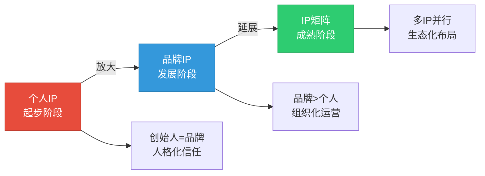
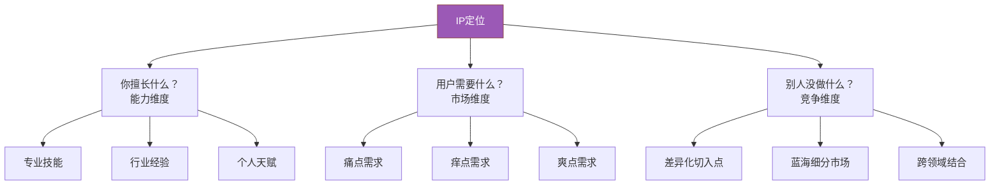
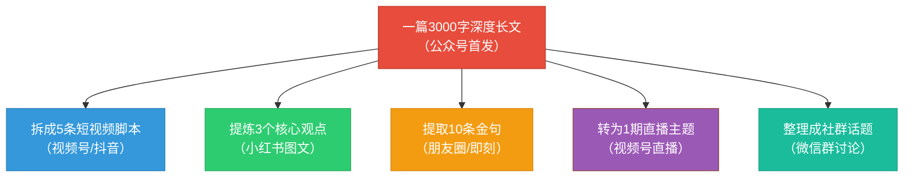
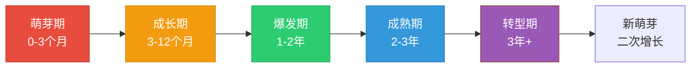

## 五、社群IP打造

### 为什么社群需要IP？

在社群运营中，有一条被反复验证的铁律：**没有IP的社群是"群"，有IP的社群是"圈子"。** 前者的存续依赖持续的福利和活动刺激，一旦停止投入就会迅速沉寂；后者的成员因为认同某个"人"或"品牌"而聚集，即使没有活动也会自发互动，形成自运转的生态。

IP（Intellectual Property，此处特指"人格化品牌资产"）是社群的灵魂。它回答的是一个根本性问题：**用户为什么要留在你的社群，而不是去别人的社群？** 答案不是"因为你的群发红包"，而是"因为你是这个领域我最信任的人"。

从商业角度看，IP带来的直接价值是**信任溢价**。同样一堂课，没有IP背书的人卖99元无人问津，有IP背书的人卖999元被秒杀。这不是因为内容质量差10倍，而是因为信任降低了决策成本。社群IP的本质，就是用持续的内容输出和人格化表达，在目标用户心中建立"提到XX领域就想到你"的心智占位。

### 社群IP的三种形态

社群IP不是只有"个人IP"一种形态。根据不同的运营主体和商业模式，社群IP可以分为三种形态：

| 形态 | 核心载体 | 典型案例 | 优势 | 劣势 |
|------|----------|----------|------|------|
| **个人IP** | 创始人/主理人的人格化品牌 | 樊登读书、罗辑思维、半佛仙人 | 信任感最强，转化率最高 | 依赖个人精力，难以规模化 |
| **品牌IP** | 社群本身的符号化品牌 | 混沌学园、得到、生财有术 | 可脱离个人独立运转 | 前期信任建设周期长 |
| **角色IP** | 虚拟/半虚拟的角色人设 | 某些二次元社群、AI助手社群 | 辨识度高，人设可控 | 缺乏真人温度，互动深度有限 |

**选择建议：** 大多数个人创业者和中小团队，建议从**个人IP**起步——因为个人IP的启动成本最低、信任建设最快、变现路径最短。当个人IP做大到一定程度后，再逐步过渡到品牌IP，降低对个人的依赖。



### 个人IP打造的完整路径

#### 第一步：精准定位——找到你的"生态位"

IP定位是整个IP打造过程中最重要的一步。定位错了，后面所有努力都是浪费。定位的核心原则是：**在一个足够细分的领域成为第一，而不是在一个足够大的领域成为第一百。**

**定位三要素模型：**



**实操方法：用"定位画布"找到你的IP方向**

拿出一张纸，画三个圆：

1. **能力圈**：写下你所有擅长的事情（不局限于职业，兴趣爱好也算）。至少列出20项
2. **需求圈**：写下目标人群中存在付费意愿的需求。至少列出15项
3. **差异圈**：写下你能做到但同行没做好的事情。至少列出10项

三个圆的交集，就是你的IP定位方向。交集越大，定位越精准。

**定位公式：**

> IP定位 = 目标人群 + 核心领域 + 差异化标签

几个例子：
- 不是"教写作"，而是"教理工科出身的人写出有逻辑的文章"
- 不是"做穿搭社群"，而是"帮小个子女生（155cm以下）找到显高的穿搭方案"
- 不是"做理财社群"，而是"教刚毕业的大学生用工资的30%实现年化8%的稳健收益"

**定位的三个检验标准：**

| 检验项 | 合格标准 | 不合格信号 |
|--------|----------|------------|
| 一句话说清楚 | 你能在10秒内向陌生人解释你是做什么的 | 解释半天对方还是听不懂 |
| 有付费意愿 | 目标人群愿意为解决这个问题花钱 | "听起来不错"但没人愿意付费 |
| 能持续输出 | 你有至少1年的内容储备 | 写了10篇就写不出来了 |

#### 第二步：人设构建——让你的IP"活"起来

定位解决的是"你是谁"的问题，人设解决的是"你是什么样的人"的问题。一个有血有肉的IP，比一个只会输出干货的"知识机器"更有吸引力。

**人设五要素：**

1. **专业背景**：你在这个领域的经历和成就。不需要"哈佛毕业"，"从月薪3000到年入100万的真实经历"比"毕业于某名校"更有说服力
2. **性格特质**：你的表达风格和性格特点。是犀利毒舌型？温暖治愈型？理性分析型？幽默风趣型？选择一个真实的你，并放大它
3. **价值观**：你坚持什么、反对什么。"我反对割韭菜式的知识付费"——这种表态会让认同你价值观的人迅速产生共鸣
4. **视觉符号**：你的头像、配色、字体、表情包风格。让人看到这个视觉元素就想到你
5. **标志性语言**：你的口头禅、金句、开场白。"得到"的罗振宇有一句"死磕自己，愉悦大家"，这句话本身就是IP的一部分

**人设构建的注意事项：**

- **真实是底线**：人设可以放大，但不能虚构。编造学历、经历一旦被揭穿，IP会瞬间崩塌
- **一致性是关键**：所有平台、所有内容中的你应该是"同一个人"。今天文艺、明天搞笑、后天严肃，会让用户困惑
- **适度示弱**：完美的人设反而不可信。适当展示你的失败经历和学习过程，会让人觉得你更真实
- **预留成长空间**：人设不要太窄。"每天分享一个Excel技巧"——当Excel讲完了怎么办？

#### 第三步：内容体系——IP的"弹药库"

内容是IP的载体。没有持续的高质量内容输出，IP就是空中楼阁。但很多人的误区是"想到什么写什么"，缺乏体系化的内容规划。

**内容金字塔模型：**

```text
            ┌─────────────┐
            │  引流内容    │  ← 免费、高传播、广覆盖
            │ （短视频/图文）│     目标：让更多人知道你
            ├─────────────┤
            │  信任内容    │  ← 免费或低价、深度、专业
            │ （长文/直播） │     目标：让知道你的人信任你
            ├─────────────┤
            │  转化内容    │  ← 付费、体系化、可交付
            │（课程/社群） │     目标：让信任你的人付费
            ├─────────────┤
            │  裂变内容    │  ← 会员专属、高价值、可分享
            │（模板/工具） │     目标：让付费的人帮你传播
            └─────────────┘
```

**内容选题的四个来源：**

| 来源 | 具体方法 | 产出比例 |
|------|----------|----------|
| **用户痛点** | 收集群内高频问题，整理成FAQ，每个问题写一篇深度解答 | 40% |
| **行业热点** | 关注行业新闻和趋势，第一时间输出你的观点和分析 | 20% |
| **个人经验** | 分享你的真实经历、踩过的坑、总结的方法论 | 25% |
| **跨界借鉴** | 从其他领域借鉴思路，结合你的领域做创新性解读 | 15% |

**内容日历模板（以每周为单位）：**

| 星期 | 内容类型 | 平台 | 目的 |
|------|----------|------|------|
| 周一 | 干货长文 | 公众号 | 深度信任建设 |
| 周二 | 互动话题 | 社群 | 提升社群活跃度 |
| 周三 | 短视频 | 视频号/抖音 | 公域引流 |
| 周四 | 案例拆解 | 社群+朋友圈 | 展示专业度 |
| 周五 | 直播答疑 | 视频号 | 深度互动+信任 |
| 周六 | 行业资讯 | 社群 | 保持社群价值感 |
| 周日 | 休息/复盘 | — | 数据分析和下周规划 |

#### 第四步：多平台布局——让你的IP"无处不在"

IP的影响力不是靠单一平台建立的，而是靠多平台的协同效应。不同平台有不同的内容偏好和用户群体，你需要根据平台特点定制内容形式。

**主流平台的定位和策略：**

| 平台 | 定位 | 内容形式 | 引流效率 | 适合阶段 |
|------|------|----------|----------|----------|
| **微信公众号** | 信任阵地 | 深度长文 | ★★★ | 全阶段 |
| **视频号** | 流量入口 | 短视频+直播 | ★★★★ | 全阶段 |
| **小红书** | 种草阵地 | 图文笔记 | ★★★★ | 起步期 |
| **抖音** | 曝光阵地 | 短视频 | ★★★★★ | 有内容能力后 |
| **B站** | 深度阵地 | 中长视频 | ★★★ | 有视频能力后 |
| **知乎** | 专业阵地 | 问答+文章 | ★★★ | 全阶段 |
| **即刻** | 同行阵地 | 动态+想法 | ★★ | 社交拓展 |

**多平台内容复用策略（一鱼多吃）：**

一次深度内容创作，可以拆解为多个平台的多种形式：



**关键原则：** 不是"搬运"，而是"适配"。同样的内容在不同平台需要用不同的语言风格和表达方式。公众号可以写3000字的深度分析，但小红书需要用300字+精美图片来呈现同样的核心观点。

#### 第五步：信任飞轮——从"被知道"到"被信任"

IP建设的终极目标不是"被很多人知道"，而是"被很多人信任"。信任是变现的前提，没有信任的流量只是数字。

**信任飞轮模型：**


**信任建设的四个层次：**

| 层次 | 用户心理 | 你的动作 | 时间周期 |
|------|----------|----------|----------|
| **认知层** | "我知道这个人" | 大量曝光，多平台布局 | 1-3个月 |
| **兴趣层** | "他的内容还不错" | 持续输出有价值的内容 | 3-6个月 |
| **信任层** | "他说的我信" | 展示真实案例和成果 | 6-12个月 |
| **信仰层** | "他说什么我都支持" | 建立共同价值观和情感连接 | 1-2年 |

**加速信任建设的五个技巧：**

1. **成果展示**：不要只说"我教你做社群"，要说"我从0做到5000人社群，年变现200万"。数字比形容词有力100倍
2. **过程透明**：公开分享你的运营数据、收入来源、决策过程。透明本身就是信任的催化剂
3. **用户证言**：让真实的用户讲述他们的故事和收获。第三方背书比自说自话有效10倍
4. **及时响应**：在社群中快速回复成员的问题。响应速度本身就是一种"我很在乎你"的信号
5. **超预期交付**：承诺100分，交付120分。每次超预期都会积累一份信任

#### 第六步：变现设计——让IP"值钱"

IP变现不是简单的"粉丝多了就赚钱"。变现效率取决于三个因素：**IP强度 × 用户精准度 × 变现路径设计**。

**IP变现的五种模式：**

| 模式 | 具体形式 | 适合阶段 | 客单价 | 天花板 |
|------|----------|----------|--------|--------|
| **内容变现** | 广告、软文、品牌合作 | 粉丝5000+ | 低-中 | 中 |
| **知识变现** | 课程、训练营、出书 | 有专业积累 | 中 | 中高 |
| **社群变现** | 付费社群、会员制 | 有铁杆粉丝 | 中 | 高 |
| **咨询变现** | 1对1咨询、企业顾问 | 行业专家 | 高 | 中 |
| **产品变现** | 自有品牌、联名产品、电商 | 有供应链能力 | 中高 | 很高 |

**变现路径设计原则：**

不要一上来就想卖高价产品。正确的路径是**从低到高、逐步筛选**：

```text
免费内容（获取注意力）
    ↓
低价引流品（9.9-99元，筛选付费意愿）
    ↓
中价核心品（299-1999元，交付核心价值）
    ↓
高价利润品（3000元+，深度服务少数人）
    ↓
超高价定制品（10000元+，1对1专属服务）
```

每一层都在筛选：从10000个关注者中，筛出1000个愿意花9.9元的，再筛出100个愿意花999元的，最后筛出10个愿意花9999元的。这就是**漏斗模型**在IP变现中的应用。

### 社群IP与社群品牌的关系

很多运营者会混淆"个人IP"和"社群品牌"。两者有联系，但不完全相同。

**个人IP vs 社群品牌：**

| 维度 | 个人IP | 社群品牌 |
|------|--------|----------|
| 核心 | 一个人的人格化标签 | 一个群体的符号化标签 |
| 信任来源 | "我信这个人" | "我信这个品牌" |
| 可转让性 | 不可转让，依附于个人 | 可转让，依附于商标和体系 |
| 规模化 | 受限于个人精力 | 可通过团队和系统扩展 |
| 风险 | 个人翻车=品牌崩塌 | 个人变动≠品牌消亡 |
| 代表 | 李佳琦、罗翔 | 混沌学园、得到 |

**从个人IP到社群品牌的过渡路径：**

当你的个人IP做到一定规模后，需要逐步将"你=品牌"转化为"品牌≥你"：

1. **内容体系化**：把个人经验沉淀为可复制的方法论和SOP
2. **团队搭建**：培养核心团队成员，让他们也能代表品牌输出内容
3. **品牌符号化**：设计统一的视觉系统、话术体系、服务标准
4. **IP矩阵化**：在主IP下培养多个子IP，形成IP矩阵

### 社群IP打造的常见误区

#### 误区一：把"人设"等同于"表演"

**表现症状：** 在社群中刻意扮演一个不属于自己的角色，说话方式、价值观都和真实自己完全不同。

**问题根源：** 误以为IP打造就是"装"，以为用户喜欢的是某种特定的"人设模板"。

**真相揭示：** 用户的感知力远比你想象的敏锐。长期表演必然露馅，而一旦人设崩塌，信任将不可修复。真实的人可能不够完美，但至少不会"翻车"。

**纠正方法：** 从真实的自己出发，选择性地放大你的某些特质，而不是凭空编造。你本身就内向？那就做一个"安静但有深度"的IP，不需要强迫自己变成"外向活泼"的人。

#### 误区二：追热点而丢掉定位

**表现症状：** 今天跟风聊AI，明天追热点聊减肥，后天又转去聊娱乐圈。内容杂乱无章，用户完全不知道你到底是什么领域的。

**问题根源：** 追热点有流量诱惑——确实能获得短期曝光。但如果不和你的定位结合，这些曝光毫无价值。

**真相揭示：** 追热点的正确姿势是"热点×你的领域"。比如你做育儿社群，热点是某明星离婚——你可以写"从XX离婚事件看：如何保护孩子的心理健康"。热点是工具，定位是方向。

**纠正方法：** 建立"热点过滤器"：这个热点能不能用我的专业角度来解读？如果不能，果断放弃。

#### 误区三：只做线上，忽视线下

**表现症状：** 所有IP建设活动都局限在线上，从未和用户有过面对面的交流。

**问题根源：** 认为线上效率更高、成本更低，没必要搞线下。

**真相揭示：** 线下见面是信任加速器。一次2小时的线下深度交流，建立的信任可能超过线上互动3个月。很多高客单价社群的核心运营策略就是"线上运营+线下活动"的组合。

**纠正方法：** 定期举办线下活动——可以是小型聚会（10人以内）、行业沙龙（30人以内）、年度大会（100人以上）。即使你做的是全国性的社群，也可以在不同城市轮流举办。

#### 误区四：把"出名"当作IP建设的目标

**表现症状：** 过度关注粉丝数、播放量、阅读量等虚荣指标，忽视了信任度、转化率、复购率等商业指标。

**问题根源：** 混淆了"流量"和"IP"。100万泛粉的变现能力可能还不如1万精准铁粉。

**真相揭示：** IP的核心价值不是"被很多人知道"，而是"被对的人深度信任"。一个有5000个铁杆粉丝的育儿博主，年收入可能超过一个有500万泛粉的搞笑博主。

**纠正方法：** 用"铁杆粉丝数量"而非"总粉丝数量"来衡量IP的健康度。铁杆粉丝的标准：愿意为你的推荐付费、主动帮你传播、遇到问题第一时间想到你。

#### 误区五：忽视IP的"护城河"建设

**表现症状：** IP完全依赖内容输出，没有任何独特的资源、关系或体系壁垒。一旦内容输出频率下降，IP影响力就快速衰减。

**问题根源：** 把IP等同于"持续写文章/拍视频"，没有思考IP的结构性壁垒。

**真相揭示：** 真正有壁垒的IP不是靠内容量取胜的，而是靠**独特的资源网络**（行业人脉、独家信息源）、**独特的方法论**（你原创的框架和模型）、**独特的社群文化**（成员之间的连接和认同）来建立护城河。

**纠正方法：** 有意识地建设IP的三道护城河——

1. **内容护城河**：原创方法论、独家数据、深度案例
2. **关系护城河**：行业人脉、跨界合作、核心圈层
3. **系统护城河**：标准化的运营SOP、可复制的培训体系、自动化的工具链

### 社群IP的生命周期管理

IP不是一次性打造的，它有自己的生命周期。理解这个周期，才能在每个阶段做出正确的决策。



| 阶段 | 核心任务 | 关键指标 | 常见错误 |
|------|----------|----------|----------|
| **萌芽期** | 确定定位、建立内容体系、积累种子用户 | 内容产出频率、种子用户数 | 定位模糊、内容杂乱 |
| **成长期** | 扩大影响力、完善变现路径、建立社群文化 | 粉丝增长率、转化率 | 过早商业化、忽视用户质量 |
| **爆发期** | 规模化运营、团队搭建、品牌升级 | 月收入、团队人数 | 扩张过快、质量下滑 |
| **成熟期** | 体系化沉淀、IP矩阵布局、长期价值建设 | 用户LTV、品牌溢价 | 固步自封、不愿创新 |
| **转型期** | IP迭代升级、探索新增长曲线 | 新方向的验证指标 | 留恋过去、不敢转型 |

### 进阶：IP矩阵策略

当一个IP做到成熟期后，单IP的增长天花板已经显现。这时候需要考虑**IP矩阵**——围绕核心IP孵化多个子IP，形成"一个中心、多个卫星"的布局。

**IP矩阵的三种构建方式：**

1. **垂直深耕型**：围绕核心IP的专业领域，细分出多个子领域。例如主IP是"营销"，子IP分别是"短视频营销""私域营销""品牌营销"
2. **人群扩展型**：围绕核心IP的目标人群，拓展到关联需求。例如主IP是"育儿"，子IP分别是"宝妈穿搭""亲子旅行""家庭教育"
3. **平台分发型**：同一个IP在不同平台建立差异化的分身。例如主IP在公众号做深度分析，子IP在抖音做轻松科普，另一个子IP在小红书做种草推荐

**IP矩阵的管理要点：**

- 子IP必须围绕核心IP的价值观和调性，不能"各说各话"
- 子IP之间要有互相导流的机制，形成流量闭环
- 核心IP是"爸爸"，子IP是"儿子"——儿子可以有自己的个性，但不能脱离家族
- IP矩阵的扩张速度要匹配团队的管理能力，扩张过快会导致质量失控

### 本节核心要点

1. **IP是社群的灵魂**：没有IP的社群是"群"，有IP的社群是"圈子"。IP回答的是"用户为什么选择你"的根本问题
2. **定位是一切的起点**：在足够细分的领域成为第一，定位公式=目标人群+核心领域+差异化标签
3. **人设要真实可感**：放大真实的自己，而不是表演一个虚构的角色。真实是底线，一致性是关键
4. **内容是IP的载体**：用内容金字塔（引流→信任→转化→裂变）体系化地规划内容，而不是想到什么写什么
5. **信任是变现的前提**：IP的核心价值不是"被很多人知道"，而是"被对的人深度信任"
6. **变现要设计漏斗**：从低价到高价逐层筛选，不要一上来就卖高价产品
7. **从个人IP到品牌IP**：当IP做大后，需要逐步将"你=品牌"转化为"品牌≥你"，降低对个人的依赖
8. **IP矩阵是进阶方向**：核心IP成熟后，通过垂直深耕、人群扩展或平台分发构建IP矩阵，突破单IP的增长天花板
