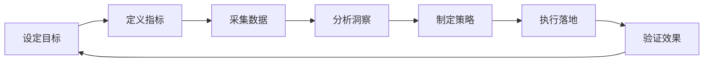
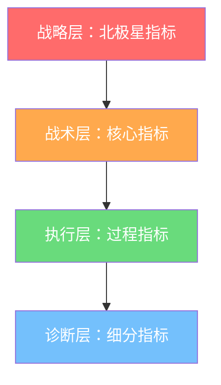
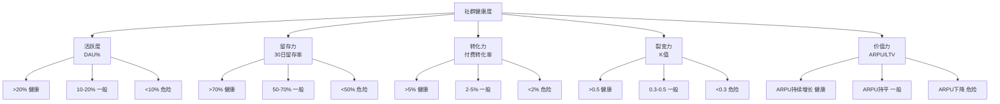

## 六、社群数据化运营

社群运营最常见的失败模式，不是"没有数据"，而是"有数据不看，看了不懂，懂了不做"。很多群主凭直觉发内容、凭感觉搞活动，忙了半年不知道哪个动作有效、哪个是浪费时间。数据化运营的本质，是用可量化的指标替代模糊的"感觉"，让你的每一个运营决策都有据可依、有果可验。

本节将从指标体系搭建、数据采集方法、分析框架、到数据驱动的决策闭环，系统讲解如何把社群运营从"玄学"变成"科学"。

---

### 1. 社群数据化运营的底层逻辑

#### 1.1 什么是数据化运营

数据化运营不是"做报表"，而是一套完整的决策流程：



核心思想可以概括为三句话：

- **可衡量**：每个运营动作都要能被量化，"感觉活跃了"不算，"日发言人数从30提升到80"才算
- **可归因**：每个结果都要能追溯到具体原因，"转化率提升了"要能回答"是因为哪个活动、哪篇文章"
- **可复制**：成功的经验要能被标准化和规模化，"这次活动效果好"要能拆解为"可重复使用的SOP"

#### 1.2 为什么数据化运营是社群变现的基础设施

没有数据化运营的社群，面临三个致命问题：

| 问题 | 表现 | 后果 |
|------|------|------|
| 决策盲区 | 不知道哪个内容最受欢迎，哪个时间段互动最好 | 重复低效动作，浪费运营精力 |
| 归因困难 | 收入波动时找不到原因，不知道钱从哪来 | 无法优化变现路径，收入天花板低 |
| 规模瓶颈 | 靠直觉管理100人还行，500人就顾不过来 | 无法规模化扩张，增长停滞 |

数据化运营解决的不是"锦上添花"的问题，而是"能不能持续赚钱"的问题。

#### 1.3 数据化运营 vs 传统运营对比

| 维度 | 传统运营（凭感觉） | 数据化运营（凭数据） |
|------|-------------------|---------------------|
| 内容决策 | "我觉得大家喜欢这个" | "数据显示这类内容互动率最高" |
| 活动策划 | "上次搞了个活动效果不错" | "上次活动带来37个付费用户，ROI为5.2" |
| 用户分层 | "活跃的就是核心用户" | "按RFM模型分为8个层级，针对性运营" |
| 问题诊断 | "最近群不太活跃了" | "7日留存从82%降到65%，主要流失在入群第3天" |
| 增长策略 | "多发点内容试试" | "A/B测试显示晚8点视频内容带来最高转化" |

---

### 2. 社群运营核心数据指标体系

#### 2.1 指标分层架构

社群数据指标可以按照金字塔模型分为四层：



**战略层（北极星指标）**：整个社群运营体系最终要优化的那个数字，通常与商业目标直接挂钩。例如"月度社群GMV""付费会员续费率""单客年均贡献值"。北极星指标不宜超过2个，多了就等于没有。

**战术层（核心指标）**：直接影响北极星指标的关键运营指标，包括活跃度、留存率、转化率、裂变系数。这些是运营团队日常盯盘的核心数据。

**执行层（过程指标）**：每个具体运营动作的效果度量，包括内容阅读率、活动参与率、客服响应时长、朋友圈互动率等。过程指标用来诊断核心指标的波动。

**诊断层（细分指标）**：按用户分群、时间段、内容类型等维度拆解的细分数据，用于定位具体问题。例如"新用户7日留存""周末vs工作日活跃对比""图文vs视频内容转化对比"。

#### 2.2 核心指标详解与计算公式

**（1）活跃度指标**

活跃度是社群健康的基础指标，但单纯看"发言人数"远远不够。完整的活跃度指标体系包括：

```text
日活跃率(DAU%) = 当日有互动行为的成员数 / 社群总人数 × 100%
周活跃率(WAU%) = 本周至少互动1次的成员数 / 社群总人数 × 100%
月活跃率(MAU%) = 本月至少互动1次的成员数 / 社群总人数 × 100%
DAU/MAU比值 = 日活跃用户数 / 月活跃用户数 × 100%  （衡量用户粘性）
```

不同类型的社群，活跃度基准差异很大：

| 社群类型 | 优秀 | 良好 | 一般 | 危险 |
|----------|------|------|------|------|
| 兴趣社群 | DAU% > 30% | 15%-30% | 8%-15% | < 8% |
| 学习社群 | DAU% > 20% | 10%-20% | 5%-10% | < 5% |
| 行业社群 | DAU% > 15% | 8%-15% | 3%-8% | < 3% |
| 电商社群 | DAU% > 25% | 12%-25% | 5%-12% | < 5% |
| 付费会员群 | DAU% > 40% | 20%-40% | 10%-20% | < 10% |

> **关键洞察**：DAU/MAU比值比单一活跃率更有价值。一个社群MAU是60%，但DAU/MAU只有10%，说明用户只是"偶尔来看看"；如果MAU是40%，但DAU/MAU是35%，说明核心用户几乎天天来，这个社群的商业价值更高。

**（2）留存率指标**

留存率决定了社群是"越来越值钱"还是"越来越不值钱"：

```text
次日留存率 = 第2天仍有互动的成员数 / 第1天新增成员数 × 100%
7日留存率 = 第7天仍有互动的成员数 / 第1天新增成员数 × 100%
30日留存率 = 第30天仍有互动的成员数 / 第1天新增成员数 × 100%
月度留存率 = (月末成员数 - 本月新增) / 月初成员数 × 100%
```

留存率的关键不在于"多少人还留在群里"，而在于"多少人还在活跃"。一个500人的群，400人还在群里但只有30人活跃，说明有370人是"僵尸粉"，实际有效社群规模只有30人。

留存率的"魔法数字"：大多数社群的流失集中在入群后的前7天。如果一个成员能在入群后7天内完成以下动作中的至少3个，其30日留存率会提高到80%以上：

1. 主动发过至少1条消息
2. 参与过至少1次话题讨论
3. 添加过至少1个群内好友
4. 使用过群内的工具或资源
5. 参加过至少1次群活动

因此，入群前7天的运营（"新手引导期"）是数据化运营的第一个关键战场。

**（3）转化率指标**

转化率直接关系到变现效率，需要按转化漏斗分层追踪：

```text
曝光转化率 = 看到推广信息的人数 / 社群总人数 × 100%
点击转化率 = 点击链接的人数 / 看到推广信息的人数 × 100%
付费转化率 = 完成付费的人数 / 点击链接的人数 × 100%
整体转化率 = 完成付费的人数 / 社群总人数 × 100%
复购率 = 二次付费人数 / 首次付费人数 × 100%
```

不同变现模式的转化率基准：

| 变现模式 | 整体转化率（优秀） | 整体转化率（一般） | 客单价区间 |
|----------|-------------------|-------------------|-----------|
| 知识付费（课程） | 8%-15% | 3%-8% | 99-999元 |
| 付费会员制 | 10%-20% | 5%-10% | 199-1999元/年 |
| 电商带货 | 15%-30% | 5%-15% | 50-500元 |
| 咨询服务 | 3%-8% | 1%-3% | 1000-10000元 |
| 广告/品牌合作 | N/A | N/A | 按CPM/CPC计 |

**（4）裂变系数（Viral Coefficient）**

裂变系数决定了社群能否实现自增长：

```text
裂变系数(K值) = 每个用户平均邀请人数 × 邀请转化率
例如：每个用户平均邀请3人，邀请转化率为40%，则K值 = 3 × 0.4 = 1.2

K > 1：自传播增长（指数级增长）
K = 1：平衡状态（不增长不萎缩）
K < 1：依赖外部流量（需要持续投入获客）
```

实际运营中，大多数社群的K值在0.3-0.8之间。K值大于1的社群非常少，通常需要满足：产品本身有很强的"社交货币"属性（分享出去能让人觉得有面子），或者有明确的利益驱动（邀请有奖励）。不要过度追求K > 1，K值在0.5-0.8之间配合稳定的公域获客，是更健康的增长模型。

**（5）LTV（用户生命周期价值）**

LTV是衡量社群变现能力的终极指标：

```text
LTV = ARPU × 用户生命周期（月）
ARPU = 月度总营收 / 月度活跃用户数

例如：月营收5万元，月活用户500人，用户平均生命周期12个月
ARPU = 50000 / 500 = 100元/月
LTV = 100 × 12 = 1200元

获客成本(CAC)如果低于LTV的1/3（即400元），则增长模型健康
```

LTV的关键意义在于：它帮你判断一个社群"值不值得做"。如果LTV只有50元，但获客成本要30元，那这个社群生意就很勉强。如果LTV是2000元，获客成本100元，那就应该全力投入增长。

---

### 3. 数据采集：怎么把数据"拿到手"

#### 3.1 数据采集渠道与方法

| 数据来源 | 采集方式 | 采集数据类型 | 难度 |
|----------|----------|-------------|------|
| 微信群 | 手动统计 / 第三方工具 | 发言人数、发言频次、关键词 | ★★★ |
| 企业微信 | 企微后台API | 客户画像、互动轨迹、标签数据 | ★★☆ |
| 知识星球/小报童 | 平台后台 | 帖子阅读量、点赞、评论 | ★☆☆ |
| 公众号/视频号 | 微信公众平台 | 阅读量、转发、关注来源 | ★☆☆ |
| 小程序/H5页面 | 埋点统计 | 访问路径、点击热图、转化漏斗 | ★★★ |
| 问卷/表单 | 腾讯问卷/金数据 | 用户满意度、需求调研 | ★☆☆ |
| 客服/聊天记录 | 关键词分析 | 常见问题、痛点关键词、情绪 | ★★★ |

#### 3.2 低成本数据采集方案

对于个人运营者或小团队，不需要搭建复杂的数据系统。以下是一套"零成本+低技术门槛"的数据采集方案：

**方案一：Excel/飞书表格手动记录**

适合社群规模 < 500人、团队 < 3人的情况。每天花15-20分钟记录核心数据：

```markdown
## 每日社群运营日报模板

日期：____
群名称：____
群总人数：____

### 今日活跃数据
- 发言人数：____（占比：____%）
- 新增消息数：____
- 新增成员：____
- 退出成员：____
- 净增：____

### 今日内容数据
- 发布内容数量：____
- 最高互动内容：____（互动数：____）
- 互动最低内容：____（互动数：____）

### 今日转化数据
- 咨询人数：____
- 付费人数：____
- 付费金额：____
- 退款人数：____

### 今日异常
- （记录任何异常情况，如投诉、纠纷、特殊反馈）

### 明日计划
- （基于今日数据的调整计划）
```

**方案二：企业微信 + 自动化工具**

适合社群规模 500-5000人、有一定技术基础的团队。企业微信提供了相对完整的数据API：

```python
# 企业微信数据采集示例（伪代码框架）
import requests

class WeComDataCollector:
    def __init__(self, corp_id, secret):
        self.corp_id = corp_id
        self.secret = secret
        self.token = self.get_access_token()
    
    def get_access_token(self):
        url = f"https://qyapi.weixin.qq.com/cgi-bin/gettoken"
        params = {"corpid": self.corp_id, "corpsecret": self.secret}
        resp = requests.get(url, params=params).json()
        return resp.get("access_token")
    
    def get_group_chat_list(self):
        """获取客户群列表"""
        url = f"https://qyapi.weixin.qq.com/cgi-bin/externalcontact/groupchat/list"
        data = {"limit": 100, "status_filter": 0}
        resp = requests.post(url, json=data, params={"access_token": self.token})
        return resp.json()
    
    def get_group_chat_detail(self, chat_id):
        """获取客户群详情：成员列表、群主、创建时间等"""
        url = f"https://qyapi.weixin.qq.com/cgi-bin/externalcontact/groupchat/get"
        data = {"chat_id": chat_id}
        resp = requests.post(url, json=data, params={"access_token": self.token})
        return resp.json()
    
    def get_customer_behavior_data(self, userid):
        """获取客户行为数据：添加时间、互动记录等"""
        url = f"https://qyapi.weixin.qq.com/cgi-bin/externalcontact/get"
        params = {"access_token": self.token, "external_userid": userid}
        resp = requests.get(url, params=params)
        return resp.json()
```

**方案三：第三方社群管理工具**

适合不想写代码、预算在100-500元/月的运营者。主流工具对比：

| 工具 | 价格 | 核心功能 | 适合场景 |
|------|------|----------|---------|
| 微伴助手 | 免费/付费版 | 自动拉群、标签管理、SOP群发 | 企微私域 |
| 尘锋SCRM | 300元/月起 | 客户画像、跟进提醒、数据看板 | 销售型社群 |
| 有赞CRM | 按套餐计费 | 电商数据、会员管理、营销自动化 | 电商社群 |
| 群响 | 299元/年 | 行业社群、资源对接、数据复盘 | 电商/直播行业 |
| 小裂变 | 500元/月起 | 裂变活动、任务宝、社群数据 | 增长型社群 |

#### 3.3 数据采集的关键原则

**原则一：只采集"会用到"的数据**

很多运营者犯的第一个错误是"什么都想采集"，结果数据堆了一堆但从来不看。一个实用的标准是：如果这个数据采集回来，你不确定它能帮你做什么决策，那就先不采。

**原则二：保持数据口径一致**

"活跃人数"今天统计的是"发言的人"，明天统计的是"发言+点赞的人"，后天又变成了"发言+点赞+签到的人"。口径不一致，数据就失去了纵向可比性。在开始采集前，先明确定义每个指标的计算方式，写成文档，团队共享。

**原则三：数据采集要形成自动化习惯**

手动采集只能解决"有没有"的问题，自动化才能解决"持续不持续"的问题。哪怕是最简单的Excel，也要设置好固定模板，每天固定时间填写，形成肌肉记忆。

---

### 4. 数据分析框架：从数字到洞察

#### 4.1 社群健康度诊断模型

用以下"五维健康度模型"，可以快速判断一个社群的整体状态：



实际操作中，建议每周用这个模型做一次"体检"，给每个维度打分（健康=3分，一般=2分，危险=1分），总分15分中拿到10分以上为健康社群，6-9分需要关注，5分以下需要紧急干预。

#### 4.2 留存曲线分析

留存曲线是诊断社群问题最有效的工具。典型的社群留存曲线呈现"L型"——前期快速下降，后期趋于平稳：

```text
留存率
100% |*
     | *
 80% |  *
     |   *
 60% |    *
     |     * *
 40% |        * * *
     |              * * * * *
 20% |                        * * * * * * *
     |____________________________________________
     0   3   7   14  30  60  90       天数
```

关键分析节点：

- **次日留存（Day 1）**：反映入群第一印象。低于60%说明"欢迎流程"有问题——新人进群后没有被正确引导
- **3日留存（Day 3）**：反映价值传递速度。如果Day1到Day3有大幅下降（>15个百分点），说明群内前3天没有给用户足够的"留下来的理由"
- **7日留存（Day 7）**：反映社群核心价值是否成立。7日留存低于40%，需要重新审视社群的核心价值主张
- **30日留存（Day 30）**：反映长期价值。30日留存后的曲线趋于平缓，剩下的用户就是社群的"基本盘"

**实操建议**：每周画一次留存曲线，对比上周数据。如果某周的留存曲线突然下降，排查那周发生了什么（内容质量下降？活动频率降低？群内出现负面事件？）。

#### 4.3 用户分群分析（RFM模型）

借鉴电商领域的RFM模型，可以将社群成员分为8个层级，实施差异化运营：

| 分群 | 最近互动(R) | 互动频次(F) | 消费金额(M) | 运营策略 |
|------|------------|------------|------------|---------|
| 重要价值用户 | 高 | 高 | 高 | VIP维护，专属服务，优先体验 |
| 重要发展用户 | 高 | 低 | 高 | 提升互动频次，邀请参与更多活动 |
| 重要保持用户 | 低 | 高 | 高 | 唤醒召回，了解流失原因 |
| 重要挽留用户 | 低 | 低 | 高 | 紧急召回，提供专属优惠 |
| 一般价值用户 | 高 | 高 | 低 | 引导消费，展示付费内容价值 |
| 一般发展用户 | 高 | 低 | 低 | 培养习惯，逐步建立信任 |
| 一般保持用户 | 低 | 高 | 低 | 保持触达，等待转化时机 |
| 流失用户 | 低 | 低 | 低 | 低成本召回或放弃 |

**实操案例**：一个500人的读书社群，RFM分析发现：
- 重要价值用户（高R高F高M）：28人，贡献了62%的营收
- 重要挽留用户（低R低F高M）：15人，上月消费过但最近2周没互动
- 流失用户（低R低F低M）：180人，30天内无任何互动

运营动作：对28个重要价值用户建立1对1维护群，每周私聊关怀；对15个重要挽留用户发送专属回归优惠券；对180个流失用户先不做动作（投入产出比太低），集中精力在其他6个分群上。

#### 4.4 内容效果分析

每次发布内容后，记录以下数据并按周/月汇总分析：

```markdown
## 内容效果记录表

| 日期 | 内容类型 | 主题 | 发布时间 | 阅读/查看数 | 互动数 | 互动率 | 引导转化数 | 转化率 |
|------|---------|------|---------|------------|--------|--------|-----------|--------|
| 6/1  | 干货文章 | 私域引流方法论 | 晚8点 | 234 | 47 | 20.1% | 8 | 3.4% |
| 6/2  | 案例分享 | 某品牌裂变案例 | 午12点 | 189 | 62 | 32.8% | 3 | 1.6% |
| 6/3  | 互动话题 | 你遇到的最大难题 | 晚9点 | 156 | 89 | 57.1% | 0 | 0% |
| 6/4  | 产品推广 | 新课程上线 | 晚8点 | 201 | 23 | 11.4% | 15 | 7.5% |
```

从这个表格中可以得出：
- **互动率最高**的是互动话题类内容（57.1%），但转化率为0——这类内容用于激活社群氛围，不直接赚钱
- **转化率最高**的是产品推广类内容（7.5%），但互动率偏低——这类内容用于变现，但要控制频率避免打扰
- **综合效率最高**的是干货文章——既有不错的互动率（20.1%），又有可观的转化率（3.4%）

结论：内容运营的最优配比大约是 干货内容60% + 互动内容25% + 推广内容15%。

#### 4.5 时间维度分析

不同时间段的用户行为差异巨大，找到"黄金时间"可以事半功倍：

| 时间段 | 用户行为特征 | 适合发布的内容 | 互动率参考 |
|--------|-------------|---------------|-----------|
| 早7:00-8:30 | 通勤碎片时间，浏览为主 | 早报、金句、短内容 | 8%-15% |
| 午12:00-13:30 | 午休时间，有空参与互动 | 话题讨论、投票、轻松内容 | 15%-25% |
| 晚18:00-19:30 | 下班通勤，信息接收高峰 | 干货文章、行业资讯 | 12%-20% |
| 晚20:00-22:00 | 黄金时间，深度参与 | 直播、分享会、课程、推广 | 20%-40% |
| 周末全天 | 自由时间充裕 | 活动、打卡、深度内容 | 较工作日+30%-50% |

> **注意**：以上数据仅为参考基准。每个社群的最佳发布时间不同，必须通过自己的数据来验证。方法很简单：同样的内容在不同时间段发布，记录互动数据，测试2-3周就能得出结论。

---

### 5. 数据驱动的决策闭环

#### 5.1 周度数据复盘SOP

每周固定时间（建议周日晚上或周一早上）进行30分钟的数据复盘：

**第一步：拉数据（5分钟）**

整理本周的核心数据：活跃度、留存率、转化率、营收、新增/流失人数。

**第二步：看趋势（5分钟）**

对比上周数据，标注变化幅度 > 10%的指标。只关注"异常值"，不需要逐个分析。

**第三步：找原因（10分钟）**

对异常值进行归因分析。问自己三个问题：
1. 这个变化是"一次性波动"还是"趋势性变化"？（看连续3周数据）
2. 这个变化和我做的哪个运营动作有关？（回溯本周运营日志）
3. 外部因素有没有影响？（节假日、行业事件、竞品动作）

**第四步：定动作（10分钟）**

基于分析结论，确定下周的1-3个核心运营动作。不要贪多，每周聚焦解决1-2个问题就够了。

#### 5.2 月度深度分析模板

```markdown
## 社群月度数据报告模板

### 一、本月概览
- 月初人数：____  →  月末人数：____（净增 ____）
- 月度总营收：____元（环比 ____%）
- 付费用户数：____（转化率 ____%）
- ARPU：____元/人

### 二、核心指标趋势
| 指标 | 上月 | 本月 | 变化 | 判断 |
|------|------|------|------|------|
| 日活跃率 | | | | ↑/→/↓ |
| 30日留存率 | | | | ↑/→/↓ |
| 付费转化率 | | | | ↑/→/↓ |
| 裂变系数 | | | | ↑/→/↓ |
| ARPU | | | | ↑/→/↓ |

### 三、本月TOP3亮点
1. （具体事件 + 数据佐证）
2.
3.

### 四、本月TOP3问题
1. （具体问题 + 影响程度 + 根因分析）
2.
3.

### 五、用户分群变化
- 重要价值用户：____人（上月 ____人）
- 流失用户：____人（新增流失 ____人）

### 六、下月计划
1. 重点优化方向：
2. 核心运营动作：
3. 目标数据：
```

#### 5.3 A/B测试方法论

数据化运营的高阶应用是A/B测试——用实验代替猜测：

**适合做A/B测试的场景：**

- 发送时间：同样的内容，A组早上8点发，B组晚上8点发
- 内容形式：同样的主题，A组用图文，B组用短视频
- 转化话术：同样的产品，A组强调"限时优惠"，B组强调"已有XXX人购买"
- 入群引导：同样的社群，A组用欢迎语+自我介绍，B组用欢迎语+破冰任务

**A/B测试的操作规范：**

1. **一次只测一个变量**：如果你同时改了发送时间和内容形式，就不知道是哪个因素起了作用
2. **样本量要足够**：每组至少30人以上才有统计意义。一个50人的群不适合做A/B测试
3. **测试周期要够长**：至少持续1周，避免单日波动干扰结论
4. **记录要完整**：每次测试都要记录假设、方案、结果、结论，形成知识库

```markdown
## A/B测试记录模板

测试名称：____
测试时间：____ 致 ____
测试假设：我们认为____会带来____的提升

| 维度 | A组（对照组） | B组（实验组） |
|------|-------------|-------------|
| 样本量 | | |
| 具体方案 | | |
| 核心指标 | | |
| 测试结果 | | |

结论：____
下一步：____
```

---

### 6. 数据看板搭建

#### 6.1 最简数据看板（适合个人运营者）

不需要任何技术工具，一个飞书多维表格或Notion数据库就能搞定：

```text
【看板核心模块】

模块一：实时仪表盘
├── 今日活跃人数 / 活跃率
├── 本周新增 / 流失 / 净增
├── 本周营收 / 目标完成率
└── 异常预警（红色标记低于阈值的指标）

模块二：趋势图表
├── 30天活跃度趋势线
├── 30天营收趋势线
└── 留存曲线（按周对比）

模块三：用户画像
├── 分群分布饼图
├── 新用户来源分布
└── 付费用户画像标签云

模块四：内容分析
├── 本周TOP5内容（按互动排序）
├── 内容类型效果对比柱状图
└── 最佳发布时间热力图
```

#### 6.2 进阶数据看板（适合团队运营者）

对于有技术能力的团队，可以用以下工具搭建自动化数据看板：

| 方案 | 工具 | 成本 | 适合规模 | 优势 |
|------|------|------|---------|------|
| 轻量方案 | 飞书多维表格 + 自动化 | 免费 | 1-3个群 | 零代码，上手快 |
| 中等方案 | 腾讯云HiFlow + 企业微信 | 100元/月 | 3-20个群 | 自动化采集，实时看板 |
| 专业方案 | Metabase + PostgreSQL | 服务器成本 | 20个群以上 | 完全自定义，数据能力强 |
| 全能方案 | 神策/GrowingIO | 500元/月起 | 团队级运营 | 用户行为全链路追踪 |

#### 6.3 数据预警机制

设置自动化预警，在指标异常时第一时间收到通知：

```python
# 数据预警规则示例
ALERT_RULES = {
    "活跃度暴跌": {
        "condition": "DAU% < 前7日均值的50%",
        "level": "紧急",
        "action": "立即检查是否群内出现负面事件，增加互动内容发布"
    },
    "留存率下降": {
        "condition": "7日留存率连续3天低于上月均值",
        "level": "重要",
        "action": "排查入群引导流程，检查新手期内容质量"
    },
    "转化率异常": {
        "condition": "周转化率 < 上月周均值的60%",
        "level": "重要",
        "action": "检查推广话术和产品定价是否需要调整"
    },
    "大量退群": {
        "condition": "单日退群人数 > 总人数的3%",
        "level": "紧急",
        "action": "立即排查退群原因，查看是否有人发广告或群内出现纠纷"
    }
}
```

---

### 7. 数据化运营的常见误区

#### 误区一：只看"虚荣指标"

**表现**：关注总人数、总消息数这些"看起来好看"但不能指导决策的数字。群有5000人，实际活跃的只有200人，但只盯着5000这个数字沾沾自喜。

**纠正**：关注"可行动指标"——那些数据变化后，你能明确知道该做什么的指标。例如"日活跃人数"比"总人数"更可行动，因为日活跃下降了你知道要去增加互动，但总人数少了你只知道"有人退群了"，不知道该做什么。

#### 误区二：数据采集了但从不分析

**表现**：每天勤勤恳恳记录数据，Excel表格里已经有几百行数据了，但从来没做过分析，数据只是躺在那里"自我感动"。

**纠正**：遵循"采集即分析"原则——每次采集数据的同时，花2分钟在旁边写一句"今天的发现"。一个月后回看这些"发现"，往往比复杂的报表更有洞察。

#### 误区三：过度依赖数据，忽视直觉和用户体验

**表现**：所有决策都等数据说话，不敢尝试没有数据支撑的新方法。数据告诉你"图文效果好"，就永远不做视频。

**纠正**：数据是"方向盘"不是"发动机"。数据告诉你往哪里走（优化什么），但创新和突破往往来自对用户需求的直觉理解。保持70%数据驱动 + 30%直觉创新的配比。

#### 误区四：忽视数据的"颗粒度"

**表现**：只看整体平均数，不看细分维度。整体转化率是5%，看起来"还行"，但拆开看发现新用户转化率是12%、老用户转化率只有1%——老用户根本没有被有效运营。

**纠正**：养成"看到平均数就拆开看"的习惯。任何平均数背后都藏着巨大的差异，拆解才能发现真正的问题和机会。

#### 误区五：追求大而全的数据系统

**表现**：一上来就想搭建完美的数据中台，花大量时间在工具选型和系统搭建上，三个月后还没开始采集第一条数据。

**纠正**：先用Excel手动记录跑通流程，确认哪些数据真的有用之后，再逐步自动化。"先有数据再优化采集"，而不是"先搭系统再开始采集"。

---

### 8. 进阶：数据化运营的高级玩法

#### 8.1 用户生命周期价值预测

通过历史数据建立简单的LTV预测模型：

```python
# 简化版LTV预测模型
def predict_ltv(user_data):
    """
    基于用户前30天行为预测其生命周期价值
    user_data包含：入群天数、互动次数、消费金额、分享次数
    """
    # 互动频率得分（0-100）
    interaction_score = min(user_data['interactions'] / 30 * 100, 100)
    
    # 消费倾向得分（0-100）
    if user_data['purchase_amount'] > 0:
        purchase_score = min(user_data['purchase_amount'] / 500 * 100, 100)
    else:
        purchase_score = 0
    
    # 分享倾向得分（0-100）
    share_score = min(user_data['shares'] / 5 * 100, 100)
    
    # 综合得分
    composite_score = (interaction_score * 0.3 + 
                      purchase_score * 0.5 + 
                      share_score * 0.2)
    
    # 预测生命周期（月）
    if composite_score >= 80:
        predicted_lifetime = 18  # 高价值用户
    elif composite_score >= 50:
        predicted_lifetime = 9   # 中等用户
    else:
        predicted_lifetime = 3   # 低价值用户
    
    # 预测月均消费
    monthly_arpu = user_data['purchase_amount'] / max(user_data['days'] / 30, 1)
    
    predicted_ltv = monthly_arpu * predicted_lifetime
    return {
        'score': composite_score,
        'predicted_lifetime_months': predicted_lifetime,
        'predicted_ltv': predicted_ltv
    }
```

#### 8.2 流失预警模型

提前识别"即将流失"的用户，在他们离开之前进行干预：

| 预警信号 | 定义 | 干预措施 |
|----------|------|---------|
| 黄色预警 | 互动频率较前7天下降50%以上 | 自动发送关怀消息，推荐近期优质内容 |
| 橙色预警 | 连续5天无任何互动 + 曾经是活跃用户 | 1对1私聊了解情况，发送专属福利 |
| 红色预警 | 连续14天无互动 + 未响应前两次干预 | 最后一次高价值触达（免费资料/优惠券），无效则放弃 |

#### 8.3 社群数据的"北极星指标"选择

不同类型社群应该选择不同的北极星指标：

| 社群类型 | 推荐北极星指标 | 原因 |
|----------|---------------|------|
| 知识付费社群 | 课程完课率 × 续费率 | 完课率代表内容价值，续费率代表用户认可 |
| 电商社群 | 月度GMV × 复购率 | GMV代表营收规模，复购率代表用户粘性 |
| 行业资源社群 | 有效对接次数 × 对接成功率 | 资源对接是核心价值，成功率代表质量 |
| 兴趣社群 | 月度UGC数量 × UGC互动率 | UGC代表社群活力，互动率代表社区质量 |
| 品牌私域社群 | 会员渗透率 × 会员ARPU | 渗透率代表覆盖能力，ARPU代表变现能力 |

---

### 9. 从0到1搭建数据化运营体系的路线图

如果你的社群目前完全没有数据化运营，按以下步骤逐步搭建：

**第一阶段（第1-2周）：手动采集期**
- 确定你的社群类型和北极星指标
- 设计日报模板，每天花15分钟手动记录核心数据
- 用Excel或飞书表格建立数据记录表
- 目标：形成采集数据的习惯

**第二阶段（第3-4周）：基础分析期**
- 积累2周数据后，开始做趋势分析
- 画留存曲线，找留存"断崖"
- 做第一次用户分群（简单的活跃/沉默/流失三级分群）
- 目标：能回答"我的社群现在是什么状态"

**第三阶段（第5-8周）：数据驱动期**
- 建立周度复盘SOP，每周花30分钟分析数据
- 开始做A/B测试，用实验验证假设
- 根据数据调整内容策略和活动策略
- 目标：每个运营决策都能说出"因为数据显示..."

**第四阶段（第9-12周）：自动化升级期**
- 引入工具自动化数据采集
- 搭建数据看板，实现核心数据实时可见
- 建立预警机制，异常数据自动通知
- 目标：数据化运营体系自运转

**第五阶段（第13周+）：精细化运营期**
- 深度用户分群，差异化运营策略
- LTV预测模型，优化获客投入产出比
- 预测性分析，提前预判趋势变化
- 目标：数据化运营成为核心竞争力

---

### 10. 核心要点回顾

| 要点 | 关键内容 |
|------|---------|
| 数据化运营的本质 | 可衡量、可归因、可复制的决策流程 |
| 指标分层 | 战略层（北极星）→ 战术层（核心指标）→ 执行层（过程指标）→ 诊断层（细分指标） |
| 五大核心指标 | 活跃度、留存率、转化率、裂变系数、LTV |
| 数据采集原则 | 只采会用的、保持口径一致、形成自动化习惯 |
| 分析方法 | 健康度五维诊断 + 留存曲线 + RFM分群 + 内容效果矩阵 |
| 决策闭环 | 周度复盘（30分钟）+ 月度深度分析 + A/B测试验证 |
| 常见误区 | 虚荣指标、只采不分析、过度数据依赖、忽视颗粒度、追求大而全 |
| 搭建路线 | 手动采集 → 基础分析 → 数据驱动 → 自动化 → 精细化 |
