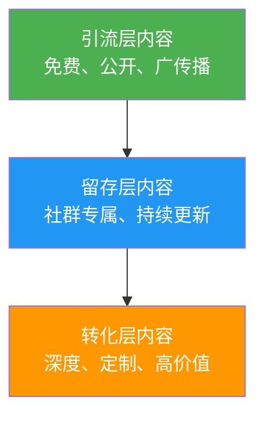
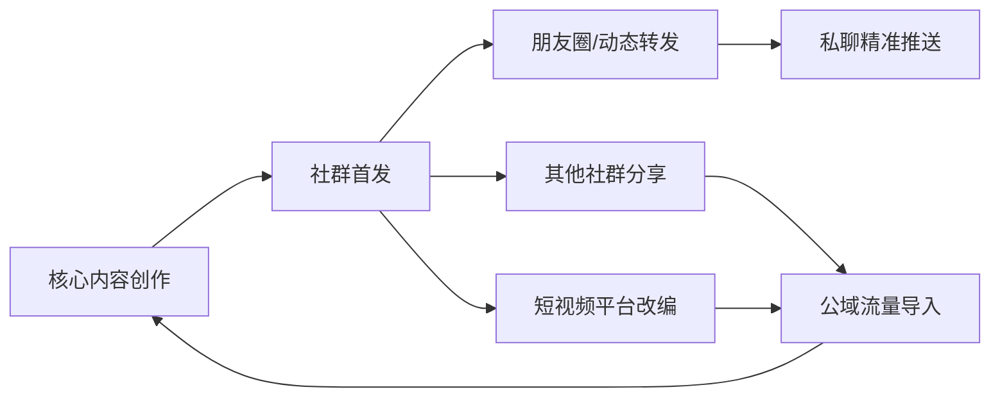
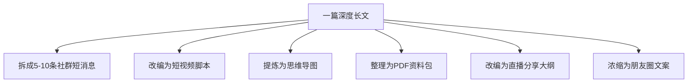
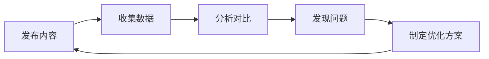
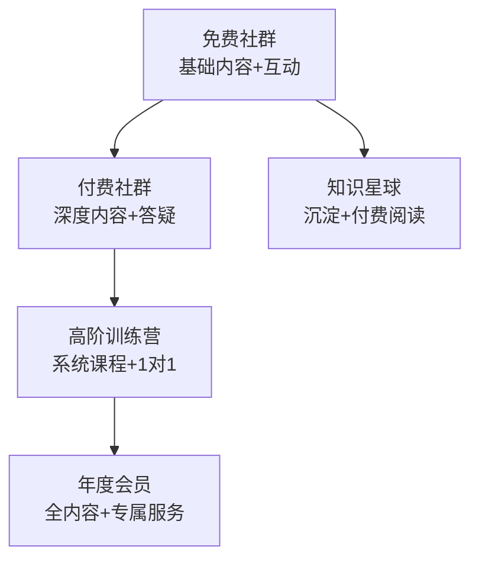

## 八、社群内容运营技巧

社群的本质是"人以群分"，而让这群人持续留下来、活跃起来、最终愿意付费的核心驱动力就是**内容**。内容是社群的血液——没有优质内容的社群，就像没有节目的电视台，观众迟早会换频道。

社群内容运营不是简单地"发文章"或"转链接"，而是一套从用户需求洞察到内容生产、分发、互动、迭代的完整体系。本节将从底层逻辑出发，系统讲解社群内容运营的方法论与实操技巧。

### 1. 社群内容运营的本质

#### 1.1 什么是社群内容运营

社群内容运营是指围绕社群定位和用户需求，有计划地策划、生产、分发和优化内容，以实现用户活跃、信任建立和商业变现的系统性工作。

它与普通内容运营的核心区别在于：

| 维度 | 普通内容运营 | 社群内容运营 |
|------|------------|------------|
| 受众关系 | 弱关系（粉丝/读者） | 强关系（成员/伙伴） |
| 内容形式 | 单向输出为主 | 双向互动为主 |
| 反馈周期 | 长（看阅读量） | 短（实时互动） |
| 核心目标 | 流量与曝光 | 信任与转化 |
| 内容来源 | PGC（专业生产） | PGC + UGC（用户生产） |
| 运营节奏 | 平台算法驱动 | 社群生命周期驱动 |

#### 1.2 内容在社群中的三大功能

**信任建设功能**：持续输出有价值的内容，让成员感受到"这个社群值得待"。信任是变现的前提，没有信任的社群就是一盘散沙。

**活跃维持功能**：定期的内容刺激是防止社群变成"死群"的核心手段。数据显示，每周发布 3 次以上优质内容的社群，30 天留存率比低频社群高出 65%。

**价值传递功能**：通过内容将社群主理人的专业知识、行业洞察和方法论传递给成员，形成"知识差"，这是社群付费的基础。

#### 1.3 内容运营的"三层金字塔"模型



- **引流层**：公开的干货文章、短视频、直播切片，目的是吸引新用户进入社群
- **留存层**：社群内部的日报/周报、专题分享、问答互动，目的是让用户持续活跃
- **转化层**：深度课程、一对一咨询、私密资源，目的是实现商业变现

三层内容缺一不可。只有引流层，社群留不住人；只有留存层，社群无法增长；只有转化层，社群缺乏信任基础。

### 2. 内容规划体系

#### 2.1 建立内容支柱（Content Pillars）

内容支柱是社群内容的"骨架"，决定了你发什么、不发什么。一个好的社群通常有 3-5 个内容支柱，每个支柱对应用户的一类核心需求。

**确定内容支柱的四步法**：

**第一步：用户需求调研**

通过问卷、访谈、社群聊天记录分析，找出成员最关心的 5-10 个话题。调研工具推荐使用腾讯问卷或金数据，问题设计示例：

```text
1. 你加入本社群最想获得什么？（多选）
   □ 行业资讯  □ 实操技巧  □ 人脉资源  □ 案例分析  □ 其他：____
2. 你希望社群内容的更新频率是？
   □ 每天  □ 每周3-4次  □ 每周1-2次  □ 每周1次即可
3. 你最喜欢的内容形式是？（最多选3项）
   □ 图文  □ 短视频  □ 直播  □ 音频  □ 思维导图  □ 模板工具
```

**第二步：话题聚类分析**

将调研结果进行聚类，合并相似话题。例如"涨粉技巧""引流方法""获客策略"可以归为一个支柱。

**第三步：匹配自身优势**

选择自己擅长且有持续产出能力的领域。不要贪多，3-5 个支柱足够。

**第四步：设计内容配比**

每个支柱占总内容的比例要合理。推荐配比：

| 内容支柱类型 | 占比 | 说明 |
|------------|------|------|
| 干货知识类 | 40% | 核心价值输出，建立专业形象 |
| 互动讨论类 | 25% | 话题讨论、问答、投票 |
| 案例分享类 | 20% | 真实案例拆解，增强说服力 |
| 福利资源类 | 10% | 模板、工具包、独家资源 |
| 情感连接类 | 5% | 日常分享、节日祝福、成员故事 |

**内容支柱示例**（以"自媒体运营"社群为例）：

| 支柱名称 | 内容方向 | 更新频率 | 内容形式 |
|----------|---------|---------|---------|
| 平台算法解读 | 各平台最新规则、流量机制 | 每周 2 次 | 图文+截图 |
| 爆款内容拆解 | 热门内容的结构分析 | 每周 1 次 | 长图文 |
| 实操工具推荐 | 效率工具、数据分析工具 | 每周 1 次 | 图文+链接 |
| 学员案例分享 | 成员成功案例复盘 | 每两周 1 次 | 图文/视频 |
| 行业热点速递 | 平台政策变化、行业动态 | 实时 | 短消息+点评 |

#### 2.2 制定内容日历

内容日历是将内容规划落地的关键工具。它解决三个问题：发什么、什么时候发、谁来发。

**月度内容日历模板**：

```markdown
## 2026年7月 社群内容日历

### 第1周（7.1-7.7）
| 日期 | 星期 | 内容主题 | 支柱分类 | 形式 | 负责人 | 状态 |
|------|------|---------|---------|------|--------|------|
| 7/1 | 二 | 6月社群数据复盘 | 互动讨论 | 图文 | 主理人 | 待创作 |
| 7/2 | 三 | 小红书算法7月更新解读 | 平台算法 | 图文 | 编辑A | 待创作 |
| 7/3 | 四 | 爆款标题的10个公式 | 干货知识 | 长图文 | 主理人 | 待创作 |
| 7/4 | 五 | 本周热点速递 | 行业热点 | 短消息 | 编辑B | 待创作 |
| 7/5 | 六 | 学员@张三 的涨粉复盘 | 案例分享 | 图文 | 学员 | 已联系 |
| 7/6 | 日 | 休息 | - | - | - | - |
| 7/7 | 一 | 下周预告+本周精华汇总 | 互动讨论 | 图文 | 主理人 | 待创作 |

### 第2周 ...
```

**制定内容日历的注意事项**：

1. **节奏感**：固定时间发布，培养成员的"期待感"。比如每周三晚上 8 点的"干货分享"，成员会主动等待
2. **多样性**：同一支柱不要连续发布同一形式的内容，图文→视频→互动交替进行
3. **预留弹性**：留出 20% 的内容位给临时热点和突发灵感
4. **提前储备**：至少提前一周准备内容素材，避免"临时抱佛脚"

#### 2.3 内容选题的"四象限法"

用两个维度对选题进行评估：**用户需求度**（高/低）× **自身优势度**（高/低）

| | 自身优势高 | 自身优势低 |
|---|----------|----------|
| **用户需求高** | ⭐ 核心选题（优先做） | 🤝 合作选题（找外援） |
| **用户需求低** | 💡 培养选题（偶尔做） | ❌ 放弃选题（不做） |

核心选题是社群内容的"主力产品"，要花最多精力打磨。合作选题可以邀请嘉宾分享或联合创作。培养选题用来试探市场反应，如果反馈好可以升级为核心选题。

### 3. 内容创作方法论

#### 3.1 社群内容的八种类型

**（1）干货教程类**

这是社群内容的"硬通货"。特点是实用、可操作、有明确的步骤。

创作公式：**痛点引入 → 原理讲解 → 步骤拆解 → 案例验证 → 工具推荐**

示例结构：
```text
【标题】小红书起号7天破1000粉的完整方法

一、为什么大多数新号做不起来？（痛点）
二、平台推荐机制的底层逻辑（原理）
三、7天起号的具体操作步骤
   - Day 1-2：账号定位与包装
   - Day 3-4：内容储备与发布
   - Day 5-7：互动策略与数据优化
四、学员实操案例：从0到1200粉的全过程（案例）
五、需要用到的工具清单（工具）
```

**（2）案例拆解类**

真实案例是最好的教学素材。拆解别人或自己的成功/失败案例。

创作公式：**案例背景 → 关键决策 → 执行过程 → 数据结果 → 可复用的方法论**

关键原则：必须有真实数据支撑，不能编造。哪怕是小数据也比没有数据强。

**（3）热点解读类**

对行业热点事件进行分析，输出自己的观点。这类内容时效性强，能快速引发讨论。

创作公式：**事件概述 → 多角度分析 → 对普通人的影响 → 行动建议**

时效要求：热点事件发生后 24 小时内发布，超过 48 小时基本失去价值。

**（4）互动讨论类**

抛出一个开放性问题或争议性话题，引导成员讨论。这是激活沉默成员的最佳手段。

设计要点：
- 问题要具体，不要太大太空。"你怎么看自媒体？"→ "你觉得 2026 年小红书还能做吗？"
- 主理人要先表态，降低成员发言的心理门槛
- 及时回复每一条讨论，让成员感受到被重视
- 优质回复可以整理成"精华合集"二次传播

**（5）资源工具类**

分享实用的工具、模板、资料包。这类内容的收藏率和转发率最高。

创作要点：
- 资源要经过筛选和验证，不要直接转链接
- 附上使用场景和操作说明
- 定期更新（工具会过期、链接会失效）

**（6）问答解惑类**

收集成员的高频问题，统一解答。可以做成"每周 QA"固定栏目。

操作流程：
1. 每周初收集问题（群内接龙或表单）
2. 筛选出 5-8 个高频/高质量问题
3. 详细撰写回答（不只是几句话，要有深度）
4. 整理成文档发布，方便后续查阅

**（7）直播/语音类**

实时互动的内容形式，信任感最强。适合深度分享、连麦答疑、实操演示。

频率建议：每周 1-2 次，每次 30-60 分钟。频率太高成员疲劳，太低缺乏互动感。

**（8）成员故事类**

分享社群成员的成长故事和成功经验。这是最强的"社会证明"。

创作要点：
- 选择有代表性的成员（不同背景、不同阶段）
- 突出"转变"——加入社群前后的对比
- 让成员自己讲述，主理人整理润色
- 获得成员授权后再发布

#### 3.2 标题撰写的实战技巧

社群内容的标题不需要像公众号那样"标题党"，但也不能平淡无奇。好的社群内容标题应该让成员产生"这个我需要看"的感觉。

**六种高效标题公式**：

| 公式 | 示例 | 适用场景 |
|------|------|---------|
| 数字+结果 | "3个方法让社群活跃度提升200%" | 干货教程 |
| 问题+悬念 | "为什么你的社群总是没人说话？" | 互动讨论 |
| 身份+经验 | "从月薪3000到年入50万的自由职业者分享" | 案例故事 |
| 时效+热点 | "刚刚！小红书发布新规，影响所有创作者" | 热点解读 |
| 对比+颠覆 | "90%的人不知道的社群运营真相" | 认知分享 |
| 工具+场景 | "这5个工具让我的内容效率提升10倍" | 资源推荐 |

#### 3.3 内容创作的效率工具

| 环节 | 推荐工具 | 用途 |
|------|---------|------|
| 选题灵感 | 新榜、飞瓜数据、蝉妈妈 | 查看各平台热门话题和爆款内容 |
| 文案写作 | ChatGPT、Claude、Kimi | 初稿生成、润色改写、标题优化 |
| 图片设计 | Canva、创客贴、稿定设计 | 封面图、配图、海报制作 |
| 思维导图 | Xmind、幕布、ProcessOn | 内容结构梳理、知识框架搭建 |
| 视频剪辑 | 剪映、CapCut、必剪 | 短视频、直播切片制作 |
| 数据分析 | 各平台后台、灰豚数据 | 内容效果分析、用户画像研究 |
| 内容管理 | 飞书文档、Notion、语雀 | 内容日历管理、素材库建设 |
| 自动化分发 | 群响、微伴助手、企业微信 | 多群同步分发、定时发布 |

### 4. 内容分发策略

#### 4.1 发布时间的选择

社群内容的发布时间直接影响打开率和互动率。不同类型的社群有不同的最佳发布时间：

| 社群类型 | 最佳发布时间 | 原因 |
|----------|------------|------|
| 职场/副业类 | 工作日 20:00-22:00 | 下班后的学习时间 |
| 宝妈/育儿类 | 上午 9:00-11:00 | 孩子上学/午睡时间 |
| 创业/商业类 | 工作日 12:00-13:00 | 午休时间碎片化阅读 |
| 兴趣/爱好类 | 周末 10:00-12:00 | 休闲时间 |
| 学生/考试类 | 晚上 21:00-23:00 | 自习结束后 |

**验证方法**：不要完全照搬通用数据，在自己社群进行 A/B 测试。选择连续两周，同一类型内容分别在不同时间段发布，对比互动数据，找到自己社群的"黄金时间"。

#### 4.2 内容分发的"涟漪模型"

社群内容不是"发了就完"，而是要像涟漪一样层层扩散：



**第一圈：社群首发**——核心内容在社群内首发，给成员"专属感"和"优先权"。

**第二圈：社交扩散**——将精华内容同步到朋友圈、其他社群，扩大影响力。

**第三圈：公域改编**——将社群内容改编为公域平台的短视频、图文，用于引流。

**回流机制**——公域内容引导新用户加入社群，形成闭环。

#### 4.3 多群同步分发的注意事项

当社群规模扩大到多个群时，内容分发需要注意：

1. **差异化调整**：不同群的成员画像可能不同，标题和开头要微调
2. **错峰发布**：不要所有群同一秒发，间隔 5-10 分钟，避免被平台判定为营销号
3. **互动分流**：引导各群在各自群内讨论，不要互相串群
4. **数据分开统计**：每个群的互动数据单独记录，便于后续差异化运营

### 5. 互动型内容设计

#### 5.1 互动内容的"钩子"设计

互动型内容的核心是"钩子"——一个让成员忍不住参与的设计元素。

**七种高效互动钩子**：

**（1）投票/选择题**
```text
📊 本周话题投票：
你在做自媒体时，最大的卡点是？
A. 不知道写什么（选题困难）
B. 写出来没人看（流量焦虑）
C. 不知道怎么赚钱（变现迷茫）
D. 坚持不下来（执行力不足）

投票后在评论区说说你的具体情况，我来针对性解答！
```

**（2）接龙/共创**
```text
📝 来一次"资源接龙"！
规则：每人分享一个你正在用的效率工具 + 一句话说明用途
我先来：Notion —— 用来管理所有内容素材和日程
轮到你了 👇
```

**（3）打卡/挑战**
```text
🔥 7天内容创作挑战（第3期）
Day 1：写下你的账号定位（一句话）
Day 2：列出10个选题
Day 3：完成第一篇内容的初稿
...
完成全部7天打卡的同学，获得1次免费内容诊断机会！
```

**（4）晒单/展示**
```text
📸 成果展示时间！
把你本周最满意的一条内容截图发出来
大家互相点评，点赞最多的下周获得"社群之星"称号 🏆
```

**（5）答疑/提问**
```text
❓ 本周问答时间！
规则：
1. 在群里发送你的问题，格式：【提问】+具体问题
2. 我会在今晚8点统一回答
3. 优质问题会被收录到社群精华库
```

**（6）故事/分享**
```text
💬 故事分享：你是什么契机开始做副业的？
每个人的故事都是独一无二的，你的经历可能正好帮到其他人。
可以打字，也可以发语音，形式不限。
```

**（7）测试/诊断**
```text
🔍 社群健康度自测：
回答以下问题，每项1-5分：
1. 你每周在群里发言几次？
2. 你认识群里多少人？
3. 你在群里获得过几次帮助？
4. 你愿意向朋友推荐这个群吗？
总分低于12分的同学，找我私聊，我帮你找到问题所在。
```

#### 5.2 互动内容的运营节奏

不是所有互动都要主理人发起。建立"三级互动体系"：

| 层级 | 触发者 | 频率 | 内容类型 |
|------|--------|------|---------|
| 一级互动 | 主理人 | 每周 2-3 次 | 深度分享、直播、大型活动 |
| 二级互动 | 管理员/KOC | 每天 1 次 | 话题讨论、打卡提醒、资源分享 |
| 三级互动 | 普通成员 | 随时 | 日常交流、互相帮助、经验分享 |

主理人的精力应该放在一级互动上，二级互动交给管理员和核心成员，三级互动是社群的自然生态。

### 6. 用户生成内容（UGC）管理

#### 6.1 激励 UGC 的方法

用户生成内容是社群最宝贵的资产。它不仅减轻了主理人的内容压力，还增强了成员的归属感和参与感。

**UGC 激励的五种机制**：

**（1）荣誉激励**
- 设立"每周之星""最佳分享""社群贡献者"等称号
- 在社群公告中展示优秀成员
- 颁发电子证书或实体勋章

**（2）资源激励**
- 优质 UGC 贡献者获得独家资料包
- 优先参与付费活动或课程
- 获得主理人一对一咨询机会

**（3）曝光激励**
- 优质内容在社群置顶展示
- 推荐到公众号/短视频等公域平台
- 在行业活动中推荐展示

**（4）收益激励**
- UGC 被采纳后获得分成
- 优秀案例分享者获得推荐费
- 联合创作内容的收益共享

**（5）社交激励**
- 优质贡献者进入核心圈子
- 获得与行业大咖交流的机会
- 参与社群决策和规划

#### 6.2 UGC 质量控制

鼓励 UGC 不等于放任低质量内容。需要建立质量控制机制：

1. **发布规范**：制定社群内容发布指南，明确格式、字数、主题要求
2. **审核机制**：设置"先审后发"或"事后巡查"，及时处理低质量内容
3. **反馈机制**：对 UGC 给出具体的改进建议，而不是简单地"不错""加油"
4. **标杆示范**：定期展示高质量 UGC 的范例，让成员知道什么是"好内容"
5. **培训赋能**：提供 UGC 创作教程，帮助成员提升内容能力

#### 6.3 UGC 的二次利用

成员产生的优质内容不应只停留在社群内，可以进行二次利用：

- **整理成合集**：将同类 UGC 整理成专题文档，如"100 位学员的涨粉经验"
- **改编成案例**：将成员经验改编成公开的案例文章，用于引流
- **制作成课程素材**：将成员的真实问题和解答纳入课程内容
- **沉淀为知识库**：建立社群 Wiki，将所有优质 UGC 分类归档

### 7. 内容复用与素材管理

#### 7.1 内容复用的"一鱼多吃"策略

一篇优质内容不应该只用一次。通过形式转换和平台适配，让同一内容在不同场景发挥最大价值：



**内容复用的转化矩阵**：

| 原始形式 | 可转化形式 | 转化要点 |
|----------|-----------|---------|
| 长图文 | 短消息、思维导图、PDF | 提炼核心观点，去掉铺垫 |
| 直播回放 | 短视频切片、图文笔记 | 每个切片聚焦一个知识点 |
| 问答记录 | FAQ文档、短视频 | 分类整理，补充完善 |
| 案例分享 | 故事文、对比图表 | 增加数据可视化 |
| 语音分享 | 文字稿、短音频 | 转写后润色 |

#### 7.2 素材库建设

高效的内容运营离不开完善的素材库。建议按以下结构建立：

```text
素材库/
├── 选题库/
│   ├── 待开发选题.md
│   ├── 已完成选题.md
│   └── 热点选题追踪.md
├── 案例库/
│   ├── 成功案例/
│   └── 失败案例/
├── 金句库/
│   ├── 行业大佬语录.md
│   └── 数据与事实.md
├── 图片素材/
│   ├── 封面模板/
│   ├── 配图/
│   └── 表情包/
├── 工具清单/
│   └── 常用工具与链接.md
└── 模板库/
    ├── 文章模板/
    ├── 海报模板/
    └── 日历模板/
```

**素材收集的日常习惯**：

- 每天花 15 分钟浏览行业资讯，将有价值的信息存入选题库
- 看到好的案例、数据、金句随手收藏，定期整理到对应库中
- 每周花 30 分钟盘点素材库，清理过期内容，补充新素材
- 每月做一次素材库大检查，确保分类清晰、内容更新

### 8. 数据驱动的内容优化

#### 8.1 社群内容的核心数据指标

| 指标 | 计算方式 | 健康值 | 说明 |
|------|---------|--------|------|
| 内容打开率 | 打开人数 / 群总人数 | >30% | 衡量内容吸引力 |
| 互动参与率 | 参与互动人数 / 打开人数 | >15% | 衡量内容互动性 |
| 内容转发率 | 转发人数 / 打开人数 | >5% | 衡量内容传播价值 |
| UGC 产出率 | UGC 条数 / 群总人数 | >10% | 衡量社群活跃度 |
| 问题提出率 | 提问人数 / 群总人数 | >5% | 衡量成员信任度 |
| 沉默成员占比 | 7天未发言人数 / 群总人数 | <40% | 衡量社群健康度 |

#### 8.2 数据分析与优化闭环



**周度数据复盘模板**：

```markdown
## 第X周 社群内容数据复盘

### 本周发布内容统计
| 序号 | 内容主题 | 类型 | 打开率 | 互动率 | 转发率 | 评分 |
|------|---------|------|--------|--------|--------|------|
| 1 | xxx | 干货 | 45% | 22% | 8% | ⭐⭐⭐⭐⭐ |
| 2 | xxx | 互动 | 38% | 35% | 3% | ⭐⭐⭐⭐ |
| 3 | xxx | 资源 | 52% | 12% | 15% | ⭐⭐⭐⭐ |

### 数据发现
- 打开率最高：资源类内容（52%）
- 互动率最高：互动讨论类内容（35%）
- 转发率最高：资源类内容（15%）
- 整体趋势：本周互动率较上周提升 8%

### 下周优化方向
1. 增加资源类内容的频次（从1次增至2次）
2. 干货类内容增加互动环节（文末设置讨论问题）
3. 尝试新形式：本周增加1次短视频内容
```

#### 8.3 A/B 测试的实操方法

对同一主题尝试不同的呈现方式，用数据决定最佳方案：

**测试维度**：
- **标题测试**：同一内容用两个不同标题，分别发到两个子群
- **形式测试**：同一知识点分别用图文和短视频呈现
- **时间测试**：同一类型内容在不同时间段发布
- **长度测试**：同一话题分别用 200 字和 800 字呈现

**注意事项**：
- 每次只测试一个变量，否则无法判断哪个因素起作用
- 样本量要足够（至少 100 人的群），否则数据不具统计意义
- 至少测试 3 次再下结论，避免偶然因素干扰

### 9. 常见误区与纠正方法

#### 误区一：内容越多越好

**错误做法**：每天发 5-8 条内容，群里全是消息刷屏。

**正确做法**：宁缺毋滥，每天 1-2 条高质量内容胜过 10 条水内容。信息过载会让成员产生"消息焦虑"，最终选择屏蔽群聊。

**检验标准**：如果你自己作为群成员，看到这些内容会不会想点开看？如果犹豫了，就不要发。

#### 误区二：只发自己的内容

**错误做法**：所有内容都是主理人原创，社群变成"个人公众号"。

**正确做法**：建立"721"内容结构——70% 原创内容 + 20% 成员 UGC + 10% 外部优质内容（带点评）。外部内容可以是行业报告、竞品分析、其他大V的观点等，关键是附上自己的解读和思考。

#### 误区三：忽视内容的"最后一公里"

**错误做法**：发完内容就不管了，互动全靠成员自觉。

**正确做法**：内容发布后的 2 小时是互动黄金期。主理人要主动引导讨论——回复每一条评论、追问深入观点、感谢积极参与的成员。数据显示，主理人参与互动的内容，整体互动率提升 3-5 倍。

#### 误区四：内容定位模糊

**错误做法**：今天发运营干货，明天发心灵鸡汤，后天发养生知识。

**正确做法**：严格围绕内容支柱发布内容。偏离定位的内容即使质量再高，也会稀释社群的专业形象。如果确实想分享其他内容，可以用"今日份闲聊"或"周末轻松一刻"等标签，与正式内容区隔。

#### 误区五：不做内容复盘

**错误做法**：发完就忘，从不回顾哪些内容效果好、哪些效果差。

**正确做法**：每周做一次内容复盘（参考 8.2 的模板），每月做一次深度分析。用数据指导内容策略调整，而不是凭感觉。

#### 误区六：过度依赖 AI 生成内容

**错误做法**：所有内容都用 AI 一键生成，直接复制粘贴发到群里。

**正确做法**：AI 是辅助工具，不是替代品。可以用 AI 完成初稿、整理资料、生成大纲，但最终内容必须加入自己的经验、观点和案例。社群成员加入的是"你的社群"，不是"AI 的社群"。缺乏个人特色的内容无法建立真正的信任。

### 10. 进阶策略

#### 10.1 内容 IP 化

将社群内容打造成具有辨识度的 IP 系列，让成员产生"追更"心理。

**IP 化的四种路径**：

| 路径 | 说明 | 示例 |
|------|------|------|
| 栏目化 | 固定栏目、固定时间、固定风格 | "周三干货铺""周五案例室" |
| 系列化 | 同一主题深入连载 | "小红书起号30天"系列 |
| 人物化 | 围绕主理人个人品牌 | "老王说运营"系列 |
| 符号化 | 设计独特的内容标识 | 专属封面模板、固定开场白 |

#### 10.2 内容付费化

当社群内容积累到一定量级和质量后，可以考虑付费化：

**免费内容 → 付费内容的升级路径**：



**付费内容的定价参考**：

| 内容层级 | 价格区间 | 内容深度 | 服务形式 |
|----------|---------|---------|---------|
| 基础内容包 | 9.9-49 元 | 入门级 | 资料包/录播课 |
| 进阶课程 | 99-299 元 | 系统化 | 录播+社群答疑 |
| 训练营 | 399-999 元 | 实操型 | 直播+作业批改+1对1 |
| 年度会员 | 1999-4999 元 | 全方位 | 全内容+专属服务+优先权 |

#### 10.3 内容自动化运营

当社群内容运营进入成熟期，可以通过工具实现部分自动化：

1. **定时发布**：使用企业微信或第三方工具设置定时发送
2. **自动欢迎**：新成员入群自动发送欢迎语+入群指南
3. **关键词回复**：设置常见问题的自动回复
4. **数据收集**：自动化收集互动数据，生成报表
5. **内容提醒**：自动提醒管理员发布当日内容

**推荐工具组合**：

| 需求 | 推荐工具 | 说明 |
|------|---------|------|
| 定时发布 | 企业微信+微伴助手 | 支持多群定时群发 |
| 自动回复 | 语鹦企服、句子互动 | 关键词触发自动回复 |
| 数据统计 | 小裂变、零一裂变 | 社群数据自动采集 |
| 内容管理 | 飞书多维表格 | 内容日历+素材库+数据分析一体化 |

#### 10.4 跨社群内容协同

当你的社群矩阵扩展到多个主题社群时，内容可以进行跨群协同：

- **内容流转**：A 群的优质内容经过改编后在 B 群分享（注意不要直接搬运）
- **联合活动**：多个社群联合举办主题活动，扩大参与规模
- **人才共享**：A 群的专家到 B 群做分享，反之亦然
- **数据互通**：分析不同社群的内容偏好差异，优化各群内容策略

### 11. 实操清单

以下是社群内容运营的日常执行清单，可以打印出来贴在工位上：

**每日任务（15-30 分钟）**：
- [ ] 浏览行业资讯，收集 1-2 个选题素材
- [ ] 发布今日计划中的内容
- [ ] 回复社群内的问题和讨论
- [ ] 记录今日互动数据

**每周任务（1-2 小时）**：
- [ ] 完成本周内容复盘
- [ ] 规划下周内容日历
- [ ] 整理本周素材到素材库
- [ ] 策划 1 个互动活动
- [ ] 收集成员反馈

**每月任务（半天）**：
- [ ] 月度内容数据分析
- [ ] 内容支柱效果评估
- [ ] 更新素材库和模板库
- [ ] 策划下月重点内容主题
- [ ] 优化内容分发策略

### 12. 本节核心要点

1. **内容是社群的血液**：没有优质内容的社群注定沦为死群，内容运营是社群运营的核心能力
2. **规划先行**：建立内容支柱体系和内容日历，避免"想一出是一出"的随机发布
3. **内容类型多元化**：干货教程、案例拆解、互动讨论、资源分享等多种类型组合使用
4. **互动是关键**：发布只是开始，引导互动和及时回复才是内容运营的重点
5. **数据驱动优化**：用打开率、互动率、转发率等数据指导内容策略调整
6. **UGC 是宝藏**：激励成员产出内容，不仅能减轻运营负担，还能增强社群凝聚力
7. **一鱼多吃**：同一内容通过形式转换在多个场景复用，最大化内容价值
8. **避免常见误区**：不贪多、不自嗨、不放任、不模糊、不偷懒
