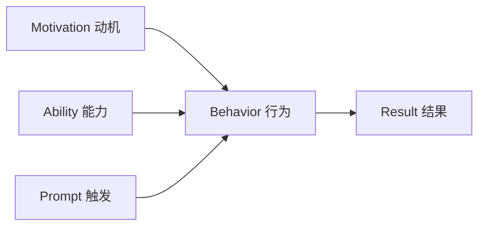

## 九、社群活动策划技巧

社群活动是激活沉默用户、增强社群粘性、促进转化的核心手段。一场精心策划的活动能让社群活跃度提升 300% 以上，而一场糟糕的活动则可能加速社群死亡。本节将系统讲解社群活动策划的方法论、执行流程和实战技巧。

### 1. 社群活动的核心价值

#### 1.1 为什么社群必须做活动

社群运营中存在一个"沉默螺旋"现象：如果社群长期没有互动，成员会逐渐习惯沉默，最终变成"死群"。活动的作用就是打破这个螺旋。

| 社群状态 | 日活跃率 | 成员流失率 | 转化率 |
|---------|---------|-----------|-------|
| 无活动社群 | <5% | 月均 15-20% | <1% |
| 定期活动社群 | 15-30% | 月均 5-8% | 3-8% |
| 高频互动社群 | 30-50% | 月均 2-3% | 8-15% |

活动的核心价值体现在四个维度：

- **激活沉默用户**：通过参与门槛低的活动，让潜水成员迈出第一步
- **增强情感连接**：共同参与活动形成的记忆，是社群归属感的基础
- **促进内容生产**：活动天然产生 UGC（用户生成内容），丰富社群内容池
- **驱动商业转化**：活动是"软性销售"的最佳载体，转化率远高于直接推销

#### 1.2 活动策划的底层逻辑

活动策划的本质是**设计一个"行为触发器"**，让成员在特定时间、以特定方式、完成特定行为。这个过程遵循行为心理学的 Fogg 模型：



- **动机（Motivation）**：成员为什么要参加？能获得什么？
- **能力（Ability）**：参与门槛是否足够低？
- **触发（Prompt）**：在什么时机、用什么方式提醒成员参与？

三个要素缺一不可。很多活动失败的原因不是"用户不感兴趣"，而是"参与太麻烦"或"触发时机不对"。

### 2. 社群活动的类型体系

#### 2.1 按目的分类

| 类型 | 目的 | 典型活动 | 频率建议 |
|------|------|---------|---------|
| 引流活动 | 吸引新成员加入 | 裂变挑战、免费公开课、资料包领取 | 月度 |
| 激活活动 | 唤醒沉默成员 | 签到打卡、话题讨论、投票 | 每周 |
| 互动活动 | 增强成员连接 | 自我介绍、经验分享、线上聚会 | 双周 |
| 转化活动 | 促进付费转化 | 限时优惠、拼团、体验课 | 月度 |
| 留存活动 | 降低流失率 | 会员日、专属福利、积分兑换 | 月度 |
| 传播活动 | 扩大品牌影响 | 征文比赛、口碑推荐、联名活动 | 季度 |

#### 2.2 按形式分类

**① 内容型活动**

以内容产出为核心，适合知识类、学习类社群。

- **主题分享会**：邀请嘉宾或成员做主题分享，时长 30-60 分钟
- **读书会**：共读一本书，每周讨论一个章节
- **案例拆解**：选取典型案例进行深度分析
- **问答接龙**：围绕一个主题轮流提问和回答

**② 游戏型活动**

以趣味性为核心，适合年轻用户群体。

- **知识竞赛**：通过答题排名，激发竞争心理
- **创意挑战**：设定主题，成员自由创作并投票
- **角色扮演**：模拟特定场景进行互动
- **寻宝游戏**：在社群内容中隐藏线索，引导成员探索

**③ 社交型活动**

以人际连接为核心，适合高粘性社群。

- **破冰游戏**：帮助新成员快速融入
- **主题夜聊**：围绕情感、生活话题自由交流
- **线下聚会**：同城成员面对面交流
- **结对互助**：配对成员互相监督、支持

**④ 转化型活动**

以商业变现为核心，适合付费社群和品牌社群。

- **限时秒杀**：限定时间的特价优惠
- **拼团活动**：多人组团享受折扣
- **体验营**：免费体验后引导付费
- **分销裂变**：老用户推荐新用户获得奖励

### 3. 活动策划的完整流程

#### 3.1 策划阶段（活动前 7-14 天）

**① 明确活动目标**

每个活动必须有且仅有一个核心目标。目标不清晰是活动失败的首要原因。

使用 SMART 原则制定目标：

| 维度 | 说明 | 示例 |
|------|------|------|
| Specific（具体） | 明确要做什么 | 提升社群日活跃率 |
| Measurable（可衡量） | 量化指标 | 从 10% 提升到 25% |
| Achievable（可达成） | 基于现状的合理预期 | 参考过往活动数据 |
| Relevant（相关性） | 与社群定位一致 | 活动内容与社群主题相关 |
| Time-bound（有时限） | 明确时间节点 | 本周六晚 8-9 点 |

**② 选择活动类型**

根据目标选择活动类型：

```text
目标是拉新 → 引流活动（裂变、公开课）
目标是激活 → 激活活动（打卡、话题）
目标是转化 → 转化活动（限时优惠、体验营）
目标是留存 → 留存活动（会员日、积分）
```

**③ 设计活动方案**

活动方案的核心要素：

```yaml
活动名称: [简短有吸引力的名称]
活动目标: [具体的 SMART 目标]
目标人群: [明确参与对象]
活动时间: [开始时间 - 结束时间]
活动形式: [具体的活动形式]
参与规则: [详细的参与方式]
奖励机制: [参与者能获得什么]
推广渠道: [在哪里宣传]
预算: [需要投入的资源]
预期效果: [预计的数据表现]
```

**④ 设计参与路径**

参与路径越短，参与率越高。理想状态是"一步到位"。

```text
❌ 复杂路径：扫码 → 关注公众号 → 回复关键词 → 填写表单 → 加入社群 → 参与活动
✅ 简洁路径：点击链接 → 直接参与
```

**⑤ 准备物料清单**

| 物料类型 | 具体内容 | 负责人 | 截止时间 |
|---------|---------|-------|---------|
| 宣传物料 | 海报、文案、短视频 | 设计/运营 | 活动前 3 天 |
| 活动物料 | 话题、问题、规则说明 | 运营 | 活动前 1 天 |
| 奖励物料 | 优惠券、礼品、证书 | 运营 | 活动前 1 天 |
| 技术物料 | 小程序、链接、工具 | 技术 | 活动前 2 天 |

#### 3.2 预热阶段（活动前 3-5 天）

预热的目的是**制造期待感**，让成员提前知道活动并产生参与欲望。

**预热节奏表：**

| 时间节点 | 预热内容 | 渠道 |
|---------|---------|------|
| 活动前 5 天 | 悬念预告（"下周有大事发生"） | 社群、朋友圈 |
| 活动前 3 天 | 具体预告（活动主题和时间） | 社群、公众号 |
| 活动前 1 天 | 详细说明（参与方式和奖励） | 社群、私聊 |
| 活动当天 | 最后提醒（"今晚 8 点开始"） | 社群、私聊 |

**预热文案模板：**

```text
🔥【活动预告】

[活动名称] 即将开始！

⏰ 时间：[具体时间]
📍 地点：[社群/直播间/小程序]
🎁 奖励：[具体奖励内容]

参与方式：[一句话说明]

👉 扫码/点击链接提前预约
```

#### 3.3 执行阶段（活动进行中）

**① 开场引导**

活动开始时，需要快速建立氛围：

- **准时开始**：拖延会降低信任感
- **热情开场**：用 emoji、问候语营造氛围
- **规则说明**：简洁清晰地说明活动规则
- **示范参与**：自己先参与一次，降低成员的心理门槛

**② 过程管控**

活动中需要实时监控和调整：

| 监控指标 | 预期值 | 异常处理 |
|---------|-------|---------|
| 参与人数 | 目标人数的 60%+ | 加大推广力度 |
| 互动频率 | 每分钟 5+ 条消息 | 引导话题、抛出问题 |
| 负面反馈 | <5% | 及时回应、调整方案 |
| 技术故障 | 0 | 备用方案、快速修复 |

**③ 氛围营造**

- **实时播报**：定期公布参与人数、排名等数据
- **制造稀缺**：强调名额有限、时间紧迫
- **社交证明**：展示已参与成员的反馈和成果
- **互动引导**：主动@沉默成员，邀请他们参与

**④ 突发情况应对**

| 突发情况 | 应对方案 |
|---------|---------|
| 参与人数不足 | 私聊邀请活跃成员参与；降低参与门槛 |
| 出现争议/冲突 | 私聊沟通，不要在群里公开处理 |
| 技术故障 | 及时告知情况，启用备用方案 |
| 奖励发放问题 | 先承诺后补发，保持信誉 |

#### 3.4 收尾阶段（活动后 1-3 天）

**① 活动总结**

及时发布活动总结，让参与者有成就感：

```text
📊【活动总结】

本次 [活动名称] 圆满结束！

📈 数据：
- 参与人数：XX 人
- 互动次数：XX 次
- 新增成员：XX 人

🏆 获奖名单：
[列出获奖者]

💬 精彩回顾：
[展示优秀内容]

感谢大家的参与！下次活动见！
```

**② 奖励发放**

- **及时兑现**：承诺的奖励必须在 24 小时内发放
- **公开透明**：在社群内公布获奖名单
- **超出预期**：适当增加小惊喜，提升满意度

**③ 效果复盘**

活动结束后必须进行复盘，填写复盘表：

| 复盘维度 | 具体内容 |
|---------|---------|
| 目标达成 | 实际数据 vs 目标数据 |
| 成功经验 | 哪些做法效果好，值得复用 |
| 问题分析 | 哪些环节出了问题，原因是什么 |
| 改进方案 | 下次活动如何优化 |
| 用户反馈 | 参与者的评价和建议 |

### 4. 高转化活动的设计技巧

#### 4.1 限时紧迫感设计

限时是最有效的转化催化剂。设计限时活动时，注意以下要点：

- **时间要短**：24 小时以内效果最佳，超过 3 天紧迫感消失
- **倒计时提醒**：在剩余 2 小时、1 小时、30 分钟时分别提醒
- **名额限制**：强调"仅限 XX 名"，制造稀缺感
- **价格锚定**：展示原价和活动价的对比，强化优惠感知

#### 4.2 社交裂变设计

裂变活动的核心是**让每个参与者都成为传播节点**。

**裂变机制设计公式：**

```text
裂变效果 = 传播动机 × 传播能力 × 传播触发

传播动机：用户为什么要分享？（利益驱动、社交货币、利他心理）
传播能力：用户分享是否方便？（一键转发、生成海报）
传播触发：什么时候提醒用户分享？（完成任务后、获得奖励前）
```

**三种裂变模型：**

| 模型 | 机制 | 适用场景 |
|------|------|---------|
| 邀请有礼 | 邀请 X 人加入，获得奖励 | 社群拉新 |
| 拼团模式 | X 人成团，享受折扣 | 课程/产品销售 |
| 分销模式 | 推荐成交，获得佣金 | 高客单价产品 |

#### 4.3 游戏化设计

游戏化能显著提升活动的趣味性和参与度：

- **积分系统**：参与活动获得积分，积分可兑换奖励
- **排行榜**：公开展示排名，激发竞争心理
- **成就徽章**：完成特定任务解锁徽章，满足成就感
- **等级体系**：根据参与度划分等级，享受不同权益

### 5. 常见活动类型模板

#### 5.1 七天打卡挑战

**适用场景**：学习类、成长类社群

```yaml
活动名称: 七天早起打卡挑战
活动时间: X月X日 - X月X日
参与方式: 每天 7:00 前在社群内发送"早安+今日计划"
奖励机制:
  - 连续打卡 3 天: 获得电子书一份
  - 连续打卡 7 天: 获得课程优惠券
  - 完成率最高: 获得实体奖品
规则说明:
  1. 每天 7:00 前发送打卡内容
  2. 内容不少于 20 字
  3. 补卡机会 1 次
```

#### 5.2 主题分享会

**适用场景**：知识类、行业类社群

```yaml
活动名称: [主题] 线上分享会
活动时间: X月X日 20:00-21:00
活动形式: 微信群语音/腾讯会议
流程安排:
  - 20:00-20:05 主持人开场
  - 20:05-20:40 嘉宾分享
  - 20:40-20:55 问答互动
  - 20:55-21:00 总结预告
推广话术: "特邀 [嘉宾] 分享 [主题]，限 XX 个名额"
```

#### 5.3 社群快闪活动

**适用场景**：激活沉默社群、制造话题

```yaml
活动名称: 30 分钟快闪问答
活动时间: 今晚 20:00-20:30
活动形式: 在社群内限时回答问题
规则说明:
  1. 20:00-20:30 之间，成员可以提问任何问题
  2. 每个问题在 3 分钟内回答
  3. 最佳提问者获得奖励
目的: 激活沉默成员，收集用户需求
```

### 6. 活动策划的常见误区

#### 6.1 目标过多

**误区**：一个活动同时追求拉新、激活、转化多个目标

**后果**：资源分散，每个目标都达不到预期

**正确做法**：一个活动只聚焦一个核心目标。如果需要多个目标，设计系列活动。

#### 6.2 参与门槛过高

**误区**：要求成员填写大量信息、完成复杂任务才能参与

**后果**：参与率极低，活动效果差

**正确做法**：参与步骤不超过 3 步。能一步完成的，绝不用两步。

#### 6.3 奖励与参与不匹配

**误区**：参与难度大但奖励很小，或者奖励太大但参与太容易

**后果**：要么没人参与，要么吸引大量羊毛党

**正确做法**：奖励价值与参与难度成正比。可以用阶梯式奖励：

```text
参与即可获得：小礼品/优惠券
完成基础任务：中等价值奖励
完成进阶任务：高价值奖励
```

#### 6.4 缺乏预热

**误区**：活动开始时才通知，没有预热过程

**后果**：参与人数远低于预期

**正确做法**：至少提前 3 天开始预热，按照"悬念→具体→详细→提醒"的节奏推进。

#### 6.5 活动后无跟进

**误区**：活动结束就结束，没有总结、没有跟进

**后果**：活动效果无法沉淀，下次活动还得从零开始

**正确做法**：
- 24 小时内发布活动总结
- 收集参与者反馈
- 将参与者转化为活跃成员或付费用户
- 整理活动数据，为下次活动提供参考

#### 6.6 忽视数据追踪

**误区**：只关注活动的表面效果，不追踪具体数据

**后果**：无法判断活动的真实 ROI，无法优化

**正确做法**：追踪以下核心数据：

| 数据指标 | 说明 | 优化方向 |
|---------|------|---------|
| 曝光量 | 看到活动信息的人数 | 优化推广渠道 |
| 点击率 | 点击/曝光 | 优化文案和海报 |
| 参与率 | 参与/点击 | 降低参与门槛 |
| 完成率 | 完成/参与 | 优化活动流程 |
| 转化率 | 付费/参与 | 优化转化路径 |
| 分享率 | 分享/参与 | 优化裂变机制 |

### 7. 活动策划进阶技巧

#### 7.1 用户分层活动设计

不同层级的用户需要不同的活动：

| 用户层级 | 特征 | 适合的活动 |
|---------|------|-----------|
| 新成员 | 刚加入，不了解社群 | 破冰游戏、新人引导 |
| 活跃成员 | 经常参与互动 | 深度分享、共创活动 |
| 沉默成员 | 长期不说话 | 低门槛互动、福利活动 |
| 核心成员 | 深度参与、有影响力 | 嘉宾邀请、专属活动 |
| 流失成员 | 已退出或长期不活跃 | 召回活动、专属优惠 |

#### 7.2 活动节奏规划

社群活动不是越多越好，需要合理规划节奏：

```text
每周节奏：
- 周一：本周预告
- 周三：轻量互动（话题讨论/投票）
- 周五：主题活动（分享会/挑战赛）
- 周日：本周总结

每月节奏：
- 第 1 周：月度主题活动启动
- 第 2 周：互动类活动
- 第 3 周：转化类活动
- 第 4 周：总结+下月预告
```

#### 7.3 活动 SOP 标准化

将成功的活动沉淀为 SOP，实现可复制：

```yaml
活动 SOP 模板:
  活动名称: [名称]
  适用场景: [什么时候使用]
  目标人群: [面向谁]
  
  筹备清单:
    - [ ] 确定活动目标
    - [ ] 设计活动方案
    - [ ] 准备宣传物料
    - [ ] 测试活动流程
    - [ ] 准备应急预案
    
  执行流程:
    - T-5天: 发布预告
    - T-3天: 详细说明
    - T-1天: 最后提醒
    - T日: 活动执行
    - T+1天: 活动总结
    - T+3天: 效果复盘
    
  数据模板:
    - 参与人数:
    - 完成率:
    - 转化率:
    - 用户反馈:
    - 改进建议:
```

#### 7.4 数据驱动的活动优化

通过 A/B 测试持续优化活动效果：

- **测试变量**：每次只测试一个变量（时间、文案、奖励、规则）
- **样本量**：每组至少 100 人，确保统计显著性
- **测试周期**：至少运行 2-3 次同类活动，排除偶然因素
- **记录结果**：建立活动数据库，记录每次活动的数据和优化点

**常见测试变量及优化方向：**

| 测试变量 | 优化方向 |
|---------|---------|
| 活动时间 | 测试不同时段的参与率 |
| 文案风格 | 测试不同话术的点击率 |
| 奖励类型 | 测试物质奖励 vs 精神奖励 |
| 参与门槛 | 测试不同复杂度的完成率 |
| 提醒方式 | 测试不同提醒频率的效果 |

### 8. 活动工具推荐

| 工具类型 | 推荐工具 | 适用场景 |
|---------|---------|---------|
| 表单收集 | 金数据、问卷星 | 报名、反馈收集 |
| 海报制作 | Canva、创客贴、稿定设计 | 活动宣传海报 |
| 小程序 | 有赞、小鹅通 | 活动页面、支付 |
| 直播工具 | 视频号、腾讯会议 | 线上分享会 |
| 打卡工具 | 小打卡、鹅打卡 | 签到、打卡活动 |
| 数据分析 | Excel、飞书多维表格 | 活动数据追踪 |
| 自动化工具 | 微伴助手、wetool | 自动回复、群发 |

### 9. 活动策划案例解析

#### 案例一：知识付费社群的"7天训练营"

**背景**：某写作社群，成员 500 人，日活率仅 8%

**活动设计**：
- 名称：7天写作训练营
- 时间：7天
- 规则：每天完成一篇 300 字短文，提交到社群
- 奖励：完成 7 天获赠价值 99 元的写作课程

**执行过程**：
- 预热期：提前 5 天发布海报，展示往期学员成果
- 执行期：每天发布写作主题，晚上点评优秀作品
- 收尾期：公布获奖名单，发布学员作品集

**效果数据**：
- 参与率：62%（310/500）
- 完成率：45%（140/310）
- 活动后日活率：从 8% 提升到 22%
- 后续转化：35 人购买了进阶课程（转化率 11%）

**成功要素**：
- 参与门槛低（每天 300 字）
- 奖励有吸引力（免费课程）
- 过程有反馈（每日点评）
- 社交有压力（公开打卡）

#### 案例二：电商社群的"限时拼团"

**背景**：某母婴社群，成员 2000 人，以产品推荐为主

**活动设计**：
- 名称：周末母婴好物拼团
- 时间：周五 20:00 - 周日 24:00
- 规则：3 人成团，享受 7 折优惠
- 产品：精选 5 款高频复购产品

**执行过程**：
- 预热期：提前 3 天发布产品预告，展示用户好评
- 执行期：每 4 小时发布一次拼团进度，营造紧迫感
- 收尾期：公布拼团成果，预告下次活动

**效果数据**：
- 参与拼团：280 人
- 成团率：85%
- GMV：约 4.2 万元
- 新增成员：45 人（通过拼团分享加入）

**成功要素**：
- 产品选择精准（高频复购）
- 成团门槛低（3 人即可）
- 时间紧迫（仅 3 天）
- 社交裂变（拼团需邀请好友）

### 10. 本节小结

社群活动策划是一门实践性极强的技能，核心要点：

- **明确目标**：每个活动只聚焦一个核心目标
- **降低门槛**：参与步骤不超过 3 步
- **制造紧迫**：限时限量，激发参与欲望
- **数据驱动**：追踪关键指标，持续优化
- **复盘沉淀**：每次活动后总结经验，形成 SOP

记住：好的活动不是一次性事件，而是社群运营的常态化手段。将活动融入社群的日常节奏，才能持续保持社群活力。
