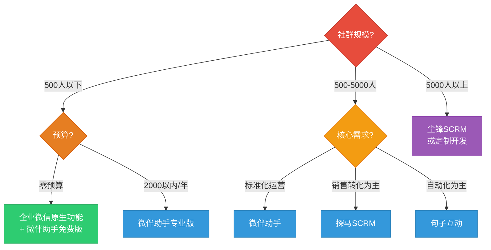
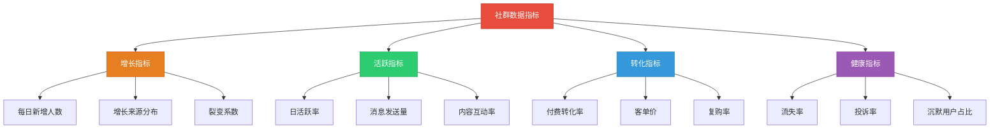

## 十、私域工具推荐

> **器者，助人成事也。** 工具不是目的，而是加速器——好的工具可以让效率提升10倍，但工具永远替代不了策略和执行力。本节不是"软件清单"，而是帮你建立**选择工具的决策框架**，然后按功能层级逐一推荐经过市场验证的工具。

### 工具选择的底层逻辑

很多人一上来就问"用什么工具"，这就像还没想清楚要做什么菜就先买厨具。正确的顺序是：

**核心原则：先流程后工具，先免费后付费，先简单后复杂。**

工具选择的五个评估维度：

| 维度 | 权重 | 评估要点 |
|------|------|---------|
| **功能匹配度** | 30% | 是否覆盖你的核心需求？不要被花哨功能迷了眼 |
| **易用性** | 25% | 学习成本如何？你的团队能快速上手吗？ |
| **成本效益** | 20% | 月费、按量计费、隐性成本（学习时间、迁移成本） |
| **数据安全** | 15% | 用户数据存储在哪里？是否有合规保障？ |
| **生态兼容** | 10% | 能否与已有工具打通？是否支持API对接？ |

**一个常见误区：** 花大量时间对比10个工具的功能表，最后选了最"全"的那个——结果80%的功能永远用不到，反而因为操作复杂拖累了效率。**记住：最适合你的工具，不一定是功能最强的那个，而是你团队能用起来的那个。**

***

### 一、企业微信生态工具：私域运营的"基础设施"

企业微信是做私域运营的**核心阵地**，这不是偏好问题，而是结构性选择。微信个人号有5000好友上限、容易被封号、无法统一管理等问题，企业微信完美解决了这些痛点。

#### 1.1 企业微信核心能力解析

企业微信相比个人微信的六大优势：

| 能力 | 个人微信 | 企业微信 | 实际意义 |
|------|---------|---------|---------|
| 好友上限 | 5000人 | 无上限（需扩容） | 规模化运营的基础 |
| 群发消息 | 每次200人 | 按标签批量触达 | 精准营销效率提升10倍 |
| 客户资产 | 属于个人 | 属于企业 | 员工离职，客户不流失 |
| 标签体系 | 简单标签 | 多维度标签+自动打标 | 用户分层精细化运营 |
| 数据统计 | 无 | 完整的行为数据 | 数据驱动决策的基础 |
| 封号风险 | 高频操作易封 | 合规使用几乎零风险 | 运营稳定性的保障 |

**企业微信的使用门槛：** 需要营业执照注册（个体工商户也可以），年费认证300元/年。如果暂时没有营业执照，可以先用个人微信过渡，但一旦社群规模超过200人，强烈建议切换到企业微信。

#### 1.2 企业微信搭配工具推荐

企业微信本身是"骨架"，需要搭配第三方SCRM工具才能发挥最大价值。以下是主流工具对比：

**（1）微伴助手**

- **定位：** 企业微信官方服务商，中小企业首选
- **核心功能：** 渠道活码、自动欢迎语、客户标签自动打标、社群SOP、数据看板、离职继承
- **价格：** 基础版免费，专业版约2000-5000元/年（按功能模块计费）
- **适用场景：** 社群规模500-5000人，需要标准化运营流程的团队
- **优势：** 功能全面、价格亲民、与企业微信深度集成
- **劣势：** 高级功能需要付费，定制化程度一般

**（2）尘锋SCRM**

- **定位：** 中大型企业的私域运营平台
- **核心功能：** 全渠道获客、智能分配、销售管理、客户旅程、社群运营、数据分析
- **价格：** 按坐席收费，约2000-8000元/坐席/年
- **适用场景：** 社群规模5000+，有专职运营团队
- **优势：** 功能最全面、数据分析能力强、支持复杂业务场景
- **劣势：** 价格较高、学习曲线陡峭

**（3）探马SCRM**

- **定位：** 销售导向的私域工具
- **核心功能：** 客户管理、跟进记录、智能提醒、话术库、群SOP、转化分析
- **价格：** 基础版约1500元/年，高级版3000-6000元/年
- **适用场景：** 以销售转化为核心目标的社群（如教育、金融、房产）
- **优势：** 销售管理功能强、操作简单、性价比高
- **劣势：** 社群运营功能相对薄弱

**（4）句子互动**

- **定位：** 社群自动化运营工具
- **核心功能：** 自动回复、关键词触发、群管理、数据统计、多群同步
- **价格：** 基础版免费，高级版约100-500元/月
- **适用场景：** 需要大量自动化操作的社群运营
- **优势：** 自动化能力强、上手快
- **劣势：** 功能较为单一，需要搭配其他工具使用

**工具选择决策树：**

***

### 二、社群管理工具：让运营"自动化"

社群管理的核心痛点是**重复劳动太多**——每天发早报、回复相似问题、统计数据、清理广告……这些工作如果不自动化，会消耗运营者80%的精力。

#### 2.1 微信群管理工具

**（1）WeTool（已停服）的替代方案**

WeTool曾是最流行的微信群管理工具，但2020年被微信官方封杀。目前的替代方案：

| 工具 | 核心功能 | 价格 | 风险等级 |
|------|---------|------|---------|
| **企业微信群管理** | 官方功能，安全稳定 | 免费 | 无风险 |
| **微伴助手** | 群SOP、自动回复、数据统计 | 免费/付费 | 低风险 |
| **句子互动** | 关键词回复、群公告、自动拉人 | 免费/付费 | 低风险 |
| **wetool替代版** | 非官方，功能类似wetool | 50-200元/月 | 高风险，不建议 |

**重要警告：** 任何需要登录你微信PC端的第三方工具都有封号风险。微信官方明确禁止使用外挂工具，一旦检测到，轻则功能限制，重则永久封号。**建议全部使用企业微信生态内的合规工具。**

**（2）群接龙工具**

社群中经常需要组织接龙（报名、团购、打卡等），以下工具最实用：

- **微信自带接龙：** 在群聊中输入"#"触发，零成本，适合简单场景
- **群接龙小程序：** 功能更丰富，支持图片、收款、截止时间设置，免费使用
- **报名接龙工具：** 适合活动报名场景，支持导出名单、发送提醒

**（3）社群打卡工具**

打卡是提升社群活跃度的核心手段，常用工具：

- **小打卡小程序：** 支持图片/文字/语音打卡，可设置打卡规则、排行榜、奖品，免费
- **鲸打卡：** 适合教育类社群，支持课程打卡、作业提交、老师批改，基础版免费
- **打卡鸭：** 轻量级打卡工具，支持押金模式（未打卡扣押金），增强约束力

#### 2.2 社群内容分发工具

每天在多个群发布相同内容是非常耗时的工作，以下工具可以大幅提效：

**（1）群发助手方案对比**

| 方案 | 操作方式 | 效率 | 安全性 | 适用场景 |
|------|---------|------|--------|---------|
| 企业微信自带群发 | 后台设置，按标签群发 | ★★★★ | ★★★★★ | 日常内容分发 |
| 微伴助手SOP | 预设时间表，自动提醒执行 | ★★★★★ | ★★★★★ | 标准化运营流程 |
| 公众号定时推送 | 写好文章，定时发送 | ★★★★ | ★★★★★ | 深度内容分发 |
| 第三方群发工具 | 登录微信，批量发送 | ★★★★★ | ★★ | 不推荐，有封号风险 |

**（2）朋友圈内容管理**

朋友圈是私域运营的"黄金广告位"，但每天手动发朋友圈太低效：

- **企业微信朋友圈：** 官方功能，支持定时发布、按客户标签可见，零风险
- **微伴助手朋友圈SOP：** 预设一周的朋友圈内容，每天提醒你发布，避免遗漏
- **稿定设计/Canva：** 快速制作朋友圈海报，有大量模板可用

**朋友圈发布节奏建议：**

| 时间 | 内容类型 | 目的 |
|------|---------|------|
| 早8:00 | 行业资讯/金句 | 建立专业形象 |
| 午12:00 | 案例/客户反馈 | 社会证明，建立信任 |
| 晚20:00 | 产品/服务介绍 | 软性转化 |
| 周末 | 个人生活/价值观 | 展示真实人格，拉近距离 |

***

### 三、内容创作工具：降低创作门槛

社群运营需要大量内容——干货文章、社群海报、短视频、PPT、电子书……如果每样都靠"原创"，一个人根本忙不过来。以下是经过验证的内容创作工具链。

#### 3.1 文字内容创作

**（1）AI写作助手**

2024-2026年AI写作工具已经成熟，善用AI可以将内容产出效率提升3-5倍：

| 工具 | 擅长领域 | 价格 | 使用建议 |
|------|---------|------|---------|
| **ChatGPT/Claude** | 长文、分析、策划方案 | 20美元/月 | 适合深度内容的初稿和框架搭建 |
| **文心一言** | 中文写作、营销文案 | 免费/付费 | 中文语境下表现优秀 |
| **通义千问** | 中文写作、数据分析 | 免费/付费 | 阿里生态，适合电商场景 |
| **讯飞星火** | 中文写作、语音转文字 | 免费/付费 | 语音转文字功能出色 |
| **Kimi** | 长文阅读和总结 | 免费 | 适合阅读和总结长文档 |

**AI写作的正确姿势：**

1. **先给框架，再让AI填充。** 不要直接说"帮我写一篇社群运营文章"，而是给出大纲，让AI逐节展开
2. **AI产出必须人工审核。** AI可能编造数据、引用不存在的案例，发布前必须核实
3. **建立自己的"提示词库"。** 把效果好的提示词保存下来，形成可复用的内容模板
4. **AI负责"量"，人负责"质"。** 用AI快速产出初稿，然后加入你的经验、观点、案例进行深度改写

**（2）文案灵感来源**

- **新榜：** 查看各行业公众号的爆款文章，学习选题和写法
- **巨量算数：** 抖音/头条的热搜趋势，把握内容方向
- **5118：** 关键词挖掘和内容需求分析，找到用户真正在搜什么
- **微信指数：** 微信生态内的热点趋势，适合公众号选题

#### 3.2 图片与海报设计

**（1）零基础设计工具**

| 工具 | 核心优势 | 价格 | 适用场景 |
|------|---------|------|---------|
| **Canva（可画）** | 模板最多、操作最简单 | 免费/128元/年 | 海报、封面、社交媒体图 |
| **稿定设计** | 中国本土化、电商模板多 | 免费/199元/年 | 电商海报、社群图、朋友圈图 |
| **创客贴** | 模板丰富、团队协作好 | 免费/99元/年 | 团队协作设计 |
| **图怪兽** | 操作简单、更新快 | 免费/168元/年 | 节日海报、营销图 |
| **Figma** | 专业设计、免费使用 | 免费/付费 | UI设计、复杂排版 |

**（2）图片处理工具**

- **Remove.bg：** 一键抠图，免费，效果堪比Photoshop
- **TinyPNG：** 图片压缩，保持画质的同时减小文件大小
- **美图秀秀：** 快速美化图片，适合朋友圈配图
- **Snapseed：** 手机端修图神器，免费，功能强大

**（3）表情包和GIF工具**

社群中适当使用表情包可以活跃气氛，增加亲和力：

- **微信自带表情商店：** 免费，海量表情包
- **SOOGIF：** GIF搜索和制作
- **GIPHY：** 全球最大的GIF平台
- **花熊：** 自定义表情包制作

#### 3.3 视频内容工具

短视频是2024-2026年引流到私域的最高效方式：

**（1）视频剪辑工具**

| 工具 | 平台 | 难度 | 价格 | 适用场景 |
|------|------|------|------|---------|
| **剪映** | 手机+PC | ★★ | 免费 | 短视频剪辑首选，模板丰富 |
| **CapCut** | 手机+PC | ★★ | 免费 | 剪映海外版，功能更强 |
| **达芬奇** | PC | ★★★★ | 免费/付费 | 专业调色和剪辑 |
| **Premiere Pro** | PC | ★★★★★ | 付费 | 专业视频制作 |
| **必剪** | 手机+PC | ★★ | 免费 | B站内容创作 |

**（2）直播工具**

- **视频号直播：** 微信生态内闭环，可直接导流到社群
- **抖音直播：** 公域流量大，适合引流到私域
- **小鹅通：** 知识付费直播，支持收费观看
- **保利威：** 企业级直播，支持品牌定制

#### 3.4 音频与播客工具

播客和音频内容在知识类社群中越来越流行：

- **喜马拉雅：** 最大的中文播客平台，适合知识分享
- **小宇宙：** 年轻用户聚集的播客平台
- **讯飞听见：** 语音转文字神器，适合将直播/分享转为文章
- **Adobe Podcast：** AI降噪，让录音音质大幅提升

***

### 四、数据分析工具：用数据驱动运营

不做数据分析的社群运营就像蒙着眼睛开车——你可能在前进，但不知道方向对不对。

#### 4.1 社群数据指标体系

运营社群需要关注的核心数据：

#### 4.2 数据采集与分析工具

**（1）基础数据工具**

| 工具 | 数据类型 | 价格 | 适用场景 |
|------|---------|------|---------|
| **企业微信后台** | 客户数据、群数据 | 免费 | 基础数据监控 |
| **微伴助手数据看板** | 运营数据、转化数据 | 免费/付费 | 日常运营分析 |
| **腾讯问卷/金数据** | 用户调研数据 | 免费/付费 | 用户需求调研 |
| **百度统计/友盟** | 网站/小程序数据 | 免费 | 流量来源分析 |

**（2）进阶数据分析**

- **GrowingIO：** 用户行为分析，适合有小程序或网站的社群
- **神策数据：** 全端数据采集，深度用户行为分析
- **Excel/Google Sheets：** 最基础但最灵活的数据分析工具，80%的社群运营数据分析用表格就够了
- **Python + pandas：** 当数据量大、分析需求复杂时，Python是最高效的工具

**（3）竞品分析工具**

了解竞争对手的社群运营策略，可以少走很多弯路：

- **新榜/西瓜数据：** 公众号和视频号数据分析
- **蝉妈妈/飞瓜数据：** 抖音和小红书数据分析
- **企查查/天眼查：** 了解竞品公司的背景和融资情况
- **SimilarWeb：** 网站流量分析（适合有独立站的社群）

#### 4.3 数据分析的实操方法

**每日必看数据（5分钟）：**

1. 今日新增好友数 vs 昨日
2. 社群消息发送量和活跃人数
3. 是否有异常（退群潮、投诉、广告）

**每周必做分析（30分钟）：**

1. 本周新增 vs 上周，增长趋势
2. 各渠道引流效果对比
3. 本周内容/活动的数据复盘
4. 高活跃用户和沉默用户识别

**每月深度复盘（2小时）：**

1. 月度增长漏斗分析（曝光→添加→入群→活跃→付费）
2. 用户分层数据（新用户/活跃用户/付费用户/流失用户占比）
3. 内容类型效果对比（哪种内容互动最高？哪种转化最高？）
4. ROI分析（投入的时间/金钱 vs 产出的收入/增长）

***

### 五、客户关系管理（CRM）工具

当社群规模超过500人，你就需要一个系统来管理客户关系——记住谁是新用户、谁是付费会员、谁需要跟进、谁即将流失。

#### 5.1 CRM工具对比

| 工具 | 定位 | 价格 | 核心优势 | 适用规模 |
|------|------|------|---------|---------|
| **企业微信客户联系** | 基础CRM | 免费 | 官方功能，安全稳定 | 500人以下 |
| **微伴助手CRM** | 轻量CRM | 免费/付费 | 与企业微信深度集成 | 500-5000人 |
| **纷享销客** | 销售CRM | 3000-8000元/坐席/年 | 销售流程管理 | 1000+客户 |
| **销售易** | 企业CRM | 2000-6000元/坐席/年 | 全流程管理 | 5000+客户 |
| **HubSpot** | 海外CRM | 免费/付费 | 入门免费，功能强大 | 有海外业务时 |

#### 5.2 社群用户的分层管理

CRM的核心不是"记录"，而是**分层**。一个500人的社群，不应该对所有人用同一套运营策略：

| 用户层级 | 特征 | 占比 | 运营策略 | 工具支撑 |
|---------|------|------|---------|---------|
| **核心层** | 高活跃、高付费、主动推荐 | 5-10% | VIP服务、专属福利、优先体验权 | 1对1私聊 |
| **活跃层** | 经常互动、偶尔付费 | 15-25% | 引导参与、培养信任、适时转化 | 社群互动+定向推送 |
| **普通层** | 偶尔互动、未付费 | 40-50% | 内容激活、痛点触达、降低决策门槛 | 群发+朋友圈 |
| **沉默层** | 长期不互动 | 20-30% | 唤醒活动、价值重申、必要时清理 | 自动化触达 |
| **流失层** | 已退出或取消关注 | 5-10% | 流失原因调研、挽回尝试 | 挽回话术 |

**工具实现方式：** 在企业微信中为每个用户打标签（来源渠道、活跃度、付费状态），然后按标签分组运营。微伴助手可以设置自动打标规则，比如"7天未互动自动标记为沉默用户"。

***

### 六、自动化与效率工具

当社群运营进入正轨后，大量重复性工作会消耗你的精力。自动化工具的价值在于——**把你从"执行者"变成"监督者"。**

#### 6.1 工作流自动化工具

| 工具 | 功能 | 价格 | 适用场景 |
|------|------|------|---------|
| **飞书多维表格** | 数据管理+自动化 | 免费 | 客户信息管理、任务跟踪 |
| **腾讯轻联** | 应用连接器 | 免费/付费 | 微信生态内的自动化 |
| **n8n** | 开源自动化平台 | 免费（自部署） | 技术团队的自动化需求 |
| **Make（原Integromat）** | 可视化自动化 | 免费/付费 | 复杂的跨平台自动化 |
| **Zapier** | 应用连接器 | 免费/付费 | 海外工具的自动化 |

**自动化场景示例：**

1. **新用户欢迎流程：** 用户添加企业微信 → 自动发送欢迎语 → 自动打标签 → 自动拉入对应社群 → 24小时后自动发送自我介绍模板
2. **内容分发流程：** 公众号发布文章 → 自动同步到社群 → 自动发朋友圈 → 自动统计数据
3. **付费用户服务流程：** 用户付费 → 自动升级标签 → 自动发送会员权益 → 自动拉入VIP群 → 7天后自动发送使用指南

#### 6.2 日程与任务管理

社群运营涉及大量时间节点（活动日期、内容发布、用户跟进），需要一个可靠的任务管理系统：

- **飞书/钉钉：** 适合团队协作，任务+日历+文档一体化
- **Notion：** 灵活的数据库+文档工具，适合个人和小团队
- **滴答清单：** 个人任务管理神器，支持番茄钟
- **腾讯文档：** 免费，适合简单的协作和记录

#### 6.3 支付与收款工具

社群变现离不开收款工具，选择标准是**低费率、高便捷性、合规性**：

| 工具 | 费率 | 到账速度 | 适用场景 |
|------|------|---------|---------|
| **微信支付商户号** | 0.6% | T+1 | 官方收款，最合规 |
| **小鹅通** | 平台抽成1-5% | T+7 | 知识付费课程 |
| **有赞** | 平台费+0.6% | T+1 | 电商带货 |
| **群接龙收款** | 0.6% | T+1 | 社群团购 |
| **支付宝商家码** | 0.6% | 即时 | 线下收款 |

***

### 七、按预算分级的工具组合推荐

不同阶段的社群运营者，预算和需求差异巨大。以下是三个级别的工具组合方案：

#### 7.1 零成本起步方案（月费0元）

适合：刚起步，社群规模200人以下，预算为零

| 功能 | 推荐工具 | 费用 |
|------|---------|------|
| 私域载体 | 个人微信 + 微信群 | 0元 |
| 社群管理 | 微信自带功能（群公告、群接龙） | 0元 |
| 内容创作 | ChatGPT免费版 + Canva免费版 | 0元 |
| 数据分析 | Excel手动记录 | 0元 |
| 支付收款 | 微信转账/红包 | 0元 |

**限制：** 无法自动化、数据统计全靠手工、规模上限约200人。

**核心建议：** 零成本方案的目标不是省钱，而是**验证模式**。先用最简单的工具跑通"引流→运营→变现"的闭环，确认模式可行后再投入资金升级工具。

#### 7.2 标准运营方案（月费200-500元）

适合：模式已验证，社群规模200-2000人，有稳定收入

| 功能 | 推荐工具 | 费用 |
|------|---------|------|
| 私域载体 | 企业微信 | 300元/年（认证费） |
| 社群管理 | 微伴助手专业版 | 约2000元/年 |
| 内容创作 | ChatGPT Plus + Canva Pro | 约1500元/年 |
| 数据分析 | 企业微信后台 + 微伴数据 | 含在微伴费用中 |
| 支付收款 | 微信支付商户号 | 按交易量0.6% |
| 任务管理 | 飞书免费版 | 0元 |

**年总费用：** 约4000-5000元，月均350-420元。

**这个阶段的关键投入是企业微信 + 一个SCRM工具。** 这两项投入的ROI（投资回报率）是最高的，能把运营效率提升3-5倍。

#### 7.3 专业团队方案（月费1000-3000元）

适合：有专职运营团队，社群规模2000+，月收入过万

| 功能 | 推荐工具 | 费用 |
|------|---------|------|
| 私域载体 | 企业微信（多账号管理） | 300元/年 |
| 社群管理 | 尘锋SCRM | 约5000-15000元/年 |
| 内容创作 | ChatGPT Plus + Canva Pro + 剪映 | 约2000元/年 |
| 数据分析 | 神策数据/GrowingIO | 5000-20000元/年 |
| 支付收款 | 微信支付 + 有赞 | 按交易量 |
| 自动化 | 腾讯轻联/n8n | 0-2000元/年 |
| 直播 | 视频号直播 + 小鹅通 | 按需付费 |

**年总费用：** 约15000-40000元，月均1250-3300元。

**这个阶段的重点是"系统化"——所有工具之间要能数据打通，形成完整的工作流。** 避免"工具孤岛"（每个工具各管各的，数据不互通）。

***

### 八、工具选型的常见误区

#### 误区一：功能越多越好

**表现：** 花大量时间对比功能表，选了"最全"的工具
**真相：** 80%的功能你永远用不到，复杂的功能反而增加了学习成本和出错概率
**纠正：** 列出你当前最需要的3个功能，只看满足这3个功能的工具

#### 误区二：免费的不靠谱

**表现：** 觉得免费工具"不专业"，一上来就买最贵的方案
**真相：** 企业微信、飞书、Canva免费版等功能已经非常强大，很多社群运营者用免费工具就做到了月入数万
**纠正：** 先用免费工具验证需求，确认需要更多功能后再付费

#### 误区三：频繁换工具

**表现：** 用了两周觉得不好用就换另一个，半年换了5个工具
**真相：** 换工具的成本不只是迁移数据，还有团队重新学习的时间成本和运营节奏的中断
**纠正：** 选定一个工具后至少用3个月再评估，给团队足够的适应时间

#### 误区四：忽视数据安全

**表现：** 为了省事，用非官方工具登录微信，把用户数据存在不明平台
**真相：** 一旦封号或数据泄露，损失远超省下的工具费用。《个人信息保护法》实施后，数据泄露还可能面临法律风险
**纠正：** 只使用官方认证的工具，用户数据存储在合规平台上

#### 误区五：一个人管所有工具

**表现：** 创始人一个人操作5-8个工具，每天花3-4小时在工具操作上
**真相：** 工具是给团队用的，不是给一个人用的。如果一个工具需要你每天花大量时间操作，说明流程有问题，或者工具选错了
**纠正：** 把重复操作的工作交给助手或自动化，把时间花在策略和内容上

***

### 九、未来趋势：2026-2028年的工具演进方向

了解趋势，才能提前布局，避免今天投入的工具明年就过时。

**（1）AI Agent将成为标配**

AI不再是"辅助写作"，而是能独立完成用户接待、内容发布、数据监测等全流程工作。预计2027年，50%的社群基础运营工作将由AI Agent完成。

**（2）全域数据打通**

目前企业微信、公众号、视频号、小程序的数据仍然存在壁垒。微信正在逐步开放数据接口，未来将实现"一个用户在微信生态内的所有行为数据"的完整串联。

**（3）私域直播电商化**

视频号直播+社群+小程序的闭环已经形成，未来工具将越来越聚焦于"直播+社群"的联合运营。

**（4）低代码/无代码平台普及**

定制化运营流程不再需要开发，通过可视化拖拽就能搭建自动化工作流。飞书、钉钉的低代码平台已经初具规模。

***

### 十、本节核心要点

1. **工具选择的正确顺序：** 先明确目标和流程，再选工具。不要被工具的功能列表牵着走
2. **企业微信是私域运营的基石：** 个人微信有天花板，企业微信是规模化运营的必经之路
3. **SCRM工具是效率倍增器：** 微伴助手（中小）、尘锋SCRM（中大）是当前市场验证最充分的选择
4. **AI工具正在重塑内容创作：** 用AI提升效率，但人的经验、观点、判断力不可替代
5. **数据驱动而非感觉驱动：** 建立数据指标体系，每日/每周/每月定期复盘
6. **按预算分级投入：** 零成本验证模式→标准方案跑通流程→专业方案系统化运营
7. **安全第一：** 只使用官方认证工具，保护用户数据，远离封号风险
8. **自动化是终极目标：** 把重复性工作交给工具和AI，把时间花在策略和创意上

> **最后一句话：** 工具是"器"，但"器"的价值取决于使用它的人。再好的SCRM工具，如果背后没有清晰的用户分层策略，也只是花架子。先想清楚"为什么做"和"怎么做"，再用工具把"做"这件事放大。这就是道法术器贯通的完整闭环。
