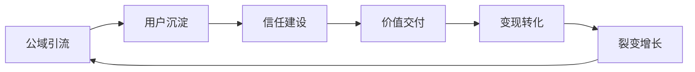
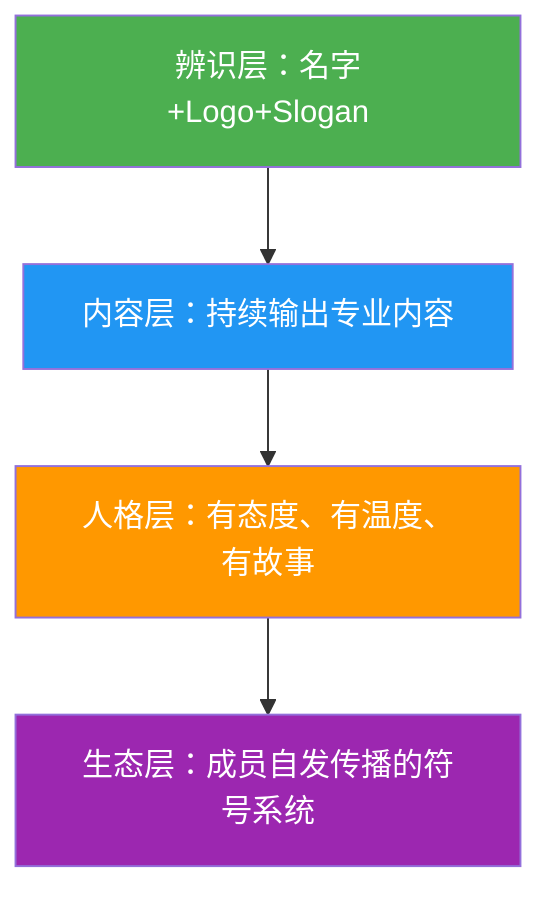
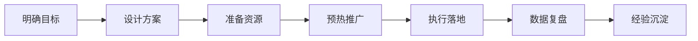

## 十一、本节总结

核心技巧一节围绕一个核心命题展开：**如何从零开始，搭建一个能持续增长、能稳定变现的私域社群？** 本节从"私域流量池搭建"出发，经过增长策略、运营节奏、商业模式设计、IP打造、数据化运营、内容与活动策划、工具选择，最终形成一套完整可复制的运营体系。

下面从九个维度系统回顾本节的核心方法论，并补充实操中容易忽略的关键细节。

---

### 1. 从0到1搭建私域流量池：底层架构决定上限

私域流量池不是"加了多少微信好友"，而是一套**可自由触达、反复使用、不依赖平台的用户资产体系**。搭建私域流量池的核心逻辑是：



**微信生态六大载体的分工：**

| 载体 | 核心作用 | 关键指标 | 优先级 |
|------|----------|----------|--------|
| 视频号 | 短视频引流 + 直播带货 | 播放量、关注转化率 | 高（流量入口） |
| 公众号 | 内容输出、信任建立 | 阅读量、关注增长率 | 中（内容沉淀） |
| 个人微信号 | 1对1深度沟通、朋友圈营销 | 好友数、互动率 | 高（信任核心） |
| 企业微信 | 规模化客户管理 | 客户数、消息触达率 | 高（规模化必备） |
| 微信群 | 社群运营、氛围营造 | 活跃度、转化率 | 高（运营核心） |
| 小程序 | 电商、会员管理、工具 | UV、转化率、复购率 | 中（交易闭环） |

**企业微信与个人微信的选择策略：**

- **个人IP、小团队**：以个人微信为主，信任度更高，朋友圈展示更自然，适合小规模、高客单价服务
- **企业、团队化运营**：以企业微信为主，客户数无上限，支持多人协作，员工离职可交接客户
- **最佳方案**：两者组合使用——用个人微信做深度信任连接，用企业微信做规模化管理和自动化运营

**五步搭建法（每一步都不可跳过）：**

1. **确定目标用户画像**——年龄、职业、痛点、平台偏好，画像越精准，后续转化率越高
2. **设计引流产品**——免费资源（电子书、模板）或低价体验（9.9元课程），用"钩子"降低决策门槛
3. **搭建承接体系**——入群欢迎语、群规、新人引导流程，第一印象决定用户是否留下
4. **设计留存机制**——每日价值输出、互动活动、积分等级，让用户有理由每天打开你的群
5. **建立转化路径**——从免费到付费的阶梯设计，关键节点的转化触发，复购和升级机制

**实操中的关键细节：** 很多人在第一步就犯错——画像写得"大而全"（25-45岁、一二线城市、有消费能力），结果引流来的用户什么人都有，社群缺乏凝聚力。正确做法是**聚焦一个细分人群的核心痛点**，比如"30-40岁、有0-3岁孩子的全职妈妈、想利用碎片时间月入3000+"，画像越具体，引流越精准，转化率越高。

---

### 2. 从0到1000人的增长策略：三个阶段，三种打法

社群增长不是"一直拉人"，而是**不同阶段用不同策略**：

**冷启动阶段（0-100人）——追求质量，不追求规模：**

- 逐一邀请，不群发——群发消息的转化率通常不到5%，而一对一私聊邀请的转化率可达30-50%
- 设计7天免费体验期，让用户在付费前先感受价值
- 快速迭代——根据种子用户反馈调整社群定位和内容方向
- 核心公式：`邀请人数 × 邀请转化率 × 体验完成率 × 付费转化率 = 首批会员数`

**增长阶段（100-500人）——裂变+内容引流双轮驱动：**

- 裂变机制设计要点：奖励要对双方都有吸引力（"邀请1位好友，双方各延长1个月会员"比"邀请3人送资料包"效果好3倍）
- 内容引流要选对平台：小红书适合生活方式类社群，抖音适合泛人群，视频号适合微信生态闭环
- 线下活动是信任加速器——线上聊100句不如线下见一面

**规模化阶段（500-1000人+）——产品线分层+团队化运营：**

- 从"一个人扛"转变为团队协作，至少覆盖内容、活动、客服三个角色
- 建立SOP（标准操作流程），让运营动作可复制
- 设计分层运营策略——不同活跃度的用户用不同方式维护

**每个阶段的常见陷阱：**

| 阶段 | 常见陷阱 | 后果 | 正确做法 |
|------|----------|------|----------|
| 冷启动 | 追求人数忽视质量 | 社群氛围差，种子用户流失 | 宁可30个精准用户，不要300个泛用户 |
| 增长期 | 过度依赖单一流量源 | 流量断崖式下跌 | 至少布局2-3个引流渠道 |
| 规模化 | 没有建团队就扩规模 | 运营质量崩塌，口碑变差 | 先搭团队，再扩规模 |

---

### 3. 社群运营的日常节奏：没有节奏的社群必然走向沉默

运营节奏是社群的"心跳"。很多社群不是没有好内容，而是没有稳定的输出节奏，用户不知道什么时候该来看、来看什么。

**日/周/月/季运营节奏表：**

| 周期 | 核心动作 | 目的 | 参考时间 |
|------|----------|------|----------|
| 每日 | 早报/晚报、话题互动、问题解答 | 保持活跃、提供日常价值 | 固定3个时间点（如8:00/12:00/21:00） |
| 每周 | 干货分享、案例拆解、周报总结 | 深度价值输出、建立专业感 | 固定1-2天（如周三分享、周五复盘） |
| 每月 | 线上直播、线下活动、月度复盘 | 强化社交连接、收集反馈 | 固定1-2次大型活动 |
| 每季 | 会员权益更新、产品迭代、数据大复盘 | 持续优化、保持新鲜感 | 每季度最后一周 |

**节奏设计的关键原则：**

- **固定时间、固定栏目**——让用户形成"到点就来看"的习惯。比如每天早上8点发早报，每周三晚上8点做分享
- **内容配比**——干货内容占50%，互动话题占30%，商业内容占20%（不超过20%是红线）
- **留白**——不要把每分钟都填满，给成员自发交流的空间
- **仪式感**——入群仪式、周年庆、月度之星评选，仪式感是社群粘性的重要来源

**实操模板——一周运营节奏示例：**

```text
周一：本周预告 + 行业资讯早报
周二：互动话题（"你遇到的最大挑战是？"）
周三：干货分享（图文/语音/直播，固定栏目）
周四：案例拆解/学员故事
周五：本周精华汇总 + 周末作业/挑战
周六：自由交流（不安排内容，让成员自发互动）
周日：下周预告 + 每周之星公布
```

---

### 4. 会员制商业模式设计：价格是最好的筛选器

会员制是社群变现最稳定、最可持续的模式。核心设计原则是**三级分层、权益递进、价格筛选**。

**三级会员体系：**

| 层级 | 功能定位 | 定价参考 | 核心权益 |
|------|----------|----------|----------|
| 免费层 | 引流和筛选 | 0元 | 部分社群内容、基础资讯、限次互动 |
| 基础付费层 | 主力变现 | 199-599元/年 | 全部内容、线上课程、每月直播、社群完整权限 |
| 高端付费层 | 高价值服务 | 1999-9999元/年 | 全部权益 + 1对1咨询 + 线下活动 + 资源对接优先权 |

**定价的核心逻辑：**

- 9.9元/年吸引来的用户投入度低、参与度低、付费意愿也低——低价不是"让更多人进来"，而是"让不合适的人进来"
- 定价要与你提供的价值匹配。如果你的社群每年能帮会员多赚1万元，收599元/年完全合理
- 可以用早鸟价、限时优惠做引流，但正价不要轻易打折——打折等于告诉老会员"你的信任不值钱"

**定价心理学的三个关键点：**

1. **锚定效应**——先展示高端会员价格（如4999元/年），再展示基础会员（如399元/年），基础会员立刻显得"便宜"
2. **拆解价值**——不要说"399元/年"，要说"每天不到1.1元，相当于一杯奶茶的1/10"
3. **稀缺性**——限时优惠、限额招募、仅限邀请，适度的稀缺性能显著提升转化率

**会员续费的关键：** 续费率是会员制社群的生命线。行业平均水平是50-70%，优秀社群可达80%以上。提升续费率的核心不是"续费打折"，而是在会员期内持续交付超出预期的价值，让会员觉得"不续费才是损失"。

---

### 5. 社群IP打造：让你的社群成为某个领域的"代名词"

社群IP不是"取一个好名字"，而是**在用户心智中建立一个清晰的认知标签**。当用户想到某个需求时，第一个想到你的社群。

**IP打造的四个层次：**



- **辨识层**：社群名称、Logo、Slogan、视觉风格要统一，让人一眼认出
- **内容层**：持续输出该领域的专业内容，建立"这个领域找他准没错"的认知
- **人格层**：社群要有"人设"——是犀利直接的？温暖陪伴的？专业严谨的？人设决定了社群的调性和吸引什么样的人
- **生态层**：最高境界——成员自发使用社群的符号、语言、方法论去传播，社群本身成为一种"文化符号"

**社群IP与个人IP的关系：** 社群IP初期依托个人IP（创始人/主理人的个人品牌），但成熟后应该独立于个人IP——即使创始人不在，社群依然能运转。这需要从"个人依赖"过渡到"体系依赖"：建立内容团队、培养核心成员、形成社群文化。

---

### 6. 社群数据化运营：用数据驱动决策，而非靠感觉

"感觉我的社群还行"是运营中最大的幻觉。不看数据的运营就像不看仪表盘开车——看起来在走，实际上随时可能翻车。

**四大核心指标及优化方向：**

| 指标 | 计算方式 | 优秀 | 良好 | 需要干预 |
|------|----------|------|------|----------|
| 日活跃率 | 当日互动人数÷总人数 | 20%-40% | 10%-20% | <5% |
| 30日留存率 | 30天后仍在群人数÷入群人数 | >80% | 60%-80% | <40% |
| 付费转化率 | 付费人数÷总人数 | 10%-20% | 5%-10% | <2% |
| 裂变系数 | 平均每个成员带来新成员数 | >1.0 | 0.5-1.0 | <0.3 |

**三个辅助指标同样重要：**

- **商业内容占比**：控制在20%以内，超过30%社群就会变味。计算方法：商业类消息数÷总消息数
- **LTV/CAC比值**：客户终身价值÷获客成本，健康值>3。低于3说明获客成本太高或客户价值太低
- **内容消费率**：发布的内容被阅读/观看的比例，低于50%说明内容不对路

**数据化运营的三步落地法：**

1. **建看板**——用企业微信后台、小程序数据、简单的Excel表格，把四大核心指标和三个辅助指标集中展示
2. **周复盘**——每周花30分钟看数据，找出异常值（活跃率突然下降？某条内容互动率特别高？）并分析原因
3. **月迭代**——每月根据数据调整运营策略，形成"数据→分析→行动→验证"的闭环

**实用工具推荐：**

- 企业微信自带的数据分析——基础但够用
- 小程序数据助手——小程序运营必备
- 腾讯文档/飞书多维表格——手工记录+可视化
- 第三方工具（微伴助手、语鹦企服等）——自动化数据采集和分析

---

### 7. 社群内容运营技巧：内容是社群的血液

社群内容不是"想到什么发什么"，而是**有规划、有节奏、有质量标准的系统性输出**。

**内容日历的制作方法：**

1. 确定内容栏目（如行业资讯、干货教程、案例拆解、互动话题、学员故事）
2. 分配到每周固定时间（如周一资讯、周三干货、周五案例）
3. 提前一周准备内容（至少提前三天，避免临时凑数）
4. 每月做一次内容复盘——哪些内容互动率高？哪些没人看？根据数据调整

**高互动内容的五个特征：**

1. **与用户痛点直接相关**——不是你觉得重要的内容，而是用户觉得有用的内容
2. **有具体数字和案例**——"3个月涨粉10万"比"快速涨粉"吸引人10倍
3. **引发讨论和争议**——适当的观点碰撞比"都对都好"更能激发互动
4. **可操作、可落地**——看完就能用的内容比"理论框架"更受欢迎
5. **有故事、有温度**——纯干货容易疲劳，穿插真实故事保持新鲜感

**内容配比黄金法则：**

```text
干货内容（教程/方法论/行业分析）    50%
互动内容（话题讨论/投票/问答）      30%
商业内容（产品推荐/活动促销/付费引导）20%（上限）
```

---

### 8. 社群活动策划技巧：活动是社群的兴奋剂

日常运营维持温度，活动创造峰值体验。一个策划得当的活动能让社群活跃度在短期内提升3-5倍。

**活动策划的完整流程：**



**六类高参与度活动模板：**

| 活动类型 | 适用场景 | 参与门槛 | 效果特点 |
|----------|----------|----------|----------|
| 打卡挑战 | 学习型社群 | 低 | 提升日活、培养习惯 |
| 主题分享 | 专业型社群 | 中 | 提升专业感、收集内容素材 |
| 限时拼团 | 电商型社群 | 低 | 短期爆发式转化 |
| 线下见面 | 所有社群 | 高 | 信任加速、社交深度 |
| 评选活动 | 所有社群 | 中 | 激发参与、制造话题 |
| 拆解工作坊 | 行业型社群 | 中 | 深度价值输出、提升专业口碑 |

**活动策划的五个关键细节：**

1. **预热要充分**——活动前3-5天开始预告，用倒计时、剧透、悬念制造期待感
2. **门槛要适当**——门槛太高没人参加，门槛太低没有筛选效果。最佳门槛是"需要付出一点努力但不会太难"
3. **反馈要及时**——活动过程中实时播报进度、公布成绩、表彰参与者
4. **仪式感要足**——颁奖、证书、排行榜、专属称号，仪式感能让参与者获得成就感
5. **复盘要认真**——每次活动结束后做数据复盘：参与率、转化率、满意度、可改进点

---

### 9. 私域工具选择：工具让效率提升10倍

工欲善其事，必先利其器。私域运营涉及的环节多，手动操作效率低且容易出错，选对工具能大幅降低运营成本。

**按功能分类的工具推荐：**

| 功能 | 推荐工具 | 核心能力 | 适用规模 |
|------|----------|----------|----------|
| 企业微信管理 | 微伴助手、语鹦企服 | 自动欢迎语、标签管理、数据统计 | 100人+ |
| 社群管理 | 小裂变、零一裂变 | 裂变活动、打卡、抽奖 | 200人+ |
| 内容创作 | Canva、稿定设计、剪映 | 海报制作、视频剪辑 | 所有规模 |
| 数据分析 | 企业微信后台、小程序数据助手 | 用户画像、行为分析 | 所有规模 |
| 会员管理 | 小鹅通、知识星球 | 会员体系、课程交付、付费管理 | 100人+ |
| 自动化运营 | 微伴助手、尘锋SCRM | 自动标签、SOP消息、智能分配 | 300人+ |

**工具选择的原则：**

1. **先用免费工具验证模式，再投入付费工具提升效率**——不要还没开始运营就花几千块买工具
2. **宁用一个工具用透，不用十个工具用浅**——工具太多反而增加管理成本
3. **优先选择与微信生态打通的工具**——减少用户跳转，降低流失率
4. **数据可导出是底线**——选择的工具必须支持数据导出，避免被工具绑定

---

### 10. 综合能力评估：你掌握了多少？

用以下清单自检，看看你对本节内容的掌握程度：

| 能力维度 | 初级（知道） | 中级（会做） | 高级（做得好） |
|----------|-------------|-------------|---------------|
| 私域搭建 | 知道微信生态六大载体 | 能独立完成五步搭建法 | 能根据业务特点设计最优载体组合 |
| 社群增长 | 知道三个增长阶段 | 能执行裂变活动 | 能设计自增长飞轮模型 |
| 运营节奏 | 知道日/周/月节奏 | 能制作内容日历并执行 | 能根据数据动态调整节奏 |
| 商业模式 | 知道三级会员体系 | 能设计会员权益和定价 | 能组合多种变现模式实现收入最大化 |
| IP打造 | 知道社群需要IP | 能设计辨识层和内容层 | 能形成成员自发传播的文化符号 |
| 数据运营 | 知道四大核心指标 | 能建看板、做周复盘 | 能通过数据预测趋势并提前干预 |
| 内容运营 | 知道内容配比法则 | 能制作高互动内容 | 能建立内容生产的SOP和团队 |
| 活动策划 | 知道活动策划流程 | 能独立策划执行活动 | 能设计系列化活动体系 |
| 工具使用 | 知道有哪些工具 | 能熟练使用2-3个核心工具 | 能搭建工具矩阵实现自动化运营 |

---

### 11. 从本节到落地：关键行动步骤

学完核心技巧，最重要的是**立即行动**。以下是按优先级排列的行动清单：

**第一步（本周内完成）：**
- 确定你的社群定位——用一句话写清楚"服务谁、解决什么问题、提供什么独特价值"
- 选择主要载体——个人微信/企业微信/知识星球，选一个先开始
- 列出50个潜在种子用户，开始逐一邀请

**第二步（两周内完成）：**
- 制作第一份4周内容日历
- 设计入群欢迎语、群规、新人引导流程
- 完成第一次社群活动的策划

**第三步（一个月内完成）：**
- 建立核心数据看板，开始追踪四大指标
- 设计会员权益体系（免费→基础→高端）
- 做第一次月度数据复盘

**记住：** 不要追求完美再开始。先用最小可行方案跑起来，在实践中迭代优化。一个已经开始运营的60分社群，永远比一个停留在规划中的100分社群更有价值。
