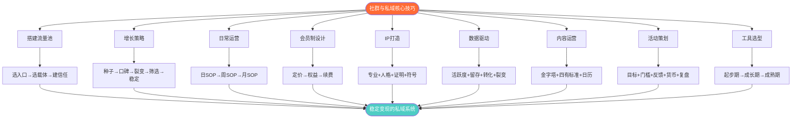

## 七、本节核心要点

本节从私域流量池搭建、社群增长、日常运营、会员制设计、IP打造、数据化运营、内容技巧、活动策划、工具选型十个维度，系统拆解了"核心技巧"的完整方法论。本节不是泛泛而谈的"总结"，而是将上述十个模块中最关键的方法、最易犯的错误、最值得投入精力的优先级提炼出来，让你在一张纸上掌握整套运营系统的骨架。

---

### 1. 私域流量池搭建：三步走通闭环

搭建私域流量池的底层逻辑可以用一张公式概括：

> **私域变现 = 流量入口 × 沉淀效率 × 信任浓度 × 转化能力 × 裂变系数**

五个变量中任何一个为零，整体收益就是零。这是"乘法思维"，不是"加法思维"——不是做了其中一两个环节就够了，而是每个环节都不能掉链子。

**第一步：选对流量入口**

| 入口类型 | 平台示例 | 适合场景 | 获客成本（参考） |
|----------|----------|----------|-----------------|
| 短视频引流 | 抖音、视频号、B站 | 泛流量、品牌曝光 | 1-10元/粉丝 |
| 图文种草 | 小红书、公众号 | 精准需求匹配 | 2-15元/粉丝 |
| 社区渗透 | 知乎、豆瓣、贴吧 | 垂直领域专家形象 | 0.5-5元/粉丝 |
| 线下活动 | 沙龙、展会、门店 | 高信任、高客单价 | 50-200元/人 |
| 老客户转介绍 | 微信群、朋友圈 | 口碑裂变 | 0元（纯人力成本） |

选择原则：你的目标用户在哪里活跃，你就从哪里引流。不要贪多——新手阶段集中精力做好一个入口，比同时铺五个入口效果好10倍。

**第二步：选对沉淀载体**

微信生态提供了五种沉淀载体，各有适用场景：

- **个人微信号**：信任度最高，适合小规模、高客单价服务。劣势是好友上限5000人、无法多人协作、员工离职会带走客户
- **企业微信**：客户数无上限，支持多人协作和客户交接。适合有团队的中大型运营者。劣势是"企业感"略强，信任建立需要更多努力
- **微信社群**：氛围营造和批量互动的主战场。但群生命周期管理是核心挑战——不会管理的群，3个月内80%变成"死群"
- **公众号**：内容沉淀的主阵地，适合长文输出和品牌建设。但打开率持续下降（2025年平均不到3%），不能作为唯一触达渠道
- **小程序**：电商交易和会员管理的工具层。开发成本较高，但用户体验最流畅

**第三步：建立信任体系**

信任 = 专业能力 × 持续输出 × 真实人格 × 社交证明。具体做法：

1. **朋友圈人设管理**：每天发3-5条，比例为干货40% + 生活30% + 观点20% + 产品10%。朋友圈是你的"24小时展厅"，但不是广告墙
2. **社群价值日历**：提前规划每周的内容主题、活动安排、互动话题。让用户形成"每周期待"，而不是"想起来才发一条"
3. **1对1深度沟通**：新用户入群后48小时内进行一次1对1沟通，了解需求、建立连接。这个动作的转化率是群发消息的5-10倍

---

### 2. 社群增长：从0到1000人的五个阶段

社群增长不是"拉人头"，而是"吸引对的人"。每个阶段有不同的核心策略：

**阶段一：种子用户（0-50人）——质量优先**

- 手动邀请你认识的、符合条件的人。不要用"帮我转发一下"的方式，而是1对1诚恳邀请，说明社群的价值定位
- 种子用户的质量决定了社群的基因。如果种子用户都是"薅羊毛"心态的人，后面很难培养出付费习惯
- 验证指标：入群后7天内的发言率 > 60%

**阶段二：口碑期（50-200人）——体验优先**

- 集中精力做"超预期体验"——不在于活动多频繁，而在于每次活动/分享都要让用户觉得"值回票价（哪怕票价是0）"
- 设计"可分享的时刻"：比如一份特别有料的资料包、一次令人印象深刻的群内讨论、一个解决了实际问题的方案
- 验证指标：老用户主动邀请新人的比例 > 20%

**阶段三：裂变期（200-500人）——机制优先**

- 设计裂变活动：邀请有礼、拼团入群、分享解锁、阶梯奖励
- 裂变活动的核心公式：**传播意愿 = （预期收益 - 参与成本）× 社交货币价值**
- 常见裂变玩法对比：

| 玩法 | 参与门槛 | 裂变效率 | 用户质量 | 适合场景 |
|------|----------|----------|----------|----------|
| 邀请有礼 | 低 | 中 | 高 | 日常增长 |
| 拼团入群 | 中 | 高 | 中 | 新品/课程推广 |
| 分享解锁 | 低 | 高 | 中 | 内容引流 |
| 阶梯奖励 | 中 | 中 | 高 | 冲刺增长 |
| 群裂变海报 | 低 | 极高 | 低 | 短期爆发 |

**阶段四：筛选期（500-800人）——付费过滤**

- 设计付费门槛（哪怕只是9.9元），筛选掉"潜水党"和"白嫖党"
- 付费用户的价值是免费用户的10倍以上：活跃度更高、转化率更高、流失率更低
- 不要怕"人少了"——500个精准付费用户的价值远超5000个免费僵尸粉

**阶段五：稳定期（800-1000人）——生态优先**

- 建立社群内的"自运转"机制：核心成员互帮互助、老带新、内容共创
- 培养3-5个"超级用户"——他们是社群氛围的守护者，也是你最可靠的口碑传播者
- 验证指标：即使你一周不在群内发言，社群依然保持活跃

---

### 3. 日常运营节奏：标准化SOP

社群运营最忌讳"三天打鱼两天晒网"。日常节奏的核心是**让用户形成预期**——他们知道每周几有什么内容，每天什么时间段有互动。

**每日必做清单（30分钟以内）：**

```text
早安问候（8:00-9:00）     → 分享一条行业资讯/金句/早报
互动回复（全天）          → 及时回应群内提问，不超过2小时
价值输出（12:00-13:00）   → 午间干货分享/案例拆解
晚间互动（20:00-21:00）   → 话题讨论/问答/复盘
```

**每周必做清单：**

| 时间 | 事项 | 目的 |
|------|------|------|
| 周一 | 本周预告+主题发布 | 建立预期，提升参与度 |
| 周二-周四 | 深度内容输出 | 价值交付，信任积累 |
| 周五 | 本周精华整理+复盘 | 内容沉淀，降低流失 |
| 周六 | 轻松互动/主题活动 | 调节氛围，增加粘性 |
| 周日 | 下周规划+数据复盘 | 持续优化，迭代改进 |

**每月必做清单：**
- 月度数据复盘（活跃度、留存率、转化率、收入）
- 核心成员1对1沟通（至少5人）
- 一次大型活动/直播
- 一次社群规则/价值回顾

---

### 4. 会员制设计：三个关键决策

会员制是私域变现的"压舱石"——它提供稳定的现金流，让你不用每个月都从零开始卖东西。

**决策一：定价策略**

| 定价区间 | 定位 | 目标用户 | 运营策略 |
|----------|------|----------|----------|
| 9.9-99元 | 入门体验 | 对你有初步兴趣的泛用户 | 降低决策门槛，快速拉量 |
| 199-499元 | 标准会员 | 认可你价值的活跃用户 | 稳定现金流+持续价值交付 |
| 999-2999元 | 高级会员 | 深度信任的核心用户 | 高价值服务+稀缺性 |
| 3000元以上 | 私董会/VIP | 企业主/高管/高净值人群 | 1对1服务+资源对接+圈层价值 |

定价黄金法则：**会员年费 ≤ 会员获得价值的1/3**。如果用户花299元加入社群，但通过社群获得的信息、人脉、机会价值超过1000元，续费率就会很高。

**决策二：权益设计**

会员权益必须包含三个层次：
- **基础权益（人人有份）**：社群入场资格、每周内容、资源库访问、专属标签
- **进阶权益（活跃者有份）**：优先提问权、嘉宾连麦、线下活动名额、1对1答疑
- **稀缺权益（核心成员专属）**：私董会席位、资源对接优先权、联合项目合作、年度私享会

**决策三：续费机制**

续费率是会员制社群的生命线。续费率 > 70% 是健康线，> 85% 是优秀线。

提升续费率的五个方法：
1. **成长可视化**：定期展示会员的成长轨迹（收入提升、技能增长、人脉拓展）
2. **沉没成本设计**：积分系统、等级体系、连续付费奖励
3. **社交关系沉淀**：让会员之间建立连接，形成"不舍得离开"的社交网络
4. **续费早鸟优惠**：提前1个月续费享8折，提前2个月享7折
5. **流失预警机制**：会员30天未活跃自动触发关怀流程

---

### 5. 社群IP打造：从"建群的人"到"被追随的人"

IP（Intellectual Property）不是"装出来的形象"，而是"长期积累的专业认知+人格魅力的综合体"。

**IP打造的四个维度：**

| 维度 | 内容 | 落地方式 |
|------|------|----------|
| 专业能力 | 你在这个领域的知识深度和广度 | 持续输出高质量内容、解决实际问题 |
| 人格魅力 | 你的价值观、说话方式、处事风格 | 朋友圈展示真实生活、有态度的观点输出 |
| 社交证明 | 别人对你的评价和背书 | 用户好评、媒体报道、合作案例、数据成果 |
| 视觉符号 | 你的外在辨识度 | 统一头像、昵称、口头禅、内容排版风格 |

**IP内容输出的"三七法则"：**
- 70%的输出围绕你的核心领域（专业内容）
- 30%的输出展示你的人格面（生活感悟、个人故事、价值观表达）
- 绝对不要反过来——没有专业支撑的人格展示就是"自嗨"

**IP冷启动的30天计划：**

```text
第1-7天：   定位梳理（我是谁、我服务谁、我能提供什么）
第8-14天：  内容测试（发10篇不同方向的内容，看哪类反馈最好）
第15-21天： 人设固化（确定内容方向+视觉风格+表达方式）
第22-30天： 持续输出（每天至少1条高质量内容，建立用户预期）
```

---

### 6. 数据化运营：四个核心仪表盘

不看数据的运营是"盲人开车"。你不需要成为数据分析师，但必须关注四个核心指标：

**仪表盘一：活跃度指标**

| 指标 | 计算方式 | 健康线 | 优秀线 |
|------|----------|--------|--------|
| 日活跃率 | 当日发言人数 / 总人数 | > 15% | > 30% |
| 周活跃率 | 7天内发言人数 / 总人数 | > 40% | > 60% |
| 消息密度 | 日消息数 / 总人数 | > 2条 | > 5条 |
| 互动参与率 | 参与活动人数 / 总人数 | > 20% | > 40% |

**仪表盘二：留存率指标**

- **7日留存率**：入群7天后仍在群内的比例。健康线 > 80%
- **30日留存率**：入群30天后仍在群内的比例。健康线 > 60%
- **月度流失率**：每月退群/沉默的比例。健康线 < 5%

**仪表盘三：转化率指标**

- **付费转化率**：免费用户转付费的比例。健康线 > 3%
- **复购率**：首次付费后二次付费的比例。健康线 > 30%
- **客单价**：平均每位付费用户的消费金额。要持续跟踪趋势

**仪表盘四：裂变系数**

- **K因子**：每个用户平均带来的新用户数。K > 1 表示自然增长，K < 1 需要外部流量补充
- **裂变层级**：一个活动触达了几层用户。3层以上是好活动
- **裂变成本**：每个裂变新用户的获客成本。要低于其他获客渠道

**数据复盘模板（每周一次，15分钟）：**

```markdown
## 本周数据复盘

### 核心指标
- 新增用户：___人
- 退群用户：___人
- 日活跃率：___%
- 付费转化：___人，___元

### 内容数据
- 最受欢迎的内容：___（原因分析：___）
- 表现最差的内容：___（原因分析：___）

### 行动计划
- 下周重点改进：___
- 下周测试事项：___
```

---

### 7. 内容运营：让用户"追着看"的三个法则

社群内容不是"我想说什么"，而是"用户需要什么"。

**法则一：内容金字塔模型**

```text
                    ▲  10% 原创深度内容
                   ▲▲  （行业报告、独家观点、原创方法论）
                  ▲▲▲
                 ▲▲▲▲  30% 精选优质内容
                ▲▲▲▲▲  （好文转发+你的解读、行业案例拆解）
               ▲▲▲▲▲▲
              ▲▲▲▲▲▲▲  60% 日常互动内容
             ▲▲▲▲▲▲▲▲  （早报、问答、话题讨论、实操打卡）
```

- **60%日常互动**保持群活跃度
- **30%精选内容**建立你的专业形象
- **10%原创深度**建立不可替代性

**法则二：内容选题的"四有标准"**

每一条发到社群的内容，都要过这个检查：
- **有用**：能解决用户的实际问题
- **有趣**：能让用户愿意花时间看完
- **有料**：有具体数据、案例、方法论，不是空话
- **有感**：能引发共鸣，让用户想回复、想分享

四条全中是爆款内容，命中两条以上是合格内容，命中不到两条就不要发。

**法则三：内容日历模板**

提前一个月规划内容主题，避免每天"临时抱佛脚"：

| 周次 | 周一 | 周二 | 周三 | 周四 | 周五 |
|------|------|------|------|------|------|
| 主题 | 行业早报 | 实操干货 | 案例拆解 | 互动问答 | 精华回顾 |
| 形式 | 图文 | 图文/视频 | 长文 | 话题讨论 | 周报 |
| 时长 | 5分钟 | 15分钟 | 20分钟 | 30分钟 | 10分钟 |

---

### 8. 活动策划：让用户"忍不住参加"的五要素

一场成功的社群活动需要满足五个要素：

**要素一：明确的活动目标**

每次活动只能有一个主要目标，贪多必败：

| 活动类型 | 主要目标 | 适合频率 | 参考数据 |
|----------|----------|----------|----------|
| 直播分享 | 内容交付+信任建立 | 每周1次 | 参与率20-40% |
| 限时秒杀 | 电商转化 | 每月1-2次 | 转化率5-15% |
| 裂变活动 | 拉新增长 | 每月1次 | 裂变系数2-5 |
| 线下聚会 | 深度连接 | 每季度1次 | 到场率60-80% |
| 打卡挑战 | 习惯养成+活跃 | 每月1次 | 完成率30-50% |

**要素二：低门槛的参与方式**

参与路径越短越好。理想路径：看到活动 → 点击链接 → 参与完成，三步以内搞定。每多一步流失30-50%的参与者。

**要素三：即时的正反馈**

用户参与后要立刻得到回报——一张专属海报、一份资料包、一个积分、一句感谢。即时反馈让大脑产生"参与感→成就感→下次还想参加"的正循环。

**要素四：社交货币**

设计能让用户"晒出来"的内容——精美海报、成绩证书、排名榜单、专属称号。用户晒活动 = 免费帮你做裂变。

**要素五：活动复盘SOP**

每次活动结束后24小时内完成复盘：
1. 目标达成率（实际数据 vs 目标数据）
2. 用户反馈收集（至少5条深度反馈）
3. 流程问题记录（哪些环节卡壳了）
4. 优化清单（下次改进什么）
5. 沉淀素材（活动内容、用户好评、数据成果）

---

### 9. 私域工具选型：按阶段配置

工具不是越贵越好，而是越匹配你的阶段越好。

**起步期（0-500人，月预算 < 500元）：**

| 工具类型 | 推荐工具 | 用途 | 费用 |
|----------|----------|------|------|
| 社群管理 | 微信群+企业微信 | 基础社群运营 | 免费 |
| 内容排版 | 135编辑器/秀米 | 公众号排版 | 免费/99元/年 |
| 海报设计 | Canva/创客贴 | 活动海报、朋友圈素材 | 免费/基础版 |
| 表单收集 | 腾讯问卷/金数据 | 用户调研、活动报名 | 免费 |
| 数据统计 | Excel/飞书多维表格 | 手动记录核心数据 | 免费 |

**成长期（500-3000人，月预算 500-3000元）：**

| 工具类型 | 推荐工具 | 用途 | 费用 |
|----------|----------|------|------|
| SCRM系统 | 微伴助手/尘锋 | 客户标签、自动打标、SOP | 500-2000元/月 |
| 直播工具 | 视频号直播/小鹅通 | 线上分享、课程交付 | 0-500元/月 |
| 小程序 | 有赞/微店 | 电商交易、会员管理 | 300-1000元/月 |
| 自动化 | wetool替代方案/企微API | 自动回复、群发、标签管理 | 200-500元/月 |

**成熟期（3000人以上，月预算 3000元以上）：**

| 工具类型 | 推荐工具 | 用途 | 费用 |
|----------|----------|------|------|
| 私域运营平台 | 企业微信+API定制 | 全链路自动化 | 按需 |
| 数据中台 | 自建/第三方BI | 多维数据分析 | 1000-5000元/月 |
| 会员系统 | 自建小程序 | 深度会员管理 | 按需开发 |
| 内容中台 | 飞书/Notion | 内容库管理、协作 | 500-2000元/月 |

---

### 10. 常见误区与纠正方法

以下是新手（甚至老手）最容易踩的坑，每个误区都附带了具体的纠正方法：

**误区一：盲目拉人，不筛选用户**

错误做法：到处发群二维码，来者不拒，群人数快速增长但无人说话。

纠正方法：设置入群门槛（回答问题、自我介绍、付费入群），宁可慢一点，也要确保入群的人符合你的社群定位。300个精准用户 > 3000个无关用户。

**误区二：内容"自嗨"，不看反馈**

错误做法：每天发自己觉得有价值的内容，从不看用户的反应和数据。

纠正方法：每周复盘内容数据（点赞、回复、转发），找出用户真正感兴趣的方向。内容选题的依据不是"我想讲什么"，而是"用户问了什么、痛点是什么"。

**误区三：只做免费，不做付费**

错误做法：害怕收费会"掉粉"，一直做免费社群，结果越做越累，没有正向现金流。

纠正方法：免费社群是"漏斗入口"，付费社群才是"价值交付"。9.9元的门槛就能筛掉80%的无效用户。哪怕初期定价很低，也要让用户养成"好内容值得付费"的认知。

**误区四：一个人扛所有事**

错误做法：群主包揽所有内容产出、答疑、活动策划，一旦忙不过来群就冷了。

纠正方法：培养核心成员成为"群管"或"嘉宾"，建立内容共创机制（用户投稿、老带新、话题接力）。社群不是群主的独角戏，而是所有成员的共创空间。

**误区五：忽视社群规则**

错误做法：没有群规，或者群规形同虚设，导致广告泛滥、水聊刷屏、负面情绪蔓延。

纠正方法：入群时明确群规，违规第一次警告、第二次移除。关键规则包括：禁止广告、禁止人身攻击、鼓励原创分享、保护他人隐私。规则不是限制，而是保护社群氛围的"防火墙"。

**误区六：过度依赖单一平台**

错误做法：所有用户都在一个微信群里，一旦群被封或微信出问题，整个业务崩溃。

纠正方法：多载体分散沉淀——微信群 + 企业微信 + 公众号 + 小程序。每个载体之间有导流路径，即使一个渠道出问题，其他渠道依然能触达用户。

**误区七：只关注新增，忽视留存**

错误做法：花大量精力搞裂变活动拉新，但老用户不断流失，像"漏水的桶"。

纠正方法：先堵漏再加水。花60%的精力维护老用户（内容质量、互动频率、问题解决），花40%的精力拉新。老用户的留存率每提升10%，长期收入提升20-30%。

---

### 11. 总结：核心技巧的"一张图"

将本节全部内容浓缩为一张行动地图：



**最后的忠告：**

社群和私域流量不是"一夜暴富"的生意，而是一个"慢变量"——前3个月可能看不到收入，但一旦系统运转起来，它会成为你最稳定的收入来源。核心技巧的九个模块就像一台机器的九个齿轮，不需要每个都做到100分，但每个至少要及格（60分以上），机器才能正常运转。从你最薄弱的环节开始改进，比从最容易的环节开始改进，效果好得多。

记住三个数字：
- **1000个铁杆粉丝**：这是一个人靠内容和服务能养活自己的最低门槛
- **3个月验证期**：给自己3个月时间验证模式，不要3周就放弃
- **70%续费率**：这是会员制社群的生命线，低于这个数字说明价值交付有问题
