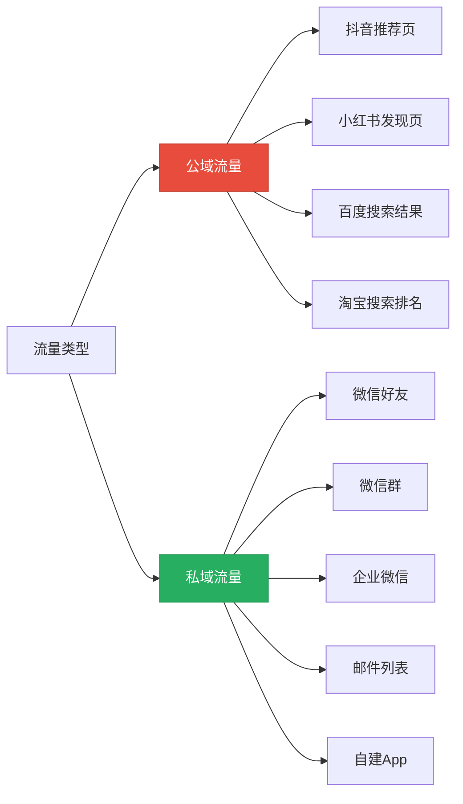
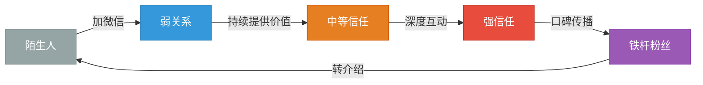
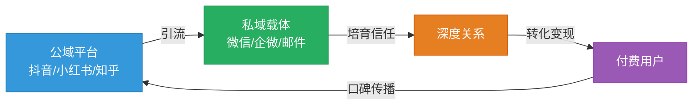
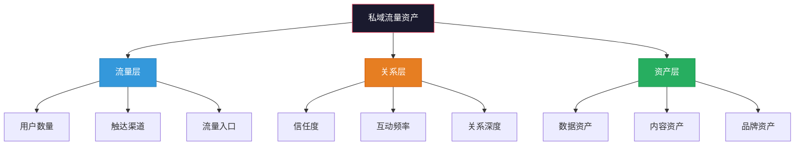

## 一、私域流量的本质：你拥有的数字资产

在讨论社群运营的技巧之前，必须先搞清楚一个根本问题：**私域流量到底是什么？它为什么能赚钱？它和你在抖音、小红书上积累的粉丝有什么本质区别？**

如果这个问题没有想清楚，后面所有的运营动作都会变形。你会把"加好友"当成目的，把"拉群"当成成果，把"刷屏广告"当成变现——然后发现群很快就死了，钱也没赚到。

本节将从本质定义出发，逐层拆解私域流量的底层逻辑，帮你建立正确的认知框架。

---

### 1.1 什么是私域流量？一个精确的定义

**私域流量的定义：** 你可以自由触达、反复使用、不需要向第三方平台额外付费的用户资源。

这三个条件缺一不可：

| 条件 | 含义 | 反例 |
|------|------|------|
| **自由触达** | 你想联系用户时，可以主动发起，不需要经过平台审核或算法筛选 | 抖音粉丝：你发一条视频，平台只推给5%-10%的粉丝 |
| **反复使用** | 同一批用户可以被多次触达，触达成本趋近于零 | 朋友圈广告：每次触达都要付费 |
| **不额外付费** | 不需要为每次触达向平台支付费用 | 百度竞价排名：每次点击都要花钱 |

满足这三个条件的典型载体包括：

- **微信个人号好友**（最典型的私域载体）
- **微信群**（社群形态的私域）
- **企业微信好友**（企业级私域载体）
- **公众号粉丝**（半私域，受平台推送规则限制）
- **小程序用户**（可触达，但依赖微信生态）
- **自建App用户**（最完整的私域，但获客成本高）
- **邮件列表订阅者**（海外最主流的私域形式）
- **短信通讯录**（触达率高但体验差）

---

### 1.2 私域流量的本质：一种数字资产

理解私域流量，最有效的方式是用一个类比：**房产**。

| 维度 | 公域流量（租房） | 私域流量（买房） |
|------|-----------------|-----------------|
| **所有权** | 平台拥有用户，你只是"租客" | 你拥有用户关系，完全属于你 |
| **触达权** | 受平台算法控制，不确定 | 自由触达，想什么时候联系就什么时候联系 |
| **成本结构** | 持续付费（租金），停付就失去 | 一次性投入+维护成本（装修+物业费） |
| **风险** | 平台规则变化、封号、限流 | 用户流失、关系淡化 |
| **可迁移性** | 不可迁移（换个平台要从零开始） | 可部分迁移（导出通讯录、备份聊天记录） |
| **增值性** | 不增值（流量越用越贵） | 可增值（用户信任随时间增长） |

这个类比揭示了私域流量最核心的属性——**资产性**。

什么是资产？资产是能持续产生价值的资源。私域流量满足资产的所有特征：

**1. 可控性**——你说了算，不受第三方平台的规则限制

2023年，抖音大规模调整算法，大量百万粉丝博主的视频播放量从百万级跌到几千。2024年，小红书对引流到微信的行为进行封号处理。2025年，微信公众号改版，订阅号消息的打开率持续下降。

每一次平台规则变化，都有大量"大V"一夜回到解放前。但那些把用户沉淀到私域的人，几乎不受影响——因为他们不需要依赖平台的算法来触达用户。

**2. 可复用性**——一次获取，终身可用

你在抖音获取一个粉丝，这个粉丝今天看了你的视频，明天可能就忘了你。但如果你把这个粉丝加到微信好友，你可以每天发朋友圈让他看到你，每周发消息给他提供价值，每月推荐一次你的产品。

私域流量的触达成本接近于零。你发一条朋友圈给5000人看，成本为零。你发一封邮件给10000个订阅者，成本可能只有几块钱。这种边际成本趋近于零的特性，是私域流量能够产生复利效应的根本原因。

**3. 可增值性**——信任随时间积累

一个刚加你微信的陌生人，对你的信任度很低，转化率可能只有1%。但如果他关注了你3个月，每天看到你的朋友圈分享干货、见证你的专业能力、感受到你的真诚态度，信任度会大幅提升，转化率可能达到10%甚至更高。

这意味着你的私域流量不是"静态资产"，而是"增值资产"。时间越长，价值越高。

---

### 1.3 私域流量的经济学本质：从"租流量"到"拥有流量"

要真正理解私域流量的价值，必须从经济学角度来分析。

**公域流量的成本结构：获客成本（CAC）持续上升**

中国互联网的获客成本在过去十年经历了剧烈变化：

| 时期 | 主流平台 | 单个粉丝获客成本 | 说明 |
|------|---------|-----------------|------|
| 2014-2016 | 微信公众号 | 0.1-0.5元 | 流量红利期，内容即获客 |
| 2017-2019 | 抖音/快手 | 0.5-2元 | 短视频红利期，算法推荐带来免费流量 |
| 2020-2022 | 全平台 | 2-10元 | 流量竞争加剧，付费获客成为主流 |
| 2023-2025 | 全平台 | 5-50元 | 流量成本高企，私域成为降本关键 |
| 2026+ | 全平台 | 持续上升 | AI内容泛滥导致用户注意力更加稀缺 |

这意味着什么？如果你完全依赖公域流量获客，你的获客成本会逐年递增，利润会被不断蚕食。

**私域流量的成本结构：前期投入+边际成本趋零**

私域流量的成本分为两部分：

1. **前期获客成本**：把公域用户导入私域的一次性成本（通常高于直接获客成本，因为需要提供"钩子"吸引用户加你）
2. **后续维护成本**：内容创作、社群运营、用户服务的持续投入（主要是时间成本）

但关键在于：**私域的边际获客成本为零**。你有1000个微信好友，多加1个人的边际成本几乎为零。而公域流量，每多获取1个用户，都要付出固定的获客成本。

这就是为什么私域流量被称为"资产"——它是一种**边际成本递减、边际收益递增**的资源。

**核心公式：LTV/CAC**

衡量私域流量价值的核心指标是 **LTV（客户终身价值）/ CAC（客户获取成本）**。

- LTV：一个用户在整个生命周期内为你贡献的总价值
- CAC：获取这个用户的总成本

当 LTV/CAC > 3 时，你的商业模式是健康的。私域流量的优势在于：**它能大幅提升LTV，同时降低长期CAC**。

举例说明：

| 指标 | 纯公域模式 | 公域+私域模式 |
|------|-----------|-------------|
| 首次获客成本 | 10元 | 15元（含引流钩子成本） |
| 用户购买次数 | 1.2次/年 | 4次/年 |
| 客单价 | 50元 | 80元 |
| 用户生命周期 | 1年 | 3年 |
| **LTV** | **60元** | **960元** |
| **LTV/CAC** | **6** | **64** |

虽然私域模式的首次获客成本更高，但由于用户留存时间更长、购买频次更高、客单价更高，LTV大幅增长。这就是私域流量的经济学本质。

---

### 1.4 私域流量 vs 公域流量：不是替代，而是协同

很多人把私域流量和公域流量对立起来，认为"做私域就不用做公域了"。这是一个严重的认知错误。

**正确的关系是：公域获客，私域养客。**

公域平台的优势是**流量大、获客快**，但缺点是**不可控、成本高**。

私域的优势是**可控、免费、可复用**，但缺点是**获客慢、需要持续维护**。

两者结合才是最优解：

1. **在公域做内容**：利用平台的算法推荐获取免费流量，建立专业形象
2. **引流到私域**：通过"钩子"（免费资料、社群、咨询）把公域用户导入微信
3. **在私域做转化**：通过朋友圈、社群、私聊建立信任，实现变现
4. **用私域反哺公域**：私域用户的互动、好评、传播，反过来提升公域内容的权重

这是一个**正向飞轮**：公域引流→私域转化→口碑传播→公域获取更多流量→更多私域用户→更多转化……

---

### 1.5 私域流量的三层资产结构

私域流量不是单一的，而是有层次的。理解这个层次结构，才能做好精细化运营。

#### 第一层：流量层——数量是基础

流量层是私域资产的基础，包括：

- **用户数量**：你的微信好友数、社群成员数、公众号粉丝数
- **触达渠道**：你能通过多少种方式触达用户（朋友圈、私聊、群聊、公众号推送、邮件）
- **流量入口**：用户从哪里进入你的私域（线下门店、线上内容、广告投放、口碑转介绍）

流量层的核心指标是**规模**——你的私域池子里有多少"鱼"。但数量不是唯一指标，质量同样重要。1000个精准用户的价值，远高于10000个泛流量用户。

#### 第二层：关系层——信任是核心

关系层是私域资产的核心，包括：

- **信任度**：用户对你有多信任？信任到什么程度？（关注→认可→信任→依赖）
- **互动频率**：用户和你的互动有多频繁？是每天聊天还是三个月不联系？
- **关系深度**：你了解用户多少？知道他的需求、痛点、偏好、消费能力吗？

关系层的核心指标是**深度**——你和用户的关系有多"铁"。很多人的私域有几千人，但从不互动，关系淡如水，这种私域几乎没有变现能力。

#### 第三层：资产层——数据是未来

资产层是私域的高阶价值，包括：

- **数据资产**：用户的消费数据、行为数据、偏好数据，是精准营销的基础
- **内容资产**：你积累的优质内容（文章、视频、课程），是吸引和留住用户的核心武器
- **品牌资产**：你的个人品牌、社群品牌在用户心中的认知和口碑

资产层的核心指标是**复利效应**——这些资产会随时间增值，为你带来源源不断的回报。

---

### 1.6 为什么说私域流量是"数字资产"？

"数字资产"这个词听起来很抽象，但用具体的数字来说明就清楚了。

**假设你有一个2000人的私域社群，定价199元/年的付费会员：**

| 指标 | 数值 | 说明 |
|------|------|------|
| 社群总人数 | 2000人 | 你的私域池 |
| 年付费转化率 | 10% | 保守估计 |
| 付费会员数 | 200人 | 实际付费用户 |
| 年费 | 199元/人 | 定价 |
| **年收入** | **39,800元** | 被动收入基础 |
| 续费率 | 60% | 第二年续费比例 |
| 第二年续费收入 | 23,880元 | 稳定现金流 |
| 第二年新增付费 | 16,000元 | 新转化的20%×2000人×199元×40%（新增用户） |
| **第二年总收入** | **约40,000元** | 持续稳定 |

这还只是最基础的会员制变现。如果你叠加其他变现模式（广告、电商、活动、咨询），收入可以翻几倍。

更重要的是：**这个资产是可累积的**。

- 第一年你积累了2000人，产生4万元收入
- 第二年你积累了4000人，产生8万元收入
- 第三年你积累了6000人，产生12万元收入

这就是"数字资产"的含义——它是一种**可持续增长、持续产生现金流**的资产形式。

---

### 1.7 私域流量的常见认知误区

在建立正确认知之前，先破除几个最常见的错误观念：

#### 误区一："私域流量 = 加微信好友"

**表面症状：** 疯狂加人，追求好友数量，微信好友加到5000人就觉得自己私域很强。

**问题根源：** 混淆了"流量数量"和"流量质量"。

**真相揭示：** 5000个不认识你、不信任你、不互动的微信好友，价值为零。甚至为负——因为他们会屏蔽你的朋友圈，举报你的广告，拉低你的互动率。私域流量的核心不是"加了多少人"，而是"有多少人信任你、愿意为你的推荐买单"。

**正确做法：** 宁要100个精准的、有信任关系的用户，不要10000个泛流量。

#### 误区二："做私域就不需要做公域了"

**表面症状：** 停止在公域平台发内容，把所有精力放在微信私域运营上。

**问题根源：** 不理解"公域获客，私域养客"的协同关系。

**真相揭示：** 私域的本质是"存量运营"，但存量会自然流失（用户退群、拉黑、遗忘）。如果没有持续的公域引流补充新用户，私域池子会逐渐干涸。公域和私域不是替代关系，而是互补关系。

**正确做法：** 公域内容吸引新用户，私域关系转化老用户，两条腿走路。

#### 误区三："私域流量可以无限制地触达用户"

**表面症状：** 每天群发消息，每天发10条朋友圈，把私域当成"广告板"。

**问题根源：** 不理解"触达权"和"打扰"的区别。

**真相揭示：** 你有触达用户的能力，不等于你可以无限制地打扰用户。过度触达会导致用户屏蔽、拉黑、退群，反而加速私域资产的损耗。私域运营的核心是**提供价值**，而不是**频繁打扰**。

**正确做法：** 遵循"价值优先"原则——每次触达都要给用户带来价值（信息、资源、娱乐、社交），而不是纯粹的推销。

#### 误区四："私域流量是免费的"

**表面症状：** 认为做私域不需要花钱，所以不舍得投入。

**问题根源：** 混淆了"边际成本为零"和"总成本为零"。

**真相揭示：** 私域流量的**边际触达成本**接近于零，但**建设和维护成本**并不低。你需要投入时间创作内容、运营社群、服务用户，这些都有成本（时间成本、机会成本）。此外，引流也需要成本——免费资料、体验课、福利活动，都是获客的"钩子"成本。

**正确做法：** 把私域当作一种"投资"——前期投入时间和资源，后期收获持续回报。

#### 误区五："私域流量就是微信群"

**表面症状：** 把所有用户都拉进微信群，认为有群就有私域。

**问题根源：** 理解过于狭隘，把载体等同于本质。

**真相揭示：** 微信群只是私域的载体之一，不是唯一形式。朋友圈、私聊、公众号、企业微信、邮件列表、小程序，都是私域的载体。更重要的是，微信群的管理难度很大——群消息嘈杂、容易变成广告群、难以精细化运营。很多成功的私域运营者，核心阵地不是微信群，而是朋友圈和私聊。

**正确做法：** 根据你的业务特点选择合适的私域载体组合，不要把鸡蛋放在一个篮子里。

---

### 1.8 私域流量的三个核心公式

理解了本质之后，来看三个决定私域变现能力的核心公式：

#### 公式一：私域价值 = 用户数量 × 信任深度 × 触达频率

这三个变量缺一不可：

- **用户数量**太少：基数不够，变现天花板低
- **信任深度**不够：用户不信任你，不会为你的推荐买单
- **触达频率**太低：用户忘了你是谁，关系自然淡化

实操建议：三个变量要均衡发展，不要只追求数量而忽视信任，也不要只追求信任而忽视规模。

#### 公式二：私域收入 = 流量 × 转化率 × 客单价 × 复购率

这是电商领域的经典公式，同样适用于私域变现：

| 变量 | 含义 | 提升策略 |
|------|------|---------|
| 流量 | 私域用户总数 | 公域引流、裂变增长、线下导入 |
| 转化率 | 付费用户占比 | 精准筛选、建立信任、优化转化路径 |
| 客单价 | 每次消费金额 | 价值塑造、产品组合、阶梯定价 |
| 复购率 | 重复购买比例 | 持续价值、会员体系、情感连接 |

每个变量提升20%，总提升就是 1.2×1.2×1.2×1.2 = 2.07，收入翻倍。

#### 公式三：私域增长 = （获客速率 - 流失速率）× 时间

私域增长不是一次性事件，而是持续的过程。关键变量：

- **获客速率**：每天/每周能新增多少私域用户
- **流失速率**：每天/每周有多少用户流失（退群、拉黑、遗忘）
- **时间**：持续运营的时间

当获客速率 > 流失速率时，私域在增长。当获客速率 < 流失速率时，私域在萎缩。

实操建议：先把流失速率降下来（提供持续价值、建立情感连接），再提升获客速率（优化引流路径、增加引流渠道）。

---

### 1.9 私域流量的四大核心特征

总结私域流量区别于其他流量形式的四大核心特征：

| 特征 | 说明 | 实际意义 |
|------|------|---------|
| **自主性** | 完全由你掌控，不受平台规则约束 | 不怕平台算法变化、不怕封号限流 |
| **反复性** | 可以反复触达同一批用户 | 边际成本趋零，复利效应显著 |
| **累积性** | 用户关系随时间增值 | 信任越深，转化越高，LTV越大 |
| **可迁移性** | 用户关系可以部分迁移 | 不把鸡蛋放在一个平台 |

这四个特征共同决定了：**私域流量是普通人能拥有的最优质的数字资产**。

为什么说是"普通人"？因为房产需要大量资金，股票需要专业知识，而私域流量的门槛主要是**时间**和**内容能力**——这两样东西，每个人都有。

---

### 1.10 本节核心要点

1. **私域流量的定义**：你可以自由触达、反复使用、不需要向第三方平台额外付费的用户资源
2. **私域流量的本质**：一种具有自主性、反复性、累积性、可迁移性的数字资产
3. **经济学本质**：边际成本递减、边际收益递增的资源，核心指标是LTV/CAC
4. **公域与私域的关系**：公域获客，私域养客，不是替代而是协同
5. **三层资产结构**：流量层（数量）→ 关系层（信任）→ 资产层（数据+内容+品牌）
6. **核心公式**：私域价值 = 用户数量 × 信任深度 × 触达频率
7. **最常见的误区**：把"加好友"等同于"做私域"，忽视信任和价值

**记住这个类比：** 公域流量是租房（房东随时可以赶你走），私域流量是买房（完全属于你）。你要做的，不是成为平台的"租客"，而是成为自己的"房东"。

