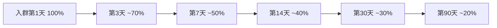
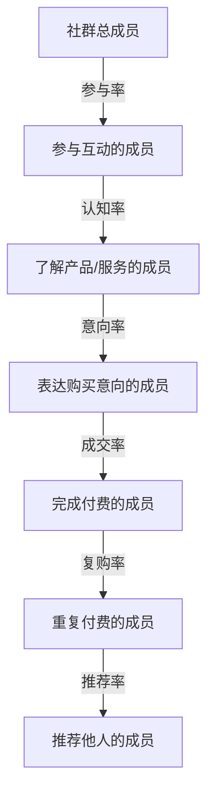

## 二、社群运营的核心指标体系

运营社群如果"凭感觉"，就像闭眼开车——你可能觉得自己走得挺稳，但随时可能偏离车道。指标体系是社群运营的仪表盘，它告诉你：社群健康吗？哪里出了问题？下一步该往哪使劲？

本节将从指标的底层逻辑出发，逐一拆解社群运营的六大核心指标，并给出测量方法、行业基准、提升策略和常见误区。

### 2.1 为什么需要指标体系

很多社群运营者存在一个认知误区：觉得社群是"人"的事，靠感觉、靠经验就够了。这种想法在小规模社群（50人以内）或许可行，但一旦社群规模超过100人，感觉就不可靠了。

**指标体系的三个核心作用：**

1. **诊断问题**：社群不活跃，是内容问题、人群问题还是运营节奏问题？数据能帮你定位根因，而不是靠猜。
2. **衡量效果**：你做了一场活动、改了一套规则，效果好不好？没有数据对比，一切都是自说自话。
3. **指导决策**：资源有限，应该投入内容还是活动？应该拉新还是促活？数据帮你排优先级。

**指标体系的构建原则（SMART原则在社群中的应用）：**

| 原则 | 含义 | 社群中的体现 |
|------|------|-------------|
| Specific（具体） | 指标定义明确，不含糊 | "活跃"要定义为发言、点赞还是签到 |
| Measurable（可测） | 能量化，能采集 | 选择能通过工具自动采集的指标 |
| Actionable（可行动） | 指标变化能触发行动 | 留存率下降→排查流失原因→制定挽回策略 |
| Relevant（相关） | 指标与核心目标相关 | 变现社群重点看转化率，而非纯活跃度 |
| Time-bound（有时限） | 有时间维度 | 日/周/月活跃率，而非笼统的"活跃度" |

### 2.2 活跃度（Activity Rate）

活跃度是最直观、也是最容易被误读的指标。很多人把"群里消息多"等同于"社群活跃"，这是一个典型的认知偏差——刷屏式闲聊和有价值的互动是两回事。

#### 2.2.1 定义与计算

**基础定义：** 在一定时间窗口内，参与有效互动的成员占总成员数的比例。

**关键概念——什么是"有效互动"？**

有效互动不等于"发了一条消息"。你需要根据社群定位定义有效互动的边界：

| 社群类型 | 有效互动的定义 | 无效互动示例 |
|----------|--------------|-------------|
| 学习型社群 | 提问、回答、分享笔记、输出作业 | 仅回复"收到""点赞" |
| 电商型社群 | 回复商品问题、参与拼团、晒单 | 仅抢红包 |
| 兴趣型社群 | 分享作品、参与讨论、组织活动 | 仅发"早安""晚安" |
| 行业型社群 | 分享行业洞察、提问专业问题 | 仅转发文章不加评论 |

**计算公式：**

```text
日活跃率（DAU Rate） = 当日有效互动人数 / 社群总人数 × 100%
周活跃率（WAU Rate） = 本周至少参与1次有效互动的人数 / 社群总人数 × 100%
月活跃率（MAU Rate） = 本月至少参与1次有效互动的人数 / 社群总人数 × 100%
```

**进阶指标——互动深度指数：**

仅看"是否活跃"是不够的，还要看"活跃到什么程度"。互动深度指数通过加权方式衡量互动质量：

```text
互动深度指数 = (发言人数×1 + 回复人数×2 + 长内容输出人数×3 + 组织活动人数×5) / 社群总人数
```

这个指数能帮你区分：一个社群是有价值的深度互动，还是表面热闹的刷屏。

#### 2.2.2 行业基准

活跃度的基准因社群类型、规模和生命周期阶段而异，不能一概而论。以下是经过大量社群运营实践验证的参考数据：

| 社群等级 | 日活跃率 | 周活跃率 | 特征描述 |
|----------|---------|---------|---------|
| 顶尖社群 | 30%-50% | 60%-80% | 话题自发生长，成员主动贡献内容 |
| 优秀社群 | 20%-30% | 40%-60% | 运营节奏稳定，互动质量高 |
| 良好社群 | 10%-20% | 25%-40% | 基础运营到位，但缺乏惊喜 |
| 一般社群 | 5%-10% | 15%-25% | 主要靠运营者推动，成员被动参与 |
| 沉默社群 | <5% | <15% | 除广告和灌水外几乎无互动 |
| 僵尸社群 | <2% | <5% | 基本已无运营价值，考虑重建或解散 |

**规模修正系数：**

社群规模越大，活跃率通常越低，这是正常现象。不同规模的基准需要做修正：

- 50人以下小群：活跃率基准 × 1.5（小群天然活跃）
- 50-200人群：基准值不做修正
- 200-500人群：活跃率基准 × 0.8
- 500人以上大群：活跃率基准 × 0.5（大群中沉默的大多数是正常的）

#### 2.2.3 提升活跃度的七种策略

**策略一：固定节奏法**

人是习惯动物。每天固定时间推出固定栏目，成员会形成生物钟式的期待。

实操模板：
```text
早8:00  —— 今日话题/早报（引发讨论）
午12:00 —— 午间轻松话题/投票（低门槛参与）
晚20:00 —— 深度讨论/嘉宾分享（核心互动时段）
```

关键细节：固定节奏一旦建立，至少坚持30天不要轻易中断。断更一次，之前积累的习惯就可能崩塌。

**策略二：阶梯式参与设计**

不是所有人都愿意第一时间发言。设计从低门槛到高门槛的参与阶梯，让不同类型的人都能找到自己的参与方式：

```text
围观层（0成本）：看消息、点赞
参与层（低成本）：投票、选择题回复、表情包互动
贡献层（中成本）：提问、分享经验、回复他人问题
核心层（高成本）：输出长内容、组织活动、带新人
```

具体操作：每次话题讨论时，先抛出一个投票/选择题（降低参与门槛），让围观层先动起来，然后在讨论深入后邀请有经验的成员做深度分享。

**策略三：种子用户培养**

社群前10个活跃分子决定了整个社群的氛围基调。种子用户不是天生的，而是被"培养"出来的。

培养路径：
1. 识别潜力股：关注那些偶尔发言但质量高的成员
2. 私聊建立连接：运营者主动私聊，给予关注和认可
3. 赋予角色和任务：比如"今日话题主持人""新人引导员"
4. 公开认可：在群里@感谢，给予荣誉称号
5. 小群核心圈：把最活跃的5-10人拉进核心小群，提前对齐话题方向

**策略四：互动机制设计**

| 机制 | 操作方式 | 适用场景 | 预期效果 |
|------|---------|---------|---------|
| 打卡签到 | 每日固定话题+打卡 | 学习型社群 | 稳定基础活跃率 |
| 积分体系 | 发言/分享赚积分，积分换福利 | 电商/付费社群 | 激励持续参与 |
| 主题接龙 | 围绕一个主题轮流分享 | 兴趣/行业社群 | 调动沉默成员 |
| 挑战赛 | 7天/21天打卡挑战 | 成长型社群 | 制造短期活跃峰值 |
| 问答悬赏 | 提问者出积分，回答者赢积分 | 知识型社群 | 激励高质量互动 |

**策略五：内容驱动法**

内容是社群活跃的底层燃料。没有好内容，任何互动技巧都是治标不治本。

内容日历模板（以学习型社群为例）：

| 日期 | 内容类型 | 具体形式 | 互动设计 |
|------|---------|---------|---------|
| 周一 | 干货分享 | 行业报告拆解 | "你最认同哪一点？" |
| 周二 | 案例分析 | 真实案例复盘 | "如果是你，会怎么做？" |
| 周三 | 问答日 | 集中回答本周问题 | 鼓励成员互相回答 |
| 周四 | 工具推荐 | 实操教程 | "用完效果如何？" |
| 周五 | 周末话题 | 轻松讨论/吐槽大会 | 降低门槛，释放压力 |

**策略六：游戏化机制**

利用游戏心理驱动参与：

- **等级体系**：根据活跃度和贡献度划分等级（潜水员→参与者→达人→导师），不同等级享有不同权限
- **排行榜**：每周/月活跃度排行，前三名公开表彰
- **成就徽章**：首次发言、连续签到7天、帮助10人解答问题等里程碑
- **随机奖励**：不定期在活跃成员中抽取福利，制造"惊喜感"

**策略七：外部刺激法**

当内部运营手段效果递减时，引入外部刺激激活社群：

- 邀请行业嘉宾做限时分享
- 组织跨社群联合活动
- 引入热点话题（但要与社群主题相关）
- 限时福利/秒杀（电商社群适用）

#### 2.2.4 活跃度的常见误区

**误区一：消息数量 = 活跃度**

一条有深度的长文回复，价值远超100条"哈哈哈"。如果你的社群每天消息量很大但转化率低、留存率差，很可能是在"虚假繁荣"。

**误区二：追求100%活跃率**

500人的社群，20%的人每天活跃就已经是优秀水平。不要试图让所有人都说话——社群中存在大量的"潜水者"，他们虽然不发言，但一直在看、在吸收。这些人也是社群价值的受众，只是不善于表达。

**误区三：活跃度只升不降**

活跃度有自然波动：工作日通常高于周末，节假日可能骤降，行业淡季社群也会降温。重要的是看趋势，而不是纠结于某一天的数据。

### 2.3 留存率（Retention Rate）

留存率是社群健康度的核心指标，没有之一。一个留存率低的社群就像一个漏水的桶——无论你往里灌多少水（拉新），桶永远装不满。

#### 2.3.1 定义与计算

**基础定义：** 经过一段时间后，仍然留在社群中且未退群的成员比例。

**关键区分——"在群"和"有效留存"：**

- **名义留存**：人还在群里，但已经屏蔽消息、从不打开。这叫"僵尸留存"。
- **有效留存**：人还在群里，且定期查看消息、偶尔互动。这才是真正的留存。

计算有效留存率需要结合活跃度指标：

```text
名义留存率 = 第N天仍在群中的成员数 / 第1天的成员数 × 100%
有效留存率 = 第N天仍有效互动的成员数 / 第1天的成员数 × 100%
```

**分群计算法：**

不同时期加入的成员，留存率差异巨大。建议按入群批次计算：

```text
第1批（1月1日-1月7日入群）30日留存率 = 该批30天后仍活跃人数 / 该批总入群人数
第2批（1月8日-1月14日入群）30日留存率 = ...
```

通过分群对比，你能发现：是某个批次的拉新渠道质量差，还是某个时间段的运营策略出了问题。

#### 2.3.2 留存曲线与生命周期

社群的留存率变化遵循一条典型的"留存曲线"：



**关键时间节点：**

- **第1-3天（蜜月期）**：退群最频繁的阶段。如果成员在入群3天内没有感受到价值，大概率会退群或屏蔽。这个阶段的核心任务是"首因效应"——让新成员在第一时间感受到社群的价值。
- **第7天（决策期）**：成员已经对社群有了基本判断，决定去留。这个阶段需要给到"留下来的理由"。
- **第30天（习惯期）**：如果一个成员在群里待了30天，留存概率会大幅提高。这个阶段的目标是帮助成员形成使用习惯。
- **第90天（忠诚期）**：留存超过90天的成员，已经从"用户"变成了"社群的一部分"。这批人是社群的核心资产。

#### 2.3.3 行业基准

| 社群等级 | 7日留存率 | 30日留存率 | 90日留存率 |
|----------|----------|----------|----------|
| 顶尖社群 | >85% | >70% | >50% |
| 优秀社群 | 70%-85% | 55%-70% | 35%-50% |
| 良好社群 | 55%-70% | 40%-55% | 20%-35% |
| 一般社群 | 40%-55% | 25%-40% | 10%-20% |
| 差的社群 | <40% | <25% | <10% |

**付费社群 vs 免费社群：**

付费社群的留存率通常比免费社群高15-30个百分点，因为"沉没成本效应"——花了钱的人更不舍得离开。但这不代表付费社群可以松懈运营，如果付费社群的留存率低于免费社群的基准，说明产品/服务存在严重问题。

#### 2.3.4 提升留存率的系统策略

**策略一：入群首日体验设计（Onboarding）**

入群首日决定了30%的后续留存率。一个完善的入群流程应该包括：

```text
第1步：欢迎语（自动+人工）
  - 自动欢迎语：介绍群规、群价值、常用功能
  - 人工欢迎语：运营者或老成员主动打招呼

第2步：自我介绍引导
  - 提供模板降低门槛："大家好，我是___，来自___，希望在这里___"
  - 运营者先做一个示范自我介绍

第3步：首日价值交付
  - 发一份"新人礼包"：精华内容合集、工具推荐、FAQ
  - 引导新人查看置顶消息或群文件

第4步：首日互动
  - 邀请新人参与当日话题讨论
  - 私聊问"有什么想了解的？"
```

**策略二：持续价值供给**

留存的本质是"持续有价值"。你需要建立一个稳定的价值供给系统：

| 价值类型 | 具体形式 | 供给频率 | 对应需求 |
|----------|---------|---------|---------|
| 信息价值 | 行业资讯、数据报告、趋势分析 | 每日/每周 | 认知需求 |
| 知识价值 | 教程、方法论、案例拆解 | 每周 | 成长需求 |
| 资源价值 | 人脉对接、工具推荐、独家资源 | 每月 | 效率需求 |
| 情感价值 | 归属感、认同感、陪伴感 | 持续 | 社交需求 |
| 经济价值 | 优惠、团购、内推、变现机会 | 不定期 | 利益需求 |

**策略三：退出预警机制**

不要等成员退群了才反应。建立退出预警机制，在成员"想退"之前就介入：

预警信号：
- 原本活跃的成员连续3天不发言
- 成员从参与讨论变成只看不说
- 成员开始屏蔽群消息（可通过消息已读率间接判断）
- 成员在群里表达不满或质疑

应对动作：
- 预警触发后，运营者在24小时内私聊关怀
- 不是问"你为什么不说话了"（有压迫感），而是提供一个有价值的内容或机会："看到一个XX资料，觉得你可能会感兴趣"
- 如果是不满情绪，及时道歉并解决问题

**策略四：社群身份认同建设**

人留下来，不仅因为有用，更因为"我是这里的一员"。身份认同是留存的深层驱动力：

- **命名**：给社群一个有辨识度的名字，给成员一个称呼（如"XX学院·同学""XX圈·圈友"）
- **仪式**：入群仪式、毕业仪式、周年庆
- **符号**：专属头衔、徽章、表情包
- **故事**：社群的起源故事、成员的成长故事、社群的里程碑
- **共同记忆**：群内"名场面"、共同参与的大事件

**策略五：定期清理机制**

表面上看，清理不活跃成员会降低留存率的分母，但实际上：

- 清理僵尸成员后，群的互动率会上升（分母变小了）
- 留下的成员会感受到社群的"稀缺性"和"质量感"
- 被清理的成员如果真的需要社群，会主动申请回来

清理规则示例：
```text
清理周期：每月1次
清理对象：连续30天无任何互动（包括点赞、签到）的成员
清理方式：先私聊提醒（"社群即将清理不活跃成员，如需保留请回复"）
         48小时无回复→移出社群
         提供重新加入的通道
```

### 2.4 转化率（Conversion Rate）

转化率是衡量社群商业价值的核心指标。一个社群无论多活跃、留存多好，如果不能产生商业转化，对于商业运营来说就是"叫好不叫座"。

#### 2.4.1 定义与多层次转化

**基础定义：** 社群成员从一个阶段进入下一个阶段的比例。

转化不是单一动作，而是一个层层递进的漏斗。你需要追踪的不是单一的"转化率"，而是整个转化漏斗每一层的转化率：



**各层转化率的计算：**

```text
参与率 = 参与互动人数 / 社群总人数 × 100%
认知率 = 了解产品人数 / 参与互动人数 × 100%
意向率 = 表达意向人数 / 了解产品人数 × 100%
成交率 = 实际付费人数 / 表达意向人数 × 100%
复购率 = 重复付费人数 / 首次付费人数 × 100%
推荐率 = 推荐他人的付费用户 / 总付费用户 × 100%
```

为什么要拆这么细？因为每一层的优化策略完全不同：

- 参与率低→优化内容和互动机制
- 认知率低→优化产品信息传递方式
- 意向率低→优化产品价值主张和定价
- 成交率低→优化购买流程和促销策略
- 复购率低→优化产品体验和售后服务
- 推荐率低→优化推荐机制和激励

#### 2.4.2 行业基准

| 社群等级 | 免费→低价转化 | 低价→中价转化 | 中价→高价转化 | 综合付费转化率 |
|----------|-------------|-------------|-------------|-------------|
| 顶尖社群 | 25%-40% | 15%-25% | 10%-15% | 15%-25% |
| 优秀社群 | 15%-25% | 10%-15% | 5%-10% | 8%-15% |
| 良好社群 | 8%-15% | 5%-10% | 3%-5% | 3%-8% |
| 一般社群 | 3%-8% | 2%-5% | 1%-3% | 1%-3% |
| 差的社群 | <3% | <2% | <1% | <1% |

**注：** "低价"指9.9-99元，"中价"指100-999元，"高价"指1000元以上。不同行业的价格带定义会有差异。

#### 2.4.3 提升转化率的核心策略

**策略一：精准筛选入群人群**

转化率的上限在入群那一刻就决定了。如果入群的人根本不是你的目标客户，后续运营再努力也事倍功半。

精准筛选的方法：
- 入群问卷：在入群前设置3-5个筛选问题
- 付费门槛：哪怕只收1元，也能过滤掉大量无效用户
- 邀请制：只接受老成员推荐的人入群
- 内容筛选：通过公开内容吸引目标人群，而非泛泛拉人

**策略二：信任阶梯建设**

社群转化的本质是信任变现。信任不是一天建立的，而是一个逐步积累的过程：

```text
阶段1：内容信任（"他说的东西有用"）
  → 持续输出高质量内容，展示专业能力

阶段2：关系信任（"这个人靠谱"）
  → 真诚互动，言行一致，不做虚假承诺

阶段3：产品信任（"他的产品应该也不错"）
  → 小产品/免费产品先试用，用效果说话

阶段4：品牌信任（"跟着他走不会错"）
  → 长期一致的价值输出，形成品牌认知
```

**策略三：转化路径设计**

不要指望"一上来就成交"。社群转化需要一条精心设计的路径：

```text
免费内容（建立认知）→ 低价体验品（9.9-49元，降低决策门槛）
→ 中价核心产品（199-999元，主要利润来源）
→ 高价定制服务（1000+元，利润最大化）
→ 转介绍激励（老客户带新客户）
```

每一层产品的作用：
- 低价品不是为了赚钱，是为了筛选出愿意付费的用户
- 中价品是利润主力，需要在低价品使用体验好的时候推荐
- 高价品面向少数高净值客户，需要一对一沟通

**策略四：社交证明策略**

人在做购买决策时，会参考他人的行为和评价。社群天然具备社交证明的优势：

| 社交证明类型 | 在社群中的实现方式 | 效果强度 |
|-------------|-------------------|---------|
| 用户证言 | 老客户分享使用体验 | ★★★★ |
| 案例展示 | 真实数据+截图+故事 | ★★★★★ |
| 从众效应 | "已有XX人购买""限时XX名额" | ★★★ |
| 专家背书 | 行业专家推荐或使用 | ★★★★ |
| 对比展示 | 使用前后对比、竞品对比 | ★★★★ |

**关键细节：** 社交证明必须真实。在社群中造假的成本极高——一旦被发现，整个社群的信任就会崩塌，而且社群是"熟人网络"，负面口碑的传播速度比正面口碑快10倍。

**策略五：促销节奏设计**

社群促销不能太频繁（会让成员麻木），也不能太少（会错失转化窗口）。推荐的促销节奏：

```text
月度：1次限时优惠活动（持续2-3天）
季度：1次大促活动（持续5-7天）
年度：1-2次年度大促（持续7-14天）
日常：不定期的"闪购""秒杀"（制造紧迫感）
```

每次促销前的预热周期：
- 小促：提前3天预热
- 大促：提前7-14天预热
- 预热内容：产品价值铺垫→用户证言→限时预告→倒计时

#### 2.4.4 转化率的常见误区

**误区一：把社群当广告群**

每天在群里发产品广告，本质上是在消耗信任。正确的做法是：80%的时间提供价值，20%的时间做商业转化。而且这20%也应该是"有价值感的推荐"，而非"硬广"。

**误区二：只看成交转化率**

成交是漏斗的底层，如果你只关注"多少人买了"，就看不到漏斗上层的问题。也许不是产品不好，而是信息传递不到位（认知率低）；也许不是价格高，而是购买流程太复杂（成交率低）。

**误区三：对所有人用同一套转化策略**

社群中不同成员处于不同的决策阶段，需要差异化对待：
- 新成员：先培养信任，不要急于推销
- 活跃成员：可以推荐低价体验品
- 付费老客户：推荐升级产品或增值服务
- 沉默成员：先激活，再谈转化

### 2.5 裂变系数（Viral Coefficient）

裂变系数决定了社群是"靠运营者一个人拉新"还是"成员自发帮你拉新"。后者才是社群增长的终极形态。

#### 2.5.1 定义与计算

**基础定义：** 平均每个现有成员在一定时间内为社群带来的新成员数量。

**核心公式：**

```text
裂变系数（K值）= 每个成员的平均邀请人数 × 邀请转化率

示例：
- 平均每个成员邀请了3个人（邀请率）
- 被邀请的人中有40%加入了社群（转化率）
- K值 = 3 × 0.4 = 1.2
```

**K值的含义：**

| K值范围 | 含义 | 增长状态 |
|---------|------|---------|
| K > 1 | 每个成员平均带来超过1个新成员 | 指数增长（病毒式传播） |
| K = 1 | 每个成员平均带来1个新成员 | 线性增长（自我维持） |
| 0.5 < K < 1 | 每个成员平均带来不到1个新成员 | 增长但需要持续拉新补充 |
| K < 0.5 | 新增远不及流失 | 社群正在萎缩 |

**进阶公式——考虑留存的裂变系数：**

```text
有效裂变系数 = K值 × 新成员留存率

示例：
- K值 = 1.2
- 新成员30日留存率 = 50%
- 有效裂变系数 = 1.2 × 0.5 = 0.6
```

为什么要做这个修正？因为如果裂变带来的人很快就流失了，那裂变就没有实际意义。只有"裂变+留存"双高，社群才能真正实现可持续增长。

#### 2.5.2 裂变的底层逻辑

人们为什么会帮你拉人？驱动力只有三种：

1. **利益驱动**：邀请有奖励（红包、优惠券、积分、实物）
2. **社交驱动**：分享有价值的内容/社群，提升自己的社交形象
3. **情感驱动**：真心觉得社群好，想让朋友也受益

三种驱动力的效果对比：

| 驱动力 | 短期效果 | 长期效果 | 裂变质量 | 适用场景 |
|--------|---------|---------|---------|---------|
| 利益驱动 | ★★★★★ | ★★ | 低（容易引来薅羊毛的人） | 快速拉新、促销期 |
| 社交驱动 | ★★★ | ★★★★ | 中（取决于内容质量） | 内容型社群 |
| 情感驱动 | ★★ | ★★★★★ | 高（来的人天然信任社群） | 口碑型社群 |

最佳策略是三种驱动力组合使用：利益驱动负责"拉人"，社交驱动负责"传播"，情感驱动负责"留存"。

#### 2.5.3 裂变活动设计实操

**裂变活动的标准流程：**

```text
第1步：设计裂变钩子（为什么值得分享？）
  - 实物奖品：书籍、课程、周边
  - 虚拟权益：独家内容、VIP权限、一对一咨询
  - 社交货币：有逼格的海报、证书、荣誉称号

第2步：降低分享门槛（怎么分享最方便？）
  - 一键生成专属海报
  - 扫码即可入群
  - 邀请链接自动追踪

第3步：设置阶梯奖励（邀请越多奖励越丰厚）
  - 邀请1人：获得基础资料包
  - 邀请3人：获得进阶课程
  - 邀请5人：获得一对一咨询机会
  - 邀请10人：获得年度VIP会员

第4步：制造紧迫感（为什么要现在分享？）
  - 限时：活动仅持续48小时
  - 限量：仅限前100名
  - 限条件：仅限老成员参与

第5步：追踪与优化
  - 追踪每个环节的转化率
  - 识别裂变链路中的断裂点
  - A/B测试不同的钩子和规则
```

**裂变海报设计要素：**

一张好的裂变海报需要包含以下要素（缺一不可）：

```text
┌──────────────────────────┐
│  主标题（痛点/利益点）     │  ← 1秒内让人知道"跟我有什么关系"
│  副标题（具体说明）        │
│                          │
│  大咖背书/数据证明         │  ← 建立信任
│  "已有XX人参与"           │  ← 从众效应
│                          │
│  核心价值点（3-4个）       │  ← 告诉他能得到什么
│  ┌──────────────┐        │
│  │   二维码      │        │  ← 行动入口
│  └──────────────┘        │
│  紧迫感文案               │  ← "仅限前100名""倒计时XX小时"
│  邀请人信息               │  ← 专属海报，追踪来源
└──────────────────────────┘
```

#### 2.5.4 裂变的常见误区

**误区一：只靠利益裂变**

纯粹靠红包、奖品驱动的裂变，来的人大部分是"薅羊毛"的——拿了好处就走，不会留下来，更不会付费。这种裂变的ROI通常是负的。

**误区二：裂变后不做承接**

把人拉进来之后，如果没有做好入群体验和价值交付，来的人24小时内就会流失。裂变只是"开门"，进门后的体验才是关键。

**误区三：频繁裂变透支信任**

每隔几天就搞一次裂变活动，成员会疲劳。裂变应该是"偶尔的惊喜"，不是"常态化的任务"。推荐频率：每季度1-2次大型裂变活动，配合日常的口碑自然传播。

### 2.6 被忽略的进阶指标

除了上述四大核心指标，成熟的社群运营还需要关注以下进阶指标：

#### 2.6.1 NPS（净推荐值）

**定义：** 衡量成员向他人推荐社群的意愿。

**测量方式：** 向成员发放问卷："你有多大可能向朋友推荐本社群？"（0-10分）

```text
推荐者（9-10分）：社群的忠实粉丝
被动者（7-8分）：满意但不热情
贬损者（0-6分）：不满意，可能传播负面口碑

NPS = 推荐者占比 - 贬损者占比
```

**基准值：**
- NPS > 50：卓越（成员会主动帮你宣传）
- NPS 30-50：良好（口碑正向）
- NPS 0-30：及格（还有提升空间）
- NPS < 0：危险（负面口碑正在蔓延）

#### 2.6.2 响应时间

**定义：** 成员在群里提问后，收到有效回复的平均时间。

**为什么重要：** 响应时间直接影响成员的"被重视感"。如果一个问题提出来半天没人理，提问者会感到被忽视，下次就不问了。

**基准值：**
- < 5分钟：优秀（需要有专人值守或AI辅助）
- 5-30分钟：良好（运营者+种子用户共同响应）
- 30分钟-2小时：及格（需要优化响应机制）
- > 2小时：需要改进（成员提问被忽略了）

#### 2.6.3 客户终身价值（CLV/LTV）

**定义：** 一个社群成员在整个生命周期内为社群贡献的总商业价值。

**计算方式：**

```text
LTV = 平均客单价 × 购买频次 × 客户生命周期（月）

示例：
- 平均客单价：299元
- 年均购买次数：3次
- 平均客户生命周期：2年
- LTV = 299 × 3 × 2 = 1,794元
```

**LTV的意义：** 知道了每个成员的终身价值，你就能算出"获取一个新成员最多能花多少钱"（CAC，客户获取成本）。健康的比例是 LTV:CAC ≥ 3:1。

#### 2.6.4 社群健康度综合评分

将多个指标整合为一个综合评分，便于快速判断社群整体状态：

```text
社群健康度 = 活跃度权重(25%) × 活跃度得分
           + 留存率权重(30%) × 留存率得分
           + 转化率权重(25%) × 转化率得分
           + NPS权重(20%) × NPS得分

各项得分按行业基准映射为0-100分：
  超过优秀基准 → 90-100分
  良好区间 → 70-89分
  一般区间 → 50-69分
  差的区间 → 30-49分
  危险区间 → 0-29分
```

### 2.7 指标监控体系搭建

知道了指标还不够，你需要一套系统来持续监控和分析。

#### 2.7.1 数据采集工具

| 工具类型 | 代表工具 | 适用场景 | 数据能力 |
|----------|---------|---------|---------|
| 企业微信后台 | 企业微信管理后台 | 企业微信社群 | 成员活跃度、消息量 |
| 微信群管理工具 | 微伴助手、句子互动 | 个人微信社群 | 活跃度、发言排行 |
| 社群SaaS | 小裂变、零一裂变 | 裂变活动 | 裂变数据、转化追踪 |
| 通用分析工具 | 腾讯问卷、金数据 | NPS、满意度 | 问卷数据 |
| 自建系统 | Python+数据库 | 深度定制需求 | 全量数据 |

#### 2.7.2 数据看板设计

一个实用的社群数据看板应该包含：

```text
┌─ 社群运营日报 ──────────────────────────┐
│                                         │
│  📊 今日概览                             │
│  ├─ 社群总人数：1,234（+15 / -3）        │
│  ├─ 今日活跃人数：312（活跃率 25.3%）     │
│  ├─ 今日消息总量：1,847条                │
│  └─ 今日新增付费用户：8人（转化率 0.65%） │
│                                         │
│  📈 趋势图                               │
│  ├─ 7日活跃率趋势                        │
│  ├─ 30日留存曲线                         │
│  └─ 月度转化漏斗                         │
│                                         │
│  ⚠️ 预警                                 │
│  ├─ 连续3天活跃率下降                     │
│  └─ 12名成员触发流失预警                  │
│                                         │
│  🏆 排行                                 │
│  ├─ 本周最活跃成员 Top 10                │
│  └─ 本周贡献最大成员 Top 5               │
└─────────────────────────────────────────┘
```

#### 2.7.3 数据复盘节奏

| 复盘周期 | 关注重点 | 输出物 |
|----------|---------|--------|
| 每日 | 活跃度、异常波动 | 日报（自动） |
| 每周 | 活跃度趋势、留存变化、转化进展 | 周报+下周计划 |
| 每月 | 全指标复盘、策略效果评估、下月规划 | 月报+优化方案 |
| 每季度 | 指标体系调整、社群健康度评估、战略方向 | 季度报告 |

### 2.8 本节核心要点总结

| 指标 | 核心问题 | 最关键的行动 |
|------|---------|-------------|
| 活跃度 | 成员在互动吗？ | 固定节奏+种子用户+阶梯参与 |
| 留存率 | 成员留下来了吗？ | 入群体验+持续价值+退出预警 |
| 转化率 | 成员付费了吗？ | 精准筛选+信任阶梯+路径设计 |
| 裂变系数 | 成员帮你拉人了吗？ | 三种驱动组合+阶梯奖励+及时承接 |
| NPS | 成员会推荐你吗？ | 超预期体验+口碑管理 |
| LTV | 成员贡献了多少价值？ | 提升客单价+复购率+生命周期 |

记住：指标不是目的，是手段。所有指标最终服务于一个目标——让社群成员获得价值的同时，实现社群的商业目标。数据告诉你"发生了什么"，但"为什么发生"和"怎么改进"需要运营者结合数据和对社群的理解来判断。

不要为了追数据而做表面功夫。一个真正有价值的社群，指标自然不会差。
