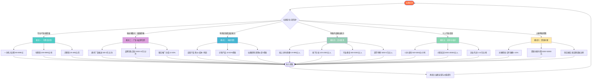
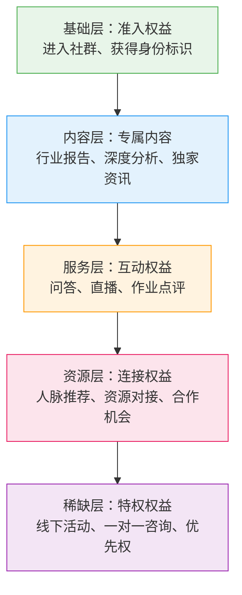
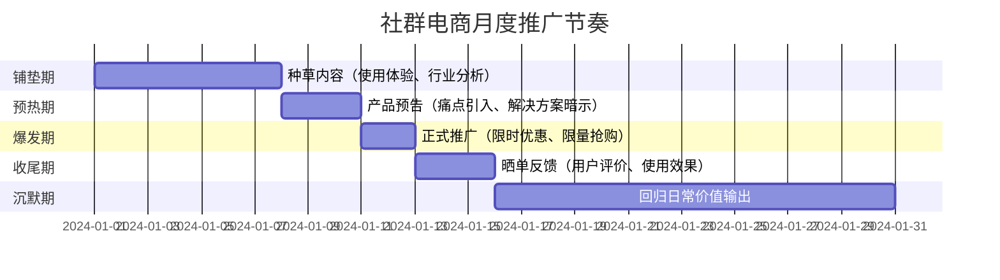
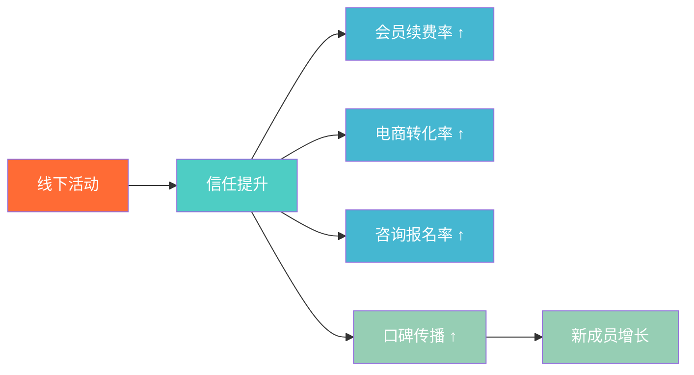
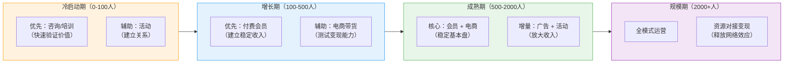

## 三、社群变现的六大模式

社群变现不是"在群里卖东西"这么简单。一个运营良好的社群，至少有六种彼此独立又可以组合使用的变现模式。理解这六种模式的底层逻辑、适用条件和组合策略，是设计社群商业模式的前提。

### 3.1 六大模式全景图



> **核心原则：** 不要只依赖一种变现模式。最佳实践是"会员制打底 + 电商/咨询增收 + 活动提频"的组合策略，多元化收入来源降低单一模式的风险。本章后续的实战案例中，年收入超过百万的社群无一例外都采用了至少两种以上的变现组合。

### 3.2 六大模式对比总览

在逐一展开之前，先通过一张对比表建立全局认知：

| 维度 | 付费会员 | 广告合作 | 电商带货 | 活动变现 | 咨询培训 | 资源对接 |
|------|---------|---------|---------|---------|---------|---------|
| **核心逻辑** | 为准入资格付费 | 流量变现 | 信任变现 | 体验变现 | 专业变现 | 连接变现 |
| **启动门槛** | 低（需内容积累） | 中（需规模） | 中（需供应链） | 中（需策划力） | 高（需专业度） | 高（需人脉网） |
| **收入天花板** | 中等 | 中等 | 高 | 中等 | 高 | 极高 |
| **收入稳定性** | 高（可预测） | 波动大 | 中等 | 波动大 | 中等 | 波动大 |
| **可规模化** | 高 | 高 | 高 | 中 | 低 | 低 |
| **时间投入** | 中（前期高，后期低） | 低 | 中 | 高（活动期间） | 高 | 中 |
| **适合社群规模** | 50人起 | 1000人+ | 200人+ | 100人+ | 50人起 | 100人+ |
| **启动到首笔收入** | 1-3个月 | 3-6个月 | 1-2个月 | 2-4周 | 2-4周 | 3-6个月 |
| **与成员关系** | 服务者→会员 | 媒介→受众 | 推荐者→消费者 | 组织者→参与者 | 专家→客户 | 中间人→双方 |

---

### 3.3 模式一：付费会员制

#### 3.3.1 底层逻辑

付费会员制的本质是**准入权交易**——用户为获得进入社群的资格或享受社群专属服务而付费。这是最"干净"的变现模式，因为你的收入直接来自你提供的价值，不依赖第三方。

从经济学角度看，付费会员制解决的是**信息不对称**和**筛选成本**问题。免费社群中，高质量内容创作者不知道自己的受众是谁（可能大部分是"潜水党"），高质量需求者也不知道这个社群是否值得投入时间。设置付费门槛后，付费行为本身就传递了一个强信号："我愿意为这个主题投入真金白银"，从而自动完成了人群筛选。

#### 3.3.2 三种收费结构

**一次性入会费（99-9999元）**

- **适用场景：** 门槛筛选型社群，强调"圈子质量"而非"持续服务"
- **定价逻辑：** 价格即筛选器。99元筛选掉纯白嫖心态的人，999元筛选出真正有需求的人，9999元筛选出高净值人群
- **优势：** 现金流集中，用户决策成本低（一次付清）
- **劣势：** 缺乏持续收入，需要不断引入新成员
- **典型案例：** 行业交流群、高端人脉圈、特定项目社群

**年费制（199-9999元/年）**

- **适用场景：** 需要持续提供价值的社群，如学习社群、行业资讯社群
- **定价逻辑：** 年费 = 每月价值 × 12 × 折扣系数。如果你每月提供的价值感知值500元，年费可以定在2999-3999元（相当于6-8折的"年卡优惠"）
- **优势：** 收入可预测，用户黏性高，续费率是核心指标
- **劣势：** 续费压力大，需要持续证明价值
- **关键指标：** 续费率。年费制社群的健康续费率应 > 60%，优秀社群 > 80%

**月费制（29-499元/月）**

- **适用场景：** 高频内容输出型社群，如每日早报、每周直播、持续更新的课程库
- **定价逻辑：** 月费必须低到用户"不心疼"，但高到足以筛选掉无效用户。29-99元是"无脑订阅"区间，199-499元需要明确的月度价值承诺
- **优势：** 用户决策门槛低，获客容易，现金流稳定
- **劣势：** 退费率高（月退费率 5-15% 是常态），需要持续高频输出
- **关键指标：** 月留存率。月费制社群的月留存率 > 85% 才健康

#### 3.3.3 会员权益设计框架

会员制的核心不是"收费"，而是"交付超出预期的价值"。以下是会员权益设计的五层模型：



每一层的设计要点：

| 层级 | 设计原则 | 具体示例 | 成本投入 |
|------|---------|---------|---------|
| 基础层 | 必须有，但不能只有这个 | 专属群聊、会员标识、入群欢迎礼包 | 极低 |
| 内容层 | 核心价值载体，决定续费意愿 | 每周深度文章、月度行业报告、案例拆解 | 中等（时间） |
| 服务层 | 增强互动感，提高参与度 | 每周1次集中答疑、月度直播、作业批改 | 中等（精力） |
| 资源层 | 高价值感知，难以被替代 | 季度人脉对接会、资源需求墙、合作撮合 | 低（信息整合） |
| 稀缺层 | 制造稀缺感，支撑高定价 | 年度线下聚会、创始人1对1、新品优先体验 | 高（但频次低） |

> **定价心理学：** 会员定价不要用整数。299比300看起来便宜很多，这是"左位效应"。另外，设置三档价格（如基础版199、进阶版499、尊享版999），让中间档成为"锚点效应"的最大受益者——大多数人都会选择中间档。

#### 3.3.4 会员制的关键成功因素

1. **价值必须大于价格：** 不是"我觉得值"，而是"会员觉得值"。定期做满意度调研，问一个问题："如果明天社群关闭，你愿意出多少钱让它继续？"
2. **入群门槛不可少：** 即使是付费社群，也要有筛选机制。填写申请表、面试、推荐制——门槛越高，社群质量越高，续费率越高
3. **持续价值输出机制：** 制定内容日历，确保每周/每月有固定的价值交付节点。断更 = 断信任
4. **淘汰机制：** 定期清理不活跃、不遵守规则的成员。宁可缩小规模也要保持质量
5. **退出也要体面：** 不续费的用户不要"拉黑"或"踢出"，给一个"校友"身份，保持关系。他们可能回来，也可能推荐新用户

---

### 3.4 模式二：广告与品牌合作

#### 3.4.1 底层逻辑

广告与品牌合作的本质是**注意力变现**。你的社群聚集了一批精准用户，品牌愿意付费触达这些用户。这和传统媒体广告的逻辑完全一样，区别在于：社群的信任度远高于媒体——群主推荐一个产品，转化率通常是媒体广告的5-10倍。

#### 3.4.2 三种合作形式

**群内广告推送（500-50000元/次）**

- **操作方式：** 品牌方提供文案/海报，你在社群中推送，可以是纯广告，也可以是"软植入"（比如"最近在用XX产品，体验不错，分享给大家"）
- **定价依据：** 社群人数 × 精准度系数 × 互动率系数。1000人的精准行业社群，单次推送收费2000-5000元是合理区间
- **风险控制：** 每月广告不超过4次（每周1次是上限），否则社群沦为"广告群"，成员流失加速

**品牌冠名活动（5000-100000元/次）**

- **操作方式：** 举办社群活动（线上直播、线下沙龙、行业峰会），品牌方冠名赞助
- **定价依据：** 活动规模 × 曝光量 × 品牌匹配度。一场500人参加的行业峰会，冠名费3-10万元是市场价
- **优势：** 对社群体验伤害最小，因为活动本身有价值，品牌曝光是"顺便的"

**联合推广分成（销售额的10%-30%）**

- **操作方式：** 和品牌方谈CPS（按销售付费）合作，通过专属链接/优惠码追踪转化
- **适用场景：** 社群成员有明确消费需求，且品牌方产品与社群调性匹配
- **优势：** 零风险（卖不出去不收钱），收益可能远高于固定广告费
- **劣势：** 收入不稳定，高度依赖选品和推广时机

#### 3.4.3 广告合作的"红线"

广告变现最容易犯的错误是"过度商业化"。以下是必须守住的红线：

- **频率红线：** 纯广告内容不超过总内容的20%。如果每周发5条内容，广告最多1条
- **选品红线：** 只接与社群调性匹配的品牌。一个母婴社群去推游戏广告，只会让成员觉得你"吃相难看"
- **真实红线：** 不接自己没用过、不认可的产品。社群的信任是核心资产，一次虚假推荐可能永久摧毁信任
- **透明红线：** 明确告知成员"这是广告/推广"。隐藏广告性质不仅伤信任，在很多国家和地区还违法

#### 3.4.4 如何接到第一个品牌合作

品牌方不会主动找上门（除非你有几十万粉丝）。以下是主动获取合作的路径：

1. **准备媒体包（Media Kit）：** 一页纸说明你的社群定位、成员画像、规模、互动数据、过往案例
2. **从小品牌开始：** 先免费或低价帮2-3个小品牌做推广，积累案例和数据
3. **主动联系品牌方市场部：** 在品牌官网、LinkedIn、脉脉找到市场负责人，发送你的媒体包
4. **入驻MCN/广告平台：** 新榜、西瓜数据等平台可以帮你对接品牌方
5. **设置合作入口：** 在社群介绍、公众号菜单栏放"商务合作"联系方式

---

### 3.5 模式三：电商带货

#### 3.5.1 底层逻辑

电商带货的本质是**信任变现**。社群成员对群主的信任，降低了购买决策的门槛。在传统电商中，用户需要"搜索→比价→看评价→犹豫→下单"，而在社群中，群主推荐一个产品，用户可能直接就买了——因为他相信群主不会坑他。

这种信任带来的转化率差异是数量级的：传统电商的转化率通常在1-3%，而社群带货的转化率可以达到10-30%，个别高信任度社群甚至超过50%。

#### 3.5.2 三种电商模式

**自营产品（售价 - 成本 = 利润）**

- **适用场景：** 你有自己的产品或服务能力（课程、实物产品、数字产品）
- **利润率：** 通常40-80%（数字产品利润率更高）
- **关键挑战：** 产品研发、库存管理、售后服务
- **示例：** 设计师社群卖自己的设计模板包，健身教练社群卖自己的训练计划

**分销产品（销售额的10%-50%佣金）**

- **适用场景：** 你没有产品，但社群成员有消费需求
- **佣金率参考：** 实物产品10-30%，知识产品30-50%，虚拟产品（会员、工具）20-40%
- **平台选择：** 淘宝联盟、京东联盟、多多进宝（实物），知识星球、小鹅通（知识产品）
- **关键挑战：** 选品质量把控，售后责任界定

**社群团购（团购价差 + 佣金）**

- **适用场景：** 社群成员有共同的实物消费需求（如母婴用品、地方特产、办公用品）
- **操作流程：** 群主谈团购价 → 群内接龙报名 → 统一发货 → 赚取价差或佣金
- **优势：** 批量采购压低成本，成员享受优惠，群主赚差价，三方共赢
- **关键挑战：** 物流协调、售后处理、资金周转

#### 3.5.3 社群选品的"四维模型"

选品是电商带货成败的关键。用以下四个维度评估一个产品是否适合在你的社群推广：

| 维度 | 评估标准 | 权重 |
|------|---------|------|
| **需求匹配度** | 产品是否解决社群成员的真实痛点？ | 40% |
| **信任背书度** | 你自己用过吗？愿意推荐给朋友吗？ | 30% |
| **价格合理度** | 社群专属价是否比市场价有优势？ | 20% |
| **售后可控度** | 出了问题你能协调解决吗？ | 10% |

> **选品铁律：** 宁可少卖，不可乱推。一次推荐劣质产品，可能需要十次好推荐才能修复信任。建议每次推荐前自己先购买试用，这是最低成本的信任保障。

#### 3.5.4 社群电商的转化节奏

社群电商不是"天天卖货"，而是有节奏的推广：



一个月内，电商推广（铺垫+预热+爆发+收尾）占15天，另外15天回归纯价值输出。这样成员不会觉得你"天天在卖东西"。

---

### 3.6 模式四：活动变现

#### 3.6.1 底层逻辑

活动变现的本质是**体验付费**。线上文字交流建立的是"弱关系"，而共同参与一个活动建立的是"强关系"。人们愿意为"体验"和"关系"付费，而且往往愿意付比内容更高的价格。

活动变现还有一个隐性价值：**活动是最好的信任催化剂**。一个成员参加完你的线下活动后，对你的好感度和信任度会大幅提升，后续的会员续费、电商转化、咨询转化都会更容易。

#### 3.6.2 四类活动及定价策略

**线上分享/直播（9.9-999元/人）**

- **低价引流型（9.9-49元）：** 目的是筛选高意向用户，而非赚钱。一场500人参加的9.9元分享，收入4950元，但更重要的是获得了500个愿意付费的精准用户
- **价值交付型（99-299元）：** 真正提供高密度干货。需要有明确的学习成果承诺，如"学完即可搭建自己的第一个社群"
- **高端闭门型（399-999元）：** 小规模、高互动、强社交。人数控制在30-50人，保证每个人都能参与讨论

**线下沙龙/聚会（100-2000元/人）**

- **操作要点：** 场地选择（咖啡厅/联合办公空间，成本可控）、人数控制（20-50人为最佳）、议程设计（主题分享+分组讨论+自由交流）
- **收入结构：** 门票收入 - 场地成本 - 嘉宾费用 = 利润。一场30人、每人300元的沙龙，场地成本500-1500元，净利润7000-8500元
- **隐性收益：** 线下活动是最佳的"升单"场景——参加完沙龙的用户，购买高价会员/咨询的比例比线上高3-5倍

**行业峰会/论坛（500-5000元/人）**

- **定位：** 社群年度旗舰活动，品牌形象的集中展示
- **收入结构：** 门票收入 + 赞助商收入 + 展位收入。一场300人的行业峰会，门票收入30万（均价1000元）+ 赞助收入20万 = 总收入50万，成本控制在15-20万，净利润30万+
- **操作难度：** 最高。需要提前3-6个月筹备，涉及场地、嘉宾、议程、宣传、票务、赞助商对接等大量工作

**游学/考察（5000-50000元/人）**

- **定位：** 最高端的活动形式，面向高净值社群成员
- **形式：** 企业参访、行业游学、海外考察、主题旅行
- **收入结构：** 参与费 - 交通住宿 - 接待费用 = 利润。利润率通常20-40%
- **关键成功因素：** 行程质量（参访企业级别、嘉宾规格）、社交设计（安排充足的自由交流时间）、后续沉淀（游学报告、合影、后续合作对接）

#### 3.6.3 活动变现的杠杆效应

活动的价值不仅在于门票收入，更在于它对其他变现模式的拉动作用：



这就是为什么很多高收入社群即使活动本身不赚钱甚至微亏，也要坚持办——因为活动是整个变现飞轮的"加速器"。

---

### 3.7 模式五：咨询与培训

#### 3.7.1 底层逻辑

咨询与培训的本质是**专业变现**——将你的知识、经验和方法论转化为高价值的一对一或一对多服务。这是单客价值最高的变现模式，一个企业内训项目（1-10万元）的收入可能相当于卖几百份会员。

社群在这个模式中的角色是**精准筛选器**。通过社群中的免费内容输出和互动，你可以自然识别出最有需求、最有支付能力的用户，然后将他们转化为咨询/培训客户。这种"先免费建立信任，再转化为付费服务"的路径，比直接打广告找客户高效10倍以上。

#### 3.7.2 三种服务形态

**1对1咨询（500-5000元/小时）**

- **适用场景：** 个性化问题诊断、职业规划、方案定制
- **定价逻辑：** 新手期按"市场行情"定价，成熟期按"结果价值"定价。如果你的一次咨询能帮客户多赚10万元，收5000元/小时并不贵
- **操作流程：** 社群中展示专业能力 → 发布咨询案例（脱敏） → 设置预约入口 → 咨询前收集问题 → 正式咨询 → 咨询后跟进
- **效率提升：** 把高频问题整理成"标准答案库"，每次咨询前先发给客户阅读，节省沟通时间

**小班培训（2000-20000元/人）**

- **适用场景：** 系统性技能传授、实操训练、项目实战
- **班型设计：** 10-30人小班，保证互动质量。超过30人，互动效果急剧下降
- **课程结构：** 理论讲解（30%）+ 案例拆解（30%）+ 实操练习（30%）+ 答疑点评（10%）
- **交付周期：** 短训班2-3天集中授课，长期班4-8周（每周1-2次，每次2小时）
- **关键指标：** 完课率（>80%为优秀）和学员满意度（NPS>50为优秀）

**企业内训（10000-100000元/场）**

- **适用场景：** 企业团建培训、部门技能提升、管理层研修
- **定价依据：** 讲师资历 × 课程定制化程度 × 参训人数 × 企业规模
- **获客路径：** 社群中的企业高管/HR → 了解企业需求 → 提交培训方案 → 商务谈判 → 签约执行
- **关键成功因素：** 课前需求调研（不要用通用课程应付）、课后效果评估（提供培训报告）、后续续约（首次培训是"试用"，续约才是利润）

#### 3.7.3 从社群到咨询的转化漏斗

不是每个社群成员都会成为咨询客户，转化是一个自然筛选的过程：

```text
社群总成员（100%）
  └─ 主动互动、提问的活跃成员（20-30%）
       └─ 表现出明确需求/痛点的成员（5-10%）
            └─ 有支付能力和意愿的成员（2-5%）
                 └─ 实际购买咨询/培训的成员（1-3%）
```

以1000人的社群为例，最终购买高价服务的可能只有10-30人。但如果你的咨询单价是5000元，这10-30人就能贡献5-15万元收入。这就是为什么社群运营要"先广后深"——广泛提供免费价值建立信任，深度服务少数高价值客户。

> **转化禁忌：** 不要在社群中硬推销咨询服务。正确的做法是"展示能力，等待需求"——持续在社群中回答问题、分享案例、展示专业度，当成员遇到复杂问题时，他们自然会想到"找你一对一聊聊"。

---

### 3.8 模式六：资源对接

#### 3.8.1 底层逻辑

资源对接的本质是**连接变现**——你不生产内容，也不提供服务，你做的是"撮合"。社群中A有需求、B有资源，你作为中间人促成合作，从中收取服务费。

这种模式的威力在于**网络效应**：社群成员越多，潜在的连接组合就越多（n个成员有n×(n-1)/2种连接可能），你的"撮合价值"就越大。这也是为什么资源对接型社群的收入天花板最高——当你连接的双方都是企业级客户时，一单撮合的佣金可能就是数万甚至数十万元。

#### 3.8.2 三种变现方式

**对接佣金（合作金额的1%-10%）**

- **操作流程：** 收集双方需求 → 评估匹配度 → 双向介绍 → 促成对接 → 跟踪合作进展 → 收取佣金
- **佣金比例：** 取决于合作金额和你的参与深度。小额合作（<10万）收5-10%，大额合作（>100万）收1-3%
- **关键能力：** 你需要深度了解每个成员的资源和需求，这不是建个"资源对接表"就能解决的，需要通过日常互动和定期1对1沟通来积累

**资源对接年费（5000-50000元/年）**

- **操作模式：** 收取年费，承诺全年提供N次资源对接服务
- **适用场景：** B2B行业社群、供应链社群、投融资社群
- **定价逻辑：** 年费 = 预期对接价值 × 佣金率。如果你承诺每年至少促成3次有效对接，每次对接平均金额50万，佣金率5%，那年费可以定在5000-7500元（相当于预付佣金打折）

**项目撮合（固定费用或按比例）**

- **操作模式：** 针对特定项目（如投融资对接、供应链整合、渠道合作）收取撮合费
- **固定费用：** 适合标准化程度高的对接，如供应商推荐（5000-20000元/次）
- **按比例：** 适合金额大的项目，如投融资对接（融资额的1-5%）

#### 3.8.3 资源对接的核心壁垒

资源对接看似简单（"就是牵个线"），实际上壁垒极高：

1. **信息壁垒：** 你需要深入了解每个成员的资源禀赋和真实需求，这需要长期互动积累
2. **信任壁垒：** 双方都信任你，才会通过你对接。信任建立需要时间
3. **匹配壁垒：** 不是随便两个人就能合作，你需要判断双方的需求、能力、价值观是否匹配
4. **撮合壁垒：** 从"介绍认识"到"实际合作"中间有大量的沟通协调工作

> **法律提醒：** 资源对接涉及商务合作，务必注意：不要承诺你无法保证的结果；佣金协议要书面签订；涉及投融资的对接，注意是否触碰"居间"或"经纪"的资质要求（详见本章第七节"法律法规"）。

---

### 3.9 六大模式的组合策略

#### 3.9.1 为什么需要组合

单一模式的风险在于：会员制的天花板取决于社群规模，广告合作的收入波动大，电商带货伤害社群体验，活动变现的时间成本高，咨询培训不可规模化，资源对接依赖个人关系。

组合使用的本质是**风险对冲和价值叠加**：

| 组合策略 | 逻辑 | 适合阶段 |
|---------|------|---------|
| 会员制 + 电商 | 会员费提供稳定现金流，电商提供增量收入 | 成长期 |
| 会员制 + 活动 | 会员费养日常运营，活动制造高峰体验 | 成熟期 |
| 会员制 + 咨询 | 会员费筛选高意向客户，咨询实现高客单价转化 | 成熟期 |
| 电商 + 广告 | 电商验证选品能力，广告放大品牌曝光 | 增长期 |
| 资源对接 + 活动 | 对接积累人脉需求，活动提供面对面撮合场景 | 成熟期 |
| 会员 + 电商 + 活动 + 咨询 | 全模式覆盖，多元收入 | 规模期 |

#### 3.9.2 不同阶段的变现优先级



#### 3.9.3 收入结构健康度自检

一个健康的社群商业模式，其收入结构应满足以下标准：

```text
健康社群的收入结构：
├── 稳定收入（会员费/年费）≥ 40%   ← 保底，可预测
├── 增量收入（电商/广告）   20-40%  ← 增长空间
└── 高价值收入（咨询/培训） 10-30%  ← 利润贡献

危险信号：
- 稳定收入 < 20%：收入波动大，抗风险能力弱
- 单一模式占比 > 70%：过度依赖，一旦该模式出问题则全盘崩溃
- 广告收入 > 50%：社群已沦为广告渠道，成员流失风险高
```

---

### 3.10 六大模式的常见误区

| 误区 | 表现 | 后果 | 纠正方法 |
|------|------|------|---------|
| 一开始就追求多元化 | 社群只有50人就想做会员+电商+广告 | 精力分散，哪个都做不好 | 先聚焦1-2个模式，跑通后再扩展 |
| 定价靠"拍脑袋" | 看别人定99我也定99 | 可能定价过低（自我贬值）或过高（无人问津） | 用"价值锚定法"：先算你能帮用户省/赚多少钱 |
| 忽视交付质量 | 只管收钱，不管服务 | 续费率崩盘，口碑崩塌 | 先交付价值再涨价，宁可超交付 |
| 把社群当"韭菜园" | 频繁推高利润产品，不顾成员真实需求 | 信任崩塌，社群死亡 | 每次变现前问自己：这对成员真的有价值吗？ |
| 不做数据追踪 | 不知道哪个模式赚钱、哪个亏钱 | 资源错配，效率低下 | 至少追踪每个模式的收入、成本、利润率 |
| 急于变现 | 社群刚建1周就开始卖东西 | 成员觉得被利用，快速退群 | 冷启动期至少1个月纯价值输出，建立信任后再变现 |

***

