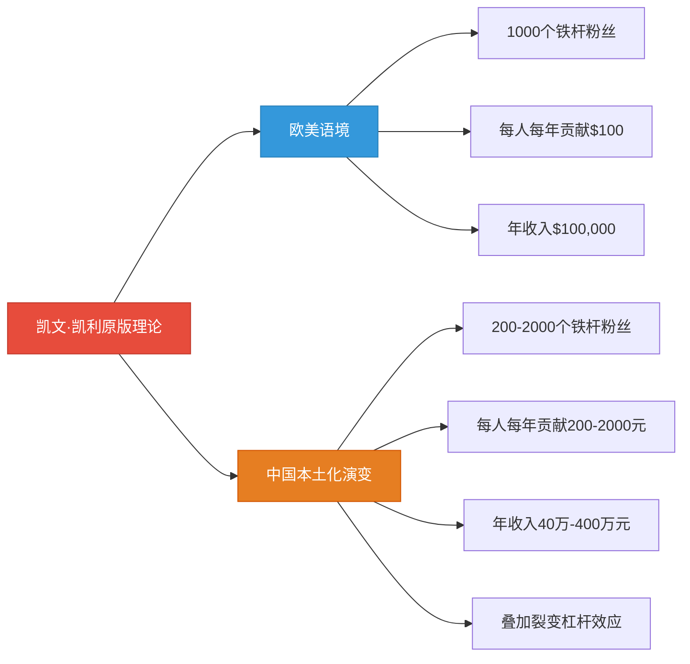
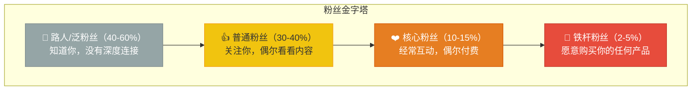
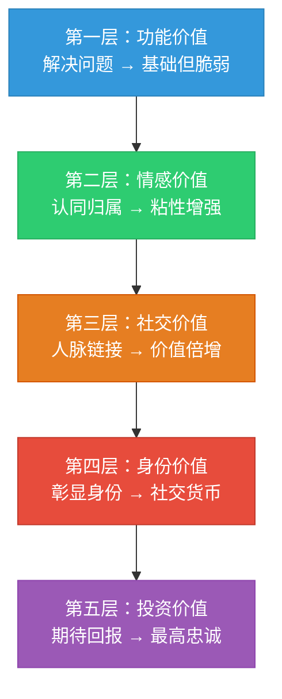
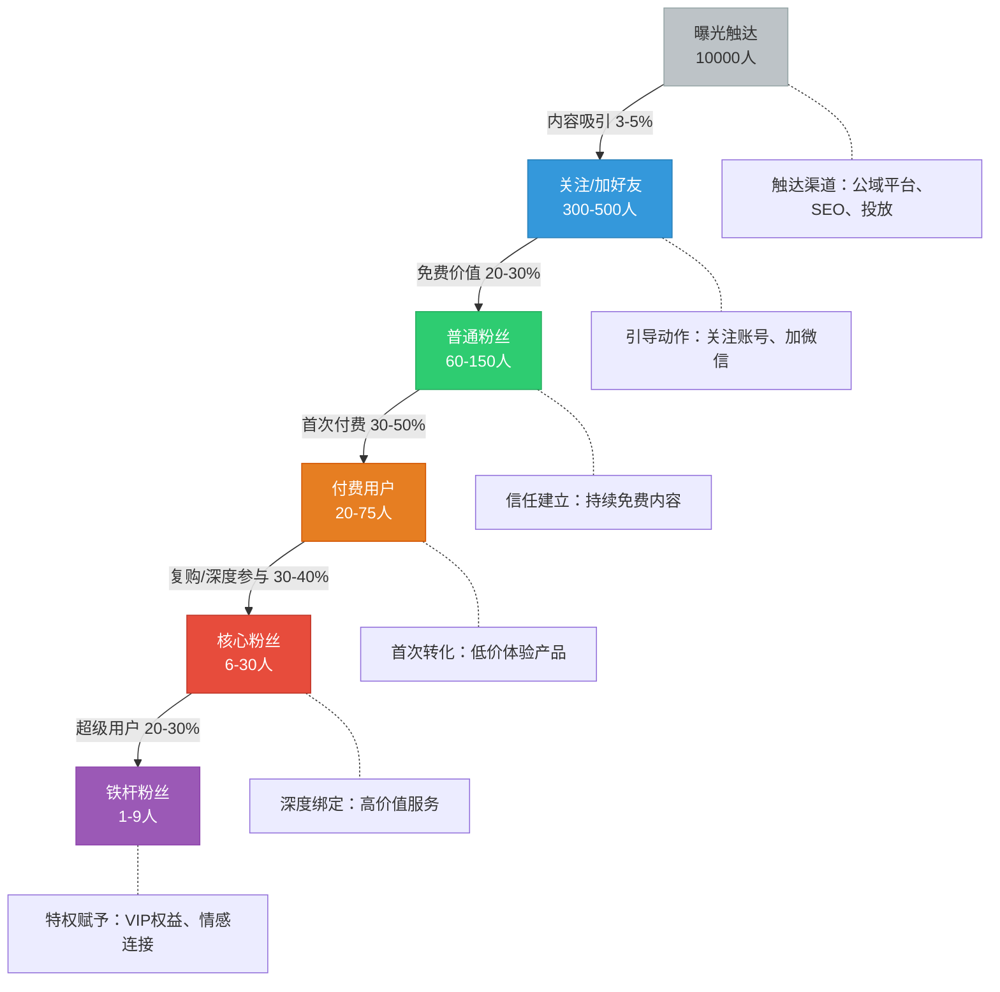
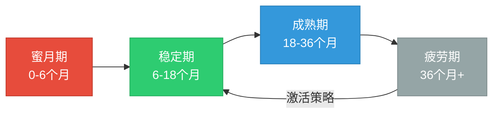

## 四、粉丝经济的底层逻辑

### 1. 从"1000个铁杆粉丝"说起

2008年，《连线》杂志创始主编凯文·凯利（Kevin Kelly）提出了一个影响深远的理论：**任何创作者，只要拥有1000个铁杆粉丝（True Fans），就能维持体面的生活。**

这个理论的核心假设是：铁杆粉丝愿意购买你推出的任何产品或服务。如果你每年能从每个铁杆粉丝身上获得100美元的收入，1000个铁杆粉丝就是10万美元——在美国足以维持基本生活，在中国则相当于一个相当不错的年收入。

但这个理论传入中国后，发生了一个有趣的演变。中国互联网的生态结构、支付习惯、社交裂变机制与欧美截然不同，使得"铁杆粉丝"的定义、获取路径和变现模型都产生了显著差异。



**中国市场的三个关键调整：**

**调整一：数量可以更少。** 中国的消费水平和支付意愿决定了，很多垂直领域不需要1000个铁杆粉丝。一个教Excel的老师，200个年付费999元的会员，就是近20万年收入。一个美妆博主，500个愿意购买推荐产品的忠实粉丝，年带货佣金就能超过30万。

**调整二：单客价值可以更高。** 中国用户在私域场景中的付费意愿往往被低估。一个健身教练的私域社群，铁杆粉丝不仅买课（3000-10000元/年），还买周边产品（蛋白粉、装备等，1000-3000元/年），参加线下活动（500-2000元/次），甚至转介绍新客户（间接价值2000-5000元/年）。单个铁杆粉丝的年贡献可以达到5000-20000元。

**调整三：裂变系数放大效果。** 中国社交生态（微信朋友圈、群聊、视频号）的裂变效率远高于欧美。一个铁杆粉丝不仅自己付费，还能带来1.5-3个新用户。这意味着你的200个铁杆粉丝，实际影响范围是300-600人，其中又会有一部分转化为新的铁杆粉丝。

### 2. 粉丝经济的四层金字塔模型

粉丝不是一个均质群体。理解粉丝经济的第一步，是看清粉丝的分层结构。



| 层级 | 占比 | 行为特征 | 付费意愿 | 运营策略 |
|------|------|---------|---------|---------|
| 路人/泛粉丝 | 40-60% | 偶尔看到你的内容，随手点赞 | 几乎为零 | 通过优质内容吸引注意力，引导关注 |
| 普通粉丝 | 30-40% | 关注了你的账号，偶尔看看 | 低（9.9-99元） | 持续输出免费价值，建立初步信任 |
| 核心粉丝 | 10-15% | 经常互动（评论、转发、私信） | 中（100-999元） | 提供进阶内容和服务，引导首次付费 |
| 铁杆粉丝 | 2-5% | 主动传播、复购、维护你 | 高（1000元以上/年） | 提供最高价值，给予特权和归属感 |

**关键认知：你的收入不取决于粉丝总数，而取决于铁杆粉丝的数量和单客价值。**

一个拥有100万泛粉丝的博主，如果没有铁杆粉丝，年收入可能不到10万（仅靠平台广告分成）。而一个拥有500个铁杆粉丝的小众博主，年收入可能超过50万。这就是粉丝经济最反直觉的地方：**精准的小圈子比泛滥的大流量更值钱。**

### 3. 铁杆粉丝的心理学基础

要经营粉丝经济，必须先理解铁杆粉丝为什么愿意持续付费。这不是简单的"因为你内容好"——如果只是内容好，免费内容到处都是。铁杆粉丝付费的背后，有五层递进的心理动机。

#### 3.1 五层付费心理模型

**第一层：功能价值（解决问题）**

最基础的一层。粉丝付费是因为你能帮他解决具体问题——学一项技能、获取一个信息、节省时间。这一层的付费关系最脆弱，因为一旦有人能更便宜或更好地解决同样的问题，粉丝就会离开。

典型场景：付费课程、咨询服务、行业报告。

**第二层：情感价值（认同归属）**

粉丝不仅为"你能帮我什么"付费，还为"和你在一起的感觉"付费。他们认同你的价值观、欣赏你的风格、享受在社群中的归属感。这一层的粘性显著增强——即使有更便宜的替代品，他们也愿意留在你这里。

典型场景：读书社群、兴趣社群、粉丝后援会。

**第三层：社交价值（人脉链接）**

粉丝付费不只是为了获得你的内容，更是为了进入一个高质量的社交圈。他们通过你的社群认识了有价值的人、获得了合作机会、拓展了人脉。这一层的价值往往被低估——很多社群的真正价值不是群主的内容，而是群里的其他成员。

典型场景：行业资源社群、高端人脉社群、校友会。

**第四层：身份价值（彰显身份）**

粉丝通过付费获得一种身份标识——"我是XX的会员"本身成了一种社交货币。就像有人买奢侈品不是因为包能装东西，而是因为背这个包代表了一种身份。高级别的社群会员资格同理。

典型场景：高端私董会、限量会员俱乐部、行业精英圈。

**第五层：投资价值（期待回报）**

最高级的一层。粉丝付费是因为他们认为这段关系本身具有投资价值——今天的投入会在未来带来更大的回报。可能是通过社群获得的商业机会、人脉资源、认知提升。这一层的粉丝付费意愿最高、忠诚度最强。

典型场景：创业社群、投资人社群、高管学习圈。



**实操启示：** 你的社群至少要覆盖两层以上的价值，才能建立稳固的粉丝关系。只提供功能价值的社群，注定要陷入价格战。同时覆盖功能价值和情感价值的社群，才能拥有定价权。

#### 3.2 沉没成本与承诺一致性

铁杆粉丝之所以"铁"，还有一个行为经济学的原因：**沉没成本效应**。

当一个粉丝在你身上投入了时间（看了你100篇文章）、金钱（买了你3门课程）、社交资本（向朋友推荐过你），这些已经投入的成本会让他更不愿意离开。这不是"绑架"，而是人类决策的自然倾向——我们倾向于为已经投入的事物继续投入。

**实操启示：** 设计社群运营路径时，要有意识地创造"投入阶梯"。让粉丝从低投入行为开始（点赞、评论），逐步过渡到高投入行为（付费、参加活动、转介绍）。每一次投入都在加深他们的承诺。

#### 3.3 社会认同与从众效应

铁杆粉丝不是孤立存在的，他们是在一个群体中相互强化的。当一个社群中有10个人说"这个社群太值了"，第11个人就会倾向于认同这个判断。这就是社会认同原理——我们通过观察他人的行为来决定自己的行为。

**实操启示：** 在社群中创造"晒单"文化、鼓励老成员分享收获、展示会员成果。这些社会认同信号比你自己的任何营销话术都有效。

### 4. 粉丝经济的数学模型

理解了心理学基础后，我们来看粉丝经济的数学逻辑。这不是学术分析——而是帮你算清楚"我到底能不能靠这个赚钱"。

#### 4.1 铁杆粉丝收入公式

```text
年收入 = 铁杆粉丝数 × 单客年均价值 × (1 + 裂变系数) - 运营成本
```

**变量说明：**

| 变量 | 含义 | 典型范围 | 影响因素 |
|------|------|---------|---------|
| 铁杆粉丝数 | 愿意持续付费的核心用户 | 50-2000人 | 你的内容质量、运营能力、行业规模 |
| 单客年均价值 | 每个铁杆粉丝每年的平均贡献 | 500-20000元 | 产品定价、复购频次、增值服务 |
| 裂变系数 | 每个铁杆粉丝平均带来的新付费用户 | 0.3-2.0 | 社群口碑、转介绍机制、产品体验 |
| 运营成本 | 人力、工具、内容、活动等成本 | 占收入10-30% | 自动化程度、团队规模 |

#### 4.2 三个真实案例的数学拆解

**案例A：Excel教学博主**
- 铁杆粉丝数：300人
- 单客年均价值：999元（年费会员）
- 裂变系数：0.5（每人带来0.5个新付费用户）
- 年收入：300 × 999 × 1.5 = 449,550元
- 运营成本：约5万（录课设备、平台费、助教工资）
- 净收入：约40万

**案例B：母婴育儿社群**
- 铁杆粉丝数：800人
- 单客年均价值：1500元（会员费600 + 电商消费900）
- 裂变系数：1.2（宝妈群体社交活跃，转介绍率高）
- 年收入：800 × 1500 × 2.2 = 2,640,000元
- 运营成本：约60万（团队3人、供应链、活动）
- 净收入：约200万

**案例C：创业者私董会**
- 铁杆粉丝数：120人
- 单客年均价值：30000元（年费20000 + 活动费10000）
- 裂变系数：0.8（高端圈子扩圈慢但质量高）
- 年收入：120 × 30000 × 1.8 = 6,480,000元
- 运营成本：约150万（场地、嘉宾、服务团队）
- 净收入：约500万

**从这三个案例可以看出：**

铁杆粉丝数 × 单客价值的组合有多种路径。你不需要做大众市场——300个铁杆粉丝 × 高单价，和800个铁杆粉丝 × 中等单价，都能实现不错的收入。关键是找到适合你能力和资源的组合。

#### 4.3 LTV与CAC的黄金比例

在粉丝经济中，有两个关键指标决定了你的商业模式是否健康：

- **LTV（客户终身价值）**：一个粉丝在整个生命周期内为你贡献的总收入
- **CAC（客户获取成本）**：获取一个新粉丝的平均成本

**健康标准：LTV / CAC ≥ 3**

如果LTV是3000元，CAC应该控制在1000元以内。如果LTV/CAC低于3，说明你的获客成本太高或者客户价值太低，需要调整。

| LTV/CAC比值 | 状态 | 含义 | 行动建议 |
|-------------|------|------|---------|
| < 1 | 亏损 | 获客成本高于客户价值 | 立即停止扩张，优化商业模式 |
| 1-2 | 微利 | 勉强盈利，抗风险能力弱 | 提高客单价或降低获客成本 |
| 3-5 | 健康 | 良性循环，可持续增长 | 可以适度投入获客，扩大规模 |
| > 5 | 高利润 | 说明还有提价或扩展空间 | 考虑增加产品线，提升单客价值 |

### 5. 从泛粉丝到铁杆粉丝的转化路径

理解了理论和数学后，核心问题变成：**如何把一个路人变成铁杆粉丝？**

这不是自然发生的——需要设计一条精心规划的转化路径。

#### 5.1 转化漏斗模型



**从漏斗数据可以看出：** 10000次曝光，最终可能只产生1-9个铁杆粉丝。转化率约为万分之一到千分之一。这就是为什么"泛流量"不值钱——你需要足够大的漏斗入口，或者在每一层转化上做到极致。

#### 5.2 六步转化实操路径

**第一步：内容触达（公域引流）**

目标：让目标用户"看到你"。

核心动作：
- 在目标用户聚集的平台（抖音、小红书、B站、知乎等）持续发布高质量内容
- 内容要"有用"或"有趣"，最好两者兼具
- 每篇内容都要有明确的引流钩子（"关注我获取完整资料""私信我领取模板"）

关键指标：曝光→关注转化率 ≥ 3%

**第二步：信任建立（免费价值）**

目标：让用户觉得"关注你"是值得的。

核心动作：
- 在朋友圈/公众号/社群中持续输出免费干货
- 展示专业能力和真实人格（不是完美人设，而是有温度的专业人）
- 通过互动（回复评论、私信交流）建立个人连接

关键指标：关注→活跃互动转化率 ≥ 20%

**第三步：首次转化（低价产品）**

目标：让用户完成第一次付费行为。

核心动作：
- 设计低价体验产品（9.9-99元），降低决策门槛
- 体验产品要超出预期——让用户觉得"这个价格买到这个价值，太赚了"
- 首次付费是建立"付费习惯"的关键节点

关键指标：互动用户→首次付费转化率 ≥ 30%

**第四步：价值交付（超预期体验）**

目标：让付费用户感到"物超所值"。

核心动作：
- 交付内容要超出用户预期（多给30%的价值）
- 提供贴心的售后服务和答疑
- 收集用户反馈，持续迭代产品

关键指标：首次付费用户满意度 ≥ 90%

**第五步：深度绑定（高价值产品）**

目标：让满意用户成为"核心粉丝"。

核心动作：
- 设计阶梯式产品体系（低价→中价→高价），引导用户升级
- 提供独家内容、优先权益、专属服务
- 创造社群归属感——让用户觉得"我是这个圈子的人"

关键指标：首次付费→复购转化率 ≥ 30%

**第六步：特权赋予（铁杆认证）**

目标：让核心粉丝成为"铁杆粉丝"。

核心动作：
- 给予铁杆粉丝特殊的头衔、标识、权益
- 邀请参与决策（新课程选题、社群规则制定）
- 创造"共创"关系——铁杆粉丝不是消费者，而是合作伙伴
- 建立线下连接（见面会、聚会），把线上关系升级为线下关系

关键指标：核心粉丝→铁杆粉丝转化率 ≥ 20%

### 6. 粉丝经济的三大变现模式

铁杆粉丝的价值不仅在于直接付费，更在于他们支撑的多元变现模式。

#### 6.1 模式一：直接付费模式

粉丝直接为内容、服务、产品付费。这是最基础、最直接的变现方式。

| 产品类型 | 定价范围 | 适合场景 | 利润率 |
|---------|---------|---------|--------|
| 付费文章/专栏 | 9.9-199元 | 知识分享、深度分析 | 80-95% |
| 线上课程 | 99-9999元 | 技能教学、系统培训 | 70-90% |
| 付费社群/会员 | 199-9999元/年 | 持续服务、资源对接 | 60-80% |
| 1对1咨询 | 500-5000元/小时 | 个性化指导 | 85-95% |
| 线下活动 | 100-50000元/人 | 深度交流、体验式学习 | 40-70% |

**关键原则：** 直接付费模式的核心是"价值对等"——你的定价要让用户觉得"值"，而不是"便宜"。定价太低反而会降低感知价值。

#### 6.2 模式二：间接变现模式

粉丝不直接为你付费，但通过他们的存在和行为，为你创造收入。

| 变现方式 | 机制 | 收入范围 | 注意事项 |
|---------|------|---------|---------|
| 广告合作 | 品牌付费触达你的粉丝 | 500-100000元/次 | 频率控制，选择匹配品牌 |
| 带货分佣 | 推荐产品，赚取佣金 | 销售额的10-50% | 选品要严，信任一旦破坏不可逆 |
| 资源对接 | 帮粉丝之间牵线搭桥 | 合作金额的1-10% | 要深度了解双方需求 |
| 品牌授权 | 允许品牌使用你的影响力 | 5000-500000元/年 | 谨慎选择，避免过度商业化 |

**关键原则：** 间接变现的前提是信任。铁杆粉丝信任你的推荐，是因为你把关严格。一旦推荐了劣质产品，信任崩塌的速度比建立的速度快10倍。

#### 6.3 模式三：杠杆放大模式

利用铁杆粉丝作为杠杆，撬动更大的商业价值。

**裂变杠杆：** 铁杆粉丝主动帮你传播，降低获客成本。设计"老带新"机制（推荐奖励、拼团优惠），让铁杆粉丝的社交网络成为你的获客渠道。

**内容杠杆：** 铁杆粉丝生产的内容（UGC）成为新的引流素材。鼓励粉丝写学习心得、使用体验、成长故事，这些真实的内容比你的自卖自夸更有说服力。

**信任杠杆：** 铁杆粉丝的信任背书降低新用户的决策成本。一个老会员说"这个社群真的值"，比你说100遍"我的社群很好"都有效。

**资本杠杆：** 当铁杆粉丝达到一定规模，你可以撬动更大的商业机会——出版图书、开设线下机构、与品牌深度合作、甚至获得投资。

### 7. 粉丝经济的常见陷阱与纠正

#### 陷阱一：混淆"粉丝数"和"铁杆粉丝数"

**症状：** 追求关注者数量，觉得粉丝越多越赚钱。

**真相：** 10万个从不互动的僵尸粉，不如100个愿意付费的铁杆粉丝。平台粉丝数是一个虚荣指标，铁杆粉丝数才是真实的商业指标。

**纠正方法：** 停止追求粉丝数量，转而关注"铁杆粉丝转化率"。计算公式：铁杆粉丝数 / 总粉丝数。如果这个比例低于1%，说明你的粉丝质量或运营策略有问题。

#### 陷阱二：过度依赖单一平台

**症状：** 所有粉丝都在一个平台上（比如只做抖音或只做微信）。

**真相：** 平台的规则随时可能改变——算法调整、政策变化、甚至封号。2023年抖音大面积调整算法，很多百万粉丝博主的播放量暴跌80%以上。

**纠正方法：** 将公域平台粉丝引导到私域（微信个人号/企业微信）。私域是你能直接触达、不受平台规则影响的数字资产。目标：至少50%的铁杆粉丝在你的私域中。

#### 陷阱三：把粉丝当"韭菜"

**症状：** 频繁推出高价产品，把粉丝当作提款机。

**真相：** 铁杆粉丝的忠诚建立在信任基础上。一旦他们觉得你在"割韭菜"，不仅会离开，还会传播负面口碑。一个铁杆粉丝的负面评价，可能抵消你100次正面营销。

**纠正方法：** 坚持"价值优先"原则——每次推出付费产品前，先问自己："如果我是粉丝，我会觉得这个价格买到这个价值，值得吗？"如果答案是否定的，调整产品或降低价格。

#### 陷阱四：忽视粉丝分层运营

**症状：** 对所有粉丝一视同仁，用同样的方式对待路人和铁杆粉丝。

**真相：** 铁杆粉丝需要被"特殊对待"。如果他们觉得自己和普通粉丝没有区别，就没有动力继续深度参与。

**纠正方法：** 建立明确的会员等级体系，不同等级享受不同权益。铁杆粉丝应该获得：优先响应、专属内容、参与决策权、线下活动邀请、特殊标识。

#### 陷阱五：只关注"获取"不关注"维护"

**症状：** 花大量精力获取新粉丝，忽视老粉丝的维护。

**真相：** 维护一个老粉丝的成本是获取一个新粉丝的1/5到1/7。一个流失的铁杆粉丝，不仅意味着失去他的未来收入，还可能带走他影响的其他粉丝。

**纠正方法：** 建立"粉丝健康度"监控机制。定期追踪：互动频率是否下降、付费是否中断、满意度是否降低。对"预警信号"及时干预——一个主动联系你的流失信号，胜过事后100次挽回。

### 8. 中国市场的粉丝经济特征

中国市场有其独特的粉丝经济生态，不能简单照搬欧美的经验。

#### 8.1 微信生态的独特优势

微信是中国粉丝经济的"基础设施"。它同时提供了内容（公众号/视频号）、社交（朋友圈/群聊）、支付（微信支付）、服务（小程序）的完整闭环。这意味着你可以在一个生态内完成从引流到变现的全流程，而不需要跳转多个平台。

**微信私域的四层布局：**

| 层级 | 载体 | 触达方式 | 粉丝关系深度 |
|------|------|---------|------------|
| 第一层 | 视频号 | 推荐算法+社交推荐 | 最浅（路人） |
| 第二层 | 公众号 | 订阅推送 | 浅（普通粉丝） |
| 第三层 | 个人微信/企业微信 | 朋友圈+私聊 | 中（核心粉丝） |
| 第四层 | 微信群 | 群消息+群活动 | 深（铁杆粉丝） |

**布局策略：** 从第一层到第四层，粉丝数量递减，但关系深度和商业价值递增。你的目标是把尽可能多的粉丝从第一层引导到第四层。

#### 8.2 "人情社会"的信任机制

中国的商业信任更多建立在"人情"而非"制度"基础上。这意味着：

- **人格化运营比品牌化运营更有效。** 粉丝更愿意相信一个"有温度的人"，而不是一个"冰冷的品牌"。这也是为什么个人IP在中国特别重要。
- **"关系"需要主动维护。** 逢年过节的问候、生日祝福、关键时刻的关怀，这些"非商业"的互动，是维护铁杆粉丝关系的重要手段。
- **"面子"和"圈层"很重要。** 高端社群的会员资格本身就是一种"面子"——"我是XX私董会的成员"这句话，在中国的商业社交中具有实际的社交货币价值。

#### 8.3 下沉市场的粉丝经济

不要忽视三四线城市和县城的粉丝经济机会。下沉市场的特点是：

- **信息不对称更大：** 一线城市的"常识"在下沉市场可能是"新知"，这意味着知识类内容的价值更高
- **社交圈更紧密：** 小城市的社交网络密度更高，裂变传播效率反而更好
- **付费决策更从众：** "身边的人都在学/在用"是最强的购买驱动力
- **竞争更小：** 大部分创作者集中在一二线城市，下沉市场的竞争远没有那么激烈

### 9. 粉丝经济的生命周期与可持续性

粉丝经济不是一劳永逸的。它有自己的生命周期，需要在不同阶段采取不同的策略。

#### 9.1 粉丝关系的五个阶段



| 阶段 | 特征 | 核心任务 | 风险 |
|------|------|---------|------|
| 蜜月期 | 粉丝热情高、互动频繁、付费意愿强 | 快速建立深度连接，完成首次付费 | 过度承诺，后续无法兑现 |
| 稳定期 | 互动趋于稳定，形成运营节奏 | 持续交付价值，建立复购习惯 | 内容同质化，失去新鲜感 |
| 成熟期 | 粉丝形成稳定群体，有自我运转能力 | 引入新元素，拓展变现模式 | 创新不足，社群活力下降 |
| 疲劳期 | 互动明显下降，退群率上升 | 大幅创新或重新定位 | 如果不干预，社群走向死亡 |

#### 9.2 延长粉丝生命周期的策略

**策略一：持续迭代内容**

不要重复同样的内容。粉丝的需求会随时间变化——6个月前的入门内容，现在对他们来说太浅了。你的内容要跟随粉丝的成长而升级。

**策略二：引入新鲜血液**

定期引入新成员。新成员的活力会带动老成员的参与。同时，老成员在"教导"新成员的过程中，也会重新审视和巩固自己的知识。

**策略三：创造里程碑事件**

定期举办大型活动（周年庆、年度峰会、游学考察等）。这些"事件"打破日常运营的单调感，给粉丝创造新的记忆点和社交话题。

**策略四：升级商业模式**

当社群进入成熟期，考虑引入新的变现模式。从单纯的会员制，扩展到电商、咨询、活动、品牌合作等多元收入。新模式也会带来新的社群活力。

**策略五：培养"接班人"**

从铁杆粉丝中培养"社群合伙人"或"版主"。让他们承担部分运营职责，既能减轻你的负担，又能增强他们的归属感和投入度。

### 10. 本节核心要点

1. **铁杆粉丝理论在中国的变体：** 200-2000个铁杆粉丝，每人每年贡献200-20000元，足以支撑一份体面的收入。关键不是粉丝总数，而是铁杆粉丝数 × 单客价值。

2. **粉丝金字塔模型：** 路人→普通粉丝→核心粉丝→铁杆粉丝，每层转化率约20-50%。你的收入由最顶层决定。

3. **五层付费心理：** 功能价值、情感价值、社交价值、身份价值、投资价值。覆盖两层以上才能建立稳固关系。

4. **收入公式：** 年收入 = 铁杆粉丝数 × 单客年均价值 × (1 + 裂变系数) - 运营成本。先算清楚账，再开始行动。

5. **转化路径六步：** 内容触达→信任建立→首次转化→价值交付→深度绑定→特权赋予。每一步都需要精心设计。

6. **三大变现模式：** 直接付费（内容/服务/产品）、间接变现（广告/带货/对接）、杠杆放大（裂变/内容/信任/资本）。

7. **五大常见陷阱：** 混淆粉丝数和铁杆数、过度依赖单一平台、把粉丝当韭菜、忽视分层运营、只获取不维护。

8. **中国市场特征：** 微信生态闭环、人情社会信任机制、下沉市场机会巨大。

9. **生命周期管理：** 蜜月期→稳定期→成熟期→疲劳期，每个阶段需要不同的策略。持续迭代是延长生命周期的关键。

10. **核心心法：** 粉丝经济的本质不是"收割"，而是"经营关系"。你和粉丝之间的关系越深、越真、越互惠，你的粉丝经济就越可持续。

***
