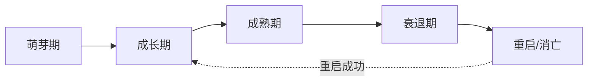
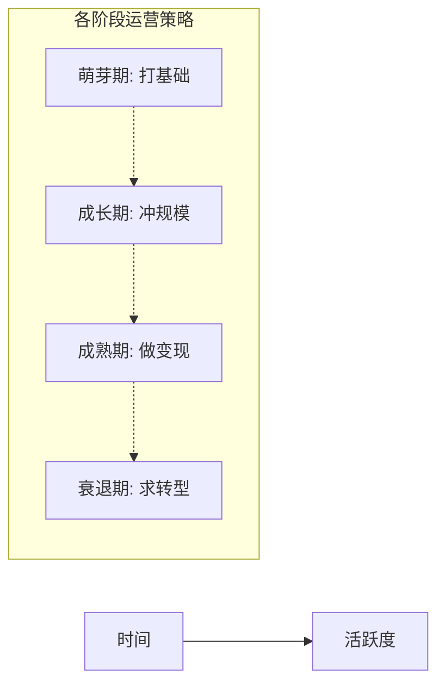
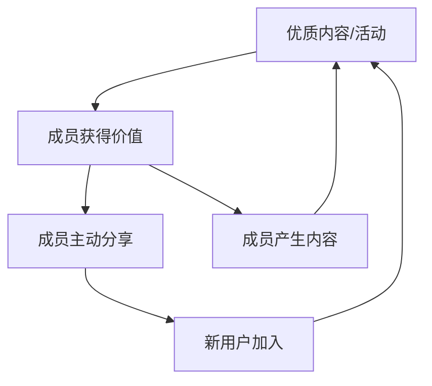
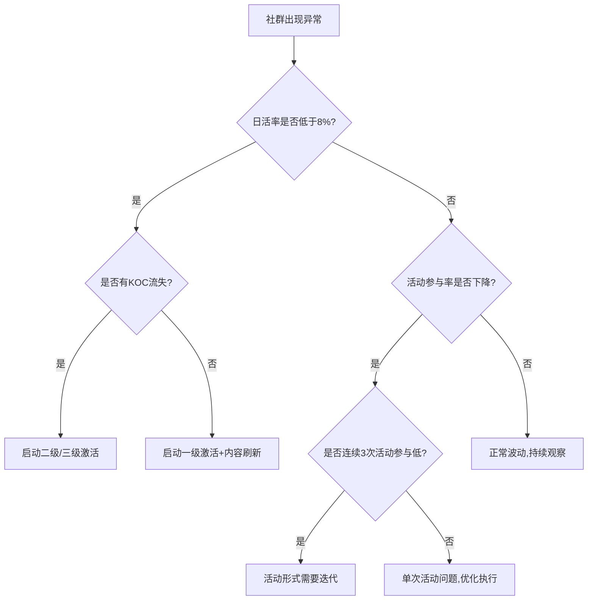

## 五、社群生命周期管理

任何社群都不是永动机——它有诞生、成长、巅峰和衰退。不理解生命周期的运营者，往往在社群活跃度断崖式下跌时手足无措，或者在本该加速变现的阶段选择观望。生命周期管理的本质是**在正确的时间做正确的事**，让社群价值最大化的同时延长其寿命。

### 1. 社群生命周期模型

#### 1.1 经典五阶段模型

社群的生命周期可以划分为五个阶段，每个阶段有截然不同的运营重心和关键指标：



| 阶段 | 典型时长 | 核心特征 | 运营重心 | 关键指标 |
|------|---------|---------|---------|---------|
| 萌芽期 | 1-4周 | 成员互不认识，观望氛围浓 | 建立信任、破冰、定调 | 首次互动率、自我介绍完成率 |
| 成长期 | 1-6个月 | 成员快速增加，话题活跃 | 规模增长、内容沉淀、培养KOC | 日活增长率、内容产出量、邀请率 |
| 成熟期 | 6-24个月 | 用户稳定，关系网络成型 | 深度变现、生态建设、品牌塑造 | 付费转化率、ARPU、NPS |
| 衰退期 | 不定 | 活跃度下降，核心成员流失 | 激活沉默用户、迭代内容、引入新鲜血液 | 7日留存率、消息发送量趋势 |
| 重启/消亡 | - | 社群进入转折点 | 评估是否重启，或优雅关闭 | 社群健康度评分 |

#### 1.2 生命周期曲线的数学本质

社群活跃度随时间变化呈现近似正态分布曲线（也称"钟形曲线"）。理解这个规律，才能在曲线拐点提前布局：

- **上升拐点**（成长→成熟）：增速放缓但总量仍在增长，此时应开始布局变现
- **峰值**（成熟期顶端）：运营效率最高，适合做重度转化活动
- **下降拐点**（成熟→衰退）：留存率开始显著下降，必须启动激活或重启策略



#### 1.3 不同类型社群的生命周期差异

| 社群类型 | 典型寿命 | 衰退特征 | 核心策略 |
|---------|---------|---------|---------|
| 兴趣社群（读书、摄影） | 2-5年 | 兴趣疲劳，核心产出者流失 | 主题轮换+新人激励 |
| 学习社群（课程、培训） | 3-12个月 | 课程结束即失去存在意义 | 系列课程+校友会转型 |
| 电商社群（拼团、种草） | 1-3年 | 价格敏感疲劳，竞争分流 | 会员权益+独家产品 |
| 行业社群（资源对接） | 3-10年 | 信息价值被平台替代 | 线下活动+深度链接 |
| 品牌社群（粉丝圈） | 跟随品牌周期 | 品牌热度下降 | 新品共创+情感绑定 |

### 2. 萌芽期：从0到1的信任构建

#### 2.1 种子用户筛选

萌芽期最关键的决策是"让谁进来"。种子用户的质量决定了社群未来12个月的走向。不是越多越好，而是越精准越好。

**种子用户画像标准：**
- **意愿度**：主动申请加入，而非被拉入。主动意愿意味着更高的参与度
- **匹配度**：与社群主题有真实需求，而非"顺便看看"
- **影响力**：在自己的圈子里有一定话语权，能带来涟漪效应
- **表达欲**：愿意分享观点和经验，而非潜水围观

**种子用户招募的五个渠道：**
1. **自有流量**：公众号/短视频/播客的深度互动用户（评论、私信过你的）
2. **朋友圈筛选**：发布社群预告，只邀请主动私信的人
3. **1v1邀请**：针对目标人群直接私聊，说明社群价值和加入条件
4. **KOL背书**：请行业意见领袖推荐，借用其信任资产
5. **付费门槛**：设置小额付费（9.9-49.9元），用价格筛选意愿度

**理想的种子用户数量：** 30-80人。太少缺乏互动多样性，太多管理不过来。

#### 2.2 破冰与定调

社群建立后的前72小时是"黄金窗口期"。这段时间形成的互动习惯和氛围，会影响社群未来几个月的走向。

**破冰三板斧：**

**第一步：自我介绍模板（建立）**
设计结构化的自我介绍模板，降低参与门槛：
```text
📍 坐标：北京
🎯 我擅长/资源：短视频运营、抖音投放
💡 我想解决的问题：如何从0开始做私域
🌟 一句话介绍自己：3年电商运营，刚转型做个人品牌
```
运营者先发自己的版本，再@几位活跃成员带头，形成"模板效应"。

**第二步：主题讨论（启动）**
发起一个低门槛但有争议性的讨论话题，例如：
- "你加入这个社群最想获得的一个收获是什么？"
- "你觉得做好XX最难的一步是什么？"
- 投票类话题："你目前最困扰的问题是A还是B？"

**第三步：即时价值交付（巩固）**
在前3天内至少提供一次"超预期"的价值：
- 一份独家整理的行业报告
- 一次小规模的直播答疑
- 一个即学即用的模板或工具

#### 2.3 规则与预期管理

在社群建立的第一周，必须明确以下边界：

| 需要明确的内容 | 具体说明 | 建议方式 |
|--------------|---------|---------|
| 社群定位 | 这个群是用来做什么的 | 置顶公告+入群欢迎语 |
| 行为边界 | 哪些行为被鼓励，哪些被禁止 | 群规文档（不超过10条） |
| 互动节奏 | 每天/每周有什么固定活动 | 活动日历（第一周就开始） |
| 权益说明 | 成员能获得什么 | 入群时逐一说明 |
| 淘汰机制 | 什么情况下会被移除 | 群规最后一条 |

**群规撰写要点：** 简洁（不超过300字）、正向（多写"我们鼓励"少写"不允许"）、可执行（每条规则对应一个具体的处理措施）。

### 3. 成长期：规模化增长的引擎

#### 3.1 增长飞轮设计

成长期的核心任务是建立可持续的增长飞轮。好的飞轮不需要运营者推着转，而是让成员自发产生裂变。



**五种经过验证的增长引擎：**

**引擎一：邀请奖励机制**
- 邀请3人入群，获得一次免费答疑机会
- 邀请5人入群，获得一份付费资料包
- 邀请10人入群，获得一次1v1咨询（30分钟）
- 关键原则：奖励的价值必须真实可感，而不是虚拟积分

**引擎二：内容裂变**
- 将社群内的精华讨论整理为外部可传播的内容（图文/短视频）
- 每篇内容结尾附加入口："加入XX社群，获取更多干货"
- 核心成员署名曝光，形成"在社群里被看见"的吸引力

**引擎三：活动引流**
- 定期举办公开活动（直播、训练营、挑战赛）
- 活动中设置社群专属福利（加群领资料、群内抽奖）
- 活动结束后在社群内做复盘，让外部用户看到"社群成员的待遇"

**引擎四：口碑效应**
- 最强大的增长引擎是"成员自发推荐"
- 实现条件：社群真的帮成员解决了问题、获得了成长
- 运营策略：定期收集成员成果故事，内部分享+外部传播

**引擎五：联合运营**
- 与互补型社群互相推荐（例如摄影社群与旅行社群）
- 联合举办活动，双方成员共享
- 关键：选择用户画像重叠但不竞争的社群

#### 3.2 规模增长的管理挑战

当社群人数超过300人时，会面临一系列管理挑战：

| 挑战 | 表现 | 解决方案 |
|-----|------|---------|
| 信息过载 | 群消息太多，重要信息被淹没 | 建立分层频道：通知群、讨论群、闲聊群 |
| 质量稀释 | 新成员不了解社群文化，发言质量下降 | 入群前设置"门槛任务"（如自我介绍、回答问题） |
| 管理瓶颈 | 运营者精力有限，无法覆盖所有问题 | 培养KOC担任小组长，分区域/分话题管理 |
| 广告泛滥 | 有人开始发无关广告 | 群规+自动审核+人工巡查+警告→禁言→移除机制 |
| 小圈子形成 | 核心成员形成封闭小团体 | 设计跨组互动活动，定期打散小组 |

#### 3.3 KOC培养体系

KOC（关键意见消费者）是社群在成长期最重要的资产。没有KOC的社群，运营者一旦不在，群就"死"了。

**KOC识别的四个信号：**
1. 主动回答其他成员的问题（而非只提问题）
2. 持续输出有价值的内容（不只是评论"说得对"）
3. 维护社群秩序（主动@违反群规的人）
4. 在外部为社群代言（朋友圈/其他平台提到社群）

**KOC培养的阶梯计划：**

| 阶段 | 角色 | 职责 | 权益 |
|------|------|------|------|
| 观察期（2-4周） | 活跃成员 | 正常参与讨论 | 优先参与活动 |
| 培养期（1-2个月） | 嘉宾/助手 | 协助管理、参与内容创作 | 免费会员/专属头衔 |
| 正式期（3个月+） | 小组长/版主 | 负责特定板块、带领新人 | 收益分成/品牌合作机会 |

**关键提醒：** KOC培养不是"把任务丢给他们"。你需要持续给予反馈、认可和成长机会。每月至少1次与KOC的1v1沟通，了解他们的诉求和困惑。

### 4. 成熟期：价值最大化的黄金窗口

#### 4.1 变现策略矩阵

成熟期是社群变现效率最高的阶段。此时成员信任度高、关系网络密集、社群品牌已有口碑。变现不是"割韭菜"，而是将社群积累的信任资产转化为可持续的商业价值。

**四大变现路径对比：**

| 路径 | 模式 | 利润率 | 天花板 | 适合类型 |
|------|------|--------|--------|---------|
| 会员付费 | 年费/月费制 | 80-95% | 中 | 知识型、资源型社群 |
| 产品/服务销售 | 自有产品或分佣 | 20-60% | 高 | 电商型、品牌型社群 |
| 广告/赞助 | 品牌合作、软文 | 70-90% | 中 | 大型流量型社群 |
| 活动/培训 | 线上课程、线下活动 | 60-80% | 高 | 教育型、行业型社群 |

**成熟期变现的三个原则：**
1. **价值前置**：先让成员感受到远超付费的免费价值，再推出付费产品
2. **梯度定价**：从低到高设计产品线（免费→低价→中价→高价），让不同消费能力的成员都能参与
3. **稀缺性**：付费产品必须有明确的排他性（社群专属价、限量名额、优先权）

#### 4.2 生态化建设

成熟期不应只关注变现，还需要建设社群生态，为衰退期储备"重启燃料"：

**内容生态：** 从PGC（运营者产出）过渡到UGC（用户产出）
- 建立内容激励机制：优质帖子/回答获得积分、勋章、实物奖励
- 定期举办内容创作大赛
- 将优质UGC整理为社群知识库

**关系生态：** 让成员之间形成横向连接
- 建立"兴趣小组"或"行业子群"
- 举办"技能交换"活动（A教B设计，B教A写作）
- 引入"社群名片墙"，展示成员的专长和资源

**品牌生态：** 将社群品牌外溢
- 打造社群IP形象、Slogan、视觉体系
- 发布社群年度报告（成员数量、活动场次、成果故事）
- 申请商标、注册品牌，为商业化做法律准备

#### 4.3 成熟期健康度监测

进入成熟期后，需要建立系统化的健康度监测体系：

**核心仪表盘指标：**

| 指标类别 | 具体指标 | 健康基准 | 预警阈值 |
|---------|---------|---------|---------|
| 活跃度 | 日活率（DAU/总人数） | >15% | <8% |
| 活跃度 | 周消息量趋势 | 持平或增长 | 连续2周下降>15% |
| 留存率 | 30日留存 | >70% | <50% |
| 互动深度 | 人均日发言次数 | >1.5次 | <0.5次 |
| 内容质量 | UGC占比 | >40% | <20% |
| 变现效率 | 付费转化率 | >5% | <2% |
| 口碑指标 | NPS（净推荐值） | >50 | <20 |

**监测方法：**
- 使用企业微信/飞书等工具的社群数据看板
- 每月人工抽样分析50条聊天记录的质量
- 每季度进行一次成员满意度调研（问卷星/腾讯问卷）
- 建立"社群温度计"——每周让5位随机成员用1-5分评价社群体验

### 5. 衰退期：识别信号与激活策略

#### 5.1 衰退的五个早期信号

衰退不是突然发生的。以下信号出现2个以上，说明社群已进入衰退期前兆：

1. **沉默扩散**：日活率连续3周下降，但没有新成员加入来弥补
2. **核心流失**：KOC开始减少发言频率或退出社群
3. **话题枯竭**：讨论内容重复度高，缺乏新鲜话题
4. **活动疲软**：活动参与率持续走低，报名人数不足预期的50%
5. **价值质疑**：有成员开始问"这个群还有什么用"或"为什么还要续费"

#### 5.2 三级激活策略

**一级激活：内容刷新（成本最低，见效最快）**
- 引入新的内容形式：从图文切换到短视频/直播/播客
- 邀请新的嘉宾/导师做分享，打破"老面孔"疲劳
- 推出新的主题活动系列（如"21天挑战赛"、"每周一问"）
- 复盘并重新推广社群历史精华内容（很多新成员没看过）

**二级激活：结构重组（中等成本，持续性强）**
- 打散原有小组，重新分配，制造新的社交连接
- 建立新的角色体系（如"导师团"、"评审团"、"先锋队"）
- 推出"社群2.0"版本，明确宣布新的规则和权益
- 开放"社群共创"机制，让成员投票决定未来方向

**三级激活：模式转型（高成本，但效果最彻底）**
- 从免费社群转型为付费社群（设置入会费或年费）
- 从线上社群升级为O2O社群（增加线下活动频次）
- 从单一社群拆分为垂直子社群（化整为零，各子群独立运营）
- 从社群品牌升级为平台品牌（引入外部合作方，扩大生态）

#### 5.3 社群衰退期的变现策略

衰退期并不意味着完全不能变现。相反，这个阶段可以做"最后一波"高效转化：

- **限时特惠**：利用"社群可能关闭"的紧迫感，推出最后一批优惠名额
- **沉淀资产变现**：将社群积累的内容、模板、工具打包为付费产品
- **成员导流**：将活跃成员引导至新的社群或个人IP
- **品牌授权**：如果社群品牌有价值，可以授权给他人继续运营

#### 5.4 优雅关闭的正确姿势

如果评估后决定关闭社群，正确的方式比"突然解散"要好得多：

1. **提前通知**：至少提前30天告知成员社群即将关闭，说明原因
2. **数据导出**：帮助成员导出自己在社群中的内容和关系链
3. **替代方案**：推荐其他优质社群或资源，确保成员需求有承接
4. **致谢仪式**：举办一次线上/线下告别活动，感谢核心成员的贡献
5. **保留入口**：创建一个"校友群"，低频率运营但保持联系

### 6. 重启策略：让老社群焕发新生

#### 6.1 重启的时机判断

不是所有衰退的社群都值得重启。满足以下3个条件中的至少2个，才值得投入资源重启：

- 社群品牌仍有知名度和美誉度
- 存在一批活跃度虽降但未退出的"铁杆"成员（至少占总人数的10%）
- 所在赛道/主题仍有市场需求，且没有被完全替代
- 运营者有新的资源或能力注入

#### 6.2 重启的五步法

**第一步：诊断旧社群的衰退根因**
- 内容陈旧？→ 需要全新的内容策略
- 管理混乱？→ 需要重建规则和团队
- 定位模糊？→ 需要重新定义社群价值主张
- 竞争分流？→ 需要找到差异化定位

**第二步：组建重启核心团队**
- 从老成员中招募3-5位愿意参与重启的核心成员
- 明确分工：内容、运营、活动、外联
- 设定重启目标和时间表（通常以90天为一个阶段）

**第三步：策划重启事件**
- 发布"社群重启宣言"，说明新方向和新价值
- 举办一场高规格的重启活动（直播/线下聚会/限时免费体验）
- 邀请行业嘉宾站台，为重启造势

**第四步：分批引入新成员**
- 第一批（第1-2周）：老成员召回，优先邀请曾经活跃的成员
- 第二批（第3-4周）：种子用户引入，30-50人的精选新成员
- 第三批（第5周起）：开放申请，通过门槛机制筛选

**第五步：建立新的运营节奏**
- 不要复制旧的运营模式，否则会重蹈覆辙
- 根据诊断结果，建立全新的内容、活动、互动机制
- 设定重启后的"保质期"目标（例如：重启后6个月内日活率不低于20%）

#### 6.3 重启的风险与成本

| 风险类型 | 具体风险 | 应对措施 |
|---------|---------|---------|
| 品牌风险 | 重启失败会进一步损害社群品牌 | 先小范围试运营，确认可行再全面推广 |
| 成员预期 | 老成员对重启期望过高，实际体验不达标 | 重启前管理预期，承诺少于能做到的 |
| 精力投入 | 重启需要的精力不低于从0建群 | 评估投入产出比，确保ROI为正 |
| 惯性思维 | 运营者容易回到旧的运营模式 | 请外部顾问或新成员提供"局外人视角" |

### 7. 全生命周期的数据管理

#### 7.1 生命周期数据档案

为每个社群建立生命周期数据档案，记录关键节点的数据，便于复盘和决策：

```yaml
社群档案:
  基本信息:
    名称: "XX读书会"
    创建日期: 2025-01-15
    定位: "职场人深度阅读社群"
    当前阶段: 成熟期
  
  关键里程碑:
    - 日期: 2025-02-01
      事件: "突破100人"
      日活率: "25%"
    - 日期: 2025-06-01
      事件: "推出付费会员制"
      首月付费转化率: "12%"
    - 日期: 2025-12-01
      事件: "成员突破2000人"
      日活率: "18%"

  阶段指标:
    萌芽期:
      持续时长: "3周"
      种子用户数: 45
      破冰活动参与率: "89%"
    成长期:
      持续时长: "5个月"
      月均增长率: "35%"
      KOC培养数: 12
    成熟期:
      持续时长: "进行中"
      月均变现: "¥35,000"
      NPS: 62
```

#### 7.2 生命周期决策树

当社群出现异常时，按照以下决策树快速定位问题和应对方案：



#### 7.3 不同阶段的A/B测试重点

| 阶段 | 测试内容 | 测试方法 |
|------|---------|---------|
| 萌芽期 | 入群欢迎话术 | 不同版本话术的首日互动率对比 |
| 成长期 | 邀请奖励机制 | 不同奖励类型的邀请转化率对比 |
| 成熟期 | 定价策略 | 不同价格点的付费转化率对比 |
| 衰退期 | 激活内容 | 不同激活策略的7日留存率对比 |

### 8. 常见误区与纠正

#### 误区一：社群越活跃越好

**错误认知：** 把消息量等同于社群价值，追求"每天999+消息"。

**纠正：** 活跃度是过程指标，不是结果指标。高质量的讨论可能一周才发生一次，但每次都能帮成员解决问题。低质量的水聊每天999+，反而会让重要信息被淹没、让优质成员退群。真正应该关注的是**有效互动率**——在所有消息中，有价值的内容占比是多少。

#### 误区二：用"续费率"判断社群健康

**错误认知：** 只要续费率高，社群就是健康的。

**纠正：** 续费率可能受到"沉没成本效应"和"退出成本"的影响。有些成员续费只是因为不想丢失之前的社交关系，或者因为退出流程太麻烦。应该结合NPS（净推荐值）、活跃度、成员主动反馈等多维指标综合判断。

#### 误区三：社群衰退就是运营失败

**错误认知：** 社群一旦活跃度下降，就说明运营者做错了什么。

**纠正：** 衰退是生命周期的自然阶段，就像人会变老一样。运营者的目标不是让社群永远保持巅峰，而是在每个阶段做正确的事——萌芽期打好基础、成长期扩大规模、成熟期高效变现、衰退期优雅转型。一个社群如果在成熟期创造了足够价值，即使最终关闭，也是成功的。

#### 误区四：照搬别人的生命周期策略

**错误认知：** 某个社群用X策略在成熟期实现了百万变现，我照做就行。

**纠正：** 生命周期策略必须匹配社群类型、用户画像、运营者能力。一个500人的行业精英社群和一个5万人的兴趣社群，成熟期的变现策略完全不同。照搬别人的结果，往往是东施效颦。

#### 误区五：衰退期就放弃维护

**错误认知：** 社群已经进入衰退了，投入资源维护是浪费。

**纠正：** 衰退期恰恰是最需要精心管理的阶段。妥善处理衰退期的社群，可以将活跃成员导流到新社群，将品牌资产沉淀下来，将经验教训转化为下一个社群的起点。直接放弃，前面所有的投入都化为乌有。

### 9. 实战工具与模板

#### 9.1 社群生命周期诊断清单

定期（每月）用以下清单评估社群所处阶段：

```text
□ 社群成员数量趋势：增长/稳定/下降
□ 日活率：___%（>15%健康，8-15%观察，<8%预警）
□ 近30天新成员数：___人
□ 近30天退出成员数：___人
□ KOC活跃度：___位KOC本月发言超过10次
□ 活动参与率：___%（近3次活动平均）
□ UGC内容占比：___%
□ 付费转化率：___%（如有付费产品）
□ 最近一次成员投诉/负面反馈：___
□ 运营者精力投入：___小时/周
```

**判断标准：**
- 4项以上指标为"增长"状态 → 成长期
- 大部分指标为"稳定"状态 → 成熟期
- 3项以上指标为"下降"状态 → 衰退期前兆
- 5项以上指标为"下降"状态 → 已进入衰退期

#### 9.2 全生命周期运营日历模板

| 时间节点 | 运营动作 | 负责人 | 预期效果 | 实际效果 |
|---------|---------|--------|---------|---------|
| 每日 | 早安话题+晚间互动 | 运营 | 维持日常活跃 | - |
| 每周 | 主题讨论/嘉宾分享 | 运营+KOC | 深度互动 | - |
| 每两周 | 数据健康度检查 | 运营 | 及时发现问题 | - |
| 每月 | 成员满意度调研 | 运营 | 了解成员需求变化 | - |
| 每季度 | 生命周期阶段评估 | 运营+管理层 | 决定下一阶段策略 | - |
| 每半年 | 社群整体复盘 | 全团队 | 战略调整 | - |

#### 9.3 成员留存话术模板

**发现沉默成员时的私聊话术：**
```text
XX你好～注意到你最近在群里比较安静，是最近比较忙吗？
我们下周有一个关于[成员之前感兴趣的话题]的分享，
觉得你可能会感兴趣，提前给你留个位置？
如果有什么建议或者想聊的，随时找我～
```

**成员提出退群时的挽留话术：**
```text
理解你的感受，感谢这段时间的陪伴。
想了解一下，是社群哪些方面没有达到你的预期？
你的反馈对我们改进很重要。
如果方便的话，我给你推荐一个更适合你当前阶段的[资源/社群]。
```

### 10. 本节核心要点

1. **社群有生命周期**：萌芽→成长→成熟→衰退→重启/消亡，每个阶段有不同的运营重心
2. **萌芽期重在质量**：精选30-80位种子用户，72小时黄金窗口做好破冰和定调
3. **成长期靠飞轮**：建立自运转的增长引擎（邀请奖励、内容裂变、口碑效应），培养KOC
4. **成熟期做变现**：在信任最高的窗口期实现价值转化，同时建设内容/关系/品牌生态
5. **衰退期要激活**：识别早期信号，根据严重程度选择一级/二级/三级激活策略
6. **重启要慎重**：满足条件才重启，诊断根因、组建团队、策划事件、分批引入、重建节奏
7. **数据驱动决策**：建立生命周期数据档案，用决策树快速定位问题，定期诊断评估
8. **衰退不是失败**：生命周期的自然阶段，关键是在每个阶段做正确的事
