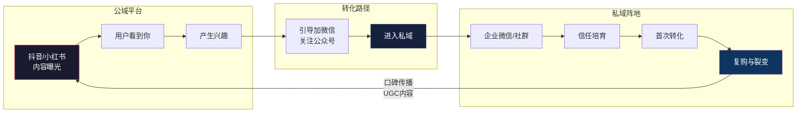
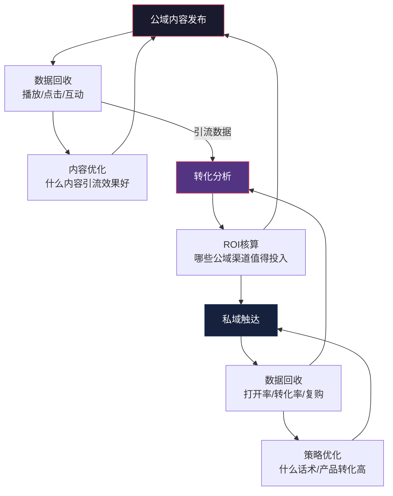
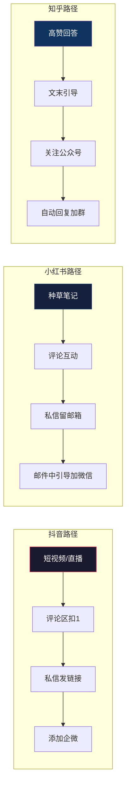
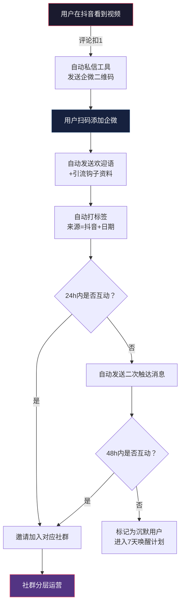

## 七、私域流量与公域流量的协同

### 1. 概念解析：公域与私域的本质区别

要理解"协同"，首先要搞清楚公域流量和私域流量各自是什么、为什么需要它们配合。

**公域流量**是指你无法自主控制的流量来源——用户在平台上看到你，是因为平台的算法推荐了你。抖音的推荐页、小红书的发现页、百度的搜索结果、微博的热门话题，这些都属于公域。你在公域里的曝光量完全取决于平台的规则和算法，本质上你是在"租"流量。

**私域流量**是指你可以直接、反复、免费触达的用户池。企业微信里的客户、微信群里的成员、公众号的关注者、小程序的注册用户、App的下载用户、邮件列表里的订阅者——这些都是私域。你拥有这些用户的联系方式，可以主动发起触达，不需要付费给任何平台。

两者的核心差异可以用一张表说清楚：

| 维度 | 公域流量 | 私域流量 |
|------|----------|----------|
| 所有权 | 平台所有，你不拥有 | 你自己所有 |
| 触达方式 | 被动——等平台推荐 | 主动——你决定何时触达 |
| 单次触达成本 | 高——需要竞价或内容竞争 | 趋近于零 |
| 用户信任度 | 低——用户刚认识你 | 高——已经有过互动 |
| 流量规模 | 大——平台用户池巨大 | 有限——取决于你的积累 |
| 流量稳定性 | 不稳定——算法一变就归零 | 稳定——用户在你的池子里 |
| 数据掌控 | 不完整——平台不给你全量数据 | 完整——你记录每一步互动 |
| 适合阶段 | 拉新获客 | 留存转化复购 |

**为什么不能只做公域？** 一个现实数据：2020年电商行业平均获客成本约50元/人，到2025年已涨至200-500元/人，五年涨了3-10倍。更致命的是，平台算法的不确定性意味着你今天有100万播放量，明天可能只有1000。完全依赖公域，就像在别人的地基上盖房子——房东随时可以赶你走。

**为什么不能只做私域？** 纯靠私域裂变增长是有天花板的。一个微信群从200人裂变到2000人已经很难，从2000人裂变到20000人几乎不可能。没有公域的持续注入，私域池子会慢慢枯竭——用户会流失、沉默、退群，而你没有新用户补充。

**结论：公域是入口，私域是阵地。公域拉新，私域沉淀。两者缺一不可，协同才能形成正循环。**



---

### 2. 核心原理：公私域协同的底层逻辑

#### 2.1 流量漏斗的完整路径

理解公私域协同，需要用AARRR模型来拆解用户的完整旅程：

| 阶段 | 对应环节 | 主战场 | 核心动作 |
|------|----------|--------|----------|
| Acquisition（获取） | 用户发现你 | 公域 | 内容创作、广告投放、SEO |
| Activation（激活） | 用户产生兴趣 | 公域→私域过渡 | 引流钩子、加好友引导 |
| Retention（留存） | 用户留在你的池子里 | 私域 | 社群运营、内容持续输出 |
| Revenue（收入） | 用户付费 | 私域 | 产品销售、会员转化 |
| Referral（推荐） | 用户帮你拉新 | 私域→公域回流 | 裂变活动、口碑传播 |

关键洞察：**前两步主要在公域完成，中间两步主要在私域完成，最后一步把私域的能量反哺回公域**。这就是一个完整的"公域→私域→公域"循环。

#### 2.2 协同的经济学原理

公私域协同的本质是**降低边际获客成本**。

假设你在抖音发布一条短视频，花了3小时制作，获得了10万播放量。如果这10万播放量直接变现（比如挂了商品链接），你获得了一次性收入。但如果在这10万播放量中，有500人加了你的微信进入了私域池——这500人你以后可以反复触达，不用再花一分钱。

算一笔账：
- 短视频制作成本：3小时 × 200元/小时 = 600元
- 不做私域沉淀：600元换来一次性曝光，下次还要再花600元
- 做私域沉淀：600元换来10万曝光 + 500个可反复触达的私域用户
- 这500个用户如果后续转化率10%，客单价200元，就是10000元收入
- 单个获客成本从公域的600元/10万播放=0.006元/播放，变成了1.2元/私域用户
- 但这1.2元/用户的后续价值远高于公域的一次性曝光

**公域的价值不是直接变现，而是"拉新+筛选"；私域的价值不是"获取流量"，而是"培育信任+持续变现"。两者配合，才是效率最优解。**

#### 2.3 协同的数据闭环

真正高效的公私域协同，是一个数据驱动的闭环系统：



这个闭环的核心指标：

| 环节 | 关键指标 | 健康基准值 | 说明 |
|------|----------|------------|------|
| 公域曝光 | 曝光量、互动率 | 互动率>3% | 内容是否能吸引注意力 |
| 引流转化 | 引流率（加粉/曝光） | >1% | 公域用户是否愿意进入私域 |
| 私域激活 | 48小时互动率 | >40% | 新用户是否活跃 |
| 私域转化 | 付费转化率 | >5% | 私域用户是否付费 |
| 复购裂变 | 复购率、NPS | 复购>30% | 用户是否持续贡献价值 |

---

### 3. 六大公域平台的私域引流策略

不同公域平台的流量属性和引流方式差异巨大。以下是主流平台的协同策略详解。

#### 3.1 抖音/快手：短视频+直播引流

**平台特性**：算法推荐为主，内容爆发力强，用户注意力短（平均3-5秒决定是否看完）。抖音用户日均使用120分钟，但单次浏览速度快，适合"钩子型"内容。

**引流路径**：

```text
短视频/直播 → 评论区/私信引导 → 企业微信/个人微信 → 社群
```

**具体操作**：
1. **主页引流**：抖音主页简介留企业微信或公众号名称（注意不能直接放微信号，会被限流）。用"私信领取XX资料"作为钩子。
2. **评论区引导**：在自己视频的评论区置顶"想要完整版的扣1，私信发你"——用免费资源钩子引导用户主动私信。
3. **直播引流**：直播间用"加粉丝群领福利"引导进入抖音粉丝群，再从粉丝群引导加微信。直播间引流效率是短视频的3-5倍，因为用户已经跟你互动了30分钟以上，信任度更高。
4. **引流钩子设计**：不要用"加我微信"这种生硬话术，要用高价值内容做钩子。例如：
   - 知识类：免费电子书、行业报告、工具清单
   - 电商类：专属优惠券、新品试用、会员价
   - 服务类：免费咨询、诊断、方案模板

**数据参考**：一条10万播放的抖音短视频，如果引流钩子设计得当，通常可以带来200-500个微信好友添加。直播间的引流效率更高——一场1000人在线的直播，通常能引导100-200人加微信。

#### 3.2 小红书：种草+搜索引流

**平台特性**：女性用户占比70%+，消费决策型平台，搜索流量占比高达60%。用户带着"找解决方案"的心态来，天然适合引流。

**引流路径**：

```text
笔记种草/搜索 → 评论区互动 → 私信引导 → 微信/公众号
```

**具体操作**：
1. **搜索优化**：在笔记标题和正文中布局目标关键词，抢占搜索流量。例如做护肤社群，就要布局"敏感肌护肤""油皮护肤方案"等长尾词。
2. **评论区截流**：在自己的笔记评论区回复"详细方法在主页"，引导用户去看主页的引流信息。
3. **私信引流**：小红书允许私信中发送联系方式（但不能频繁，否则会被限制）。用"留邮箱发你完整资料"比"加我微信"更安全。
4. **矩阵账号**：用不同角度的账号发布内容，扩大公域覆盖面，所有账号的流量最终导入同一个私域池。

**注意事项**：小红书对引流管控较严，直接在笔记中放微信号会被限流甚至封号。建议用"小号矩阵+评论区+私信"组合的方式引流，不要在单条笔记中硬塞联系方式。

#### 3.3 微信公众号/视频号：生态内引流

**平台特性**：微信生态内的内容平台，与私域天然打通。视频号是微信官方重点扶持的短视频入口，2024-2025年增长迅速。

**引流路径**：

```text
公众号文章/视频号内容 → 关注 → 个人号/企微/社群
```

**具体操作**：
1. **公众号引流**：文末放二维码（个人微信或企微活码），用"回复关键词领取XX"引导用户进入私域。公众号菜单栏设置"加入社群"入口。
2. **视频号引流**：视频号主页可以绑定企业微信，用户点击即可添加。直播间挂"加企微领福利"的链接。视频号与公众号互相导流——视频号内容可以挂公众号文章链接，公众号文章可以嵌入视频号内容。
3. **朋友圈引流**：发布高价值内容到朋友圈，引导好友转发——这是微信生态内成本最低的公域→私域路径。

**优势**：微信生态内的引流路径最短——用户不需要离开微信就能从公域（视频号/公众号）进入私域（个人号/社群），每多一步跳转都会流失50%以上的用户。

#### 3.4 知乎：长尾搜索引流

**平台特性**：高质量问答社区，搜索权重高，内容长尾效应强。一篇高赞回答可以持续带来流量数月甚至数年。

**引流路径**：

```text
回答高赞问题 → 文末引流 → 公众号/个人微信
```

**具体操作**：
1. **选题策略**：找高搜索量、低竞争的问题去回答。用知乎的搜索建议和"热门问题"来选题。
2. **内容策略**：写2000字以上的深度回答，结构化排版，用数据和案例支撑。知乎用户偏好"专业、有深度"的内容。
3. **引流设计**：在回答末尾放"如果觉得有帮助，可以关注我的公众号XXX，回复'XX'领取完整资料"。知乎允许在个人简介中放公众号名称。
4. **长期维护**：定期更新高赞回答，保持排名。知乎的搜索流量是所有公域平台中最稳定的——一条好回答可以持续引流2-3年。

#### 3.5 B站：深度内容引流

**平台特性**：Z世代聚集地，中长视频为主，用户粘性极高（日均使用96分钟）。B站用户对"干货型"内容接受度高，适合知识类、技能类引流。

**引流路径**：

```text
视频内容 → 评论区/简介引导 → 公众号/微信/QQ群
```

**具体操作**：
1. **内容策略**：B站用户喜欢"有料、有趣"的内容。10-20分钟的深度讲解视频效果最好，完播率和互动率都高于短视频。
2. **引流位置**：视频简介中放联系方式，评论区置顶引流信息，视频结尾口播引导。B站对引流相对宽松。
3. **粉丝群引流**：B站有"粉丝群"功能，可以先引导用户加入B站粉丝群，再逐步导入微信群。

#### 3.6 各平台引流效率对比

| 平台 | 流量类型 | 引流难度 | 流量质量 | 长尾效应 | 最适合 |
|------|----------|----------|----------|----------|--------|
| 抖音 | 推荐流量 | 中 | 中 | 低 | 爆款引流、直播引流 |
| 小红书 | 搜索+推荐 | 高 | 高 | 中 | 种草型产品、女性用户 |
| 视频号 | 社交推荐 | 低 | 高 | 中 | 微信生态用户、中老年 |
| 知乎 | 搜索流量 | 中 | 极高 | 极高 | 知识类、B2B |
| B站 | 推荐+搜索 | 中 | 高 | 高 | Z世代、深度内容 |
| 公众号 | 搜索+社交 | 高 | 极高 | 高 | 内容深度沉淀 |

---

### 4. 协同实操：从公域到私域的四步法

#### 4.1 第一步：确定引流钩子

引流钩子是用户从公域进入私域的"理由"。没有好的钩子，用户看完内容就走了，不会主动加你。

**好的引流钩子必须满足三个条件**：
1. **高感知价值**：用户觉得"这个东西值得我去加个微信"
2. **低获取门槛**：只需要加微信/关注公众号就能获得，不需要付费
3. **与主业相关**：钩子吸引来的人就是你的目标客户，不是薅羊毛的

**不同行业的引流钩子设计**：

| 行业 | 引流钩子示例 | 获取方式 |
|------|------------|----------|
| 知识付费 | 行业报告PDF、免费试听课 | 加企微发送 |
| 电商 | 专属优惠券、新品试用装 | 入群领取 |
| 美妆护肤 | 肤质诊断+定制方案 | 私信回复关键词 |
| 教育培训 | 免费测评、学习资料包 | 关注公众号获取 |
| 本地生活 | 到店优惠券、免费体验 | 扫码入群 |
| B2B服务 | 行业白皮书、案例集 | 留邮箱发送 |
| 自媒体 | 合集、模板、工具包 | 加微信领取 |

**钩子迭代**：引流钩子不是一成不变的。要定期测试不同钩子的引流效果，保留转化率高的，淘汰效果差的。建议每2-4周测试一个新钩子。

#### 4.2 第二步：设计引流路径

引流路径越短，转化率越高。每多一步操作，用户流失率增加30-50%。

**最佳路径设计原则**：
- 路径不超过3步（看到内容→点击引导→添加微信）
- 不需要用户跳出当前App（抖音内跳企微比跳微信转化率高）
- 给用户明确的下一步动作指引

**各平台最优引流路径**：



**关键细节**：
- 抖音私信一天只能主动发给未关注用户有限条数，建议用"用户主动私信你"的模式——在视频中说"想要XX的扣1"，用户扣1后你再私信。
- 小红书引流到微信，中间多一步"留邮箱"比直接放微信号更安全，虽然路径长了一步，但不会被封号。
- 知乎→公众号→微信，是路径最长但质量最高的链路——能走完这三步的用户，都是高度精准的潜在客户。

#### 4.3 第三步：私域承接与激活

用户加了微信只是开始，如果48小时内没有有效互动，50%以上的用户会进入沉默状态。

**新用户承接SOP（标准操作流程）**：

```text
第0分钟：自动发送欢迎语 + 资料/福利
  "欢迎加入！这是你要的XX资料，点击领取→[链接]"
  "我是XX，专注XX领域X年，有任何问题随时找我~"

第1小时：查看用户朋友圈，了解用户画像
  备注用户信息：来源平台、兴趣点、标签

第24小时：主动发送一条高价值内容
  "昨天分享的资料看完了吗？这里还有一个更实用的→[内容]"

第48小时：邀请进入社群
  "我们有一个XX交流群，里面经常分享XX，要不要加入？"

第7天：私聊确认需求，推荐合适的产品/服务
  "最近在忙什么？有没有XX方面的困惑？"
```

**新用户标签体系**：

| 标签维度 | 标签示例 | 用途 |
|----------|----------|------|
| 来源渠道 | 抖音-短视频、小红书-笔记A | 分析各渠道引流效果 |
| 兴趣领域 | 护肤、穿搭、理财 | 精准内容推送 |
| 付费意向 | 高/中/低 | 优先转化高意向用户 |
| 活跃程度 | 活跃/一般/沉默 | 差异化运营策略 |
| 生命周期 | 新用户/老用户/流失风险 | 及时干预 |

#### 4.4 第四步：私域反哺公域

这是很多运营者忽略的环节——私域用户不仅是你的客户，也是你在公域的"放大器"。

**私域反哺公域的方式**：
1. **UGC内容生产**：鼓励社群成员在公域平台发布使用体验、好评内容，这些内容本身就是新的公域流量入口。
2. **社交传播**：社群成员把你的内容分享到朋友圈、微信群——每一次分享都是一次免费的公域曝光。
3. **互动数据**：引导私域用户去公域平台给你点赞、评论、收藏——这些互动数据会提升你的内容在算法中的权重，获得更多推荐。
4. **口碑裂变**：满意的私域用户会主动推荐给朋友，这些新用户又会进入你的公域曝光→私域沉淀循环。
5. **内容共创**：从社群中收集用户问题和需求，作为公域内容的选题来源——这些内容更容易引发共鸣，获得更好的公域表现。

**裂变活动设计**：

裂变是私域反哺公域最直接的方式。一个好的裂变活动可以让现有用户帮你拉来新用户。

| 裂变方式 | 机制 | 适用场景 | 预期倍数 |
|----------|------|----------|----------|
| 任务宝裂变 | 邀请N人关注公众号，解锁福利 | 公众号涨粉 | 1变3-5 |
| 群裂变 | 扫码入群，群满XX人开福利 | 社群扩容 | 1变5-10 |
| 分销裂变 | 推荐购买获得佣金 | 课程/产品销售 | 1变2-3 |
| 拼团裂变 | N人拼团享折扣 | 电商产品 | 1变2-4 |
| 打卡裂变 | 连续打卡分享领奖励 | 习惯养成类社群 | 1变2-3 |

---

### 5. 关键指标体系

公私域协同的效果需要用数据来衡量。以下是完整的指标体系：

#### 5.1 公域端指标

| 指标 | 计算方式 | 健康值 | 说明 |
|------|----------|--------|------|
| 内容曝光量 | 平台统计 | 因平台而异 | 你的内容被多少人看到 |
| 互动率 | (点赞+评论+分享)/曝光 | >3% | 内容吸引力 |
| 引流率 | 进入私域人数/曝光量 | >1% | 公域→私域的转化效率 |
| 单粉获客成本 | 投入费用/新增私域用户数 | <5元 | 引流的经济性 |

#### 5.2 私域端指标

| 指标 | 计算方式 | 健康值 | 说明 |
|------|----------|--------|------|
| 新用户48h互动率 | 48h内有互动的新用户/总新用户 | >40% | 承接质量 |
| 社群活跃率 | 日活跃人数/群总人数 | >20% | 社群健康度 |
| 私域转化率 | 付费用户数/私域总用户数 | >5% | 变现能力 |
| 客单价 | 总收入/付费用户数 | 因行业而异 | 单次消费金额 |
| 复购率 | 二次购买人数/首次购买人数 | >30% | 用户忠诚度 |
| 用户LTV | 客户终身价值 | >获客成本3倍 | 长期商业价值 |

#### 5.3 协同效率指标

| 指标 | 计算方式 | 说明 |
|------|----------|------|
| 公域→私域转化率 | 新增私域用户/公域总触达 | 引流效率 |
| 私域→公域反哺率 | 裂变带来的新公域曝光/总曝光 | 裂变效果 |
| 全链路ROI | 总收入/(公域投入+私域运营成本) | 整体盈利能力 |
| 协同倍数 | 有私域的LTV/无私域的LTV | 私域带来的价值放大倍数 |

---

### 6. 不同阶段的协同策略

#### 6.1 冷启动期（0-1000人）

**核心目标**：验证引流模型，找到稳定的公域流量来源。

**策略**：
- 选择1-2个公域平台深耕，不要贪多
- 每天发1条内容，测试什么内容能带来引流
- 手动添加每一个新用户，亲自聊天了解需求
- 不急着变现，先把1000个种子用户服务好

**关键动作**：
- 每条内容都带引流钩子
- 每个新用户都打标签
- 记录每条内容的引流数据
- 每周复盘：哪个平台、什么内容引流效果最好

#### 6.2 成长期（1000-10000人）

**核心目标**：扩大引流规模，建立标准化运营体系。

**策略**：
- 在已验证的公域平台加大投入
- 增加到2-3个公域平台，扩大流量入口
- 建立内容SOP，提升内容产出效率
- 开始做裂变活动，让老用户帮你拉新

**关键动作**：
- 组建内容团队或使用工具提效
- 设计标准的新用户承接流程
- 开始A/B测试不同引流钩子
- 建立社群分层运营体系

#### 6.3 成熟期（10000人以上）

**核心目标**：优化转化效率，建立自增长飞轮。

**策略**：
- 优化全链路转化率，而不是一味追求流量
- 私域反哺公域——让老用户成为你的"自来水"
- 建立品牌，降低对单一平台的依赖
- 数据驱动决策，精细化运营

**关键动作**：
- 搭建数据分析体系，监控全链路指标
- 优化用户LTV，提升复购和客单价
- 建立分销/代理体系，让用户帮你卖
- 跨平台内容矩阵，分散风险

---

### 7. 常见误区与纠正

#### 误区一：只关注公域粉丝数，不关注私域沉淀

**错误表现**：拼命追求抖音10万粉丝、小红书5万关注，但从不引导用户进入私域。

**后果**：平台算法一调整，流量断崖式下跌，之前积累的粉丝毫无价值。

**纠正**：公域粉丝数只是"虚荣指标"，私域用户数才是"资产指标"。每100个公域粉丝，至少应该有5-10个沉淀到私域。

#### 误区二：引流话术太硬，用户反感

**错误表现**：每条内容末尾都加"加我微信XXXX"，评论区刷屏式引导。

**后果**：平台限流、用户反感、甚至被封号。

**纠正**：引流的核心是"提供价值"，不是"求人加你"。用高价值的免费内容/工具/资料做钩子，让用户主动来找你。

#### 误区三：进入私域后就疯狂推销

**错误表现**：用户刚加微信，就连续发产品广告、促销信息。

**后果**：用户立刻删除好友或退群，前期引流投入全部浪费。

**纠正**：私域运营的核心是"先提供价值，再谈转化"。新用户至少需要7-14天的信任培育期，才能开始推荐产品。

#### 误区四：所有平台用同一套内容

**错误表现**：把抖音的视频直接搬到小红书、B站、知乎。

**后果**：每个平台的用户属性和内容偏好不同，同一条内容在不同平台的表现天差地别。

**纠正**：内容主题可以复用，但形式必须适配平台。抖音要短平快，小红书要精致种草，知乎要深度分析，B站要有料有趣。

#### 误区五：只做引流不做承接

**错误表现**：花了大量精力在公域做内容引流，但用户加了微信后没有任何互动。

**后果**：用户加完微信就沉默，白白浪费了引流成本。

**纠正**：引流和承接是1:1的关系——花多少精力拉新用户，就要花同等精力做好新用户承接。前面4.3节的新用户承接SOP就是标准答案。

#### 误区六：私域和公域内容完全割裂

**错误表现**：公域发的内容和私域推的内容毫无关联，用户感觉割裂。

**后果**：用户从公域被A主题吸引进来，在私域看到的却是B主题，信任感瞬间崩塌。

**纠正**：公域和私域的内容应该是一体的。公域是"预告片"，私域是"完整版"。用户在公域看到的内容，应该在私域得到更深度的延伸。

---

### 8. 进阶：构建公私域协同的自动化体系

#### 8.1 自动化工具栈

当私域用户规模超过5000人，手动运营效率会急剧下降，需要借助工具实现自动化。

| 环节 | 推荐工具 | 功能 |
|------|----------|------|
| 公域内容管理 | 飞瓜数据、蝉妈妈 | 各平台内容数据监控 |
| 引流链路 | 企微活码、草料二维码 | 渠道追踪、自动打标签 |
| 用户承接 | 企微自动欢迎语、wetool | 自动化新用户SOP |
| 社群运营 | 群勾搭、微伴助手 | 群管理、自动回复 |
| 数据分析 | 神策、GrowingIO | 用户行为分析、漏斗分析 |
| 裂变工具 | 零一裂变、爆汁裂变 | 任务宝、群裂变活动 |

#### 8.2 自动化引流流程示例



#### 8.3 数据驱动的协同优化

建立一个公私域协同的数据看板，定期监控和优化：

**周度复盘清单**：
- 各公域平台本周引流数据（曝光→引流率）
- 本周新增私域用户数及来源分布
- 新用户48h互动率
- 本周私域转化数据（付费人数、金额）
- 各引流钩子的效果对比
- 裂变活动的参与率和拉新数

**月度优化方向**：
- 哪个公域平台ROI最高？是否加大投入？
- 哪个引流钩子转化率最高？是否复制到其他平台？
- 新用户承接流程是否有瓶颈？哪个环节流失最大？
- 私域转化率是否达标？产品/话术是否需要调整？
- 裂变系数是否健康？是否需要设计新的裂变活动？

---

### 9. 典型场景的协同方案

#### 9.1 个人知识IP的公私域协同

**公域策略**：在知乎写深度回答建立专业形象，在B站发教程视频吸引粉丝，在小红书发干货笔记做种草。

**私域策略**：用"免费资料包"引流到微信，建立付费社群/知识星球，定期做直播答疑。

**协同核心**：公域内容建立信任→私域提供深度服务→付费用户成为口碑传播者→口碑带来新的公域流量。

#### 9.2 电商卖家的公私域协同

**公域策略**：抖音直播带货获取新客户，小红书种草笔记吸引目标人群。

**私域策略**：包裹卡引导加微信，老客户群发新品信息，VIP群提供专属折扣。

**协同核心**：公域卖货→包裹卡引流→私域复购→老客户晒单→UGC内容反哺公域。

#### 9.3 本地商家的公私域协同

**公域策略**：大众点评/美团做好评价管理，抖音本地生活发布探店内容，小红书发布到店打卡笔记。

**私域策略**：到店客户扫码加微信领优惠，建立门店社群定期发福利，朋友圈发布日常动态。

**协同核心**：公域吸引周边流量→到店消费→扫码入群→社群复购→老客户带新客户到店。

---

### 10. 本节核心要点

1. **公域是入口，私域是阵地**：公域负责拉新获客，私域负责留存转化，两者缺一不可
2. **协同的本质是降低边际获客成本**：把公域的一次性流量变成私域的可反复触达资产
3. **引流钩子是协同的关键**：没有好的钩子，公域流量无法导入私域
4. **路径越短转化越高**：每多一步操作，流失率增加30-50%
5. **承接和引流同等重要**：新用户48小时内的互动决定了后续的留存和转化
6. **私域可以反哺公域**：老用户的UGC、分享、互动是免费的公域流量放大器
7. **数据驱动持续优化**：建立全链路数据看板，定期复盘各环节效率
8. **不同阶段策略不同**：冷启动重验证、成长期重规模、成熟期重效率
