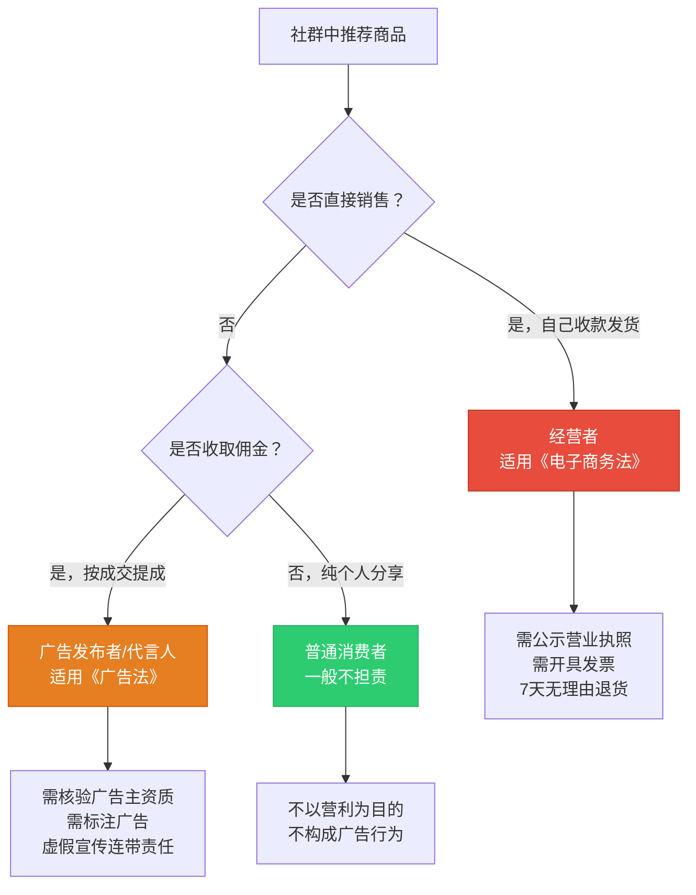
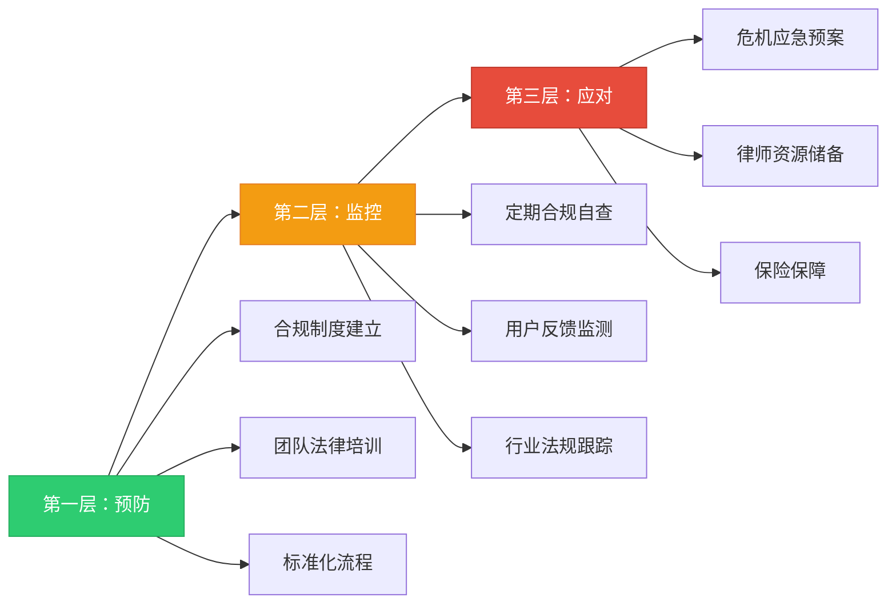

## 八、社群运营的法律法规

### 1. 为什么社群运营者必须懂法

很多社群运营者存在一个危险的认知盲区：**"我只是建了个微信群，又不是开公司，跟法律有什么关系？"**

事实恰恰相反。社群运营涉及的法律风险比传统商业模式更隐蔽、更集中：

- **触达半径大**：一条群消息同时触达数百上千人，一旦内容违规，影响面呈几何级放大
- **证据链完整**：聊天记录、转账截图、小程序操作日志全部自动留存，事后取证极为便利
- **主体认定灵活**：即使是个人名义运营，法院也会根据实际控制关系认定经营主体
- **监管持续收紧**：2021-2026年间，中国针对私域营销、社群电商、知识付费领域的法规密集出台

用一张图来看社群运营涉及的法律领域全景：

```mermaid
graph TD
    A["社群运营法律风险全景"] --> B["数据与隐私"]
    A --> C["广告与营销"]
    A --> D["电商与分销"]
    A --> E["知识产权"]
    A --> F["财税合规"]
    A --> G["消费者权益"]
    A --> H["内容安全"]

    B --> B1["《个人信息保护法》"]
    B --> B2["《数据安全法》"]
    B --> B3["《网络安全法》"]

    C --> C1["《广告法》"]
    C --> C2["《反不正当竞争法》"]
    C --> C3["《互联网广告管理办法》"]

    D --> D1["《电子商务法》"]
    D --> D2["《禁止传销条例》"]
    D --> D3["《网络交易监督管理办法》"]

    E --> E1["《著作权法》"]
    E --> E2["《商标法》"]
    E --> E3["《专利法》"]

    F --> F1["《税收征收管理法》"]
    F --> F2["《个人所得税法》"]
    F --> F3["《发票管理办法》"]

    G --> G1["《消费者权益保护法》"]
    G --> G2["《食品安全法》"]
    G --> G3["《产品质量法》"]

    H --> H1["《网络安全法》内容治理"]
    H --> H2["《互联网信息服务管理办法》"]
    H --> H3["《网络信息内容生态治理规定》"]

    style A fill:#e74c3c,stroke:#c0392b,color:#fff
    style B fill:#3498db,stroke:#2980b9,color:#fff
    style C fill:#e67e22,stroke:#d35400,color:#fff
    style D fill:#2ecc71,stroke:#27ae60,color:#fff
    style E fill:#9b59b6,stroke:#8e44ad,color:#fff
    style F fill:#f39c12,stroke:#e67e22,color:#fff
    style G fill:#1abc9c,stroke:#16a085,color:#fff
    style H fill:#e74c3c,stroke:#c0392b,color:#fff
```



**一个关键原则：合规不是成本，是护城河。** 在私域领域，大量竞争对手因为不合规被处罚、被封号、被用户起诉，而合规运营者反而获得了更强的用户信任和更持久的商业生命。

***

### 2. 数据隐私与个人信息保护

这是社群运营者面临的**第一大法律风险区**。社群运营天然涉及大量用户个人信息的收集、存储、使用和分享。

#### 2.1 核心法律框架

| 法律法规 | 生效时间 | 核心要求 | 对社群运营的影响 |
|---------|---------|---------|----------------|
| 《个人信息保护法》 | 2021.11.1 | 收集个人信息需取得用户同意，遵循最小必要原则 | 收集用户手机号、姓名、地址等必须明示告知并取得同意 |
| 《数据安全法》 | 2021.09.1 | 建立数据安全管理制度，重要数据需评估 | 社群用户数据达到一定规模需做数据安全评估 |
| 《网络安全法》 | 2017.06.01 | 网络运营者需保护用户信息安全 | 搭建小程序、网站等需做等保备案 |
| 《民法典》人格权编 | 2021.01.01 | 保护隐私权和个人信息 | 不得非法买卖、提供或公开他人个人信息 |

#### 2.2 社群运营中的典型合规场景

**场景一：用户入群时的信息收集**

很多社群在用户入群时要求填写姓名、手机号、职业、收入等信息。合规做法：

```text
✅ 合规做法：
1. 告知收集目的："为更好地匹配社群资源，我们收集以下信息"
2. 明确告知范围：只收集与社群服务直接相关的信息
3. 提供拒绝选项：用户可以选择不填写部分信息
4. 告知存储期限："您的信息将在会员期内存储，退群后30天内删除"

❌ 违规做法：
1. 强制收集与服务无关的信息（如身份证号、银行卡号）
2. 未告知收集目的就直接采集
3. 将用户信息共享给第三方但未告知
4. 用户退群后仍长期保留其个人信息
```

**场景二：社群内的用户互动数据**

社群运营者通过后台可以查看成员的发言频率、活跃时段、互动偏好等数据。这些行为数据同样受法律保护：

- **聚合分析**（统计"本周活跃人数为85%"）：合规，属于匿名化统计
- **个人画像**（记录"张三每周二晚上最活跃"）：需告知用户，属于个人信息处理
- **数据转卖**（将用户行为数据出售给第三方）：严重违规，涉嫌侵犯公民个人信息罪

**场景三：企业微信与个人微信的选择**

企业微信在数据合规方面有天然优势：

| 维度 | 个人微信 | 企业微信 |
|------|---------|---------|
| 数据归属 | 争议较多，微信主张平台权利 | 企业拥有客户数据控制权 |
| 员工离职 | 客户关系可能随员工流失 | 客户关系可继承转移 |
| 合规审计 | 无法进行 | 支持操作日志、审计追踪 |
| 用户知情 | 隐性风险 | 企业身份明确告知 |
| 数据导出 | 受限 | 支持合规导出 |

**实务建议**：当社群规模超过200人或涉及付费会员时，建议切换到企业微信。这不是技术选择，而是合规选择。

#### 2.3 用户数据保护实操清单

```text
□ 制定《隐私政策》，明确告知用户数据收集范围、用途、存储方式
□ 入群时取得用户的明示同意（勾选/签字/确认消息）
□ 建立数据分类分级制度（公开信息/内部信息/敏感信息）
□ 敏感数据加密存储（手机号脱敏：138****1234）
□ 定期清理过期数据（退群用户数据30天内删除）
□ 限制数据访问权限（群管理员≠数据管理员）
□ 发生数据泄露时72小时内通知用户并向主管部门报告
□ 涉及跨境数据传输时需做安全评估
```

***

### 3. 广告与营销合规

社群是天然的营销阵地，但也是广告违规的高发区。

#### 3.1 社群营销中的广告法红线

**《广告法》核心禁令在社群场景中的映射：**

| 广告法禁令 | 社群中的典型违规 | 法律后果 |
|-----------|----------------|---------|
| 禁止使用"国家级""最高级""最佳"等绝对化用语 | "全网最好的社群""行业第一""最全面的课程" | 罚款20万-100万 |
| 禁止虚假或引人误解的内容 | "加入社群保证月入过万""学完课程收入翻10倍" | 罚款+吊销执照 |
| 禁止利用科研/学术/行业协会推荐 | "经XX研究院认证""XX协会推荐" | 罚款+消除影响 |
| 医疗/药品/保健品广告需前置审批 | "加入社群调理身体""学习这套方法治疗失眠" | 可能构成非法行医 |
| 教育培训广告不得暗示保证性承诺 | "报名即保过""学不会全额退款"（但实际不退） | 罚款+退一赔三 |

**2023年修订的《互联网广告管理办法》特别关注私域场景：**

- 通过即时通讯工具（微信、QQ群）发送的营销信息，构成"互联网广告"
- 社群运营者如果在群里推广第三方产品并收取佣金，属于"广告发布者"
- 广告发布者需核验广告主的身份信息和广告内容的真实性

#### 3.2 社群推荐/带货的合规框架

在社群中推荐产品或服务时，需要区分三种法律身份：



**关键区分：个人分享 vs 广告行为**

```text
个人分享（一般不担责）：
"我自己用了这款面霜，感觉还不错，大家感兴趣的可以试试"
→ 没有收取费用，没有利益关系，纯主观体验

广告行为（需合规）：
"这款面霜是我合作的品牌方产品，原价299，群友专属价199，
 点链接购买我还赚20%佣金"
→ 存在商业利益关系，需标注为广告，需核验品牌方资质
```

#### 3.3 社群话术的合规改写对照表

| 违规话术 | 合规改写 | 法律依据 |
|---------|---------|---------|
| "保证月入10万" | "部分学员通过系统学习实现了收入提升" | 禁止暗示保证性承诺 |
| "全网最低价" | "群友专享优惠价" | 禁止绝对化用语 |
| "纯天然无副作用" | "成分来源于天然植物提取" | 禁止暗示绝对安全性 |
| "央视推荐" | "曾被XX媒体采访报道" | 需有授权且不得暗示官方背书 |
| "学了就能赚钱" | "课程提供系统方法论，实际效果因人而异" | 禁止虚假承诺 |
| "转发朋友圈免费送" | "分享活动页面可领取优惠" | 裂变营销需合规 |

***

### 4. 分销与传销的法律边界

这是社群运营中最危险的法律雷区。很多社群电商、知识付费的分销模式，一不小心就会踩到传销的红线。

#### 4.1 传销的法律定义与判定标准

根据《禁止传销条例》第七条，以下三种行为构成传销：

```text
① 拉人头：组织者通过发展人员，要求被发展人员发展其他人员加入，
   对发展的人员以其直接或间接滚动发展的人员数量为依据计算和
   给付报酬。

② 入门费：组织者通过发展人员，要求被发展人员交纳费用或者以
   认购商品等方式变相交纳费用，取得加入或者发展其他人员加入
   的资格。

③ 团队计酬：组织者通过发展人员，要求被发展人员发展其他人员
   加入，形成上下线关系，并以下线的销售业绩为依据计算和给付
   上线报酬。
```

**判定传销的三个核心要素（同时满足即构成传销）：**

| 要素 | 合法分销 | 传销 |
|------|---------|------|
| 入门费 | 无需缴费或仅需合理消费即可成为分销员 | 必须缴纳高额入门费或购买高价产品才能加入 |
| 层级关系 | 最多两级（A→B→C），超过两级违法 | 多层级，通常3级以上，层层抽佣 |
| 计酬方式 | 以实际商品销售为依据 | 以发展下线人数为依据，与实际销售脱钩 |

#### 4.2 社群分销的合规红线

**最常见的违法模式——三级以上分销：**

```text
❌ 违法模式（三级分销）：
你 → 邀请A → A邀请B → B邀请C
你赚A的佣金 + 赚B的佣金 + 赚C的佣金
= 三级及以上分销 = 涉嫌传销

✅ 合法模式（两级分销）：
你 → 邀请A → A邀请B
你赚A的佣金 + 赚B的佣金
= 两级分销 = 合法（前提是佣金来源是真实商品销售）
```

**关键提醒：** 2022年后，多地法院对"两级分销"的认定也在收紧。即使只有两级，如果计酬方式主要靠"拉人头"而非"卖商品"，仍可能被认定为传销。

#### 4.3 社群常见商业模式的法律风险评估

| 商业模式 | 风险等级 | 关键风险点 | 合规建议 |
|---------|---------|-----------|---------|
| 付费会员制 | 🟢 低 | 收费需有对应服务交付 | 明确会员权益，保证服务质量 |
| 课程分销（两级） | 🟡 中 | 需确保是真实商品销售 | 以课程销售为核心，不以拉人为核心 |
| 社群团购 | 🟡 中 | 食品/特殊商品需相应资质 | 确保商品质量，保留进货凭证 |
| 多级分销返利 | 🔴 高 | 超过两级即涉嫌传销 | 严格控制在两级以内 |
| "消费全返"模式 | 🔴 极高 | 涉嫌非法集资 | 强烈建议不参与 |
| 区块链/数字货币社群 | 🔴 极高 | 涉嫌非法集资或诈骗 | 涉及代币发行的全部违法 |

#### 4.4 合法分销体系设计模板

```text
一个合规的社群分销体系应包含以下要素：

1. 分销员准入
   □ 无需缴纳高额入门费（合理消费门槛可接受）
   □ 有真实的商品或服务作为基础
   □ 签署正式的分销合作协议

2. 佣金结构
   □ 严格控制在两级以内
   □ 佣金来源于实际商品销售利润
   □ 佣金比例合理（建议一级15-30%，二级5-15%）
   □ 佣金不与下线人数挂钩

3. 商品管理
   □ 有真实的商品或服务交付
   □ 商品质量有保障，有退换货机制
   □ 定价合理，不是为了做分销而虚标价格

4. 合规文件
   □ 营业执照（个体工商户即可）
   □ 分销合作协议
   □ 佣金结算规则公示
   □ 纳税申报
```

***

### 5. 消费者权益保护

社群运营一旦涉及商品销售或付费服务，就必须遵守消费者权益保护的全部规定。

#### 5.1 社群电商的消费者权益义务

**《消费者权益保护法》核心条款在社群中的应用：**

| 条款 | 要求 | 社群运营中的落实 |
|------|------|----------------|
| 第8条 知情权 | 消费者有权了解商品/服务的真实情况 | 群内推荐商品需提供完整的产品信息，不得隐瞒缺陷 |
| 第20条 信息披露 | 经营者需明码标价 | 群内团购需明确标示价格、运费、退换货条件 |
| 第25条 七天无理由退货 | 网购商品7天无理由退货 | 社群电商同样适用，需在群规中明确 |
| 第44条 网络交易平台责任 | 平台需保障消费者权益 | 社群运营者作为"交易平台"需承担相应责任 |
| 第55条 欺诈赔偿 | 消费欺诈退一赔三 | 群内虚假宣传同样适用退一赔三 |

#### 5.2 七天无理由退货的社群适用场景

很多社群运营者认为"社群内销售不适用七天无理由退货"，这是错误的：

```text
适用七天无理由退货的社群场景：
✅ 群内小程序商城购买的商品
✅ 通过群链接跳转到电商平台购买的商品
✅ 群主/管理员直接收款发货的商品
✅ 知识付费课程（未开始学习的情况下）

不适用七天无理由退货的例外：
❌ 定制化商品（如定制T恤、个人专属方案）
❌ 鲜活易腐商品（如水果、鲜花）
❌ 数字商品且已交付（如已开通的会员权益、已播放的课程）
❌ 服务已开始提供（如已参加的线下活动、已进行的1对1咨询）

⚠️ 灰色地带：
- 社群会员费：如果会员权益已部分交付，退款金额应按比例计算
- 拼团商品：参团后取消需遵循团规，但不能完全拒绝退款
```

#### 5.3 知识付费服务的退款争议处理

知识付费是社群变现的主要方式之一，退款纠纷也最为高发。以下是一套合规的退款处理框架：

```text
退款分级处理标准：

第一级——全额退款（0-7天，未开始使用）：
- 用户购买后未登录/未观看/未使用
- 合规做法：7天内无条件全额退款

第二级——按比例退款（7-30天，部分使用）：
- 用户已观看部分课程或使用部分权益
- 合规做法：按未使用部分的比例退款
- 计算公式：退款金额 = 实付金额 × (1 - 已使用天数/总服务天数)

第三级——协商退款（30天以上）：
- 已使用较长时间但对服务不满意
- 合规做法：由客服协商处理，可退部分款项

第四级——不予退款的合法情形：
- 服务已全部交付完毕
- 用户存在欺诈行为
- 明确标注为"不退款"的限时活动（且该标注合法）
```

***

### 6. 知识产权保护

社群运营涉及的知识产权风险是双向的：既要保护自己的内容不被侵权，也要避免侵犯他人的知识产权。

#### 6.1 社群运营者的知识产权资产

```text
你的社群中，以下内容可能构成受法律保护的知识产权：

1. 著作权（自动获得，无需注册）
   - 原创课程内容（文字、音频、视频）
   - 社群运营方案、话术模板
   - 社群内分享的文章、图片
   - 社群专属的PDF、PPT资料

2. 商标权（需注册）
   - 社群名称/品牌名
   - 社群Logo
   - 课程品牌名

3. 商业秘密（需保密措施）
   - 社群运营方法论
   - 用户数据和画像
   - 定价策略和商业模式
   - 核心课程的未公开内容
```

#### 6.2 社群中的常见侵权行为

| 侵权类型 | 典型场景 | 法律后果 | 防范措施 |
|---------|---------|---------|---------|
| 课程盗录 | 成员录制付费课程并传播 | 赔偿+刑事责任 | 添加水印、防盗录技术、在群规中明确禁止 |
| 文章搬运 | 将社群独家内容搬运到其他平台 | 赔偿+删除 | 原创声明+定期监测+DMCA投诉 |
| 品牌冒用 | 他人冒用你的社群名建群 | 商标侵权诉讼 | 注册商标+举报平台侵权 |
| 素材侵权 | 社群运营中使用未授权的图片/音乐 | 赔偿 | 使用正版素材库 |
| 课程抄袭 | 抄袭他人课程内容作为自己的课程 | 著作权侵权 | 原创为主，引用需标注来源 |

#### 6.3 社群内容的版权保护实操

```text
保护你的社群原创内容的五步法：

第一步：创作即确权
- 所有原创内容保留创作记录（草稿、修改历史、时间戳）
- 课程录制保留原始文件和工程文件
- 重要文档可通过版权局登记（费用低，法律效力强）

第二步：技术保护
- 课程视频添加可见+不可见双重水印
- PDF文档添加用户ID水印
- 使用防录屏技术（如企业微信的课程保护功能）
- 限制课程的下载和分享功能

第三步：合同约束
- 入群协议中明确知识产权归属和使用限制
- 付费课程的用户协议中加入禁止复制、传播条款
- 与团队成员签署保密协议（NDA）

第四步：侵权监测
- 定期在百度、淘宝、闲鱼、拼多多搜索自己的课程名
- 使用版权监测工具（如维权骑士、原创宝）
- 在各平台备案自己的品牌和课程名

第五步：快速维权
- 发现侵权后第一时间截图保全证据
- 向平台发送侵权投诉（各平台都有侵权举报入口）
- 情节严重的委托律师发送律师函
- 必要时提起诉讼（著作权侵权案件法定赔偿500-500万元）
```

***

### 7. 税务合规

这是社群运营者最容易忽视但风险最高的领域之一。微信/支付宝收款不代表"不交税也查不到"——金税四期系统的大数据比你想象的强大得多。

#### 7.1 社群收入的税务分类

| 收入类型 | 税务分类 | 税率 | 申报方式 |
|---------|---------|------|---------|
| 会员费/课程费 | 经营所得/劳务报酬 | 经营所得5%-35%；劳务报酬20%-40% | 按月/按季申报 |
| 分销佣金 | 劳务报酬 | 20%-40%（预扣），年度汇算多退少补 | 平台代扣或自行申报 |
| 广告合作收入 | 经营所得/劳务报酬 | 同上 | 需要开发票 |
| 社群团购利润 | 经营所得 | 5%-35% | 需要记账 |
| 打赏/红包 | 偶然所得/赠与 | 20% | 争议较大，建议合规申报 |

#### 7.2 个体工商户 vs 个人纳税的税负对比

社群规模做大后，注册个体工商户可以显著降低税负：

```text
假设社群年收入50万元：

方案一：以个人名义纳税
- 按劳务报酬预扣：500,000 × (1-20%) × 40% - 7,000 = 153,000元
- 年度汇算综合所得：适用30%税率，约缴税120,000元
- 实际税负率：约24%

方案二：注册个体工商户（查账征收）
- 应纳税所得额 = 500,000 - 成本费用（约200,000）= 300,000元
- 适用税率：20%，速算扣除10,500
- 应缴税款：300,000 × 20% - 10,500 = 49,500元
- 实际税负率：约10%

方案三：注册个体工商户（核定征收）
- 核定利润率10%：应纳税所得额 = 500,000 × 10% = 50,000元
- 适用税率：10%，速算扣除1,500
- 应缴税款：50,000 × 10% - 1,500 = 3,500元
- 实际税负率：约0.7%

⚠️ 注意：核定征收政策收紧，具体需咨询当地税务局
```

#### 7.3 社群运营者的税务合规清单

```text
□ 年收入超过12万元，次年3-6月进行个税年度汇算
□ 社群收入及时申报纳税（不要等到被查才补缴）
□ 保存所有收入和支出的凭证（微信/支付宝账单可导出）
□ 付费服务开具发票（个人可到税务局代开）
□ 规模化后注册个体工商户或公司
□ 与合作方签署正规合同，明确税款承担方
□ 分销佣金需要取得完税证明
□ 不使用个人账户进行大额商业收款（银行会监控报告）
```

**特别警示：** 2024年起，支付宝和微信支付已与税务系统打通。个人年度收款超过一定额度（一般为20万元/年或单笔5万元）会触发税务预警。不要心存侥幸。

***

### 8. 内容安全与信息治理

社群是内容传播的节点，运营者对群内内容负有管理责任。

#### 8.1 社群运营者的内容管理义务

根据《网络信息内容生态治理规定》，社群运营者属于"网络信息内容服务平台"的范畴（在微信群场景中，群主/管理员承担类似责任）：

```text
必须管理的内容类型：

1. 违法信息（必须立即删除+报告）
   - 危害国家安全、泄露国家秘密的信息
   - 煽动民族仇恨、民族歧视的信息
   - 散布谣言、扰乱社会秩序的信息
   - 传播淫秽色情、赌博、暴力的信息
   - 宣扬恐怖主义、极端主义的信息

2. 不良信息（应当管理）
   - 使用夸张标题、内容与标题严重不符的
   - 炒作绯闻、丑闻、劣迹的
   - 不当评述自然灾害、重大事故的
   - 煽动人群歧视、地域歧视的
   - 其他违反公序良俗的内容

3. 群主的管理责任
   - 建立群规，明确禁止上述内容
   - 发现违法信息及时删除
   - 对违规成员进行管理（警告、移出）
   - 严重违法行为需向有关部门报告
```

**真实判例参考：** 2018年，浙江某微信群群主因未及时制止群成员传播淫秽视频，被法院以"传播淫秽物品罪"判处缓刑。群主不是"挂名"，是法律意义上的管理者。

#### 8.2 社群群规的合规模板

一份合规的社群群规应包含以下要素：

```text
《XX社群管理规范》

一、社群定位与宗旨
- 本群定位：[明确社群的主题和目的]
- 核心价值：[社群为成员提供的核心价值]

二、成员权利与义务
- 成员享有：[列出成员权利]
- 成员义务：[列出成员义务]
- 违规处理：[警告→禁言→移出→永久拉黑]

三、内容管理规则
- 禁止发布的内容：[参照法律要求列出]
- 鼓励发布的内容：[正向引导]
- 广告/推广规则：[明确是否允许、允许的时间和方式]

四、知识产权声明
- 群内原创内容的版权归属：[明确]
- 禁止的行为：[录屏、转载、截图外传等]
- 侵权处理：[发现即移出+追究法律责任]

五、隐私保护
- 群成员信息使用范围：[仅用于社群服务]
- 禁止泄露他人隐私：[人肉搜索、曝光个人信息等]

六、退款与纠纷处理
- 退款政策：[明确的退款条件和流程]
- 投诉渠道：[联系方式]
- 纠纷解决方式：[协商→调解→仲裁/诉讼]

七、免责声明
- 社群内分享的观点仅代表个人，不代表社群官方立场
- 投资建议仅供参考，投资决策需自行负责
- 社群不为成员之间的私下交易承担责任

八、法律适用
- 本规范适用中华人民共和国法律
- 争议解决：[约定管辖法院或仲裁机构]
```

***

### 9. 社群运营中的特殊行业合规

不同行业的社群运营，还需要遵守行业特殊的法律法规。

#### 9.1 行业特殊合规要求速查表

| 行业 | 需要的资质/许可 | 核心法规 | 违规后果 |
|------|---------------|---------|---------|
| 在线教育 | ICP备案+教育类目许可（K12学科类已全面禁止） | 《民办教育促进法》《关于进一步减轻义务教育阶段学生作业负担和校外培训负担的意见》 | 罚款+关停 |
| 医疗健康 | 互联网医疗信息服务资质 | 《互联网诊疗管理办法》 | 罚款+刑事责任 |
| 金融投资 | 证券/基金/保险从业资格 | 《证券法》《基金法》 | 刑事责任 |
| 食品销售 | 食品经营许可证 | 《食品安全法》 | 罚款+十倍赔偿 |
| 化妆品 | 化妆品经营备案 | 《化妆品监督管理条例》 | 罚款+产品下架 |
| 旅行社 | 旅行社经营许可证 | 《旅游法》 | 罚款+吊销许可 |
| 出版物 | 出版物经营许可证 | 《出版管理条例》 | 罚款+没收违法所得 |

#### 9.2 知识付费社群的特殊注意事项

知识付费是社群最常见的变现方式，但有几个特别容易踩的坑：

```text
1. 资质问题
   - 如果提供的是"培训"（发证书、系统课程），需要教育类资质
   - 如果只是"信息分享"（个人观点、经验交流），一般不需要特殊资质
   - 灰色地带：声称"学完可以接单赚钱"的课程，可能被认定为培训

2. 虚假宣传
   - "保证月入XX"——违法，构成虚假广告
   - "XX天从小白到专家"——需要有合理依据
   - 学员案例必须真实，不能虚构

3. 师资资质
   - 涉及心理咨询类：需要心理咨询师资格
   - 涉及法律咨询类：需要律师资格
   - 涉及医疗健康类：需要执业医师资格
   - 涉及金融投资类：需要证券/基金从业资格
   - 一般商业/生活类：无特殊资质要求

4. 课程版权
   - 课程中使用的第三方素材需取得授权
   - 引用他人案例需注明出处
   - 不得盗用他人的课程框架和内容
```

***

### 10. 法律风险防控体系搭建

知道了法律要求之后，关键是建立一套可执行的风险防控体系。

#### 10.1 社群法律风险的三层防御体系



#### 10.2 社群运营法律合规自查清单

```text
每月合规自查（社群运营者自用）：

【数据与隐私】
□ 隐私政策是否更新并公示
□ 新入群用户是否取得明示同意
□ 用户数据是否有泄露风险
□ 退群用户数据是否及时清理

【广告与营销】
□ 群内推广内容是否使用违禁词
□ 是否存在虚假或夸大宣传
□ 分销佣金层级是否在两级以内
□ 推荐商品是否核验了供货方资质

【消费者权益】
□ 退款政策是否公示且可执行
□ 是否有消费投诉处理流程
□ 商品/服务质量是否与宣传一致
□ 是否存在强制消费或捆绑销售

【知识产权】
□ 是否有原创内容的版权保护措施
□ 是否存在使用未授权素材的情况
□ 品牌名称是否已注册商标
□ 是否有侵权监测机制

【财税合规】
□ 社群收入是否已申报纳税
□ 是否保存了完整的收支凭证
□ 是否需要注册个体工商户
□ 发票开具是否合规

【内容安全】
□ 群规是否更新并公示
□ 是否有违法/不良信息的监控机制
□ 管理员是否明确了自己的责任
□ 是否有应急预案
```

#### 10.3 法律资源储备建议

```text
社群运营者应储备的法律资源：

1. 合同模板（建议由律师定制）
   - 入群协议/用户协议
   - 分销合作协议
   - 员工/兼职劳动合同
   - 保密协议（NDA）
   - 课程授权协议

2. 律师资源
   - 找一位熟悉互联网/电商法律的律师
   - 建议加入法律服务会员（年费约3000-10000元）
   - 重大决策前咨询律师意见

3. 学习渠道
   - 国家市场监督管理总局官网（广告法、电商法最新动态）
   - 国家互联网信息办公室官网（网络安全、内容治理最新政策）
   - 中国裁判文书网（搜索同类案例，了解司法趋势）
   - 当地税务局公众号（税收政策、申报指南）

4. 保险保障
   - 产品责任险（如果你销售实体商品）
   - 职业责任险（如果你提供咨询服务）
   - 网络安全险（如果处理大量用户数据）
```

***

### 11. 典型法律纠纷案例分析

通过真实案例来理解法律风险在实践中的具体表现。

#### 案例一：社群分销涉传销被查处

```text
【案例概述】
某社交电商平台通过微信群发展分销员，设置三级以上分佣机制。
分销员A邀请B，B邀请C，C邀请D……
A可以从B、C、D的销售中分别获得30%、20%、10%的佣金。

【法律认定】
工商部门认定该模式同时满足传销三要素：
① 入门费：分销员需缴纳299元"创业保证金"
② 拉人头：佣金主要来源是发展下线数量
③ 团队计酬：超过两级的层级返利

【处罚结果】
- 平台被罚款200万元
- 主要负责人被追究刑事责任
- 所有分销员的保证金不予退还（认定为传销资金）

【教训】
- 分销层级绝对不能超过两级
- 佣金必须来源于真实商品销售
- 不要收取任何形式的"入门费"
```

#### 案例二：社群虚假宣传被罚

```text
【案例概述】
某知识付费社群在微信群中宣传：
"加入我们的写作训练营，保底月入5000元，
 已有3000+学员通过写作实现财务自由。"

经市场监管部门调查：
- "保底月入5000"无法提供统计依据
- "3000+学员财务自由"为虚构数据
- 实际完成课程的学员中，仅有不到5%获得了写作收入

【处罚结果】
- 违反《广告法》第四条（虚假广告）和第九条（绝对化用语）
- 罚款30万元
- 责令在群内发布更正声明

【教训】
- 不承诺具体收入数字
- 案例数据必须真实可查
- 使用"部分学员""个别案例"等限定词
```

#### 案例三：社群群主因群成员违法被追责

```text
【案例概述】
某行业交流群的群成员在群内发布他人的隐私信息（人肉搜索），
群主看到后未及时制止也未删除，导致信息进一步扩散。

【法律认定】
- 发布者：构成侵犯公民个人信息罪
- 群主：未尽到管理义务，承担连带民事赔偿责任

【教训】
- 群主有法定的内容管理义务
- 发现违法信息必须立即处理
- "不知道"不能免责——你有义务知道
```

***

### 12. 2024-2026年法规动态与趋势

社群运营的法律环境在快速变化，运营者需要持续关注以下趋势：

```text
1. 私域营销监管趋严
   - 2024年《网络反不正当竞争暂行规定》将私域营销纳入监管
   - 社群内的"种草"行为被要求标注利益关系
   - 虚假好评、刷单炒信面临更严厉的处罚

2. 数据保护执法力度加大
   - 个人信息保护法进入"执法深水区"
   - 社群运营中的数据泄露事件被重点关注
   - 用户投诉渠道畅通，个人维权成本降低

3. 知识付费行业规范化
   - 教育培训类课程面临更严格的资质要求
   - "贩卖焦虑"式营销被明确禁止
   - 课程退款权得到更强的法律保障

4. 社交电商合规化
   - 分销模式受到更严格的层级限制
   - 社交电商平台的主体责任被强化
   - 消费者在社交电商中的维权更便利

5. AI生成内容的版权问题
   - AI生成的社群运营内容的版权归属尚不明确
   - 使用AI生成内容冒充原创可能面临风险
   - 建议对AI辅助内容进行标注
```

***

### 13. 核心要点总结

```text
社群运营法律法规的七个核心原则：

① 合规先行：在设计社群商业模式之前，先评估法律风险
   不是"做大了再合规"，而是"合规了才能做大"

② 最小必要：收集用户数据遵循最小必要原则
   只收集你真正需要的信息，不要贪多

③ 如实宣传：所有宣传内容必须有事实依据
   "宁可说少，不要说过"——夸张宣传的代价远大于收益

④ 两级红线：分销层级绝对不超过两级
   这是法律红线，没有灰色地带

⑤ 照章纳税：社群收入依法纳税
   金税四期之下，不要有侥幸心理

⑥ 管好内容：对群内内容承担管理责任
   群主不是"摆设"，是法律意义上的管理者

⑦ 持续学习：法律法规不断更新，合规工作永无止境
   建议每季度做一次合规自查
```

合规不是束缚，而是让你的社群事业走得更远的基石。那些在灰色地带赚到快钱的人，最终往往要付出数倍的代价。而合规运营者，会在竞争对手倒下后，成为最后的赢家。
