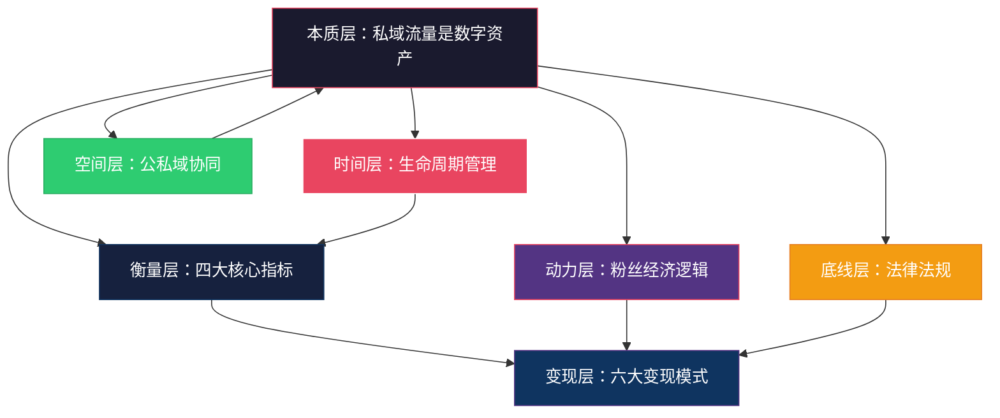
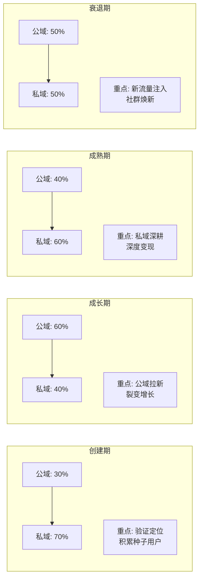

## 九、本节总结：社群与私域流量的理论全景

理论基础是整章的"地基"。前面七个小节分别拆解了私域流量的本质、核心指标体系、六大变现模式、粉丝经济逻辑、生命周期管理、公私域协同以及法律法规边界。本节将这些碎片化的知识点重新编织成一张完整的认知网络——不是简单重复，而是揭示它们之间的内在联系，帮你建立一个"看到任何社群都能快速分析"的思维框架。

---

### 1. 理论基础的完整知识图谱

七个小节的内容并非孤立存在，它们之间有清晰的逻辑递进关系。理解这张图，就理解了"为什么社群能赚钱"这个根本问题：



**逻辑链条解释：**

- **起点是"本质"**：私域流量是一种数字资产，不是"加了多少好友"。这个认知决定了后面所有决策的方向——你是在"经营资产"，不是在"做营销"
- **资产需要"衡量"**：四大核心指标（活跃度、留存率、转化率、裂变系数）就是资产的"体检报告"。不看指标运营社群，等于不看财报经营公司
- **衡量之后才能"变现"**：六大变现模式是资产变现的路径。选哪种模式，取决于你的社群类型和成员画像
- **变现的"燃料"是粉丝经济**：1000个铁杆粉丝理论解释了为什么不需要百万粉丝也能赚钱——关键是有足够多愿意持续付费的铁杆粉丝
- **资产会"老化"**：生命周期管理告诉你，社群不是一劳永逸的，需要在不同阶段采用不同策略
- **资产可以"增值"**：公私域协同是资产增值的杠杆——公域拉新、私域沉淀、反哺公域，形成正循环
- **资产有"红线"**：法律法规是不可触碰的底线，合规经营才能长久

---

### 2. 核心概念的深度关联

#### 2.1 私域流量本质 × 粉丝经济逻辑：为什么"拥有"比"租用"重要

私域流量的本质是"你可以自由触达、反复使用、不依赖平台的数字资产"。粉丝经济的底层逻辑是"1000个铁杆粉丝足以支撑一个事业"。两者结合，得出一个关键结论：

> **社群运营的终极目标，不是"拥有多少粉丝"，而是"拥有多少你可以自由触达的铁杆粉丝"。**

公域平台上的100万粉丝，本质上是"租来的"——平台算法一变，你的曝光量可能一夜归零。私域中的1000个铁杆粉丝，是"买来的"——每一个都是你可以随时触达的真实用户。这就是为什么一个500人的活跃私域社群，变现能力可能超过一个100万粉丝的公众号。

具体数据对比：

| 维度 | 公域百万粉丝 | 私域1000铁杆粉丝 |
|------|-------------|-----------------|
| 触达成本 | 每次付费（CPC/CPM） | 趋近于零 |
| 触达率 | 1%-5%（受算法限制） | 80%-95% |
| 信任深度 | 浅层关注 | 深度信任 |
| 付费转化率 | 0.1%-1% | 10%-30% |
| 年贡献收入 | 不确定，波动大 | 稳定可预期 |
| 抗风险能力 | 低（平台规则变化即归零） | 高（多触点备份） |

#### 2.2 核心指标 × 生命周期：不同阶段看不同的"仪表盘"

四大核心指标不是在所有阶段都同等重要的。在社群的不同生命周期阶段，应该重点关注不同的指标：

| 生命阶段 | 第一关注指标 | 第二关注指标 | 第三关注指标 | 可暂时忽略 |
|----------|-------------|-------------|-------------|-----------|
| 创建期（0-3个月） | 留存率 | 活跃度 | 互动深度 | 裂变系数、付费转化率 |
| 成长期（3-12个月） | 裂变系数 | 活跃度 | 付费转化率 | 单纯留存率 |
| 成熟期（1-3年） | 付费转化率 | LTV/CAC | 裂变系数 | 新增人数 |
| 衰退期 | 留存率 | 活跃度 | 创新指标 | 裂变系数 |

**为什么这样排序？**

- **创建期**最重要的是留存率——如果种子用户都留不住，后面一切免谈。这时候不应该急着变现或裂变，而应该把精力花在打磨核心价值上
- **成长期**最重要的是裂变系数——社群模式已经验证可行，现在需要扩大规模。裂变系数>1意味着社群可以自我增长，<1则需要持续投入外部流量
- **成熟期**最重要的是付费转化率和LTV/CAC——社群规模已经稳定，现在要最大化每个用户的价值。LTV/CAC>3说明商业模式健康
- **衰退期**最重要的是留存率——留下来的用户才是真正的铁杆粉丝，他们的反馈决定了社群应该创新还是转型

#### 2.3 六大变现模式 × 社群类型：不是所有模式都适合你

六大变现模式（付费会员、广告合作、电商带货、活动变现、咨询培训、资源对接）不是随便选的。不同类型的社群，天然适合不同的变现模式组合：

| 社群类型 | 首选模式 | 次选模式 | 不推荐模式 | 典型案例 |
|----------|---------|---------|-----------|---------|
| 学习型社群 | 付费会员 | 咨询培训 | 广告合作 | 精读会（年入200万） |
| 兴趣型社群 | 电商带货 | 活动变现 | 咨询培训 | 宝妈社群（年入150万） |
| 行业型社群 | 资源对接 | 活动变现 | 电商带货 | 行业资源社群（年入300万） |
| IP型社群 | 咨询培训 | 付费会员 | 广告合作 | 知识IP社群（年入500万） |
| 本地型社群 | 电商带货 | 活动变现 | 资源对接 | 线下商家社群（年入80万） |
| 电商型社群 | 电商带货 | 付费会员 | 咨询培训 | 私域电商（年入1000万） |

**选择逻辑：** 变现模式要匹配社群的"价值交付方式"。学习型社群的核心价值是知识，所以付费会员（持续获取知识）和咨询培训（深度获取知识）最自然。兴趣型社群的核心价值是"发现好东西"，所以电商带货最自然。行业型社群的核心价值是人脉，所以资源对接最自然。

#### 2.4 公私域协同 × 生命周期：不同阶段的流量策略

公域和私域不是二选一，而是协同作战。在社群的不同生命周期阶段，公私域的配比不同：



**创建期**以私域为主（70%），因为这时候你不需要大量用户，需要的是精准的种子用户。逐一邀请、深度沟通、快速迭代，比大规模引流更重要。

**成长期**以公域为主（60%），因为社群模式已经验证可行，现在需要通过公域平台（小红书、抖音、视频号）大规模引流。但引流的同时，必须做好"公域→私域"的承接体系——入群欢迎语、群规、新人引导流程。

**成熟期**以私域为主（60%），因为社群规模已经稳定，重点是深度变现。这时候公域的作用是"品牌曝光"而非"拉新"——让更多人知道你的社群存在，为未来的增长储备认知。

**衰退期**公私域各半（50:50），因为需要新的流量注入来激活社群。但更重要的是创新——新主题、新形式、新活动，让老成员重新找到参与的理由。

---

### 3. 关键指标速查表

将理论基础涉及的所有关键指标汇总，方便随时查阅：

#### 3.1 社群健康度指标

| 指标 | 计算方式 | 优秀 | 良好 | 一般 | 需要干预 |
|------|---------|------|------|------|----------|
| 日活跃率 | 每日发言人数÷总人数 | 20%-40% | 10%-20% | 5%-10% | <5% |
| 7日活跃率 | 7天内发言人数÷总人数 | >40% | 20%-40% | 10%-20% | <10% |
| 30日留存率 | 30天后仍在群人数÷入群人数 | >80% | 60%-80% | 40%-60% | <40% |
| 付费转化率 | 付费人数÷总人数 | 10%-20% | 5%-10% | 2%-5% | <2% |
| 裂变系数 | 每个用户平均带来的新用户数 | >1.0 | 0.5-1.0 | 0.3-0.5 | <0.3 |
| 月退群率 | 月退群人数÷月初总人数 | <5% | 5%-10% | 10%-15% | >15% |
| 互动深度 | 平均每人每日发言条数 | >3条 | 1-3条 | 0.5-1条 | <0.5条 |
| 商业内容占比 | 商业内容÷总内容 | ≤15% | 15%-20% | 20%-30% | >30% |

#### 3.2 私域运营效率指标

| 指标 | 参考值 | 说明 |
|------|--------|------|
| 好友通过率 | 30%-50% | 主动添加好友的通过比例 |
| 入群转化率 | 40%-60% | 好友转化为群成员的比例 |
| 首次互动率 | 60%-80% | 入群后7天内参与互动的比例 |
| LTV/CAC比值 | >3 | 客户终身价值÷获客成本，健康值>3 |
| 内容消费率 | >50% | 发布内容被阅读/观看的比例 |
| 1对1回复率 | >80% | 私聊消息的回复比例 |

#### 3.3 变现效率基准

| 变现模式 | 行业平均客单价 | 复购率 | 适合规模 | 启动难度 |
|----------|---------------|--------|----------|----------|
| 付费会员 | 99-599元/年 | 50%-70% | 200人+ | 中 |
| 电商带货 | 50-300元/单 | 30%-50% | 500人+ | 中高 |
| 线上课程 | 99-999元/期 | 20%-40% | 300人+ | 中 |
| 咨询服务 | 500-5000元/次 | 40%-60% | 100人+ | 高 |
| 线下活动 | 99-999元/人 | 30%-50% | 200人+ | 中 |
| 资源对接 | 按成交抽佣 | — | 500人+ | 高 |
| 广告合作 | 0.5-5元/粉丝 | — | 5000人+ | 低 |

---

### 4. 理论到实践的转化框架

理论学完了，怎么用？以下是将理论转化为行动的完整框架：

#### 4.1 "诊断-开方-执行"三步法

面对任何一个社群，你可以用以下框架快速分析：

**第一步：诊断（用四大指标做体检）**

```text
社群健康度诊断表
├── 活跃度：日活跃率是多少？低于10%说明社群正在"死亡"
├── 留存率：30日留存率是多少？低于60%说明核心价值有问题
├── 转化率：付费转化率是多少？低于5%说明信任建设不足
└── 裂变系数：裂变系数是多少？低于0.5说明社群缺乏口碑传播力
```

**第二步：开方（用生命周期理论定位问题）**

- 如果社群处于创建期，留存率低是正常的，关键是找到留存率低的原因（定位不准？内容不足？互动太少？）
- 如果社群处于成长期，裂变系数低说明增长引擎有问题（奖励不够吸引人？裂变路径太复杂？）
- 如果社群处于成熟期，转化率低说明变现设计有问题（产品不对路？定价不合理？信任不够？）
- 如果社群处于衰退期，活跃度低说明需要创新（新主题？新形式？新活动？）

**第三步：执行（用六大变现模式设计变现路径）**

根据社群类型和成员画像，选择2-3种变现模式组合。不要贪多——先把一种模式跑通，再叠加第二种。

#### 4.2 常见场景的理论应用

**场景一：我想从0开始做一个社群**

理论指导：
1. 先理解"私域流量是数字资产"——你的目标不是"拉人进群"，而是"积累可自由触达的用户资产"
2. 用"1000个铁杆粉丝"理论设定目标——不需要百万粉丝，先服务好200个精准用户
3. 用"生命周期管理"理论规划节奏——创建期（0-3个月）重点是验证定位和积累种子用户，不要急着变现
4. 用"公私域协同"理论获取流量——创建期以私域为主（逐一邀请），成长期再加大公域引流

**场景二：我的社群有500人，但活跃度很低**

理论指导：
1. 用四大指标做诊断——先确认是活跃度问题还是留存率问题。如果是活跃度低但留存率正常，说明用户认可价值但缺乏互动；如果留存率也低，说明核心价值有问题
2. 用"社交关系占留存因素50%"的理论找原因——你的社群是不是只有管理员在发内容？成员之间有没有横向连接？
3. 用"生命周期管理"理论判断阶段——500人社群可能处于成长期向成熟期过渡，需要从"增长驱动"转向"深度运营驱动"

**场景三：我想通过社群赚钱，但不知道选什么模式**

理论指导：
1. 先确定你的社群类型（学习型、兴趣型、行业型、IP型、本地型、电商型）
2. 参照"变现模式×社群类型"匹配表，选择首选和次选模式
3. 用"定价心理学"确定价格——价格是最好的筛选器，低价吸引不来高质量用户
4. 用"LTV/CAC>3"的标准验证商业模式——如果获客成本高于用户终身价值，模式不可持续

**场景四：社群运营了1年，感觉到了瓶颈**

理论指导：
1. 用"生命周期管理"理论判断——你可能正处于成熟期向衰退期过渡
2. 检查"商业内容占比"——是否超过了20%的红线？过度商业化是社群衰退的首要原因
3. 考虑"公私域协同"——是否需要通过公域引入新流量来激活社群？
4. 考虑"创新"——新主题、新形式、新活动，让老成员重新找到参与的理由

---

### 5. 理论基础的核心认知提炼

七个小节的内容可以提炼为以下十条核心认知。每一条都经过实战验证，是社群运营的"第一性原理"：

1. **私域流量是数字资产**：不是"加了多少好友"，而是一种你可以自由触达、反复使用、不依赖平台的数字资产。类比房产——公域流量是租房，私域流量是买房

2. **社交关系是社群最大的价值**：用户留存的三大驱动力中，社交关系占50%，内容价值占30%，身份认同占20%。如果社群只有管理员在发内容，你只开发了30%的价值

3. **四大指标缺一不可**：活跃度、留存率、转化率、裂变系数——就像汽车的仪表盘，不看指标运营社群就是盲人摸象

4. **六大变现模式要组合使用**：不是只能选一种，而是根据社群类型选择2-3种组合。收入来源越多元，抗风险能力越强

5. **1000个铁杆粉丝就够了**：不需要百万粉丝。1000个年费399元的会员就是39.9万年收入，加上高阶产品和活动，年入50-100万完全可以实现

6. **社群有生命周期**：创建期→成长期→成熟期→衰退期，每个阶段的核心任务完全不同。90%的微信群在30天内死亡，根本原因是没有根据生命周期调整策略

7. **公域拉新、私域沉淀**：公域和私域不是二选一，而是协同作战。公域负责"让更多人知道你"，私域负责"让知道你的人信任你、为你付费"

8. **价格是最好的筛选器**：9.9元/年吸引来的用户投入度低、参与度低、付费意愿也低。定价要与价值匹配，先通过免费内容建立信任，再推出合理定价的付费社群

9. **合规是底线**：涉及个人信息保护、广告法、税务、传销认定等法律红线。合规经营才能长久，踩红线的代价远超你的想象

10. **先服务好100个人，再想1000个人的事**：先用小规模社群验证模式、打磨服务、积累口碑，再考虑规模化。急于变现的人不适合做社群

---

### 6. 与其他章节的知识衔接

理论基础不是孤立的——它与本书其他章节有密切的知识关联：

| 关联章节 | 关联点 | 衔接说明 |
|----------|--------|----------|
| 第22章 个人IP与品牌建设 | 社群的根基是个人品牌 | 没有个人品牌做社群，等于没有地基盖楼。IP是社群的"灵魂"，社群是IP的"放大器" |
| 第23章 咨询与培训 | 社群变现的重要方式之一 | 咨询培训是六大变现模式之一，但先理解一对一交付再学一对多 |
| 第25章 电商与新零售 | 社群电商是私域变现的重要模式 | 社群+电商=私域电商，复购率比公域电商高3-5倍 |
| 第26章 内容创业 | 社群与内容互相赋能 | 好内容引流社群，好社群反哺内容。内容是社群的"燃料" |
| 第27章 知识付费 | 付费社群是知识付费的重要载体 | 付费社群、付费课程、付费咨询三者可以组合成完整的产品线 |

---

### 7. 进入核心技巧前的最后检查

在进入"核心技巧"部分之前，确认你已经理解了以下问题。如果任何一个回答是"不确定"，建议回头重读对应小节：

| 检查项 | 对应小节 | 通过标准 |
|--------|---------|---------|
| 你能用一句话解释"私域流量的本质"吗？ | 第一小节 | 能说出"可自由触达、反复使用、不依赖平台的数字资产" |
| 你知道社群运营的四大核心指标是什么吗？ | 第二小节 | 活跃度、留存率、转化率、裂变系数 |
| 你能说出至少四种社群变现模式吗？ | 第三小节 | 付费会员、广告合作、电商带货、活动变现、咨询培训、资源对接 |
| 你知道"1000个铁杆粉丝"理论的核心含义吗？ | 第四小节 | 不需要百万粉丝，1000个铁杆粉丝足以支撑一个事业 |
| 你知道社群的生命周期分为几个阶段吗？ | 第五小节 | 创建期、成长期、成熟期、衰退期 |
| 你知道公域和私域应该如何协同吗？ | 第六小节 | 公域拉新、私域沉淀、反哺公域 |
| 你知道社群运营涉及哪些法律红线吗？ | 第七小节 | 个人信息保护、广告法、税务、传销认定、群主责任 |

全部通过？很好。接下来的"核心技巧"部分，将把这些理论转化为可执行的操作步骤——从搭建私域流量池到设计会员体系，从社群增长策略到数据化运营，每一步都有具体的方法和工具。理论已经武装了你的大脑，现在该让双手动起来了。
