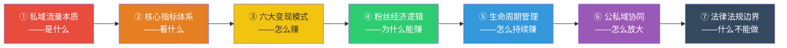
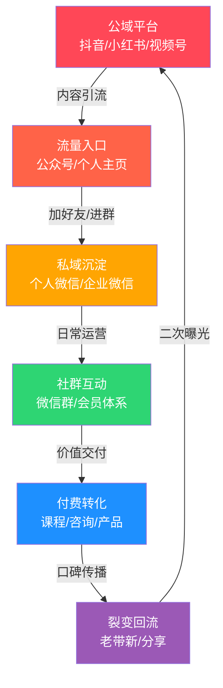

## 六、本节核心要点

本节是对"理论基础"全部内容的浓缩提炼。如果你时间有限，读完这一节就能掌握社群与私域流量的核心认知框架；如果你已经通读了前面所有内容，这一节帮你把零散知识点串成体系。

---

### 1. 七个核心概念，一张图串联

理论基础部分共讲了七个核心模块，它们之间有清晰的逻辑递进关系：



**一句话总结每个模块的核心结论：**

| 序号 | 模块 | 核心结论 |
|------|------|----------|
| ① | 私域流量本质 | 私域流量是你**拥有的**数字资产，不是你在平台上租的流量。类比房产：公域是租房，私域是买房 |
| ② | 核心指标体系 | 四个仪表盘数字——**活跃度、留存率、转化率、裂变系数**。不看指标运营社群等于盲人开车 |
| ③ | 六大变现模式 | 会员制、广告合作、电商带货、活动变现、咨询培训、资源对接。不要只靠一种，要**组合使用** |
| ④ | 粉丝经济逻辑 | 1000个铁杆粉丝理论在中国市场的验证——200-2000个铁杆粉丝就能支撑体面收入 |
| ⑤ | 生命周期管理 | 社群有五个阶段（创建→成长→成熟→衰退→重生），每个阶段的核心任务完全不同 |
| ⑥ | 公私域协同 | 公域负责**获客**，私域负责**沉淀和复购**。两者是漏斗关系，不是替代关系 |
| ⑦ | 法律法规边界 | 社群运营涉及用户隐私保护、广告法合规、分销层级限制三条红线，踩线可能面临封号甚至法律责任 |

---

### 2. 最容易被误解的三个认知

在整个理论基础部分，有三个认知是最容易被误解的，也是导致大多数人社群做不好的根本原因：

**认知一：私域流量 ≠ 微信好友数量**

很多人觉得"我有5000个微信好友，我就有私域流量了"。这是最大的误解。私域流量的核心不是"数量"，而是"可触达性"和"信任度"。你有5000个微信好友，但如果你发朋友圈没人看、发消息没人回，那你有的只是5000个"僵尸联系人"，不是私域流量。

真正的私域流量需要满足三个条件：
- **可自由触达**：你能在任何时间、通过自有渠道触达用户，不需要额外付费
- **有信任基础**：用户认可你的价值，愿意接收你的信息
- **有转化可能**：用户有潜在的付费意愿或行动力

**认知二：社群 ≠ 微信群**

"我拉了个200人的微信群"不等于"我建了一个社群"。微信群只是社群的**载体**之一，真正的社群需要具备四个要素：
- **共同目标**：成员聚在一起有明确的目的（学习、成长、资源对接、兴趣交流）
- **价值供给**：社群持续为成员提供价值（内容、人脉、信息、机会）
- **互动关系**：成员之间有横向互动，不只是群主单向输出
- **身份认同**：成员对社群有归属感，愿意对外介绍"我是XX社群的成员"

一个有200人但每天只有群主发广告的微信群，连"群"都算不上，更别说"社群"了。

**认知三：变现 ≠ 收割**

很多人一提到社群变现，第一反应是"怎么从群里收钱"。这种思维是错误的。社群变现的本质是**价值交换**——你为成员提供了足够多的价值，成员愿意为此付费。

变现的前提是信任，信任的前提是价值交付。正确的顺序是：
1. 先持续输出价值（至少1-3个月）
2. 建立足够的信任和口碑
3. 设计合理的付费产品/服务
4. 让有需求的用户自愿付费

跳过前两步直接收割，不仅赚不到钱，还会毁掉社群。

---

### 3. 四大核心指标的达标基准

| 指标 | 含义 | 健康值 | 警戒值 | 危险值 |
|------|------|--------|--------|--------|
| **日活跃度** | 每日发言或互动的成员占比 | >20% | 10%-20% | <10% |
| **月留存率** | 一个月后仍留在群中的成员占比 | >80% | 60%-80% | <60% |
| **付费转化率** | 从免费成员到付费成员的转化比 | >5% | 2%-5% | <2% |
| **裂变系数** | 平均每个成员带来的新成员数 | >1.0 | 0.5-1.0 | <0.5 |

**关键洞察：** 这四个指标不是孤立的，它们之间有因果链——活跃度决定了留存率，留存率决定了转化率，转化率决定了裂变系数。如果活跃度低，后面所有指标都不可能好看。所以运营社群的第一优先级永远是**提升活跃度**。

---

### 4. 六大变现模式的适用场景速查

不是所有变现模式都适合你的社群。选择变现模式的关键变量是：**社群类型**和**成员付费意愿**。

| 变现模式 | 最适合的社群类型 | 启动门槛 | 收入天花板 | 稳定性 |
|----------|-----------------|----------|-----------|--------|
| 付费会员制 | 行业社群、学习社群 | 低（99元起） | 中（年费×人数） | ★★★★★ |
| 广告合作 | 大规模粉丝社群（1000+人） | 高（需有人数基础） | 中 | ★★★ |
| 电商带货 | 兴趣社群、宝妈社群 | 中（需供应链） | 高 | ★★★★ |
| 活动变现 | 行业社群、资源社群 | 中（需策划能力） | 中高 | ★★★ |
| 咨询培训 | 知识IP社群、专业社群 | 高（需专业能力） | 高 | ★★★★ |
| 资源对接 | 行业社群、人脉社群 | 中（需行业资源） | 高 | ★★★ |

**最佳实践：** 采用"会员制打底 + 1-2种模式增收"的组合策略。会员制提供稳定的基础收入，其他模式提供增长空间。例如：读书社群 = 会员年费（基础收入）+ 课程销售（增量收入）+ 线下活动（利润收入）。

---

### 5. 社群生命周期五阶段速查

| 阶段 | 时长 | 核心任务 | 关键指标 | 最大风险 |
|------|------|----------|----------|----------|
| **创建期** | 第1-30天 | 冷启动，找到前50个种子用户 | 种子用户数、首次互动率 | 没人说话，群变"死群" |
| **成长期** | 第2-6月 | 裂变增长，建立运营节奏 | 增长率、日活跃度 | 增长太快导致质量下降 |
| **成熟期** | 第6-18月 | 深度变现，提升ARPU值 | 付费转化率、ARPU | 过度商业化伤害体验 |
| **衰退期** | 第18月+ | 激活沉默用户，引入新鲜血液 | 留存率、活跃度 | 不断流失核心成员 |
| **重生期** | 视情况 | 转型升级，开辟新价值线 | 新用户增长率 | 转型失败导致彻底衰亡 |

**关键认知：** 每个社群都会走向衰退，这是自然规律，不是运营失败。关键是在衰退期到来之前做好准备——提前储备新内容、新活动、新价值点，让社群能持续"焕新"。

---

### 6. 公域与私域的协同模型



**核心公式：** 私域用户价值 = 公域获客成本 × 信任倍数 × 复购次数

公域流量的获客成本越来越高（抖音单粉成本2-15元，小红书5-20元），但只要你把用户沉淀到私域，后续的每一次触达都是免费的。一个私域用户的终身价值（LTV）通常是公域单次获客成本的5-20倍。这就是为什么要"公域获客，私域养客"。

---

### 7. 三条法律红线不可触碰

| 红线 | 具体内容 | 违规后果 | 合规做法 |
|------|----------|----------|----------|
| **用户隐私** | 未经同意收集、使用、泄露用户个人信息 | 罚款、封号、刑事责任 | 获取明确授权，数据加密存储，定期清理 |
| **广告法** | 虚假宣传、使用"最""第一"等极限词、未标注广告 | 罚款（广告费3-5倍）、封号 | 真实描述、标注广告、保留宣传依据 |
| **分销合规** | 三级及以上分销层级、拉人头模式 | 涉嫌传销，刑事责任 | 控制在二级以内、以实际销售为导向 |

**特别提醒：** 很多社群在裂变增长时容易触碰分销合规红线。记住一个简单判断标准：如果收入主要来自"拉人头"而非"卖产品/服务"，就可能涉嫌违法。合法的分销模式必须以真实的商品或服务交易为基础。

---

### 8. 行动清单：从认知到行动

读完理论基础后，按以下顺序行动：

```text
□ 第1步：用一句话定义你的私域流量本质
     模板：我的私域是 [目标人群] 的 [价值类型] 资产

□ 第2步：确定你的社群核心指标目标
     模板：3个月内达到 日活跃度>15%，月留存>70%

□ 第3步：选择1种主打变现模式 + 1种辅助模式
     参考上方"六大变现模式适用场景速查表"

□ 第4步：判断你的社群处于哪个生命周期阶段
     根据"五阶段速查表"确定当前核心任务

□ 第5步：设计公域→私域的引流路径
     模板：在 [公域平台] 发布 [内容类型] → 引导加 [微信/企微] → 拉入 [社群]

□ 第6步：检查三条法律红线
     确保你的运营方式不触碰隐私、广告法、分销合规三条底线
```

---

### 9. 核心公式速记卡

在后续的实操过程中，以下公式会反复用到，建议收藏：

**社群健康度公式：**
```text
社群健康度 = (日活跃度 × 0.3) + (月留存率 × 0.3) + (付费转化率 × 0.25) + (裂变系数 × 0.15)
```
健康度 > 0.7 为优秀，0.5-0.7 为合格，< 0.5 需要立即优化。

**私域用户价值公式：**
```text
单个私域用户年价值 = 客单价 × 年复购次数 × 转介绍系数
```
目标：单个私域用户年价值 > 获客成本的 5 倍。

**社群收入公式：**
```text
月收入 = 活跃用户数 × 付费转化率 × 客单价 + 广告收入 + 活动收入
```
提升任何一个变量都能增加收入，但**提升付费转化率**的杠杆最大。

**会员续费率公式：**
```text
续费率 = (到期续费会员数 / 到期会员总数) × 100%
```
续费率 > 70% 说明社群价值交付到位，< 50% 需要立刻排查原因。

---

### 10. 本节核心要点总结

把理论基础的全部内容压缩为以下核心记忆点：

1. **私域是资产，不是数字** —— 可触达、有信任、能转化的用户才是真正的私域流量
2. **指标是方向盘** —— 活跃度、留存率、转化率、裂变系数，四个数字决定社群生死
3. **变现是价值交换** —— 先交付价值，再设计变现，顺序不能反
4. **1000个铁杆粉丝够了** —— 不需要百万粉丝，200-2000个铁杆粉丝足以支撑体面收入
5. **社群会衰退，这是规律** —— 提前准备"焕新"方案，不要等到衰退了才想办法
6. **公域获客，私域养客** —— 两者是漏斗关系，私域用户价值是公域的5-20倍
7. **法律红线不可碰** —— 隐私保护、广告法合规、分销层级限制，踩线代价远大于收益

这七个认知是整章后续所有实操方法的"地基"。地基不牢，地动山摇。
