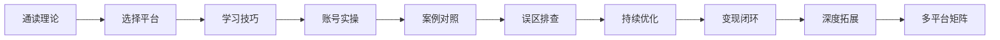

# 第25章 短视频与直播变现 — 章节概览

## 本章定位

短视频与直播已经从"风口"演变为成熟的商业基础设施。截至2025年，中国短视频用户规模突破10亿，直播电商市场规模超过4.9万亿元，占网络零售总额的比重持续攀升。无论你是个人创作者、实体商家还是企业品牌，短视频与直播都是当下最具性价比的流量获取与变现渠道。

本章将从**底层逻辑→平台实操→变现闭环→实战案例**四个维度，系统拆解短视频与直播变现的完整知识体系，帮助你从零开始建立可复现的变现能力。

```mermaid
graph TD
    A[短视频与直播变现] --> B[理论基础]
    A --> C[核心技巧]
    A --> D[实战案例]
    A --> E[常见误区]
    A --> F[练习方法]
    A --> G[深度拓展]

    B --> B1[平台算法机制]
    B --> B2[用户画像分析]
    B --> B3[变现模型拆解]
    B --> B4[直播商业逻辑]
    B --> B5[内容电商底层逻辑]
    B --> B6[法律法规合规]

    C --> C1[抖音运营]
    C --> C2[快手运营]
    C --> C3[视频号运营]
    C --> C4[直播带货全流程]
    C --> C5[广告变现]
    C --> C6[MCN合作]
    C --> C7[数据分析]
    C --> C8[拍摄剪辑进阶]
    C --> C9[直播间进阶策略]

    D --> D1[美食博主案例]
    D --> D2[快手带货案例]
    D --> D3[视频号知识付费]
    D --> D4[MCN美妆孵化]
    D --> D5[服装直播间案例]
    D --> D6[B站抖音双平台]
    D --> D7[本地生活达人]
    D --> D8[案例总结与启示]
```

## 章节结构与学习路径

本章共分六大模块，建议按顺序学习，每个模块都有独立的价值：

| 模块 | 核心内容 | 学习目标 | 建议时长 |
|------|----------|----------|----------|
| **01-理论基础** | 平台算法、用户画像、变现模型、直播商业逻辑、内容电商本质、合规要求 | 建立系统认知框架，理解"为什么这么做" | 2-3小时 |
| **02-核心技巧** | 抖音/快手/视频号运营、直播带货全流程、广告变现、MCN合作、数据分析、拍摄剪辑、直播间进阶 | 掌握可落地的实操方法论 | 3-4小时 |
| **03-实战案例** | 7个真实案例拆解 + 综合启示 | 从他人经验中提炼可复用的模式 | 2-3小时 |
| **04-常见误区** | 新手高频犯错与避坑指南 | 避免重复踩坑，节省试错成本 | 1小时 |
| **05-练习方法** | 分阶段实操训练计划 | 通过刻意练习巩固技能 | 持续进行 |
| **06-本章小结** | 知识回顾、行动清单、资源汇总 | 查漏补缺，制定行动计划 | 0.5小时 |
| **07-深度拓展** | AI工具应用、跨境短视频、Web3与短视频、行业趋势 | 拓展视野，把握前沿方向 | 2小时 |

## 核心知识地图

### 一、理论基础：理解底层逻辑

> 不理解算法就做内容，等于蒙眼开车。

**平台算法推荐机制**是所有运营动作的基石。抖音的"赛马制"流量池分级（200→5000→10万→1000万），快手的双列点选+社交权重分配，视频号的社交推荐为主+兴趣推荐为辅——三种截然不同的流量分配逻辑，决定了你在不同平台必须采用不同的内容策略。

**用户画像**决定了你的内容给谁看、用什么语气说话、推荐什么价位的产品。抖音核心用户25-35岁，消费力中上；快手下沉市场占比60%，重性价比；视频号30-50岁为主，决策周期长但客单价高。

**变现模型**分为四大类：广告变现（星图接单、信息流）、电商变现（挂车、直播、橱窗）、知识付费（课程、社群、咨询）、打赏经济（才艺、情感、PK）。每种模型的启动门槛、收入天花板、运营难度完全不同，选错赛道比不会运营更致命。

**内容电商**的本质是"创造需求"而非"满足需求"——用户本来没想买，你的内容让他觉得必须买。这与传统电商的搜索逻辑有根本区别，理解这一点才能做好内容设计。

### 二、核心技巧：从知道到做到

**平台运营**方面，抖音重完播率和互动率，内容要在3秒内抓住注意力；快手重封面和标题，真实感和人情味是核心竞争力；视频号重社交裂变，要善用微信生态的联动能力。

**直播带货全流程**涵盖人、货、场三大要素：主播的人设定位与表达能力，选品的四象限法则（引流款20%+利润款50%+形象款10%+福利款20%），场景搭建的设备与灯光配置，以及从开场→产品介绍→逼单→成交的完整话术体系。

**数据分析**是区分普通运营和高手的关键。关注完播率、互动率、转化率、UV价值等核心指标，建立数据看板，用A/B测试持续优化内容和投放策略。

**拍摄剪辑进阶**包括构图法则、运镜技巧、剪辑节奏、特效运用等，从"能拍"到"会拍"再到"拍得好"的进阶路径。

### 三、实战案例：从他人的成功中学习

本章精选7个覆盖不同平台、不同赛道、不同阶段的真实案例：

| 案例 | 平台 | 赛道 | 核心看点 |
|------|------|------|----------|
| 案例一 | 抖音 | 美食 | 从零到百万粉丝的内容方法论 |
| 案例二 | 快手 | 综合带货 | 老铁经济下的信任变现 |
| 案例三 | 视频号 | 知识付费 | 微信生态的私域闭环 |
| 案例四 | 抖音 | 美妆 | MCN孵化的标准化路径 |
| 案例五 | 抖音 | 服装 | 素人逆袭的直播间打法 |
| 案例六 | B站+抖音 | 知识 | 双平台差异化运营 |
| 案例七 | 多平台 | 本地生活 | 线下商家的线上变现 |

每个案例都包含**背景→策略→执行→数据→复盘**五步拆解，提炼可复用的方法论。

### 四、常见误区：避开新手陷阱

高频误区包括：盲目追求粉丝数量而忽视变现效率、不做数据分析凭感觉运营、选品只看价格不看复购率、直播话术生硬缺乏互动、忽视平台规则导致限流或封号等。每个误区都配有具体的纠正方法和正确的操作示范。

### 五、练习方法：刻意练习出真功

分三个阶段设计练习计划：**入门期**（1-30天）聚焦内容创作基础和账号搭建；**成长期**（31-90天）打磨直播能力和数据分析思维；**变现期**（91-180天）建立稳定的变现模型和团队协作能力。

### 六、深度拓展：站在未来看现在

涵盖AI工具在短视频创作中的应用（AI剪辑、AI脚本、数字人直播）、跨境短视频的机会（TikTok、YouTube Shorts）、Web3与短视频的结合（NFT、创作者经济）以及行业未来趋势预判。

## 学习建议

1. **先通读理论基础**，建立完整的认知框架，避免"只会操作不懂原理"
2. **核心技巧边学边练**，每个技巧点都配合实操练习
3. **案例学习要带着问题看**，思考"如果是我会怎么做"
4. **误区部分反复回顾**，在实操中对照检查
5. **深度拓展按需学习**，不必一次全读

## 适合人群

| 人群 | 学习重点 | 预期收获 |
|------|----------|----------|
| 零基础新手 | 理论基础 + 核心技巧入门部分 | 搭建第一个能变现的账号 |
| 有一定基础的创作者 | 核心技巧进阶 + 实战案例 | 优化变现模型，提升收入 |
| 实体商家 | 直播带货全流程 + 本地生活案例 | 建立线上销售渠道 |
| 企业品牌 | 平台生态分析 + MCN合作 | 制定品牌短视频营销策略 |
| 副业探索者 | 变现模型分析 + 练习方法 | 找到适合的副业方向 |

## 本章关键术语速查

| 术语 | 含义 |
|------|------|
| GMV | 成交总额（Gross Merchandise Value），直播间所有成交订单的总金额 |
| UV价值 | 每个独立访客带来的平均收入，UV价值 = GMV ÷ UV数 |
| 完播率 | 视频被完整观看的比例，是算法推荐的第一权重指标 |
| DOU+ | 抖音的付费推广工具，用付费流量撬动自然流量 |
| 星图 | 抖音的商业合作平台，连接创作者与品牌方 |
| 磁力引擎 | 快手的商业化营销平台，对应抖音的巨量引擎 |
| ROI | 投入产出比（Return on Investment），衡量投放效果的核心指标 |
| 赛马制 | 平台通过小范围数据测试决定是否扩大推送的机制 |
| 挂车 | 在短视频中嵌入商品链接，用户点击即可购买 |
| 私域流量 | 可反复触达、无需付费的自有用户池（如微信群、企业微信） |
| MCN | 多频道网络（Multi-Channel Network），批量孵化和管理创作者的机构 |
| ABtest | A/B测试，通过对比实验优化内容、投放或页面设计 |

> **阅读提示**：本概览提供了全章的知识骨架。后续各小节将逐一展开每个知识点的详细内容，建议结合概览中的结构图定位当前所学内容在整体中的位置，建立全局视野。
