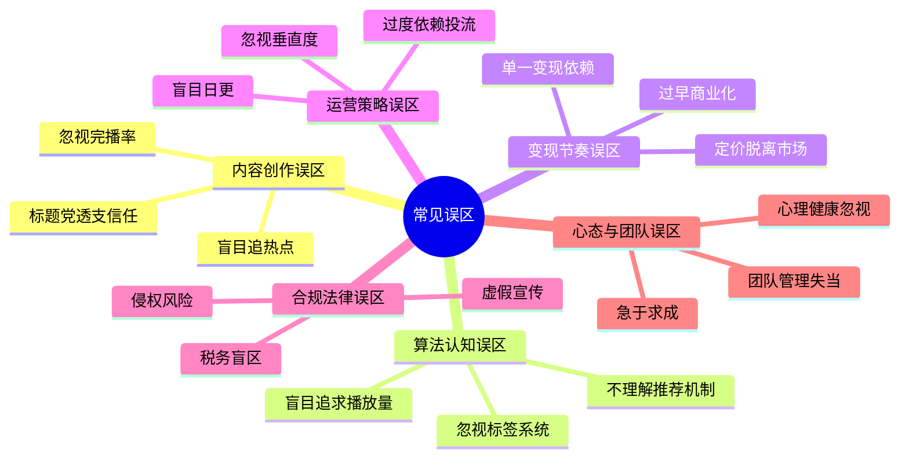
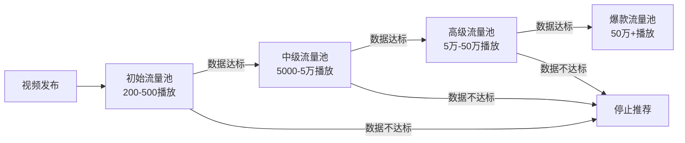
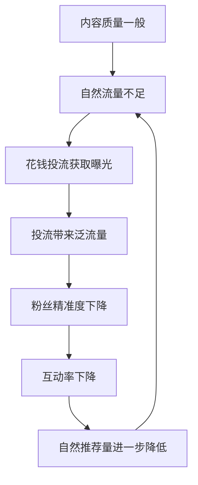
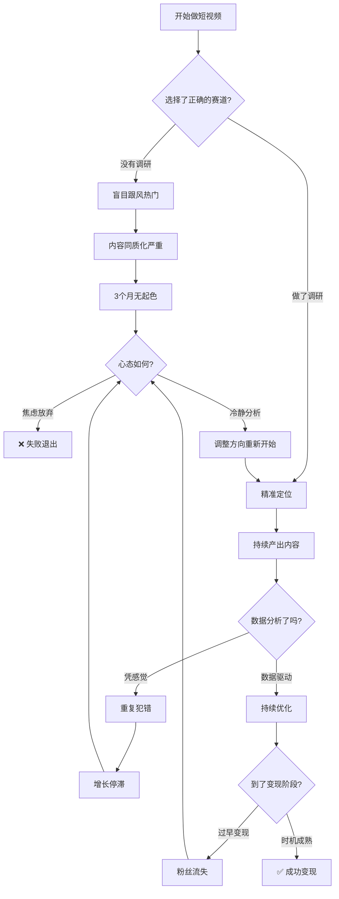

# 常见误区：短视频与直播变现的避坑指南

短视频与直播行业的信息不对称极为严重——成功案例被大量传播，失败教训却鲜有人系统总结。据抖音电商2024年度报告，新账号在前6个月的存活率不足12%，其中超过70%的失败并非因为能力不足，而是踩中了本可避免的典型误区。本章系统梳理从认知到执行、从内容到合规的全链路陷阱，帮助你建立完整的"避坑地图"。



---

## 一、内容创作误区

### 误区1：把"蹭热点"当作内容策略

**典型表现：** 看到热搜话题就追，什么火拍什么，账号内容像"杂货铺"。

**深层危害：**

蹭热点的本质是借势流量，但它解决的是"曝光"问题，而非"留人"问题。算法的推荐逻辑是基于用户兴趣标签的匹配——一个今天追美食热点、明天追科技热点的账号，系统无法为其建立清晰的用户画像，最终导致推荐精度持续下降。

更关键的是，热点流量的特点是"来得快、去得也快"。用户因为热点关注你，也会因为热点消退而取关。这种粉丝的7日留存率通常不足15%，远低于垂直内容粉丝的45%-60%。

**真实案例：** 2023年"挖呀挖"儿歌爆火期间，大量账号跟风翻拍。据新抖数据统计，跟风账号中仅0.3%获得了10万以上的点赞，而其中90%在热度消退后粉丝增长停滞，部分账号甚至出现净流失。

**正确做法：**

1. **热点筛选矩阵** — 不是所有热点都值得追，用两个维度筛选：与账号定位的相关性（高/中/低）、热点的持续周期（长/中/短）。只追"高相关+长周期"的热点。
2. **热点嫁接法** — 将热点与自身领域结合。例如知识博主追热点时，不是复述热点事件，而是用专业知识解读热点背后的逻辑。
3. **80/20法则** — 80%的内容围绕核心选题库产出，20%用于热点尝试。确保账号标签的稳定性。

### 误区2：忽视完播率，只看播放量

**典型表现：** 把播放量当作衡量内容好坏的唯一标准，不关注用户是否真的看完了视频。

**原理分析：**

抖音的推荐算法中，完播率是决定视频能否进入下一级流量池的最核心指标。一条完播率30%的视频和完播率60%的视频，获得的推荐量可能相差5-10倍。

| 完播率区间 | 推荐池级别 | 预估播放量 |
|:---:|:---:|:---:|
| <15% | 停止推荐 | 200-500 |
| 15%-30% | 初级池 | 500-5000 |
| 30%-50% | 中级池 | 5000-5万 |
| 50%-70% | 高级池 | 5万-50万 |
| >70% | 爆款池 | 50万+ |

**常见导致完播率低的原因：**

- 开头3秒没有"钩子"，用户直接划走
- 视频时长与内容密度不匹配（1分钟能说清的事拖到3分钟）
- 节奏拖沓，缺乏信息密度的变化
- 结尾没有"留人"设计（预告、悬念、互动引导）

**正确做法：**

1. **黄金3秒法则** — 前3秒必须抛出冲突、悬念或利益点。"你知道XX吗？""这个方法让我多赚了3万""99%的人都做错了"这类开头的平均完播率比平淡开头高出40%-60%。
2. **时长匹配内容** — 知识类内容控制在60-90秒，故事类控制在2-3分钟，教程类可以3-5分钟但必须保证信息密度。
3. **节奏设计** — 每15-20秒设置一个"信息锚点"（转折、数据、案例），防止用户中途流失。
4. **数据复盘** — 每条视频发布后24小时查看完播率曲线，找到用户流失的"断崖点"，针对性优化。

### 误区3：标题党透支账号信用

**典型表现：** 用夸张标题吸引点击，但内容与标题严重不符。例如"月入10万的秘密"实际只是教你注册账号。

**深层机制：**

平台算法不仅看点击率，还看"负反馈率"。用户被标题骗进来后快速退出、点"不感兴趣"或举报，这些行为会被算法记录为负反馈。当一个账号的负反馈率超过阈值（通常为3%-5%），系统会降低该账号的整体权重，不仅这条视频受影响，后续所有视频的初始推荐量都会下降。

**数据佐证：** 据某MCN机构内部测试，连续3条视频使用标题党手法后，第4条正常内容的初始推荐量下降了约35%。恢复信任需要5-7条高质量内容的持续输出。

**正确做法：**

1. **标题承诺=内容交付** — 标题可以制造悬念和好奇心，但内容必须兑现承诺。
2. **"信息差"标题法** — 用真实的信息差制造吸引力。例如"大部分不知道的XX功能"，然后确实展示一个冷门但实用的功能。
3. **测试-迭代** — 同一内容用不同标题测试，找到"吸引力"和"真实性"的平衡点。

---

## 二、算法认知误区

### 误区4：不理解推荐机制，盲目发布

**典型表现：** 不了解平台的流量分配逻辑，发布时间随意，内容标签混乱，期望"发了就能火"。

**算法推荐的核心逻辑：**

以抖音为例，视频发布后经历四轮筛选：



每一轮的"达标"标准包括：完播率 > 30%、点赞率 > 3%、评论率 > 1%、转发率 > 0.5%、关注转化率 > 0.3%（各平台有差异，此为抖音参考值）。

**关键认知：** 算法不是在"选好内容"，而是在"选用户愿意互动的内容"。一条内容质量一般但互动率极高的视频，推荐量可能远超一条制作精良但无人互动的视频。

**正确做法：**

1. **发布时间优化** — 根据目标用户活跃时间发布。通用建议：早7-9点（通勤）、中午12-13点（午休）、晚19-22点（休闲）。但具体到你的领域，需要通过数据测试找到最优时段。
2. **标签策略** — 每条视频的标题、话题标签、封面文字要形成一致的关键词矩阵，帮助算法理解你的内容领域。
3. **冷启动助推** — 视频发布后1小时内，通过社群分享、评论区互动等方式提升初始数据，帮助视频突破第一级流量池。

### 误区5：盲目追求播放量，忽视精准度

**典型表现：** 一条视频播放量100万但只涨了200粉丝，另一条播放量1万但涨了500粉丝——前者被当作"成功"。

**原理解析：**

播放量的价值取决于"观看者"和"目标用户"的重合度。一条娱乐搞笑视频可能带来大量泛流量，但这些用户对你的变现毫无价值。相反，一条精准的行业干货虽然播放量不高，但带来的每一个粉丝都是潜在客户。

**关键公式：** 粉丝价值 = 粉丝数 × 粉丝精准度 × 粉丝信任度。10万泛粉的变现能力可能不如1万精准粉。

**正确做法：**

1. **定义你的"有效播放"** — 不是所有播放都有价值。为你的领域定义核心指标：知识类看"收藏率"，带货类看"点击购物车率"，本地类看"POI点击率"。
2. **内容-人群匹配测试** — 同一选题用不同角度切入，观察哪种角度带来的粉丝画像更接近目标用户。
3. **定期清理僵尸粉** — 长期不互动的粉丝会拉低账号的整体互动率，影响新内容的推荐。

---

## 三、变现节奏误区

### 误区6：过早商业化，杀鸡取卵

**典型表现：** 粉丝刚过1000就开始频繁接广告、挂购物车，商业内容占比超过50%。

**信任建立的时间曲线：**

用户从"关注"到"信任"需要经历三个阶段：

| 阶段 | 粉丝量级参考 | 时间参考 | 粉丝心理 | 适合的变现方式 |
|:---:|:---:|:---:|:---:|:---:|
| 认知期 | 0-1万 | 0-3个月 | "这个账号是做什么的" | 不建议变现 |
| 信任期 | 1万-10万 | 3-6个月 | "这个人说的有道理" | 软性植入、知识付费试水 |
| 依赖期 | 10万+ | 6个月+ | "跟着TA买不会错" | 直播带货、品牌合作 |

**过早商业化的数据后果：** 据飞瓜数据统计，粉丝量1万以下的账号中，频繁发布商业内容的账号取关率是纯内容账号的3.2倍。更严重的是，商业内容的低互动率会拉低账号整体权重，导致后续非商业内容的推荐量也下降。

**正确做法：**

1. **商业内容占比红线** — 建议初期不超过10%，成熟期不超过20%。
2. **"种草-拔草"分离** — 日常内容负责"种草"（建立认知和信任），专门的直播或专场负责"拔草"（集中变现）。
3. **选品即人设** — 选择的商业合作必须与账号调性一致。一个健康饮食博主推荐炸鸡，会直接摧毁人设。

### 误区7：变现方式单一，过度依赖平台

**典型表现：** 所有收入都来自平台的创作者激励或单一的带货佣金，没有建立多元收入结构。

**平台政策变动的风险：**

2023-2024年间，多个平台调整了创作者激励政策：抖音中视频计划的万次播放收益从3-8元降至1-3元；快手光合计划的分成比例多次调整；B站的创作激励收益普遍下降30%-50%。完全依赖平台分成的创作者收入直接腰斩。

**健康的收入结构（金字塔模型）：**

```text
           ┌──────────┐
           │ 品牌合作 │  ← 高客单价、低频次
           │ (20-30%) │
         ┌─┴──────────┴─┐
         │  自有产品/服务 │  ← 中客单价、中频次
         │   (30-40%)    │
       ┌─┴──────────────┴─┐
       │  平台分成+带货佣金 │  ← 低客单价、高频次
       │     (30-40%)      │
       └──────────────────┘
```

**正确做法：**

1. **6个月内建立私域** — 通过微信群、公众号、小程序等将粉丝沉淀到私域，摆脱对平台的完全依赖。
2. **开发自有产品** — 可以是课程、社群、咨询、定制产品等。自有产品的利润率通常是带货佣金的5-10倍。
3. **多平台分发** — 同一内容适配多个平台，降低单一平台政策变动的风险。

### 误区8：定价脱离市场，高估或低估自身价值

**典型表现：** 要么报价虚高导致无人合作，要么贱卖自己的流量和时间。

**定价参考框架：**

| 粉丝量级 | 抖音单条视频参考报价 | 直播坑位费参考 | 说明 |
|:---:|:---:|:---:|:---:|
| 1万-5万 | 500-3000元 | 200-1000元 | 垂直领域溢价可达2倍 |
| 5万-20万 | 3000-1.5万元 | 1000-5000元 | 粉丝精准度影响大 |
| 20万-100万 | 1.5万-8万元 | 5000-3万元 | 可谈CPA/CPS分成 |
| 100万+ | 8万-50万元+ | 3万-20万元+ | 头部博主另议 |

**报价公式（基础版）：** 单条视频报价 = 粉丝数 × 0.03-0.1元（垂直领域取高值）× 内容质量系数（0.5-2.0）

**正确做法：**

1. **先做市场调研** — 在星图、蒲公英等平台查看同量级同领域博主的报价范围。
2. **用数据说话** — 准备一份"媒体资料包"（Media Kit），包含粉丝画像、历史数据、合作案例。
3. **阶梯式涨价** — 每完成3-5个成功案例后，报价上调10%-20%。

---

## 四、运营策略误区

### 误区9：盲目追求日更新人设

**典型表现：** 为了日更而日更，内容质量参差不齐，最终把自己变成"内容流水线工人"。

**日更的真正代价：**

日更意味着每天要完成选题→脚本→拍摄→剪辑→发布的完整流程。对于单人创作者，这几乎占据了全部工作时间，没有精力做数据复盘、粉丝互动、商业谈判等同样重要的事。更危险的是，疲劳创作会导致内容质量螺旋式下降——质量下降→数据变差→焦虑加剧→进一步降低质量。

**数据对比：** 某知识类账号测试显示，从日更改为每周3更后，单条视频平均播放量从1.2万上升到4.8万，粉丝月增长反而提升了60%。原因在于创作者有更多时间打磨每条内容。

**正确做法：**

1. **找到你的"最小可行频率"** — 根据你的精力和内容类型确定。知识类通常每周2-3条足够，生活类可以每天1条。
2. **批量生产法** — 一次拍摄产出3-5条素材，用剪辑差异化处理。这样一周的拍摄工作量可以在1-2天内完成。
3. **建立选题库** — 平时积累选题，至少保持2周的选题储备，避免"今天拍什么"的焦虑。

### 误区10：忽视评论区运营

**典型表现：** 视频发布后就不管了，不回复评论、不引导互动、不处理负面评论。

**评论区的战略价值：**

评论区不只是"互动场所"，它是算法判断内容质量的重要信号源。一条有100条评论的视频，即使播放量不高，也可能获得算法的额外推荐。更关键的是，评论区是建立"人设温度"的最佳场所——用户通过你的回复感受到你是一个"真实的人"，而非一个"内容机器"。

**互动率提升的杠杆效应：** 评论率每提升1个百分点，视频进入下一级流量池的概率提升约15%-25%。

**正确做法：**

1. **发布后1小时黄金期** — 视频发布后的1小时内，积极回复每一条评论，用提问式回复引导二次互动。
2. **"神评论"置顶策略** — 自己发布一条有争议性或趣味性的"引导评论"，引发用户跟评。
3. **负面评论处理** — 不删评（除非违法），用专业态度回复，将负面转化为展示专业度的机会。

### 误区11：过度依赖付费投流

**典型表现：** 每条视频都要花钱投放DOU+或千川，一旦停投流量就断崖式下跌。

**投流依赖的恶性循环：**



这个循环的核心问题是：投流能买到曝光，但买不到信任。如果内容本身留不住人，投流就是在"烧钱买数字"。

**健康投流的比例：** 自然流量应占总流量的60%-80%，付费流量作为补充。当付费流量占比超过50%时，说明内容本身有问题。

**正确做法：**

1. **先跑自然流量** — 视频发布后先观察2-4小时的自然数据。完播率>30%、互动率>3%的视频才值得投流放大。
2. **投流目标清晰** — 涨粉、带货、品牌曝光是不同的投流策略，不要混为一谈。
3. **ROI红线** — 带货投流的ROI低于1:2就应该暂停优化，不要"赌运气"。

---

## 五、技术与设备误区

### 误区12：过度追求设备升级

**典型表现：** 还没开始赚钱就先花几万元买相机、灯光、麦克风，把"设备"当作"内容"的替代品。

**设备投入与内容质量的关系：**

在短视频领域，设备对内容质量的贡献度大约只占15%-20%。用户在手机屏幕上观看，对画质的感知远不如对内容本身的关注。大量爆款视频是用手机拍摄的，而很多用电影级设备拍摄的内容却无人问津。

**阶段化设备投入建议：**

| 阶段 | 粉丝量级 | 设备投入 | 核心设备 |
|:---:|:---:|:---:|:---:|
| 起步期 | 0-1万 | 0-500元 | 手机+自然光+手机支架 |
| 成长期 | 1万-10万 | 500-3000元 | 补光灯+领夹麦+简易背景 |
| 成熟期 | 10万-50万 | 3000-1万元 | 微单相机+专业灯光+声卡 |
| 专业期 | 50万+ | 1万-5万元 | 全画幅相机+专业直播间 |

**正确做法：**

1. **"内容先行"原则** — 先用最简单的设备做出10条内容，验证选题和表达方式，再考虑升级设备。
2. **投资优先级** — 声音质量 > 画面质量 > 场景布置。用户可以容忍画质一般，但无法忍受声音刺耳。
3. **二手/租赁方案** — 初期不确定方向时，设备可以租用或买二手，降低试错成本。

### 误区13：忽视数据复盘，凭感觉运营

**典型表现：** 不看后台数据，不知道哪条视频效果好、为什么好，全凭直觉做内容。

**数据驱动运营的核心框架：**

每条视频发布后需要跟踪的核心指标及优化方向：

| 核心指标 | 计算方式 | 健康值 | 低于健康值说明 | 优化方向 |
|:---:|:---:|:---:|:---:|:---:|
| 完播率 | 完整观看/总播放 | >30% | 开头或节奏有问题 | 优化前3秒+控制时长 |
| 点赞率 | 点赞/总播放 | >3% | 内容缺乏共鸣 | 增加情感触发点 |
| 评论率 | 评论/总播放 | >1% | 缺乏讨论性 | 增加互动引导 |
| 转发率 | 转发/总播放 | >0.5% | 缺乏社交价值 | 增加实用性或趣味性 |
| 关注率 | 新增关注/总播放 | >0.3% | 账号价值感不足 | 优化主页+系列化内容 |

**正确做法：**

1. **建立数据日报** — 每天花15分钟记录当天发布内容的核心数据，形成趋势观察。
2. **AB测试思维** — 同一选题用不同标题、封面、时长测试，用数据而非直觉做决策。
3. **周度复盘** — 每周总结哪些内容类型数据最好、哪些时间段效果最佳，形成可复用的内容模板。

---

## 六、法律与合规误区

### 误区14：虚假宣传与夸大功效

**典型表现：** 带货时夸大产品效果，使用"最好""第一""100%有效"等绝对化用语。

**法律风险清单：**

- 《广告法》第9条：禁止使用"国家级""最高级""最佳"等绝对化用语，违者处广告费3-5倍罚款，无法计算的处20万元以上100万元以下罚款。
- 《消费者权益保护法》第55条：欺诈消费者的，退一赔三（最低500元）。
- 《食品安全法》第140条：对食品做虚假宣传的，情节严重可吊销营业执照。
- 平台处罚：轻则限流7-30天，重则永久封号，冻结佣金。

**真实案例：** 2024年某美妆博主因在直播中宣称某面霜"能去皱纹"（实际产品无此功效备案），被市场监管部门罚款32万元，账号永久封禁。

**正确做法：**

1. **"三不"原则** — 不用绝对化用语、不承诺治疗/治愈效果、不虚构使用体验。
2. **产品合规检查** — 带货前核实产品的资质证书、功效备案、广告审查文件。
3. **话术模板** — "根据用户反馈""个人体验仅供参考""具体效果因人而异"。

### 误区15：忽视版权与肖像权

**典型表现：** 随意使用他人的音乐、图片、视频片段，或未经许可拍摄他人入镜。

**常见侵权场景及后果：**

| 侵权类型 | 常见场景 | 法律后果 | 平台处罚 |
|:---:|:---:|:---:|:---:|
| 音乐侵权 | 使用未授权的背景音乐 | 赔偿500-10万元/首 | 静音或下架 |
| 图片侵权 | 使用他人的摄影/设计作品 | 赔偿500-5万元/张 | 下架+警告 |
| 视频侵权 | 搬运或大量引用他人视频 | 赔偿1000-50万元 | 限流+封号 |
| 肖像权 | 未经许可拍摄路人入镜 | 精神损害赔偿+经济损失 | 下架+警告 |
| 商标侵权 | 未授权使用品牌LOGO | 赔偿+行政处罚 | 下架+封号 |

**正确做法：**

1. **音乐来源** — 使用平台自带的音乐库（抖音的"音乐库"、剪映的"版权音乐"），或购买正版音乐授权。
2. **素材来源** — 使用Pexels、Pixabay等免费商用素材库，或自行拍摄/制作。
3. **肖像权保护** — 拍摄公共场所时注意面部模糊处理，商业使用需签署肖像授权书。

### 误区16：税务盲区——不知道要交税

**典型表现：** 完全不了解收入需要纳税，不开发票不记账，等到被税务稽查才追悔莫及。

**短视频收入的纳税规则：**

| 收入类型 | 纳税身份 | 税种 | 税率范围 |
|:---:|:---:|:---:|:---:|
| 平台创作激励 | 劳务报酬 | 个人所得税 | 20%-40%（预扣） |
| 直播带货佣金 | 劳务报酬/经营所得 | 个人所得税 | 5%-35% |
| 品牌广告合作 | 劳务报酬 | 个人所得税 | 20%-40%（预扣） |
| 自有店铺收入 | 经营所得 | 增值税+所得税 | 增值税1%-6%，所得税5%-35% |

**特别注意：** 2024年起，各大平台已与税务系统数据打通，年收入超过一定额度（通常为10万元）的创作者会被平台自动上报税务数据。"不报税就不会被查"的时代已经过去。

**正确做法：**

1. **年收入超10万** — 建议注册个体工商户或个人独资企业，享受小规模纳税人优惠政策。
2. **做好记账** — 使用简单的记账工具记录每笔收入和支出（设备、交通、场地等可抵扣）。
3. **季度申报** — 按季度预缴税款，避免年底一次性补缴的高额税负。
4. **专业咨询** — 年收入超过50万元时，建议咨询专业税务顾问，合理利用政策降低税负。

---

## 七、心态与团队误区

### 误区17：急于求成，3个月没起色就放弃

**典型表现：** 做了1-2个月没有明显增长，就认为"这个赛道不行"或"自己不适合做短视频"。

**行业真实数据：**

据各平台公开数据和行业调研：

- 抖音账号从0到1万粉丝的中位时间：4-6个月
- 从1万到10万粉丝的中位时间：6-12个月
- 从开始到稳定月入1万元的中位时间：8-14个月
- 头部博主的平均"蛰伏期"：12-18个月

那些"3个月涨粉百万"的案例是极端幸存者偏差，背后往往有团队、资源或运气的加持，不能作为普通人的参照。

**正确做法：**

1. **设定"最低测试期"** — 至少给自己6个月时间，前3个月为学习期，后3个月为优化期。
2. **关注"过程指标"** — 不要只盯着粉丝数，关注内容质量是否在提升、完播率是否在改善、是否有爆款潜力内容出现。
3. **建立"失败日志"** — 记录每条表现不好的内容的原因分析，这些"失败经验"是最宝贵的学习资料。

### 误区18：团队管理失当——扩张过快或过慢

**典型表现：** 要么一个人扛到精疲力竭也不愿招人，要么刚有起色就招了一堆人导致成本失控。

**团队扩张的时机判断：**

| 信号 | 含义 | 建议动作 |
|:---:|:---:|:---:|
| 月收入稳定超过1.5万 | 有了雇人的经济基础 | 考虑招一个兼职助理 |
| 每天工作超过12小时 | 产能已到极限 | 将非核心工作外包 |
| 商务合作频繁 | 需要专人对接 | 招商务或加入MCN |
| 内容质量因疲劳下降 | 人的精力有上限 | 分工协作，各司其职 |

**团队扩张的阶段性配置：**

```text
阶段一（0-1人）：自己一人搞定所有
阶段二（1-2人）：+剪辑助理（可远程兼职）
阶段三（2-4人）：+运营/商务（处理合作和数据）
阶段四（4-8人）：+编导/摄像（专业化内容生产）
阶段五（8人+）：+管理层/多账号矩阵运营
```

**正确做法：**

1. **先外包后全职** — 不确定是否需要长期雇人时，先用外包/兼职测试。
2. **核心能力不外包** — 内容策划和人设表达必须自己掌控，剪辑、设计、运营可以外包。
3. **成本红线** — 团队人力成本不应超过月收入的40%。

### 误区19：忽视心理健康与职业倦怠

**典型表现：** 7×24小时处于"工作状态"，被数据绑架（每小时刷新一次后台），因负面评论情绪崩溃，创作热情逐渐消失。

**短视频创作者的心理压力来源：**

1. **数据焦虑** — 播放量、粉丝数、收入的波动直接影响情绪状态。
2. **比较焦虑** — 社交媒体上充斥着"成功案例"，容易产生"为什么我不行"的自我怀疑。
3. **身份模糊** — 当"个人生活"和"内容素材"的边界模糊时，会感到被"掏空"。
4. **负面评论** — 网络暴力和恶意评论对心理健康的伤害不容忽视。

**正确做法：**

1. **设定"数据日"** — 每周只在固定的1-2天查看详细数据，其他时间专注于内容创作。
2. **建立"创作-休息"边界** — 设定明确的工作时间和休息时间，避免全天候待命。
3. **找到"同路人"** — 加入创作者社群，与理解你处境的人交流，互相支持。
4. **定期"数字排毒"** — 每月安排1-2天完全不看手机和社交媒体。
5. **专业心理支持** — 如果持续感到焦虑或抑郁，不要讳疾忌医，寻求专业心理咨询。

### 误区20：盲目签约MCN，掉入合同陷阱

**典型表现：** 被MCN的"保底收入""资源扶持"吸引，不仔细看合同就签约，最终发现约束远大于收益。

**MCN合同中的常见陷阱条款：**

| 陷阱条款 | 表面说法 | 实际风险 |
|:---:|:---:|:---:|
| 超长合约期 | "我们长期合作" | 5-10年合约期，中途退出需赔巨额违约金 |
| 全平台绑定 | "全网帮你运营" | 所有平台账号归属MCN，解约后账号不属于你 |
| 收入分成过高 | "我们提供资源" | MCN拿60%-80%，创作者实际到手很少 |
| 模糊的KPI | "配合公司安排" | 不配合就是违约，但"配合"的标准由MCN定义 |
| 竞业限制 | "保护双方利益" | 解约后2-3年不能在同领域创作 |
| 违约金过高 | "约束双方" | 违约金可能是预期收入的5-10倍 |

**正确做法：**

1. **律师审核** — 任何MCN合同签约前必须请律师审核，费用通常在500-2000元，远低于踩坑的代价。
2. **短期试签** — 首次合作建议签6个月-1年的短期合约，评估MCN的实际扶持力度。
3. **账号归属** — 合同中必须明确账号归创作者所有，解约后可以带走。
4. **退出机制** — 合同中必须有清晰的退出条款和违约金上限。

---

## 避坑自检清单

在正式启动短视频创业前，用以下清单做一次全面自检：

```text
□ 我是否了解目标平台的算法推荐机制？
□ 我是否有清晰的账号定位和差异化人设？
□ 我是否有至少1个月的选题储备？
□ 我是否了解目标用户的画像和需求？
□ 我的变现路径是否清晰（不是"先做再说"）？
□ 我是否设定了合理的预期（6个月内不指望赚钱）？
□ 我是否了解相关法律法规（广告法、税法、版权法）？
□ 我是否有持续学习的计划和信息来源？
□ 我是否有稳定的时间投入（每天至少2小时）？
□ 我的心理准备是否充分（接受前期没有反馈的阶段）？
```

---

## 典型失败路径与应对策略



---

## 总结

| 误区类别 | 核心陷阱 | 核心原则 | 诊断信号 |
|:---:|:---:|:---:|:---:|
| 内容创作 | 追热点、标题党、忽视完播 | 内容为王，数据验证 | 完播率持续<20% |
| 算法认知 | 不懂推荐逻辑、追求泛流量 | 理解算法，精准匹配 | 播放量高但涨粉少 |
| 变现节奏 | 过早变现、单一依赖、定价失当 | 信任先行，多元布局 | 取关率突然升高 |
| 运营策略 | 盲目日更、忽视评论、过度投流 | 质量>数量，自然>付费 | 付费占比>50% |
| 技术设备 | 设备焦虑、不看数据 | 内容>设备，数据>直觉 | 设备投入>月收入 |
| 法律合规 | 虚假宣传、侵权、税务 | 合规经营，专业咨询 | 收到平台警告/律师函 |
| 心态团队 | 急于求成、管理失当、心理问题 | 长期主义，健康第一 | 持续焦虑、创作倦怠 |

短视频与直播变现从来不是一条轻松的路，但绝大多数失败都是可以预防的。避开这些误区，你已经超越了90%的竞争者。记住：这个行业奖励的不是最聪明的人，而是最能坚持、最愿意学习、最尊重规律的人。
