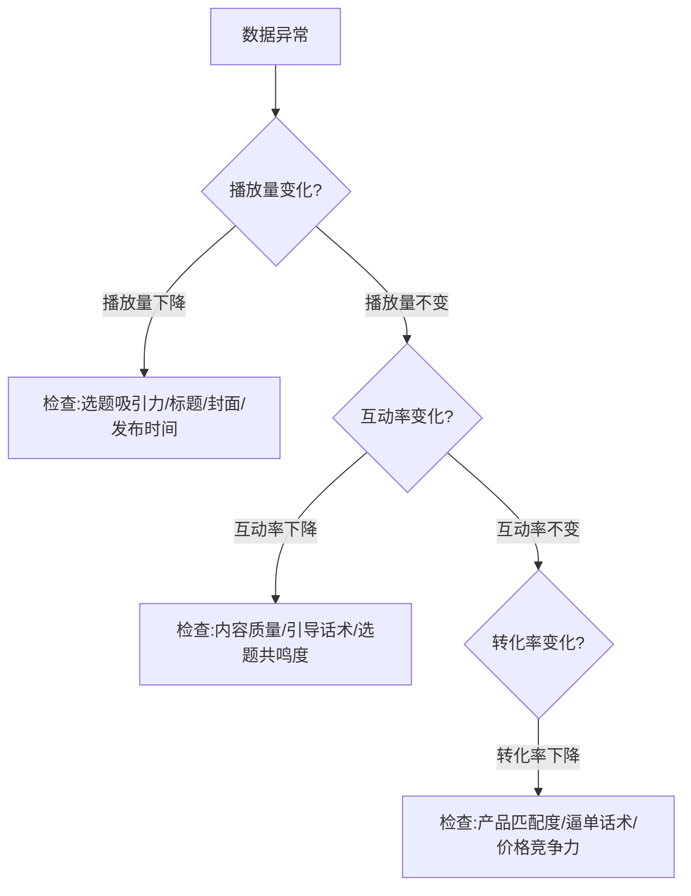
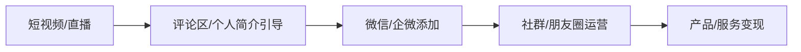
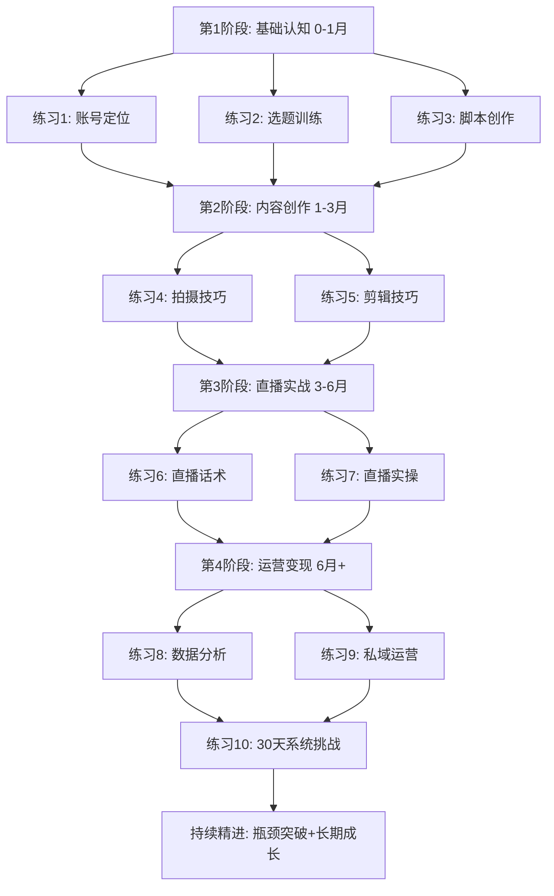

# 练习方法：短视频与直播变现实操训练体系

> 知识不经过练习就是信息，技能不经过重复就是幻觉。本章为你设计了一套从零基础到独立运营的完整训练体系，每个练习都包含明确的目标、可量化的标准、可复制的模板和可验证的成果。不要只是"看"，要"做"。

## 一、练习前的认知准备

### 1.1 为什么大多数人的练习无效

在开始任何练习之前，你需要理解一个核心概念：**刻意练习（Deliberate Practice）**。

心理学家安德斯·艾利克森（Anders Ericsson）在其研究中发现，顶尖表演者与普通人的差距不在于天赋，而在于练习的质量。刻意练习有四个关键要素：

```mermaid
graph TD
    A[刻意练习四要素] --> B[明确目标：每次练习聚焦一个具体技能点]
    A --> C[即时反馈：每次练习后立刻获得可操作的反馈]
    A --> D[难度适中：处于舒适区边缘的"拉伸区"]
    A --> E[大量重复：在正确方向上持续积累]
    B --> F[练习效果最大化]
    C --> F
    D --> F
    E --> F
```

大多数人练习短视频和直播时犯的错误：

| 错误做法 | 正确做法 | 效果差异 |
|----------|----------|----------|
| 随便拍随便发，"量大出奇迹" | 每次聚焦一个技能点（如开头钩子），刻意优化 | 前者100条原地踏步，后者10条有明显进步 |
| 看完教程觉得"我会了" | 看完立刻动手做，做完对照标准自查 | 知识留存率：前者<20%，后者>80% |
| 闷头做不看反馈 | 每条内容发布后24小时内分析数据 | 前者靠感觉，后者靠数据迭代 |
| 什么都想学，同时练10个技能 | 每周主攻1-2个技能点，逐个击破 | 前者焦虑且平庸，后者快速突破 |

### 1.2 练习的基本节奏

**每日最小练习量（保底线）：**

- 刷同领域优秀内容30分钟（输入）
- 记录3条可学习的选题或技巧（拆解）
- 完成1项与当前阶段匹配的练习任务（输出）

**每周标准练习量（目标线）：**

- 发布3-5条短视频（含选题、脚本、拍摄、剪辑全流程）
- 完成2-3小时直播练习（含复盘）
- 撰写1份周度数据复盘报告

**关键原则：** 宁可每天做30分钟高质量练习，也不要周末突击8小时低质量练习。习惯的力量远大于意志力。

### 1.3 练习效果自测基准

在开始正式练习前，用以下基准评估自己的起点水平，以便后续对比进步：

| 能力维度 | 入门（1分） | 初级（2分） | 中级（3分） | 高级（4分） | 精通（5分） |
|----------|-------------|-------------|-------------|-------------|-------------|
| 账号定位 | 没想好做什么 | 有模糊方向 | 清晰定位+人设 | 差异化定位+视觉体系 | 品牌化运营+IP矩阵 |
| 选题能力 | 随机选题 | 能跟热点 | 有选题库+方法论 | 爆款率>20% | 能创造选题趋势 |
| 脚本创作 | 不会写 | 套模板能写 | 能独立创作 | 脚本带节奏感 | 形成个人风格 |
| 拍摄剪辑 | 手机直拍 | 基础剪辑 | 稳定画面+节奏剪辑 | 电影感运镜+调色 | 商业级制作水准 |
| 直播能力 | 不敢开播 | 能说完一场 | 控场+互动+逼单 | 数据驱动优化 | 高转化直播间操盘 |
| 运营能力 | 不看数据 | 能看基础数据 | 数据分析+策略调整 | 全链路运营 | 多平台矩阵运营 |

建议你现在就打个分，记录下来。30天后再打一次分，你会看到实实在在的进步。

***

## 二、基础技能训练（练习1-3）

### 练习1：账号定位练习

**训练目标：** 用结构化方法完成账号定位，产出可执行的定位文档

**为什么这个练习排在第一位：** 账号定位决定了你后续所有努力的方向。定位不清，后面的内容创作、直播运营全部是低效甚至无效的。这就像开餐厅，你得先决定做什么菜系、服务什么人群，再考虑装修和菜单。

#### 步骤一：自我资源盘点（建议用时：1小时）

拿出纸笔或打开一个文档，逐项填写以下内容：

**专业资产盘点：**
- 我的职业/专业背景是什么？（列出所有，包括兼职、副业经历）
- 我在哪些领域比身边80%的人懂得多？
- 我解决过哪些别人经常来问我的问题？
- 我有哪些可展示的成果？（作品、数据、证书、客户案例）

**个人特质盘点：**
- 别人对我的第一印象通常是什么？（活泼/沉稳/搞笑/专业）
- 我说话有什么特点？（口头禅、语速、方言、表达习惯）
- 我有什么独特的外形特征或生活习惯？
- 我对什么事情最有热情，能不厌其烦地谈论？

**资源条件盘点：**
- 我每天能投入多少时间？（<1小时/1-2小时/2-4小时/4小时以上）
- 我的拍摄环境如何？（家里/办公室/户外/需要布置）
- 我有哪些可用的设备？（手机型号、灯光、麦克风）
- 我的预算范围？（0元/500元以内/2000元以内/5000元以上）

#### 步骤二：市场调研与对标分析（建议用时：2-3小时）

**调研方法：**

1. 打开抖音/快手/视频号，搜索你想做的领域关键词
2. 找到5-10个粉丝量在10万-100万的账号（不要只看头部大号，中小号更有参考价值）
3. 对每个账号填写以下分析表：

```text
对标账号分析表
━━━━━━━━━━━━━━━━━━━━━━━━━━━━
账号名称：_______________
平台：_______________
粉丝量：_______________
账号定位一句话：_______________
人设特点：_______________
内容形式：□口播 □剧情 □教程 □Vlog □混剪 □其他_______
更新频率：每周___条
爆款选题方向（列出3个）：
  1. _______________
  2. _______________
  3. _______________
变现方式：□带货 □广告 □知识付费 □引流 □其他_______
我值得学习的地方：_______________
我可以做得不同的地方：_______________
```

**调研的关键不是抄，而是找到缝隙。** 你要找的是：
- 这个领域有哪些需求没有被满足？
- 已有账号有哪些明显的短板？
- 你的个人特质能提供什么差异化的体验？

#### 步骤三：输出定位文档（建议用时：1小时）

根据前两步的分析，撰写一份定位文档，包含以下内容：

**定位公式（直接套用）：**

> 我是一个【人设标签】的【领域】博主，通过【内容形式】为【目标人群】提供【核心价值】，帮助他们解决【具体问题】。

**示例：**
> 我是一个说话直接、有点毒舌的职场博主，通过情景短剧为25-35岁的职场新人提供办公室生存指南，帮助他们少踩坑、快晋升。

**定位文档模板：**

```markdown
# 我的账号定位文档

## 一句话定位
（套用上面的公式）

## 目标用户画像
- 年龄：___岁 - ___岁
- 性别：___为主
- 城市：___线城市为主
- 职业/身份：_______________
- 核心痛点：_______________
- 核心需求：_______________
- 消费能力：月收入___元以上
- 活跃时间：___点 - ___点

## 人设设计
- 外在形象：_______________
- 说话风格：_______________
- 性格标签（3个）：___、___、___
- 视觉风格：主色调___，整体风格___

## 内容规划
- 内容大类（3-5个）：
  1. ___类：占比___%，示例选题___
  2. ___类：占比___%，示例选题___
  3. ___类：占比___%，示例选题___
- 更新频率：每周___条
- 内容形式：□口播 □剧情 □教程 □Vlog □混剪

## 差异化策略
我与同类账号的核心区别是：_______________
用户关注我的理由是：_______________
```

**验收标准：** 定位文档总字数不少于800字，每个字段都有具体内容，不允许出现"待定""还没想好"这样的空白。

***

### 练习2：爆款选题训练

**训练目标：** 建立可复用的选题系统，从"不知道拍什么"进化到"选题用不完"

**为什么选题如此重要：** 在短视频领域，选题决定了内容的天花板。一个好选题+一般制作，可能获得10万播放；一个烂选题+顶级制作，大概率不过500。选题是杠杆率最高的技能。

#### 第一阶段：建立选题感知力（第1-2周）

**每日任务：刷屏+拆解**

每天花30分钟刷同领域的短视频，但不是随便刷，而是带着问题刷：

1. **找到爆款：** 在抖音搜索你的领域关键词，按"最多点赞"排序，看近30天的内容
2. **逐条拆解：** 对每条爆款视频，回答以下问题：
   - 这条视频的选题本质是什么？（用一句话概括）
   - 它戳中了用户的什么情绪？（焦虑/好奇/愤怒/共鸣/向往）
   - 它的标题/开头是怎么吸引点击的？
   - 如果是我，我会怎么拍这个选题？
3. **记录归档：** 将拆解结果填入选题库表格

**选题库表格模板：**

| 编号 | 选题描述 | 来源账号 | 点赞量 | 情绪类型 | 适用场景 | 可改编性 | 备注 |
|------|----------|----------|--------|----------|----------|----------|------|
| 001 | "月薪5000如何在一线城市存下钱" | @xxx | 23.5万 | 焦虑+实用 | 口播 | 高 | 可改编为各城市版本 |
| 002 | ... | ... | ... | ... | ... | ... | ... |

**目标：** 两周内收集并拆解至少100条爆款选题。

#### 第二阶段：掌握选题方法论（第3-4周）

经过第一阶段的大量输入，你应该开始能感知到"什么样的选题容易爆"。现在用方法论来固化这种感知。

**六大爆款选题公式：**

| 公式名称 | 结构 | 示例 |
|----------|------|------|
| 反常识型 | 大家都以为A，其实B | "你以为的存钱方法全是错的" |
| 数字清单型 | N个方法/技巧/误区 | "99%的人不知道的5个Excel隐藏功能" |
| 对比冲突型 | A vs B / 前 vs 后 | "月入3千和月入3万的人，差距就在这个习惯" |
| 身份代入型 | 特定人群+痛点 | "30岁还没结婚的女生，过年回家怎么应对催婚" |
| 教程干货型 | 如何做/怎么做 | "手把手教你用手机拍出电影感" |
| 情绪共鸣型 | 共同经历+感受 | "工作5年才明白的那些道理" |

**每日练习：** 用每种公式各写2个选题（共12个），发布到你自己的选题库。不求每个都完美，重要的是练习"套公式生成选题"的能力。

#### 第三阶段：选题验证与迭代（持续进行）

**选题A/B测试法：**

1. 从选题库中选出3个你觉得最可能爆的选题
2. 用相同的拍摄和剪辑水平制作3条视频
3. 在同一时间段发布（建议工作日晚7-9点）
4. 24小时后对比数据，重点关注：
   - 完播率（反映选题吸引力）
   - 互动率（反映选题共鸣度）
   - 分享率（反映选题传播价值）
5. 记录结论：哪类选题数据最好？为什么？

**选题日历模板：** 建议建立一个每周选题执行日历，提前规划一周的选题：

```text
本周选题计划（_月_日 - _月_日）
━━━━━━━━━━━━━━━━━━━━━━━━━━━━━
周一：___选题（类型：___，预期效果：___）
周二：___选题（类型：___，预期效果：___）
周三：___选题（类型：___，预期效果：___）
周四：___选题（类型：___，预期效果：___）
周五：___选题（类型：___，预期效果：___）
周六：备用选题池：___、___、___
周日：数据复盘+下周选题规划
```

***

### 练习3：脚本创作训练

**训练目标：** 掌握至少3种短视频脚本结构，能独立完成从选题到脚本的全流程

**脚本是短视频的骨架。** 画面、声音、特效都是肉，脚本才是骨。没有好脚本，再好的拍摄和剪辑都是白费。

#### 阶段一：拆解优秀脚本（第1周）

选择10条你所在领域的爆款视频，逐帧逐句拆解其脚本结构。拆解模板如下：

```text
脚本拆解分析表
━━━━━━━━━━━━━━━━━━━━━━━━━━━━
视频标题：_______________
视频时长：___秒
总点赞：___

【时间轴拆解】
00:00-00:03 | 画面：___ | 台词/文字：___ | 作用：钩子（吸引停留）
00:03-00:08 | 画面：___ | 台词/文字：___ | 作用：建立问题/冲突
00:08-00:20 | 画面：___ | 台词/文字：___ | 作用：核心内容/解决方案
00:20-00:25 | 画面：___ | 台词/文字：___ | 作用：效果展示/结论
00:25-00:28 | 画面：___ | 台词/文字：___ | 作用：引导互动/关注

【脚本结构】
开头钩子类型：□悬念 □提问 □冲突 □数据 □反常识 □其他___
中间结构类型：□问题-方案 □对比-论证 □步骤教程 □故事叙事
结尾引导类型：□互动提问 □关注引导 □评论引导 □分享引导

【可学习之处】
___
___
```

#### 阶段二：模板仿写（第2周）

掌握以下三种核心脚本结构，每种结构仿写5个脚本：

**结构一：钩子-问题-方案-效果-引导（适用：干货教程类）**

```text
【钩子】（0-3秒）
"如果你还在用___，那你亏大了。"

【问题放大】（3-8秒）
"很多人___的时候，都会遇到___的问题，
不仅___，还___。"

【解决方案】（8-20秒）
"今天教你一个方法，只需要___步：
第一步，___。（配画面演示）
第二步，___。（配画面演示）
第三步，___。（配画面演示）"

【效果展示】（20-25秒）
"你看，用了这个方法之后，___。"

【引导互动】（25-28秒）
"觉得有用的话双击点赞收藏，关注我，
下期教你___。"
```

**结构二：冲突-故事-转折-启示（适用：情感共鸣类）**

```text
【冲突开场】（0-3秒）
"上周我做了一个让所有人反对的决定。"

【故事铺垫】（3-15秒）
"事情是这样的，___。
当时所有人都跟我说___，
但我心里一直有个声音___。"

【转折高潮】（15-22秒）
"结果___，
没想到___。"

【启示升华】（22-28秒）
"这件事让我明白了一个道理：___。
你有没有过类似的经历？评论区告诉我。"
```

**结构三：数据冲击-原因分析-方法论-行动号召（适用：观点输出类）**

```text
【数据冲击】（0-3秒）
"90%的人不知道，___。"

【原因分析】（3-12秒）
"为什么会这样？因为___。
第一，___。
第二，___。"

【方法论】（12-22秒）
"想要改变这个局面，你需要做到三点：
1. ___
2. ___
3. ___"

【行动号召】（22-28秒"
"从今天开始，试试这3个方法。
一个月后你会感谢今天的自己。
关注我，持续分享___。"
```

#### 阶段三：独立创作（第3周起持续）

每周独立创作3-5个完整脚本，遵循以下流程：

1. **选题确认**（5分钟）：从选题库中选择当日选题
2. **结构选择**（2分钟）：根据选题类型选择合适的脚本结构
3. **初稿撰写**（15-20分钟）：不求完美，先写出来
4. **精修打磨**（10分钟）：
   - 检查前3秒是否有足够的吸引力
   - 检查中间是否有信息冗余（删掉不影响理解的内容都删掉）
   - 检查结尾引导是否自然
   - 朗读一遍，检查是否通顺
5. **旁人审阅**（可选但推荐）：发给朋友看，问"看完想不想点赞/关注"

**脚本字数参考：** 短视频口播语速约每分钟250-300字。一条30秒的视频，脚本控制在120-150字；一条60秒的视频，控制在250-300字。宁可少说，不要说满。

***

## 三、内容创作实操训练（练习4-5）

### 练习4：拍摄技巧训练

**训练目标：** 用手机拍出专业级画面，不依赖昂贵设备

**核心理念：** 短视频拍摄不需要电影级设备，一台手机+一个补光灯+一个领夹麦就能覆盖90%的场景。关键在于掌握基本功，而不是堆设备。

#### 基础拍摄训练（第1-2周）

**训练1：画面稳定性**

目标：手持拍摄30秒无明显抖动的视频

练习方法：
1. 双手持机，手肘夹紧身体两侧，形成稳定三角
2. 用手机原生相机拍摄，不使用任何稳定器
3. 拍摄固定场景（如桌面、窗外），保持30秒不动
4. 回放检查：画面是否有明显晃动？呼吸起伏是否明显？
5. 进阶：边走边拍，保持画面稳定

**训练2：构图能力**

每天拍5张照片/5段10秒视频，刻意练习以下构图：

| 构图方法 | 适用场景 | 操作要点 |
|----------|----------|----------|
| 三分法 | 人物出镜、风景 | 将人物眼睛放在上三分线处 |
| 居中构图 | 产品展示、口播 | 人物/产品放正中间，背景干净 |
| 引导线构图 | 场景展示 | 利用道路、走廊等线条引导视线 |
| 框架构图 | 增加层次感 | 用门窗、树枝等形成自然框架 |
| 对角线构图 | 动感画面 | 将主体沿对角线放置 |

**训练3：光线运用**

目标：理解光线对画面质量的影响，学会利用自然光

练习方法：
1. 同一个场景，在不同时段拍摄（早晨/中午/下午/阴天/晴天）
2. 对比顺光、侧光、逆光的效果差异
3. 找到你拍摄环境中的最佳光线位置和时段
4. 如果用补光灯：练习主灯+辅灯的基本布局（主灯45度角，辅灯补阴影）

**训练4：声音采集**

目标：确保人声清晰、无杂音

练习方法：
1. 分别用手机内置麦克风和外接领夹麦录制同一段话，对比音质差异
2. 在不同环境中测试：安静房间、有空调的房间、户外
3. 测试不同距离：30cm、50cm、1m，找到最佳收音距离
4. 录制后用耳机回听，检查是否有底噪、喷麦、爆音

#### 进阶拍摄训练（第3-4周）

**训练5：产品展示拍摄**

目标：能拍出让人想买的商品视频

核心技巧：
- **45度俯拍：** 最经典的商品展示角度，适用于大多数产品
- **平拍特写：** 展示产品细节、材质、质感
- **动态展示：** 产品使用过程的跟拍，增加代入感
- **对比展示：** 使用前后对比、与竞品对比

每日练习：选一个身边的产品（杯子、手机壳、零食均可），用3种不同角度各拍一段10秒视频。

**训练6：出镜表达训练**

目标：面对镜头自然、有感染力

练习方法：
1. **镜前脱敏：** 每天对着手机镜头说3分钟话（读稿也行），坚持一周直到不紧张
2. **眼神训练：** 看镜头而非屏幕，录制时在镜头旁贴个小贴纸当"眼神焦点"
3. **语速控制：** 正常语速录制一段话，再用慢20%的语速录制一遍，对比哪个更好
4. **表情管理：** 录制时微笑，但不要僵硬的"假笑"——想一件开心的事，自然带出笑容
5. **手势运用：** 在关键词处配合手势，增强表达力

**练习要求：**
- 每天拍摄至少10分钟素材
- 每周完成3条完整短视频的拍摄
- 每周回看本周所有素材，标注"好镜头"和"需改进的镜头"

***

### 练习5：剪辑技巧训练

**训练目标：** 掌握短视频剪辑的核心技能，让素材变成有节奏感的成品

**工具选择建议：**

| 工具 | 适用平台 | 优势 | 学习成本 |
|------|----------|------|----------|
| 剪映（手机） | 全平台 | 模板丰富、AI功能强、免费 | 低 |
| 剪映专业版（电脑） | 全平台 | 效率高、精细控制 | 中 |
| Premiere Pro | 全平台 | 专业级、插件生态丰富 | 高 |
| Final Cut Pro | 仅Mac | 流畅、磁力时间线 | 中高 |
| CapCut（海外版剪映） | TikTok | 国际化、英文模板 | 低 |

**建议：** 新手从剪映手机版起步，熟练后转剪映电脑版。不必一上来就学Premiere Pro，那是杀鸡用牛刀。

#### 基础剪辑训练（第1-2周）

**训练1：粗剪能力**

目标：能在15分钟内完成一条30秒视频的粗剪

练习流程：
1. 导入素材，浏览全部素材，标记"好镜头"
2. 按脚本顺序排列素材
3. 切掉每个镜头的头尾废片（开头犹豫、结尾松懈的部分）
4. 调整镜头顺序，确保叙事流畅
5. 检查总时长，删掉不影响理解的冗余片段

**训练2：节奏剪辑**

目标：让画面切换与音乐节奏/信息节奏匹配

练习方法：
1. 找一首节奏感强的BGM（剪映素材库有大量选择）
2. 用剪映的"踩点"功能标记音乐节拍
3. 将画面切换点对齐到节拍点
4. 对比"踩点剪辑"和"随意剪辑"的观感差异
5. 练习不同节奏的BGM：快节奏（卡点视频）、中节奏（教程）、慢节奏（情感）

**训练3：字幕设计**

目标：字幕清晰美观，增强信息传达

练习要点：
- 使用剪映的自动识别字幕功能，然后手动校对（AI识别准确率约90%，需要人工修正）
- 字幕字号：不小于屏幕宽度的1/15
- 字幕位置：通常在画面下方1/5处，避免遮挡关键画面
- 重点词高亮：用不同颜色或加粗标注关键词
- 字幕样式：选择简洁风格，避免花哨的动画效果分散注意力

**训练4：封面制作**

目标：制作能吸引点击的视频封面

封面制作三要素：
1. **主体突出：** 人脸或产品占封面面积的30%以上
2. **文字精炼：** 封面文字不超过10个字，字号要大
3. **色彩对比：** 文字颜色与背景形成强烈对比

每日练习：为当天发布的视频制作3版封面，选择点击欲望最强的一版。

#### 进阶剪辑训练（第3-4周）

**训练5：转场运用**

掌握5种最常用的转场技巧：

| 转场类型 | 使用场景 | 剪映操作方法 |
|----------|----------|--------------|
| 硬切 | 快节奏内容、同场景不同角度 | 直接拼接，无需特效 |
| 遮罩转场 | 场景切换、视觉冲击 | 使用剪映"转场"中的遮罩效果 |
| 推拉缩放 | 强调细节、突出重点 | 关键帧动画，设置缩放参数 |
| 甩镜转场 | 动感内容、Vlog | 前镜头末尾+后镜头开头各加几帧甩动 |
| 声音先入 | 叙事连贯性 | 下一个画面的声音提前0.5-1秒出现 |

**核心原则：** 转场是为叙事服务的，不是炫技。一条30秒的视频，转场不超过3种。大多数情况下，硬切就是最好的转场。

**训练6：调色基础**

目标：让视频画面更有质感

在剪映中练习以下调色流程：
1. **亮度调整：** 画面过暗则提亮，过曝则压暗
2. **对比度：** 适当增加对比度，让画面更"通透"
3. **饱和度：** 美食类适当增加，知识类适当降低
4. **色温：** 暖色调更亲切，冷色调更专业
5. **滤镜：** 选择一个风格统一的滤镜，贯穿你的所有视频，形成视觉一致性

**练习要求：**
- 每周完成3条视频的完整剪辑
- 每周学习并运用1-2个新的剪辑技巧
- 建立自己的剪辑模板（固定字幕样式、固定转场风格、固定滤镜参数），提高效率

***

## 四、直播技能训练（练习6-7）

### 练习6：直播话术训练

**训练目标：** 掌握直播各环节的核心话术，做到张口就来

**为什么话术如此关键：** 直播是实时的，没有时间让你想词。话术必须练到"肌肉记忆"的程度，才能在直播中自然流畅地表达。

#### 开场话术（决定观众是否留下）

**核心公式：** 欢迎+利益预告+互动引导

**5种开场模板，逐个练习：**

**模板1：福利开场**
```text
"家人们好，欢迎来到直播间！今天给你们准备了3波福利，
第一波是__，第二波是__，第三波先保密，
在直播间待够10分钟的都有机会，先点个关注不迷路！"
```

**模板2：痛点开场**
```text
"还在为___烦恼吗？今天这场直播，我用一个小时帮你解决这个问题。
我做了___年___，踩过的坑、花过的冤枉钱，
今天全部分享给你们，先点个关注，一会儿要考的。"
```

**模板3：悬念开场**
```text
"家人们，今天我要公布一个__的秘密，
这个方法让我___（结果），但是99%的人不知道。
人少的时候先不说，等人多了再揭秘，先点个关注。"
```

**模板4：故事开场**
```text
"昨天有个粉丝私信我，说___（故事），
我一想，这个问题肯定很多人都有，所以今天专门开一场直播来讲。
有同样问题的扣个1，我看看有多少人。"
```

**模板5：数据开场**
```text
"上一场直播，有个产品3分钟卖了___单，
很多没抢到的粉丝一直在问什么时候返场。
今天它来了，而且今天的价格比上次还低！想知道是什么的扣'想要'。"
```

**练习方法：** 每种模板写3个不同版本（填入不同内容），对着镜子大声练习。每种模板至少练习到能脱稿流畅说出为止。

#### 产品介绍话术（决定观众是否下单）

**FABE法则：**

| 要素 | 含义 | 话术框架 |
|------|------|----------|
| Feature（特征） | 产品是什么 | "这款___，它采用了___技术/材质" |
| Advantage（优势） | 比别人好在哪 | "和普通___相比，它___" |
| Benefit（利益） | 对你有什么好处 | "用了它之后，你会发现___" |
| Evidence（证据） | 凭什么相信我 | "你看这个检测报告/用户评价/我自己用的效果" |

**练习方法：** 选3个你未来可能带的产品（先用日用品模拟），用FABE法则为每个产品写一份完整的介绍话术，然后对着镜头练习。每份话术控制在60-90秒。

#### 逼单话术（决定观众是否现在下单）

**四大逼单技巧：**

| 技巧 | 原理 | 话术示例 |
|------|------|----------|
| 价格锚定 | 先报高价再报低价，让观众感觉赚到了 | "这款专柜价___，某猫价___，今天直播间只要___！" |
| 限时限量 | 制造稀缺感，降低决策时间 | "这个价格只有今天直播间有，限量___份，卖完恢复原价" |
| 从众心理 | 利用群体行为影响个体决策 | "已经有___个家人下单了，还在犹豫的赶紧，别一会儿没货了" |
| 零风险承诺 | 消除顾虑，降低决策门槛 | "7天无理由退换，运费险我们出，不喜欢退回来，一分钱不用你花" |

**练习方法：** 每种技巧写5组话术变体，大声练习直到自然流畅。可以录制视频回看，检查自己的语气是否有感染力。

#### 每日话术训练计划

```text
每日30分钟话术训练安排
━━━━━━━━━━━━━━━━━━━━━
00:00-05:00 | 热身：大声朗读一段新闻/文章，活动面部肌肉
05:00-10:00 | 开场话术：随机抽一种模板，即兴填充内容并大声说出来
10:00-15:00 | 产品话术：选一个产品，用FABE法则即兴讲解
15:00-20:00 | 逼单话术：随机抽取一种逼单技巧，即兴编造话术
20:00-25:00 | 综合演练：模拟一场5分钟的完整直播片段
25:00-30:00 | 回看录像，记录需要改进的地方
```

***

### 练习7：直播实操训练

**训练目标：** 通过4周的系统训练，从"不敢开播"到"能独立完成一场完整的直播"

#### 第一周：开播准备

**Day 1-2：直播间搭建**

你需要准备的最低配置：

| 设备 | 最低配置 | 推荐配置 | 预算参考 |
|------|----------|----------|----------|
| 手机/相机 | 智能手机（iPhone 12以上或同级安卓） | 手机+外接摄像头或微单 | 0-3000元 |
| 补光灯 | 环形补光灯1个 | 主灯+辅灯+背景灯 | 50-500元 |
| 麦克风 | 手机内置麦克风 | 领夹无线麦 | 0-300元 |
| 背景 | 干净的白墙 | 专业背景布+置景 | 0-200元 |
| 支架 | 手机支架 | 专业直播支架+提词器 | 20-200元 |

**直播间布置检查清单：**
- [ ] 光线充足均匀，脸上无明显阴影
- [ ] 背景干净整洁，无杂物
- [ ] 网络稳定（有线网络优先，WiFi至少100Mbps以上）
- [ ] 手机充满电+接充电线
- [ ] 关闭手机通知，避免直播中弹出消息
- [ ] 准备好提词器或话术提纲

**Day 3-4：设备调试与试播**

1. 开一场仅自己可见的试播（抖音：设置→隐私→谁可以看我的直播→仅自己）
2. 测试画面：检查构图、光线、画质
3. 测试声音：检查收音是否清晰、音量是否合适
4. 测试网络：直播30分钟，观察是否有卡顿
5. 测试互动：模拟回复弹幕，熟悉直播间的操作界面

**Day 5-7：进行2-3场正式试播**

- 每场直播时长：30-60分钟
- 目标：不是卖货，而是"能在镜头前流畅说话30分钟"
- 内容：介绍自己、分享干货、与观众聊天
- 重点关注：语速是否正常、是否有长时间停顿、是否紧张

#### 第二周：基础训练

**每日直播任务：**

```text
直播时长：1-2小时
直播内容：干货分享+产品介绍（即使没有真实产品，也要练习话术流程）
直播后复盘：观看回放，填写以下复盘表
```

**直播复盘表：**

```text
直播日期：___    时长：___    观看人数：___    最高在线：___

【开场评估】
开场前3分钟在线人数变化：___（上升/持平/下降）
开场话术效果：___（哪些话术引发了互动？哪些没有反应？）

【内容评估】
哪个话题互动最多：___
哪个话题观众流失：___
有没有冷场？在什么时候？持续多久：___

【话术评估】
产品介绍是否流畅：___
逼单话术是否自然：___
有没有"卡壳"的时刻：___

【互动评估】
回复弹幕的速度：___（及时/延迟/遗漏）
互动引导的效果：___（扣1/点赞/关注的执行率）

【改进计划】
下次直播要改进的3个点：
1. ___
2. ___
3. ___
```

#### 第三周：进阶提升

在基础训练的基础上，增加以下进阶训练：

1. **节奏控制训练：** 学习"干货-互动-福利-干货"的循环节奏，每15-20分钟设置一个高潮点（抽奖、秒杀、揭秘）
2. **突发情况应对训练：** 模拟以下场景并练习应对——
   - 黑粉/杠精出现在弹幕：保持微笑，不正面冲突，"这位朋友说得也有道理，不过我分享的是我的经验"
   - 冷场（没人说话）：准备3-5个"冷场救急"话题，随时调用
   - 技术故障（掉线、声音断）：提前准备好文字版公告，恢复后快速拉回状态
3. **投流基础：** 了解直播间的付费推广工具（抖音：千川投放），学习基础的投放逻辑——先小预算测试（100元/天），找到ROI为正的投放模型再加大

#### 第四周：总结优化

1. 整理4周的所有直播数据，制作趋势图
2. 总结出3-5条你验证有效的直播技巧
3. 制定标准化的直播SOP（标准操作流程）：

```text
直播SOP模板
━━━━━━━━━━━━━━━━━━━━━━━━━━━━

【开播前2小时】
□ 确认选品和话术
□ 检查设备和网络
□ 发布直播预告（短视频/社群）

【开播前30分钟】
□ 开启直播间，调整画面和声音
□ 准备提词器/话术提纲
□ 测试商品链接

【开播中】
□ 前10分钟：暖场+互动+福利预告
□ 10-30分钟：第一轮产品讲解+逼单
□ 30-40分钟：互动+抽奖/福利
□ 40-60分钟：第二轮产品讲解+逼单
□ 60分钟+：循环以上节奏

【下播后】
□ 记录核心数据到复盘表
□ 回看30分钟回放，标记问题点
□ 回复未处理的粉丝消息
□ 更新下一场的优化计划
```

***

## 五、运营能力训练（练习8-9）

### 练习8：数据分析训练

**训练目标：** 养成数据驱动的运营习惯，用数据而非直觉指导决策

**为什么数据能力是核心竞争力：** 短视频和直播不是玄学，而是一门可以被量化的生意。能读懂数据的人，就像能看懂体检报告的医生——知道哪里有问题，知道怎么治。

#### 建立数据追踪体系

**核心数据指标：**

| 数据维度 | 具体指标 | 含义 | 健康基准 |
|----------|----------|------|----------|
| 内容数据 | 播放量 | 内容被多少人看到 | 新号单条>500为正常 |
| | 完播率 | 看完视频的人占比 | 30秒视频>40%为合格 |
| | 点赞率 | 点赞数/播放量 | >3%为合格 |
| | 评论率 | 评论数/播放量 | >0.5%为合格 |
| | 分享率 | 分享数/播放量 | >1%为优秀 |
| 粉丝数据 | 日增粉数 | 每天新增粉丝 | 持续正值为健康 |
| | 粉丝画像 | 年龄/性别/地域分布 | 与目标用户画像匹配 |
| | 粉丝活跃度 | 活跃粉丝占比 | >30%为健康 |
| 直播数据 | 观看人数 | 进入直播间的人数 | 稳定增长为健康 |
| | 平均在线 | 平均同时在线人数 | 反映内容吸引力 |
| | 互动率 | 互动人数/观看人数 | >5%为合格 |
| | GPM | 千次观看成交额 | >500元为合格 |
| 变现数据 | 场均GMV | 单场直播成交额 | 持续增长为健康 |
| | 转化率 | 成交人数/观看人数 | >2%为合格 |
| | 客单价 | 平均每单金额 | 根据品类不同而异 |
| | ROI | 投入产出比 | >2为健康 |

**数据记录工具：** 建议使用Excel或飞书多维表格，建立一个数据追踪表，每天更新。

**每日数据记录模板：**

```text
日期：___    平台：___

短视频数据：
| 序号 | 选题 | 播放量 | 完播率 | 点赞 | 评论 | 分享 | 备注 |
|------|------|--------|--------|------|------|------|------|
| 1    |      |        |        |      |      |      |      |

直播数据：
| 场次 | 时长 | 观看 | 最高在线 | 互动率 | GMV | 转化率 | 备注 |
|------|------|------|----------|--------|-----|--------|------|
| 1    |      |      |          |        |     |        |      |
```

#### 数据分析方法

**分析框架：对比法**

单一数据没有意义，数据的价值在于对比：

1. **纵向对比：** 本周 vs 上周，本月 vs 上月，发现趋势
2. **横向对比：** 不同选题之间的数据对比，找到高产选题类型
3. **对标对比：** 你的数据 vs 同领域优秀账号的数据，找到差距

**分析框架：归因法**

当数据出现波动时，用以下框架归因：



**每周分析报告模板：**

```markdown
# 第__周数据分析报告

## 一、核心数据概览
- 本周发布视频：__条，总播放量：__
- 本周直播：__场，总GMV：__
- 粉丝净增：__人

## 二、内容数据分析
- 播放量最高的一条：___，原因分析：___
- 播放量最低的一条：___，原因分析：___
- 本周爆款选题类型：___

## 三、直播数据分析
- 数据最好的一场：___，关键动作：___
- 数据最差的一场：___，问题分析：___

## 四、本周关键发现
1. ___
2. ___
3. ___

## 五、下周优化计划
1. ___
2. ___
3. ___
```

***

### 练习9：私域运营训练

**训练目标：** 将公域流量沉淀为私域资产，建立可持续的变现基础

**为什么要做私域：** 公域流量是"租"来的，平台算法一变就可能归零。私域流量是"自己"的，不受算法影响。一个1000人的精准私域社群，其商业价值可能大于10万泛粉。

#### 第一步：引流路径设计（第1周）

设计从公域到私域的引流路径：



**引流话术设计：**
- 个人简介栏：写明"加V领取___"（提供有价值的钩子）
- 评论区引导：回复"想要的私信我"而非直接留微信号
- 直播间引导：设置"关注+私信领取资料"的互动环节

**注意：** 各平台对引流到私域都有不同程度的限制，抖音最严格。话术中不要出现"微信""加V"等敏感词，可以用"私信""粉丝群"等替代。

#### 第二步：社群搭建与运营（第2-3周）

**社群定位：** 社群不是"聊天群"，而是有明确价值主张的用户组织。

```text
社群定位模板
━━━━━━━━━━━━━━━━━━━━━━━━━━━━
社群名称：___
社群价值：加入这个群你能获得___
社群规则：
  1. ___
  2. ___
  3. ___
入群门槛：□关注账号 □消费满___元 □邀请制 □无门槛
日常内容：
  - 早间：___
  - 午间：___
  - 晚间：___
活动安排：
  - 每周___：___活动
  - 每月___：___活动
```

**社群日常运营节奏：**

| 时间段 | 内容 | 目的 |
|--------|------|------|
| 早8:00 | 早安+今日干货/资讯 | 保持活跃度 |
| 午12:00 | 话题讨论/投票 | 增强参与感 |
| 晚20:00 | 互动问答/经验分享 | 深化信任关系 |
| 直播前1小时 | 直播预告+福利预告 | 引流到直播间 |

#### 第三步：转化体系搭建（第4周）

**社群变现模型：**

| 变现方式 | 适用场景 | 操作方法 |
|----------|----------|----------|
| 好物推荐 | 有供应链资源 | 群内发布产品信息+专属优惠码 |
| 知识付费 | 有专业知识 | 推出付费课程/训练营/1对1咨询 |
| 社群付费 | 有强IP | 建立付费会员群，提供独家内容和服务 |
| 活动变现 | 有本地资源 | 组织线下活动/团购/联名 |

**关键原则：** 社群中80%的时间提供价值，20%的时间做变现。反过来做，群就死了。

***

## 六、综合实战训练（练习10）

### 练习10：30天系统挑战计划

**训练目标：** 用30天的时间，完成从"什么都不懂"到"能独立运营一个账号"的跨越

#### 完整日程表

**第一周：基础建设（Day 1-7）**

| 天数 | 上午任务（1-2小时） | 下午任务（1-2小时） | 晚间任务（1小时） |
|------|---------------------|---------------------|-------------------|
| Day 1 | 完成自我资源盘点 | 刷同领域爆款30条 | 记录拆解笔记 |
| Day 2 | 完成市场调研（5个对标账号分析） | 继续调研+选题库初始化 | 撰写定位文档初稿 |
| Day 3 | 完善定位文档 | 学习平台规则（抖音创作者中心） | 注册账号+完成基础设置 |
| Day 4 | 设计账号头像、简介、背景图 | 学习同领域账号的装修风格 | 完成账号装修 |
| Day 5 | 脚本拆解练习（拆3条爆款） | 学习剪映基础操作 | 完成第1个练习视频（不发布） |
| Day 6 | 脚本拆解练习（拆3条爆款） | 拍摄练习：稳定性+构图 | 完成第2个练习视频 |
| Day 7 | 本周复盘+下周计划 | 补充选题库（目标50条） | 整理笔记和模板 |

**第二周：内容起步（Day 8-14）**

| 天数 | 核心任务 | 练习重点 |
|------|----------|----------|
| Day 8 | 发布第1条视频 | 不求完美，完成比完美重要 |
| Day 9 | 分析第1条视频数据 | 学习看数据后台 |
| Day 10 | 发布第2条视频（不同选题类型） | 测试不同选题方向 |
| Day 11 | 发布第3条视频 | 练习不同的脚本结构 |
| Day 12 | 对比3条视频数据 | 哪种选题/形式效果更好？ |
| Day 13 | 发布第4条视频+直播话术练习 | 对着镜子练30分钟话术 |
| Day 14 | 本周复盘：4条视频数据分析 | 总结发现，调整下周策略 |

**第三周：直播实战（Day 15-21）**

| 天数 | 核心任务 | 练习重点 |
|------|----------|----------|
| Day 15 | 搭建直播间+设备调试 | 完成所有硬件准备 |
| Day 16 | 第1场直播（30-60分钟） | 只求完成，不求完美 |
| Day 17 | 回看直播回放+复盘 | 标记3个改进点 |
| Day 18 | 第2场直播（1-1.5小时） | 重点改进上次的问题 |
| Day 19 | 继续发布短视频（直播和短视频并行） | 内容+直播双线运营 |
| Day 20 | 第3场直播+尝试互动和逼单话术 | 加入产品介绍环节 |
| Day 21 | 本周复盘：直播数据+短视频数据 | 总结直播技巧和改进方向 |

**第四周：运营优化（Day 22-30）**

| 天数 | 核心任务 | 练习重点 |
|------|----------|----------|
| Day 22 | 深度数据分析 | 制作数据趋势图 |
| Day 23 | 根据数据优化选题和内容策略 | 数据驱动的优化 |
| Day 24 | 第4场直播（优化后的版本） | 验证优化效果 |
| Day 25 | 搭建私域社群 | 设计引流路径 |
| Day 26 | 尝试商业化（挂商品链接/接广告/引流变现） | 迈出变现第一步 |
| Day 27 | 继续内容+直播 | 保持节奏 |
| Day 28 | 第5场直播（完整的SOP流程） | 标准化运营 |
| Day 29 | 整理所有数据和经验 | 撰写30天总结报告 |
| Day 30 | 制定下一阶段计划 | 设定3个月目标 |

#### 挑战规则

1. **每日打卡：** 完成当天任务后在记录表中打卡
2. **数据记录：** 每天记录核心数据（播放、点赞、粉丝、直播数据）
3. **每周复盘：** 每周日进行1小时深度复盘
4. **允许调整：** 计划不是死的，根据实际数据灵活调整
5. **不许中断：** 连续30天不中断，即使状态不好也发一条内容

#### 30天总结报告模板

```markdown
# 30天挑战总结报告

## 一、核心数据
- 30天发布视频：__条
- 30天直播：__场，总时长__小时
- 总播放量：__
- 粉丝从__增长到__
- 总变现收入：__元

## 二、最大收获
1. ___
2. ___
3. ___

## 三、最大教训
1. ___
2. ___
3. ___

## 四、能力自评（对照第一章的自测基准打分）
| 维度 | 第1天 | 第30天 | 进步 |
|------|-------|--------|------|
| 账号定位 | 分 | 分 | |
| 选题能力 | 分 | 分 | |
| 脚本创作 | 分 | 分 | |
| 拍摄剪辑 | 分 | 分 | |
| 直播能力 | 分 | 分 | |
| 运营能力 | 分 | 分 | |

## 五、下一阶段计划（3个月目标）
- 月目标：___
- 内容策略：___
- 变现目标：___
- 需要学习的技能：___
```

***

## 七、进阶训练与长期成长

### 7.1 常见瓶颈及突破方法

在持续练习的过程中，你几乎必然会遇到以下瓶颈：

| 瓶颈期 | 典型表现 | 突破方法 |
|----------|----------|----------|
| 冷启动期（0-100粉） | 发了20条视频，播放量一直在500以下 | 增加发布频率到每天1条；模仿爆款选题但加入个人特色；用DOU+小额测试（50元/条） |
| 内容疲劳期（1-3个月） | 感觉什么都拍过了，不知道拍什么 | 回到选题库重新梳理；跨领域找灵感；与粉丝互动收集需求 |
| 流量停滞期（1000-1万粉） | 粉丝增长明显变慢 | 分析近期爆款和低产内容的差异；尝试新的内容形式；优化发布时段 |
| 变现困难期 | 有粉丝但不知道怎么赚钱 | 研究同类账号的变现路径；从最低门槛的变现方式开始（如好物推荐）；先服务好100个铁粉 |
| 倦怠期 | 不想更新，觉得没意思 | 回顾初心和目标；降低更新频率但不中断；加入创作者社群互相激励 |

### 7.2 持续精进的学习资源

**推荐学习渠道：**

| 渠道 | 内容 | 适合阶段 |
|------|------|----------|
| 抖音创作者学习中心 | 官方教程，平台规则和功能更新 | 全阶段 |
| 飞瓜数据/蝉妈妈 | 行业数据、竞品分析、爆款追踪 | 有一定基础后 |
| B站搜索"短视频运营" | 免费的系统教程 | 入门到中级 |
| 知识星球/付费社群 | 实操经验分享、资源对接 | 进阶阶段 |
| 行业报告（艾瑞/QuestMobile） | 行业趋势、用户数据 | 策略规划阶段 |

### 7.3 从练习者到从业者的心态转变

当你完成了以上所有练习，你已经不再是"新手"了。但要从一个"会做短视频的人"变成一个"靠短视频赚钱的人"，还需要一次心态转变：

- **从"我要创作"到"我要服务"：** 不是表达自我，而是解决用户的问题
- **从"追求完美"到"追求迭代"：** 一条60分的视频发出去，比一条90分的视频永远在草稿箱有价值
- **从"关注数据"到"理解数据"：** 数据不是用来焦虑的，而是用来指导下一步行动的
- **从"单打独斗"到"借力成长"：** 找到同行者，加入创作者社群，互相学习、互相激励

***

## 练习总结

### 学习路径总览



### 练习核心要点

1. **完成比完美重要：** 先做出来，再做好，最后做精
2. **数据比感觉可靠：** 每次练习都要有数据反馈，用数据指导优化
3. **聚焦比发散高效：** 同一时间主攻1-2个技能点，不要贪多
4. **持续比突击有效：** 每天30分钟，好过周末突击8小时
5. **复盘比练习更重要：** 做完不复盘，等于白做。每次练习后花10分钟总结收获和改进点

> 最后一句话：短视频和直播是一项技能，和游泳、骑车一样，看再多教程都不如跳下水扑腾几下。现在就打开手机，开始你的第一条练习视频。
