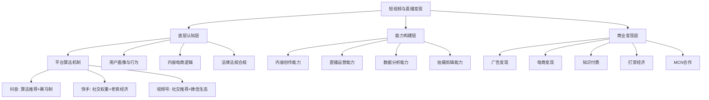
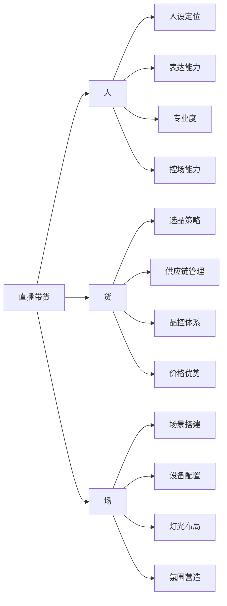
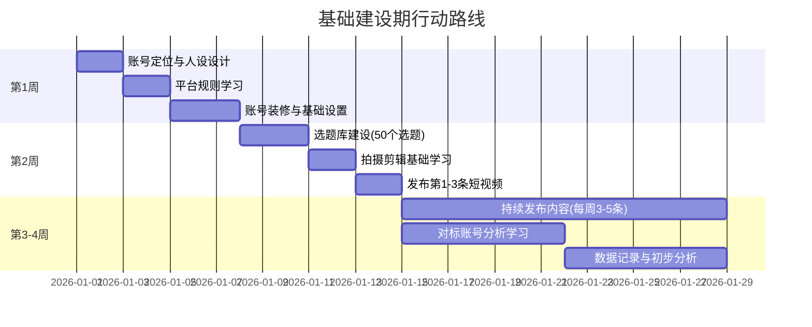

# 本章小结：短视频与直播变现核心要点回顾

本章从理论基础、核心技巧、实战案例、常见误区、练习方法、深度拓展六个维度，系统构建了短视频与直播变现的完整知识体系。本小结将提炼关键框架、整合核心方法论、梳理行动路径，帮助你将零散知识点串联为可执行的变现能力。

---

## 一、知识架构总览

短视频与直播变现的本质是**"内容驱动的流量变现"**——用优质内容获取精准流量，通过多元化商业模式将流量转化为收入。整个体系可以归纳为三层架构：



### 三层之间的递进关系

| 层级 | 核心问题 | 对应模块 | 学习重点 |
|------|----------|----------|----------|
| 底层认知层 | 为什么要这样做？ | 理论基础 | 理解算法逻辑、用户行为、商业本质 |
| 能力构建层 | 怎样做到？ | 核心技巧+练习方法 | 掌握可落地的实操方法论 |
| 商业变现层 | 如何持续赚钱？ | 实战案例+深度拓展 | 建立可复现的变现闭环 |

**核心原则**：先建立认知框架，再打磨实操能力，最后构建变现体系。跳过任何一层都会导致后续动作变形——不懂算法就做内容是蒙眼开车，有流量不变现是守着金矿要饭。

---

## 二、核心知识点回顾

### 2.1 平台算法与流量分发机制

三大平台的算法逻辑截然不同，直接决定了内容策略和运营打法：

| 维度 | 抖音 | 快手 | 视频号 |
|------|------|------|--------|
| **流量分配逻辑** | 去中心化赛马制 | 社交权重+公平分发 | 社交推荐为主 |
| **核心考核指标** | 完播率 > 互动率 > 转化率 | 点击率 > 粉丝互动 > 完播率 | 社交互动 > 完播率 |
| **流量池机制** | 200→5000→10万→100万→1000万 | 双列点选+同城推荐 | 社交裂变+搜一搜推荐 |
| **核心用户画像** | 25-35岁，一二线城市 | 下沉市场60%，重性价比 | 30-50岁，消费力强 |
| **内容调性** | 精致、创新、有节奏感 | 真实、接地气、有温度 | 深度、专业、有社交价值 |
| **变现优势** | 广告+电商流量大 | 信任度高、复购率高 | 私域转化率高、客单价高 |

**算法深度认知**（来自深度拓展模块）：

- **协同过滤**：平台通过分析用户行为模式相似性进行内容推荐，不需要理解内容本身
- **内容理解**：平台通过CV和NLP技术对视频画面、语音、文字进行多维度标签化
- **冷启动保护**：新账号有7-14天新手保护期，期间获得更高初始曝光
- **老号重启策略**：连续7-10天正常互动养号→发布3-5条高质量内容重建权重
- **算法趋势**：从纯兴趣推荐向"兴趣+社交"混合推荐转变；从即时反馈向长期价值转变

**关键数据阈值参考**：

| 指标 | 进入下一级流量池的参考阈值 | 优秀水平 |
|------|--------------------------|----------|
| 完播率 | >30% | >45% |
| 点赞率 | >3% | >5% |
| 评论率 | >0.5% | >1% |
| 转发率 | >0.3% | >0.8% |
| 关注率 | >1% | >3% |

> **注意**：不同内容类型的基准线不同。知识类内容完播率通常低于娱乐类，但评论率和收藏率更高，算法会根据内容类型调整评估标准。

### 2.2 内容创作方法论

#### 爆款内容的底层逻辑

爆款内容的本质是**情绪价值的高效传递**。用户在刷短视频时处于"低投入、高期待"的状态，任何不能在3秒内抓住注意力的内容都会被划走。

**HOOK-BODY-CTA框架**（核心创作框架）：

```text
┌─────────────────────────────────────────────────────────┐
│  HOOK（0-3秒）：设置强钩子，抓住注意力                     │
│  ├── 悬念式："你知道为什么90%的人都做错了这件事吗？"        │
│  ├── 反差式："月薪3000的我，住进了3000万的豪宅"            │
│  ├── 痛点式："每次拍照都显胖？因为你不知道这个技巧"         │
│  └── 数字式："3个方法让你的直播间在线人数翻10倍"            │
├─────────────────────────────────────────────────────────┤
│  BODY（3-25秒）：传递核心价值                              │
│  ├── PAS框架：Problem→Agitation→Solution（知识类适用）     │
│  ├── 故事弧线：冲突→升级→高潮→结论（情感类适用）           │
│  └── 清单式：要点1→要点2→要点3→总结（干货类适用）          │
├─────────────────────────────────────────────────────────┤
│  CTA（最后2-3秒）：行动号召                                │
│  ├── 互动引导："觉得有用就双击点赞收藏"                     │
│  ├── 关注引导："关注我，教你更多XX技巧"                     │
│  └── 转化引导："点击下方链接，领取XX福利"                   │
└─────────────────────────────────────────────────────────┘
```

#### 选题策略矩阵

| 选题类型 | 核心逻辑 | 流量特征 | 适用场景 |
|----------|----------|----------|----------|
| 痛点+解决方案 | 直击用户刚需 | 精准流量，转化率高 | 知识类、工具类 |
| 热点+关联角度 | 借势热点流量 | 短期爆发，时效性强 | 蹭热点、时事评论 |
| 反差+好奇心 | 打破预期制造冲突 | 完播率高，传播力强 | 剧情类、反转类 |
| 数字+具体化 | 降低认知门槛 | 易于理解和传播 | 干货类、教程类 |
| 情感+共鸣 | 触发情绪共振 | 互动率高，易出圈 | 情感类、故事类 |
| 对比+测评 | 提供决策参考 | 收藏率高，长尾流量 | 产品测评、对比类 |

#### 选题库建设方法

1. **热点追踪法**：通过新榜、飞瓜、蝉妈妈等数据工具实时监测热门话题，热点出现后2-6小时内完成内容制作发布
2. **竞品分析法**：系统分析同赛道头部账号的爆款规律，找出共性后进行差异化创新
3. **用户需求挖掘法**：通过评论区、私信、问卷收集真实痛点，围绕需求创作
4. **数据反推法**：分析历史数据，找出表现最好的内容类型、发布时间、时长区间，在成功因素基础上迭代

### 2.3 直播带货全流程

#### 人货场三要素体系



#### 选品四象限法则

| 品类 | 占比 | 作用 | 定价策略 | 典型示例 |
|------|------|------|----------|----------|
| **引流款** | 20% | 吸引用户进入直播间 | 低价甚至亏本 | 9.9元日用品 |
| **利润款** | 50% | 主要利润来源 | 正常利润率 | 品牌护肤品、服饰 |
| **形象款** | 10% | 提升直播间调性 | 高客单价 | 大牌联名、限量款 |
| **福利款** | 20% | 维持互动和停留 | 低于市场价 | 库存清仓、赠品 |

#### 直播话术体系

**开场话术（前5分钟定生死）**：
- 欢迎话术：欢迎XX进入直播间，今天给大家准备了XX福利
- 福利预告：今天直播间有X款秒杀产品，最低只要XX元
- 互动引导：新来的朋友扣个1，老粉丝扣个2

**产品话术（核心转化环节）**：
- 卖点提炼：每个产品提炼3-5个核心卖点，用"痛点→方案→效果"结构呈现
- 痛点切入：先描述用户的痛苦场景，再引出产品解决方案
- 效果证明：现场演示、对比测试、用户证言、数据佐证
- 信任背书：品牌故事、资质认证、销量数据、明星同款

**逼单话术（临门一脚）**：
- 价格锚定：原价XX元，今天直播间只要XX元，直降XX元
- 限时限量：这个价格只有今天，限量XX件，卖完恢复原价
- 从众心理：已经有XX人下单了，还在犹豫的赶紧拍
- 零风险承诺：7天无理由退换，不喜欢直接退，运费我们承担

#### 直播全流程SOP

| 阶段 | 时间节点 | 核心动作 | 关键指标 |
|------|----------|----------|----------|
| **预热期** | 开播前3天 | 短视频预告、社群通知、预约引导 | 预约人数 |
| **开场期** | 0-15分钟 | 欢迎互动、福利预告、暖场话术 | 在线人数峰值 |
| **导入期** | 15-30分钟 | 引流款上架，制造第一波成交 | 成交笔数 |
| **高潮期** | 30-120分钟 | 利润款主推，话术节奏加快 | GMV、转化率 |
| **收尾期** | 最后30分钟 | 福利款返场、感谢互动、预告下场 | 关注转化率 |
| **复盘期** | 下播后 | 数据分析、问题记录、策略调整 | 数据报告 |

### 2.4 多元变现模式详解

#### 变现模式全景图

| 变现模式 | 启动门槛 | 收入天花板 | 运营难度 | 适合人群 | 典型收入 |
|----------|----------|------------|----------|----------|----------|
| **广告变现** | 10万+粉丝 | 中等 | 低 | 内容创作者 | 星图接单：粉丝数×0.03-0.1元/条 |
| **直播带货** | 1000粉丝+开通橱窗 | 高 | 高 | 有供应链资源者 | 佣金15%-50%+坑位费 |
| **知识付费** | 专业背书+内容积累 | 高 | 中 | 专业人士、讲师 | 课程99-999元/人 |
| **直播打赏** | 才艺或人设 | 中等 | 中 | 才艺主播、情感主播 | 平台分成30%-50% |
| **MCN合作** | 一定粉丝基础 | 视合约 | 低 | 想省心的创作者 | 保底+分成模式 |
| **私域转化** | 私域流量池 | 高 | 中 | 有私域基础者 | 社群付费、复购提升 |

#### 广告变现详解

- **星图接单**（抖音）：品牌方通过星图平台下单，创作者按要求制作内容。报价参考：粉丝数×0.03-0.1元（根据领域和互动率浮动）
- **品牌植入**：在内容中自然融入品牌元素，费用通常高于硬广
- **信息流广告分成**：平台根据内容播放量分配广告收入

#### 电商变现详解

- **短视频挂车**：在短视频中嵌入商品链接，用户点击购买获得佣金
- **直播带货**：通过直播间实时展示和推荐商品，转化率远高于传统电商
- **橱窗带货**：在个人主页展示商品，长尾流量持续转化

#### 知识付费详解

- **课程销售**：录制系统课程上架平台，一次制作持续收益
- **付费社群**：建立付费社群提供持续价值，月费/年费模式
- **一对一咨询**：高客单价服务，适合专业领域

### 2.5 数据分析与优化体系

#### 核心数据指标体系

| 维度 | 核心指标 | 计算方式 | 优化方向 |
|------|----------|----------|----------|
| **内容指标** | 完播率 | 完整观看人数÷播放人数 | 优化开头钩子、控制时长 |
| | 互动率 | (点赞+评论+分享)÷播放量 | 增加互动引导、制造话题 |
| | 转粉率 | 新增关注÷播放量 | 强化人设、明确价值主张 |
| **直播指标** | UV价值 | GMV÷独立访客数 | 优化选品、提升客单价 |
| | 转化率 | 成交人数÷观看人数 | 优化话术、调整价格策略 |
| | 平均停留时长 | 总停留时长÷观看人数 | 提升内容吸引力、增加福利 |
| | GPM | 千次观看成交额 | 综合衡量直播间变现效率 |
| **变现指标** | ROI | 收入÷投入 | 优化投放策略、提升转化 |
| | 复购率 | 复购人数÷购买总人数 | 私域运营、售后维护 |
| | 客单价 | GMV÷成交笔数 | 优化产品组合、提升连带率 |

#### 数据复盘方法论

```text
每日复盘（15分钟）
├── 今日发布内容数据概览
├── 与昨日/上周同期对比
├── 识别异常数据并分析原因
└── 记录明日优化点

每周复盘（1小时）
├── 本周内容数据汇总分析
├── 爆款/低效内容对比分析
├── 粉丝增长与画像变化
├── 变现数据趋势分析
└── 制定下周内容计划

每月复盘（2小时）
├── 月度数据全维度分析
├── 变现模型效率评估
├── 竞品动态分析
├── 内容策略调整方案
└── 下月目标与行动计划
```

### 2.6 法律法规与合规要求

合规经营是长期主义的底线。以下是必须掌握的合规要点：

| 合规领域 | 核心要求 | 违规后果 |
|----------|----------|----------|
| **内容合规** | 不得含有违法违规、低俗色情、虚假宣传内容 | 限流、封号、行政处罚 |
| **广告合规** | 广告内容需标注"广告"标识，不得虚假宣传 | 罚款、吊销执照 |
| **税务合规** | 如实申报收入，依法纳税 | 补税+罚款+刑事风险 |
| **消费者权益** | 7天无理由退换、真实商品信息 | 退一赔三、行政处罚 |
| **未成年人保护** | 限制未成年人打赏、保护未成年人隐私 | 平台处罚、法律追责 |
| **知识产权** | 不得使用未经授权的音乐、图片、视频 | 侵权诉讼、下架处理 |

**税务合规特别提示**：头部主播薇娅、雪梨因偷逃税被处以巨额罚款（数亿至十几亿元），这是全行业的警钟。主播收入来源多样（打赏、广告、佣金、坑位费），务必建立规范的财务体系，建议聘请专业会计或注册公司以企业身份合规纳税。

---

## 三、从案例中提炼的七条实战经验

本章7个实战案例覆盖了不同平台、不同赛道、不同阶段的变现路径，提炼出以下共性经验：

| 经验编号 | 核心经验 | 案例来源 | 关键启示 |
|----------|----------|----------|----------|
| 1 | **内容质量是流量的根基** | 案例一（美食博主从零到百万粉） | 持续输出高质量内容，粉丝增长是自然结果 |
| 2 | **信任是变现的前提** | 案例二（快手老铁直播带货） | 先做人设和信任，再做商业化，转化率提升3-5倍 |
| 3 | **私域是变现的放大器** | 案例三（视频号知识付费） | 公域获客+私域转化的闭环模式，复购率可达60%以上 |
| 4 | **系统化孵化可复制成功** | 案例四（MCN美妆孵化） | 标准化选题、拍摄、运营流程可大幅提升成功率 |
| 5 | **差异化定位是破局关键** | 案例五（素人逆袭服装直播间） | 找到细分市场空白点，比在红海中硬拼更有效 |
| 6 | **多平台布局分散风险** | 案例六（B站+抖音双平台） | 不同平台做差异化内容，相互导流形成矩阵 |
| 7 | **本地生活是实体商家的增量** | 案例七（本地生活达人） | 线下商家通过短视频+直播可获得30%-50%的线上增量 |

---

## 四、常见误区速查表

从"常见误区"模块提炼的高频错误与纠正方法，对照自查：

### 认知层面

| 误区 | 错误做法 | 正确做法 |
|------|----------|----------|
| 做短视频就能轻松赚钱 | 盲目入场，不做调研 | 先兼职验证，设定合理预期 |
| 粉丝多就一定能赚钱 | 只追求数量，忽视质量 | 精准定位，培养粉丝粘性 |
| 抄袭爆款就能成功 | 照搬他人内容 | 学习底层逻辑，差异化创新 |

### 运营层面

| 误区 | 错误做法 | 正确做法 |
|------|----------|----------|
| 盲目追求日更 | 低质量内容堆积 | 保证质量为前提，稳定节奏 |
| 忽视账号垂直度 | 内容杂乱无标签 | 坚持垂直领域，热点也要结合自身 |
| 过度依赖付费流量 | 只靠投流获取流量 | 内容为王，投流为辅 |
| 不做数据分析 | 凭感觉运营 | 数据驱动决策，建立复盘习惯 |

### 变现层面

| 误区 | 错误做法 | 正确做法 |
|------|----------|----------|
| 过早商业化 | 粉丝信任度不够就大量接广告 | 商业内容不超过20%，先建立信任 |
| 盲目跟风热门品类 | 什么火做什么 | 选择熟悉的领域，寻找细分机会 |
| 忽视售后和复购 | 只关注新客获取 | 建立售后体系，设计复购机制 |

### 心态层面

| 误区 | 错误做法 | 正确做法 |
|------|----------|----------|
| 急于求成 | 一两个月没效果就放弃 | 前3个月是学习期，持续优化 |
| 盲目比较焦虑 | 看到别人成功就焦虑 | 专注自身成长，学习方法而非结果 |
| 单打独斗不愿学习 | 闭门造车 | 加入社群，持续学习行业知识 |

---

## 五、关键能力评估清单

用以下清单评估自己的能力水平，找到短板并针对性提升：

### 内容创作能力

- [ ] 能在3秒内设计出吸引人的开头钩子
- [ ] 掌握HOOK-BODY-CTA脚本框架，能独立完成脚本创作
- [ ] 了解爆款选题规律，能持续产出高质量选题
- [ ] 掌握基础拍摄技巧（稳定性、构图、光线）
- [ ] 熟练使用剪映等剪辑工具，能完成基本后期制作
- [ ] 能根据不同平台特点调整内容风格

### 直播运营能力

- [ ] 能设计完整的直播话术体系（开场→产品→逼单→收尾）
- [ ] 掌握选品四象限法则，能独立完成选品工作
- [ ] 具备良好的镜头表现力和控场能力
- [ ] 能根据直播间数据实时调整话术和节奏
- [ ] 了解直播间场景搭建和设备配置
- [ ] 掌握直播预热和复盘的完整流程

### 数据分析能力

- [ ] 理解完播率、互动率、转化率、UV价值、GPM等核心指标的含义
- [ ] 能独立完成每日/每周/每月的数据复盘
- [ ] 能通过数据发现内容和运营中的问题
- [ ] 能基于数据制定优化策略
- [ ] 了解A/B测试方法，能设计简单的对比实验

### 商业变现能力

- [ ] 了解至少3种变现模式的运作机制
- [ ] 能根据自身情况选择合适的变现路径
- [ ] 了解广告接单的报价逻辑和谈判技巧
- [ ] 掌握基础的供应链管理知识
- [ ] 了解私域流量运营的基本方法
- [ ] 具备基本的税务合规意识

---

## 六、分阶段行动路线图

### 第一阶段：基础建设期（第1-30天）

**目标**：完成账号搭建，发布第一批内容



**具体行动清单**：

- [ ] 完成自我分析和市场调研，确定账号定位
- [ ] 用一句话描述你的账号定位（例："专注小户型收纳的生活方式博主"）
- [ ] 写出目标用户画像（年龄、职业、需求、痛点）
- [ ] 选择1-2个主要运营平台
- [ ] 完成账号基础设置（头像、简介、背景图）
- [ ] 建立选题库（至少50个选题）
- [ ] 学习基础拍摄和剪辑技巧
- [ ] 发布第一条短视频
- [ ] 观看并拆解10个同领域优秀账号
- [ ] 建立数据记录习惯

### 第二阶段：能力打磨期（第31-90天）

**目标**：提升内容质量，开始直播练习

- [ ] 发布20-30条短视频，测试不同内容类型
- [ ] 进行5-10场直播练习（每次1-2小时）
- [ ] 建立数据复盘体系（每日15分钟+每周1小时）
- [ ] 优化内容策略，找到自己的爆款模式
- [ ] 学习直播话术，练习产品讲解能力
- [ ] 选题库扩充至100个以上
- [ ] 开始尝试小规模DOU+投放测试

### 第三阶段：变现探索期（第91-180天）

**目标**：建立稳定的变现模型

- [ ] 选择1-2种变现模式开始尝试
- [ ] 建立稳定的直播节奏（每周3-5场）
- [ ] 优化选品策略和供应链
- [ ] 开始私域流量运营（社群/企业微信）
- [ ] 建立标准化的内容生产流程
- [ ] 进行第一次完整的月度数据复盘
- [ ] 评估变现效率，调整变现模型

### 第四阶段：规模化运营期（第181天+）

**目标**：扩大规模，建立团队

- [ ] 建立内容团队或外包体系
- [ ] 探索多平台矩阵运营
- [ ] 深化变现模型，提升客单价和复购率
- [ ] 建立品牌合作体系
- [ ] 考虑MCN合作或自建MCN
- [ ] 探索出海或新平台机会

---

## 七、核心工具与资源汇总

### 数据分析工具

| 工具 | 平台 | 核心功能 | 费用 |
|------|------|----------|------|
| 飞瓜数据 | 抖音/快手 | 热门内容分析、达人排行、商品分析 | 付费 |
| 蝉妈妈 | 抖音 | 直播数据分析、选品工具、投放分析 | 付费 |
| 新榜 | 全平台 | 内容排行、行业报告、数据监测 | 部分免费 |
| 抖查查 | 抖音 | 达人分析、直播监控、商品追踪 | 付费 |
| 快手创作者中心 | 快手 | 官方数据分析工具 | 免费 |
| 巨量百应 | 抖音 | 官方电商数据分析平台 | 免费 |

### 内容创作工具

| 工具 | 用途 | 特点 |
|------|------|------|
| 剪映 | 视频剪辑 | 抖音官方，模板丰富，AI功能强大 |
| CapCut | 视频剪辑 | 剪映国际版，适合出海内容 |
| Canva/稿定设计 | 封面设计 | 模板丰富，快速出图 |
| 新片场 | 素材库 | 高质量视频素材和音乐 |
| 配音工具 | AI配音 | 剪映内置、讯飞配音等 |

### 学习资源

| 资源 | 类型 | 内容 |
|------|------|------|
| 抖音创作者学院 | 官方课程 | 平台规则、创作技巧、变现指南 |
| 快手创作者中心 | 官方课程 | 运营技巧、直播指南 |
| 视频号创作者课堂 | 官方课程 | 视频号运营方法论 |
| 巨量大学 | 官方课程 | 抖音商业化运营培训 |
| 同领域优秀账号 | 实战学习 | 拆解内容、话术、变现方式 |
| 行业社群/圈子 | 交流学习 | 经验分享、资源对接 |

---

## 八、深度拓展方向

完成本章基础内容的学习后，以下方向值得深入探索：

### AI工具赋能短视频

- **AI脚本生成**：利用ChatGPT、文心一言等工具辅助选题和脚本创作
- **AI剪辑**：剪映的智能剪辑、自动字幕、智能配乐等功能
- **数字人直播**：AI数字人24小时不间断直播，降低人力成本
- **AI数据分析**：利用AI工具进行更精准的数据分析和预测

### 短视频出海

- **TikTok运营**：全球15亿月活，内容本地化是关键挑战
- **YouTube Shorts**：依托YouTube生态，变现路径更成熟
- **本地化策略**：文化适配、语言本地化、创作者生态建设
- **合规挑战**：GDPR、COPPA等不同地区的法律法规

### 行业趋势

- 从"兴趣推荐"向"兴趣+社交"混合推荐转变
- 从"爆款逻辑"向"长尾分发"转变，中腰部创作者获得更多机会
- 短视频与本地生活、电商、教育等行业的深度融合
- 监管持续收紧，合规经营成为生存前提

---

## 九、本章核心公式与框架速查

### 决策公式

```text
平台选择 = f(目标用户画像, 内容类型, 变现模式)
变现效率 = 流量精准度 × 信任度 × 转化能力
直播间GPM = 客单价 × 转化率 × 1000
内容价值 = 情绪价值 + 实用价值 + 社交价值
ROI = (收入 - 成本) ÷ 成本 × 100%
```

### 核心框架速查

| 框架 | 适用场景 | 核心要素 |
|------|----------|----------|
| HOOK-BODY-CTA | 所有短视频脚本 | 钩子→内容→行动号召 |
| PAS | 知识/教育类内容 | 问题→放大痛点→解决方案 |
| 人货场 | 直播带货策划 | 主播→选品→场景 |
| 选品四象限 | 直播选品 | 引流款+利润款+形象款+福利款 |
| 流量池赛马 | 内容发布策略 | 初始池→数据达标→进入更大池 |
| 公域+私域闭环 | 全链路变现 | 公域获客→私域沉淀→复购转化 |

---

> **最后的话**：短视频与直播变现不是一夜暴富的捷径，而是一项需要系统学习、持续投入、不断优化的长期事业。本章为你提供了从认知到实操的完整知识框架，但真正的成长来自于"学完就做"——现在就打开你的手机，开始第一条短视频的创作。记住：完成比完美更重要，行动比计划更关键。
