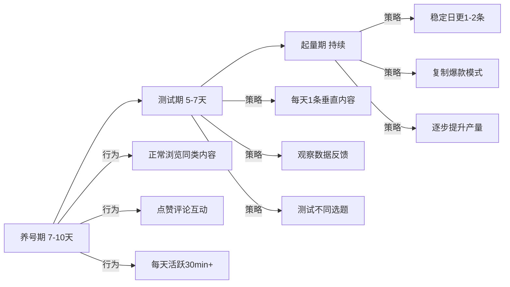
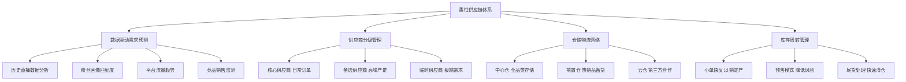
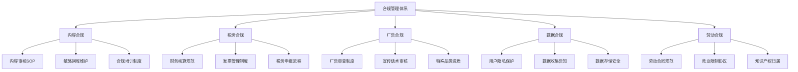
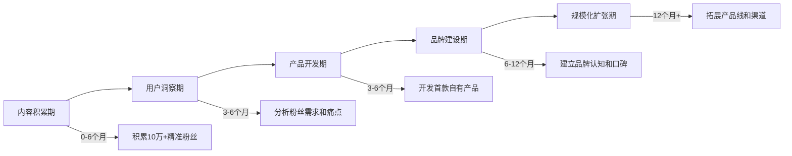
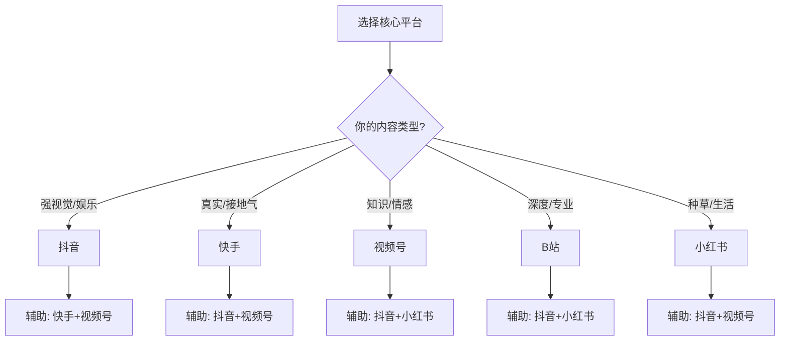

# 第25章 短视频与直播变现 — 深度拓展

本章深度拓展面向已掌握短视频与直播变现基础的进阶读者。我们将从算法机制、供应链管理、工业化生产、合规体系、出海策略、高级变现模型、AI自动化、数据中台、风险管理、行业趋势十个维度，构建一个完整的短视频与直播行业知识体系。

---

## 一、短视频推荐算法深度解析

### 1.1 推荐系统的底层架构

短视频平台的推荐系统本质上是一个大规模实时内容分发引擎。其技术架构通常分为四层：

```text
┌─────────────────────────────────────────────┐
│            用户请求层（User Request）          │
│   打开APP → 请求推荐内容 → 返回视频流          │
├─────────────────────────────────────────────┤
│            召回层（Recall）                    │
│   多路召回：协同过滤 / 内容标签 / 热门池         │
│   / 社交关系 / 地理位置 / 关注链                │
│   候选集规模：从数百万 → 数千条                  │
├─────────────────────────────────────────────┤
│            粗排层（Pre-Ranking）               │
│   轻量级模型快速打分，进一步筛选                 │
│   候选集规模：数千 → 数百条                     │
├─────────────────────────────────────────────┤
│            精排层（Ranking）                   │
│   深度学习模型（如DIN、DeepFM）精细打分          │
│   综合预测：P(点赞)、P(评论)、P(完播)、P(转发)   │
│   候选集规模：数百 → 数十条                     │
├─────────────────────────────────────────────┤
│            重排层（Re-Ranking）                 │
│   多样性打散、频控去重、广告插入、策略干预        │
│   最终呈现：7-15条视频流                       │
└─────────────────────────────────────────────┘
```

**召回层**是推荐系统的入口。每一路召回通道解决不同的问题：协同过滤解决"和你相似的人喜欢什么"，内容标签解决"和你喜欢的内容相似的是什么"，社交关系解决"你的朋友在看什么"，热门池解决"大家都在看什么"。多路召回的结果合并后进入下一步。

**精排层**是推荐系统的核心。平台使用深度学习模型，输入包括用户特征（年龄、性别、历史行为序列）、内容特征（视频标签、时长、清晰度、创作者权重）、上下文特征（时间段、设备类型、网络状态），输出对用户多种行为的预测概率。最终的推荐分数通常是多个预测值的加权和：

$$\text{Score} = w_1 \cdot P(\text{完播}) + w_2 \cdot P(\text{点赞}) + w_3 \cdot P(\text{评论}) + w_4 \cdot P(\text{分享}) + w_5 \cdot P(\text{关注}) - w_6 \cdot P(\text{负反馈})$$

各权重 $w_i$ 会根据平台的阶段性目标动态调整。例如当平台需要提升用户时长时，完播率的权重会被调高；当平台需要加强社交属性时，分享和评论的权重会被调高。

### 1.2 主流平台算法对比

不同平台的推荐算法有显著差异，理解这些差异是制定多平台运营策略的前提：

| 维度 | 抖音 | 快手 | 视频号 | B站 | 小红书 |
|------|------|------|--------|-----|--------|
| **分发逻辑** | 中心化，内容为王 | 去中心化，普惠流量 | 社交推荐为主 | 兴趣推荐+社区 | 搜索+推荐双驱动 |
| **流量分配** | 强者恒强，马太效应明显 | 流量相对均匀，中腰部友好 | 社交裂变，私域导公域 | 长尾内容有生存空间 | 长尾搜索流量大 |
| **核心权重** | 完播率 > 点赞率 > 评论率 | 点赞率 ≈ 评论率 > 完播率 | 社交推荐 > 兴趣推荐 | 完播率 > 一键三连 | 互动率 > 搜索匹配度 |
| **内容时效** | 48小时内主要分发 | 72小时内持续分发 | 社交传播周期长 | 长尾分发可达数月 | 搜索长尾可达数年 |
| **冷启动流量** | 200-500曝光 | 500-1000曝光 | 依赖社交关系链 | 300-500曝光 | 100-300曝光 |
| **适合品类** | 强视觉冲击、短平快 | 真实接地气、人设强 | 知识、情感、本地生活 | 深度内容、二次元 | 种草、攻略、生活方式 |

**抖音的"赛马机制"**：同一时段发布的同类型内容会相互竞争，数据表现最好的内容获得更多流量。这意味着内容不仅要好，还要比同时段的竞品更好。

**快手的"基尼系数"调控**：快手主动控制流量分配的均匀度，避免头部创作者垄断流量。这使得快手的中腰部创作者生存空间更大，但单条爆款的天花板相对较低。

**视频号的"社交推荐"**：视频号的独特之处在于，你点赞的内容会被推荐给你的微信好友。这意味着一条内容的传播路径是"内容 → 你的社交圈 → 你社交圈的社交圈"，具有指数级裂变潜力。

### 1.3 流量池机制的运作原理

抖音的流量池机制是其算法最具特色的设计。新发布的视频首先进入初始流量池（200-500次曝光），平台根据用户反馈数据决定是否推送到更大的流量池：

| 流量池级别 | 曝光量级 | 核心考核指标 | 参考阈值 |
|-----------|---------|------------|---------|
| 第一级（初始池） | 200-500 | 完播率、互动率 | 完播率>30%，点赞率>3% |
| 第二级（千级池） | 1,000-5,000 | 完播率、互动率、转发率 | 各项指标优于同级50%内容 |
| 第三级（万级池） | 10,000-50,000 | 综合互动、关注转化 | 关注转化率>1% |
| 第四级（十万级池） | 100,000-500,000 | 综合数据、用户留存 | 负反馈率<5% |
| 第五级（百万级池） | 1,000,000+ | 全维度评估 | 内容质量+账号权重 |

值得注意的是，算法并非只看单一指标，而是综合考量多个维度的加权得分。不同类型的内容在不同指标上的基准线不同：知识类内容的完播率通常低于娱乐类内容，但评论率和收藏率往往更高；情感类内容的分享率通常最高；教程类内容的收藏率最高。算法会根据内容类型调整评估标准。

### 1.4 算法冷启动与老号重启策略

**新账号冷启动**：平台给予7-14天的新手保护期流量扶持。此阶段发布的视频获得比正常水平更高的初始曝光。利用好这个窗口期的关键策略：

1. **前5条视频定标签**：这5条视频决定了算法对你账号的内容标签判断。必须高度垂直，不能今天发美食明天发健身。
2. **发布时间选择目标用户活跃时段**：用创作者后台查看目标受众的活跃时间，通常工作日12:00-13:00、18:00-20:00、21:00-23:00是高峰。
3. **不要急于求成**：新手期内容质量 > 数量，宁可3天发1条精品，不要1天发3条平庸内容。

**老号重启**：长期未更新或数据表现不佳的账号，重启策略分三步：



### 1.5 算法的变化趋势与应对策略

近年来各平台算法呈现五大趋势：

**趋势一：从兴趣推荐到兴趣+社交混合推荐**。朋友点赞的内容权重逐渐提高，抖音的"朋友"标签、视频号的社交推荐都是这一趋势的体现。应对策略：重视社交互动，鼓励用户分享和评论，创作具有社交货币属性的内容（"@你的朋友"、"转发给需要的人"）。

**趋势二：从即时反馈到长期价值**。平台越来越重视用户的长期留存而非短期互动。停留时长、回访率等指标的权重在提升。应对策略：创作系列化、连续性的内容，让用户有理由回来看下一期。

**趋势三：从爆款逻辑到长尾分发**。更多中腰部创作者获得流量机会，平台在抑制过度的马太效应。应对策略：坚持垂直领域深耕，不必追求每条都爆，稳定输出优质内容比追求单条爆款更重要。

**趋势四：搜索流量占比持续上升**。抖音搜索日均PV已超过数亿，搜索推荐一体化趋势明显。应对策略：在标题、字幕、描述中植入搜索关键词，优化SEO。

**趋势五：内容质量门槛持续提高**。随着创作者数量激增，平台对内容质量的要求越来越高。低质量内容的初始流量池在缩小，高质量内容的流量天花板在提高。应对策略：提升制作水准，关注完播率而非播放量。

### 1.6 信息茧房与反茧房策略

推荐算法创造的"信息茧房"是一个被广泛讨论的现象。从创作者的角度看，信息茧房既是挑战也是机会：

**挑战**：算法倾向于将你的内容推给已经对你所在领域感兴趣的用户，这限制了破圈的可能性。一个美食博主的内容很难被推荐给对美食不感兴趣的用户。

**机会**：正因为算法的精准推荐，垂直领域的内容创作者可以高效触达目标用户。一个细分领域（如"古法酿造"）的创作者，虽然受众基数小，但推荐精准度高，转化率也高。

**破圈策略**：

1. **跨领域联动**：与不同领域的创作者合作，借助对方的用户池实现破圈。
2. **热点嫁接**：将本领域的内容与全网热点结合，借势热点的流量池。
3. **情绪共鸣**：创作超越领域标签的情绪共鸣内容（如励志、感动、搞笑），这类内容的推荐范围更广。
4. **平台内投DOU+/粉条**：通过付费投放突破算法的自然推荐限制。

---

## 二、直播电商的供应链深度管理

### 2.1 直播电商供应链的独特挑战

与传统电商相比，直播电商的供应链面临三个结构性挑战：

**脉冲式销售**：一场直播可能在几小时内售出数万件商品，随后进入较长的间歇期。传统电商的销售曲线相对平滑，可以通过历史数据预测；直播电商的销售曲线呈尖峰状，预测难度极大。

**高退货率**：冲动消费导致直播电商的退货率通常在20%-40%之间，远高于传统电商的5%-15%。退货率直接侵蚀利润——一件退货商品的物流成本、仓储成本、二次销售折价加起来，通常是商品成本的15%-25%。

**时效压力**：用户在直播间下单后期望快速收到商品。延迟发货不仅导致退货，还会影响直播间评分，进而影响平台流量分配。

### 2.2 柔性供应链体系构建



**数据驱动的需求预测**：通过分析主播的历史直播数据、粉丝画像、选品特征、平台流量趋势等多维度数据建立预测模型。具体操作流程：

1. 提取过去30场直播的单品销售数据（曝光量、点击率、转化率、退货率）
2. 分析粉丝画像与商品属性的匹配度（年龄/性别/地域/消费水平）
3. 结合平台大盘流量趋势（节假日、大促节点、行业周期）
4. 使用加权移动平均法预测首单量，通常取过去3场同品类销量均值的60%-80%作为首单量

**供应商分级管理**的具体标准：

| 级别 | 响应时间 | 最低起订量 | 品控标准 | 结算方式 | 适用场景 |
|------|---------|-----------|---------|---------|---------|
| 核心供应商 | 3-5天 | 50-100件 | 全检 | 月结30天 | 日常稳定销售的主力商品 |
| 备选供应商 | 5-7天 | 100-500件 | 抽检 | 预付50% | 大促、节日等销售高峰 |
| 临时供应商 | 7-15天 | 500件以上 | 抽检 | 全额预付 | 爆款补货、极端需求 |

### 2.3 仓储物流网络设计

头部直播电商的仓储网络通常采用三级架构：

**中心仓**：位于物流枢纽城市（如义乌、广州、杭州），存储全品类商品，承担大批量入库和向前置仓调拨的功能。面积通常在5000-20000平方米。

**前置仓**：位于主要消费城市（北上广深及新一线城市），提前将热销商品备货到距离消费者最近的仓库。目标是实现下单后24小时内发货，次日达覆盖主要城区。

**云仓模式**：与第三方仓储企业合作（如京东物流、菜鸟仓、顺丰仓），利用其已有的仓储网络快速覆盖全国。适合初期快速扩张阶段，成本高于自建但灵活性更强。

### 2.4 品控全流程管理

品控贯穿选品、入库、出库、售后四个环节：

**选品阶段品控**：
- 供应商资质三审：营业执照、生产许可证、质检报告
- 样品三测：外观检测、功能测试、安全性检测
- 必要时送SGS、CTI等第三方检测机构出具报告
- 同品类至少对比3家供应商的样品

**入库阶段品控**：
- 每批次抽检比例5%-10%（AQL标准）
- 关键指标逐批检验：外观、尺寸、重量、功能
- 不合格批次整批退回，建立供应商扣分机制
- 入库商品拍照留档，建立质量追溯体系

**售后阶段品控**：
- 用户投诉24小时内响应，48小时内给出解决方案
- 退货商品逐件检验，区分质量问题和非质量问题
- 每周汇总退货原因TOP5，反馈给供应链上游
- 质量问题退货率超过5%的供应商暂停合作

### 2.5 退货率控制策略

退货率是直播电商利润的最大杀手之一。控制退货率需要从源头入手：

**选品阶段**：选择退货率低的品类（食品、日用品退货率<10%；服装、鞋靴退货率30%-50%）。对高退货率品类，选择标品而非非标品，减少尺码/色差等导致的退货。

**直播阶段**：如实展示商品，不过度美化。主播试穿/试用时展示真实效果。明确告知尺码建议、使用注意事项等。设置合理的期望值比过度承诺更重要。

**售后阶段**：对非质量问题的退货，尝试通过换货、补偿优惠券等方式挽留。建立VIP用户的售后绿色通道，减少因售后体验差导致的退货。

---

## 三、短视频内容的工业化生产体系

### 3.1 从个人创作到工业化生产的演进

短视频行业的内容生产已经历三个阶段：

| 阶段 | 时间 | 生产方式 | 月产量 | 代表形态 |
|------|------|---------|--------|---------|
| 萌芽期 | 2016-2018 | 个人随手拍 | 5-15条 | 生活记录、搞笑段子 |
| 成长期 | 2019-2022 | 半专业化团队 | 30-80条 | 剧情号、知识号 |
| 成熟期 | 2023至今 | 工业化流水线 | 100-500条 | MCN矩阵、品牌自播 |

工业化生产的核心优势在于效率和质量的可控性。通过标准化的流程和分工协作，可以在保证内容质量的前提下大幅提升产量。

### 3.2 工业化生产的组织架构

一个成熟的内容工业化生产团队通常包含以下角色：

```text
内容总监（1人）
├── 选题策划组（2-3人）
│   ├── 热点监测员：实时监控各平台热点
│   ├── 竞品分析师：分析竞品账号内容策略
│   └── 选题策划师：输出每周选题排期表
├── 脚本创作组（3-5人）
│   ├── 编剧：撰写视频脚本
│   └── 脚本审核：质量把关
├── 拍摄制作组（3-5人）
│   ├── 导演：现场把控拍摄质量
│   ├── 摄影师：拍摄执行
│   └── 灯光/场务：拍摄辅助
├── 后期制作组（2-3人）
│   ├── 剪辑师：视频剪辑
│   └── 特效/包装：视觉效果
└── 运营分发组（2-3人）
    ├── 平台运营：各平台账号运营
    ├── 数据分析师：数据监控与优化
    └── 粉丝运营：社群维护
```

### 3.3 选题策划的科学方法

选题是内容生产的起点，也是决定流量上限的关键环节。四种科学的选题方法：

**热点追踪法**：通过新榜、飞瓜、蝉妈妈、抖音热点宝等工具实时监测热门话题。关键不是追热点，而是"追得快+角度新"。热点出现后2-6小时内完成内容制作和发布，超过12小时基本失去时效性。具体流程：

1. 每天早中晚三次查看热点榜单
2. 判断热点与自身账号定位的关联度（无关热点不追）
3. 确定切入角度（正面解读、反面思考、深度分析、搞笑演绎）
4. 快速出脚本（30分钟内）→ 拍摄 → 剪辑 → 发布

**竞品分析法**：系统分析同赛道TOP20账号的内容策略。操作步骤：

1. 建立竞品监测表：账号名、粉丝量、更新频率、内容类型、爆款特征
2. 每周分析竞品近7天的TOP3视频：选题、标题、封面、时长、发布时间
3. 找出共性规律：什么选题容易爆？什么结构效果好？
4. 差异化创新：在共性规律基础上加入自己的独特角度

**用户需求挖掘法**：通过评论区、私信、问卷、搜索词分析挖掘用户真实需求。重点关注以下信号：
- 评论区反复出现的问题（说明需求未被满足）
- 搜索框的下拉联想词（反映用户真实搜索意图）
- 同类视频评论区的负面反馈（说明竞品的不足）
- 私信中的高频咨询内容（反映用户核心痛点）

**数据反推法**：分析自己账号的历史数据，找出爆款规律。关键分析维度：
- 选题类型与播放量的关系（哪类选题平均播放量最高？）
- 视频时长与完播率的关系（你的受众最接受多长的视频？）
- 发布时间与初始流量的关系（什么时间发布获得的初始流量最大？）
- 封面风格与点击率的关系（哪种封面设计点击率最高？）

### 3.4 脚本撰写的进阶框架

短视频脚本的核心原则是"3秒定生死"——前3秒决定了用户是否继续观看。以下是最实用的脚本框架：

**HOOK-BODY-CTA框架**（万能框架）：

```text
[0-3秒] HOOK（钩子）：制造悬念/抛出问题/展示结果
    ↓
[3-15秒] BODY（主体）：传递核心信息/展示过程/讲述故事
    ↓
[15-30秒] CTA（行动号召）：引导互动/关注/购买
```

**PAS框架**（知识类/教育类最佳）：
- **P**roblem：提出用户面临的具体问题（"你是不是也遇到过这种情况？"）
- **A**gitation：放大痛点，引发共鸣（"如果不解决，会导致更严重的后果"）
- **S**olution：给出具体的解决方案（"只需3步就能解决"）

**故事弧线框架**（情感类/剧情类最佳）：
- **冲突**：主角面临困境（3秒内建立冲突）
- **升级**：困境加剧，矛盾升级（制造紧张感）
- **转折**：出现转机或意想不到的解决方案
- **结局**：给出结论，升华主题

**对比框架**（种草类/评测类最佳）：
- **Before**：使用前的状态/问题
- **Process**：使用过程/对比测试
- **After**：使用后的效果/结论

每个框架的脚本模板示例：

```text
【HOOK-BODY-CTA脚本模板】

场景：     [描述拍摄场景和画面]
镜头：     [描述镜头运动方式]
时长：     [0-3秒]
旁白/文字："[钩子语句，制造悬念]"

---

场景：     [描述拍摄场景和画面]
镜头：     [描述镜头运动方式]
时长：     [3-20秒]
旁白/文字："[核心内容，分点展开]"

---

场景：     [描述拍摄场景和画面]
镜头：     [描述镜头运动方式]
时长：     [20-30秒]
旁白/文字："[行动号召，引导互动]"
```

### 3.5 拍摄与后期的标准化

**拍摄标准化体系**：

- **场景库**：根据内容类型建立5-10个标准化拍摄场景（如书房、厨房、户外、工作室），每个场景预设灯光方案、机位方案、背景布置方案。
- **设备清单**：根据预算建立标准化设备配置。入门级（5000元以内）：手机+稳定器+补光灯+无线麦；进阶级（2万元以内）：微单相机+三轴稳定器+专业灯光+指向性麦；专业级（5万元以上）：全画幅相机+专业灯光组+调音台+提词器。
- **运镜方案**：为不同内容类型预设运镜方案。知识类：固定机位为主，偶尔推拉；Vlog类：手持跟拍为主，搭配稳定器；产品展示：转台+特写镜头+多角度切换。

**后期标准化体系**：

- **剪辑模板**：为不同内容类型建立标准化的剪辑模板，包括片头、字幕条、转场、片尾等。新人剪辑师拿到模板后可以直接套用，将单条视频的剪辑时间从4小时缩短到1-2小时。
- **字幕规范**：统一字体（推荐思源黑体/阿里巴巴普惠体）、字号（正文字幕不小于24px）、位置（画面下方1/5处）、颜色（白色描边或深色底板）。
- **音效库**：建立标准化的音效库，按类型分类（转场音效、强调音效、背景音乐、环境音），每种类型准备3-5个备选。

### 3.6 内容生产的成本结构与ROI分析

了解内容生产的成本结构，才能做出合理的投入决策：

| 成本项 | 个人创作者 | 小型团队(3-5人) | 中型团队(10-20人) | MCN机构 |
|--------|-----------|----------------|-----------------|---------|
| 人员成本/月 | 0 | 1.5-3万 | 8-20万 | 50-200万 |
| 设备投入（一次性） | 3000-1万 | 2-5万 | 10-30万 | 50-200万 |
| 场地成本/月 | 0 | 2000-5000 | 5000-2万 | 5-20万 |
| 投流成本/月 | 0-5000 | 5000-3万 | 3-20万 | 20-200万 |
| 月均总成本 | 3000-1万 | 3-7万 | 15-60万 | 100-500万 |
| 月均产出视频 | 15-30条 | 50-150条 | 200-500条 | 500-2000条 |
| 单条视频成本 | 200-500元 | 400-800元 | 500-1500元 | 300-1000元 |

**ROI计算公式**：

```text
内容ROI = (内容带来的总收入 - 内容生产成本 - 投流成本) / (内容生产成本 + 投流成本)

其中：
- 广告变现收入 = 粉丝量 × CPM / 1000 × 发布条数
- 带货变现收入 = GMV × 佣金比例
- 直播变现收入 = 观看人数 × 人均打赏 × 直播时长
```

一个健康的短视频账号，内容ROI应该在3个月后转正，6个月后达到200%以上。

---

## 四、直播行业的监管合规体系

### 4.1 政策演进的关键节点

中国直播行业的监管政策经历了从宽松到逐步收紧的过程。以下是关键政策节点：

| 时间 | 政策/事件 | 核心内容 | 影响 |
|------|----------|---------|------|
| 2016 | 直播元年 | 行业爆发，监管相对宽松 | 平台数量激增至200+ |
| 2018 | 《网络直播服务管理规定》 | 实名制、内容审核、未成年人保护 | 大量不合规平台被淘汰 |
| 2020 | 直播带货规范 | 禁止虚假宣传、刷单炒信 | 行业开始规范化 |
| 2021 | 薇娅偷逃税案 | 主播税务合规要求 | 头部主播集体补税 |
| 2022 | "清朗"专项行动 | 整治直播乱象 | 打擦边球内容大幅减少 |
| 2023-2025 | 持续深化监管 | AI生成内容标注、算法透明度 | 行业进入合规经营时代 |

### 4.2 主播合规经营指南

**税务合规**是主播面临的最核心合规问题。主播的收入来源通常包括以下几种，每种的税务处理方式不同：

| 收入类型 | 税务分类 | 适用税率 | 优化方案 |
|---------|---------|---------|---------|
| 平台打赏 | 劳务报酬 | 20%-40% | 注册个体户转为经营所得 |
| 带货佣金 | 劳务报酬/经营所得 | 视身份而定 | 注册公司享受小微企业优惠 |
| 坑位费 | 劳务报酬 | 20%-40% | 签订正式服务合同 |
| 广告收入 | 经营所得 | 5%-35% | 合理列支成本费用 |
| 自营商品销售 | 经营所得 | 5%-35% | 利用小规模纳税人免税政策 |

**合规筹划的核心原则**：合法避税≠偷税漏税。合规的税务筹划包括：选择合适的纳税身份（个人/个体户/公司）、合理列支成本费用、利用税收优惠政策（如小规模纳税人增值税减免、小微企业所得税优惠）。绝对不能做的事情：隐匿收入、虚构成本、阴阳合同、私人账户收款不申报。

**内容合规红线**：
- 不得发布虚假广告（《广告法》第28条）
- 不得使用"最"、"第一"等绝对化用语（《广告法》第9条）
- 食品、药品、医疗器械等特殊品类需取得相应资质
- 不得向未成年人推销不适宜商品
- 直播间不得出现低俗、暴力、赌博等违规内容

### 4.3 企业合规体系建设

对于MCN机构和品牌方，需要建立系统化的合规体系：



---

## 五、短视频出海策略与实操

### 5.1 全球短视频市场格局

TikTok的成功证明了中国短视频模式的全球竞争力。不同地区的市场特征差异显著：

| 地区 | 月活用户 | 核心平台 | 变现能力 | 增长潜力 | 主要挑战 |
|------|---------|---------|---------|---------|---------|
| 北美 | 2亿+ | TikTok, YouTube Shorts, IG Reels | ★★★★★ | ★★★ | 监管风险、竞争激烈 |
| 欧洲 | 1.5亿+ | TikTok, IG Reels | ★★★★ | ★★★ | GDPR合规、文化差异 |
| 东南亚 | 3亿+ | TikTok, Shopee Video | ★★★ | ★★★★★ | 变现能力弱、基础设施 |
| 中东 | 8000万+ | TikTok, Snapchat | ★★★★ | ★★★★ | 文化敏感性 |
| 拉美 | 2亿+ | TikTok, Kwai | ★★★ | ★★★★ | 支付体系不完善 |
| 非洲 | 5000万+ | TikTok, Likee | ★★ | ★★★★★ | 基础设施、支付 |

### 5.2 内容本地化的实操方法

内容本地化不是简单的翻译，而是文化层面的重新创作。具体操作分为四个层次：

**第一层：语言本地化**
- 不是直译，而是用目标语言的表达习惯重写
- 注意俚语、幽默方式、文化梗的本地化
- 多语言市场（如印度、东南亚）需要制作多语言版本
- 字幕翻译要简洁，符合当地阅读习惯

**第二层：文化适配**
- 了解目标市场的文化禁忌和偏好
- 中东市场：注意宗教和文化敏感性，避免展示酒精、猪肉等
- 东南亚市场：家庭和社区主题更受欢迎，价格敏感度高
- 欧美市场：注重个人表达和创意，对"硬广"接受度低
- 日韩市场：对内容品质要求极高，审美风格独特

**第三层：创作者生态建设**
- 在目标市场培养本地创作者是内容本地化的关键
- 本地创作者更了解当地用户需求，内容更有亲和力
- 平台通常有创作者基金和扶持计划，可以利用
- 合作方式：签约本地达人、MCN合作、创作者驻地计划

**第四层：运营本地化**
- 本地化运营团队（至少配备当地母语运营人员）
- 遵守当地节假日和文化日历安排内容
- 适配当地主流支付方式
- 建立本地客服体系

### 5.3 出海变现模式的本地化

不同市场的变现模式差异巨大：

**欧美市场**：
- 广告变现（品牌合作、平台广告分成）是主要收入来源
- 电商变现（TikTok Shop、独立站引流）增长迅速
- 用户付费能力强，CPM可达$5-$15
- 品牌合作要求高，需要完善的Media Kit

**东南亚市场**：
- 直播打赏是重要收入来源（用户打赏意愿强）
- 社交电商（通过直播和短视频带货）增长快
- CPM较低（$1-$3），需要靠量取胜
- Shopee、Lazada等平台的电商生态成熟

**中东市场**：
- 虚拟礼物打赏收入可观（高净值用户多）
- 高端品牌广告有增长空间
- 用户在线时长长，互动率高
- 需要注意文化合规

### 5.4 合规与风险管理

出海面临的合规风险比国内更复杂：

| 合规领域 | 主要法规 | 核心要求 | 应对措施 |
|---------|---------|---------|---------|
| 数据隐私 | GDPR(欧盟)、CCPA(加州) | 用户数据收集需明确告知并获得同意 | 建立数据合规体系，设置DPO |
| 儿童保护 | COPPA(美国)、Age Appropriate Design Code(英国) | 限制对未成年人的数据收集和内容推送 | 建立年龄验证机制 |
| 内容审核 | 各国网络安全法 | 及时删除违法和有害内容 | 本地化审核团队+AI审核 |
| 税务合规 | 各国税法 | 依法申报纳税 | 聘请当地税务顾问 |
| 知识产权 | 各国版权法 | 不侵犯他人知识产权 | 建立版权审核流程 |

---

## 六、高级变现模型与策略

### 6.1 DTC（Direct to Consumer）品牌模式

越来越多的短视频创作者选择从"带别人的货"转向"卖自己的货"，即DTC品牌模式。这种模式的核心优势是利润率高（毛利率可达60%-80%，远高于带货佣金的10%-30%）和品牌资产积累。

**DTC品牌的构建路径**：



**成功案例分析**：

- **李子柒**：从内容IP到食品品牌，螺蛳粉单品年销售额超5亿。核心策略：强IP背书+品质把控+供应链自建。
- **完美日记**：早期通过小红书、抖音KOL矩阵种草，快速建立品牌认知。核心策略：DTC模式+数据驱动+快速迭代。
- **花西子**：以"东方美学"为品牌定位，通过短视频和直播建立品牌调性。核心策略：文化定位+产品差异化+内容营销。

### 6.2 IP开发与品牌授权

当个人IP积累到一定影响力后，可以通过IP授权实现"睡后收入"：

**IP授权的常见模式**：

| 授权模式 | 收入方式 | 适用场景 | 参考费率 |
|---------|---------|---------|---------|
| 品牌联名 | 固定授权费+销售分成 | 头部IP与知名品牌合作 | 授权费50-500万+销售额3%-10% |
| 形象授权 | 固定年费 | IP形象用于商品包装 | 年费10-100万 |
| 内容授权 | 按次/按量计费 | 内容授权给其他平台使用 | 单条1000-5万 |
| 课程授权 | 分成模式 | 课程授权给教育平台 | 收入分成30%-50% |

### 6.3 矩阵化运营策略

单一账号的风险太高（平台封号、算法变化、内容疲劳），矩阵化运营是降低风险、放大收益的核心策略：

**矩阵化运营的三种模式**：

**垂直矩阵**：围绕同一领域建立多个账号，覆盖不同的细分方向。例如一个美食领域可以建立：家常菜教程、烘焙甜点、街头探店、健康饮食、厨房好物推荐等5个账号。优势是内容生产能力可以复用，粉丝画像相近便于交叉引流。

**平台矩阵**：同一内容适配到多个平台发布。抖音、快手、视频号、B站、小红书、YouTube等。需要注意的是不同平台的内容风格和用户偏好不同，不能简单地"一稿多发"，需要针对每个平台进行适配调整。

**角色矩阵**：同一团队运营多个不同人设的账号。例如一个MCN机构同时运营美食达人、美妆达人、健身达人等多个不同领域的账号。优势是可以覆盖更广泛的用户群体，但对团队的管理能力要求更高。

### 6.4 私域流量转化策略

公域流量的成本越来越高，将公域流量转化为私域流量是长期发展的关键：

**引流路径设计**：

```text
短视频/直播（公域）→ 关注账号 → 引导加微信/进粉丝群（私域）
         ↓
    评论区引导："评论区扣1，私信领取XX资料"
    直播间引导："加入粉丝团，解锁专属福利"
    主页引导：个人简介留微信号/公众号
```

**私域变现模型**：

| 私域形态 | 变现方式 | 客单价 | 复购率 | 适合品类 |
|---------|---------|--------|--------|---------|
| 个人微信 | 朋友圈带货、一对一咨询 | 100-5000元 | 30%-50% | 高客单、需信任的商品 |
| 微信社群 | 群内促销、接龙、秒杀 | 50-500元 | 20%-40% | 快消品、食品、日用品 |
| 企业微信 | 自动化运营、标签管理 | 100-3000元 | 25%-45% | 标准化商品、知识付费 |
| 公众号 | 内容种草、广告植入 | CPM模式 | - | 品牌广告 |

---

## 七、AI驱动的短视频自动化生产

### 7.1 AI在短视频领域的应用全景

AI技术正在深度渗透短视频行业的每一个环节：

| 环节 | AI应用 | 效率提升 | 工具举例 |
|------|--------|---------|---------|
| 选题策划 | 热点预测、趋势分析 | 50%-70% | 新榜AI、飞瓜智能选题 |
| 脚本撰写 | AI生成脚本初稿 | 60%-80% | ChatGPT、文心一言、通义千问 |
| 画面生成 | AI生成图片/视频素材 | 70%-90% | Midjourney、Stable Diffusion、可灵 |
| 配音合成 | AI语音合成 | 80%-95% | 剪映AI配音、微软TTS |
| 字幕生成 | 语音转文字 | 90%+ | 剪映自动字幕、飞书妙记 |
| 视频剪辑 | AI自动剪辑 | 50%-70% | 剪映智能剪辑、CapCut |
| 数据分析 | 自动化数据报告 | 60%-80% | 蝉妈妈、抖查查 |
| 客服回复 | AI自动回复 | 70%-90% | 各平台智能客服 |

### 7.2 AI内容生产的实操流程

以"知识类短视频"为例，展示AI辅助内容生产的完整流程：

**第一步：AI辅助选题（耗时10分钟）**

向AI工具输入以下提示词：
```text
请帮我分析[领域]最近一周的热门话题，给出10个适合短视频创作的选题方向，
每个选题需要包含：选题角度、目标受众、预期数据表现、参考标题。
```

**第二步：AI辅助脚本（耗时15分钟）**

```text
请为以下选题撰写一个30秒短视频脚本：
选题：[选题内容]
目标受众：[受众描述]
风格：[知识科普/情感共鸣/搞笑幽默]
结构：HOOK-BODY-CTA
要求：前3秒必须有强钩子，语言口语化，结尾引导互动。
```

**第三步：AI辅助制作（耗时20分钟）**

- 使用AI配音工具将脚本转为语音（选择合适的音色和语速）
- 使用AI图片生成工具制作配图或画面素材
- 使用剪辑工具自动匹配画面和音频
- 添加字幕、转场、背景音乐

**第四步：人工审核与优化（耗时15分钟）**

AI生成的内容必须经过人工审核，重点检查：
- 事实准确性（AI可能生成错误信息）
- 语言自然度（AI语言可能有不自然的表达）
- 画面质量（AI生成的素材可能有瑕疵）
- 整体流畅性（节奏、转场是否自然）

总耗时约60分钟，相比纯人工制作的3-4小时，效率提升3-4倍。

### 7.3 AI生成内容的注意事项

**平台态度**：各平台对AI生成内容的态度正在收紧。抖音要求AI生成内容必须标注"AI生成"标签，未标注可能被限流。视频号、快手等平台也在出台类似政策。

**版权风险**：AI生成的内容（图片、音乐、视频片段）可能存在版权争议。建议使用明确允许商用的AI工具，并保留使用记录。

**内容同质化**：大量创作者使用AI生成内容会导致同质化严重。解决方案是将AI作为辅助工具而非完全替代人工，核心创意和人设表达必须由人来完成。

**质量把控**：AI生成的内容质量参差不齐，需要建立严格的审核流程。建议设立"AI内容质量检查清单"，包括事实核查、语言润色、画面检查、合规审核等环节。

---

## 八、数据中台与精细化运营

### 8.1 短视频数据指标体系

建立完整的数据指标体系是精细化运营的基础：

**内容维度指标**：

| 指标名称 | 计算方式 | 健康基准 | 优化方向 |
|---------|---------|---------|---------|
| 完播率 | 完整观看人数/播放人数 | >30% | 优化开头钩子、控制时长 |
| 点赞率 | 点赞数/播放量 | >3% | 提升内容共鸣感 |
| 评论率 | 评论数/播放量 | >0.5% | 设置互动话题、提问引导 |
| 转发率 | 转发数/播放量 | >0.3% | 提供社交货币价值 |
| 收藏率 | 收藏数/播放量 | >1% | 提供实用价值 |
| 关注转化率 | 新增关注/播放量 | >1% | 强化人设、系列化内容 |
| 负反馈率 | 不感兴趣/举报 | <2% | 避免低质、标题党内容 |

**直播维度指标**：

| 指标名称 | 计算方式 | 健康基准 | 优化方向 |
|---------|---------|---------|---------|
| 观看人数 | 直播间累计观看 | 持续增长 | 优化预告、投流 |
| 平均在线时长 | 总停留时长/观看人数 | >3分钟 | 提升内容吸引力 |
| 互动率 | 互动人数/观看人数 | >5% | 设计互动环节 |
| 转粉率 | 新增粉丝/观看人数 | >2% | 强化人设、福利引导 |
| GPM | GMV/观看人数×1000 | >500元 | 优化选品和话术 |
| 转化率 | 下单人数/观看人数 | >2% | 优化商品展示和逼单 |
| UV价值 | GMV/独立访客数 | >5元 | 提升客单价和转化率 |

### 8.2 数据驱动的内容优化方法

**A/B测试法**：对同一选题制作2-3个不同版本（不同开头、不同封面、不同标题），分别发布，对比数据表现。持续积累测试结果，建立自己账号的"最佳实践库"。

**漏斗分析法**：将用户行为路径拆解为"曝光 → 点击 → 观看 → 完播 → 互动 → 关注 → 转化"七个环节，找到漏斗中流失最严重的环节进行针对性优化。

```text
曝光 100% → 点击 15% → 观看 80% → 完播 35% → 互动 10% → 关注 3% → 转化 1%
         ↑              ↑              ↑              ↑
       优化封面       优化开头       优化内容       优化CTA
```

**归因分析法**：分析爆款视频和普通视频的差异，找到导致数据差异的关键因素。通常是3-5个关键因素的组合决定了视频的成败。

### 8.3 数据工具选型建议

| 工具类型 | 推荐工具 | 核心功能 | 价格 |
|---------|---------|---------|------|
| 综合数据平台 | 蝉妈妈、飞瓜数据 | 竞品分析、热门内容、带货数据 | 3000-2万/年 |
| 账号分析工具 | 抖查查、新抖 | 账号诊断、粉丝画像、内容分析 | 1000-5000/年 |
| 直播分析工具 | 飞瓜直播、蝉妈妈直播 | 直播数据、商品分析、话术拆解 | 2000-1万/年 |
| 搜索关键词工具 | 巨量算数、抖音热点宝 | 搜索趋势、热门关键词 | 免费 |
| AI分析工具 | ChatGPT + 数据导出 | 自定义分析、深度洞察 | 20美元/月 |

---

## 九、风险管理与危机应对

### 9.1 短视频创业的主要风险

| 风险类型 | 具体表现 | 发生概率 | 影响程度 | 应对策略 |
|---------|---------|---------|---------|---------|
| 平台风险 | 封号、限流、算法调整 | 中 | 极高 | 多平台布局、遵守规则 |
| 内容风险 | 侵权、违规、舆论危机 | 中 | 高 | 合规审核、危机预案 |
| 商业风险 | 退货率高、供应链断裂 | 中高 | 高 | 柔性供应链、风险分散 |
| 人员风险 | 核心成员离职、竞业纠纷 | 中 | 中高 | 签署竞业协议、知识沉淀 |
| 法律风险 | 税务问题、虚假宣传 | 低 | 极高 | 合规经营、专业顾问 |
| 技术风险 | 账号被盗、数据泄露 | 低 | 高 | 安全防护、定期备份 |

### 9.2 账号危机应对指南

**账号被封/限流的应对流程**：

1. **立即排查原因**：查看平台通知，分析最近发布的内容是否存在违规
2. **申诉处理**：如果是误封，通过官方渠道提交申诉，附上相关证据
3. **内容整改**：删除可能存在问题的内容，调整后续内容策略
4. **备用方案启动**：启用备用账号，将粉丝引导至其他平台
5. **复盘总结**：分析封号根因，更新合规检查清单

**舆论危机的应对原则**：

- **速度第一**：在舆论发酵前2小时内做出回应
- **真诚沟通**：不推诿、不狡辩，承认错误并给出改进方案
- **事实为据**：用事实和数据回应质疑，不打感情牌
- **持续跟进**：危机处理不是一次性事件，需要持续跟进直到完全平息

### 9.3 多平台布局的风险分散策略

将所有资源押注在单一平台是最大的风险。多平台布局的策略：

**核心平台+辅助平台模式**：
- 选择1个核心平台（投入60%资源）
- 选择2-3个辅助平台（各投入10%-15%资源）
- 保留1个私域阵地（微信生态，投入10%资源）

**平台选择的决策框架**：



---

## 十、行业趋势与未来展望

### 10.1 2025-2027年短视频行业五大趋势

**趋势一：AI原生内容时代来临**

AI不再是辅助工具，而是内容创作的核心引擎。预计到2027年，超过50%的短视频内容将有AI参与创作。AI数字人主播、AI生成视频、AI个性化内容将成为常态。对创作者的影响：基础内容创作的门槛大幅降低，创意和人设成为核心竞争力。

**趋势二：短视频与电商深度融合**

短视频平台正在从"内容平台"转变为"内容电商平台"。抖音电商GMV已超过万亿规模，快手电商也在快速增长。未来的趋势是"所见即所得"——用户在观看短视频的过程中可以直接完成购买，无需跳转。对创作者的影响：电商能力成为必备技能，纯内容创作者需要学习选品、供应链、售后等电商能力。

**趋势三：本地生活服务成为新增长极**

短视频正在重塑本地生活服务行业。抖音的团购、探店内容增长迅猛，美团、大众点评也在加强短视频和直播能力。对创作者的影响：本地生活达人是一个巨大的机会窗口，尤其是二三线城市的本地生活内容创作者。

**趋势四：虚拟主播与元宇宙直播**

虚拟主播（VTuber）和元宇宙直播正在从小众走向主流。技术门槛在降低（手机即可驱动虚拟形象），应用场景在扩展（虚拟带货、虚拟演唱会、虚拟教育）。对创作者的影响：虚拟形象可以突破真人形象的限制，实现24小时不间断直播。

**趋势五：监管趋严推动行业洗牌**

监管持续收紧将加速行业洗牌。不合规的中小玩家将被淘汰，合规经营的头部玩家将获得更多市场份额。对创作者的影响：合规经营不再是可选项，而是生存的必要条件。

### 10.2 给不同阶段创作者的建议

**入门期（0-1万粉丝）**：
- 选定一个垂直领域，深度聚焦
- 学习并掌握一个平台的运营规则
- 建立标准化的内容生产流程
- 不急于变现，先积累内容能力和粉丝基础
- 投入时间学习：每天至少花1小时研究爆款视频

**成长期（1万-50万粉丝）**：
- 开始尝试变现（广告、带货、知识付费）
- 建立小团队（至少1个助理/剪辑）
- 开始多平台布局
- 建立数据分析体系，用数据驱动内容优化
- 开始积累私域流量

**成熟期（50万-500万粉丝）**：
- 团队化运营，建立完整的组织架构
- 多元化变现，降低对单一变现方式的依赖
- 开始品牌化建设，积累品牌资产
- 考虑MCN合作或自建MCN
- 建立合规体系，防范法律风险

**头部期（500万+粉丝）**：
- IP化运营，探索IP授权和品牌联名
- DTC品牌建设，打造自有品牌
- 投资孵化新账号/新达人
- 行业影响力变现（演讲、顾问、投资）
- 社会责任与公益参与

### 10.3 持续学习资源推荐

| 资源类型 | 推荐内容 | 适合阶段 |
|---------|---------|---------|
| 官方课程 | 巨量学堂、快手磁力课堂、腾讯课堂 | 入门-成长 |
| 行业报告 | 艾瑞咨询、QuestMobile、新榜年度报告 | 全阶段 |
| 数据工具 | 蝉妈妈、飞瓜、新抖、抖查查 | 成长-成熟 |
| 社群交流 | 各类短视频运营社群、行业峰会 | 全阶段 |
| 竞品研究 | 关注同赛道TOP账号，拆解其内容策略 | 全阶段 |
| 书籍 | 《短视频运营从入门到精通》《直播电商实战》 | 入门-成长 |

---

## 本节小结

本节从算法机制、供应链管理、工业化生产、合规体系、出海策略、高级变现模型、AI自动化、数据中台、风险管理、行业趋势十个维度，系统性地拓展了短视频与直播变现的深度知识。

**核心要点回顾**：

1. **算法是流量的底层逻辑**：理解推荐算法的运作机制，才能有的放矢地优化内容。不同平台的算法差异决定了运营策略的差异。
2. **供应链是直播电商的命脉**：柔性供应链、品控体系、退货率控制直接决定了直播电商的利润水平。
3. **工业化生产是规模化的前提**：标准化的流程、科学的选题方法、成熟的脚本框架是内容量产的保障。
4. **合规经营是生存的底线**：税务合规、内容合规、广告合规不是可选项，而是必选项。
5. **AI是效率革命的核心驱动力**：善用AI工具可以将内容生产效率提升3-5倍，但人工创意和质量把控不可替代。
6. **数据是决策的依据**：建立完整的数据指标体系，用数据驱动每一个运营决策。
7. **多平台布局是风险分散的关键**：不要把所有鸡蛋放在一个篮子里。
8. **长期主义是最终的赢家策略**：短视频行业已经过了野蛮生长阶段，合规经营、持续深耕、品牌建设才是长期制胜之道。
