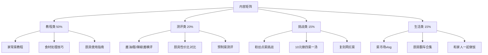
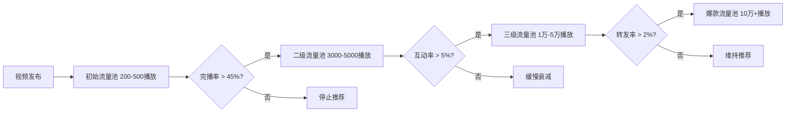
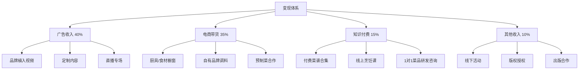
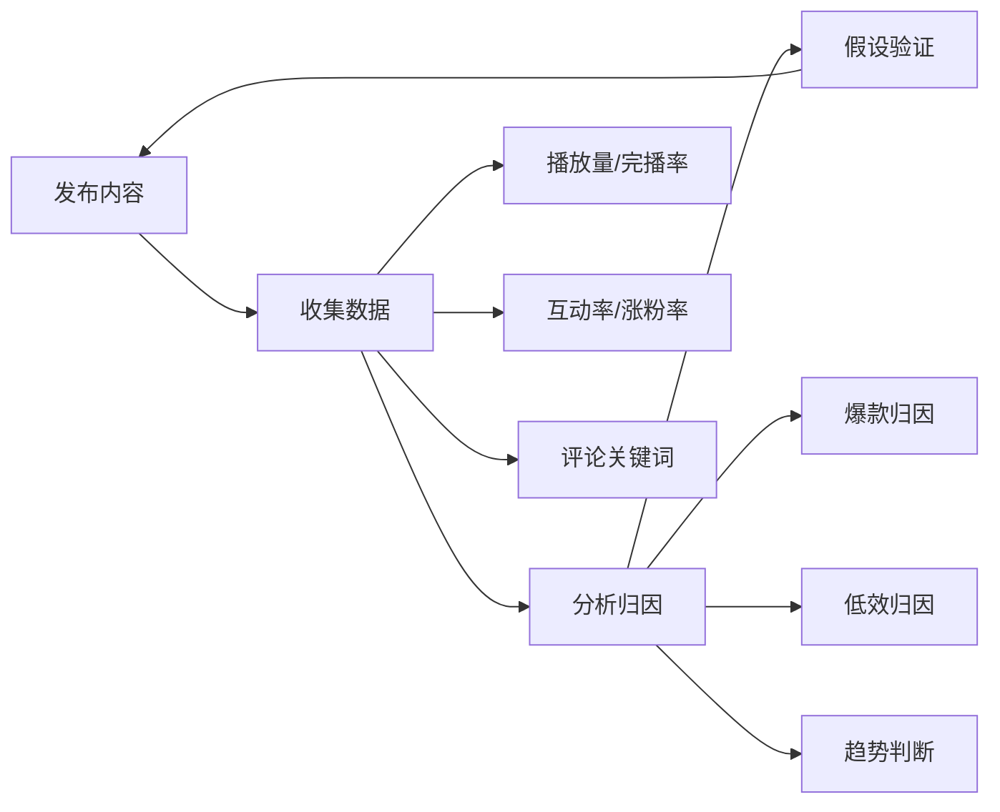

## 案例一：从零到百万粉丝的美食博主之路

美食赛道是短视频领域竞争最激烈、但同时也是变现路径最清晰的赛道之一。本案例完整还原一位素人美食博主从账号注册到突破百万粉丝的全过程，拆解每个阶段的关键决策、踩过的坑以及验证有效的运营方法论。无论你是正准备入局的新人，还是已经起步但遇到瓶颈的创作者，这个案例都能提供可复用的参考框架。

### 一、案例背景

#### 1.1 人物画像

**主人公：林晓峰（化名），28岁，坐标成都**

- **职业背景**：互联网公司产品经理，日常工作996，无任何自媒体运营经验
- **厨艺基础**：家常菜水平，擅长川菜，偶尔在朋友圈晒菜获得好评
- **启动资源**：一部iPhone 13 Pro、一个三脚架、厨房灶台，启动资金约500元
- **时间投入**：每天下班后2-3小时，周末全天可支配

#### 1.2 入局动机

2023年初，林晓峰注意到以下市场信号：

- 抖音美食赛道日均播放量超过80亿次，但同质化严重（大量探店、吃播内容）
- "家常菜教程"细分领域存在空白——要么是专业厨师的高门槛内容，要么是粗糙的手机随手拍
- 用户评论中高频出现"看着简单但做不出来""调料比例不清楚""火候把握不住"等痛点
- 短视频平台对"教学型内容"的推荐权重持续上升

这些信号指向一个明确的机会窗口：**用产品经理的思维做美食教程，把每道菜的制作过程拆解成可复制的标准流程**。

#### 1.3 赛道分析

在正式入局前，林晓峰花了一周时间做了系统的赛道调研：

| 分析维度 | 调研结论 |
|---------|---------|
| 头部账号密度 | 美食赛道Top 100账号平均粉丝580万，但多数以探店/吃播为主 |
| 教程类竞品 | 粉丝50-100万的教程号约200个，内容质量参差不齐 |
| 用户需求缺口 | "零失败""新手友好""精确克数"等关键词搜索量月增30% |
| 变现路径 | 食材/厨具带货、品牌广告、知识付费（菜谱电子书）三条主线 |
| 内容生命周期 | 教程类视频的长尾流量优于探店类，30天后仍有40%播放量 |

### 二、冷启动阶段（0-1万粉丝）

#### 2.1 账号定位策略

林晓峰没有急于发视频，而是先完成了系统的账号定位：

**核心定位公式**：人群 × 场景 × 差异化价值

最终确定的定位是：**"给厨房小白的零失败家常菜教程——每道菜都有精确克数和失败预警"**

差异化锚点有三个：

1. **精确到克的调料用量**：不说"适量盐"，而是说"盐3克（约半茶匙）"
2. **失败预警标注**：每个步骤标注"新手最容易在这里犯的错"
3. **成本公示**：每道菜标注食材总成本，帮助用户做消费决策

#### 2.2 内容体系搭建

**第一批内容规划（20条视频）**：

林晓峰没有随机选题，而是按照"难度阶梯"设计内容矩阵：

```text
入门级（7条）：番茄炒蛋、蛋炒饭、可乐鸡翅、酸辣土豆丝、蒜蓉西兰花、
               凉拌黄瓜、紫菜蛋花汤
进阶级（8条）：宫保鸡丁、鱼香肉丝、红烧肉、麻婆豆腐、水煮鱼、
               回锅肉、糖醋排骨、酸菜鱼
挑战级（5条）：毛血旺、口水鸡、钵钵鸡、麻辣香锅、火锅底料自制
```

每条视频严格遵循**标准脚本结构**：

```markdown
[0-3秒] 钩子：成品特写 + "XX元搞定一道XXX"
[3-15秒] 食材清单：全部食材 + 精确克数 + 替代方案
[15秒-2分钟] 制作过程：每步配文字标注 + 关键节点放大特写
[2分钟-结尾] 成品展示 + 失败预警总结 + 互动引导
```

#### 2.3 拍摄制作规范

**设备配置**：

| 设备 | 型号 | 用途 | 预算 |
|------|------|------|------|
| 主机位 | iPhone 13 Pro | 正面俯拍 | 已有 |
| 补光灯 | 环形补光灯18寸 | 消除阴影 | 89元 |
| 三脚架 | 手机俯拍支架 | 固定机位 | 45元 |
| 收音 | 领夹式麦克风 | 旁白录制 | 68元 |
| 背景 | 白色大理石纹贴纸 | 统一视觉风格 | 35元 |

**拍摄参数设置**：
- 分辨率：1080P / 60fps（后期可做慢动作回放）
- 色温：5000K（暖白光，让食物看起来更有食欲）
- 构图：俯拍占70%，侧拍占30%（展示翻炒动作）
- 每条视频拍摄素材约15-20分钟，剪辑后控制在2-3分钟

**剪辑工作流**：

1. 素材筛选：从20分钟素材中挑选关键步骤镜头
2. 粗剪：按脚本顺序排列，删除冗余等待时间
3. 精剪：添加字幕（调料用量用黄色高亮）、转场、关键步骤放大
4. 音频：录制旁白讲解（语速适中，带川普口音增加辨识度）
5. 包装：片头3秒钩子 + 片尾引导关注
6. 导出：H.265编码，码率控制在15Mbps以内

**剪辑工具选择**：
- 初期（0-5万粉）：剪映（免费、模板丰富、学习成本低）
- 中期（5-50万粉）：Premiere Pro（更精细的调色和音频控制）
- 后期（50万+）：组建剪辑团队，输出剪辑SOP文档

#### 2.4 发布策略

**发布时间测试**（前两周每天测试不同时段）：

| 发布时间 | 平均播放量 | 互动率 | 结论 |
|---------|-----------|--------|------|
| 7:00-8:00 | 1,200 | 3.2% | 早餐场景，但通勤中不方便做饭 |
| 11:30-12:30 | 3,500 | 5.1% | 午休时间，决策"晚上吃什么" |
| 17:00-18:00 | 5,800 | 6.8% | **最优时段**，下班路上计划晚餐 |
| 21:00-22:00 | 2,100 | 4.5% | 夜宵场景，但转化率低 |

最终固定发布时间：**每天17:30发布**，周末额外加发一条10:00的早午餐内容。

**标题公式测试**：

经过30条视频的A/B测试，播放量最高的标题结构为：

```text
"XX元搞定一道[菜名]，新手零失败（附精确配方）"
"[菜名]这样做，比饭店还好吃！关键就在这一步"
"教你[菜名]的正确做法，90%的人都[具体错误]"
```

#### 2.5 冷启动期数据

| 指标 | 第1周 | 第2周 | 第3周 | 第4周 |
|------|-------|-------|-------|-------|
| 粉丝数 | 47 | 230 | 890 | 2,100 |
| 日均播放量 | 320 | 1,800 | 6,500 | 15,000 |
| 平均互动率 | 2.1% | 4.3% | 5.8% | 6.2% |
| 视频数量 | 3 | 5 | 5 | 5 |

**关键转折点**：第3周发布的"酸菜鱼零失败教程"因精确的鱼片腌制时间（"蛋清+淀粉抓匀后腌制8分钟，不多不少"）获得28万播放，单条涨粉1,200+。这条视频验证了核心假设——**用户要的不是炫技，而是可复制的确定性**。

### 三、增长突破阶段（1万-30万粉丝）

#### 3.1 内容策略升级

粉丝突破1万后，林晓峰开始系统性地优化内容策略：

**内容矩阵从单一教程扩展为四类**：



**选题决策流程**：

每周日晚上进行选题会（和自己的内容日历表），决策依据如下：

1. **数据驱动**：分析上周各视频的完播率、互动率、涨粉效率
2. **热点追踪**：监控抖音美食热榜、微博热搜、小红书热门菜谱
3. **评论挖掘**：整理粉丝评论中的高频需求（如"想学做小龙虾"）
4. **季节适配**：应季食材内容（如夏天凉菜、冬天火锅）
5. **竞品监控**：关注同赛道Top 20账号的新内容方向

#### 3.2 爆款方法论提炼

通过对30条高播放视频的复盘，林晓峰总结出美食教程的**爆款公式**：

**爆款 = 强需求场景 × 低门槛承诺 × 视觉冲击 × 信息密度**

具体拆解：

| 要素 | 实现方式 | 案例 |
|------|---------|------|
| 强需求场景 | 绑定具体生活场景 | "下班回家15分钟搞定的晚餐" |
| 低门槛承诺 | 强调"零失败""新手也能" | "第一次做就成功的红烧肉" |
| 视觉冲击 | 开头3秒成品特写慢放 | 酱汁浇在肉上的慢动作 |
| 信息密度 | 每15秒一个信息点 | 调料用量+火候+时间全标注 |

**完播率优化技巧**：

- **前3秒**：必须出现成品或最诱人的画面，配合悬念文案
- **每15秒**：设置一个"信息钩子"（如"这一步是灵魂""千万别放XX"）
- **最后10秒**：总结回顾 + 预告下期内容，引导完播
- **整体节奏**：2倍速剪辑，去除所有无效等待时间

#### 3.3 互动运营体系

**评论区管理策略**：

1. **发布后1小时**：每条评论必回，重点回复技术问题
2. **发布后24小时**：回复高赞评论，制造互动氛围
3. **固定互动动作**：
   - 每条视频结尾设置投票："下期想学A还是B？"
   - 每周三设为"粉丝点菜日"，从评论区选题
   - 每月一次"作业展"，征集粉丝复刻作品并点评

**私信自动回复设置**：

```text
关键词"菜谱" → 自动发送"关注后私信'菜单'获取100道家常菜合集"
关键词"厨具" → 自动发送"我常用的厨具清单在主页橱窗"
关键词"合作" → 自动发送商务合作邮箱
```

**粉丝社群搭建**（粉丝达5万时启动）：

- 微信群：按"川菜爱好者""烘焙新手""厨房小白"等标签分群
- 群规：禁止广告、鼓励晒菜、每周一次群内投票选题
- 运营动作：每周五晚8点群内直播答疑，提前收集问题

#### 3.4 平台算法适配

**抖音推荐机制深度理解**：

林晓峰通过反复测试，总结出影响美食教程推荐权重的关键因素：



**针对算法的内容优化**：

| 算法指标 | 优化策略 | 具体做法 |
|---------|---------|---------|
| 完播率 | 控制时长+节奏紧凑 | 教程视频控制在90-150秒，每15秒一个信息点 |
| 点赞率 | 情绪价值+实用价值 | "学会这道菜，老公天天回家吃饭" |
| 评论率 | 设置讨论点 | "你们觉得川菜的灵魂是什么？" |
| 转发率 | 社交货币 | "转给你那个不会做饭的朋友" |
| 关注率 | 系列化内容 | "红烧肉系列：经典版/懒人版/减脂版" |

#### 3.5 增长期关键数据

| 阶段 | 时间跨度 | 粉丝增长 | 核心事件 |
|------|---------|---------|---------|
| 起步期 | 第1-2月 | 0→2,100 | 确定内容风格，跑通制作流程 |
| 爬坡期 | 第3-4月 | 2,100→1.2万 | "酸菜鱼"爆款，验证差异化定位 |
| 加速期 | 第5-7月 | 1.2万→8万 | 建立内容矩阵，粉丝社群启动 |
| 突破期 | 第8-10月 | 8万→30万 | 单条视频最高播放380万，被官方推荐 |

### 四、商业变现阶段（30万-100万粉丝）

#### 4.1 变现路径规划

粉丝突破30万后，林晓峰开始系统性地搭建变现体系：



#### 4.2 广告变现详解

**接单平台与报价策略**：

| 粉丝量级 | 单条视频报价 | 月均接单数 | 月广告收入 |
|---------|------------|-----------|-----------|
| 30-50万 | 8,000-15,000元 | 4-6条 | 40,000-60,000元 |
| 50-80万 | 15,000-25,000元 | 6-8条 | 90,000-150,000元 |
| 80-100万 | 25,000-40,000元 | 6-8条 | 150,000-250,000元 |

**品牌合作筛选标准**：

林晓峰制定了严格的品牌合作原则，这也是他能长期维持粉丝信任的关键：

1. **品类匹配**：只接食品、厨具、厨房电器相关品类
2. **产品试用**：所有推荐产品必须亲自使用7天以上
3. **数据真实**：不刷数据、不虚报粉丝量，报价透明
4. **内容融合**：广告必须自然融入教程，不能生硬插入
5. **排他条款**：同类产品30天内不接竞品

**广告内容创作SOP**：

```text
Step 1: 品牌Brief解读 → 提取核心卖点
Step 2: 产品试用7天 → 记录真实体验
Step 3: 脚本创作 → 品牌信息占比不超过20%
Step 4: 拍摄 → 正常教程流程，自然展示产品
Step 5: 剪辑 → 广告部分不做特殊处理，保持风格统一
Step 6: 品牌审核 → 预留24小时修改时间
Step 7: 发布 → 固定时间段发布，首条评论区补充产品信息
```

#### 4.3 电商带货实操

**橱窗选品策略**：

林晓峰的橱窗选品遵循"三高一低"原则：

- **高复购率**：调料、食用油、厨房纸巾等消耗品
- **高佣金率**：优选佣金20%以上的产品
- **高口碑**：店铺评分4.8以上，退货率低于5%
- **低客单价**：主力产品30-80元，降低决策门槛

**直播带货数据**：

| 直播场次 | 场景 | 时长 | 观看人数 | GMV | 佣金 |
|---------|------|------|---------|-----|------|
| 第1场 | 厨房实操 | 2小时 | 8,200 | 12,000元 | 2,400元 |
| 第5场 | 厨房实操 | 3小时 | 25,000 | 45,000元 | 9,000元 |
| 第10场 | 品牌专场 | 4小时 | 68,000 | 180,000元 | 36,000元 |
| 第20场 | 年货专场 | 5小时 | 150,000 | 520,000元 | 104,000元 |

**直播间运营关键动作**：

1. **预热期**（直播前3天）：发布3条预告视频，粉丝群提前剧透福利品
2. **开场**（前30分钟）：用9.9元引流品拉人气，同步展示今日商品清单
3. **中场**（核心时段）：每30分钟一个主题，穿插现场做菜演示
4. **高潮**（后1小时）：放出限量秒杀品，制造紧迫感
5. **收尾**（最后15分钟）：感谢观众，预告下次直播时间

#### 4.4 知识付费产品

**付费菜谱合集**：

- 产品形态：PDF电子书 + 配套视频二维码
- 内容：100道精选家常菜，每道菜含精确配方、失败预警、成本分析
- 定价：29.9元
- 推广方式：视频评论区引导 + 粉丝群专属链接
- 累计销售：12,000+份，总收入约36万元

**线上烹饪课**：

- 课程结构：10节录播课 + 4次直播答疑
- 内容：从刀工基础到宴客菜设计，系统化教学
- 定价：199元
- 学员数：2,800+人
- 完课率：67%（行业平均约35%）

#### 4.5 团队搭建

粉丝突破50万后，个人精力成为瓶颈，林晓峰开始组建小团队：

| 角色 | 人数 | 职责 | 薪资结构 |
|------|------|------|---------|
| 摄影师 | 1人 | 拍摄+初级剪辑 | 底薪6,000+绩效 |
| 剪辑师 | 1人 | 精剪+调色+特效 | 底薪8,000+绩效 |
| 运营助理 | 1人 | 评论回复+数据统计+选题 | 底薪5,000+绩效 |
| 商务 | 兼职 | 品牌对接+合同管理 | 提成制（10%） |

**团队管理核心原则**：

1. **SOP先行**：每个岗位都有标准化操作手册，新人3天可上手
2. **数据透明**：每日数据看板全员可见，目标拆解到人
3. **内容决策权**：林晓峰保留最终内容审核权，避免调性走偏
4. **每周复盘**：固定周五下午复盘本周数据，调整下周策略

### 五、关键数据总览

| 指标 | 冷启动期 | 增长期 | 变现期 |
|------|---------|--------|--------|
| 时间跨度 | 1-2个月 | 3-10个月 | 11-18个月 |
| 粉丝量 | 0→2,100 | 2,100→30万 | 30万→100万 |
| 视频数量 | 18条 | 150条 | 120条 |
| 平均播放量 | 3,200 | 85,000 | 250,000 |
| 月均收入 | 0元 | 8,000-15,000元 | 150,000-300,000元 |
| 粉丝成本 | 0元/粉 | 0.3元/粉 | 0.15元/粉 |
| 内容团队 | 1人 | 1人 | 4人 |

### 六、踩坑实录与避坑指南

#### 6.1 致命错误：盲目追热点

**事件**：第4个月，看到"脆皮五花肉"爆火，跟风拍了一条，播放量只有800。

**原因分析**：
- 热点已经过了爆发期，进入衰退期
- 内容与账号定位不符（脆皮五花肉偏吃播，不是教程）
- 粉丝画像不匹配（关注者是想学做菜的人，不是看吃播的人）

**教训**：追热点前必须回答三个问题——①这个热点和我的定位匹配吗？②我的粉丝会喜欢这个内容吗？③我能提供什么独特的视角？

#### 6.2 严重失误：过度商业化

**事件**：第7个月，一周内连发3条广告视频，掉粉2,000+，评论区出现"变味了""取关"。

**纠正措施**：
- 立即暂停接单两周，发布纯教程内容修复信任
- 建立"广告占比红线"：每周最多1条广告，每月不超过4条
- 广告内容必须提供独立价值，即使去掉品牌信息也有观看价值

#### 6.3 技术踩坑：画质问题

**事件**：前3个月的视频在抖音上画质模糊，以为是手机问题差点换设备。

**真正原因**：抖音会压缩上传视频的码率，需要用特定参数导出才能获得平台"高清"标签。

**解决方案**：
```text
导出参数（剪映/Premiere通用）：
- 分辨率：1080 x 1920（竖屏）
- 帧率：30fps（抖音推荐帧率）
- 编码：H.264
- 码率：VBR 2次编码，目标码率12Mbps，最大码率15Mbps
- 音频：AAC 320kbps
- 格式：MP4
```

#### 6.4 心态危机：数据焦虑

**事件**：第6个月，连续一周播放量低于5,000，开始怀疑内容方向是否错误。

**应对方法**：
1. 不看单日数据，看7日移动平均线
2. 对比同量级账号数据，确认是否为平台整体波动
3. 回归内容本身：最近的视频是否偏离了核心价值
4. 和粉丝直接沟通：在粉丝群发起投票，了解真实需求

### 七、可复用的方法论

#### 7.1 素人起步的"三步定位法"

```text
Step 1: 列出你擅长的3件事
Step 2: 分析这3件事在短视频平台的供需关系
Step 3: 找到"你擅长 × 用户需要 × 竞争不激烈"的交叉点
```

#### 7.2 内容创作的"用户视角原则"

不要从"我会什么"出发，要从"用户在什么场景下遇到什么问题"出发。

- ❌ "教大家做红烧肉"
- ✅ "新手第一次做红烧肉，怎么避免肉柴、颜色发黑、味道发苦"

#### 7.3 数据驱动的迭代循环



#### 7.4 变现节奏的"5-30-100法则"

| 粉丝量级 | 运营重心 | 变现方式 |
|---------|---------|---------|
| 0-5万 | 内容打磨、定位验证 | 暂不变现，专注涨粉 |
| 5-30万 | 建立内容矩阵、社群运营 | 小额广告 + 橱窗带货 |
| 30-100万 | 商业化体系搭建 | 广告+电商+知识付费三线并进 |
| 100万+ | 品牌化、团队化、矩阵化 | 自有品牌 + 线下 + IP授权 |

### 八、案例启示与反思

#### 8.1 成功的底层逻辑

林晓峰的案例并非不可复制的运气，而是**系统化运营思维**的胜利：

1. **产品思维做内容**：把每条视频当产品来打磨，有明确的用户画像和需求洞察
2. **数据驱动决策**：不靠直觉，靠数据验证假设，快速迭代
3. **长期主义**：前3个月几乎没有收入，但持续投入内容质量
4. **信任资产优先**：商业化始终服务于粉丝价值，不透支信任

#### 8.2 这个案例的局限性

需要诚实地指出这个案例的适用边界：

- **时效性**：2023年的抖音生态与当下已有变化，具体数据可能不再适用
- **个人禀赋**：林晓峰的产品经理背景赋予了他系统化思考的优势，不是所有人都具备
- **地域因素**：成都的美食文化和生活成本为内容创作提供了有利条件
- **竞争加剧**：美食赛道的入局者越来越多，冷启动难度在上升

#### 8.3 如果今天重新开始

基于当前（2025年）的平台环境，林晓峰给出的建议是：

1. **避开红海细分**：不要再做通用家常菜教程，找更细的切口（如"一人食""宿舍党""减脂餐"）
2. **重视视频号**：微信生态的社交裂变能力被严重低估，尤其适合知识型内容
3. **AI工具加持**：用AI辅助生成脚本大纲、字幕、封面设计，提升产出效率
4. **多平台同步**：抖音+小红书+视频号三平台同步分发，不要把鸡蛋放在一个篮子里

> **核心总结**：从零到百万粉丝不是一个"爆发"故事，而是一个"系统"故事。每一步都有方法论支撑，每一个决策都经过数据验证。对于想入局短视频变现的读者来说，比起追求"爆款秘籍"，更重要的是建立一套可重复、可迭代、可量化的运营体系。
