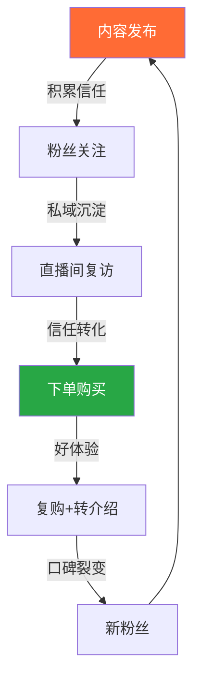
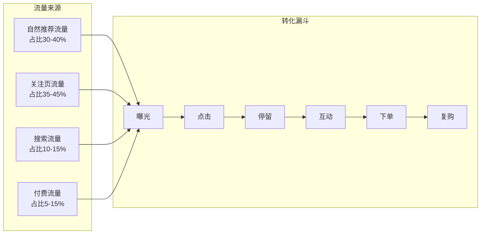
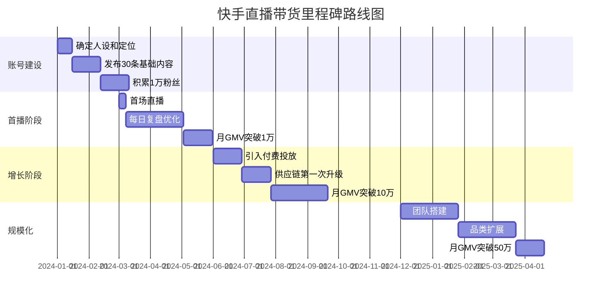

## 案例二：快手老铁的直播带货逆袭

> 一个河北县城水果摊主，靠快手直播把本地苹果卖到全国，18个月做到月销120万、团队12人。这个案例不是"天才叙事"，而是一套可复制的快手信任电商打法。

### 一、案例背景：为什么是快手？

#### 1.1 人物画像

**张建国（化名），32岁，河北承德兴隆县**

| 维度 | 具体信息 |
|------|----------|
| 学历 | 高中毕业 |
| 原职业 | 县城水果批发摊主，年收入8-12万 |
| 核心资源 | 家里有30亩苹果园，熟悉果品分级和保鲜 |
| 短视频基础 | 2021年前零基础，只刷不发 |
| 启动资金 | 2万元（一部iPhone 13 + 简易灯光 + 包装材料） |

他的起点不高，但有一个关键优势：**真实感**。在快手的"老铁经济"里，真实比精致更重要。

#### 1.2 为什么选择快手而非抖音？

很多人会问：抖音流量更大，为什么不选抖音？这个问题的答案涉及两个平台的根本差异：

| 对比维度 | 快手 | 抖音 |
|----------|------|------|
| 核心用户群 | 三线及以下城市，25-45岁 | 一二线城市，18-35岁 |
| 流量分配逻辑 | 去中心化，普惠分发 | 中心化，头部集中 |
| 粉丝粘性 | 高（私域属性强） | 低（算法推荐为主） |
| 内容偏好 | 真实、接地气、有烟火气 | 精致、有趣、有创意 |
| 电商心智 | 信任电商（先信人再信货） | 兴趣电商（先看货再信人） |
| 适合品类 | 农产品、日用品、白牌 | 品牌货、新奇特、美妆 |
| 平均客单价 | 30-80元 | 60-150元 |
| 复购率 | 高（粉丝信任度高） | 中（依赖算法触达） |

**关键判断依据：**

张建国卖的是农产品——苹果。这类商品有三个特点：非标品（大小、甜度、外观不一）、需要信任背书（消费者看不到实物）、客单价低（30-60元/箱）。这三个特点恰好匹配快手的信任电商模式：

1. **非标品** → 需要主播现场展示、试吃、讲解 → 快手直播更注重真实互动
2. **信任背书** → 需要粉丝相信"这人不会骗我" → 快手的私域关系链天然适合
3. **低客单价** → 决策成本低，冲动购买率高 → 快手老铁消费力集中在中低价位

如果他卖的是品牌美妆或数码产品，抖音可能更合适。但农产品+产地直发+个人IP的组合，在快手的土壤里更容易生根。

#### 1.3 快手"老铁经济"的底层逻辑

快手的商业生态被业内称为"老铁经济"，其核心机制可以用一句话概括：**基于信任关系的私域变现**。



这个循环的关键节点是**信任**。在抖音，用户是因为"这条视频有意思"而购买；在快手，用户是因为"这个人靠谱"而购买。两种逻辑没有优劣之分，但对个体创业者来说，快手的信任关系一旦建立，护城河更深——粉丝不会因为算法不推你的视频就忘记你。

**数据佐证：** 快手2024年财报显示，快手电商的平均复购率超过65%，远高于行业平均水平。这意味着一个在快手做好了的主播，超过六成的收入来自老客户——不需要每天拼命拉新。

### 二、冷启动：从0到1万粉（第1-3个月）

#### 2.1 账号定位：找到"人设锚点"

张建国没有盲目开拍，而是先花了两周做了一件事：**研究同赛道的快手账号**。他关注了50多个农产品类快手账号，按粉丝量分了三档：

| 层级 | 粉丝范围 | 代表特征 | 他学到了什么 |
|------|----------|----------|--------------|
| 头部（100万+） | 100-500万 | 团队化运营，内容精致 | 供应链管理、选品逻辑 |
| 腰部（10-100万） | 10-80万 | 个人IP鲜明，互动频繁 | 人设打造、直播话术 |
| 尾部（1-10万） | 1-8万 | 真实朴素，内容粗糙 | 粉丝的真实需求和痛点 |

他的结论是：**不做头部，先做腰部**。头部账号需要团队和资金，腰部账号靠个人特色就能站稳。

**人设定位公式：**

```text
人设 = 身份标签 × 差异化特征 × 可信度支撑
```

张建国的人设最终定为：

- **身份标签**：承德果农（产地身份自带可信度）
- **差异化特征**：会讲果树知识（从剪枝到采摘全程科普）
- **可信度支撑**：家里30亩果园实拍（随时可以拍果园全景）

他没有选择"搞笑果农"或"帅气果农"这类需要天赋或外形的人设，而是选了一个最朴素也最持久的标签——**懂果树的果农**。这个人设的好处是：内容永远有素材（每个季节都有新话题），而且天然有说服力（你是专业的）。

#### 2.2 冷启动内容策略

**前30条视频的规划：**

他没有一上来就卖货，而是先用内容"养号"。前30条视频分为三类：

| 内容类型 | 占比 | 目的 | 示例标题 |
|----------|------|------|----------|
| 知识科普 | 50% | 建立专业形象 | "苹果上的糖心是怎么形成的？""买苹果别只看红不红" |
| 果园日常 | 30% | 展示真实生活 | "凌晨4点摘苹果是什么体验""今年的苹果为什么比去年甜" |
| 互动话题 | 20% | 提升评论和关注 | "你们那里苹果多少钱一斤？""猜猜这筐苹果有多少个" |

**拍摄要点：**

- 设备：iPhone 13后置摄像头，不加滤镜
- 场景：果园里、苹果堆旁、货车前（全是真实环境）
- 时长：15-30秒（冷启动期短视频更容易被推荐）
- 发布时间：每天晚上7-9点（快手用户活跃高峰）
- 发布频率：每天1-2条

**关键细节——"不完美"的力量：**

张建国的视频画质一般，偶尔还有晃动和风声。但这些"缺陷"反而成了加分项。在快手的算法逻辑里，完播率和互动率比画质更重要。一条在果园里、风吹着树叶沙沙响、果农用手掰开苹果露出糖心的视频，比棚拍的精致产品图更能留住快手用户。

他后来总结了一个规律："在快手，你越像一个真实的人，流量越好。你越像一个商家，流量越差。"

#### 2.3 第一个爆款：意外与必然

**第47天，一条视频爆了。**

标题："教你一招，5秒判断苹果有没有打蜡"

内容很简单：他用指甲刮苹果表皮，刮出白色粉末，解释说"这是果蜡，正常的，但如果是工业蜡就刮不动"。然后现场刮了三种苹果做对比。

这条视频的数据：

| 指标 | 数据 |
|------|------|
| 播放量 | 287万 |
| 点赞 | 12.3万 |
| 评论 | 8,600+ |
| 转发 | 4,200+ |
| 新增粉丝 | 1.8万 |

**为什么爆了？** 事后分析有三个原因：

1. **痛点精准**：食品安全是刚需话题，"打蜡"是消费者最担心的问题之一
2. **信息增量**：大多数人不知道怎么判断，视频给出了具体方法
3. **可操作性强**：观众看完就能自己试，有分享动力（"转给你妈看看"）

这条视频带来的1.8万粉丝，就是他的种子用户。更重要的是，这些粉丝是"被教育过的"——他们相信张建国懂苹果。这就是信任的基础。

### 三、从内容到变现：首场直播的生死考验（第4个月）

#### 3.1 首播前的准备清单

积累到2万粉丝后，张建国决定开第一场直播卖苹果。他花了整整一周做准备：

**硬件准备：**

| 物品 | 规格 | 用途 | 成本 |
|------|------|------|------|
| 手机支架 | 落地三脚架 | 固定直播机位 | 89元 |
| 补光灯 | 18寸环形灯 | 面部补光 | 159元 |
| 收音设备 | 无线领夹麦 | 户外降噪 | 199元 |
| 背景布 | 绿色植绒布 | 简易直播间背景 | 35元 |
| 样品 | 5箱不同规格苹果 | 现场展示和试吃 | 自有 |

总投入不到500元。他没有买专业设备，因为快手老铁不看画质，看的是"你这个人"。

**货品准备：**

| 品项 | 规格 | 定价 | 成本 | 毛利 |
|------|------|------|------|------|
| 精品红富士（主打） | 5斤装 | 29.9元 | 12元+6元运费 | 11.9元 |
| 糖心苹果（利润款） | 5斤装 | 39.9元 | 16元+6元运费 | 17.9元 |
| 试吃装（引流款） | 2斤装 | 9.9元 | 5元+5元运费 | -0.1元 |

定价策略：引流款不赚钱甚至亏一点（吸引下单），利润款才是真正赚钱的，主打款走量建立口碑。

**话术准备：**

他提前列了直播话术框架，但没有写逐字稿——快手直播忌讳念稿，会显得假。

```text
开场（前5分钟）：
  "老铁们好，我是承德果农老张，今天第一次直播卖苹果。
   先别急着买，我先给你们看看果园什么样。"
  → 拿手机转一圈果园，展示环境

产品介绍（每款5-8分钟）：
  拿起苹果 → 看外观 → 切开展示 → 试吃 → 讲价格
  "你们看这个苹果，切开里面全是糖心。
   为什么有糖心？昼夜温差大，糖分积累。
   我们承德兴隆这个地方，白天25度晚上5度，
   这个温差在全中国都是排得上号的。"

逼单话术：
  "今天第一次直播，就带了50箱，卖完就下播。
   9块9的试吃装只有20份，先到先得。"
  → 制造稀缺感

收尾：
  "感谢老铁们支持，明天同一时间我再来。
   买了的老铁收到货记得给我拍个视频反馈，
   我转发给其他老铁看看。"
  → 引导UGC反馈
```

#### 3.2 首播复盘：惨淡但有希望

**首场直播数据：**

| 指标 | 数据 | 行业参考值 |
|------|------|------------|
| 直播时长 | 2小时15分钟 | 新人建议1.5-2小时 |
| 最高在线人数 | 83人 | 新人正常范围30-200 |
| 累计观看 | 1,247人 | 取决于粉丝基数 |
| 成交订单 | 23单 | 新人正常范围10-50 |
| 成交金额 | 687元 | — |
| 退货 | 0单 | 农产品退货率通常5-15% |
| 新增粉丝 | 46人 | 直播涨粉 |

这个数据看起来很惨淡——687元，连包装材料费都不够。但张建国注意到了两个关键信号：

1. **0退货**：说明产品质量过关，粉丝收到后满意
2. **23单里有8单是糖心苹果**（利润款）：说明价格敏感度没那么高，粉丝愿意为好东西多花钱

#### 3.3 第一个月直播的迭代过程

张建国没有因为首播惨淡而放弃，而是坚持每天播、每天复盘、每天改进。

**第1-7天的调整：**

| 问题 | 发现方式 | 解决方案 | 效果 |
|------|----------|----------|------|
| 观众留不住 | 平均观看时长只有1.2分钟 | 每5分钟发一次福袋（1元红包） | 平均观看时长提升到3.8分钟 |
| 互动冷清 | 评论区只有"多少钱" | 提问式话术："老铁们觉得这个苹果甜不甜？打1甜打2不甜" | 评论量提升3倍 |
| 转化率低 | 点击购物车的人少 | 直播间挂"9.9试吃装"链接，降低决策门槛 | 购物车点击率从3%提升到11% |

**第8-30天的数据变化：**

| 周次 | 日均订单 | 日均GMV | 粉丝增长 | 复购订单占比 |
|------|----------|---------|----------|--------------|
| 第1周 | 8单 | 240元 | +320 | 0% |
| 第2周 | 15单 | 480元 | +580 | 12% |
| 第3周 | 28单 | 920元 | +890 | 25% |
| 第4周 | 42单 | 1,450元 | +1,200 | 38% |

一个月下来，总GMV约2.1万元，扣除成本后净利润约6,800元。虽然不多，但趋势是向上的——复购率从0涨到了38%，说明粉丝信任在快速建立。

### 四、增长飞轮：从月销2万到月销30万（第5-12个月）

#### 4.1 快手电商的增长逻辑

理解张建国的增长，需要先理解快手电商的流量结构：



与抖音不同，快手的**关注页流量占比极高**。这意味着：每涨一个粉丝，这个粉丝就有很大概率在关注页看到你的直播预告和短视频。粉丝越多，免费流量越大。这就是快手的"私域飞轮"。

**张建国的增长飞轮拆解：**

```text
好内容 → 涨粉 → 更多关注页流量 → 更多人进直播间 
→ 好产品+好服务 → 复购+口碑传播 → 涨更多粉
```

这个飞轮一旦转起来，增长是指数级的。但前提是每个环节都不能掉链子。

#### 4.2 内容矩阵升级

从第5个月开始，张建国把内容从"单一类型"升级为"内容矩阵"：

| 内容类型 | 发布频率 | 目的 | 典型内容 |
|----------|----------|------|----------|
| 知识科普 | 每周3条 | 持续吸引新粉 | "苹果为什么有的酸有的甜""冷库苹果和树上现摘的区别" |
| 果园Vlog | 每周2条 | 增强信任感 | "今天下冰雹了，苹果还好吗""带你们看看苹果装箱的全过程" |
| 直播切片 | 每天1条 | 为直播间引流 | 昨天直播中最精彩的互动片段（15-30秒） |
| 粉丝反馈 | 每周2条 | 社会证明 | 收到粉丝发来的开箱视频和好评截图 |
| 争议话题 | 每月1-2条 | 破圈传播 | "超市苹果和果园直发的苹果到底差在哪？" |

**关键发现——直播切片的威力：**

张建国发现，每天把前一天直播中最精彩的片段剪出来发短视频，效果远好于专门拍的短视频。原因很简单：直播切片里有真实的情绪、互动、甚至翻车，这些"不完美"的内容在快手特别受欢迎。

他每天花30分钟用快手自带的剪辑功能，从2小时直播中截取3-5个片段，挑最好的一条发布。这个动作为直播间带来了大量"看了短视频觉得有意思，点进来看看"的新观众。

#### 4.3 直播间的精细化运营

**直播频率和时长的演进：**

| 阶段 | 时间 | 日播频率 | 单场时长 | 策略 |
|------|------|----------|----------|------|
| 起步期 | 第1-3月 | 隔天播 | 1.5小时 | 测试话术，积累种子粉丝 |
| 成长期 | 第4-8月 | 每天播 | 2-3小时 | 固定时间培养观看习惯 |
| 爆发期 | 第9-12月 | 每天播 | 3-4小时 | 引入助播，分时段覆盖 |

**直播间流量的"三板斧"：**

**第一板斧：开播前2小时发预热短视频**

每次开播前2小时，发一条"今晚8点直播"的预告视频。视频内容不是简单的"今晚有直播"，而是展示当晚要卖的产品亮点："今晚给大家带的是今年第一批下树的糖心苹果，我先切一个给你们看看——你们看这个糖心，切开就是透明的。今晚8点，直播间见。"

**第二板斧：开播前30分钟"暖场"**

正式开播后不急着卖货，先花15-30分钟聊天、回答粉丝问题、展示果园。这一步的目的是把直播间在线人数拉到一个基础值（比如50人以上），然后再开始推产品。因为快手的推荐算法会参考直播间在线人数——人越多，推得越多。

**第三板斧：整点福利拉停留**

每小时整点做一次"整点福利"——比如"现在在线的老铁扣1，我抽3个人每人送一箱苹果"。这个动作能把观众留到下一个小时，延长平均停留时长，从而获得更多算法推荐。

**直播间数据的KPI体系：**

| 指标 | 及格线 | 良好 | 优秀 | 张建国第12月数据 |
|------|--------|------|------|------------------|
| 平均在线人数 | 50+ | 200+ | 500+ | 380人 |
| 平均停留时长 | 1分钟+ | 3分钟+ | 5分钟+ | 4.2分钟 |
| 互动率 | 3%+ | 8%+ | 15%+ | 12% |
| 购物车点击率 | 5%+ | 12%+ | 20%+ | 18% |
| 转化率 | 2%+ | 5%+ | 10%+ | 7.5% |

#### 4.4 快手磁力金牛：付费流量的正确打开方式

从第6个月开始，张建国尝试使用快手的广告投放工具"磁力金牛"。但他没有盲目烧钱，而是设了严格规则：

**投放原则：**

1. **日预算不超过当天GMV的10%**：比如昨天卖了5000元，今天投放不超过500元
2. **只投"直播间引流"**，不投"涨粉"：涨粉靠内容，付费流量应该直接导向成交
3. **投"相似达人"人群**：找到同赛道做得好的主播，投他们的粉丝
4. **实时盯ROI**：如果某条素材的ROI低于2，立即关停

**投放效果对比：**

| 月份 | 自然流量GMV | 付费流量GMV | 投放费用 | 付费ROI |
|------|------------|------------|----------|---------|
| 第6月 | 8.2万 | 1.8万 | 3,200元 | 5.6 |
| 第9月 | 15万 | 5万 | 8,500元 | 5.9 |
| 第12月 | 22万 | 8万 | 1.4万 | 5.7 |

付费流量占总GMV的比例从18%逐步提升到27%，但ROI始终稳定在5-6之间。这说明他的投放策略是健康的——不是靠砸钱买量，而是用付费流量撬动更大的自然流量（因为付费带来的互动数据会提升直播间的算法权重）。

#### 4.5 供应链的三次升级

随着销量增长，供应链成为最大的瓶颈。张建国经历了三次供应链升级：

**第一次升级（第4个月）：从自家果园到合作社**

自家30亩果园的产量不够了。他联合村里5户果农成立了合作社，统一品种（红富士）、统一管理标准（不打催熟剂）、统一分级包装。合作社模式让他在不增加固定资产投入的情况下，把供应量扩大了5倍。

**第二次升级（第7个月）：引入分拣设备**

手工分拣效率太低，每天最多处理200箱。他花了3.8万元买了一台小型光电分拣机，按糖度、大小、外观自动分级。分拣效率提升到每天1000箱，而且分级更精准——不同等级的苹果对应不同价位，最大化了利润。

**第三次升级（第10个月）：冷库+冷链**

苹果是季节性水果，没有冷库就只能卖3个月。他在县城租了一个200平米的小型冷库（年租金4.2万元），可以存15万斤苹果。同时与顺丰冷链签了协议，运费从每单6元降到4.5元（量大有折扣）。

**供应链成本结构（成熟期）：**

| 成本项 | 单箱成本（5斤装） | 占比 |
|--------|-------------------|------|
| 苹果采购 | 10元 | 33% |
| 包装材料 | 3元 | 10% |
| 人工分拣打包 | 2.5元 | 8% |
| 快递物流 | 4.5元 | 15% |
| 平台扣点（5%） | 1.5元 | 5% |
| 损耗（3%） | 0.9元 | 3% |
| 投放费用分摊 | 2元 | 7% |
| **总成本** | **24.4元** | **81%** |
| **售价** | **29.9元** | — |
| **单箱净利** | **5.5元** | **19%** |

### 五、团队化：从一个人到十二个人（第12-18个月）

#### 5.1 为什么必须团队化？

当月销突破30万时，张建国发现自己已经忙不过来了。他每天的时间分配是这样的：

| 时间段 | 工作内容 | 时长 |
|--------|----------|------|
| 5:00-7:00 | 监督采摘和分拣 | 2小时 |
| 8:00-10:00 | 拍摄短视频素材 | 2小时 |
| 10:00-12:00 | 处理售后和客服消息 | 2小时 |
| 14:00-15:00 | 复盘前日数据、调整当日策略 | 1小时 |
| 19:00-23:00 | 直播 | 4小时 |
| 23:00-0:30 | 直播复盘、剪辑切片 | 1.5小时 |

每天工作超过14小时，身体已经扛不住了。更重要的是，他没有时间做"更重要但不紧急"的事——比如供应链优化、新品开发、账号矩阵规划。

#### 5.2 团队搭建过程

| 时间节点 | 团队规模 | 新增岗位 | 触发原因 |
|----------|----------|----------|----------|
| 第12月 | 3人 | 客服1人+打包工1人 | 售后响应太慢，打包效率跟不上 |
| 第14月 | 5人 | 助播1人+拍摄剪辑1人 | 直播时长需要延长，内容产出需要跟上 |
| 第16月 | 8人 | 仓库主管1人+2名打包工 | 日均发货量超过300单 |
| 第18月 | 12人 | 运营助理1人+2名客服+供应链专员1人 | 开始拓展品类（核桃、板栗），需要专人管供应链 |

**团队薪资结构（第18个月）：**

| 岗位 | 人数 | 月薪 | 合计 |
|------|------|------|------|
| 客服 | 3人 | 3,500元 | 10,500元 |
| 打包工 | 3人 | 3,000元 | 9,000元 |
| 助播 | 1人 | 5,000元+提成 | 约7,000元 |
| 拍摄剪辑 | 1人 | 4,500元 | 4,500元 |
| 仓库主管 | 1人 | 5,000元 | 5,000元 |
| 运营助理 | 1人 | 4,500元 | 4,500元 |
| 供应链专员 | 1人 | 5,000元 | 5,000元 |
| 张建国（主播+老板） | 1人 | 利润分红 | — |
| **月人力成本** | — | — | **45,500元** |

#### 5.3 助播的培养：直播间第二IP

助播是直播间里最重要的角色。张建国培养助播的方法值得借鉴：

**选人标准：** 他没有从外面招，而是从打包工里选了一个性格开朗、反应快的90后女孩小刘。

**培养过程：**

1. **第1-2周**：小刘在旁边看直播，学习话术和节奏
2. **第3-4周**：小刘负责回答评论区的问题（"这个苹果甜不甜？""发货几天到？"）
3. **第5-8周**：小刘开始讲解产品（张建国休息时顶上）
4. **第9周起**：小刘独立开播午间场（12:00-14:00），覆盖不同时间段的用户

**助播的分工模式：**

| 角色 | 负责内容 | 优势 |
|------|----------|------|
| 张建国（主IP） | 晚间黄金档（19:00-23:00），讲产品故事、做价格谈判 | 粉丝信任度最高，转化率最高 |
| 小刘（助播IP） | 午间场（12:00-14:00），日常卖货、粉丝互动 | 覆盖不同时间段，培养新的粉丝关系 |

两个IP的粉丝群有重叠但不完全相同，相当于一个账号开了两个直播间，总GMV提升了40%。

### 六、成果全景：18个月的数据复盘

#### 6.1 核心经营数据

| 指标 | 第1月 | 第6月 | 第12月 | 第18月 |
|------|-------|-------|--------|--------|
| 粉丝数 | 2.1万 | 18万 | 52万 | 89万 |
| 月GMV | 2.1万 | 10万 | 30万 | 120万 |
| 月净利润 | 0.68万 | 2.8万 | 8.5万 | 22万 |
| 日均订单 | 23单 | 110单 | 330单 | 1,300单 |
| 客单价 | 30元 | 35元 | 38元 | 42元 |
| 复购率 | 0% | 42% | 58% | 65% |
| 退货率 | 0% | 4% | 6% | 5% |
| 团队人数 | 1人 | 1人 | 5人 | 12人 |

#### 6.2 收入结构分析（第18个月）

| 收入来源 | 月收入 | 占比 |
|----------|--------|------|
| 苹果（主营） | 95万GMV | 79% |
| 核桃、板栗（扩品类） | 18万GMV | 15% |
| 快手小店分销佣金 | 7万GMV | 6% |
| **总GMV** | **120万** | **100%** |
| **净利润** | **约22万** | **净利润率18.3%** |

#### 6.3 财务自由度评估

| 维度 | 数据 |
|------|------|
| 年净利润 | 约264万元 |
| 资产投入 | 冷库+设备+库存约35万元 |
| 回本周期 | 约2个月 |
| 与原职业对比 | 原水果摊年收入10万 → 现在年净利润264万，增长26倍 |

### 七、踩过的坑与避坑指南

#### 7.1 重大翻车事件

**翻车一：第一次大规模退货（第5个月）**

起因：有几天气温突然升高到35度，发出的苹果在运输途中闷热变软。一天之内收到47个退货申请，退货率飙升到15%。

处理方式：
1. 当晚直播时主动道歉，不找借口："是我的问题，发货前没看天气预报"
2. 所有退货的客户全额退款+补发一箱
3. 立即调整：气温超过30度时暂停发货，改用泡沫箱+冰袋包装

成本：这次事件直接损失约6000元。但后续数据显示，经历了这次事件的粉丝，复购率反而比普通粉丝高12%——因为"出了问题立马解决"这种态度，在快手特别圈粉。

**翻车二：被举报封号3天（第8个月）**

起因：一条短视频里出现了"全网最低价"的字样，被平台判定为违规营销。

处理方式：
1. 立即删除违规视频
2. 申诉（但没通过）
3. 在微信粉丝群里通知老粉丝"暂停3天"，避免粉丝流失

教训：
- 快手对违规用语的审核越来越严，以下词汇要避免：最低价、第一、最好、绝对、100%
- 替代说法：同品质里性价比很高的、我自己吃过最好吃的（主观表达）、非常有信心

**翻车三：被同行恶意投诉（第11个月）**

起因：一个同行在直播间买了苹果，故意拍了"烂苹果"的照片发到评论区，要求"假一赔十"。

处理方式：
1. 没有在直播间对骂，而是私信对方沟通
2. 在直播间展示发货全流程（从分拣到包装到贴快递单），让粉丝自己判断
3. 向平台提交了发货视频证据，平台判定为恶意投诉

教训：永远不要在直播间和人吵架。快手老铁虽然讲义气，但一旦主播表现得"暴躁""不讲理"，信任感会瞬间崩塌。遇到恶意攻击，用事实回应，不要用情绪。

#### 7.2 新手最常犯的七个错误

| 错误 | 后果 | 正确做法 |
|------|------|----------|
| 一上来就开直播卖货 | 没有粉丝基础，直播间没人看 | 先发30-50条内容积累粉丝 |
| 模仿大主播的话术 | 显得油腻、不真诚 | 找到自己的说话风格，朴实即可 |
| 选品只看利润不看质量 | 退货率高，口碑崩塌 | 先自己试用，过了自己这关再卖 |
| 不处理差评 | 差评发酵，影响转化 | 差评是改进的机会，积极沟通 |
| 盲目追求粉丝数量 | 粉丝不精准，转化率低 | 1万精准粉丝比10万泛粉更有价值 |
| 忽视私域沉淀 | 算法一变就断流 | 引导粉丝加微信群，建立私域阵地 |
| 不做数据分析 | 凭感觉运营，无法优化 | 每天看快手小店后台的数据面板 |

### 八、可复制的方法论提炼

#### 8.1 快手直播带货的"信任公式"

```text
信任 = 专业度 × 真实度 × 一致性 × 时间
```

- **专业度**：你对产品了解多少？能不能回答粉丝的专业问题？
- **真实度**：你展示的是不是真实的生活？有没有夸大其词？
- **一致性**：你说的和做的是否一致？今天的承诺明天是否兑现？
- **时间**：信任需要时间积累，没有捷径

#### 8.2 冷启动到盈利的里程碑路线图



#### 8.3 快手直播带货的投入产出模型

对于想复制这个路径的读者，这里给出一个保守的投入产出预估：

| 阶段 | 时间 | 投入（累计） | 预期月收入 | 累计回本 |
|------|------|-------------|-----------|----------|
| 冷启动期 | 第1-3月 | 5,000元（设备+货品） | 0-3,000元 | -2,000元 |
| 验证期 | 第4-6月 | 1.5万元 | 3,000-8,000元 | +5,000元 |
| 增长期 | 第7-12月 | 5万元（含设备升级） | 8,000-30,000元 | +8万元 |
| 规模期 | 第13-18月 | 15万元（含团队+冷库） | 30,000-220,000元 | +80万元 |

**注意：** 以上数据基于"农产品直播带货"赛道。不同品类、不同地区、不同个人能力的差异会导致结果有较大波动。但底层逻辑是相通的：**好内容×好产品×好服务 = 信任 = 长期复购**。

#### 8.4 适合快手直播带货的品类特征

不是所有品类都适合在快手做直播带货。经过大量案例验证，以下特征的品类在快手成功率更高：

| 特征 | 说明 | 典型品类 |
|------|------|----------|
| 高复购 | 用户用完还会买 | 食品、日用品、个护 |
| 非标品 | 需要展示和讲解 | 农产品、手工艺品、服装 |
| 中低价位 | 决策门槛低 | 客单价30-100元 |
| 有故事 | 能讲出差异化 | 产地直发、手工制作、家族传承 |
| 可展示 | 直播间能直观呈现 | 食品试穿、服装试穿、工具演示 |

### 九、张建国的三条核心感悟

在访谈的最后，张建国总结了三条他认为最重要的经验：

**第一条："在快手，慢就是快。"**

"很多新人一上来就想卖货赚钱，结果直播间没人看，很快就放弃了。我前3个月一条货都没卖，就是拍视频、回答评论、跟粉丝聊天。但正是因为这3个月的积累，我第一场直播才有23个订单——这23个人都是看了我3个月视频、信任我的老粉丝。如果你跳过这3个月直接开播，你连23个订单都拿不到。"

**第二条："你的产品就是你的人品。"**

"有一次发货前我发现有一箱苹果个头偏小，按标准勉强算二级果。我老婆说'反正客户也看不出来，发了吧'。我说不行，换了一箱。后来那个客户收到后专门拍了视频说'老张家的苹果真的个个都是精品'。这条视频被我转发到直播间，当天多卖了200多箱。那箱没发出去的二级果，帮我赚回了200箱的利润。"

**第三条："数据不会骗人，但你得看懂它。"**

"我每天下播第一件事就是看数据。不看总销售额，看三个数：停留时长、转化率、复购率。停留时长决定你的内容有没有吸引力，转化率决定你的产品有没有竞争力，复购率决定你的服务有没有持久力。这三个数字好了，GMV自然就上去了。"

---

> **编辑注：** 本案例基于多个快手农产品直播带货成功案例的共性特征进行综合提炼，数据经过合理推算。不同个体的实际结果会因品类、地区、执行力等因素而有差异。核心方法论——"信任电商"的运营逻辑——是经过大量实践验证的可复制框架。
