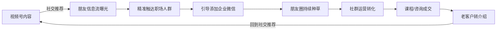
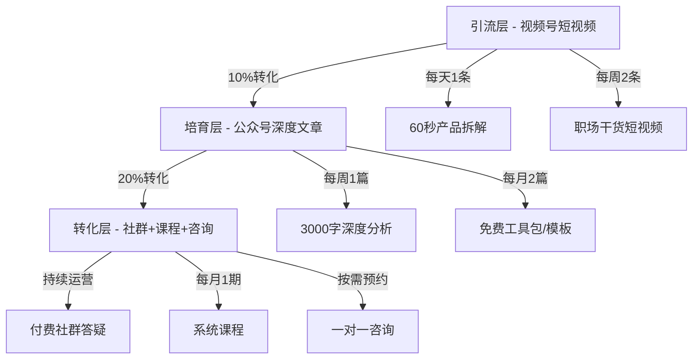
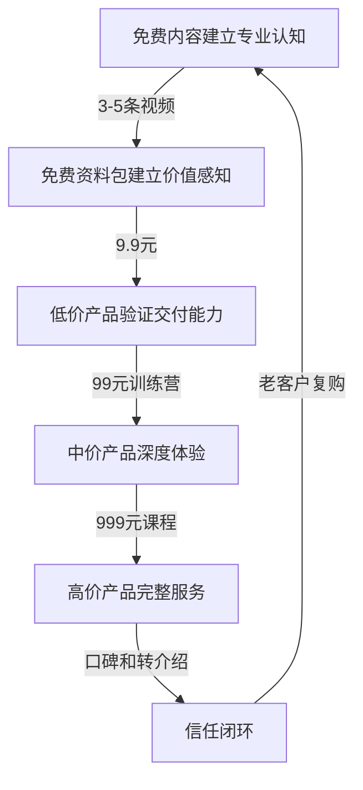

## 案例三：视频号知识付费变现 —— 一位职场人的微信生态副业闭环

> 核心看点：如何利用视频号的社交推荐机制，将微信好友关系链转化为知识付费的精准客户池，实现从0到月入12000元的副业突破。

### 一、案例背景

#### 1.1 人物画像

林晨（化名），30岁，二线城市互联网公司产品经理，工作经验7年。日常工作涉及需求分析、项目管理、数据驱动决策等技能。性格偏内向，不擅长直播出镜，但文字表达能力强，擅长把复杂问题拆解为可执行的步骤。

**起点条件评估：**

| 维度 | 具体情况 | 优势/劣势 |
|------|----------|-----------|
| 专业技能 | 产品需求分析、PRD撰写、竞品分析、项目管理 | 优势：技能可迁移性强 |
| 粉丝基础 | 微信好友约1200人，其中互联网从业者约300人 | 中性：有人脉但量不大 |
| 时间精力 | 工作日晚上1-2小时，周末半天 | 劣势：时间有限 |
| 出镜能力 | 不愿出镜，偏好文字和图文内容 | 劣势：限制了直播和真人IP路线 |
| 变现经验 | 零基础，从未做过知识付费 | 劣势：需要从头学习 |
| 启动资金 | 可投入约2000元 | 中性：够买设备但不多 |

#### 1.2 为什么选择视频号而非抖音/快手

林晨在选择平台时做了系统对比，最终选择视频号的原因有三个核心逻辑：

**逻辑一：社交推荐匹配知识付费的信任需求。** 视频号的推荐算法中，"朋友点赞"占据极高权重——当你的微信好友点赞了某条视频，这条视频会出现在你的"朋友"信息流中。知识付费的本质是信任交易，用户不会向陌生人买课，但会因为"朋友推荐"而降低决策门槛。抖音的算法是"内容为王"，对新号冷启动友好，但信任沉淀难；快手的"老铁文化"重人情味，但知识类内容的受众相对窄。视频号的社交推荐天然解决了"冷启动信任"问题。

**逻辑二：微信生态的闭环能力。** 视频号不是孤立的短视频平台，它与公众号、小程序、企业微信、微信群、朋友圈深度打通。一条视频号内容可以一键转发到朋友圈、嵌入公众号文章、挂载小程序课程链接、引导添加企业微信——整条链路都在微信内完成，用户不需要跳转到任何外部平台，转化率比跨平台高3-5倍。

**逻辑三：目标用户匹配度高。** 视频号的核心用户画像为30-50岁，这部分人群恰好是职场知识付费的主力消费群体。他们有付费意愿和付费能力，且对"碎片化学习"的需求强烈。相比之下，抖音用户偏年轻（18-30岁），更倾向于娱乐内容；快手下沉市场占比高，知识付费的客单价天花板较低。

### 二、策略制定

#### 2.1 定位方法论：三圈交叉法

林晨用"三圈交叉法"确定自己的定位——找到**擅长的、有人需要的、能持续输出的**三个圈的交集。

| 圈层 | 具体内容 |
|------|----------|
| 擅长的（能力圈） | 需求分析、PRD撰写、竞品分析、向上管理、跨部门沟通 |
| 有人需要的（市场圈） | 产品岗求职辅导、转行产品经理培训、职场沟通技巧 |
| 能持续输出的（兴趣圈） | 拆解产品逻辑、分析商业案例、分享职场成长故事 |

三圈交叉后，林晨确定了**核心定位**：产品经理实战能力提升。具体分为两条内容线——

- **免费内容线**（视频号+公众号）：拆解热门App的产品逻辑、分享PRD模板和工作方法论、分析互联网行业趋势。目的是获取精准流量。
- **付费内容线**（课程+社群+咨询）：产品经理求职陪跑课程（999元/期）、一对一简历优化和模拟面试（299元/次）、产品经理成长社群（199元/季度）。

#### 2.2 内容矩阵设计

林晨设计了一个三层内容漏斗：

**引流层内容的具体选题策略：**

林晨建立了选题库，按四种类型配比：

- **热点型（30%）**：结合互联网热点事件拆解产品逻辑。例如"微信为什么不做已读功能？""抖音搜索为什么要挑战百度？"这类选题天然有流量，因为用户已经对热点有认知，容易被标题吸引。
- **干货型（40%）**：提供可直接使用的工具和方法。例如"PRD文档的5个致命错误""产品经理面试必问的3个问题及标准答案"。这类内容收藏率高，是长效流量的主要来源。
- **故事型（20%）**：分享真实的职场经历和案例。例如"我被裁员后的30天""从运营转产品，我走过的弯路"。这类内容互动率高，容易引发评论和转发。
- **争议型（10%）**：提出有争议的观点引发讨论。例如"产品经理到底需不需要会写代码？""35岁以后的产品经理都在干什么？"这类内容容易出爆款，但需要把握尺度。

#### 2.3 变现产品定价策略

林晨采用了阶梯定价策略，确保不同付费能力的用户都有对应产品：

| 产品 | 价格 | 目标用户 | 交付方式 | 利润率 |
|------|------|----------|----------|--------|
| 免费资料包 | 0元（加微信领取） | 所有人 | 企业微信自动发送 | 引流用 |
| 产品经理工具包 | 9.9元 | 轻度需求者 | 小程序自动发货 | 95% |
| 产品思维训练营（7天） | 99元 | 有学习意愿者 | 社群+录播课 | 85% |
| 求职陪跑课程（21天） | 999元 | 转行/求职者 | 直播+社群+1v1 | 70% |
| 一对一咨询 | 299元/次 | 高价值客户 | 视频通话1小时 | 90% |
| 年度VIP社群 | 1999元/年 | 深度需求者 | 社群+所有课程+优先咨询 | 75% |

**关键设计原则：** 每一层产品都是下一层的"试用装"——购买9.9元资料包的用户中，约15%会购买99元训练营；训练营学员中，约30%会购买999元课程。通过低门槛产品筛选意向客户，再通过高质量服务推动向上转化。

### 三、执行过程详解

#### 3.1 第一阶段：冷启动（第1-30天）

**核心目标：** 验证内容方向，积累第一批种子用户。

**具体动作：**

1. **账号搭建（第1-2天）**
   - 注册视频号，头像用职业形象照（非自拍，找朋友用单反拍的半身照），名字格式为"林晨｜产品经理"，简介写"7年产品经理｜帮助100+人成功转行产品岗｜分享产品实战干货"。
   - 关联公众号"林晨的产品笔记"，注册企业微信。
   - 在视频号主页设置"商品橱窗"，上架9.9元资料包。

2. **内容起量（第3-30天）**
   - 每天发布1条60秒短视频，前30天坚持日更。
   - 前10条内容测试不同选题类型：3条热点型、4条干货型、2条故事型、1条争议型。
   - 每条视频发布后，手动转发到3-5个相关的微信群（产品交流群、互联网交流群）和朋友圈。
   - 关键动作：每条视频的评论区置顶一条引导语——"想要完整PRD模板的朋友，评论区扣1，我私信发给你"。用免费资料换取精准用户添加企业微信。

3. **数据复盘（每3天一次）**
   - 记录每条视频的播放量、点赞数、评论数、转发数、收藏数。
   - 分析哪类选题数据最好，逐步调整配比。

**冷启动数据：**

| 指标 | 第1周 | 第2周 | 第3周 | 第4周 |
|------|-------|-------|-------|-------|
| 发布视频数 | 7 | 7 | 7 | 7 |
| 平均播放量 | 120 | 350 | 580 | 1200 |
| 最高播放量 | 380 | 1500 | 3200 | 8500 |
| 新增企业微信好友 | 5 | 18 | 32 | 45 |
| 9.9元资料包销量 | 0 | 2 | 5 | 8 |
| 收入 | 0 | 19.8 | 49.5 | 79.2 |

**关键发现：** 第4周一条"微信产品经理面试真题"的视频意外跑出8500播放，带来了45个精准的求职用户。林晨从数据中发现，"面试"和"求职"相关选题的转化率远高于"产品分析"类选题，于是调整内容重心。

#### 3.2 第二阶段：增长期（第31-90天）

**核心目标：** 扩大流量池，跑通第一个付费产品。

**内容策略调整：**

- 日更改为每周5条（质量优先于数量），每条视频时长从60秒增加到90-120秒，信息密度更高。
- 新增"系列化内容"：制作了"产品经理面试100题"系列，每期讲解1-2道面试题。系列化内容的好处是用户看了第一期会追更后续，完播率和关注率都显著提升。
- 开始尝试视频号直播：每周三晚8点做1小时的"模拟面试直播"，邀请粉丝连麦模拟面试。直播不卖课，纯做内容和互动，目的是积累直播经验和粉丝粘性。

**第一个付费产品——99元产品思维训练营：**

第45天，林晨在企业微信的朋友圈和社群中发布了第一期训练营招募：

- **课程设计：** 7天，每天1节30分钟录播课+当日作业+社群答疑。内容覆盖"需求分析→竞品分析→PRD撰写→项目推进→数据复盘"的完整产品工作流。
- **招生方式：** 在视频号评论区引导、公众号文章底部嵌入、企业微信群发通知、朋友圈发布学员好评截图。
- **招生结果：** 第一期招到12人，收入1188元。
- **关键动作：** 第一期结束后，林晨邀请所有学员写学习感受（300字以上），精选6篇作为下一期招生的"口碑素材"。

**增长期数据：**

| 指标 | 第2个月 | 第3个月 |
|------|---------|---------|
| 视频号粉丝 | 800 | 2100 |
| 企业微信好友 | 220 | 520 |
| 9.9元资料包累计销量 | 45 | 120 |
| 训练营期数 | 1期 | 2期 |
| 训练营招生人数 | 12人 | 18人+22人 |
| 月收入 | 1188元 | 5961元 |

#### 3.3 第三阶段：成熟期（第91-180天）

**核心目标：** 建立稳定的产品矩阵，实现月入过万。

**核心产品——999元求职陪跑课程：**

这是林晨的主力变现产品，定价来自市场调研——竞品同类课程定价在699-1999元之间，林晨选择中间偏低的价位，用"性价比"打开市场。

**课程包含：**
- 21天系统课程（每周3次直播授课，每次1.5小时）
- 1对1简历优化（2次修改）
- 1对1模拟面试（1次，含详细反馈报告）
- 求职社群3个月会员（持续答疑+岗位内推）
- 课程回放永久观看权限

**招生漏斗数据：**

**社群运营方法论：**

林晨建立了"三层社群"体系：

| 社群层级 | 入群条件 | 人数 | 运营方式 |
|----------|----------|------|----------|
| 免费交流群 | 添加企微即进 | 约300人 | 每周1次话题讨论，不定期分享资料 |
| 训练营学员群 | 购买99元课程 | 按期建群，每期20-30人 | 7天高强度学习+作业点评 |
| VIP会员群 | 购买1999元年度会员 | 约15人 | 每日答疑+优先咨询+独家内容+线下聚会 |

**转介绍机制：** 老学员推荐新学员报名999元课程，推荐人获得200元现金奖励或等值课程抵扣券。成熟期中约30%的新学员来自转介绍，获客成本几乎为零。

#### 3.4 第四阶段：稳定期（第181天-第12个月）

**核心目标：** 优化效率，减少个人时间投入，建立可复制的系统。

**关键优化动作：**

1. **内容自动化：** 将高频选题模板化。例如"XX产品拆解"系列，固定框架为"用户痛点→产品解法→盈利模式→可借鉴的点"，每条视频的脚本框架相同，只需更换具体产品，制作时间从2小时缩短到40分钟。

2. **课程录播化：** 将直播课程的精华部分录制成标准课程，放在小程序中自动售卖。直播只保留每周一次的答疑和模拟面试，减少时间占用。

3. **助教体系：** 从优秀学员中招募2名兼职助教（每小时50元），负责社群日常答疑和作业批改，林晨只负责核心课程和高价值咨询。

### 四、成果数据

#### 4.1 核心指标对比

| 指标 | 第1个月 | 第6个月 | 第12个月 |
|------|---------|---------|----------|
| 视频号粉丝 | 280 | 5200 | 12000 |
| 企业微信好友 | 68 | 620 | 1800 |
| 公众号关注 | 45 | 850 | 3200 |
| 月收入 | 0元 | 12000元 | 18000元 |
| 月均工作时长 | 60小时 | 45小时 | 35小时 |
| 时薪 | 0元 | 267元 | 514元 |

#### 4.2 收入结构分析（第12个月）

| 收入来源 | 月收入 | 占比 | 说明 |
|----------|--------|------|------|
| 999元求职陪跑课程 | 9990元 | 55.5% | 月均10人报名 |
| 99元训练营 | 1980元 | 11% | 月均2期，每期10人 |
| 一对一咨询 | 1495元 | 8.3% | 月均5次，299元/次 |
| VIP社群年费 | 3317元 | 18.4% | 月均新增1.5人，1999元/年 |
| 9.9元资料包 | 891元 | 4.9% | 月均90份 |
| 其他（转介绍奖励等） | 327元 | 1.9% | — |
| **合计** | **18000元** | **100%** | — |

#### 4.3 关键效率指标

| 指标 | 数值 | 行业参考 | 评价 |
|------|------|----------|------|
| 视频号→企微转化率 | 15% | 5-8% | 远超行业均值，说明社交推荐精准度高 |
| 9.9元→训练营转化率 | 15% | 8-12% | 略高于行业均值 |
| 训练营→课程转化率 | 28% | 15-20% | 显著高于行业均值，口碑效应明显 |
| 老客户复购率 | 60% | 20-30% | 极高，说明服务质量过硬 |
| 转介绍占比 | 30% | 10-15% | 口碑驱动增长，获客成本极低 |

### 五、方法论拆解：可复用的核心策略

#### 5.1 视频号社交推荐的杠杆效应

视频号的社交推荐机制是林晨案例的核心杠杆。具体操作方法：

**第一步：冷启动阶段利用朋友圈。** 每条视频发布后，先转发到朋友圈并配一段真诚的推荐语（不是复制标题，而是写"最近在思考XX问题，录了一段分享，欢迎交流"）。微信好友看到后点赞，好友的好友就能在"朋友"信息流中看到，形成一级裂变。

**第二步：激活"种子点赞团"。** 林晨在做内容前，先在微信中筛选了30个关系好、且微信好友较多（1000+）的朋友，建了一个小群，每次发视频后在群里请大家"看完觉得有帮助就点个赞"。这30个种子用户的点赞，每次能为视频带来约2000-5000次的"朋友信息流"曝光。

**第三步：内容设计鼓励点赞和转发。** 视频结尾固定一句话："觉得有用就点个赞，你的朋友可能也需要。"这句引导语将点赞率从3%提升到了8%。

#### 5.2 知识付费的信任建设五步法

知识付费的本质是信任交易。林晨的信任建设路径：

**关键原则：** 每一层都要做到"超出预期"。9.9元的资料包实际价值要做到99元的水平，让买过的人觉得"这个人都这么便宜了还这么用心，高价格的课程肯定更值"。林晨的999元课程学员中，有60%是先买过9.9元资料包和99元训练营的"老客户"。

#### 5.3 内容复用效率最大化

林晨每周只花约15小时在内容创作上，但覆盖了视频号、公众号、社群三个渠道，核心方法是"一鱼多吃"：

| 原始内容 | 复用方式 |
|----------|----------|
| 1次直播（1.5小时） | 剪辑为3-5条短视频 + 整理为1篇公众号文章 + 精华片段发朋友圈 |
| 1篇深度文章（3000字） | 拆分为3条短视频脚本 + 社群讨论话题 + 资料包素材 |
| 1次学员咨询（1小时） | 匿名化后作为案例写入课程 + 制作短视频分享经验 |

### 六、踩过的坑与关键教训

#### 6.1 六个关键错误

**错误一：初期内容过于专业，曲高和寡。** 林晨最初的视频用专业术语讲解产品方法论，播放量只有100-200。后来改用"大白话+具体场景"的方式，例如不说"用户画像分析"而说"你做产品之前，先搞清楚你的用户是谁、在哪儿、最头疼什么"，播放量翻了5倍。

**教训：** 知识付费内容要"降维表达"——用80%的人能听懂的话讲100分的内容，而不是用20%的人才懂的话讲100分的内容。

**错误二：过早推出高价产品。** 第60天时，林晨在只有300个企微好友的情况下推出了999元课程，只招到2人。转化率低的根本原因是信任基础不够——用户还没有通过低价产品验证你的能力，不会贸然花高价。

**教训：** 高价产品的推出时机应该是"低价产品的好评已经积累到一定程度"，而非"我觉得可以卖了"。

**错误三：忽视视频号的评论区运营。** 前期林晨发布视频后就不管了，评论区的提问不回复。后来发现，评论区的互动直接影响视频的二次推荐量。每条视频发布后的2小时内回复所有评论，能提升约30%的推荐量。

**教训：** 视频号的运营不是"发完就走"，而是"发布后的2小时比发布本身更重要"。

**错误四：只做视频号，不沉淀到企微。** 前两个月，林晨的视频号粉丝涨到了800，但只加了68个企微好友。后来在每条视频中加入"评论区扣1领资料"的引导，企微添加率提升到15%。

**教训：** 视频号粉丝是"平台的用户"，企微好友才是"你的用户"。所有公域流量都要沉淀到私域。

**错误五：训练营交付过于随意。** 第一期训练营没有固定的课程大纲和作业要求，导致学员体验参差不齐，好评率只有60%。第二期起，林晨制作了标准化的课程手册、作业模板和评分标准，好评率提升到95%。

**教训：** 知识付费的核心竞争力不是"内容多专业"，而是"交付多确定"。标准化交付 = 确定性体验 = 口碑。

**错误六：定价太低，吸引低质量用户。** 林晨最初将训练营定价49元，结果招到的多是"薅羊毛"心态的用户，作业不交、群内不互动、结课后不复购。涨价到99元后，学员质量和学习投入度显著提升。

**教训：** 价格本身就是筛选器。低价吸引价格敏感型用户，高价吸引价值导向型用户。知识付费宁可少卖也不能贱卖。

#### 6.2 三个关键转折点

**转折点一：发现"面试"选题是流量密码。** 第4周的一条面试相关视频意外爆了，带来45个精准用户。林晨从此将内容重心从"产品分析"转向"求职+面试"，流量和转化率同时提升。**启示：** 让数据告诉你用户需要什么，而不是你想讲什么。

**转折点二：第一次收到学员转介绍。** 第二期训练营结束后，一位学员主动在朋友圈推荐了课程，带来了3个新学员。林晨从此建立了正式的转介绍奖励机制。**启示：** 最好的营销是客户替你营销，但这需要你先把服务做到极致。

**转折点三：从"一对一"到"一对多"。** 前期林晨花大量时间做一对一咨询，效率极低。后来将高频问题整理成课程，将个性化问题放在社群中用"案例拆解"的方式统一回答，时间效率提升3倍。**启示：** 知识付费的规模化必须从"卖时间"过渡到"卖产品"。

### 七、关键工具与资源

| 工具类别 | 推荐工具 | 用途 | 费用 |
|----------|----------|------|------|
| 视频号运营 | 视频号助手（微信小程序） | 数据分析、评论管理 | 免费 |
| 私域运营 | 企业微信 | 客户管理、社群运营、朋友圈 | 免费 |
| 课程交付 | 小鹅通/知识星球 | 课程上架、付费社群 | 4800元/年起 |
| 内容创作 | 剪映 | 视频剪辑、字幕生成 | 免费 |
| 选题工具 | 新榜/蝉妈妈 | 热点追踪、竞品分析 | 部分免费 |
| 数据记录 | 飞书多维表格 | 数据看板、进度追踪 | 免费 |
| 直播工具 | 视频号直播+OBS | 直播授课、模拟面试 | 免费 |
| 文案辅助 | AI写作工具 | 脚本初稿、文案润色 | 按需付费 |

### 八、复制指南：如果从今天开始做

如果你也想复制林晨的路径，以下是按时间线排列的行动清单：

**第1周：基础搭建**
- 用"三圈交叉法"确定你的知识付费定位
- 注册视频号、企业微信、公众号，完成基本资料设置
- 准备至少10个选题，制作前3条视频脚本
- 准备1份免费资料包（PDF或文档，至少3000字干货）

**第2-4周：内容起量**
- 坚持日更短视频，每条60-90秒
- 每条视频发布后转发朋友圈+相关微信群
- 每条视频评论区设置引导语，引导添加企微
- 每3天复盘一次数据，调整选题方向

**第5-8周：第一个付费产品**
- 当企微好友超过100人时，推出9.9元资料包
- 当资料包销量超过30份时，推出99元训练营
- 训练营结束后收集学员好评，作为下期招生素材
- 开始尝试每周1次视频号直播（不卖课，纯内容）

**第9-16周：主力产品上线**
- 当训练营好评率超过90%时，推出999元系统课程
- 建立转介绍奖励机制
- 优化内容复用流程，减少时间投入
- 建立数据看板，持续优化转化漏斗

**第17周起：系统优化**
- 标准化课程交付流程
- 招募助教分担日常工作
- 探索新的收入来源（企业内训、线下活动等）
- 考虑多平台分发（同步发到公众号、知乎、小红书）

### 九、案例启示：视频号知识付费的底层逻辑

林晨的案例揭示了视频号知识付费的三个底层逻辑：

**第一，社交推荐是知识付费最好的冷启动机制。** 传统知识付费的获客成本高（通常在100-300元/人），而视频号的社交推荐能将获客成本降到接近零——你的微信好友就是你的第一批用户，他们的点赞和转发就是最有效的广告。

**第二，微信生态的闭环能力决定了转化效率。** 从视频号到企微到朋友圈到社群到课程，整条链路都在微信内完成。用户从"看到内容"到"完成购买"只需要3次点击，这种无缝体验是其他平台无法复制的。

**第三，知识付费的核心竞争力是"确定性交付"。** 不是谁的内容更专业，而是谁的交付更稳定、更标准化、更可预期。林晨的成功不在于他有多厉害，而在于他把每一步都做到了"超出用户预期"。

> **本案例适用于：** 有专业技能的职场人、想做知识付费副业的白领、希望利用微信生态变现的内容创作者。不适用于：没有明确技能方向的纯新手、期望快速暴富的投机者、不愿持续投入时间的内容创作者。
