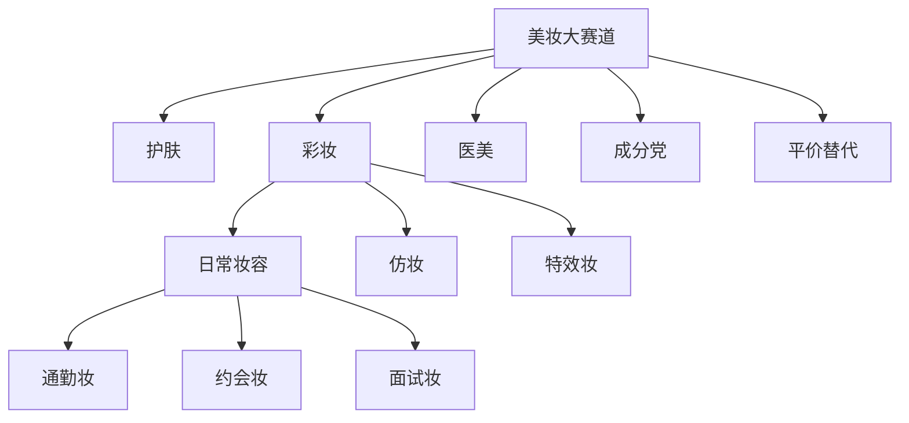
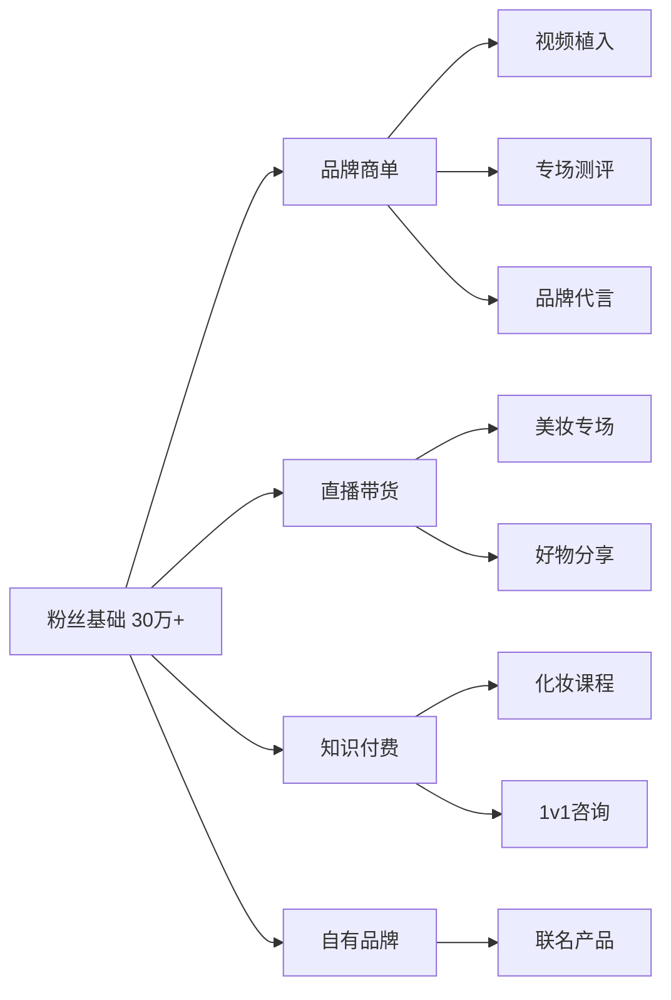
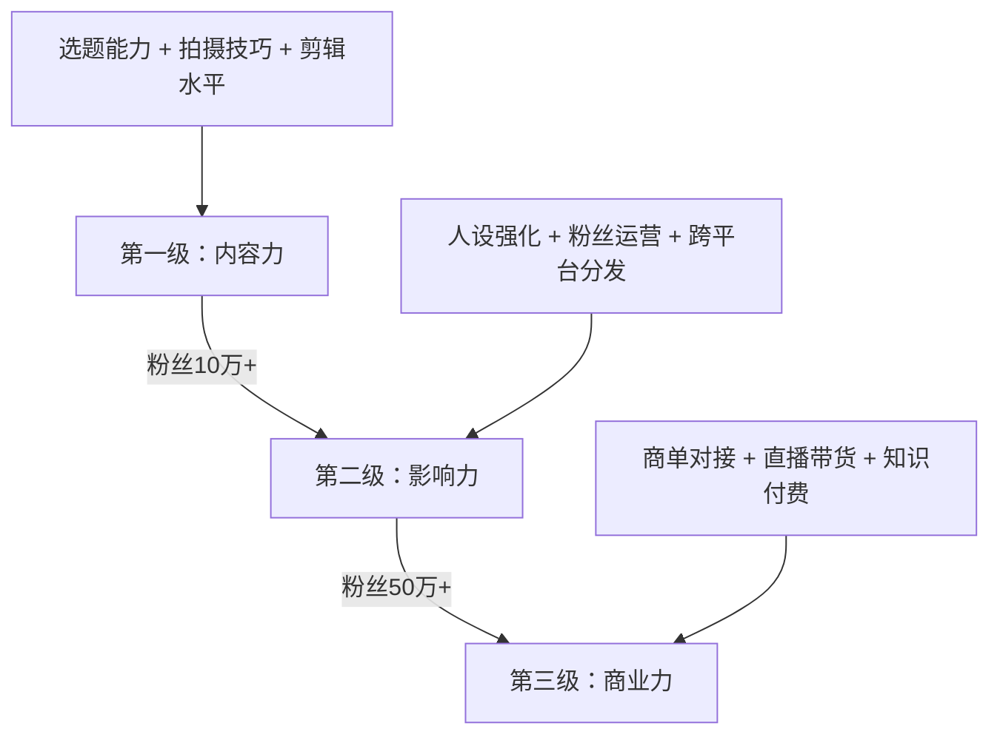

## 案例四：MCN孵化的美妆达人——从素人到百万级美妆博主的系统化成长路径

### 一、案例背景

#### 1.1 主角画像

林小婉（化名），25岁，二线城市普通公司行政职员，月薪5000元。大学期间主修汉语言文学，没有美术、摄影或传媒背景。唯一的"优势"是从小对化妆品有浓厚兴趣，大学期间自学了基础化妆技巧，在朋友圈中小有名气。

2023年初，林小婉在抖音发布了一条"办公室5分钟通勤妆"的短视频，意外获得12万播放量。这条视频没有任何专业设备——用手机支架拍摄，自然光打光，剪映简单剪辑。但评论区的互动非常活跃，大量用户追问产品链接和具体步骤。

#### 1.2 MCN介入时机

一家中型MCN机构（旗下签约200+达人，美妆赛道占比30%）的星探通过数据监控系统发现了这条视频。MCN评估维度如下：

| 评估维度 | 具体指标 | 林小婉的表现 |
|----------|----------|-------------|
| 内容感知力 | 选题是否切中用户痛点 | 通勤妆=高频刚需场景 |
| 表达能力 | 镜头前是否自然、有感染力 | 素颜出镜，真实感强 |
| 互动质量 | 评论区是否有深度互动 | 回复率高，用户粘性强 |
| 成长空间 | 当前内容是否有明显短板可弥补 | 画面粗糙但内容扎实 |
| 商业潜力 | 粉丝画像是否匹配美妆消费人群 | 18-30岁女性占比85% |

MCN给出的签约条件：底薪3000元/月 + 流量扶持 + 商业分成（机构抽成40%）。林小婉经过一周考虑后签约，正式进入MCN孵化体系。

#### 1.3 为什么选择MCN路径而非独立运营

很多创作者对MCN有抵触情绪，认为"被抽成不划算"。但林小婉的情况代表了大量素人的典型困境：

- **没有设备**：手机拍摄，无专业灯光、收音设备
- **没有技能**：不会写脚本、不懂运镜、不会调色
- **没有资源**：不认识品牌方，不知道如何接商单
- **没有时间**：白天上班，只有晚上和周末能创作
- **没有资金**：无力承担前期投入的设备和试错成本

MCN的价值在于用系统化的资源和方法论，缩短从素人到达人的成长周期。独立创作者平均需要18-24个月才能实现稳定变现，而有MCN扶持的达人通常在6-12个月内就能达到同等水平。

---

### 二、MCN孵化全流程拆解

#### 2.1 第一阶段：定位与人设打造（第1-2个月）

##### 2.1.1 赛道细分定位

MCN没有让林小婉做"泛美妆博主"，而是通过数据工具（蝉妈妈、新抖）分析了美妆赛道的竞争格局：

最终定位：**"平价通勤妆教主"**——主打100元以内完成整套妆容的教程内容。这个定位的优势：

1. **受众精准**：18-28岁职场新人，消费能力有限但变美需求强烈
2. **差异化明显**：当时抖音美妆赛道"贵妇护肤""大牌仿妆"内容泛滥，平价通勤妆是蓝海
3. **商业友好**：完美匹配国货美妆品牌的推广需求，商单转化率高
4. **内容可持续**：不同季节、不同场景、不同肤质可以无限延展

##### 2.1.2 人设标签体系

MCN为林小婉设计了三层人设标签：

| 层级 | 标签 | 具体表现 |
|------|------|---------|
| 核心标签 | 平价美妆 | 所有推荐产品单价不超过100元 |
| 性格标签 | 真实、接地气 | 素颜出镜、展示真实皮肤问题 |
| 记忆标签 | "小婉的100元挑战" | 每期视频结尾展示总花费 |

人设的关键原则：**真实大于完美**。MCN刻意避免让林小婉走"精致人设"路线，因为她的真实感是最大的竞争力。用户看惯了滤镜磨皮的美妆博主，一个敢于展示真实毛孔和痘印的博主反而更有亲和力。

##### 2.1.3 视觉体系搭建

MCN安排专人协助建立统一的视觉风格：

- **封面模板**：固定左侧放素颜/右侧放完妆对比图，中间大字标注主题
- **色调统一**：暖色调为主，传递"亲和、日常"的感觉
- **字幕样式**：使用统一的字体和配色方案
- **开场固定**：每期以"姐妹们好，小婉又来挑战100元搞定一个妆容"开场

#### 2.2 第二阶段：内容生产体系化（第2-4个月）

##### 2.2.1 内容矩阵设计

MCN为林小婉规划了四类内容，按比例分配：

| 内容类型 | 占比 | 目的 | 更新频率 |
|----------|------|------|---------|
| 教程类 | 40% | 涨粉+建立专业度 | 每周3条 |
| 测评类 | 25% | 商业化铺垫 | 每周1-2条 |
| 生活类 | 20% | 增强人设+粉丝粘性 | 每周1条 |
| 热点类 | 15% | 蹭流量+破圈 | 跟热点 |

##### 2.2.2 选题机制

每周一上午，MCN的内容团队会与林小婉开选题会。选题来源有四个渠道：

1. **数据驱动**：通过巨量算数查看美妆热搜词，筛选与定位匹配的选题
2. **竞品监控**：跟踪10个同赛道头部账号的爆款内容，分析可借鉴的选题角度
3. **粉丝反馈**：从评论区和私信中提取高频问题，转化为选题
4. **品牌需求**：商单需求反向驱动内容选题（提前1-2周铺垫相关话题）

选题评估标准：
- 搜索量是否足够大（巨量算数月搜索量>10万）
- 竞争程度是否适中（同选题视频<500条为佳）
- 是否与人设匹配（偏离定位的选题即使流量大也不做）
- 是否有商业化空间（能否自然植入产品推荐）

##### 2.2.3 拍摄流程标准化

MCN提供了标准化的拍摄SOP，林小婉在自己出租屋内即可完成：

**设备清单（MCN提供）：**

| 设备 | 型号 | 用途 | 价格 |
|------|------|------|------|
| 补光灯 | 南冠RGB补光灯 | 面部打光 | 约300元 |
| 手机支架 | 可调节桌面支架 | 固定机位 | 约50元 |
| 收音麦克风 | 领夹式无线麦 | 清晰收音 | 约150元 |
| 背景布 | 纯色植绒背景布 | 简洁背景 | 约30元 |

**拍摄流程（单条视频约2小时）：**

1. **准备阶段（30分钟）**：整理桌面、架设设备、调整灯光角度、测试收音
2. **录制阶段（45分钟）**：按脚本分段录制，每段重复2-3次取最佳
3. **素材检查（15分钟）**：回看素材，确认画面清晰、收音正常、无穿帮
4. **补拍阶段（30分钟）**：对不满意的部分进行补拍

##### 2.2.4 剪辑规范

MCN的剪辑师负责后期制作，但林小婉需要在剪映中完成初剪。MCN制定的剪辑规范：

- **前3秒**：必须有"钩子"——抛出问题或展示效果对比
- **节奏控制**：每5秒切换一次画面或添加文字/特效
- **字幕规范**：关键步骤用黄色高亮标注产品名称和价格
- **BGM选择**：轻快节奏的纯音乐，音量控制在人声的20%-30%
- **片尾固定**：展示总花费 + 引导关注话术 + 下期预告

#### 2.3 第三阶段：流量突破（第3-6个月）

##### 2.3.1 MCN的流量扶持机制

MCN对签约达人的流量扶持并非"直接买量"，而是通过以下方式：

1. **DOU+精准投放**：MCN投入DOU+预算（初期每月3000-5000元/达人），对数据表现好的视频进行二次加热
2. **达人互推**：安排旗下其他美妆达人在评论区互动、合拍，实现粉丝交叉
3. **话题运营**：创建品牌话题（如#小婉的100元挑战），引导UGC参与
4. **平台资源对接**：MCN与抖音运营团队有合作关系，优质内容可获得额外流量池推荐

##### 2.3.2 关键数据节点

| 时间节点 | 粉丝量 | 单条视频平均播放 | 突破事件 |
|----------|--------|-----------------|---------|
| 第1个月 | 8,000 | 5,000 | MCN优化封面和标题后数据翻倍 |
| 第2个月 | 25,000 | 15,000 | 一条"面试妆"视频爆发，单条播放120万 |
| 第3个月 | 68,000 | 30,000 | 开始接到第一批品牌询价 |
| 第4个月 | 120,000 | 50,000 | "100元挑战"系列成为固定IP |
| 第6个月 | 310,000 | 80,000 | 单月涨粉80万，进入美妆赛道Top200 |

##### 2.3.3 爆款内容方法论

林小婉在MCN指导下总结出爆款公式：

**爆款标题模板：**
- 数字法："100元搞定面试全妆，HR都夸好看"
- 对比法："专柜500元 vs 平价50元，你分得清吗？"
- 痛点法："油皮夏天脱妆？这个方法亲测有效"
- 好奇法："化妆师朋友偷偷告诉我的底妆秘诀"

**前3秒钩子设计：**
- 直接展示最终效果（"先看效果"）
- 提出一个争议性问题（"粉底液真的需要几百块吗？"）
- 制造反差（素颜→完妆快速切换）

#### 2.4 第四阶段：商业化变现（第4-12个月）

##### 2.4.1 变现路径全景

##### 2.4.2 商业合作全流程

MCN的商务团队负责对接品牌，林小婉只需配合内容创作。商单流程如下：

1. **品牌筛选**（MCN商务团队）
   - 产品是否与人设匹配（只接平价产品，拒绝高端品牌）
   - 品牌口碑是否过关（查黑猫投诉、小红书评价）
   - 佣金/坑位费是否合理

2. **brief对接**（MCN+品牌方）
   - 品牌提供产品信息和核心卖点
   - MCN与品牌确认内容形式和发布时间
   - 预留创意空间，避免"硬广感"

3. **内容创作**（林小婉）
   - 真实使用产品至少3天后再拍摄
   - 自然融入教程内容，不单独做"广告视频"
   - 保留"说真话"权利——如实反馈产品不足

4. **审核发布**（MCN审核→品牌确认→发布）
   - MCN初审内容质量和广告自然度
   - 品牌方确认无违规表述
   - 选择最佳发布时间（工作日晚7-9点）

5. **数据复盘**（发布后7天）
   - 收集播放量、互动率、转化数据
   - 反馈给品牌方，建立长期合作基础

##### 2.4.3 收入结构演变

| 阶段 | 时间 | 月收入构成 | 月总收入 |
|------|------|-----------|---------|
| 孵化期 | 1-3月 | 底薪3000 | 3,000元 |
| 成长期 | 4-6月 | 底薪3000 + 商单2000-5000 | 5,000-8,000元 |
| 爆发期 | 7-9月 | 底薪3000 + 商单8000-15000 + 直播3000-5000 | 14,000-23,000元 |
| 成熟期 | 10-12月 | 底薪3000 + 商单15000-30000 + 直播8000-15000 + 课程2000-5000 | 28,000-53,000元 |

MCN抽成40%后，林小婉实际到手：

| 阶段 | MCN抽成前 | 林小婉到手 | 对比原工资 |
|------|----------|-----------|-----------|
| 孵化期 | 3,000元 | 3,000元（底薪不抽成） | -2,000元 |
| 成长期 | 8,000元 | 6,200元 | +1,200元 |
| 爆发期 | 23,000元 | 15,000元 | +10,000元 |
| 成熟期 | 53,000元 | 33,000元 | +28,000元 |

##### 2.4.4 直播带货实战

林小婉在第5个月开启直播，MCN提供的直播支持：

- **直播策划**：每周1-2场，每场2-3小时，主题提前3天确定
- **选品团队**：MCN有专人对接供应链，筛选适合的产品组合
- **直播间搭建**：MCN提供环形灯、背景板、提词器
- **场控配合**：MCN安排场控人员在直播间引导节奏

直播数据表现：

| 场次 | 在线峰值 | GMV | 佣金收入 |
|------|---------|-----|---------|
| 第1场 | 120人 | 3,200元 | 480元 |
| 第10场 | 800人 | 28,000元 | 4,200元 |
| 第30场 | 3,500人 | 120,000元 | 18,000元 |
| 第50场 | 8,000人 | 350,000元 | 52,500元 |

---

### 三、MCN孵化的核心方法论

#### 3.1 MCN选人的底层逻辑

MCN选人不是看"颜值高不高"，而是看以下核心指标：

1. **内容感知力**：能否感知什么样的内容用户爱看（占比30%）
2. **表达能力**：镜头前是否自然、有感染力（占比25%）
3. **学习能力**：能否快速吸收反馈并改进（占比20%）
4. **执行力**：能否按时按质完成内容产出（占比15%）
5. **商业配合度**：是否愿意配合商业化内容（占比10%）

很多高颜值但表达木讷的人被MCN淘汰，而长相普通但表达力强的人反而更容易被孵化成功。

#### 3.2 MCN孵化的"三级火箭"模型

每一级的核心任务不同，过早进入下一级会导致根基不稳。

#### 3.3 MCN与达人的利益博弈

MCN与达人之间存在天然的利益张力，了解这一点对双方都很重要：

| 维度 | MCN视角 | 达人视角 | 平衡点 |
|------|---------|---------|--------|
| 内容方向 | 追求流量和商业化 | 追求创作自由 | 80%定位内+20%自由探索 |
| 商业频率 | 商单越多收入越高 | 过多广告伤粉 | 每周不超过2条商单 |
| 合约期限 | 越长约越稳定 | 越短越灵活 | 通常1-2年，含对赌条款 |
| 账号归属 | 机构资产 | 个人品牌 | 合约到期后账号归属需明确 |
| 收入分成 | 机构抽成40-60% | 希望抽成越低越好 | 根据扶持力度协商 |

---

### 四、成功的关键因素与踩坑经验

#### 4.1 林小婉成功的五个核心因素

**因素一：选对了细分赛道**

"平价通勤妆"在2023年初还是蓝海市场。如果选择"大牌测评""仿妆"等红海赛道，即使MCN全力扶持也很难突围。赛道选择的黄金公式：

> 赛道价值 = 市场规模 × 增长速度 ÷ 竞争密度

**因素二：保持了真实感**

林小婉从不隐瞒产品缺点，有一次在商单视频中直接说"这款粉底液遮瑕力一般，适合皮肤底子好的姐妹"，品牌方虽然不满，但这条视频的互动率是她所有商单视频中最高的。真实感是美妆赛道最稀缺的品质。

**因素三：建立了可复制的内容体系**

"100元挑战"系列不是一次性爆款，而是一个可以无限延展的内容框架：
- 100元搞定面试妆
- 100元搞定约会妆
- 100元搞定年会妆
- 100元搞定伴娘妆
- ……

这种"系列化IP"降低了选题难度，同时强化了用户心智。

**因素四：执行力极强**

签约MCN后，林小婉从未断更。即使加班到晚上9点，也会在10点前完成一条短视频的拍摄。MCN统计的数据表明，断更超过3天的达人，粉丝流失率高达15%。

**因素五：善用MCN资源但不依赖MCN**

林小婉主动学习拍摄和剪辑技巧，而不是完全依赖MCN的后期团队。这使得她在合约期满后具备了独立运营的能力。

#### 4.2 常见踩坑案例

**坑一：盲目追求粉丝量**

林小婉在第3个月时，一条"卸妆挑战"视频爆了200万播放，涨粉15万。但这些新粉丝大部分是来看热闹的男性用户，与美妆消费人群严重不匹配。MCN及时叫停了这类"泛流量"内容，回归垂直赛道。

**坑二：过度商业化**

第7个月时，林小婉一周接了4条商单，粉丝开始在评论区吐槽"全是广告"。当周掉粉2万，互动率下降40%。此后MCN制定了"商单不超过总内容30%"的铁律。

**坑三：忽视私域运营**

前6个月林小婉只关注公域流量，没有引导粉丝进入私域（微信群、粉丝群）。第8个月开始建立粉丝群后，直播间的复购率从15%提升到35%。

**坑四：合约纠纷风险**

林小婉的一个同批签约达人，在合约期内想跳槽到另一家MCN，因违约金条款（剩余合约期收入的200%）产生纠纷。教训：签约前一定要请律师审阅合同，重点关注竞业限制、违约金、账号归属等条款。

#### 4.3 退出机制与独立运营

林小婉在合约到期（2年）后选择不续约，原因：

1. 已经积累了成熟的创作能力和商业资源
2. 独立运营可以拿到100%的收入
3. 拥有完全的内容自主权

独立运营后的调整：
- 组建了自己的小团队（1名剪辑+1名商务）
- 收入在扣除团队成本后反而比MCN时期更高
- 但需要自己承担所有运营风险

---

### 五、MCN孵化美妆达人的可复用方法论

#### 5.1 素人入局MCN的决策框架

如果你是一个想通过MCN进入美妆赛道的素人，用以下框架评估：

| 评估项 | 适合签约MCN | 适合独立运营 |
|--------|------------|-------------|
| 创作能力 | 零基础或初级 | 已有成熟技能 |
| 资金储备 | 无法承担设备和试错成本 | 有3-6个月的投入资金 |
| 时间精力 | 副业起步，时间有限 | 全职投入 |
| 资源积累 | 无品牌方、无供应链 | 已有行业人脉 |
| 学习方式 | 需要系统化指导 | 自学能力强 |
| 风险偏好 | 希望有人兜底 | 愿意承担风险 |

#### 5.2 签约MCN前的必查清单

1. **机构背景**：查询企查查/天眼查，确认注册资本、经营状况、诉讼记录
2. **旗下达人**：查看机构其他达人的成长曲线和活跃度
3. **合同条款**：重点关注分成比例、合约期限、违约金、账号归属、竞业限制
4. **扶持力度**：确认DOU+预算、设备支持、团队配置等具体承诺
5. **退出机制**：合约到期后的账号归属和粉丝迁移方案

#### 5.3 美妆赛道的长期趋势

1. **成分党崛起**：用户越来越理性，"成分分析"类内容持续增长
2. **AI试妆**：AR试妆技术将改变"先试后买"的消费决策链路
3. **男性美妆**：男性护肤市场年增速超过30%，是新兴蓝海
4. **跨境美妆**：东南亚美妆市场快速增长，出海内容有红利
5. **私域深化**：从"公域获客→私域转化"到"私域反哺公域"的双向循环

---

### 六、成果数据总览

| 指标 | 签约前 | 6个月 | 12个月 | 24个月（独立后） |
|------|--------|-------|--------|-----------------|
| 粉丝量 | 8,000 | 310,000 | 620,000 | 1,200,000 |
| 月收入 | 5,000元（工资） | 15,000元 | 33,000元 | 60,000-80,000元 |
| 单条视频平均播放 | 5,000 | 80,000 | 150,000 | 200,000 |
| 商单月均数量 | 0 | 4条 | 8条 | 10-12条 |
| 直播月均GMV | 0 | 120,000元 | 500,000元 | 800,000元 |
| 粉丝群规模 | 0 | 3个群/1500人 | 8个群/4000人 | 15个群/8000人 |

---

### 七、经验总结

1. **MCN是加速器，不是发动机**——核心创作能力必须自己掌握，MCN提供的是资源和方法论的加速
2. **赛道选择大于努力**——在红海赛道拼命不如在蓝海赛道轻松领先
3. **真实感是美妆赛道的终极壁垒**——用户不缺"完美博主"，缺的是"真实的同行者"
4. **内容体系化比单条爆款更重要**——一个可以持续产出的系列IP，价值远超偶然的爆款
5. **商业化要有节奏**——过早商业化透支信任，过晚商业化浪费窗口期
6. **私域是长期资产**——公域粉丝是"租来的"，私域用户才是"自己的"
7. **合约条款决定退出成本**——签约前请律师审合同，比任何运营技巧都重要
8. **独立运营是终极目标**——MCN是跳板不是终点，具备独立能力后应该果断独立

