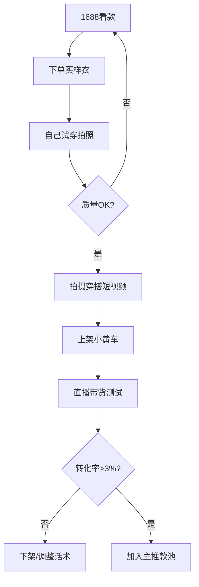
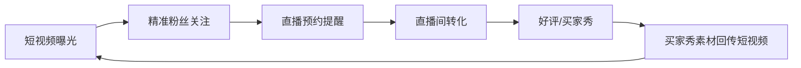
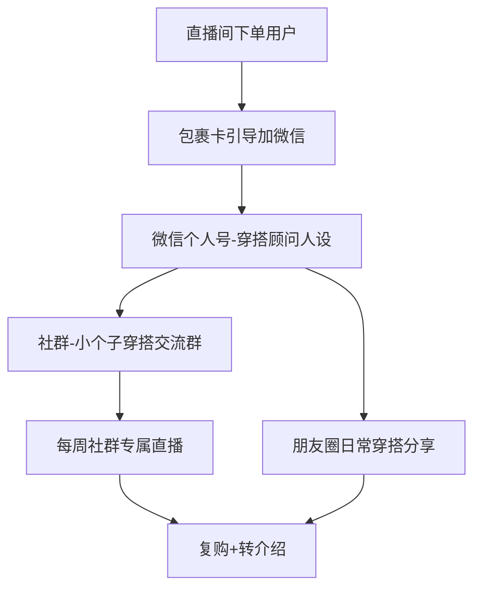
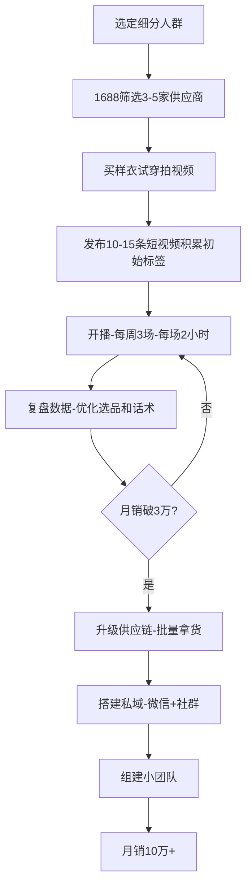

## 案例五：素人逆袭的服装直播间

> 服装是直播电商中竞争最激烈的赛道之一，但也是素人最容易切入的品类——因为每个人都有穿衣服的需求，而"真实感"恰恰是大主播无法复制的优势。本案例记录了一位普通上班族如何用3个月时间，从零搭建服装直播间并实现月销15万、月净利润2.5万的完整历程。

### 一、案例背景：为什么选择服装赛道

#### 1.1 人物画像

林小雨（化名），27岁，二线城市服装公司行政岗，月薪5500元。平时喜欢穿搭，朋友圈经常被同事问"衣服在哪买的"。没有电商经验，没有供应链资源，没有粉丝基础——典型的"三无"素人。

#### 1.2 选赛道的逻辑

林小雨在决定做直播前做了两周的调研，最终选择服装赛道基于以下判断：

| 维度 | 分析结论 |
|------|----------|
| 市场规模 | 2025年直播电商服装品类GMV超8000亿元，占比约35%，是最大的单一品类 |
| 素人机会 | 服装不像美妆需要专业背书，穿搭本身就是"普通人也能做"的事 |
| 供应链门槛 | 1688/杭州四季青/广州十三行等成熟供应链支持一件代发，零库存启动 |
| 内容壁垒 | 穿搭展示天然适合短视频+直播双场景，内容产出效率高 |
| 复购属性 | 女装复购周期约30-45天，天然适合私域运营 |

**关键认知：** 林小雨没有选择"女装大通款"（T恤、牛仔裤等标品），而是锁定了"小个子通勤穿搭"这个细分人群。她的判断逻辑是：

- 小红书"小个子穿搭"话题阅读量超50亿，需求旺盛
- 身高155-160cm的女性买衣服痛点明确（显高、比例、尺码）
- 大主播不会专门为小个子选品，存在服务空白
- 她自己身高157cm，天然具备"同身材参考"的信任感

这个选品逻辑对应了前文「选品策略」中"需求大+展示强+复购高"的核心标准。

### 二、冷启动阶段（第1-4周）

#### 2.1 零成本搭建供应链

林小雨没有囤货，采用"1688一件代发+自主拍摄"的轻资产模式：

**第一步：筛选供应商**

在1688上按以下标准筛选了30家供应商，最终确定5家核心合作：

- 实力商家认证（牛头标志）
- 7天无理由退换
- 支持一件代发
- 有实拍图（非盗图）
- 店铺评分4.8以上

**第二步：建立选品流程**



**第三步：成本结构确认**

| 项目 | 金额 | 说明 |
|------|------|------|
| 样衣采购 | 500元/月 | 每月约20件样衣，部分可退 |
| 直播设备 | 800元（一次性） | 环形灯+手机支架+领夹麦 |
| 场景布置 | 300元（一次性） | 落地镜+背景布+简易衣架 |
| 快递费 | 0元 | 代发供应商承担 |
| **首月总投入** | **约1600元** | |

这个投入门槛远低于传统电商开店（通常需要1-5万启动资金），验证了"零库存启动"的可行性。

#### 2.2 短视频内容矩阵搭建

林小雨没有直接开播，而是先用两周时间在抖音发布了15条短视频，建立初始标签和粉丝基础。

**内容类型规划（三种视频交替发布）：**

| 类型 | 占比 | 内容形式 | 目的 |
|------|------|----------|------|
| 穿搭对比 | 40% | 同一件衣服不同搭配/小个子vs普通穿搭 | 产生视觉冲击，完播率高 |
| 穿搭教程 | 35% | "157cm如何穿出165的感觉"等教学 | 建立专业人设，收藏率高 |
| 好物分享 | 25% | 拆箱/测评/实穿效果 | 种草，为直播间引流 |

**拍摄执行要点：**

- **设备**：iPhone原相机，不加滤镜（真实感是核心竞争力）
- **场景**：家中全身镜前，自然光+环形补光灯
- **时长**：控制在15-30秒（完播率优先）
- **BGM**：使用平台热门音乐（增加推荐概率）
- **文案**：标题用"小个子""显高""通勤"等关键词（SEO思维）

**两周数据表现：**

| 指标 | 数据 |
|------|------|
| 发布视频数 | 15条 |
| 总播放量 | 8.7万 |
| 最高单条播放 | 2.3万 |
| 新增粉丝 | 420人 |
| 粉丝画像 | 女性占比92%，25-35岁占比68% |

虽然数据不算爆，但粉丝画像精准——这比泛粉更有价值。

#### 2.3 首场直播的完整复盘

**开播前准备：**

- 选品15款（3款引流款+8款利润款+2款福利款+2款形象款）
- 每款样衣提前试穿并写好话术要点
- 场景：白色背景布+落地镜+衣架展示区
- 设备：iPhone 14+环形灯+领夹麦

**首场直播数据（播了2小时）：**

| 指标 | 数据 | 行业参考值 |
|------|------|------------|
| 观看人数 | 87人 | 新号正常范围 |
| 最高在线 | 12人 | — |
| 平均停留 | 1分23秒 | 及格线1分钟 |
| 互动率 | 8.2% | 优秀（>5%） |
| 成交单数 | 3单 | 新号首播正常 |
| 成交金额 | 267元 | — |
| 转化率 | 3.4% | 优秀（>2%） |

**首播关键复盘：**

1. **互动率高于预期**——因为林小雨身高157cm，试穿效果天然引发同身材观众共鸣，弹幕频繁出现"我也是小个子""这身在哪买"
2. **停留时间合格**——得益于每款衣服都有"先穿错再穿对"的对比展示，观众有看完的动力
3. **转化率达标**——话术中反复强调"这件我自己穿了两周，洗了3次不变形"，真实体验增强了信任
4. **主要问题**——流量太低，平台给的初始流量池很小，需要短视频持续引流

### 三、成长阶段（第5-12周）

#### 3.1 流量突破：短视频+直播双轮驱动

林小雨总结出一条核心策略：**短视频负责拉新，直播负责转化，两者形成飞轮。**



**短视频策略迭代：**

第5周开始，林小雨发现"对比类"视频数据最好，于是调整内容比例：

- 穿搭对比提升到50%（核心流量来源）
- "买家秀翻车"系列成为爆款模板——拍买家秀vs卖家秀的对比，既真实又有话题性
- 每条视频结尾加一句"今晚8点直播间上链接"，将短视频流量导入直播间

**关键转折点（第6周）：** 一条"157cm vs 170cm同款穿搭对比"视频爆了，播放量达到52万，单条涨粉3800人。这条视频的爆点在于：

- 视觉对比强烈，完播率高达45%
- 引发大量讨论（"小个子穿这个好看吗"的争论带来高互动）
- 评论区自然产生"求链接"的需求

#### 3.2 直播间运营精细化

**直播节奏标准化：**

林小雨逐步摸索出一套成熟的直播节奏，每场播3-4小时：

| 时间段 | 内容 | 目的 |
|--------|------|------|
| 前15分钟 | 福利款秒杀+互动破冰 | 拉高在线人数和互动率 |
| 15-60分钟 | 利润款轮流讲解（每款8-10分钟） | 核心转化阶段 |
| 60-90分钟 | 穿搭组合展示（上下装+配饰搭配） | 提高客单价和连带率 |
| 90-120分钟 | 二次返场爆款+限量福利 | 二次转化+留住观众 |
| 120分钟+ | 循环讲解高转化款 | 利用持续推流窗口 |

**话术升级——小个子穿搭的专属话术框架：**

```text
开场：
"家人们，157cm的林小雨又来啦！今天准备了8套显高穿搭，
 专治各种'穿什么都显矮'的困扰。先扣个'小个子'让我看看
 有多少姐妹是来抄作业的？"

产品讲解：
"我现在身上这件短款针织衫，注意看——衣长刚好到腰线，
 配上高腰直筒裤，是不是腰线一下就上去了？
 这就是小个子穿搭的核心法则：提高腰线，拉长腿部比例。
 原价129，今天直播间只要79，而且前20单再减10元。"

逼单：
"这款库存只剩最后30件了，刚才已经拍了15件，
 157cm穿S码刚好，160以上建议M码。
 犹豫的姐妹先拍，不喜欢7天无理由退，
 但错过这个价格真的要等下个月了——我跟供应商谈了很久
 才拿到这个价。"
```

**选品四象限在服装直播间的具体应用：**

| 款式类型 | 占比 | 价格带 | 选品标准 | 实际案例 |
|----------|------|--------|----------|----------|
| 引流款 | 20% | 39-59元 | 高性价比基础款，不追求利润 | 纯棉白T、打底衫 |
| 利润款 | 50% | 79-159元 | 设计感+品质感，利润空间40%+ | 小香风外套、高腰阔腿裤 |
| 形象款 | 10% | 199-299元 | 提升直播间调性，少量测试 | 轻奢通勤套装、羊毛大衣 |
| 福利款 | 20% | 9.9-29元 | 秒杀品，拉互动和停留 | 袜子、发饰、收纳袋 |

#### 3.3 数据驱动的持续优化

林小雨每周日晚上做一次数据复盘，重点盯以下指标：

**直播间核心指标看板：**

| 指标 | 第5周 | 第8周 | 第12周 | 优化方向 |
|------|-------|-------|--------|----------|
| 场均观看 | 320人 | 890人 | 2100人 | 短视频引流+开播时段优化 |
| 平均停留 | 1分45秒 | 2分30秒 | 3分12秒 | 话术节奏+福利款穿插 |
| 互动率 | 6.8% | 9.2% | 11.5% | 引导话术+评论区运营 |
| 转化率 | 2.8% | 3.6% | 4.2% | 选品优化+逼单话术迭代 |
| 客单价 | 89元 | 108元 | 127元 | 连带销售+组合优惠 |
| UV价值 | 2.5元 | 3.9元 | 5.3元 | 综合提升 |

**关键优化动作：**

1. **时段测试**：测试了下午2点、晚上8点、晚上10点三个时段，发现晚上8-11点是目标人群（25-35岁通勤女性）最活跃时段
2. **停留优化**：在每款讲解中间插入"穿搭小知识"（如"梨形身材怎么选裤子"），平均停留时间提升了35%
3. **转化优化**：增加"试穿→脱下→再穿"的动作流程，让观众看到衣服的穿脱便利性，转化率提升0.6个百分点
4. **连带率优化**：推出"一套带走"组合价（上衣+裤子+腰带套装优惠30元），客单价从89元提升到127元

### 四、成熟阶段（第13周至今）

#### 4.1 私域运营体系搭建

林小雨在第10周开始系统性搭建私域，将公域流量沉淀为可反复触达的用户资产。

**私域引流路径：**



**包裹卡设计要点：**

- 正面：手写感谢卡+"扫码领取穿搭手册"
- 背面：微信二维码+社群二维码
- 钩子：入群送"小个子四季穿搭色卡"（PDF电子版，零成本）

**私域转化数据：**

| 指标 | 数据 |
|------|------|
| 微信好友数 | 3200人 |
| 社群数 | 4个（按风格分群） |
| 社群总人数 | 1800人 |
| 私域月复购率 | 38% |
| 私域客单价 | 156元（高于直播间127元） |
| 转介绍率 | 15%（老客带新客） |

私域的核心价值在于：直播间是"一次性曝光"，私域是"长期关系"。林小雨的朋友圈每天发3条内容（早上穿搭灵感、中午产品种草、晚上买家秀展示），保持触达频率的同时不显得过度营销。

#### 4.2 供应链升级

随着销量增长，林小雨逐步升级供应链：

| 阶段 | 模式 | 月销量 | 利润率 |
|------|------|--------|--------|
| 冷启动 | 纯1688代发 | 200-500单 | 25-30% |
| 成长期 | 代发+部分拿货 | 500-1500单 | 30-35% |
| 成熟期 | 批量拿货+自主质检 | 1500-3000单 | 35-42% |

**拿货模式的优势：**

- 成本降低15-20%（批量拿货价格更低）
- 品控更可靠（到货先验再发）
- 发货更快（自己的仓库发，不用等供应商排单）
- 可以做专属包装（提升品牌感）

**仓库管理：** 租了城中村一间20平米的房间做仓库，月租800元。衣服按款式挂好，每件贴上编号标签，用Excel管理库存。虽然简陋，但效率远高于纯代发。

#### 4.3 团队化运营

月销突破10万后，林小雨开始组建小团队：

| 角色 | 人数 | 月薪 | 职责 |
|------|------|------|------|
| 林小雨（主播+老板） | 1 | — | 选品、直播、内容方向把控 |
| 助播（兼职） | 1 | 3000元/月 | 直播间互动、上下架操作、客服 |
| 短视频剪辑（兼职） | 1 | 2000元/月 | 视频剪辑、封面制作 |

团队月支出约5000元，但释放了林小雨的时间，让她能专注于选品和直播这两件最核心的事。

### 五、关键成果数据总览

**从零到第6个月的完整数据演进：**

| 指标 | 第1月 | 第2月 | 第3月 | 第4月 | 第5月 | 第6月 |
|------|-------|-------|-------|-------|-------|-------|
| 粉丝数 | 420 | 2800 | 8500 | 1.8万 | 3.2万 | 5.1万 |
| 直播场次 | 8场 | 16场 | 22场 | 24场 | 26场 | 26场 |
| 月GMV | 2,100元 | 1.8万 | 5.2万 | 9.8万 | 13.5万 | 15.2万 |
| 月净利润 | -1,200元 | 2,800元 | 8,500元 | 1.6万 | 2.1万 | 2.5万 |
| 客单价 | 89元 | 98元 | 108元 | 118元 | 123元 | 127元 |
| 退货率 | 18% | 22% | 20% | 16% | 14% | 12% |

**几个关键数据解读：**

1. **第1个月亏损是正常的**——样衣采购+设备投入属于一次性成本，不代表模式不成立
2. **退货率从22%降到12%**——核心原因是"真实试穿"建立了准确的预期，买家收到货后落差小
3. **净利润率约16-17%**——在服装直播电商中属于中等偏上水平（行业平均10-15%）
4. **第3个月是拐点**——粉丝突破8000后，平台推荐流量明显增加，直播间的自然流量占比从30%提升到55%

### 六、踩过的坑与避坑指南

#### 6.1 供应链踩坑

**坑1：盲目追求低价供应商**

> 第2个月换了更便宜的供应商，结果一批针织衫起球严重，3天内收到27个差评，退货率飙升到35%。紧急下架该批次，逐一联系买家道歉+补偿，花了两周才把店铺评分拉回来。

**教训：** 服装品质是底线。宁可利润少5%，也不要省面料钱。选供应商时一定要先买样衣自己穿洗3次以上再决定合作。

**坑2：库存管理混乱**

> 第4个月开始批量拿货，但没有做好库存记录，导致爆款断码（S码卖完了还在卖），积压了30多件滞销款。

**教训：** 即使用Excel管理，也要做到"每件入库登记、每笔出库扣减、每周盘点一次"。后来林小雨用了"秦丝进销存"免费版，效率大幅提升。

#### 6.2 运营踩坑

**坑3：开播时间不稳定**

> 第3周因为加班，连续3天没开播，粉丝流失明显，之后花了一周才恢复到之前的在线水平。

**教训：** 直播的核心是"信任"，而信任需要"确定性"。固定时间开播比随机开播重要10倍。后来林小雨定死"每周二四六晚8点"，雷打不动。

**坑4：盲目追爆款**

> 看到"新中式"火了就跟风卖，结果跟自己的"小个子通勤"人设不搭，粉丝不买账，那批货压了两个月才清完。

**教训：** 垂直人设是最大的资产。宁可少赚也不要偏离定位。偶尔测试新品类可以，但比例不能超过10%。

#### 6.3 心态踩坑

**坑5：和大主播比数据**

> 第2个月看到同期起步的另一个号粉丝涨到5万了（后来发现是投了5万粉的DOU+），心态崩了一周，差点放弃。

**教训：** 素人做直播最大的敌人不是竞争对手，而是自己的焦虑。关注自己的数据趋势，不要和别人比绝对值。林小雨后来在墙上贴了一张表格，记录每周的环比增长，用"进步感"替代"焦虑感"。

### 七、可复制的方法论总结

#### 7.1 素人做服装直播的最小可行路径



#### 7.2 素人逆袭的五个核心原则

| 原则 | 具体含义 | 林小雨的做法 |
|------|----------|------------|
| 细分定位 | 不做大而全，做小而深 | 只做"小个子通勤穿搭"，一个标签打透 |
| 真实为王 | 素人的优势是真实，不是完美 | 原相机拍摄，不修图，展示真实试穿效果 |
| 数据复盘 | 每周复盘，用数据说话 | 固定每周日晚做数据表，逐项优化 |
| 私域沉淀 | 公域拉新，私域复购 | 包裹卡+社群+朋友圈三位一体 |
| 持续迭代 | 没有一成不变的打法 | 每两周调整一次内容比例和选品策略 |

#### 7.3 适合复制此模式的人群画像

并非所有人都适合做服装直播，以下是适合复制此模式的人群特征：

- **有明确的身材/风格标签**：小个子、微胖、大码、梨形身材、H型身材等，标签越明确，人设越清晰
- **有审美基础**：不需要专业时尚背景，但至少身边人认可你的穿搭
- **能坚持3个月不盈利**：冷启动期需要耐心，多数人死在第1-2个月
- **有每天3-4小时的固定时间**：直播+拍视频+选品，至少需要这个时间投入
- **能接受退货和差评**：服装退货率行业平均15-25%，心态要稳

### 八、本案例的核心启示

林小雨的案例证明了三个重要观点：

**第一，素人做直播的核心竞争力不是"便宜"，而是"真实"和"垂直"。** 大主播靠流量和价格战，素人靠精准人群和信任关系。林小雨的退货率只有12%（行业平均20%），正是因为她的真实试穿让买家对衣服有了准确预期。

**第二，短视频和直播不是二选一，而是必须双轮驱动。** 短视频负责拉新和标签建立，直播负责转化和信任加深。没有短视频的直播间就是"等流量来"，没有直播的短视频号就是"有流量但变不了现"。

**第三，私域是素人直播的终极护城河。** 平台算法随时可能变化，流量分配权不在自己手里。但微信好友和社群是自己的资产，不受平台规则影响。林小雨目前38%的月营收来自私域复购，这部分收入极其稳定。

---

> **思考题：** 如果你的身材没有明显标签（比如标准身材），你会如何找到自己的差异化定位？提示：可以从职业场景、年龄阶段、风格偏好、地域特色等维度切入。
