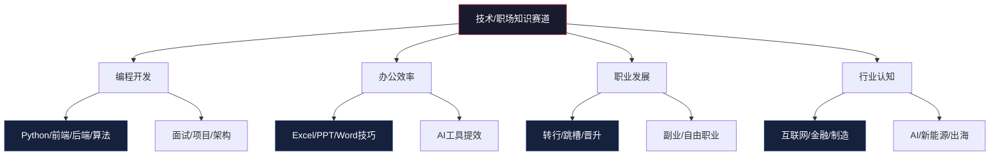
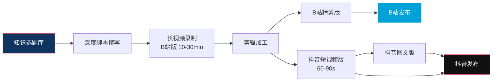
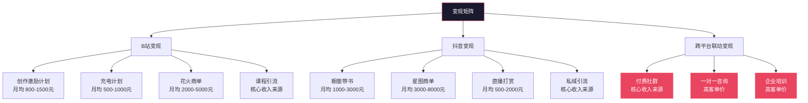
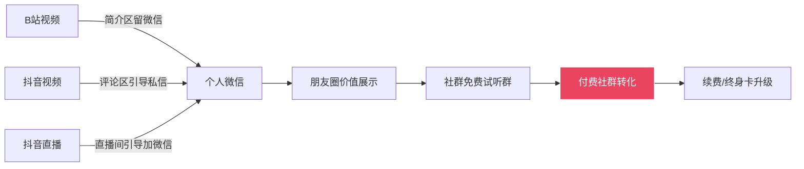

## 案例六：知识博主的B站+抖音双平台变现

> **核心看点**：同一个知识体系如何在B站和抖音两个截然不同的生态中找到各自的最优解，实现"内容一次生产、双平台差异化分发、多渠道变现"的闭环。

### 一、案例背景

#### 1.1 主角画像

**张远（化名）**，28岁，某互联网公司后端工程师，工作四年，技术扎实但薪资增长遇到瓶颈。日常工作之外，他有一个坚持了两年的习惯——把自己踩过的技术坑整理成笔记发在个人博客上，累计写了200多篇，但阅读量始终在个位数到两位数之间徘徊。

2024年初，张远在刷B站时偶然发现，一些技术博主通过录制编程教程视频获得了大量关注，其中不乏粉丝量在50万以上、通过课程和商单实现月入数万的案例。这让他意识到：**自己积累了两年的技术笔记，本质上就是现成的视频脚本素材**。

与此同时，他也注意到抖音上有一批"职场技能"类账号，用60秒的短视频讲一个Excel技巧或一个PPT排版方法，单条视频播放量动辄百万。这与B站上动辄20-40分钟的深度教程形成了鲜明对比。

张远决定同时入驻B站和抖音，用**同一套知识体系**适配两种完全不同的内容形态，探索知识博主的双平台变现路径。

#### 1.2 为什么选择B站+抖音的组合

| 维度 | B站 | 抖音 |
|------|-----|------|
| 核心用户 | 18-30岁，学生和年轻职场人为主 | 25-40岁，消费力中上，覆盖全年龄段 |
| 内容偏好 | 深度、长内容、有信息密度 | 短平快、强钩子、即时满足 |
| 互动文化 | 弹幕文化、技术讨论氛围浓厚 | 评论区求教程、点赞收藏导向 |
| 变现方式 | 创作激励+商单+课程引流 | 橱窗带书+星图商单+直播+私域导流 |
| 流量逻辑 | 搜索+推荐双引擎，长尾效应强 | 推荐算法主导，爆发力强但衰减快 |
| 内容生命周期 | 长尾可达6-12个月持续获流 | 48小时内决定生死 |
| 适合的内容类型 | 教程、深度分析、系列课程 | 技巧速览、行业热点解读、痛点解决方案 |

两个平台并非竞争关系，而是**互补关系**：B站负责深度内容沉淀和忠实粉丝积累，抖音负责流量爆发和泛用户触达。这正是知识类博主最理想的双平台组合。

#### 1.3 赛道分析：技术/职场知识的市场容量



张远最终选择了 **"Python实战 + 职场提效"** 作为主攻方向。原因有三：

1. **供给端**：自身有4年后端开发经验，技术储备充足
2. **需求端**：Python是B站和抖音搜索量最高的编程语言，受众基数大
3. **差异化**：大多数技术博主只讲代码，张远将编程与实际工作场景结合（如"用Python自动处理Excel报表"），降低了学习门槛，拓宽了受众面

---

### 二、账号搭建与定位策略

#### 2.1 双平台账号的差异化定位

很多知识博主犯的第一个错误是**把B站内容原封不动搬到抖音**，结果两个平台都做不起来。张远在正式开始之前，花了一周时间研究两个平台知识类头部账号的内容差异，最终制定了清晰的双平台定位策略：

| 维度 | B站账号"远哥聊Python" | 抖音账号"Python一分钟" |
|------|----------------------|----------------------|
| **人设** | 技术老大哥，讲解细致耐心 | 效率达人，快节奏实用派 |
| **内容长度** | 10-30分钟深度教程 | 30-90秒技巧速览 |
| **封面风格** | 统一蓝色调技术风，标题居中 | 黄底黑字醒目大字，左侧放代码截图 |
| **标题公式** | "从零开始学XX"、"XX项目实战" | "90%的人不知道的XX技巧"、"Python一行代码搞定XX" |
| **更新频率** | 每周2条（周二、周五） | 每天1条（工作日） |
| **核心指标** | 完播率+收藏率+弹幕互动率 | 完播率+点赞率+评论率 |
| **变现重心** | 课程引流+商单 | 橱窗带书+私域导流 |

#### 2.2 个人品牌视觉统一

尽管内容风格不同，张远在视觉层面保持了一致的品牌识别度：

- **统一头像**：两个平台使用同一个头像（戴着耳机的卡通程序员形象）
- **统一色彩**：B站蓝色主调，抖音橙色主调，但都包含同一个标志性的"Y"字母Logo
- **统一签名**：两个平台的个人简介都包含"前大厂后端工程师｜Python实战派"

这种"内容差异化、品牌统一化"的策略让跨平台用户一眼就能认出是同一个人，同时每个平台的内容又贴合了各自的生态调性。

#### 2.3 账号冷启动期的具体操作（第1-30天）

**B站冷启动：**

1. **首批内容储备**：上线前先录制并发布10条视频，覆盖"Python入门"系列的前10个章节，确保用户进到主页时能看到完整的内容体系
2. **SEO优化**：每条视频的标题都包含核心关键词（如"Python教程""Python入门"），简介区放详细的时间戳目录，提升搜索排名
3. **社区互动**：每天花30分钟在B站的Python相关视频评论区回答问题、发表专业观点，不带任何引流目的，纯粹建立技术人设
4. **加入创作社群**：申请加入B站的"知识区创作营"，获得官方的流量扶持和创作指导

**抖音冷启动：**

1. **追热点起步**：前10条内容中，至少3条紧跟当时的热点话题（如"用Python分析XX热搜数据""XX事件的数据可视化"），借助热点流量完成冷启动
2. **DOU+小额测试**：前30天，每天花50元投DOU+，定向投放给"对编程/职场/效率工具感兴趣"的用户，不追求转化，纯粹用来验证内容方向
3. **评论区互动**：每条视频发布后1小时内，主动回复前20条评论，尤其是提问类评论，用"详细解答+引导关注"的方式提升互动率
4. **利用抖音的"图文"功能**：除了视频，每天发1条图文内容（代码截图+文字说明），降低创作成本的同时增加曝光频次

---

### 三、内容生产体系

#### 3.1 "一套素材、两种产品"的内容生产流程

张远的核心创新在于建立了一套高效的内容生产流水线，**同一份知识素材可以同时产出B站长视频和抖音短视频**：



**具体操作步骤：**

1. **选题**（周日晚上，2小时）：从知乎热榜、GitHub Trending、Stack Overflow年度报告中筛选本周最值得讲的技术话题，录入Notion选题库
2. **深度脚本**（周一/周四晚，各2小时）：撰写B站长视频的完整脚本，包括代码演示、原理讲解、实操演示
3. **录制**（周二/周五晚，各2小时）：使用OBS录制屏幕+人像画中画，一次录制完成
4. **剪辑**（周三/周六，各2小时）：用剪映完成精剪，同时从长视频中提取3-5个"高光片段"制作抖音版
5. **发布**：B站周二/周五晚8点发布，抖音每天早7点发布（通勤时间）

**关键数据：一份深度脚本平均产出1条B站视频 + 3-5条抖音视频，内容复用率高达400%。**

#### 3.2 选题方法论：知识博主的选题四象限

张远根据自己的经验总结出知识博主的选题四象限模型：

| | 高搜索量 | 低搜索量 |
|------|---------|---------|
| **高时效性** | 热点技术解读（如"XX框架新版本解析"） | 行业内幕分析（如"XX公司的技术栈揭秘"） |
| **低时效性** | 经典教程（如"Python入门到精通"） | 前沿技术科普（如"量子计算入门"） |

**选题优先级**：高时效性+高搜索量 > 低时效性+高搜索量 > 高时效性+低搜索量 > 低时效性+低搜索量

前两类是张远的核心内容方向——既有稳定搜索流量，又能借热点获得爆发。后两类作为补充，用于建立技术深度和前沿视野的人设。

#### 3.3 B站长视频的内容结构模板

经过100多条视频的测试，张远发现B站技术教程的最优结构如下：

```text
【0:00-0:30】Hook：一个具体的痛点场景（"你是不是也遇到过这种情况..."）
【0:30-2:00】概述：今天要解决什么问题，学完能达到什么效果
【2:00-8:00】核心讲解：原理 + 代码演示（核心价值区间）
【8:00-12:00】实战演示：完整的项目案例
【12:00-14:00】常见坑点：初学者最容易犯的3个错误
【14:00-15:00】总结 + CTA：引导一键三连 + 评论区互动问题
```

**关键发现**：B站用户对"开头直接进正题"的接受度远高于抖音。如果前30秒还在铺垫背景，完播率会断崖式下降。因此张远的Hook不是"大家好，我是XX"，而是直接抛出一个具体的技术痛点。

#### 3.4 抖音短视频的内容结构模板

抖音的逻辑完全不同——用户不会给你30秒的耐心，前3秒决定生死：

```text
【0:00-0:03】强钩子：大字标题 + 反直觉结论（"Python一行代码，顶你手动操作3小时"）
【0:03-0:15】痛点共鸣：快速描述用户遇到的问题
【0:15-0:45】解决方案：代码演示（画面放大，字幕高亮关键代码）
【0:45-0:60】结果展示 + CTA：对比效果 + "关注我，每天一个Python技巧"
```

**关键发现**：抖音上的技术内容，代码不需要完整可运行，用户要的是"知道有这么个方法"的感觉。因此张远会把代码简化到最关键的一行，配上醒目的字幕和箭头标注。

---

### 四、变现路径设计与执行

#### 4.1 双平台变现矩阵

张远的变现策略不是单一渠道，而是**多层次变现矩阵**，每个平台发挥各自的优势：



#### 4.2 详细变现渠道拆解

##### 渠道一：B站创作激励计划

B站的创作激励计划根据视频的播放量、互动量、完播率等综合指标发放收益。张远的数据如下：

| 时间节点 | 粉丝量 | 月均播放量 | 创作激励月收入 |
|---------|--------|-----------|--------------|
| 第1个月 | 500 | 1.2万 | 约30元 |
| 第3个月 | 3,000 | 8万 | 约200元 |
| 第6个月 | 12,000 | 35万 | 约800元 |
| 第12个月 | 45,000 | 120万 | 约1,500元 |

**操作要点**：创作激励收入本身不高，但它是B站生态的"入场券"。达到一定门槛后可以开通花火商单、充电计划等更高收益的变现渠道。

##### 渠道二：抖音橱窗带书

知识博主在抖音最适合的电商变现方式是**带书**——不需要囤货、不需要售后、佣金比例高（通常15%-40%），且与知识人设高度契合。

张远的选书策略：

1. **只推荐自己真正读过的书**，每本书都录制一条"拆书"短视频
2. **选品原则**：定价在30-80元之间（冲动消费区间）、豆瓣评分7.0以上、与视频内容强相关
3. **话术设计**：不说"买它"，而是说"这本书的第3章讲的方法，正好是刚才视频里提到的，链接在橱窗里，感兴趣的可以看看"

| 时间节点 | 粉丝量 | 月均带货GMV | 佣金收入 |
|---------|--------|-----------|---------|
| 第3个月（开通橱窗） | 8,000 | 5,000元 | 约1,000元 |
| 第6个月 | 25,000 | 15,000元 | 约3,000元 |
| 第12个月 | 60,000 | 30,000元 | 约6,000元 |

##### 渠道三：星图/花火商单

当粉丝量突破1万后，品牌方开始主动联系。张远接到的商单主要来自三类品牌：

| 品牌类型 | 典型客户 | 合作形式 | 单条报价（4.5万粉时） |
|---------|---------|---------|-------------------|
| 教育机构 | 编程培训机构、在线教育平台 | 视频植入+课程推荐 | 3,000-5,000元 |
| 工具软件 | JetBrains、Notion、AI编程工具 | 产品测评+使用教程 | 2,000-4,000元 |
| 出版社 | 技术类出版社 | 书籍推荐+拆书视频 | 1,500-3,000元 |

**商单原则**：张远给自己设了三条红线——不接纯广告性质的硬推、只推荐自己用过的产品、每条视频最多一个商单。这些原则短期内限制了商单数量，但长期建立了极高的粉丝信任度，复购率（品牌方多次合作）达到70%以上。

##### 渠道四：付费社群（核心收入来源）

这是张远**最重要的变现渠道**，也是双平台协同效应的集中体现：

**社群定位**：Python实战学习社群，包含每周直播答疑、项目代码仓库、面试题库、职业规划建议

**定价策略**：
- 季度卡：199元
- 年度卡：599元（最受欢迎，占比65%）
- 终身卡：999元（限时限量，制造稀缺感）

**引流路径**：



**转化数据**：

| 时间节点 | 微信好友数 | 社群成员数 | 社群月收入 |
|---------|-----------|-----------|-----------|
| 第4个月（开始引流） | 800 | 45 | 约3,000元 |
| 第8个月 | 3,500 | 180 | 约12,000元 |
| 第12个月 | 8,000 | 420 | 约28,000元 |

**社群运营的关键动作**：

1. **每周三晚8点直播答疑**（轮流在B站和抖音直播，内容同步到社群录播）
2. **每日一道编程题**（由易到难，配详细解析，培养每日打开社群的习惯）
3. **月度项目实战**（每月一个完整项目，从需求分析到上线部署，社群成员协作完成）
4. **面试题库持续更新**（每周新增5道高频面试题，配标准答案和面试官点评）

#### 4.3 变现时间线与里程碑

| 时间 | B站粉丝 | 抖音粉丝 | 月总收入 | 关键里程碑 |
|------|---------|---------|---------|-----------|
| 第1个月 | 500 | 1,200 | 30元 | 双平台同时开始运营 |
| 第3个月 | 3,000 | 8,000 | 2,000元 | 抖音开通橱窗，首次带货成交 |
| 第6个月 | 12,000 | 25,000 | 8,000元 | B站开通花火，接到首个商单 |
| 第9个月 | 28,000 | 45,000 | 18,000元 | 社群突破150人，成为主力收入来源 |
| 第12个月 | 45,000 | 60,000 | 35,000元 | 月收入稳定在3万+，考虑全职转型 |
| 第18个月 | 85,000 | 120,000 | 65,000元 | 辞职全职做内容，组建2人小团队 |

---

### 五、关键策略深度拆解

#### 5.1 双平台内容分发的核心原则

张远在实践中总结出双平台运营的"三同三不同"原则：

**三同**（必须一致）：
1. **同核心价值**：无论B站还是抖音，传递的知识点和技术价值必须一致，不能因为追求抖音的"快"而降低内容含金量
2. **同人设定位**：两个平台的人设底色一致——"有技术实力、讲人话、不卖课焦虑"
3. **同变现终点**：最终都是将粉丝导入微信私域，进入付费社群

**三不同**（必须差异化）：
1. **不同内容形态**：B站长视频深度讲解，抖音短视频快速切入
2. **不同发布节奏**：B站每周2条精品，抖音每天1条高频
3. **不同互动方式**：B站侧重弹幕和评论区技术讨论，抖音侧重直播互动和私信答疑

#### 5.2 数据驱动的内容优化

张远建立了详细的数据追踪体系，每周日花1小时复盘：

**B站核心指标看板**：

| 指标 | 健康值 | 张远实际值 | 优化方向 |
|------|--------|-----------|---------|
| 5秒完播率 | >65% | 72% | Hook有效 |
| 整体完播率 | >30% | 28% | 中间段需加强节奏感 |
| 收藏率 | >8% | 12% | 内容实用性强 |
| 弹幕密度 | >3条/分钟 | 4.2条/分钟 | 互动氛围好 |
| 涨粉率 | >3%/条 | 2.8%/条 | 需加强CTA引导 |

**抖音核心指标看板**：

| 指标 | 健康值 | 张远实际值 | 优化方向 |
|------|--------|-----------|---------|
| 3秒完播率 | >70% | 68% | 开头钩子需更强 |
| 整体完播率 | >45% | 51% | 节奏把控好 |
| 点赞率 | >5% | 6.2% | 内容共鸣度高 |
| 评论率 | >1% | 0.8% | 需增加互动引导 |
| 转发率 | >0.5% | 0.6% | 内容有分享价值 |

**数据驱动的优化案例**：

有一次张远发现，B站上一条关于"Pandas数据处理"的视频完播率只有18%（远低于均值），但收藏率高达15%。分析后发现：视频内容太硬核，很多人中途退出，但觉得内容有价值所以收藏了。

**解决方案**：把这类硬核教程拆成2-3个短视频，每条控制在8-10分钟，中间加入"到这里先休息一下，后面的内容更精彩"的过渡语。调整后同类视频的完播率提升到32%，收藏率保持在13%。

#### 5.3 流量协同：B站与抖音的相互导流

两个平台之间并非完全独立，张远设计了巧妙的导流机制：

**B站→抖音**：
- B站视频结尾放二维码，引导关注抖音获取"每日Python技巧"短视频
- B站动态中定期预告抖音直播时间和内容

**抖音→B站**：
- 抖音短视频评论区置顶："完整教程在B站搜索'远哥聊Python'"
- 抖音直播间引导："想要系统学习的，B站有完整的系列教程，免费的"

**关键洞察**：导流不是目的，而是让用户在不同场景下都能接触到你的内容。B站用户习惯深度学习，抖音用户习惯碎片化获取。当一个用户在两个平台都看到你时，信任度和记忆度会显著提升。

---

### 六、踩过的坑与避坑指南

#### 6.1 张远在双平台运营中踩过的7个坑

**坑一：初期内容完全相同，两个平台都不温不火**

张远最初的做法是把B站视频直接裁剪发抖音，结果B站粉丝觉得内容太碎片化，抖音用户觉得节奏太慢。花了两个月才意识到必须做差异化适配。

**坑二：抖音追热点过度，偏离了账号定位**

有一次张远追了一个娱乐热点，播放量确实很高（50万+），但新关注的粉丝对技术内容完全不感兴趣，导致后续视频的互动率反而下降了。教训：追热点必须与自身领域相关。

**坑三：B站视频发布时间选错**

最初在工作日下午3点发布，播放量惨淡。后来测试发现，技术类内容的最佳发布时间是**工作日晚上8-9点**和**周末上午10-11点**——正是目标用户（程序员和职场人）的空闲时间。

**坑四：社群定价过低，吸引了一批"白嫖党"**

最初定价年卡99元，进来了很多人但活跃度极低，答疑群里提问的质量也不高。后来涨价到599元，虽然人数减少了，但活跃度和续费率反而大幅提升。**定价本身就是一种筛选机制**。

**坑五：忽视了抖音的私信管理**

抖音每天收到几十条私信，最初没有及时回复，导致很多潜在客户流失。后来设置了自动回复关键词（如"社群""课程""合作"），加上每天固定15分钟集中处理私信，转化率提升了一倍。

**坑六：B站评论区的"伸手党"消耗了大量精力**

很多评论直接问"能发一下代码吗""源码在哪里"，最初张远一一回复，后来发现这是无底洞。解决方案：在每条视频简介区放GitHub仓库链接，评论区统一回复"代码在简介区，自己拿"。

**坑七：同时维护两个平台导致精力分散**

前6个月张远同时运营B站、抖音、微信社群，还要上班，差点崩溃。后来优化了内容生产流程（一套素材两种产品），并用工具自动化了部分重复性工作（如定时发布、数据监控），才找回平衡。

#### 6.2 知识博主常见误区对照表

| 误区 | 正确做法 | 原因分析 |
|------|---------|---------|
| 把B站内容直接裁剪发抖音 | 针对抖音重新设计脚本和节奏 | 两个平台的用户预期完全不同 |
| 追求"全栈"内容什么都讲 | 聚焦1-2个核心方向深耕 | 模糊的定位等于没有定位 |
| 只做免费内容不设计变现 | 从第一天就想清楚变现路径 | 免费内容是入口，不是终点 |
| 视频越长越显得专业 | 信息密度比时长更重要 | 用户的时间是稀缺资源 |
| 只在评论区等互动 | 主动出击：回答问题、参与讨论 | 流量是"要"来的，不是"等"来的 |
| 忽视搜索流量 | 标题和简介做SEO优化 | B站30%流量来自搜索 |
| 一个人硬扛所有环节 | 善用工具和外包非核心环节 | 精力是最稀缺的资源 |

---

### 七、成果数据总览

#### 7.1 运营18个月后的综合数据

| 指标 | 起步时 | 12个月后 | 18个月后 |
|------|--------|---------|---------|
| B站粉丝 | 0 | 45,000 | 85,000 |
| 抖音粉丝 | 0 | 60,000 | 120,000 |
| 微信好友 | 0 | 8,000 | 15,000 |
| 社群成员 | 0 | 420 | 800 |
| 月总收入 | 0元 | 35,000元 | 65,000元 |
| B站总播放量 | 0 | 680万 | 1,500万 |
| 抖音总播放量 | 0 | 2,200万 | 5,800万 |
| 内容总条数 | 0 | B站104+抖音260 | B站156+抖音390 |

#### 7.2 收入结构占比（第18个月）

| 收入来源 | 月收入 | 占比 |
|---------|--------|------|
| 付费社群 | 28,000元 | 43% |
| 商单（B站+抖音） | 18,000元 | 28% |
| 抖音橱窗带书 | 8,000元 | 12% |
| 直播打赏 | 5,000元 | 8% |
| B站创作激励 | 3,000元 | 5% |
| 一对一咨询 | 3,000元 | 4% |
| **合计** | **65,000元** | **100%** |

**核心结论**：知识博主的变现重心应该放在**付费社群和商单**上，平台创作激励和打赏只是锦上添花。B站和抖音的角色是**流量入口**，微信私域才是**变现阵地**。

---

### 八、经验总结与方法论提炼

#### 8.1 知识博主双平台运营的五条铁律

**铁律一：平台有差异，价值无区别**

B站和抖音的内容形态、用户习惯、算法逻辑完全不同，但传递的核心价值必须一致。不要为了迎合抖音的"短平快"而降低内容质量，也不要为了B站的"深度"而忽视传播效率。

**铁律二：内容是杠杆，私域是支点**

平台流量再大也不属于你，随时可能被算法调整或政策变化影响。真正可控的变现阵地是微信私域。每一条视频的终极目的不是播放量，而是将精准用户导入私域。

**铁律三：数据是眼睛，感觉是陷阱**

"我觉得这条视频不错"是最危险的判断。用数据说话：完播率告诉你内容是否吸引人，互动率告诉你是否引发共鸣，转化率告诉你变现路径是否通畅。

**铁律四：坚持比才华重要，系统比灵感可靠**

张远不是最有才华的技术博主，但他坚持了18个月从未断更。他不靠灵感选题，而是靠系统化的选题库、模板化的脚本结构、流水线化的内容生产流程。

**铁律五：先做窄，再做宽**

起步阶段只聚焦"Python实战"这一个点，做到极致后再扩展到"职场效率""AI工具"等相关领域。一开始就铺得太宽，每个方向都浅尝辄止，最终哪个方向都做不起来。

#### 8.2 可复用的操作清单

以下是张远整理的**知识博主双平台起步30天行动清单**，供读者直接参考执行：

| 阶段 | 天数 | 核心任务 | 产出目标 |
|------|------|---------|---------|
| 准备期 | 第1-3天 | 确定赛道、研究竞品、设计双平台定位 | 定位文档1份 |
| 搭建期 | 第4-7天 | 注册账号、设计视觉素材、配置橱窗/花火 | 双平台账号搭建完成 |
| 储备期 | 第8-14天 | 录制B站视频5条、制作抖音视频15条 | 内容库存充足 |
| 启动期 | 第15-21天 | 每天发布1条抖音、隔天发布1条B站 | 初步数据积累 |
| 优化期 | 第22-30天 | 分析数据、优化内容方向、开始互动运营 | 找到高互动内容方向 |

#### 8.3 工具清单

| 用途 | 工具 | 费用 | 说明 |
|------|------|------|------|
| 录屏 | OBS Studio | 免费 | B站教程录制必备 |
| 视频剪辑 | 剪映专业版 | 免费 | 同时满足B站和抖音的剪辑需求 |
| 数据监控 | 飞瓜数据/蝉妈妈 | 200-500元/月 | 抖音数据分析必备 |
| 数据监控 | B站创作中心 | 免费 | B站官方数据后台 |
| 社群管理 | 企业微信 | 免费 | 用户分层、自动标签、群发消息 |
| 笔记协作 | Notion | 免费 | 选题库、脚本管理、数据追踪 |
| 定时发布 | 蚁小二/新榜 | 100-300元/月 | 多平台定时发布 |
| 封面设计 | Canva | 免费/付费 | B站和抖音封面模板 |
| AI辅助 | ChatGPT/通义千问 | 免费/付费 | 选题灵感、文案润色、代码审查 |

---

### 九、进阶思考：知识博主的天花板在哪里？

张远在第18个月面临一个关键选择：**是继续扩大个人IP，还是转型为知识品牌？**

个人IP的优势是信任感强、转化率高，但天花板受限于个人精力和时间。知识品牌的优势是可以规模化，但需要团队和标准化的内容生产体系。

他最终选择了一条折中路线：

1. **核心内容**（深度教程、直播答疑）保持个人出镜，维持IP信任感
2. **辅助内容**（短视频、图文、社群日常运营）交给团队成员，实现规模效应
3. **产品化**（录播课程、知识库、自动化社群工具）实现"睡后收入"

这个案例告诉我们：**知识变现的终极形态不是"卖时间"，而是"卖系统"**。把你的知识体系产品化、标准化、可复制化，才能突破个人产能的天花板。

---

> **本案例核心启示**：知识博主做双平台运营，不是简单的内容搬运，而是基于平台特性的差异化适配。B站负责深度和搜索长尾，抖音负责爆发和泛用户触达，微信私域负责变现和复购。三者协同，才能构建稳固的变现飞轮。
