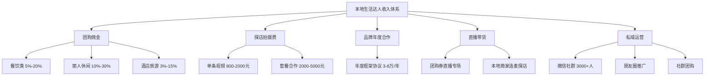

## 案例七：本地生活达人的变现模式

### 案例背景：为什么本地生活是普通人最容易切入的赛道

2023年以来，抖音本地生活业务GMV突破千亿级别，美团、快手、小红书纷纷加码本地生活内容生态。与美妆、数码等需要大量粉丝基础的赛道不同，本地生活内容天然具有地域壁垒和信任优势——你推荐的是一家你亲自去过的餐厅、一个你真实体验过的景区，观众的信任门槛远低于推荐一款网购产品。

**案例主人公**：陈晨（化名），28岁，成都某互联网公司产品经理，2023年8月开始运营抖音本地生活账号「成都探店小陈」。此前没有任何短视频创作经验，唯一的"资产"是对成都街头巷尾美食的热爱和一张善于社交的嘴。

**选择本地生活赛道的核心逻辑**：

| 维度 | 本地生活赛道 | 其他热门赛道（如美妆、数码） |
|------|------------|--------------------------|
| 启动门槛 | 低，一部手机即可拍摄 | 中高，需要专业设备和知识储备 |
| 粉丝需求 | 1000粉即可开通团购带货 | 通常需要1万+粉丝才有变现机会 |
| 内容壁垒 | 地域性天然屏障，竞争相对小 | 全国性竞争，红海程度高 |
| 变现速度 | 快，发布即可挂载POI链接 | 慢，需要积累粉丝后才能接广告 |
| 收入天花板 | 中等（地域限制），但稳定 | 高，但波动大 |
| 复购性 | 极强，餐饮/服务消费高频 | 低，单品消费决策周期长 |

陈晨选择本地生活赛道并非偶然。在正式运营前，他花了两周时间做了一份详细的市场调研，这个调研过程值得每个想入局的人学习。

**他做了什么**：

1. **扫描同城达人现状**：搜索"成都探店"，按粉丝量排序，记录前50个账号的粉丝数、更新频率、内容类型、互动率。他发现成都探店类账号虽然多，但多数停留在"拍菜品特写+念好评"的阶段，缺乏有深度的内容。

2. **分析平台流量分配**：连续一周刷同城推荐页，记录每条本地生活视频的点赞数和发布者粉丝数。他发现大量万赞视频来自粉丝不过千的新号，说明平台在主动给本地生活内容分配流量。

3. **测试自身内容方向**：没有急着发视频，而是先在朋友圈发了三条"成都隐藏美食"的图文，观察朋友的反馈。结果三条内容中，有一条引发了大量私信询问地址，验证了"信息差型探店"的内容方向。

4. **核算经济模型**：在抖音创作者后台查看团购带货的佣金比例（餐饮类通常10%-20%），结合成都餐饮消费均价（客单价60-120元），估算出每单佣金约6-24元。如果一条视频带来100单核销，单条视频收入就在600-2400元之间。

这个调研过程不是可选的——它是决定你能否在本地生活赛道持续变现的第一步。太多人看到"探店达人月入过万"就直接开拍，结果拍了三个月发现没有流量、没有收入，然后放弃。

---

### 第一阶段：冷启动期（第1-2个月）

#### 账号定位与人设打造

陈晨没有选择做"万能探店博主"，而是精准定位为**"成都上班族的午晚餐指南"**。这个定位有三个关键考量：

- **目标人群明确**：上班族，25-40岁，工作日午晚餐和周末聚餐有刚需
- **内容场景固定**：午间探店、下班探店、周末探店，拍摄时间与上班族作息一致
- **差异化明显**：不做高端餐饮，只做人均30-80元的"性价比好店"，与大量做人均200+的探店博主形成错位竞争

**人设关键词**：真实、接地气、不恰烂饭。陈晨在每条视频开头都会说"我是小陈，一个在成都吃了8年的打工人"，强化人设记忆点。

**账号装修清单**：

```text
头像：在成都标志性火锅店前的真人照片（不是精修照，是随手拍的生活照）
昵称：成都探店小陈（城市+品类+昵称，搜索友好）
简介：成都上班族的干饭指南 | 只推荐自己反复去吃的店 | 每周三/五/六更新
背景图：一张成都街景照片，上面叠加文字"跟小陈吃遍成都"
```

#### 内容策略：三种视频类型交替发布

陈晨将内容分为三个类型，按照4:3:3的比例交替发布：

**类型一：单店深度探店（占比40%）**

这是基础内容。每条视频聚焦一家店，时长45-90秒，结构固定：

```text
[0-5秒] 悬念开场："成都这家开了20年的苍蝇馆子，本地人排队1小时也要吃"
[5-15秒] 环境展示：不美化，真实展示店面环境（破旧反而是卖点）
[15-40秒] 菜品展示+试吃反应：重点拍3-4道招牌菜，每道菜用1-2句话点评
[40-55秒] 价格揭秘："三个人吃了一桌，一共才138，人均不到50"
[55-65秒] 实用信息："地址在XX路XX号，地铁X号线X口出来走3分钟"
[65-75秒] 引导互动："你们还想看成都哪个区的美食？评论区告诉我"
```

**类型二：合集攻略类（占比30%）**

这类内容容易获得高收藏和高分享。典型标题：

- "成都打工人午晚餐攻略：高新区这5家店我能吃一个月"
- "成都人均50以下的小馆子，本地人私藏的10家"
- "成都深夜食堂指南：凌晨2点还能吃到的8家店"

每条视频时长60-120秒，快速切换5-10家店，每家用5-10秒展示核心卖点。这类视频的关键是在画面下方持续显示店名和地址信息。

**类型三：隐藏信息差类（占比30%）**

这是陈晨的差异化杀手锏。所谓"信息差"，是指那些大多数外地人不知道、甚至很多本地人也没发现的消费信息：

- "成都这家酒店自助餐，周一到周四午市只要79元，海鲜不限量"
- "成都XX景区门票，抖音团购比美团便宜30块，附链接"
- "成都这个新开的夜市，90%的人还不知道，趁没火赶紧去"

这类内容的播放量通常最高，因为它本质上提供了"省钱信息"，用户转发意愿极强。

#### 拍摄设备与技巧

陈晨的设备非常简单，全部花费不到500元：

```text
主力设备：iPhone 13（已有，不计入成本）
稳定器：浩瀚M5手机稳定器（389元）
补光灯：小型便携补光灯（79元，用于室内暗光环境）
收音：直接用手机自带麦克风（探店视频对收音要求不高）
剪辑：剪映APP（免费）
```

**拍摄实操技巧**：

1. **到店前准备**：提前在大众点评看菜单和人均价格，想好重点拍哪几道菜。到了之后先不急着吃，先拍环境空镜和菜品上桌的画面。

2. **菜品拍摄手法**：夹起食物送到嘴边的过程一定要拍，这是最有食欲感的画面。如果是汤汁类食物，用勺子舀起来再倒回去，让汤汁流动的画面产生视觉吸引力。

3. **试吃反应要真实**：不需要夸张的表情，但要有真实的反应。"这个辣椒真的香"比"太好吃了太好吃了"更有说服力。

4. **剪映剪辑要点**：节奏要快，每2-3秒切一个画面。BGM选择轻快的纯音乐，音量控制在人声的30%-40%。字幕必须加，用剪映的自动识别字幕功能即可，但要手动校对错别字。

#### 冷启动期数据表现

| 指标 | 第1个月 | 第2个月 |
|------|--------|--------|
| 发布视频数 | 14条 | 15条 |
| 总播放量 | 8.2万 | 35.6万 |
| 单条最高播放 | 2.1万 | 12.8万 |
| 粉丝增长 | 380 | 2,100 |
| 总收入 | 0元（未开通团购带货） | 420元（刚开通，仅3单核销） |

前两个月几乎没有收入，这是正常的。陈晨在这段时间做的最重要的事情不是赚钱，而是**建立内容库存和测试内容方向**。通过分析每条视频的数据（完播率、互动率、转化率），他逐渐找到了"信息差类内容+性价比推荐"这个流量密码。

---

### 第二阶段：增长期（第3-6个月）

#### 开通团购带货的完整流程

当粉丝突破1000后，陈晨立即申请开通了抖音团购带货权限。具体流程：

```text
步骤1：抖音APP → 我 → 创作者服务中心 → 团购带货
步骤2：完成实名认证（身份证正反面+人脸识别）
步骤3：满足开通条件（粉丝≥1000、发布视频≥5条、无违规记录）
步骤4：审核通过后，进入"选品广场"选择要推广的商家
步骤5：拍摄视频时挂载对应商家的POI链接
步骤6：用户通过你的视频购买团购券并到店核销，你获得佣金
```

**佣金机制详解**：

抖音本地生活的佣金结构与其他带货形式有本质区别：

| 佣金类型 | 比例范围 | 结算方式 | 结算周期 |
|---------|---------|---------|---------|
| 餐饮类团购 | 5%-20% | 用户核销后结算 | T+7（核销后7天） |
| 丽人/休闲类 | 10%-30% | 用户核销后结算 | T+7 |
| 酒店/旅游类 | 3%-15% | 用户核销后结算 | T+7 |
| 到店综合服务 | 8%-25% | 用户核销后结算 | T+7 |

关键点：**佣金是按核销量计算，不是按购买量计算**。用户买了团购券但没去消费（过期退款），你是拿不到佣金的。所以陈晨在视频中会反复强调"有效期一个月，建议这周就去"，提高核销率。

#### 商家合作的三种模式

随着粉丝量和影响力增长，陈晨开始收到商家的主动合作邀约。他将合作模式分为三种：

**模式一：纯佣金合作（起步阶段）**

这是最基本的形式。你在选品广场挑选商家的团购套餐，拍摄探店视频挂载POI链接，用户核销后你获得佣金。

- 优点：零成本启动，不需要与商家直接沟通
- 缺点：佣金比例由平台设定，通常偏低（5%-10%）
- 适合：新手期，粉丝量低于5000的阶段

**模式二：佣金+探店费（成长阶段）**

当你的账号有了一定影响力（通常粉丝过万、单条视频播放稳定过万），商家会主动联系你，邀请你到店拍摄。商家通常提供免费餐食（价值200-500元）+ 探店拍摄费（500-2000元/条）。

陈晨的收费标准：

```text
单条探店视频：800元（含到店拍摄+1条45-90秒视频+挂载POI链接）
探店套餐A：2000元（含1条主视频+3条花絮/短视频+小红书同步发布）
探店套餐B：3500元（含1条主视频+3条花絮+小红书同步+直播1小时）
以上价格均不含团购佣金，佣金另算。
```

**模式三：长期年度合作（成熟阶段）**

当你的账号成为区域头部达人（通常粉丝5万+），部分连锁品牌会签订年度合作协议。陈晨在第8个月时与一家成都本地火锅连锁品牌签订了年度合作：每月到店拍摄2次，每次1条主视频+2条短视频，年度合作费3.6万元（月付3000元），团购佣金另算。

#### 内容升级：从单店探店到生活方式

进入增长期后，陈晨意识到单纯拍探店视频已经不够了。他开始将内容升级为"成都生活方式指南"：

**内容矩阵扩展**：

```text
核心内容（60%）：探店视频，保持不变
扩展内容（25%）：成都生活攻略
  - "成都租房避坑指南：这几个区域性价比最高"
  - "成都周末去哪玩：不花钱的5个好去处"
  - "成都通勤神器：这些公交线路比地铁还快"
衍生内容（15%）：个人Vlog
  - "探店博主的一天是怎么过的"
  - "我是怎么找到那些隐藏好店的"
  - "被粉丝偶遇是什么体验"
```

这种内容矩阵的好处是：探店视频带来精准的团购转化收入，生活攻略类内容带来泛流量和粉丝增长，个人Vlog增强粉丝粘性和信任感。

#### 增长期数据表现

| 指标 | 第3个月 | 第4个月 | 第5个月 | 第6个月 |
|------|--------|--------|--------|--------|
| 粉丝量 | 4,200 | 7,800 | 13,500 | 21,000 |
| 月发布视频数 | 16条 | 18条 | 18条 | 20条 |
| 月总播放量 | 68万 | 125万 | 180万 | 230万 |
| 团购佣金收入 | 1,800元 | 3,600元 | 5,200元 | 7,800元 |
| 探店拍摄费收入 | 0元 | 1,600元 | 4,000元 | 6,400元 |
| 月总收入 | 1,800元 | 5,200元 | 9,200元 | 14,200元 |

---

### 第三阶段：成熟期（第7-12个月）

#### 构建多元变现体系

进入成熟期后，陈晨的收入来源从单一的团购佣金扩展为五条收入线：



**收入线一：团购佣金（月均8,000-12,000元）**

这是基础收入。关键策略是**提高核销率**，陈晨通过以下方法将核销率从35%提升到62%：

- 视频中强调有效期："这个券有效期只有15天，建议周末就去"
- 评论区置顶核销提醒："买了券的朋友记得去啊，过期就退了"
- 发布"已购用户反馈"类内容：展示粉丝到店消费的真实反馈
- 每周统计一次核销数据，核销率低于40%的商家暂停合作

**收入线二：探店拍摄费（月均6,000-10,000元）**

随着影响力提升，陈晨将单条视频报价从800元提升到1,500元。他建立了标准化的交付流程：

```text
商家合作SOP：
1. 收到商家邀约 → 2. 审核店铺（大众点评评分≥4.0、近期无差评风暴）
3. 确认合作方案和报价 → 4. 到店拍摄（提前沟通拍摄重点）
5. 24小时内交付初剪版本 → 6. 商家确认后发布（修改不超过2次）
7. 发布后48小时提供数据报告（播放量、点赞、评论、团购销量）
```

**收入线三：品牌年度合作（月均3,000-6,000元）**

陈晨在第9个月时已经与3家品牌签订了年度合作：一家火锅连锁、一家奶茶品牌、一家洗浴中心。年度合作的核心价值不仅是收入的稳定性，更重要的是**降低了持续找商家的时间成本**。

**收入线四：直播带货（月均2,000-5,000元）**

陈晨每周做1-2场直播，每场2-3小时。直播内容有两种形式：

- **店内直播**：到合作商家店内进行实时探店直播，边吃边聊边挂团购链接。转化率通常比短视频高2-3倍。
- **团购券专场直播**：将本周探过的所有店的团购券集中推荐，每家店用5-10分钟讲解，形成"直播版探店合集"。

**收入线五：私域运营（月均2,000-4,000元）**

陈晨建立了3个微信群（每群500人上限），群内每天推荐1-2家经过验证的好店。私域的价值在于：

- 推送团购链接的转化率是公域视频的3-5倍（信任度高）
- 可以做群专属的团购活动（与商家谈判群专属折扣）
- 积累的私域流量不受平台算法影响

#### 成熟期完整数据

| 指标 | 第7个月 | 第9个月 | 第12个月 |
|------|--------|--------|---------|
| 粉丝量 | 28,000 | 45,000 | 68,000 |
| 月发布视频数 | 20条 | 22条 | 20条 |
| 月总播放量 | 280万 | 350万 | 320万 |
| 团购佣金收入 | 8,500元 | 10,200元 | 11,500元 |
| 探店拍摄费收入 | 7,500元 | 9,000元 | 8,000元 |
| 品牌年度合作收入 | 3,000元 | 5,000元 | 6,000元 |
| 直播带货收入 | 2,000元 | 3,500元 | 4,800元 |
| 私域运营收入 | 1,500元 | 2,800元 | 3,500元 |
| **月总收入** | **22,500元** | **30,500元** | **33,800元** |

---

### 核心方法论：本地生活达人的六大关键能力

#### 能力一：选店能力——决定内容质量的天花板

选店是本地生活达人最核心的能力。一个好店能让你的视频轻松破万赞，一个烂店会让观众质疑你的判断力。

**选店四步法**：

```text
第一步：信息筛选
  - 大众点评搜索目标区域，筛选评分4.0+、评价数100+的店铺
  - 关注小红书/抖音同城的新店开业信息
  - 加入本地美食社群，获取一手探店情报
  - 关注本地美食类公众号的新店推荐

第二步：线上预判
  - 查看近期评价（近30天），排除评分下滑的店
  - 查看差评内容，判断是偶发问题还是系统性问题
  - 查看商家在抖音的团购套餐设置是否合理

第三步：实地验证
  - 第一次到店不拍摄，以普通顾客身份体验
  - 重点关注：菜品口味、分量、服务态度、环境卫生、等位时间
  - 如果第一次体验不满意，直接淘汰，不给第二次机会

第四步：商业评估
  - 该店是否有抖音团购套餐（没有的话，建议商家开通后再合作）
  - 佣金比例是否合理（低于5%的不值得推）
  - 该店的目标客群是否与你的粉丝画像匹配
```

**选店红线——这五类店绝对不推**：

1. 食品安全有隐患的店（后厨脏乱差、食材不新鲜）
2. 服务态度极差的店（再好吃也不推荐，用户体验是整体的）
3. 性价比严重不合理的店（人均200但只有人均80的品质）
4. 已经在走下坡路的店（品质下降、裁员、减少营业时间）
5. 存在严重商业纠纷的店（加盟商纠纷、劳资纠纷）

#### 能力二：内容创作能力——从"拍视频"到"做内容"

大多数本地生活达人的内容停留在"展示菜品"的层面，而真正能持续增长的达人，是在"做内容"。

**内容创作的三个层次**：

| 层次 | 表现 | 示例 |
|------|------|------|
| 初级：信息传递 | 告诉观众这家店有什么 | "这家店有火锅、串串、烧烤" |
| 中级：体验分享 | 让观众感受到你的体验 | "这个牛油锅底一上桌，那个香味直接把我征服了" |
| 高级：价值输出 | 给观众一个行动的理由 | "在成都吃火锅，人均100能吃到这种品质的，我只找到这一家" |

**提升内容质量的具体方法**：

1. **学会讲故事**：每家店都有故事——老板的故事、菜品的故事、这条街的故事。"这家店的老板以前是五星级酒店的厨师长，辞职开了这家小店，只因为他觉得酒店的菜不够地道"——这样的开场比"今天来吃一家好吃的店"有吸引力得多。

2. **善用对比**：人均50的店和人均150的店做同类菜品对比，观众最想知道的是"差价到底差在哪"。

3. **制造信息差**：找到观众不知道的信息——隐藏菜单、非热门时段优惠、特定支付方式折扣、平台独家团购券。

4. **加入实用信息**：停车方便吗？地铁哪个出口？需要等位多久？适合几个人去？这些看似琐碎的信息，恰恰是观众最关心的。

#### 能力三：商务谈判能力——让每一分劳动都值钱

很多达人不好意思谈价格，或者不知道怎么谈。以下是陈晨总结的商务谈判要点：

**报价策略**：

```text
基础报价公式：
单条视频报价 = 粉丝数 × 0.03-0.05（元）
示例：5万粉 × 0.04 = 2000元/条

调整因素：
+ 内容类型：探店视频 > 产品展示（探店需要到店，时间成本高）
+ 拍摄难度：需要排队/预约的店 > 随到随拍的店
+ 合作形式：长期合作 > 单次合作（可给8-9折）
- 竞品冲突：同品类商家合作过多时适当降价
- 淡旺季：餐饮淡季（6-8月）可适当降价，旺季（10-2月）不议价
```

**谈判话术模板**：

```text
商家："我们预算有限，能不能便宜点？"
回复："理解的，我们也可以做一个轻量级的合作方案。比如我不到店拍摄，
      只做一条图文探店（费用减半），挂载你们的团购链接，这样成本低但
      效果也能保证。您看这个方案可以吗？"

商家："我们希望你多发几条，一条800太贵了。"
回复："一条视频从拍摄到剪辑到发布需要一整天的时间。如果您需要多条内容，
      我可以给一个套餐价：3条视频打包2200元（原价2400），相当于每条
      733元，已经是很大的诚意了。"

商家："别的达人只要500一条。"
回复："每个达人的粉丝量、内容质量、转化效果都不一样。您可以看一下我
      近期的团购数据，单条视频平均带来XX单核销，按每单XX元佣金算，
      一条视频的投入产出比是XX倍。我相信这个数据比价格更有说服力。"
```

#### 能力四：数据分析能力——用数据驱动内容优化

陈晨每周日晚上会花1小时做数据分析，这是他持续增长的关键。

**核心数据指标及优化方向**：

| 指标 | 计算方式 | 健康值 | 不达标时的优化方向 |
|------|---------|--------|------------------|
| 完播率 | 完整观看人数/播放人数 | ≥30% | 优化前3秒钩子，缩短视频时长 |
| 点赞率 | 点赞数/播放数 | ≥3% | 增加情绪触发点（惊讶、认同、感动） |
| 评论率 | 评论数/播放数 | ≥0.5% | 在视频中提问，引导观众评论 |
| 收藏率 | 收藏数/播放数 | ≥2% | 增加实用信息（地址、价格、攻略） |
| 分享率 | 分享数/播放数 | ≥1% | 增加"转发给朋友"的引导话术 |
| 团购点击率 | POI点击数/播放数 | ≥2% | 优化团购券的口播推荐话术 |
| 核销率 | 核销数/购买数 | ≥45% | 强调有效期，提醒用户到店消费 |

**陈晨的一次数据驱动优化案例**：

第5个月时，陈晨发现自己的完播率从32%下降到了21%。他逐条分析了当月所有视频的数据，发现了一个规律：时长超过70秒的视频，完播率平均只有18%；而时长在45-60秒的视频，完播率平均35%。

原因分析：观众刷到探店视频时，注意力窗口只有前3-5秒，如果前5秒没有抓住注意力就会划走。而视频越长，需要维持注意力的时间越长，完播率自然下降。

优化措施：将所有单店探店视频的时长控制在50秒以内，合集类视频控制在80秒以内。优化后，下一个月的完播率回升到33%，总播放量增长了40%。

#### 能力五：风险控制能力——避免踩坑翻车

本地生活达人面临的风险比其他赛道更多，因为涉及真实的线下消费体验和商家合作关系。

**常见风险及应对策略**：

**风险一：食品安全问题**

你推荐的店如果出了食品安全问题，你的信誉会受到严重损害。

```text
预防措施：
- 只推荐自己至少去过3次的店
- 每次到店注意观察后厨卫生状况（能看后厨的尽量看）
- 不推荐新开不到3个月的店（等稳定期过了再说）
- 关注大众点评的近期差评，特别是涉及食品安全的

应对措施：
- 一旦发现合作店铺出现食品安全问题，立即下架所有相关内容
- 在评论区和私信中诚恳回应粉丝的质疑
- 必要时发布声明视频，说明情况并道歉
```

**风险二：商家"翻车"**

合作商家可能突然倒闭、老板跑路、大幅降价（导致之前购买的用户不满）。

```text
预防措施：
- 与商家合作前查询其工商注册信息（企查查/天眼查免费查询）
- 不要为同一家商家做过多背书（单家商家的视频占比不超过20%）
- 定期检查合作商家的经营状态

应对措施：
- 商家倒闭时及时告知已购用户，协助其申请退款
- 删除或标注已过期的推荐内容
```

**风险三：内容违规**

抖音对本地生活内容有严格的审核标准，违规可能导致限流甚至封号。

```text
常见违规点：
- 虚假宣传：夸大菜品口味、虚报价格、伪造评价
- 诱导消费：过度强调"限时优惠""错过就没有"制造焦虑
- 未标注广告：收取商家费用后未标注"广告"或"合作"
- 引导站外：在视频中直接留微信/QQ号（抖音严打）

应对措施：
- 所有收取费用的合作内容，在视频描述中标注"合作"标签
- 不做虚假评价，不好吃的就说"这家一般"，保持客观
- 引导私域通过个人主页的联系方式，不在视频中直接展示
```

#### 能力六：时间管理能力——副业与主业的平衡

陈晨是全职产品经理+兼职探店博主，时间管理是他必须面对的挑战。

**他的时间分配方案**：

```text
工作日：
  12:00-13:00 午休时间探店拍摄（选择公司附近的店）
  21:00-22:30 晚上剪辑发布（利用剪映模板提高效率）
  
周末：
  周六 10:00-14:00 集中探店2-3家（拍摄素材）
  周六 15:00-18:00 剪辑3-4条视频
  周日 20:00-22:00 数据分析+下周选题规划+商家沟通
  
每周投入时间：约12-15小时
```

**效率提升技巧**：

1. **建立内容模板库**：在剪映中保存5-6个常用的视频模板（单店探店、合集攻略、直播预告等），每次只需要替换素材和文案，剪辑时间从2小时缩短到40分钟。

2. **批量拍摄**：周末集中探店2-3家，一次性拍完一周的素材。拍摄时注意每家店至少拍30-50个素材片段，为后期剪辑留足选择空间。

3. **建立商家资源库**：用Excel表格记录所有合作商家的信息（联系方式、合作历史、佣金比例、拍摄日期、数据表现），避免重复沟通和遗忘。

4. **利用碎片时间**：通勤路上选题、午休时间拍摄、等人时回复商家消息，把碎片时间充分利用起来。

---

### 失败教训与常见误区

#### 误区一：为了赚钱什么店都推

很多新入局的达人为了赚钱，只要商家给钱就去拍，不管店铺质量如何。短期看收入增加了，长期看粉丝信任度会急剧下降。

**陈晨的教训**：在第4个月时，一家新开的日料店找到陈晨，愿意出2000元探店费。陈晨到店后发现菜品质量很一般，但因为已经收了钱，还是拍了一条"好评"视频发布。结果评论区大量粉丝吐槽"这家店不好吃"、"小陈也开始恰烂饭了"。那条视频的负面评论率高达15%（正常视频的负面评论率通常低于2%），直接导致当月掉粉300+。

**正确做法**：体验不好就直接告诉商家："这次体验不太理想，我建议您先优化菜品和服务，等品质稳定了我们再合作。"短期少赚2000元，长期保住的是几万粉丝的信任。

#### 误区二：忽视评论区运营

很多达人只管发视频，不管评论区。但评论区是本地生活达人与粉丝建立信任的关键阵地。

**评论区运营要点**：

- 每条视频发布后，前2小时内回复所有评论（提高互动率，助推算法推荐）
- 对于"这家店在哪里"、"人均多少钱"类的问题，耐心回答（这些评论本身就是内容的补充）
- 对于负面评论（"我去了不好吃"），不要删除，而是诚恳回应："是吗？你点了哪些菜？我下次去再试试"
- 定期在评论区置顶最新的团购链接或探店信息

#### 误区三：内容同质化严重

当你的所有视频都是"到店→拍菜→试吃→给好评"的套路时，观众很快会审美疲劳。

**破解方法**：

- 加入剧情元素："今天带我妈去吃她最爱的酸菜鱼，结果她嫌我点太多了"
- 尝试不同拍摄视角：第一人称POV、航拍、延时摄影
- 做系列内容："成都100家苍蝇馆子挑战"、"一周只花200吃饭挑战"
- 与其他达人联动：同城达人互相探对方推荐的店

#### 误区四：过度依赖单一平台

只在抖音做本地生活内容是有风险的——平台算法调整、政策变化都可能影响你的收入。

**多平台策略**：

| 平台 | 内容形式 | 变现方式 | 投入精力占比 |
|------|---------|---------|------------|
| 抖音 | 短视频+直播 | 团购佣金+探店费 | 50% |
| 小红书 | 图文笔记+短视频 | 品牌合作+团购佣金 | 25% |
| 大众点评 | 评价+笔记 | 会员等级+霸王餐 | 15% |
| 微信视频号 | 短视频 | 私域导流 | 10% |

小红书的本地生活内容竞争度低于抖音，且用户消费能力更强，是抖音之外最值得投入的平台。大众点评虽然变现能力弱，但其高权重的评价内容会持续带来长尾流量。

#### 误区五：忽视合规要求

2024年以来，抖音持续加强对本地生活内容的合规审查。以下红线绝对不能碰：

```text
1. 未标注广告/合作关系 → 限流+警告，多次违规封号
2. 虚假价格宣传（如"原价399现在只要99"，但原价从未卖过399）→ 扣分+下架
3. 刷单刷好评（商家给你看的团购数据造假）→ 一旦查实永久封号
4. 引导用户私下交易（绕过平台团购直接付款）→ 严重违规，封号处理
5. 未经授权使用他人视频素材 → 侵权投诉+下架
```

---

### 从零到一的行动清单

如果你看完这个案例想入局本地生活赛道，以下是按优先级排列的行动清单：

**第一周：调研与定位**

- [ ] 在抖音搜索你所在城市的探店达人，记录前30个账号的粉丝数、内容类型、更新频率
- [ ] 在大众点评搜索你常去的区域，统计评分4.0+的店铺数量
- [ ] 确定你的细分定位（区域+人群+价格带）
- [ ] 完成账号装修（头像、昵称、简介、背景图）

**第二周：内容准备**

- [ ] 购买基础设备（稳定器+补光灯，预算500元以内）
- [ ] 在剪映中创建3-4个视频模板
- [ ] 选择3家你最熟悉的店铺，提前踩点拍摄
- [ ] 学习本章核心技巧部分的拍摄和剪辑教程

**第三周：正式发布**

- [ ] 发布第一条视频，观察数据表现
- [ ] 每天回复所有评论和私信
- [ ] 发布3-5条不同类型的视频，测试哪种内容数据最好

**第四周：优化迭代**

- [ ] 分析每条视频的完播率、互动率、转化率
- [ ] 根据数据调整内容方向和拍摄手法
- [ ] 尝试与1-2家商家建立纯佣金合作

**第二个月起：持续执行**

- [ ] 保持每周发布3-4条视频的频率
- [ ] 开通团购带货权限（粉丝达到1000后）
- [ ] 逐步建立商家合作资源库
- [ ] 每周日晚上做数据分析和下周规划

---

### 本案例核心启示

本地生活赛道的本质是**用内容连接消费者和本地商家**，你的价值在于两方面：一是帮消费者发现好店、省钱避坑，二是帮商家获取精准客流。只要这两个价值持续存在，你的变现能力就不会消失。

与需要百万粉丝才能变现的赛道相比，本地生活达人的核心竞争力不是粉丝量，而是**本地影响力**和**信任度**。一个在成都只有5万粉丝但粉丝信任度极高的探店达人，其变现能力可能超过一个50万粉丝但内容泛泛的美食博主。

最后要强调的是：**本地生活变现是一门"慢生意"**。前3个月几乎不赚钱是常态，第4-6个月开始有稳定收入，第7-12个月才能达到月入2-3万的水平。如果你期望一个月就能赚到钱，这个赛道不适合你。但如果你愿意用半年时间打基础，本地生活是可以长期经营、收入稳定、且越来越轻松的副业方向。
