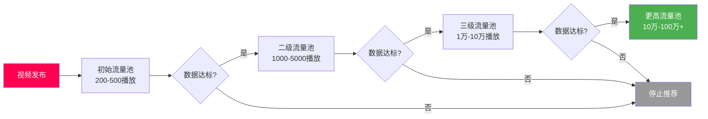
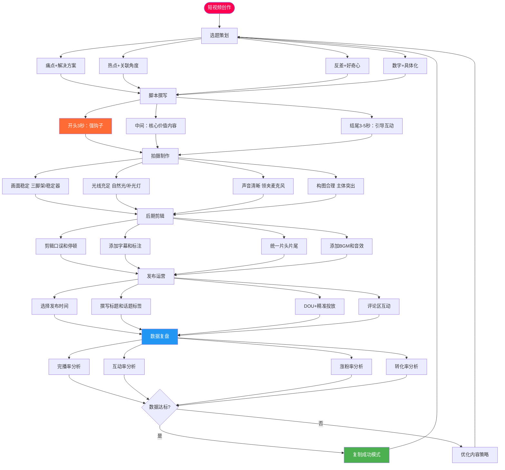

## 一、抖音运营核心技巧

抖音是目前中国最大的短视频平台之一，日活跃用户超过7亿，其推荐算法以"内容质量"而非"粉丝数量"为核心分发依据，这意味着即使是零粉丝的新账号，只要内容足够优质，依然有机会获得百万级曝光。理解并掌握抖音运营的核心技巧，是短视频变现的第一步，也是最关键的一步。

### 1.1 理解抖音推荐算法

在谈任何运营技巧之前，必须先理解抖音的内容分发机制。不懂算法，所有努力都是盲人摸象。

#### 1.1.1 推荐算法的核心逻辑

抖音采用的是"去中心化"的推荐机制，每一条视频都会经历一个层层递进的流量池筛选过程：



每个流量池的晋升，取决于以下四个核心指标的综合表现：

| 指标 | 权重 | 含义 | 优化方向 |
|------|------|------|----------|
| **完播率** | ★★★★★ | 用户看完整个视频的比例 | 控制时长、节奏紧凑、悬念设计 |
| **互动率** | ★★★★☆ | 点赞+评论+分享+收藏的综合比例 | 引导互动、争议话题、实用价值 |
| **关注率** | ★★★☆☆ | 看完视频后关注账号的比例 | 人设鲜明、系列内容、主页装修 |
| **转发率** | ★★★☆☆ | 用户将视频分享给他人的比例 | 情感共鸣、实用干货、社交货币 |

**关键认知：** 完播率是所有指标中权重最高的。一条15秒的视频如果完播率达到40%以上，比一条60秒视频完播率只有15%更容易进入下一级流量池。因此，新手起步阶段应优先制作15-30秒的短视频。

#### 1.1.2 影响推荐的隐藏因素

除了上述四个核心指标，还有一些容易被忽略的因素会影响视频推荐：

- **账号权重**：长期发布优质内容的账号，初始流量池更大（可能直接给到500-1000播放）；违规过的账号会被降权，初始流量池可能只有50-100
- **发布时间**：在目标用户活跃时段发布，初始互动数据更好，更容易突破流量池
- **完播后行为**：用户看完你的视频后是继续刷还是退出抖音，抖音会追踪这个信号——如果用户看完你的视频就退出了，说明你的内容"留住了用户"，算法会加分
- **重复播放**：用户反复观看同一视频是极强的正向信号，说明内容质量极高
- **负反馈率**：用户点击"不感兴趣"或"举报"的比例越高，推荐量越少

### 1.2 账号定位与人设打造

账号定位决定了你的天花板。定位不清晰的账号，内容再好也难以持续增长。

#### 1.2.1 账号定位三要素

每个成功的抖音账号都必须清晰回答三个问题：

1. **我是谁**——账号的身份标签。是行业专家？是生活达人？是搞笑博主？身份标签决定了用户对你的第一印象和期待值。比如"设计师阿爽"的身份标签就是"室内设计师"，用户一看就知道能从这里获得装修设计相关的内容。

2. **做什么**——内容领域和价值输出方向。要具体到细分领域，而不是泛泛地说"做内容"。比如"美食"太宽泛，"一人食快手菜"就精准得多；"知识分享"太模糊，"Excel职场效率技巧"就有明确的价值主张。

3. **给谁看**——目标用户群体及其核心需求。需要具体到用户画像：年龄、性别、地域、职业、痛点、消费能力。目标用户越精准，内容越容易打动人。

#### 1.2.2 定位的四种常见策略

| 策略类型 | 核心思路 | 适用场景 | 案例 |
|----------|----------|----------|------|
| **专业型** | 用专业技能建立权威感 | 有明确专业背景的创作者 | 法律咨询、医学科普、财务规划 |
| **生活型** | 展示真实生活方式，引发共鸣 | 生活方式有特色的普通人 | 北漂日记、农村生活、独居日常 |
| **娱乐型** | 用创意和趣味吸引流量 | 有表演天赋或创意能力的人 | 搞笑短剧、情景模仿、变装 |
| **实用型** | 提供可直接使用的干货 | 有实操经验的从业者 | 做菜教程、穿搭指南、软件教程 |

**定位选择的核心原则：** 选择你既有能力持续产出、又有市场需求的方向。纯自嗨的内容没有商业价值，纯追热点没有积累效应。最好的定位是"你擅长的"与"用户需要的"交集。

#### 1.2.3 人设打造的实操步骤

人设不是"演"出来的，而是把你身上最有辨识度的特质放大。

**第一步：挖掘个人标签**

列出你身上所有可能的标签，包括：
- 专业背景（10年程序员、5年宝妈、3年健身教练）
- 生活经历（从月薪3千到年入百万、北漂10年回到小城）
- 性格特点（毒舌但真诚、温柔但有原则、搞笑但有深度）
- 外形特征（可以是优势也可以是特色，比如标志性的口头禅、穿着风格）

**第二步：差异化分析**

在抖音搜索你的领域，找到排名前20的同类账号，逐一分析：
- 他们的身份标签是什么？
- 他们的内容风格是什么？
- 他们的核心卖点是什么？
- 他们没有覆盖到的用户需求是什么？

差异化不是"和别人完全不同"，而是"在某个维度上做到极致"。比如同样是美食博主，"麻辣德子"的差异点是"朴实的农村大锅饭"，"美食作家王刚"的差异点是"专业厨师视角的教学"。

**第三步：一致性维护**

人设一旦确定，所有内容都要围绕这个人设展开：
- 内容风格统一（不要今天搞笑明天严肃）
- 表达方式统一（口头禅、语速、表情管理）
- 视觉呈现统一（封面风格、色调、字体）
- 价值主张统一（不要今天教省钱明天教奢侈消费）

#### 1.2.4 账号装修清单

账号主页是用户的"第二印象"（第一印象是视频内容），装修质量直接影响关注转化率：

| 装修要素 | 具体要求 | 常见错误 |
|----------|----------|----------|
| **头像** | 高清、面部清晰、背景简洁、有辨识度 | 风景照、宠物照、模糊自拍、文字图 |
| **昵称** | 4-8个字、易记易搜、包含领域关键词 | 过长、生僻字、纯英文、含特殊符号 |
| **简介** | 第一行说清"我是谁+能给你什么"，第二行放行动指引 | 空白、太长、写心情语录、无价值主张 |
| **背景图** | 强化品牌视觉、可放更新时间/联系方式引导 | 默认灰色、与内容无关的图片 |
| **置顶视频** | 选3条数据最好的或最能代表账号定位的视频 | 不置顶、置顶过时内容、置顶数据差的视频 |

**简介模板参考：**

```text
🔹 [身份标签]｜[核心价值]
🔹 [内容方向/更新频率]
🔹 [行动指引/联系方式]
```

示例：
```text
🔹 10年资深设计师｜教你零基础学设计
🔹 每天1个设计技巧，小白也能学会
🔹 点击主页看更多干货👇
```

### 1.3 短视频内容创作全流程

内容创作是抖音运营的核心。一条爆款视频的诞生，需要经历选题、脚本、拍摄、剪辑、发布五个环节，每个环节都有其关键技巧。



#### 1.3.1 选题策划：决定80%的流量

选题是短视频的"地基"，选题不对，拍摄再精美、剪辑再炫酷都是白费。以下是经过验证的四种高效选题公式：

**公式一：痛点 + 解决方案**

找到目标用户最头疼的问题，直接给出解决方案。这类内容天然具有高收藏率和高转发率。

示例：
- "每次开会都紧张到语无伦次？3个方法让你自信表达"
- "租房总是踩坑？签合同前一定要检查这5个地方"
- "Excel表格太慢？这3个快捷键让你效率翻倍"

**公式二：热点 + 关联角度**

借助当下的社会热点、娱乐新闻、平台挑战，结合自己的领域产出内容。关键是要找到热点与自身领域的自然关联点，生硬蹭热点反而会降低账号垂直度。

实操步骤：
1. 每天早上查看抖音热搜榜、微博热搜、百度热榜
2. 快速判断哪些热点与你的领域有关联
3. 在热点发酵的2-6小时内发布相关内容
4. 标题中带上热点关键词，增加搜索流量

**公式三：反差 + 打破认知**

人们对"意外"天然敏感。当你的内容颠覆了用户的固有认知，他们会忍不住看完、点赞、评论。

示例：
- "月薪3千的人和月薪3万的人，最大的区别不是能力"
- "我辞职后收入反而翻了3倍，因为我做对了这件事"
- "90%的人都在用错误的方式刷牙"

**公式四：数字 + 具体化**

数字天然具有说服力和吸引力。"3个方法"比"一些方法"更让人想看，"月入2万"比"赚不少钱"更有冲击力。

示例：
- "5个习惯让我一年瘦了30斤"
- "靠这3个副业，我每月多赚8000块"
- "装修省了5万块，就因为知道了这个网站"

#### 1.3.2 脚本创作：结构决定完播率

一条高完播率的视频，脚本结构一定是精心设计的。以下是经过大量数据验证的黄金脚本结构：

**开头（前3秒）—— 钩子设计**

前3秒决定了用户是继续看还是划走。以下是四种经过验证的钩子类型：

| 钩子类型 | 原理 | 示例 |
|----------|------|------|
| **提问式** | 利用"知识缺口"激发好奇心 | "你知道为什么你的视频永远上不了热门吗？" |
| **冲突式** | 制造认知冲突，让人想知道答案 | "月薪3千和月薪3万的人，区别到底在哪里？" |
| **悬念式** | 抛出结果，让人想知道过程 | "这个方法让我的收入翻了10倍，今天免费教你" |
| **共鸣式** | 触发情感认同，让人觉得"说的就是我" | "每个打工人都经历过这种痛苦，但没人敢说" |
| **数字式** | 具体数字增加可信度和好奇心 | "坚持做了30天，我的皮肤状态完全变了" |
| **否定式** | 否定常见做法，暗示有更好的方法 | "千万别再这样存钱了，越存越穷" |

**中间（主体）—— 价值交付**

主体部分是视频的核心价值所在，必须做到：
- **分点阐述**：用"第一、第二、第三"或"首先、然后、最后"的结构，让内容逻辑清晰、易于跟读
- **案例佐证**：每个观点至少配一个具体案例或数据，不说空话
- **节奏紧凑**：每15秒左右要有一个小高潮或转折，避免用户中途划走
- **信息密度适中**：既要避免注水（废话太多），也要避免信息过载（一口气说太多记不住）

**结尾（最后3-5秒）—— 互动引导**

结尾是提升互动率的关键位置，常见的引导方式：

- **引导评论**："你觉得哪个方法最实用？评论区告诉我"——比"记得评论"更有效，因为它给出了具体的评论方向
- **引导收藏**："先收藏，下次用到的时候就不会找不到了"——利用"怕错过"心理
- **引导关注**："关注我，每天教你一个实用技巧"——给出关注的理由
- **系列预告**："下期教你XXX，不想错过的先点关注"——利用"连续性"心理

#### 1.3.3 拍摄技巧：用手机也能拍出专业感

不需要昂贵的设备，一部手机加上几个小配件就能拍出高质量的视频：

**基础设备清单：**

| 设备 | 预算 | 推荐 | 作用 |
|------|------|------|------|
| 手机支架/三脚架 | 20-80元 | 桌面升降支架 | 画面稳定，解放双手 |
| 补光灯 | 50-200元 | 环形补光灯 | 光线均匀，肤色好看 |
| 领夹麦克风 | 30-150元 | 无线领夹麦 | 声音清晰，去除环境噪音 |
| 背景布/背景板 | 20-60元 | 纯色或简约图案 | 背景干净，突出主体 |

**拍摄参数设置：**

- 分辨率：1080P即可（4K文件太大，上传会被压缩）
- 帧率：30fps（日常拍摄够用，运动类内容用60fps）
- 比例：9:16竖屏（抖音的标准比例）
- 对焦：拍摄前点击屏幕锁定对焦和曝光
- 防抖：开启手机自带的视频防抖功能

**光线处理要点：**

光线是画面质量的第一决定因素。优先使用自然光——面朝窗户拍摄，光线柔和且均匀。如果在室内光线不足，使用补光灯放在面部正前方或斜前方45度位置，避免顶光（会产生阴影）和背光（面部全黑）。

**构图基础：**

- **中心构图**：人物居中，适合口播类内容
- **三分法构图**：人物位于画面三分之一处，适合有背景的场景
- **留白构图**：上方或下方留出空间放字幕，适合教学类内容

#### 1.3.4 后期剪辑：让内容更专业

**推荐剪辑工具：**

| 工具 | 平台 | 难度 | 适用场景 |
|------|------|------|----------|
| **剪映** | 手机/电脑 | ★☆☆ | 日常剪辑，模板丰富，抖音官方工具 |
| **CapCut（剪映国际版）** | 手机/电脑 | ★☆☆ | 面向海外市场的剪辑 |
| **Final Cut Pro** | Mac | ★★★ | 专业级视频剪辑 |
| **Premiere Pro** | Win/Mac | ★★★ | 专业级视频剪辑，行业标准 |

**剪辑的核心原则：**

1. **剪掉一切废话和停顿**——口播类视频中，每一个"嗯"、"啊"、"那个"都应该被剪掉，让信息密度最大化。剪映的"智能剪辑"功能可以自动识别并删除停顿片段。

2. **添加字幕**——抖音大量用户在公共场所刷视频，不开声音。没有字幕的视频，这部分用户根本看不懂你在说什么。剪映支持"智能字幕"一键识别语音生成字幕，识别准确率在95%以上，但仍需手动校对。

3. **统一视觉风格**——固定的片头（2-3秒）、固定的字体和颜色、固定的封面模板，让用户一眼认出这是你的内容。品牌辨识度是长期积累的过程。

4. **BGM选择**——背景音乐能极大提升视频的观感。选择音乐时注意：音量不要盖过人声（建议人声:BGM = 7:3）；选择与内容情绪匹配的音乐；优先使用抖音热门BGM（算法会给予一定的流量加成）。

#### 1.3.5 发布策略：细节决定流量

**发布时间选择：**

不同领域的目标用户活跃时间不同，以下是各时段的用户特征：

| 时间段 | 用户特征 | 适合内容类型 |
|--------|----------|-------------|
| 7:00-9:00 | 通勤路上，碎片化浏览 | 短平快的知识、新闻、正能量 |
| 12:00-13:30 | 午休时间，放松心态 | 轻松娱乐、美食、生活类 |
| 18:00-20:00 | 下班路上/晚饭后 | 各类内容的黄金时段 |
| 21:00-23:00 | 睡前刷手机，沉浸式浏览 | 情感、故事、深度内容 |

**最佳发布时间**是你的目标用户最活跃的时间。建议在不同时段各发布几条视频，通过数据对比找到你的最优发布时间。

**标题撰写技巧：**

- 包含核心关键词（便于搜索推荐）
- 制造信息差或好奇心
- 控制在15-30个字
- 可以用数字增加吸引力
- 避免标题党（内容和标题不符会被限流）

**话题标签策略：**

每条视频建议添加3-5个话题标签，组合方式为：1个热门大标签 + 1-2个垂直领域标签 + 1个长尾精准标签。例如做Excel教程的视频：#职场干货 #Excel技巧 #办公效率提升。

### 1.4 涨粉策略：从0到10万的路径

涨粉不是目的，精准涨粉才是。10万精准粉丝的商业价值远高于100万泛粉丝。

#### 1.4.1 内容涨粉（最核心）

持续输出优质内容是涨粉的根本。具体方法：

- **保持更新频率**：新手建议日更或隔日更，让算法识别你是活跃创作者。稳定更新比偶尔爆发更重要
- **系列化内容**：将一个大主题拆成5-10期的系列，每期结尾预告下期内容。系列内容能培养用户的追更习惯，关注转化率比单条视频高3-5倍
- **追热点出快内容**：热点话题自带流量，结合自身领域快速产出相关内容，可以借势获得大量曝光
- **互动型内容**：投票、问答、挑战等互动性强的内容，天然容易获得高互动率，从而获得更多推荐

#### 1.4.2 互动涨粉（建立信任）

- **认真回复每一条评论**：尤其在账号起步阶段，评论区的互动质量直接影响算法推荐。回复评论时不要只说"谢谢"，而是给出有价值的回应，甚至可以在回复中制造讨论
- **主动与同领域账号互动**：去大V的评论区留下有价值的评论，吸引他们的粉丝注意到你。但要注意，是真正有价值的评论，不是"互关"之类的垃圾信息
- **参与平台活动和挑战赛**：抖音经常推出各种话题挑战和活动，参与这些活动能获得额外的流量扶持
- **直播互动**：定期直播与粉丝交流，直播能极大增强粉丝的信任感和粘性

#### 1.4.3 投放涨粉（加速增长）

DOU+是抖音官方的内容推广工具，合理的投放可以加速账号增长：

**DOU+投放策略：**

| 投放目标 | 适用场景 | 预算建议 | 预期效果 |
|----------|----------|----------|----------|
| 点赞评论 | 提升互动数据，帮助突破流量池 | 单条100-300元 | 互动率提升2-5倍 |
| 粉丝增长 | 快速积累基础粉丝 | 单条200-500元 | 单粉成本0.5-3元 |
| 主页浏览 | 引导用户查看其他视频 | 单条100-200元 | 提升整体主页访问量 |

**DOU+投放原则：**

1. **先测试再放大**：先用100元小额投放测试视频的数据表现，数据好的视频再追加投放
2. **选择精准人群**：不要选"系统智能推荐"，而是选择"自定义定向"，根据你的目标用户画像设置年龄、性别、地域、兴趣
3. **投放时机**：视频发布后2-6小时内，自然流量表现不错的视频再投放，不要对数据差的视频投放（这是在浪费钱）
4. **单粉成本控制**：关注单个粉丝获取成本，行业均值在1-3元/粉，如果超过5元说明投放策略需要优化

#### 1.4.4 涨粉节奏参考

不同阶段的涨粉策略重点不同：

| 粉丝阶段 | 核心策略 | 更新频率 | 重点指标 |
|----------|----------|----------|----------|
| 0-1000 | 确定定位，打磨内容质量 | 日更 | 完播率>30% |
| 1000-1万 | 系列化内容，培养追更习惯 | 隔日更 | 互动率>5% |
| 1万-10万 | 矩阵布局，DOU+加速 | 日更+投放 | 关注转化率>3% |
| 10万-100万 | 商业化变现，团队化运营 | 稳定输出 | 转化率和客单价 |

### 1.5 短视频内容矩阵搭建

当主账号运营成熟后，搭建内容矩阵是扩大流量覆盖、降低运营风险的重要策略。

#### 1.5.1 矩阵的四种搭建方式

**同领域细分矩阵**

主账号做总号，子账号做细分领域。例如主号做"美食总号"，矩阵做"烘焙号"、"家常菜号"、"减脂餐号"。好处是不同细分领域覆盖不同需求的用户，总流量成倍增长。

**多平台分发矩阵**

同一内容在抖音、快手、视频号、B站、小红书同时发布。不同平台的用户群体有差异，同样的内容可以在多个平台获得流量。注意：各平台的推荐机制不同，标题和封面可能需要针对不同平台微调。

**人设矩阵**

同一IP不同人设，互相引流。例如"老板号+员工号+客户号"，从不同视角讲述同一个故事或产品，既有戏剧冲突，又能覆盖不同人设偏好的用户。

**地域矩阵**

同一内容模式在不同城市复制。适合本地生活类账号（餐饮、房产、旅游），每个城市一个账号，发布当地相关内容。

#### 1.5.2 矩阵运营的核心原则

1. **内容差异化**：各账号内容不能完全相同，否则会被平台判定为"搬运"而限流。每个账号至少要有30%以上的独有内容。

2. **引流要自然**：矩阵账号之间可以互相@、评论区互动、视频中提及，但不要过于明显和频繁，否则会被平台判定为"刷量"。

3. **独立运营策略**：每个账号要有独立的内容规划、更新节奏和人设定位，不能只是主账号的"翻版"。

4. **团队化管理**：矩阵运营需要团队化，一个人管3个以上的账号很容易顾此失彼。建议一个账号至少配备一个专人负责。

#### 1.5.3 矩阵的变现优势

- **流量叠加**：多个账号的总流量远大于单账号，覆盖面成倍增长
- **风险分散**：单个账号被限流或封号，不影响整体收入
- **广告打包**：多个账号可以打包向广告主报价，提高议价能力
- **多赛道变现**：不同账号可以对接不同类型的商业合作，收入来源更丰富
- **AB测试**：可以在不同账号测试不同的变现策略，找到最优方案后在主账号推广

### 1.6 数据分析与复盘

不会看数据的运营者，就像闭着眼睛开车。数据分析是优化内容策略的核心依据。

#### 1.6.1 核心数据指标及解读

| 指标 | 计算方式 | 健康值 | 低于健康值的优化方向 |
|------|----------|--------|---------------------|
| 完播率 | 完整观看人数/播放人数 | >30% | 缩短视频时长、优化开头钩子、加快节奏 |
| 点赞率 | 点赞数/播放量 | >3% | 增加情感共鸣点、实用价值、视觉冲击 |
| 评论率 | 评论数/播放量 | >0.5% | 在视频中制造讨论点、提问引导 |
| 转发率 | 转发数/播放量 | >0.3% | 增加社交货币属性、实用性 |
| 关注率 | 新增关注/播放量 | >1% | 强化人设、系列化内容、优化主页 |
| 主页访问率 | 主页浏览量/播放量 | >2% | 在视频中引导"点击主页看更多" |

#### 1.6.2 数据复盘的实操流程

每发布10条视频后，做一次系统的数据复盘：

**第一步：数据采集**

打开抖音创作者服务中心，导出最近10条视频的核心数据（播放量、完播率、点赞率、评论率、转发率、涨粉数）。

**第二步：横向对比**

将10条视频按数据表现排序，找出表现最好和最差的各3条，对比分析：
- 选题方向有何不同？
- 视频时长有何不同？
- 开头钩子类型有何不同？
- 发布时间有何不同？
- 封面和标题有何不同？

**第三步：提炼规律**

从对比中提炼出可复制的规律：
- 哪类选题的数据最好？
- 什么时长的视频完播率最高？
- 哪种钩子类型最有效？
- 什么时间段发布效果最好？

**第四步：调整策略**

根据复盘结论，调整下一阶段的内容策略：
- 增加高数据选题类型的产出比例
- 调整视频时长到最优区间
- 固化高效钩子类型
- 优化发布时间

#### 1.6.3 常见数据问题诊断

**问题一：播放量很低（<500）**

可能原因：
- 账号权重低（新号或违规过）→ 坚持日更1-2周提升权重
- 内容质量不达标 → 参考同类爆款视频优化内容
- 发布时间不对 → 调整到目标用户活跃时段
- 封面和标题没有吸引力 → 优化封面设计和标题文案

**问题二：播放量不错但涨粉慢**

可能原因：
- 内容不垂直，用户不知道关注你能持续获得什么 → 统一内容方向
- 人设不鲜明，没有记忆点 → 强化个人标签和表达风格
- 没有引导关注 → 在视频结尾和评论区引导
- 主页装修差，用户点进来后没有关注欲望 → 优化主页

**问题三：视频数据前期好但很快停止推荐**

可能原因：
- 负反馈率高（标题党导致用户举报或点"不感兴趣"）→ 确保内容与标题一致
- 互动数据不持续 → 发布后积极回复评论，维持互动热度
- 被判定为搬运或低质 → 确保内容原创，避免直接搬运他人素材

### 1.7 常见误区与避坑指南

以下是新手最容易犯的错误，每一个都可能直接毁掉一个有潜力的账号：

**误区一：盲目追热点，忽视账号垂直度**

热点确实能带来流量，但如果热点与你的领域毫无关联，追了反而会打乱账号标签，导致推荐给不精准的用户，长期来看得不偿失。正确做法是只追与自身领域有关联的热点。

**误区二：只关注播放量，忽视完播率和互动率**

播放量高不代表内容质量好，可能只是因为标题党吸引了点击。真正决定视频能否持续获得推荐的是完播率和互动率。一条播放量5000但完播率40%的视频，比播放量5万但完播率5%的视频更有价值。

**误区三：买粉买赞**

买来的粉丝是"僵尸粉"，不会互动、不会购买，只会拉低你的账号数据，导致算法判定你的内容质量差，反而减少推荐。这是饮鸩止渴的行为。

**误区四：频繁改变内容方向**

今天发美食、明天发健身、后天发搞笑，算法无法给你打上明确的标签，推荐流量会非常分散。确定一个方向后，至少坚持3个月再考虑调整。

**误区五：忽视评论区运营**

评论区是用户与你互动的唯一窗口，也是算法判断内容质量的重要依据。不回复评论、不引导讨论，等于白白浪费了一个提升互动率的机会。发布后的前2小时是评论区互动的黄金时间，务必积极回复。

**误区六：过度依赖DOU+**

DOU+是加速器，不是发动机。如果内容本身不行，投再多DOU+也救不了。先用自然流量验证内容质量，数据好的再用DOU+放大。

### 1.8 进阶：从内容创作者到商业IP

当账号粉丝达到一定规模（通常10万以上），就需要从"做内容"升级为"做IP"，为商业化变现做准备。

#### 1.8.1 商业IP的核心要素

- **辨识度**：用户看到任何一条内容，不用看账号名就知道是你
- **信任度**：用户相信你的推荐和判断
- **影响力**：你的观点能影响用户的消费决策
- **稀缺性**：你的领域定位和人设难以被轻易复制

#### 1.8.2 从内容到IP的升级路径

1. **内容升级**：从单一的干货/娱乐内容，升级为有观点、有态度、有人格魅力的内容
2. **人设深化**：从"某个领域的博主"升级为"某个领域的代表人物"
3. **粉丝运营**：从"追求粉丝数量"升级为"经营粉丝关系"
4. **商业布局**：提前规划变现路径（广告、电商、知识付费、品牌合作），在内容中自然植入商业元素

> **核心认知：** 抖音运营是一场长期主义的游戏。不要期待一夜爆红，而要把每一条视频都当作一次"投资"——积累内容资产、粉丝资产和品牌资产。坚持3个月以上，用数据驱动优化，才能看到持续增长的结果。

***

