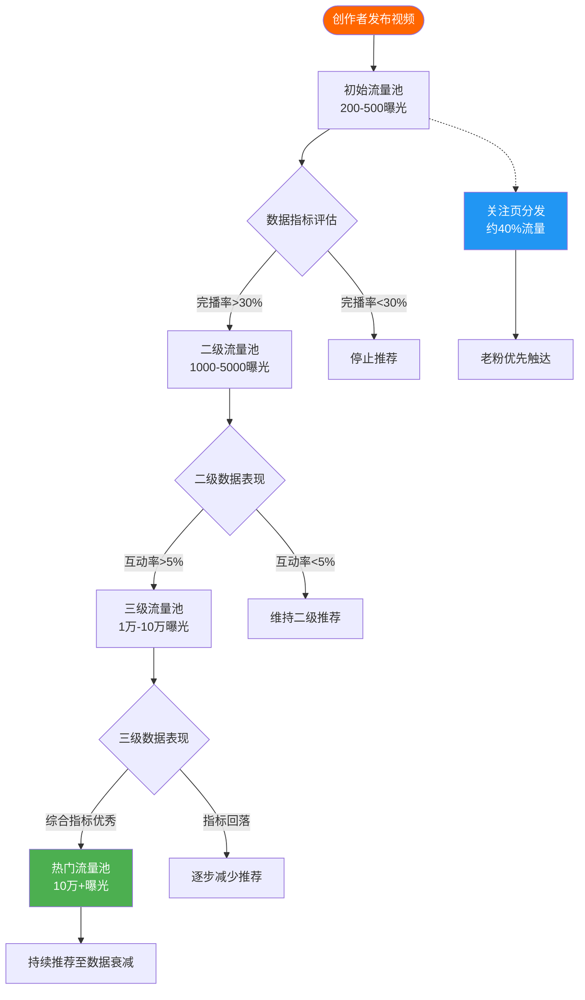
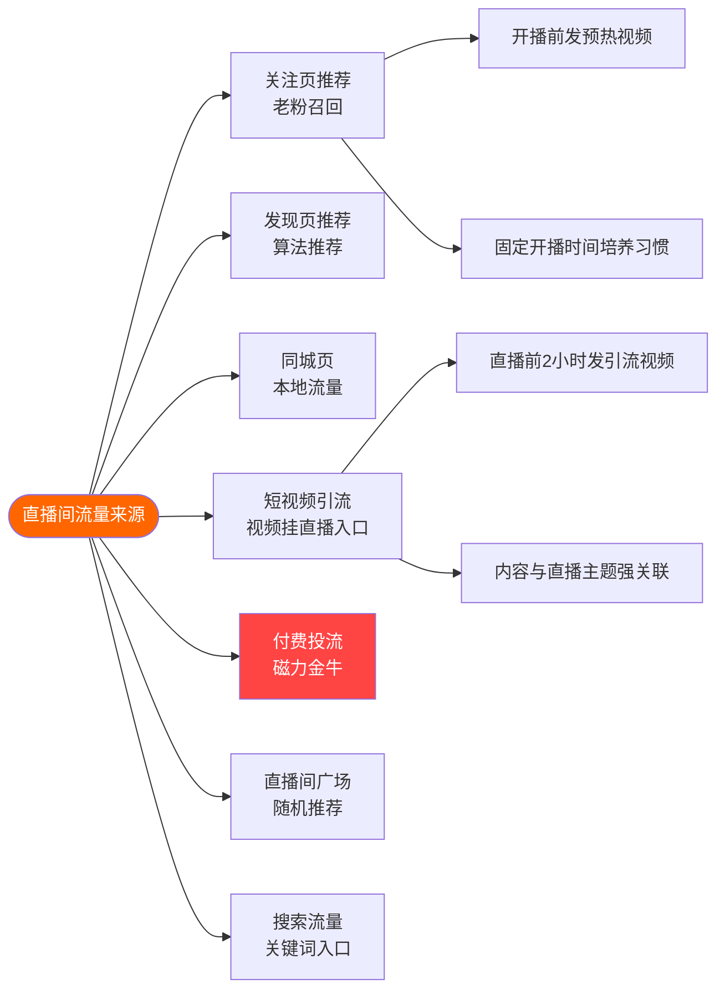
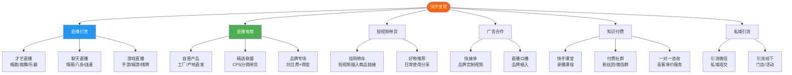

## 二、快手生态运营技巧

### 快手 vs 抖音：平台基因差异

运营快手之前，必须理解它和抖音的本质区别。很多创作者把抖音那套方法直接搬到快手，结果水土不服，根本原因在于两个平台的底层逻辑完全不同。

| 维度 | 快手 | 抖音 |
|------|------|------|
| 流量分发 | 社交+兴趣双引擎，关注页权重高 | 单列沉浸式，算法推荐为主 |
| 内容调性 | 真实、接地气、有烟火气 | 精致、潮流、强视觉冲击 |
| 用户关系 | 强社交关系链，"老铁"文化 | 弱关系，内容驱动关注 |
| 私域流量 | 极强，关注页占比40%+ | 较弱，推荐页主导 |
| 变现路径 | 直播打赏+直播电商为主 | 广告+电商+星图 |
| 下沉市场 | 三四五线城市用户占比高 | 一二线城市用户占比高 |
| 创作者扶持 | 光合计划、快手联盟 | 中视频计划、星图 |

> **核心认知：** 快手是"半熟人社交平台"，抖音是"内容消费平台"。快手的流量分发更偏向"普惠"——给中小创作者更多曝光机会，不会像抖音那样头部效应极其明显。这意味着在快手，中小创作者更容易起步，但天花板相对抖音较低。

### 快手流量分发机制深度解析



**快手核心算法指标权重（从高到低）：**

1. **完播率**（约30%权重）：视频被完整观看的比例，30%以上才算合格
2. **互动率**（约25%权重）：点赞+评论+分享的综合比例，5%以上为优秀
3. **关注转化率**（约20%权重）：看完视频后关注账号的比例
4. **主页访问率**（约15%权重）：点击头像进入主页的比例，说明人设吸引力
5. **负反馈率**（约10%权重）：不感兴趣、举报等负面行为，越低越好

**快手特有的"基尼系数"机制：** 快手有意控制流量分配的均衡度，避免头部创作者垄断流量。这意味着：
- 你的视频不会因为是新号就完全没有推荐
- 大号的视频也不会无限制获得推荐
- 系统会给每条内容一个公平的初始曝光机会
- 内容质量比粉丝基数更重要

### 2.1 快手账号定位与人设打造

#### 平台适配型定位

快手用户偏好"真实感"，过度包装反而会降低信任度。定位时要把握一个原则：**你是用户身边某个领域的"懂行朋友"，不是高高在上的"专家"。**

**快手高转化人设类型：**

| 人设类型 | 适用领域 | 典型表现 | 变现方式 |
|----------|----------|----------|----------|
| 邻家大哥/大姐 | 生活、美食、三农 | 朴实语言，实操展示，不端着 | 直播带货、打赏 |
| 技术老哥 | 汽车、数码、装修 | 手把手教学，硬核拆解 | 课程、带货 |
| 段子手 | 娱乐、情感、搞笑 | 反转剧情，方言梗，接地气 | 广告、直播 |
| 行业老炮 | 商业、职场、教育 | 用案例说话，不讲大道理 | 付费咨询、课程 |
| 逆袭型选手 | 自律、健身、学习 | 记录真实变化过程 | 带货、课程 |

**账号装修实操清单：**

- **头像**：用真人照片（非证件照），面带微笑或在做事的状态照，忌用风景/卡通/Logo
- **昵称**：格式推荐"领域关键词+人设"，如"老张聊装修""小李教做菜"，4-8个字最佳，不要用生僻字
- **简介模板**：一句话说清"我是谁+我能给你什么+怎么找我"。示例："10年装修老师傅，每天分享一个避坑技巧，关注我少花冤枉钱"
- **背景图**：放联系方式或核心价值主张，快手背景图支持自定义，是重要的免费广告位
- **快手号**：设置好记的快手号，方便口头传播，避免用一串无意义数字

#### 快手特色功能利用

- **快手小店**：零粉丝即可开通，保证金1000元起，比抖音门槛低
- **快手直播**：发布10个以上视频+实名认证即可开播
- **快手课堂**：知识付费工具，支持录播课程售卖
- **磁力金牛**：快手官方投放工具，类似抖音的DOU+
- **快接单**：快手官方商业合作平台，粉丝1万+可申请
- **快手联盟**：CPS分佣带货，适合无货源创作者

### 2.2 快手内容创作方法论

#### 快手爆款内容特征

快手的爆款逻辑和抖音有显著差异。抖音追求"3秒抓住眼球"，快手更看重"看完之后觉得值"。

**快手高完播率内容的共性：**

1. **有明确的价值承诺**：标题或开头直接告诉观众"看完你能得到什么"
2. **节奏不拖但也不赶**：快手用户耐心比抖音稍好，60-120秒是黄金时长
3. **有"人味儿"**：不是念稿式的输出，是聊天式的分享
4. **有真实感**：不过度滤镜，不过度包装，甚至可以有口误和小瑕疵
5. **有互动钩子**：在视频中间或结尾抛出问题，引导评论区讨论

**快手内容创作公式：**

```text
好的快手视频 = 真实场景 + 实用价值 + 人格化表达 + 互动引导
```

#### 选题策略

**快手四大选题来源：**

1. **评论区挖掘**：你的评论区是金矿。粉丝问什么就拍什么，这是最精准的需求信号
2. **快手热榜**：每天查看快手热榜，找到与自己领域相关的热点进行关联
3. **同行爆款拆解**：关注10-20个同领域头部账号，分析他们近期的爆款视频结构
4. **用户痛点清单**：列出目标用户最常遇到的10个问题，每个问题出一条视频

**快手 vs 抖音选题差异：**

| 选题方向 | 快手偏好 | 抖音偏好 |
|----------|----------|----------|
| 美食 | 家常菜教程、地方特色菜 | 探店打卡、创意吃法 |
| 知识 | 手把手教学、实操演示 | 知识科普、概念颠覆 |
| 生活 | 农村生活、家庭日常 | 精致生活、旅行Vlog |
| 带货 | 产品实测、工厂溯源 | 开箱种草、场景营销 |
| 情感 | 婆媳关系、家长里短 | 职场情感、独立女性 |

#### 脚本框架（快手适配版）

**黄金结构：价值前置型脚本**

```text
[0-5秒] 直接亮结果/痛点
  → "今天教大家一个方法，我靠这个方法月入过万"
  → "90%的人装修都会犯这个错误"

[5-15秒] 简述背景，建立信任
  → "我做这行8年了，这个方法是我反复验证过的"
  → 先展示成果画面（before/after对比）

[15-50秒] 核心内容，分点讲解
  → 第一点+实操画面
  → 第二点+实操画面
  → 第三点+实操画面
  → 每个点之间用转场或字幕区分

[50-60秒] 总结+互动引导
  → "记住这三个关键点：A、B、C"
  → "你们觉得哪个最有用？评论区告诉我"
  → "关注我，下期教你们更进阶的技巧"
```

#### 拍摄与剪辑要点

**快手拍摄注意事项：**
- 画面不必过度精致，但必须清晰、稳定
- 善用"快手原生感"：可以是手机直接拍，不必全套设备
- 竖屏优先（9:16），快手用户几乎全部是手机端
- 字幕必须加，快手用户很多习惯静音观看
- 片头不超过2秒，快手用户对长片头零容忍

**快手剪辑工具推荐：**
- **剪映**：功能全面，模板丰富，与快手有数据互通
- **快影**：快手官方剪辑工具，发布时有流量加成
- **必剪**：适合二次元和游戏类内容

### 2.3 快手直播运营全攻略

直播是快手最核心的变现场景。快手直播的用户付费意愿比抖音更高，这源于"老铁"文化中的信任关系。

#### 直播间搭建

**基础设备配置：**

| 设备 | 入门方案（500元内） | 专业方案（2000-5000元） |
|------|---------------------|-------------------------|
| 手机/相机 | 手机支架+手机 | 单反/微单+采集卡 |
| 灯光 | 一个环形补光灯 | 主灯+辅灯+背景灯三点布光 |
| 收音 | 手机自带/领夹麦 | 专业声卡+电容麦 |
| 背景 | 干净墙面/布帘 | 定制背景墙+产品展示架 |
| 网络 | 家用WiFi | 有线网络+4G/5G备份 |

#### 直播间流量获取



**快手直播间起号策略（冷启动7天计划）：**

| 天数 | 目标 | 具体动作 |
|------|------|----------|
| 第1-2天 | 测试时段 | 不同时段各开播1小时，记录在线人数曲线 |
| 第3天 | 确定时段 | 选择数据最好的时段，开播2小时 |
| 第4-5天 | 拉停留 | 设计互动环节（抽奖/问答），目标平均停留>2分钟 |
| 第6天 | 拉互动 | 引导评论+点赞，目标互动率>3% |
| 第7天 | 拉转化 | 尝试挂车/引导关注，测试成交转化率 |

#### 直播话术体系

**开播暖场话术（前5分钟）：**
- "来了来了，家人们晚上好，今天给大家准备了好东西"
- "刚进来的家人点个关注，今天直播间有福利"
- 先聊家常、拉近距离，不要上来就卖货

**留人话术（穿插使用）：**
- "刚进来的家人先别走，待会儿有一个炸裂的福利"
- "在线XX人了，满XX人我就开始上福利品"
- "新来的家人扣个1，让我看看今天有多少新朋友"

**产品讲解话术（FABE法则）：**
- **F（特征）**："这个产品用的是XX材质"
- **A（优势）**："比市面上的XX材质耐用3倍"
- **B（利益）**："你买回去至少能用5年，算下来每天才几分钱"
- **E（证据）**："你看我自己用的就是这个，这是购买记录"

**逼单话术：**
- "库存就剩最后XX件了，拍完就没有了"
- "这个价格只有今天直播间有，明天恢复原价"
- "3、2、1，上链接！手慢无！"

**下播话术：**
- "今天就到这里了，明天同一时间我们不见不散"
- "还没关注的家人赶紧关注，不然明天找不到我了"
- "今天的订单明天统一发货，有任何问题私信我"

#### 直播数据分析

每次下播后必须复盘以下数据：

| 指标 | 计算方式 | 合格线 | 优秀线 |
|------|----------|--------|--------|
| 平均在线人数 | 总观看时长÷直播时长 | 50+ | 500+ |
| 人均停留时长 | 总停留时长÷总进入人数 | 1分钟 | 3分钟+ |
| 互动率 | 互动人数÷总观看人数 | 3% | 10%+ |
| 转粉率 | 新增关注÷总观看人数 | 2% | 5%+ |
| GPM（千次观看成交额） | 成交额÷观看人次×1000 | 500元 | 3000元+ |
| 粉丝团转化 | 新增粉丝团÷新增关注 | 10% | 30%+ |

### 2.4 快手变现路径全景



#### 各变现方式对比

| 变现方式 | 门槛 | 收入天花板 | 难度 | 推荐指数 |
|----------|------|-----------|------|----------|
| 直播打赏 | 低（开播即可） | 中（月入数千至数万） | 中 | ★★★★☆ |
| 直播电商 | 中（需开通小店） | 高（月入万至百万） | 高 | ★★★★★ |
| 短视频带货 | 低（挂购物车） | 中（月入数千至数万） | 低 | ★★★★☆ |
| 广告合作 | 高（粉丝1万+） | 中高（单条500-5万） | 中 | ★★★☆☆ |
| 知识付费 | 中（需专业能力） | 高（课程可复购） | 中 | ★★★★★ |
| 私域引流 | 低 | 极高（取决于私域运营） | 高 | ★★★★★ |

#### 快手小店运营要点

**开店流程：**
1. 快手App → 设置 → 快手小店 → 开通小店
2. 选择店铺类型：个人店（零门槛）/ 企业店（需营业执照）
3. 缴纳保证金：最低500元（类目不同金额不同）
4. 上架商品：支持手动上架、第三方平台导入、一键铺货
5. 绑定收款账户

**快手小店 vs 抖音小店差异：**
- 快手对个人商家更友好，零粉丝即可开店
- 快手退货率通常低于抖音（用户决策更慎重）
- 快手的"信任购"体系增强用户信任（假一赔十、极速退款）
- 快手直播带货退货率约20-30%，抖音约30-50%

### 2.5 快手涨粉策略与私域运营

#### 快手涨粉的三条路径

**1. 内容涨粉（最健康、最持久）**
- 保持日更或隔日更，算法喜欢活跃的创作者
- 系列化内容：如"装修避坑100招"，每期一个坑，培养追更习惯
- 爆款复制：一条视频爆了，立刻用相同结构拍类似主题
- 合集功能：将同类视频放入合集，提高用户停留时长

**2. 互动涨粉（建立信任）**
- 每条视频发布后1小时内回复所有评论
- 主动去同领域大号评论区"抢热评"，带自己的主页链接
- 与同级别创作者互推（粉丝量接近的合作效果最好）
- 快手连麦：与同领域创作者连麦PK，互相引流

**3. 投放涨粉（付费加速）**
- 磁力金牛投放：选择"涨粉"目标，定向同领域达人粉丝
- 投放预算建议：新手每天50-100元测试，找到ROI为正的素材后放量
- 粉丝成本参考：0.5-3元/粉（因领域不同差异较大）

#### 快手私域运营核心

快手的私域流量是它相比抖音最大的优势。关注页流量占比高达40%+，意味着你有将近一半的流量来自粉丝主动访问。

**私域运营四步法：**

1. **粉丝团建设**：引导粉丝加入粉丝团（付费1快币/月），粉丝团成员有专属标识，直播时优先触达
2. **粉丝群维护**：建立快手粉丝群，定期发布福利、预告、独家内容
3. **评论区互动**：把评论区当"第二直播间"经营，回复每一条评论，置顶有价值的讨论
4. **私信触达**：通过私信发送新品预告、优惠信息（注意不要过度骚扰）

**快手"老铁经济"本质：** 快手用户购买决策的核心不是"产品好不好"，而是"我信不信这个人"。所以快手运营的第一优先级永远是维护信任关系，而不是追求短期GMV。

### 2.6 快手运营数据复盘体系

#### 日常监控指标

每天记录以下数据，形成趋势图表：

| 指标 | 监控频率 | 健康趋势 | 异常信号 |
|------|----------|----------|----------|
| 发布视频数 | 每日 | 稳定日更 | 连续3天未更新 |
| 视频播放量 | 每日 | 逐步上升或稳定 | 连续下降>30% |
| 粉丝增量 | 每日 | 日增>50 | 连续负增长 |
| 直播间在线峰值 | 每场 | 稳步上升 | 峰值腰斩 |
| 互动率 | 每日 | >5% | <2% |
| 商品点击率 | 每场 | >3% | <1% |
| 转化率 | 每场 | >2% | <0.5% |

#### 周度复盘模板

每周日花1-2小时做以下复盘：

1. **内容复盘**：本周播放量TOP3和BOTTOM3的视频，分析差异原因
2. **直播复盘**：本周直播数据汇总，对比上周同期
3. **竞品分析**：同行本周有哪些爆款，能否借鉴
4. **下周计划**：确定下周选题方向和直播排期

### 2.7 快手运营常见误区与避坑指南

| 常见误区 | 后果 | 正确做法 |
|----------|------|----------|
| 照搬抖音内容到快手 | 水土不服，数据惨淡 | 根据快手用户偏好调整内容风格 |
| 过度包装、精致滤镜 | 快手用户觉得"假"，不信任 | 保持真实感，适度美化即可 |
| 只发视频不开直播 | 浪费快手最强的变现场景 | 粉丝过500就尝试开播 |
| 频繁更换内容方向 | 粉丝画像混乱，算法无法推荐 | 聚焦一个领域至少3个月 |
| 只关注涨粉不关注互动 | 粉丝量虚高但变现能力差 | 优先做高互动率的内容 |
| 直播间只卖货不聊天 | 用户停留时间短，转化率低 | 80%聊天互动+20%卖货 |
| 不做数据分析 | 无法优化，原地踏步 | 每日记录数据，每周复盘 |
| 违规操作（刷量/买粉） | 限流甚至封号 | 踏实做内容，用投流加速 |
| 忽视评论区运营 | 浪费免费的互动流量 | 每条评论都回复，引导讨论 |
| 开播时间不固定 | 粉丝找不到你，关注页流量下降 | 固定时间开播，培养用户习惯 |

### 2.8 快手运营进阶策略

#### 矩阵账号布局

当主账号运营成熟（粉丝10万+）后，可以搭建矩阵扩大覆盖：

**快手矩阵搭建方式：**
- **品类矩阵**：主账号做综合号，矩阵做细分品类号（如美食主号+烘焙号+减脂餐号）
- **人设矩阵**：同一IP不同角色（如老板号+师傅号+学徒号）
- **地域矩阵**：同一模式在不同城市复制，做本地化内容

**矩阵注意事项：**
- 各账号用不同手机、不同网络环境运营，避免被判定为关联账号
- 内容必须差异化，不能简单搬运
- 矩阵账号之间可以互相引流，但不要太明显

#### 快手SEO优化

快手的搜索流量正在快速增长，做好搜索优化能获得稳定的长尾流量：

- **标题优化**：标题中包含用户会搜索的关键词，如"装修""教程""怎么做"
- **话题标签**：每条视频添加3-5个相关话题标签
- **评论区关键词**：在评论区引导用户讨论包含关键词的内容
- **合集标题**：合集名称包含核心关键词

#### 快手商业化进阶

**磁力金牛投放进阶策略：**
- 冷启动期：用"涨粉"目标，每天50-100元，找到高互动素材
- 成长期：用"直播间引流"目标，每天200-500元，配合直播节奏投放
- 成熟期：用"ROI"目标，设置目标ROI值，系统自动优化投放

**投放素材制作要点：**
- 前3秒必须有强钩子（与自然流量视频一样重要）
- 素材时长控制在15-30秒
- 每周至少更新3-5条新素材，避免素材衰退
- A/B测试不同开头、不同BGM、不同卖点的素材

***

> **快手运营心法总结：** 快手的核心是"信任"二字。不要追求一夜爆红，而是持续输出有价值的内容，与粉丝建立真实的连接。在快手，"慢就是快"——前期可能涨粉慢，但粉丝质量高、粘性强、变现能力远超抖音的泛流量。坚持3-6个月，你会看到明显回报。
