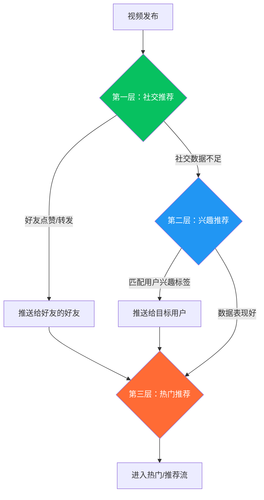
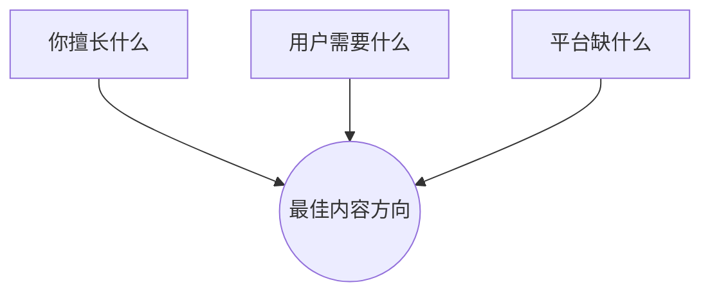
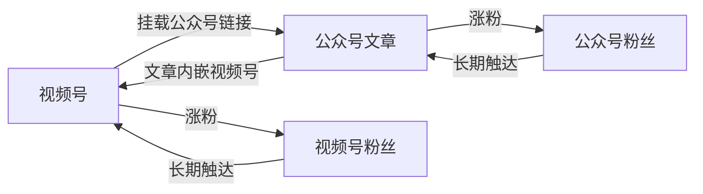
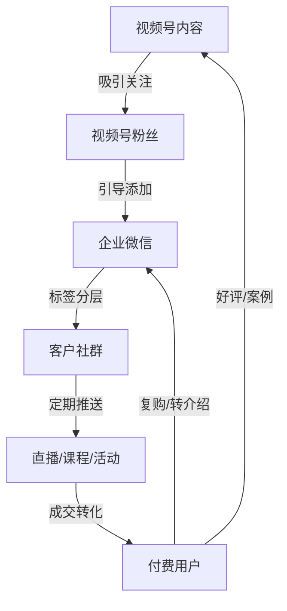
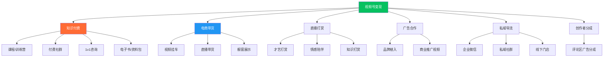
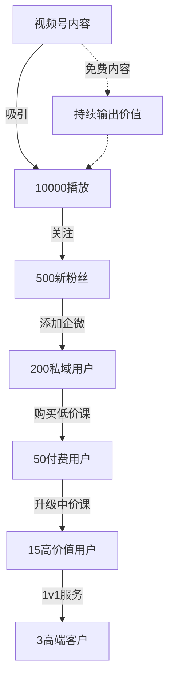

## 三、视频号运营技巧

### 3.1 视频号平台概述与独特定位

#### 3.1.1 视频号是什么

视频号是微信于2020年推出的短视频与直播平台，嵌入在微信"发现"页面中，与朋友圈、小程序、公众号并列为微信四大内容入口。截至2025年，视频号日活跃用户突破5亿，月活跃创作者超过3000万，已成为中国第三大短视频平台。

与抖音、快手相比，视频号的核心差异在于**它是微信生态的一部分，而非独立App**。这意味着：

- **流量来源不同**：抖音靠算法推荐，快手靠双列点选+社交，视频号以社交推荐为主、算法推荐为辅
- **用户关系不同**：抖音是"内容找人"，视频号是"人找内容+内容找人"，社交信任链是核心分发引擎
- **变现路径不同**：视频号天然连接微信支付、小程序、企业微信、公众号，形成完整的私域闭环

#### 3.1.2 视频号的算法推荐机制

视频号的推荐系统由三层流量池构成：



**社交推荐（权重最高，约占60%-70%）：**

这是视频号区别于所有其他平台的核心机制。当你发布一条视频，系统首先推送给你的微信好友和关注者。如果他们点赞、评论或转发，这条视频会被推送给他们的好友——这就是"朋友的朋友"裂变逻辑。一条视频获得10个好友点赞，可能触达这10个好友的全部微信好友（假设每人500好友，理论触达5000人）。

**兴趣推荐（约占20%-30%）：**

当视频的社交数据表现良好（完播率>30%、点赞率>3%、评论率>1%），系统会将其推送给兴趣标签匹配的用户，类似抖音的算法推荐逻辑。

**热门推荐（约占10%）：**

数据持续爆发的内容进入热门池，获得全平台级别的曝光。这是少数爆款视频的专属通道。

**关键指标权重排序：**

| 指标 | 权重 | 说明 |
|------|------|------|
| 社交推荐点击率 | ★★★★★ | 好友点赞后其他用户的点击率 |
| 完播率 | ★★★★☆ | 视频被完整观看的比例 |
| 互动率 | ★★★★☆ | 点赞+评论+转发的综合比率 |
| 转发率 | ★★★★☆ | 转发到朋友圈或好友的比率 |
| 关注转化率 | ★★★☆☆ | 观看后关注账号的比率 |
| 负反馈率 | ★★☆☆☆ | 不感兴趣/举报的比率（负向指标） |

> **核心理解：** 在视频号上，"让已有用户帮你传播"比"讨好算法"更重要。内容要能激发用户的社交分享欲望——"这条视频我愿意让朋友圈的人看到"。

#### 3.1.3 视频号的用户画像

| 维度 | 特征 | 运营启示 |
|------|------|----------|
| 年龄 | 30-60岁为主力，40岁以上占比超45% | 内容风格偏成熟稳重，避免过度年轻化表达 |
| 地域 | 一二线城市占比55%，三四线及以下45% | 消费力中上，高客单价产品接受度高 |
| 性别 | 女性占比58%，男性42% | 美妆、家居、教育类内容天然有受众 |
| 使用场景 | 朋友圈→视频号→公众号→小程序，闭环使用 | 内容要适合在社交场景中被"推荐" |
| 消费习惯 | 决策周期长、信任驱动、复购率高 | 适合知识付费、品质电商、高客单价服务 |
| 社交特征 | 强关系链，熟人社交为主 | 内容要让用户"愿意分享给认识的人" |

### 3.2 账号搭建与定位策略

#### 3.2.1 账号类型选择

视频号支持三种账号类型，各有优劣：

| 类型 | 适用对象 | 优势 | 劣势 |
|------|----------|------|------|
| 个人号 | 个人创作者、自由职业者 | 注册简单，灵活度高 | 无法认证蓝V，商业功能受限 |
| 企业号 | 企业、品牌、商家 | 蓝V认证，可挂载小程序、开通商品橱窗 | 需营业执照，内容审核更严格 |
| 达人号 | 有一定粉丝基础的创作者 | 可开通创作者分成、商品推广 | 需满足粉丝数和内容质量要求 |

**建议路径：** 个人创作者先用个人号起步验证内容方向，粉丝破1000后申请达人号；有商业变现需求的直接注册企业号。

#### 3.2.2 账号定位四步法

**第一步：选赛道**

视频号上变现效率最高的赛道排名：

1. **知识付费**（客单价高、复购率高、边际成本低）——适合有专业背景的人
2. **本地生活**（餐饮、美容、健身等）——适合实体商家
3. **品质电商**（母婴、家居、食品等）——适合有供应链资源的人
4. **情感/生活**（流量大但变现路径长）——适合有表达天赋的人
5. **才艺/娱乐**（流量大但变现效率低）——适合有专业才艺的人

**第二步：定人设**

人设 = 身份标签 + 价值主张 + 差异化特征

示例：
- ❌ "美食博主"（太泛，没有辨识度）
- ✅ "教上班族用30分钟做一周便当的料理规划师"（具体身份+明确价值+精准人群）

**第三步：设计账号主页**

```text
头像：真人照片 > 品牌Logo（视频号是强社交平台，真人头像信任感更强）
昵称：品牌名/人名 + 关键词（如"老张说运营""小美的厨房"）
简介：一句话说清三件事——
  ① 你是谁（身份）
  ② 你能提供什么价值（利益点）
  ③ 为什么要关注你（行动指令）
背景图：展示专业资质/核心成果/引导关注
```

**第四步：确定内容方向**

用"三圈定位法"找到最佳内容方向：



- **你擅长的**：专业技能、生活经验、兴趣爱好
- **用户需要的**：痛点问题、知识需求、情感需求
- **平台缺的**：在视频号搜索你的赛道关键词，看现有内容的质量和数量，找到差异化空间

### 3.3 内容创作策略

#### 3.3.1 适配视频号的内容类型

视频号用户群体偏成熟，内容需要有"信息增量"或"情感增量"，纯娱乐内容的传播效率低于抖音。以下是视频号上表现最好的五种内容类型：

**① 知识干货型**

将专业知识拆解为3-5个要点，用口语化方式讲解。示例：
- "3个Excel函数帮你每天省2小时"（职场技能）
- "买房前必须知道的5个坑"（生活知识）
- "孩子写作业磨蹭的3个根本原因"（教育知识）

**② 观点输出型**

对热点事件或行业现象表达独到见解。示例：
- "为什么我不建议年轻人第一份工作去大厂"
- "实体店做直播的3个致命错误"

**③ 故事共鸣型**

讲述真实经历或案例故事，引发情感共鸣。示例：
- "我在县城开奶茶店的第一年"
- "35岁被裁员后，我靠副业月入3万"

**④ 实操教程型**

手把手教学，步骤清晰可执行。示例：
- "手把手教你用Canva做专业海报"
- "家庭收纳的5个神器和3个技巧"

**⑤ 对比评测型**

真实对比不同产品/方案/方法，提供决策参考。示例：
- "5款百元面霜真实使用30天对比"
- "装修选瓷砖还是木地板？住了3年告诉你答案"

#### 3.3.2 视频号脚本创作框架

视频号的内容时长建议控制在**1-3分钟**（太短无法承载深度内容，太长完播率下降）：


**前5秒——社交钩子（决定是否被分享）：**

视频号的钩子不只是"吸引注意力"，更要是"让人想转发给朋友"：

| 钩子类型 | 示例 | 适用场景 |
|----------|------|----------|
| 利益型 | "这个方法每年能帮你省2万块" | 实用知识、省钱技巧 |
| 身份型 | "做父母的一定要看这条" | 教育、家庭、健康 |
| 预警型 | "90%的人都不知道这个真相" | 知识科普、避坑指南 |
| 共鸣型 | "30岁以后才明白的3件事" | 人生感悟、情感 |
| 反常识型 | "早起其实不是好习惯？" | 知识颠覆、观点输出 |

**中间部分——核心价值（决定完播率和互动）：**

- 分点阐述，每点有具体案例或数据
- 语言口语化，像跟朋友聊天而非念稿
- 每30秒设置一个"信息钩子"防止跳出
- 适当加入"你们觉得呢""评论区告诉我"等互动引导

**结尾——行动引导（决定涨粉和转化）：**

```text
"觉得有用就转发给需要的朋友"（引导转发——视频号的核心增长引擎）
"关注我，每天分享一个实用技巧"（引导关注）
"评论区说说你的经历"（引导评论——提升互动数据）
"点击下方链接/橱窗了解更多"（引导转化——适合带货场景）
```

#### 3.3.3 封面与标题设计

视频号采用单列信息流+双列推荐的混合展示方式，封面和标题的重要性远高于抖音：

**封面设计原则：**
- 竖版9:16比例，关键信息放在画面中央偏上（避免被底部UI遮挡）
- 使用大号加粗字体（24px以上），确保缩略图可读
- 配色对比强烈（深底白字或白底深字）
- 加入人脸/表情（提升点击率20%-30%）
- 保持风格统一，形成视觉品牌记忆

**标题撰写技巧：**
- 控制在15-25字，太长会被截断
- 包含关键词（利于搜索推荐）
- 制造信息差或好奇心
- 示例：
  - ❌ "分享一个好方法"（无信息量）
  - ✅ "用这个方法存钱，一年攒了8万"（具体数字+结果+好奇心）

### 3.4 微信生态联动策略

视频号最大的竞争优势是**微信生态的全域联动能力**。这是抖音和快手完全不具备的能力，也是视频号运营者必须掌握的核心技能。

#### 3.4.1 视频号 × 公众号



**联动方式：**

1. **视频号挂载公众号文章链接**：在视频下方添加公众号文章链接，将视频号流量导入公众号。适合知识付费、深度内容场景——视频做"钩子"，文章做"转化"。

2. **公众号文章嵌入视频号内容**：在公众号文章中嵌入视频号视频卡片，利用公众号的长文流量为视频号导流。

3. **公众号菜单栏关联视频号**：在公众号自定义菜单中添加视频号入口。

4. **视频号直播时公众号推送**：开启直播时，公众号会自动推送直播提醒给关注用户。

**实操技巧：**
- 视频号简介中放公众号名称（引导搜索关注）
- 视频结尾口播"详细内容我写在了公众号文章里"
- 公众号推文中插入视频号视频作为"视频版摘要"

#### 3.4.2 视频号 × 企业微信

企业微信是视频号私域运营的核心工具：

| 联动方式 | 具体操作 | 适用场景 |
|----------|----------|----------|
| 视频号主页挂企微 | 在视频号主页添加"添加企业微信"按钮 | 引导精准用户进入私域 |
| 直播间挂企微二维码 | 直播过程中展示企微二维码 | 直播间引流到私域 |
| 企微朋友圈发视频号 | 在企微朋友圈分享视频号内容 | 利用私域流量为视频号加热 |
| 企微社群分发 | 在客户群中分享视频号内容 | 精准触达目标用户 |
| 企微自动化欢迎语 | 添加企微后自动推送视频号/直播间链接 | 自动化私域运营 |

**私域运营闭环：**



#### 3.4.3 视频号 × 朋友圈

朋友圈是视频号的天然分发渠道：

- **视频号内容可直接转发到朋友圈**，展示为带封面的卡片样式，点击率远高于纯文字朋友圈
- **视频号直播可分享到朋友圈**，好友看到"XX正在直播"的提示
- **朋友圈发视频号内容时，添加引导语**比直接转发效果好3倍

示例引导语：
```text
"刚录了一条视频，讲了我做副业踩过的3个坑，
 第2个坑花了我2万块学费，希望对你们有帮助 👇"
```

#### 3.4.4 视频号 × 小程序

小程序是视频号电商变现的核心基础设施：

1. **视频号挂载小程序商品链接**：用户在视频下方直接点击购买，无需跳出微信
2. **直播间挂载小程序**：直播过程中展示小程序商品，用户直接下单
3. **小程序内嵌视频号**：在品牌小程序中展示视频号内容，增加信任感

**小程序选型建议：**

| 小程序类型 | 适用场景 | 代表工具 |
|------------|----------|----------|
| 微信小店 | 电商带货 | 微信官方小店 |
| 有赞微商城 | 中大型商家 | 有赞 |
| 微店 | 个人卖家 | 微店 |
| 自建小程序 | 定制化需求 | 微信开发者工具 |

#### 3.4.5 视频号 × 搜一搜

微信搜一搜月活超8亿，是视频号的重要流量入口：

- **视频号内容会被搜一搜收录**，用户搜索相关关键词时可能看到你的视频
- **优化视频标题和描述中的关键词**，提升搜索排名
- **创建视频号话题标签**（如#职场干货 #育儿知识），增加被搜索到的概率

**搜一搜优化清单：**
```text
✅ 视频标题包含核心关键词（前15字内出现）
✅ 视频描述包含2-3个相关长尾关键词
✅ 使用热门话题标签（视频号#话题功能）
✅ 保持内容垂直度（算法更信任垂直账号）
✅ 互动数据好的内容搜索排名更高
```

### 3.5 流量获取策略

#### 3.5.1 私域冷启动（0-1000粉丝）

视频号冷启动的最大优势是**你不需要从零开始——你已经有了微信好友**。

**冷启动七步法：**

1. **朋友圈预告**：发布前1天在朋友圈预告"明天发布第一条视频"，制造期待
2. **首条视频选择**：第一条视频选你最有信心的内容，不一定是"最好的"，但要是"最适合社交传播的"
3. **精准私发**：将视频私发给20-30个可能感兴趣的好友，附上个性化推荐语（不要群发模板消息）
4. **朋友圈分享**：发布后立即分享到朋友圈，配上引导语
5. **微信群分享**：在相关的微信群中分享（注意不要硬广，先提供价值）
6. **互赞社群**：加入视频号创作者互赞社群，初期互相支持（但不要长期依赖）
7. **持续更新**：前30天保持日更或隔日更，让算法建立对你账号的认知

**预期数据：**
- 第1周：50-200播放，10-30点赞（主要来自好友）
- 第2周：100-500播放，20-80点赞（开始有好友的好友）
- 第3周：200-1000播放，30-150点赞（社交裂变开始显现）
- 第4周：500-3000播放，50-300点赞（如果内容质量好，进入兴趣推荐池）

#### 3.5.2 内容增长策略（1000-10000粉丝）

突破1000粉丝后，增长策略从"私域推动"转向"内容驱动+私域加速"：

**系列化内容策略：**

系列内容是视频号增长的核心武器——用户看了一集会追更后续内容，关注率远高于单条内容。

```text
系列内容设计模板：
- 系列名称：如"30天学会PPT"
- 更新频率：每天/每周固定时间
- 内容规划：10-30集，每集独立可看但有连续性
- 引导方式：每集结尾预告下一集内容
- 合集功能：利用视频号的合集功能归档
```

**话题蹭热策略：**

视频号的热点传播比抖音慢但持久性更强——一个热点话题在视频号上的生命周期约3-7天（抖音只有1-2天），有更充裕的时间创作内容。

蹭热原则：
- 只蹭与自身领域相关的热点
- 热点作为引子，核心内容仍然是你的专业价值
- 在热点爆发后12-48小时内发布（太快内容粗糙，太晚热度已过）
- 标题中包含热点关键词，描述中关联自身领域

#### 3.5.3 付费推广策略

视频号的付费推广工具包括：

**① 视频号加热（类似抖音DOU+）**

| 设置项 | 建议 | 说明 |
|--------|------|------|
| 推广目标 | 涨粉/播放量/互动量 | 新号优先选涨粉，成熟号选播放量 |
| 投放金额 | 首次100-300元测试 | 先小额测试ROI，数据好再加量 |
| 定向设置 | 兴趣+地域+年龄 | 精准定向比泛投效果好3-5倍 |
| 投放时间 | 内容发布后2-6小时内 | 趁内容还有自然流量时加热，形成叠加效应 |
| 投放门槛 | 单条视频100元起 | 选择自然数据表现好的视频投放（完播率>25%、点赞率>2%） |

**② 微信豆（视频号直播推广）**

微信豆是视频号直播间的付费推广工具，1元=10微信豆。用于直播间加热，提升在线人数和互动。

**投放原则：**
- 只投放自然数据表现好的内容（完播率>25%、点赞率>2%、评论率>0.5%）
- 首次投放100-300元测试，计算单粉成本和ROI
- 单粉获取成本控制在0.5-2元（超过2元需要优化内容或定向）
- 投放时间选择内容发布后2-6小时（自然流量+付费流量叠加）

### 3.6 视频号直播运营

#### 3.6.1 直播前准备

**设备清单：**

| 设备 | 推荐 | 预算 | 说明 |
|------|------|------|------|
| 手机 | iPhone 14以上/华为Mate50以上 | - | 主力设备，确保画质 |
| 补光灯 | 18寸环形灯+侧面补光 | 200-500元 | 三点打光法：主光+辅光+轮廓光 |
| 麦克风 | 领夹式无线麦克风 | 100-300元 | 确保声音清晰，减少环境噪音 |
| 手机支架 | 可调节高度的桌面/落地支架 | 50-150元 | 保持画面稳定 |
| 背景 | 整洁有序的背景/绿幕 | 0-200元 | 避免杂乱背景分散注意力 |

**直播预告：**

视频号直播的预约功能是核心增长工具：
- 提前1-3天发布直播预告视频
- 在视频中引导用户点击"预约直播"
- 预约用户会在开播时收到微信服务通知提醒
- 开播前1小时再次发朋友圈提醒

**直播脚本框架：**

```text
开场（前5分钟）：
  - 热情问候，感谢预约用户
  - 今天直播主题和内容预告
  - 设置互动任务（如"点赞到1万抽奖"）

中间（核心内容）：
  - 每15-20分钟一个内容模块
  - 每个模块设置互动环节（提问、投票、连麦）
  - 穿插福利活动（红包、抽奖、限时优惠）
  - 每30分钟提醒新进观众关注和预约下一场

结尾（最后10分钟）：
  - 总结今天的核心要点
  - 预告下一场直播时间和内容
  - 引导关注、加企微、进粉丝群
  - 感谢陪伴，温暖告别
```

#### 3.6.2 直播间互动技巧

视频号直播间的核心数据指标是**互动率**（评论+点赞+分享/观看人数），互动率高的直播间会获得更多公域流量推荐。

**互动提升方法：**

| 方法 | 具体操作 | 效果 |
|------|----------|------|
| 点赞任务 | "点赞到1万，我公布一个秘密" | 提升直播间热度 |
| 评论引导 | "打1代表同意，打2代表不同意" | 降低评论门槛，提升互动率 |
| 红包雨 | 每20分钟发一轮红包 | 留存+拉新用户 |
| 连麦互动 | 邀请粉丝连麦提问/分享 | 增强参与感和信任感 |
| 抽奖 | 关注+评论参与抽奖 | 涨粉+互动双重效果 |
| 转发引导 | "转发直播间给3个朋友，截图领福利" | 利用社交裂变扩大曝光 |

#### 3.6.3 直播带货技巧

视频号直播带货与抖音的核心差异：

| 维度 | 抖音直播 | 视频号直播 |
|------|----------|----------|
| 用户心态 | 冲动消费、价格敏感 | 信任消费、品质优先 |
| 选品策略 | 低价引流+高转化 | 中高品质+高复购 |
| 话术风格 | 快节奏、强逼单 | 慢节奏、重讲解 |
| 客单价 | 50-200元为主 | 100-500元均可 |
| 转化逻辑 | "限时限量"制造紧迫感 | "专业推荐"建立信任感 |
| 售后要求 | 标准化 | 高要求（私域用户会直接找你） |

**视频号带货选品原则：**
- 复购率高的日用消耗品（食品、护肤、家居清洁）
- 有故事/有温度的产品（手工、非遗、地方特产）
- 知识类产品（课程、书籍、训练营）——视频号知识付费转化率是抖音的2-3倍
- 避免低价劣质品（视频号用户对品质要求高，一次差评可能损失整个社交圈的信任）

### 3.7 变现路径详解

#### 3.7.1 视频号六大变现模式



#### 3.7.2 知识付费变现详解

视频号是知识付费的最佳平台，原因有三：
1. 用户群体成熟，有学习意愿和付费能力
2. 微信支付打通，付款路径最短（无需跳出微信）
3. 私域信任链加持，转化率远高于公域平台

**知识付费产品设计：**

| 产品层级 | 定价 | 内容深度 | 目的 |
|----------|------|----------|------|
| 引流层（免费） | 0元 | 入门知识、行业认知 | 获取用户，建立信任 |
| 低价层 | 9.9-99元 | 具体技能、实操教程 | 筛选付费用户 |
| 中价层 | 199-999元 | 系统课程、训练营 | 核心变现产品 |
| 高价层 | 1000-10000元 | 1v1咨询、私董会 | 高利润产品 |

**知识付费转化漏斗：**



#### 3.7.3 创作者分成计划

视频号的创作者分成计划允许创作者在评论区展示广告并获得分成：

- **开通条件**：有效关注数≥100，符合平台内容规范
- **收益计算**：根据广告曝光量和点击量计算，CPM约5-15元
- **提升收益的方法**：
  - 提高视频播放量（内容质量是根本）
  - 引导用户看评论区（"评论区有惊喜"）
  - 选择评论区互动量大的内容类型

> **注意：** 创作者分成是"被动收入"，适合作为内容创作的额外回报，不应作为主要变现方式。以10万播放量计算，月收入约500-1500元。

### 3.8 数据分析与优化

#### 3.8.1 核心数据指标

| 指标 | 计算方式 | 健康值 | 优化方向 |
|------|----------|--------|----------|
| 完播率 | 完整播放数÷播放数 | >30% | 优化开头钩子、控制时长、提升内容密度 |
| 点赞率 | 点赞数÷播放数 | >3% | 增加情感共鸣点、提供实用价值 |
| 评论率 | 评论数÷播放数 | >1% | 设置互动话题、提出争议性观点 |
| 转发率 | 转发数÷播放数 | >1% | 增加"社交货币"属性（有用/有趣/有面子） |
| 关注率 | 新增关注÷播放数 | >2% | 强化账号定位、设置关注理由 |
| UV价值 | GMV÷UV数 | 因品类而异 | 优化选品、提升客单价 |

#### 3.8.2 数据分析工具

| 工具 | 功能 | 费用 |
|------|------|------|
| 视频号助手（官方） | 基础数据查看：播放、点赞、评论、转发 | 免费 |
| 微信创作者中心 | 粉丝画像、内容分析、收益数据 | 免费 |
| 新视（新榜旗下） | 视频号数据监测、竞品分析、热门内容追踪 | 付费（基础版免费） |
| 蝉妈妈 | 视频号电商数据分析、直播数据分析 | 付费 |

#### 3.8.3 数据复盘模板

每条视频发布后24小时，用以下模板进行复盘：

```text
【视频号内容复盘表】

发布日期：____
内容主题：____
视频时长：____

核心数据：
- 播放量：____
- 点赞数：____（点赞率：____%）
- 评论数：____（评论率：____%）
- 转发数：____（转发率：____%）
- 新增关注：____（关注率：____%）

流量来源分析：
- 社交推荐占比：____%
- 兴趣推荐占比：____%
- 搜索占比：____%
- 其他占比：____%

表现分析：
- 表现最好的部分：____
- 表现最差的部分：____
- 与上一条视频对比：____

改进计划：
- 下一条视频调整方向：____
- 需要测试的新元素：____
```

### 3.9 常见误区与避坑指南

#### 误区一：照搬抖音内容到视频号

**错误表现：** 将抖音上火的视频直接搬运到视频号。

**为什么行不通：**
- 抖音用户偏年轻（18-30岁），视频号用户偏成熟（30-60岁）
- 抖音内容追求"快、短、刺激"，视频号用户更接受"有深度、有温度"的内容
- 视频号的社交推荐机制决定了"适合转发给朋友看"的内容才能获得裂变

**正确做法：** 同一主题可以做，但要根据视频号用户特点调整表达方式——语速放慢、内容加深、增加社交分享点。

#### 误区二：忽视私域导流

**错误表现：** 只关注视频号的公域流量，不引导用户进入私域。

**为什么这是致命错误：**
- 视频号的公域流量不稳定，算法调整可能影响曝光
- 没有私域的创作者永远在"从零开始"获取用户
- 私域用户的转化率是公域的5-10倍

**正确做法：** 每条视频/每场直播都要有明确的私域引导动作——添加企业微信、进入粉丝群、关注公众号。

#### 误区三：过度追求播放量

**错误表现：** 为了追求高播放量，发布与自身定位无关的热点内容。

**为什么行不通：**
- 泛流量无法变现，1万泛粉不如1000精准粉
- 频繁偏离定位会让算法对你账号的兴趣标签产生混乱
- 吸引来的用户不是目标客户，反而拉低互动率

**正确做法：** 追求"精准播放量"——1000个目标用户的播放比10000个无关用户的播放更有价值。

#### 误区四：不做数据分析

**错误表现：** 发完视频就不管了，不看数据，不复盘。

**为什么重要：**
- 数据是唯一客观的内容反馈——你的感觉可能是错的
- 不看数据就无法知道"什么有效、什么无效"
- 连续发布100条不看数据的视频，不如发布10条看数据复盘的视频

**正确做法：** 每条视频发布24小时后做数据复盘，每周做一次数据周报，每月做一次内容策略调整。

#### 误区五：忽视视频号的社交属性

**错误表现：** 像运营抖音一样运营视频号，只关注内容质量，不关注社交传播。

**为什么行不通：**
- 视频号60%-70%的流量来自社交推荐
- 不激发用户社交分享的内容，在视频号上很难获得大曝光
- 一条被100人转发的视频，比一条被1000人点赞的视频获得更多推荐

**正确做法：** 每条视频都要思考"用户为什么会把这条视频转发给朋友/朋友圈"——因为它有用（转发给需要的人）、有趣（转发给一起笑的人）、有面子（转发展示自己的品味）。

### 3.10 进阶策略

#### 3.10.1 视频号矩阵运营

当主账号运营成熟后，可以搭建视频号矩阵：

**矩阵搭建方式：**
- **内容细分矩阵**：主账号做"职场干货"，矩阵做"面试技巧""PPT教程""职场人际关系"
- **人设矩阵**：同一品牌不同人设，如"老板视角+员工视角+HR视角"
- **地域矩阵**：同一内容模式在不同城市复制（适合本地生活类）

**矩阵运营要点：**
- 各账号内容必须差异化，不能简单复制
- 账号之间可以互相引流，但要自然不刻意
- 每个账号有独立的内容日历和运营策略
- 团队化管理，每人负责1-2个账号

#### 3.10.2 视频号SEO优化

微信搜一搜已成为重要的流量入口，视频号SEO优化包括：

1. **关键词研究**：用微信指数查看关键词热度，选择搜索量大但竞争度适中的关键词
2. **标题优化**：核心关键词出现在标题前15个字内
3. **描述优化**：在视频描述中自然嵌入2-3个相关关键词
4. **话题标签**：使用相关话题标签，增加搜索曝光
5. **内容垂直度**：持续输出垂直领域内容，提升账号在该领域的搜索权重

#### 3.10.3 视频号与线下场景结合

视频号的独特优势是**线上线下无缝连接**，特别适合实体商家：

**线下引流到线上的方法：**
- 门店张贴视频号二维码，扫码关注领取优惠
- 收银台放置"关注视频号享专属折扣"的立牌
- 服务人员引导客户关注视频号获取售后教程
- 包装袋/小票印上视频号二维码

**线上引流到线下的方法：**
- 视频号发布门店探店视频，挂载门店定位
- 直播间发放到店优惠券
- 视频号主页展示门店地址和营业信息
- 通过企业微信预约到店服务

#### 3.10.4 视频号长期运营节奏

| 时间维度 | 内容策略 | 流量策略 | 变现策略 |
|----------|----------|----------|----------|
| 第1-3个月 | 每天发布1条，测试内容方向 | 私域冷启动+互赞社群 | 不急变现，积累粉丝和信任 |
| 第4-6个月 | 保持日更，形成系列内容 | 社交裂变+小额付费推广 | 开通创作者分成+低价知识产品 |
| 第7-12个月 | 质量优先，日更或隔日更 | 自然流量为主+精准投放 | 中高价产品+直播带货+广告合作 |
| 1年以上 | 矩阵化运营+内容IP化 | 私域+公域双轮驱动 | 多元变现+团队化运营 |

> **核心心法：** 视频号是"慢生意"——前三个月可能看不到明显收益，但只要持续输出有价值的内容、不断将用户导入私域，6个月后的变现效率会远超抖音。因为视频号的每一分流量都沉淀在你的微信生态中，而不是平台的流量池里。

### 3.11 本节小结

视频号运营的核心逻辑可以总结为一句话：**用内容建立信任，用社交放大传播，用私域沉淀价值，用生态闭环变现**。

与抖音的"算法驱动"和快手的"社交+算法"不同，视频号是"微信生态驱动"——你的每一次内容发布都不只是在运营一个短视频账号，而是在经营一个以微信为基础设施的个人商业生态。

**关键行动清单：**

- [ ] 完成账号定位和主页设计
- [ ] 制定30天内容日历
- [ ] 完成微信生态联动配置（公众号、企业微信、小程序）
- [ ] 发布前10条视频并进行数据复盘
- [ ] 建立第一个私域社群（50人以上）
- [ ] 开通创作者分成计划
- [ ] 设计并上线第一个知识付费产品
- [ ] 完成第一场直播

