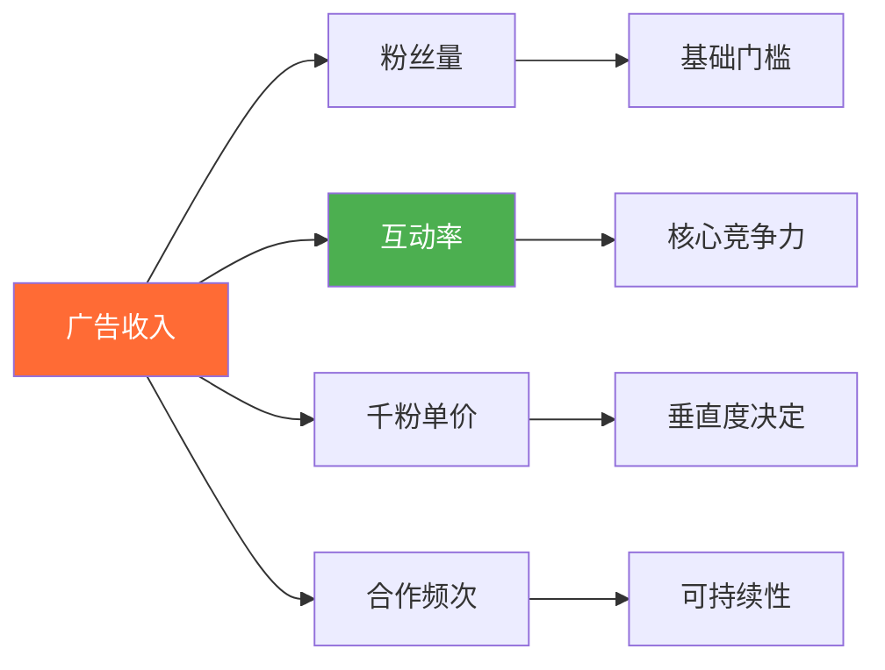
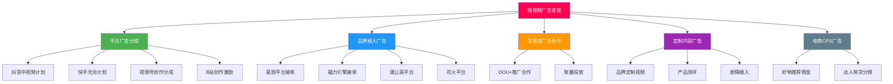
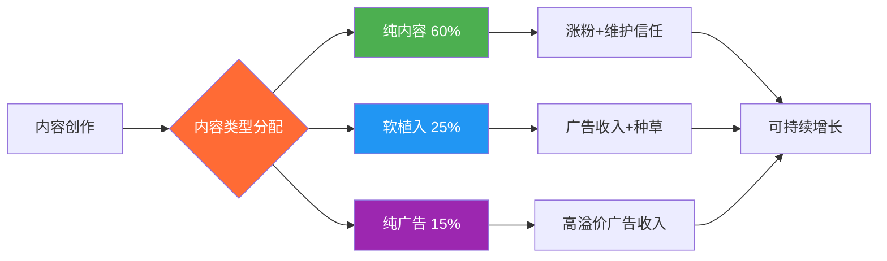

## 五、短视频广告变现技巧

广告变现是短视频创作者最成熟的收入来源之一，也是从"用爱发电"走向"内容创业"的核心转折点。与电商带货不同，广告变现不要求创作者自建供应链，核心资产是内容能力和粉丝信任。本节将从广告变现的底层逻辑出发，系统讲解五大广告类型、接单流程、定价策略、内容融合技巧以及合规要点，帮助创作者建立可持续的广告收入体系。

### 5.1 广告变现的底层逻辑

#### 5.1.1 广告主为什么愿意付钱

理解广告主的诉求是做好广告变现的前提。广告主投放短视频广告的核心诉求有三个：

| 诉求类型 | 具体含义 | 对应指标 |
|----------|----------|----------|
| 品牌曝光 | 让更多人知道品牌/产品 | CPM（千次曝光成本） |
| 效果转化 | 直接带来下载/注册/购买 | CPA（单次行动成本）、ROI |
| 内容种草 | 通过真实内容建立产品口碑 | 互动率、搜索指数增长 |

广告主最终衡量的是**投资回报率（ROI）**。创作者能帮广告主获得越高的ROI，广告报价就越高。这就是为什么10万粉的垂直号报价可能高于50万粉的泛娱乐号——垂直号的转化率更高。

#### 5.1.2 广告变现的收入公式

```text
广告收入 = 粉丝量 × 互动率 × 千粉单价 × 合作频次
```

各因素的影响权重：



- **粉丝量**：决定广告主是否愿意合作的基础门槛。抖音星图要求10万粉以上才能开通，快手磁力引擎要求1万粉以上
- **互动率**：点赞、评论、分享的综合比率。互动率>5%的账号属于优质账号，广告主愿意溢价30%-50%
- **千粉单价**：每1000个粉丝对应的广告报价。泛娱乐号约50-100元/千粉，垂直领域可达200-500元/千粉
- **合作频次**：每月能接多少条广告。但过多广告会伤害粉丝信任，需要平衡

#### 5.1.3 五大广告类型全景



### 5.2 平台广告分成：最基础的被动收入

#### 5.2.1 各平台分成机制对比

平台广告分成是门槛最低的广告变现方式——创作者发布内容，平台在内容中插入广告，按播放量分成。

| 平台 | 计划名称 | 开通条件 | 收益计算方式 | 参考单价 |
|------|----------|----------|-------------|----------|
| 抖音 | 中视频计划 | 发布3条横屏视频且播放量≥17000 | 按有效播放时长计算 | 约1-5元/万次播放 |
| 快手 | 光合计划 | 粉丝≥1万 | 按播放量+互动综合计算 | 约0.5-3元/万次播放 |
| 视频号 | 创作分成计划 | 有效粉丝≥100 | 评论区广告展示分成 | 约0.5-2元/万次播放 |
| B站 | 创作激励计划 | 信用分≥60且粉丝≥1000 | 按播放量+互动质量 | 约1-3元/万次播放 |
| 西瓜视频 | 创作收益 | 无硬性门槛 | 按播放时长计算 | 约2-8元/万次播放 |

#### 5.2.2 提升平台分成收益的关键策略

**策略一：拉长有效播放时长**

平台分成的核心指标是"有效播放时长"而非"播放次数"。一条用户看了3秒就划走的视频和一条用户看完全片的视频，收益差距可达10倍以上。

提升完播率的方法：
- **前3秒黄金钩子**：用悬念、冲突、利益点留住用户。例如："月薪3000的我，靠这个方法3个月攒了5万"
- **节奏控制**：每15-30秒设置一个转折点或新信息点，防止用户流失
- **时长优化**：中视频计划要求≥1分钟，但最佳时长在2-5分钟。太短收益低，太长完播率下降
- **分段叙事**：将内容分为3-5个明确段落，每段有小标题或口播提示，让用户感觉"后面还有干货"

**策略二：提升互动质量**

平台的收益算法不仅看播放量，还会评估内容质量。互动率（点赞、评论、收藏、分享）是质量信号的核心指标。

| 互动指标 | 优质基准 | 提升方法 |
|----------|----------|----------|
| 点赞率 | ≥3% | 结尾加引导："觉得有用就点个赞吧" |
| 评论率 | ≥0.5% | 设置争议性观点或提问引导讨论 |
| 收藏率 | ≥1% | 提供实用干货、清单、模板 |
| 分享率 | ≥0.3% | 制造社交货币（有用/有趣/有面子） |

**策略三：多平台分发最大化**

同一内容在不同平台分发，可以将收益放大2-5倍。但需要注意：

- 横屏内容（≥1分钟）适合抖音中视频+西瓜+B站三平台分发
- 竖屏内容适合抖音+快手+视频号三平台分发
- 每个平台需单独上传，避免直接搬运（平台能检测到去水印搬运）
- 发布时间错开至少30分钟，优先发布主阵地平台
- 各平台的标题、封面可以差异化，适应不同平台调性

#### 5.2.3 平台分成的收入天花板与突破

单靠平台分成，大多数创作者的月收入在1000-5000元之间。要突破这个天花板：

1. **矩阵化运营**：同一赛道运营3-5个账号，用不同风格覆盖同一人群
2. **批量生产**：建立标准化的内容生产流程，将单条视频制作时间压缩到1-2小时
3. **热点追踪**：紧跟平台热点话题，借势获得额外流量扶持
4. **深耕垂直领域**：垂直领域的内容单价更高（如财经、法律、健康），因为广告主愿意为精准人群付更多钱

### 5.3 品牌植入广告：高收益的核心变现方式

品牌植入广告是短视频创作者最主流、收益最高的广告形式。品牌方付费让创作者在内容中自然地展示或提及产品。

#### 5.3.1 广告接单平台详解

**抖音星图平台**

星图是抖音官方的广告撮合平台，品牌方和创作者都在平台上完成交易。

- 开通条件：粉丝≥10000，完成实名认证，账号状态正常
- 平台抽成：平台服务费约5%-10%（从品牌方收取）
- 接单流程：品牌发布任务→创作者报名/品牌邀请→创作者报价→品牌确认→创作内容→品牌审核→发布→结算
- 结算周期：发布后7-15个工作日到账

**快手磁力引擎**

快手的官方广告平台，定位与星图类似。

- 开通条件：粉丝≥10000，信用良好
- 特色：快手老铁文化，广告内容需要更接地气、更真实
- 接单方式：任务广场主动接单 + 品牌定向邀约

**小红书蒲公英平台**

小红书的官方商业合作平台。

- 开通条件：粉丝≥1000，完成专业号认证
- 特色：图文+视频均可接单，种草属性强
- 注意：小红书对"软广"管控严格，必须通过蒲公英报备，否则会被限流

**B站花火平台**

B站的官方商业合作平台。

- 开通条件：粉丝≥10000，电磁力等级≥3
- 特色：B站用户对广告容忍度低但对好内容的广告接受度高，需要"恰饭"做得有趣

#### 5.3.2 品牌植入的五种方式与效果对比

| 植入方式 | 描述 | 用户接受度 | 广告主偏好 | 报价倍数 |
|----------|------|-----------|-----------|----------|
| 口播种草 | 创作者直接介绍产品，通常在视频开头或中间 | ★★★☆☆ | 高（直接曝光） | 1x（基础报价） |
| 场景植入 | 产品自然出现在使用场景中，不刻意强调 | ★★★★★ | 中（曝光不够直接） | 0.8-1x |
| 剧情植入 | 将产品融入故事情节，自然推动剧情 | ★★★★☆ | 中高（需要创意能力） | 1.2-1.5x |
| 测评对比 | 对产品进行专业测评，与竞品对比 | ★★★★☆ | 高（说服力强） | 1.3-1.8x |
| 定制专场 | 整条视频围绕品牌/产品创作 | ★★☆☆☆ | 高（品牌方最爱） | 1.5-2.5x |

**最佳实践：场景植入+口播结合**

用户最能接受的广告形式是"场景植入+轻度口播"。具体做法：

1. 在正常内容中自然使用产品（比如美食博主做饭时用某品牌厨具）
2. 在使用过程中用1-2句话提及产品优势（"这个锅导热特别快"）
3. 在视频结尾用5-10秒做一个简单总结（"今天用的就是XX品牌的锅，链接在评论区"）

#### 5.3.3 广告报价策略

**基础定价公式**

```text
报价 = 粉丝数 × 千粉单价 × 垂直度系数 × 互动率系数 × 内容形式系数
```

各系数参考值：

| 系数 | 取值范围 | 说明 |
|------|----------|------|
| 千粉单价 | 100-300元 | 泛娱乐100元，垂直领域200-300元 |
| 垂直度系数 | 0.8-2.0 | 泛娱乐0.8，中度垂直1.0-1.5，高度垂直1.5-2.0 |
| 互动率系数 | 0.7-1.5 | 互动率<1%为0.7，1-3%为1.0，>5%为1.5 |
| 内容形式系数 | 0.8-2.5 | 纯口播1.0，场景植入0.8，定制专场2.0-2.5 |

**举例计算**：

一个10万粉的美妆博主，互动率4%，接一条场景植入+口播的广告：
```text
100,000 ÷ 1000 × 200 × 1.2 × 1.3 × 1.0 = 31,200元
```

**阶梯报价策略**

不要只有一个报价，要准备阶梯套餐：

| 套餐 | 内容 | 报价 |
|------|------|------|
| 基础版 | 1条短视频植入，保留7天 | 基础价 |
| 标准版 | 1条短视频植入+1条评论区置顶，永久保留 | 基础价 × 1.3 |
| 尊享版 | 1条定制视频+1条短视频植入+评论区置顶+主页推荐 | 基础价 × 2.0 |

#### 5.3.4 提高接单成功率的技巧

**打造高转化率的创作者主页**

品牌方在选择合作对象时，会重点看以下内容：

1. **数据看板**：近30天的播放量趋势、互动率、粉丝增长曲线。数据稳定上升比突然爆一条更受青睐
2. **内容调性**：过往内容是否与品牌调性匹配。美妆品牌不会找一个科技评测博主
3. **历史广告效果**：如果有过往广告合作的案例（播放量、互动数据），主动展示
4. **粉丝画像**：年龄、性别、地域分布。品牌方会评估是否与目标人群匹配

**主动出击而非被动等待**

1. 定期浏览星图/磁力引擎的任务广场，筛选与自己匹配的品牌主动报名
2. 准备一份专业的"创作者媒体资料包"（Media Kit），包含：粉丝数据、代表作品、过往合作案例、报价体系
3. 在个人主页留下商务联系方式（邮箱），方便品牌方直接联系
4. 加入创作者社群，通过同行推荐获取品牌资源

### 5.4 信息流广告合作与DOU+投放

#### 5.4.1 什么是信息流广告合作

信息流广告合作是指创作者制作广告素材，由品牌方通过平台的广告系统（如巨量引擎、磁力金牛）进行付费投放。创作者赚取的是**素材制作费**，而非广告投放收益。

这种模式的特点：
- 收入相对固定（按条计费），不依赖自然流量
- 对创作者的粉丝量要求较低（有些品牌更看重素材质量而非粉丝量）
- 可以批量生产，单条素材制作费500-5000元不等
- 适合擅长拍摄但粉丝量不大的创作者

#### 5.4.2 信息流素材制作要点

信息流广告素材的核心指标是**点击率（CTR）**和**转化率（CVR）**。制作时需要遵循以下原则：

**前3秒法则**：信息流广告的生死在前3秒。用户在刷到广告时，如果前3秒没有被吸引，就会直接划走。

有效的前3秒开头类型：
- **痛点提问**："你还在为脱发烦恼吗？"
- **数据冲击**："90%的人不知道，你的手机每天在偷偷扣费"
- **反常识**："千万别用洗面奶洗脸！"
- **效果展示**：直接展示产品使用前后的对比效果

**素材结构模板**：

```text
[0-3秒] 钩子 — 抓住注意力
[3-10秒] 痛点 — 放大用户的问题/需求
[10-25秒] 解决方案 — 引出产品
[25-35秒] 效果证明 — 数据/案例/演示
[35-45秒] 行动号召 — 引导点击/购买
```

#### 5.4.3 DOU+投放合作模式

DOU+合作是一种特殊的广告形式：品牌方出钱给创作者投放DOU+，换取创作者在其内容中植入产品。

合作流程：
1. 品牌方提供产品和DOU+预算（通常500-5000元）
2. 创作者在内容中自然植入产品
3. 创作者用品牌方的预算投放DOU+，扩大内容曝光
4. 双方约定的内容曝光量和互动量作为考核标准

这种模式对创作者的好处是零成本获得流量加成，同时赚取广告费。但需要注意DOU+投放策略，避免浪费预算。

### 5.5 定制内容广告：高溢价的深度合作

#### 5.5.1 定制内容广告的类型

定制内容广告是品牌方委托创作者为其量身定制整条内容，通常涉及较深的产品理解和创意策划。

| 类型 | 适用场景 | 报价范围 | 制作周期 |
|------|----------|----------|----------|
| 产品开箱/测评 | 3C数码、美妆、家居 | 3000-30000元 | 3-7天 |
| 品牌故事片 | 品牌形象建设 | 10000-100000元 | 7-15天 |
| 挑战赛/话题发起 | 新品上市、节日营销 | 5000-50000元 | 5-10天 |
| 知识科普植入 | 教育、健康、金融 | 2000-20000元 | 3-7天 |
| 剧情短片 | 品牌深度植入 | 8000-80000元 | 7-20天 |

#### 5.5.2 定制广告的谈判要点

与品牌方谈判定制广告时，需要明确以下条款：

**必须写进合同的条款**：

1. **内容审核权**：品牌方有几次修改权？创作者是否保留最终的内容控制权？建议约定"品牌方最多修改2次，但创作者保留内容调性的最终决定权"
2. **发布排期**：具体发布时间、保留时长（建议至少保留30天，永久保留可加价）
3. **数据保底**：是否承诺播放量？建议不承诺具体数据，但可以承诺"若播放量低于X，赠送一条补发视频"
4. **独家条款**：品牌方是否要求一定时间内的竞品排他？排他期越长，报价越高（通常每月加价20%-30%）
5. **二次授权**：品牌方是否可以将视频素材用于其他渠道投放？如需二次授权，应额外收费（通常为基础报价的50%-100%）
6. **付款方式**：建议50%预付+50%发布后结算。全额后付的风险较高

#### 5.5.3 创意植入的高级技巧

**"种草三步法"**

1. **建立共鸣**：从用户的真实场景出发，而非从产品出发
2. **自然过渡**：将产品作为"解决方案"引入，而非"广告"
3. **价值闭环**：让用户觉得"这条视频即使有广告也值了"

**示例对比**：

差的植入方式：
> "今天给大家推荐一款XX品牌的面膜，这款面膜含有XX成分，补水效果特别好，现在下单还有优惠..."

好的植入方式：
> "最近熬夜剪视频皮肤状态特别差，朋友给我推荐了一个方法——洗完脸之后敷一片面膜然后用冰勺子按压。我用的是XX品牌的这款，主要是它比较薄不会滑下来（展示使用过程）。用了大概两周，你们看这个对比（展示前后对比），确实有变化。链接我放评论区了，最近好像有活动价。"

核心区别：好的植入让用户觉得是在"分享生活"而非"推销产品"。

### 5.6 电商CPS广告：按效果付费的模式

#### 5.6.1 CPS广告的运作机制

CPS（Cost Per Sale）即按销售额分成。创作者在内容中推荐商品，用户通过创作者的专属链接购买，创作者获得佣金。

| 平台 | 入口 | 佣金比例范围 | 结算周期 |
|------|------|-------------|----------|
| 抖音精选联盟 | 抖音APP→商品橱窗 | 5%-50% | T+7 |
| 快手好物联盟 | 快手APP→快手小店 | 5%-50% | T+15 |
| 淘宝联盟 | 淘宝联盟APP | 1%-90%（视品类） | T+20 |
| 京东联盟 | 京东联盟官网 | 1%-50% | T+30 |
| 拼多多多多进宝 | 多多进宝APP | 5%-60% | T+15 |

#### 5.6.2 高佣金品类选择

不同品类的佣金差异巨大：

| 品类 | 典型佣金率 | 推荐理由 |
|------|-----------|----------|
| 美妆护肤 | 20%-40% | 高频消费、复购率高 |
| 食品零食 | 15%-30% | 客单价低、转化率高 |
| 家居日用 | 10%-25% | 需求广泛、决策门槛低 |
| 数码配件 | 10%-20% | 客单价适中、佣金绝对值可观 |
| 服装鞋包 | 20%-50% | 高佣金但退货率也高 |
| 教育课程 | 30%-70% | 虚拟商品、边际成本低 |
| 图书音像 | 10%-40% | 适合知识类博主 |

#### 5.6.3 提升CPS转化率的技巧

1. **选品与内容匹配**：推荐的产品必须与你的内容定位一致。美食博主推荐厨具转化率远高于推荐护肤品
2. **真实使用体验**：展示你实际使用产品的过程，而非念产品参数
3. **价格锚定**：先展示原价，再展示优惠价，让用户感受到"占便宜"
4. **紧迫感制造**："这个优惠券今天就过期了"、"库存只剩XX件"
5. **降低决策门槛**："支持7天无理由退换"、"买贵了包退差价"

### 5.7 广告变现的风险控制与合规要点

#### 5.7.1 法律法规红线

短视频广告必须遵守《中华人民共和国广告法》和《互联网广告管理办法》。以下是核心合规要点：

**绝对不能碰的红线**：

- **虚假宣传**：不能使用"最好"、"第一"、"国家级"等绝对化用语
- **效果承诺**：不能承诺具体效果（如"使用后保证白3个度"），除非有权威检测报告
- **违禁品类**：烟草、处方药、医疗器械等特殊品类有严格的广告限制
- **未标明广告**：根据《互联网广告管理办法》，通过互联网发布的广告应当显著标明"广告"，使消费者能够辨明

**必须做到的合规要求**：

1. 在广告视频中明确标注"广告"或"合作"字样（平台通常会在星图订单中自动添加标识）
2. 不得使用未经授权的他人形象、声音
3. 食品、保健品广告不得涉及疾病预防、治疗功能
4. 化妆品广告不得使用医疗用语或暗示医疗效果
5. 金融产品广告必须提示风险

#### 5.7.2 粉丝信任保护

过度商业化是创作者最大的隐形损失。每一条低质量广告都在透支粉丝信任，而信任一旦流失，恢复的成本远高于维护的成本。

**广告频率控制建议**：

| 粉丝量级 | 建议广告频率 | 说明 |
|----------|-------------|------|
| 1-10万 | 每周≤1条 | 初期以内容质量为主，广告过多会阻碍涨粉 |
| 10-50万 | 每周1-2条 | 可以适度增加，但广告内容质量不能下降 |
| 50-100万 | 每周2-3条 | 粉丝对商业化有一定容忍度 |
| 100万+ | 每周3-5条 | 但需要确保每条广告都有内容价值 |

**保持粉丝信任的三条原则**：

1. **选品严格**：只接自己真正用过、觉得好的产品。一条烂广告毁掉的信任，需要10条好内容才能修复
2. **广告即内容**：即使是广告，也要保证内容质量。让粉丝觉得"这条广告也挺有意思"
3. **坦诚沟通**：偶尔和粉丝聊聊你的接广告原则，让他们知道你是在筛选而非来者不拒

#### 5.7.3 税务合规

广告收入属于个人劳务报酬所得或经营所得，需要依法纳税。

| 收入形式 | 税务处理 | 税率范围 |
|----------|----------|----------|
| 平台代扣代缴 | 平台自动扣税后发放 | 20%-40%（劳务报酬） |
| 品牌直接转账 | 需自行申报 | 3%-45%（综合所得） |
| 注册个体户/公司 | 按经营所得纳税 | 5%-35%，可享受小规模纳税人优惠 |

建议：当月广告收入超过1万元时，考虑注册个体工商户，享受小规模纳税人增值税免征（月销售额≤10万元）和核定征收等税收优惠政策。

### 5.8 广告变现的进阶策略

#### 5.8.1 从接广告到"卖广告位"

当粉丝量和影响力达到一定规模后，可以转变思维：从"被动接广告"变为"主动卖广告位"。

具体做法：
1. **建立媒体资料包**：包含粉丝画像、历史数据、合作案例、报价体系，做成PDF主动发给品牌方
2. **开发固定广告位**：比如"每周三的产品推荐"、"月度好物合集"，让品牌方可以长期预定
3. **打包销售**：将抖音+快手+小红书的广告打包成"全案推广方案"，提升客单价
4. **建立品牌库**：维护与10-20个品牌的长期合作关系，保证稳定的广告收入

#### 5.8.2 数据驱动的广告优化

建立一个简单的广告效果追踪表：

| 指标 | 计算方式 | 优化方向 |
|------|----------|----------|
| 广告播放完成率 | 广告视频完播率 / 正常视频完播率 | <80%说明广告植入太生硬 |
| 广告互动率 | 广告视频互动率 / 正常视频互动率 | <60%说明广告内容质量需要提升 |
| 广告取关率 | 发布广告后24小时取关数 / 总粉丝数 | >0.5%说明广告频率过高或选品不当 |
| 品牌复购率 | 复购品牌数 / 总合作品牌数 | >30%说明广告效果好，品牌愿意持续合作 |

#### 5.8.3 广告变现与内容创作的平衡模型



建议的黄金比例：
- **60%纯内容**：不带任何商业目的，纯粹为粉丝提供价值
- **25%软植入**：自然融入产品，用户即使识别出广告也不会反感
- **15%纯广告**：品牌定制内容、专场推荐等，粉丝有预期

### 5.9 常见误区与纠正

| 误区 | 正确认知 |
|------|----------|
| 粉丝多了自然有广告找上门 | 需要主动入驻星图等平台，完善资料，主动联系品牌 |
| 广告越多收入越高 | 过多广告会导致掉粉、互动率下降，长期看收入反而减少 |
| 什么广告都接 | 接低质广告会伤害粉丝信任和账号调性，得不偿失 |
| 广告内容不需要用心做 | 广告也是内容，质量差的广告比不发更糟糕 |
| 报价越高越好 | 过高报价会导致接不到单，合理定价才能持续合作 |
| 只看粉丝量定价 | 互动率、垂直度、粉丝画像质量才是品牌方更看重的 |

### 5.10 收入预期与发展路径

| 阶段 | 粉丝量 | 月广告收入 | 核心策略 |
|------|--------|-----------|----------|
| 起步期 | 0-1万 | 0-1000元 | 专注内容质量，积累粉丝基础 |
| 成长期 | 1-10万 | 1000-8000元 | 开通平台分成，尝试CPS带货 |
| 发展期 | 10-50万 | 8000-50000元 | 入驻星图/磁力，开始接品牌广告 |
| 成熟期 | 50-100万 | 5-20万元 | 建立品牌库，开发长期合作 |
| 头部期 | 100万+ | 20万元以上 | 全案合作，多元化广告收入 |

> **核心心法：** 广告变现的本质是"信任变现"。粉丝信任你的推荐，品牌才愿意为这份信任付费。维护好粉丝信任，就是在维护你的核心资产。短期看，一条烂广告能赚几千块；长期看，失去的信任价值远不止这个数。做广告的最高境界是让粉丝觉得"你推荐的东西我都想试试"，而不是"又打广告了取关吧"。
