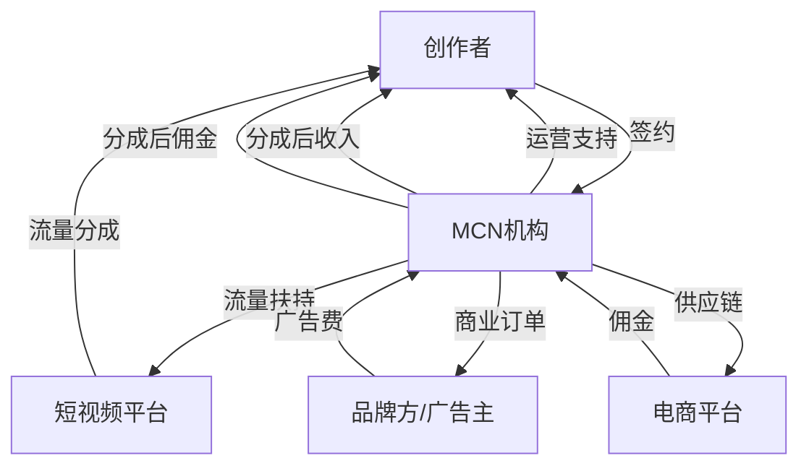

## 六、MCN机构合作技巧

MCN（Multi-Channel Network，多频道网络）机构是连接创作者与平台、品牌方之间的中间组织。对于短视频创作者而言，是否签约MCN、如何选择MCN、怎样在合作中保护自身权益，是职业生涯中至关重要的决策。本节将从MCN的本质出发，系统讲解评估、签约、合作、解约的全流程技巧。

### 6.1 MCN机构的本质与分类

#### 6.1.1 MCN到底是什么

MCN机构的核心价值是**规模效应**——将散落的创作者聚合起来，以集体的力量获取平台资源、商业订单和技术支持。本质上，MCN做的是三件事：

1. **流量采购与分配**：向平台争取流量扶持，再分配给旗下创作者
2. **商业资源对接**：统一对接品牌广告、电商带货等商业合作
3. **运营能力输出**：提供内容策划、拍摄制作、数据分析等运营服务

理解MCN的商业逻辑很关键——MCN不是慈善机构，它的盈利来源于创作者收入的分成。因此，MCN的利益与创作者的利益并不总是完全一致的。MCN倾向于签约更多创作者以分散风险，而创作者希望获得更多独家资源。认清这一点，才能在合作中保持清醒。

#### 6.1.2 MCN机构的主要类型

| 类型 | 特征 | 适合人群 | 代表机构 |
|------|------|----------|----------|
| **综合型MCN** | 覆盖多平台、多品类，规模大，资源丰富 | 有一定粉丝基础的创作者 | 无忧传媒、papitube、蜂群传媒 |
| **垂类MCN** | 专注某一领域（美妆、美食、科技等），专业度高 | 垂直领域创作者 | 毛毛姐（美妆）、麻辣德子（美食） |
| **孵化型MCN** | 从零培养素人，投入大，分成比例高 | 有潜力的素人新手 | 早期的洋葱集团 |
| **电商型MCN** | 主攻直播带货和电商变现 | 擅长带货的主播 | 谦寻、美ONE |
| **平台型MCN** | 与特定平台深度绑定，享有平台官方资源 | 深耕单一平台的创作者 | 抖音星图服务商、快手磁力引擎服务商 |
| **服务型MCN** | 提供代运营、培训等服务，不深度绑定创作者 | 想保持独立性的创作者 | 各类中小代运营公司 |

#### 6.1.3 MCN与创作者的关系模型



### 6.2 什么时候该签约MCN

签约MCN不是必选项。很多成功的创作者从未签约任何MCN。判断是否需要MCN，关键看你的**阶段**和**需求**。

#### 6.2.1 适合签约MCN的情况

- **你有明确的内容方向，但缺乏制作资源**（设备、团队、场地）
- **你的账号已初步起量（粉丝1万+），但商业化遇到瓶颈**
- **你想进入需要供应链支撑的领域**（如直播带货）
- **你希望获得平台官方活动的优先参与资格**
- **你想把运营事务外包，专注于内容创作本身**

#### 6.2.2 不适合签约MCN的情况

- **刚起步的新手**：粉丝不到1000，内容方向还没验证，此时签约议价能力极低，容易拿到不平等条款
- **已有成熟变现体系**：自己能接到广告、有稳定的电商收入，MCN的分成反而降低你的净收入
- **内容高度个人化**：如知识付费、个人IP，MCN很难提供有效帮助
- **对创作自由度要求极高**：MCN的内容规划可能与你的创作理念冲突

#### 6.2.3 决策矩阵

| 维度 | 签约MCN | 自主运营 |
|------|---------|----------|
| 启动成本 | 低（MCN提供资源） | 高（自己投入设备、团队） |
| 收入分成 | 需让出20%-70% | 100%归自己 |
| 成长速度 | 快（有资源扶持） | 慢（靠自己摸索） |
| 创作自由度 | 受限（需配合MCN规划） | 完全自主 |
| 商业对接 | MCN统一处理 | 需自己开拓 |
| 风险 | 合同纠纷、被雪藏 | 收入不稳定、资源不足 |
| 适合阶段 | 成长期（1万-50万粉） | 起步期或成熟期 |

### 6.3 如何选择靠谱的MCN机构

选择MCN是创作者最重要的商业决策之一。选错MCN，轻则浪费时间，重则陷入合同纠纷、账号被绑定。

#### 6.3.1 考察MCN的七个维度

**维度一：旗下达人的真实数据**

不要只看MCN宣传的"头部达人"，重点考察中腰部达人的状态。头部达人可能是签约前就已经成功的，不能说明MCN的孵化能力。

查看方法：
- 在抖音/快手搜索该MCN的机构主页，查看旗下达人列表
- 用第三方工具（蝉妈妈、飞瓜数据、新抖）查看达人成长曲线
- 重点关注：签约后粉丝增长率、内容更新频率、商业化收入

**维度二：资源匹配度**

MCN的资源是否与你的发展方向匹配？例如：
- 做美妆的应该找有美妆品牌资源的MCN
- 做直播带货的应该找有供应链能力的MCN
- 做知识类内容的应该找有教育培训资源的MCN

**维度三：合同条款透明度**

靠谱的MCN会主动展示合同模板，愿意逐条解释。如果MCN催促你快速签约、不愿透露合同细节，这是重大红旗信号。

**维度四：运营团队配置**

了解MCN能为你的账号配置什么样的运营团队：
- 是否有专属的内容策划？
- 是否有专职的摄像和后期？
- 运营人员同时管理多少个账号？（管理账号过多说明精力分散）

**维度五：历史口碑**

- 在知乎、小红书搜索该MCN的名称 + "评价"/"踩坑"
- 联系该MCN的已解约创作者，了解真实体验
- 查看企查查/天眼查上的法律诉讼记录

**维度六：分成模式的合理性**

| 合作模式 | MCN分成 | 创作者分成 | 适用场景 |
|----------|---------|------------|----------|
| 孵化模式 | 50%-70% | 30%-50% | MCN全额投入，从零培养 |
| 资源扶持 | 30%-50% | 50%-70% | 创作者有基础，MCN提供资源 |
| 纯商业对接 | 20%-30% | 70%-80% | 创作者自主运营，MCN只接单 |
| 项目制 | 固定费用或单次分成 | 剩余部分 | 按具体项目合作，不绑定 |

**维度七：退出机制**

合同中必须明确：
- 解约条件和违约金计算方式
- 解约后账号归属权
- 解约后内容版权归属
- 竞业限制的范围和期限

#### 6.3.2 五步筛选法

```text
第一步：列出候选名单（5-10家）
  ↓ 通过行业报告、同行推荐、平台官方服务商名单获取
第二步：初步筛选（缩小到3-5家）
  ↓ 查看企查查、第三方数据工具、网络口碑
第三步：深度沟通（1-2家）
  ↓ 面谈了解运营方案、资源配置、合同细节
第四步：试用期观察（1-3个月）
  ↓ 签短期试用协议，观察实际支持力度
第五步：正式签约
  → 律师审核合同后签署
```

#### 6.3.3 识别"割韭菜"MCN的红旗信号

以下是明显的危险信号，遇到任何一条都应高度警惕：

1. **承诺保底收入但不写入合同**：口头承诺"月入过万"但合同中没有任何保底条款
2. **要求缴纳"培训费"/"保证金"**：正规MCN不向创作者收费，收入来自分成
3. **合同中竞业限制过宽**：解约后2-3年内不能在任何平台发布内容
4. **账号归属权归MCN所有**：解约后账号被收回，所有粉丝和内容付之东流
5. **违约金畸高**：违约金远超MCN实际投入，实质是阻止创作者解约
6. **不提供合同副本**：签完合同不给你一份留存
7. **旗下大量账号停更**：说明MCN缺乏持续运营能力
8. **催促快速签约**："今天不签名额就没了"——典型的逼单话术

### 6.4 合同谈判的关键条款

签约MCN前，务必请律师审核合同。以下是需要重点谈判的条款：

#### 6.4.1 核心条款清单

| 条款 | 谈判要点 | 常见陷阱 |
|------|----------|----------|
| **合作期限** | 建议1-2年，避免签3年以上 | 签长期合同+高额违约金绑定 |
| **收益分成** | 明确各项收入的分成比例和结算周期 | 模糊的"扣除成本后分成" |
| **账号归属** | 明确账号所有权归创作者 | MCN注册账号，所有权归MCN |
| **内容版权** | 明确解约后内容的使用权 | MCN永久拥有全部内容版权 |
| **竞业限制** | 范围要合理，期限不超过6个月 | 2-3年全面竞业，实质是绑架 |
| **违约责任** | 违约金应与实际损失挂钩 | 固定高额违约金（如50万） |
| **最低保障** | MCN应承诺最低资源投入 | 无任何资源保障承诺 |
| **解约条件** | 双方均可提前解约，条件对等 | 只有MCN能单方面解约 |
| **数据透明** | 创作者有权查看所有收入数据 | MCN不公开商业合作明细 |

#### 6.4.2 分成比例的谈判策略

分成比例不是固定的，取决于你的议价能力。以下是谈判时的参考框架：

- **粉丝量1万以下**：议价能力弱，MCN分成可能在50%-70%，此时重点谈资源保障
- **粉丝量1万-10万**：有一定议价能力，争取MCN分成30%-50%
- **粉丝量10万-50万**：议价能力较强，MCN分成应在20%-40%
- **粉丝量50万以上**：强势议价，可以谈纯商业对接模式（MCN只抽商业订单的15%-25%）

谈判技巧：
- 收集同体量创作者的分成数据作为参考
- 强调你的内容独特性和增长潜力
- 要求设置阶梯式分成（随收入增长，MCN分成比例递减）
- 要求设置考核期（MCN未兑现资源承诺则自动调整分成）

#### 6.4.3 必须争取的保护条款

**账号归属权条款**（核心中的核心）：

```text
建议条款模板：
"合作期间，账号由双方共同运营。合作终止后，
账号所有权及全部粉丝数据归创作者所有。
MCN应在合作终止后7个工作日内完成账号交接。"
```

**数据透明条款**：

```text
建议条款模板：
"MCN应于每月10日前向创作者提供上月完整的
收入明细表，包括但不限于：平台分成收入、
广告合作收入、电商佣金收入、其他商业收入。
创作者有权随时查阅原始数据。"
```

**退出条款**：

```text
建议条款模板：
"任何一方提前30天书面通知后可解除本合同。
解约违约金不超过MCN在合作期间实际投入的
直接成本（需提供发票/收据）。竞业限制期限
不超过解约后6个月，且仅限于同一直接竞品
品牌的合作。"
```

### 6.5 合作期间的运营策略

签约只是开始，如何在合作期间最大化收益、维护自身权益，同样重要。

#### 6.5.1 与MCN团队高效协作

建立清晰的沟通机制：

- **周会制度**：每周与运营团队开一次内容复盘会，查看数据表现，讨论下周内容方向
- **需求提报**：当需要资源支持（拍摄场地、设备、嘉宾等）时，提前1-2周以书面形式提出
- **问题升级**：日常问题找对接运营，重大问题（分成争议、资源未兑现）直接找MCN负责人

#### 6.5.2 保持核心竞争力

签约MCN最大的风险是**能力退化**——过度依赖MCN的运营团队，自己丧失了内容策划、数据分析、商业谈判的能力。

必须自己掌握的核心能力：
1. **内容策划能力**：即使有策划团队，自己也要懂选题逻辑
2. **数据分析能力**：能独立解读后台数据，不被MCN的数据报告误导
3. **粉丝运营能力**：直接与粉丝互动，了解真实需求
4. **基本的法律知识**：能看懂合同，识别不合理条款

#### 6.5.3 收入多元化策略

不要把所有收入来源都绑定在MCN上。建议保留以下自主收入渠道：

- **个人知识付费**：课程、社群、咨询等，这类收入MCN通常不参与
- **私域流量变现**：微信社群、朋友圈等私域渠道的变现
- **个人品牌授权**：以个人名义进行的品牌合作

这样即使与MCN解约，你也有稳定的收入来源。

#### 6.5.4 定期评估合作效果

每季度进行一次合作效果评估，用数据说话：

| 评估维度 | 具体指标 | 达标标准 |
|----------|----------|----------|
| 流量增长 | 粉丝增长率、播放量趋势 | 季度粉丝增长不低于10% |
| 商业收入 | 广告收入、带货佣金 | 逐季增长或持平 |
| 资源兑现 | MCN承诺的资源是否到位 | 80%以上的承诺资源已兑现 |
| 内容质量 | 完播率、互动率 | 不低于行业平均水平 |
| 个人成长 | 新技能、新资源、新人脉 | 每季度至少有一项新收获 |

如果连续两个季度评估不达标，应认真考虑解约或重新谈判合同条件。

### 6.6 常见纠纷类型与应对

#### 6.6.1 收入分成纠纷

**场景**：MCN报告的收入低于创作者预期，怀疑MCN隐瞒了部分收入。

**应对方法**：
1. 要求MCN提供完整的后台数据截图或平台官方结算单
2. 对比第三方数据工具（蝉妈妈、飞瓜）的估算值
3. 如差距过大，可要求引入第三方审计
4. 在合同中预先约定数据透明条款和审计权

#### 6.6.2 资源未兑现纠纷

**场景**：签约前承诺的流量扶持、拍摄团队、商业订单等资源未兑现。

**应对方法**：
1. 收集签约前MCN的承诺证据（聊天记录、PPT、录音）
2. 书面形式向MCN提出整改要求，设定合理期限
3. 如MCN仍不兑现，以"根本违约"为由提出解约
4. 必要时通过法律途径维权

#### 6.6.3 账号归属纠纷

**场景**：解约时MCN拒绝归还账号，声称账号归MCN所有。

**预防方法**（签约时就做好）：
- 用自己手机号注册账号，不要用MCN提供的手机号
- 绑定自己的实名认证信息
- 在合同中明确约定账号归属权

**事后补救**：
1. 提供账号注册时的身份信息
2. 提供账号运营过程中的原始素材（拍摄花絮、创作笔记等）
3. 通过平台官方渠道申诉账号归属
4. 法律诉讼（耗时长，但有成功案例）

#### 6.6.4 竞业限制纠纷

**场景**：解约后MCN以竞业限制条款为由，阻止创作者在其他平台发布内容。

**应对方法**：
1. 审查竞业限制条款的合理性（范围、期限、地域）
2. 不合理的竞业限制条款在法律上可能被认定无效
3. 竞业限制期间，MCN应支付竞业补偿金（通常为月收入的30%以上），未支付则条款不生效
4. 咨询专业律师，评估条款的法律效力

### 6.7 解约策略与流程

当你决定与MCN解约时，需要有策略地进行，避免损失。

#### 6.7.1 解约前的准备工作

1. **备份所有数据**：粉丝列表、内容素材、收入记录、沟通记录
2. **注册备用账号**：以防万一，提前在各平台注册备用账号
3. **咨询律师**：评估解约的法律风险和成本
4. **建立私域流量池**：把核心粉丝导流到微信等私域渠道
5. **准备替代方案**：联系其他MCN或确定自主运营方案

#### 6.7.2 解约谈判策略

- **友好协商优先**：大多数MCN不愿意打官司，友好协商是最高效的方式
- **提出合理补偿**：如果MCN确实有投入，提出合理的补偿方案
- **争取账号和内容**：这是最核心的资产，其他条件可以适当让步
- **书面确认解约条款**：所有口头承诺必须写入解约协议

#### 6.7.3 解约后的过渡期管理

- **内容断更不超过1周**：解约期间尽量保持更新频率
- **提前告知粉丝**：用适当方式告知粉丝账号变化，避免恐慌
- **快速建立新的运营体系**：无论是加入新MCN还是自主运营，都要快速切换

### 6.8 不同体量创作者的MCN策略

#### 6.8.1 素人阶段（0-1万粉）

**推荐策略**：不签约MCN，自主成长

原因：此阶段议价能力为零，签约条件极度不平等。建议通过自学掌握基本的内容创作和运营能力，等粉丝突破1万再考虑MCN。

如果一定要找MCN，选择**短期试用协议**（1-3个月），避免签长约。

#### 6.8.2 成长阶段（1万-50万粉）

**推荐策略**：选择垂类MCN或资源型MCN

此阶段是签约MCN的黄金窗口——你已经验证了内容方向，有了一定的粉丝基础，但商业化能力不足。选择与你领域匹配的MCN，可以获得针对性的资源扶持。

重点谈：资源保障、分成比例、账号归属。

#### 6.8.3 成熟阶段（50万粉以上）

**推荐策略**：纯商业对接模式，或自建团队

此阶段你已经有足够的议价能力，不需要MCN的运营支持，只需要商业资源对接。可以选择纯商业对接模式（MCN只负责接广告订单，抽15%-25%），或者直接自建团队。

### 6.9 MCN合作的法律风险防范

#### 6.9.1 必须了解的法律常识

- **《合同法》/《民法典》合同编**：合同的基本效力、违约责任
- **《劳动法》**：如果MCN要求坐班打卡，可能构成劳动关系而非合作关系
- **《反不正当竞争法》**：竞业限制条款的法律边界
- **《著作权法》**：内容版权的归属和保护

#### 6.9.2 聘请律师的时机和成本

- **签约前**：请律师审核合同，费用约500-2000元，绝对值得
- **纠纷发生时**：及时咨询律师，评估维权成本和收益
- **解约时**：请律师协助谈判和起草解约协议

#### 6.9.3 留存证据的习惯

日常养成以下习惯，关键时刻能保护自己：

- 所有重要沟通使用文字形式（微信、邮件），便于留痕
- 定期截图保存MCN的承诺和运营数据
- 保留所有收入的平台官方结算单
- 签约时的PPT、宣传材料要保存副本

### 6.10 MCN行业的未来趋势

了解行业趋势，有助于做出更明智的合作决策。

1. **MCN去中间化**：平台（如抖音）开始直接对接创作者，MCN的中间人角色被削弱。未来MCN必须提供真正的差异化价值才能生存。

2. **MCN专业化细分**：综合型MCN逐渐减少，垂类MCN（美妆、游戏、知识等）成为主流。选择垂类MCN往往比综合型MCN更靠谱。

3. **创作者话语权增强**：随着头部创作者纷纷自立门户，MCN不得不提供更优厚的条件来留住人才。创作者的议价能力整体在提升。

4. **合同规范化**：行业监管加强，MCN合同逐渐规范化。但仍需创作者自身具备法律意识。

5. **AI工具降低MCN必要性**：AI剪辑、AI数据分析、AI客服等工具的普及，使得个人创作者能承担原本需要团队才能完成的工作，进一步降低了对MCN的依赖。
