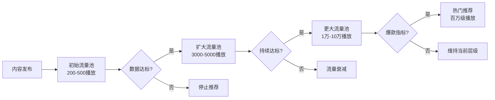
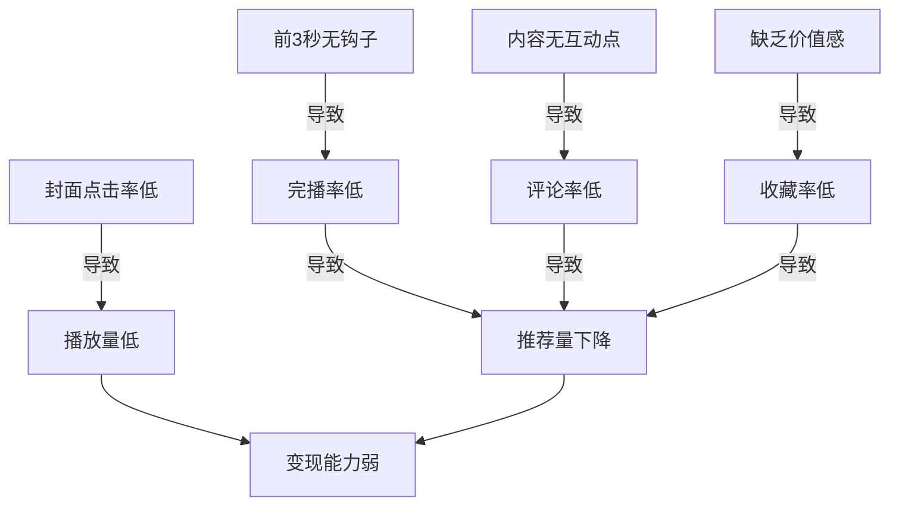
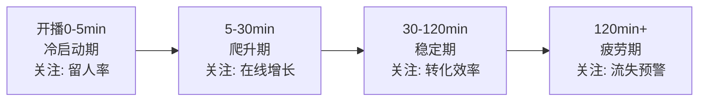
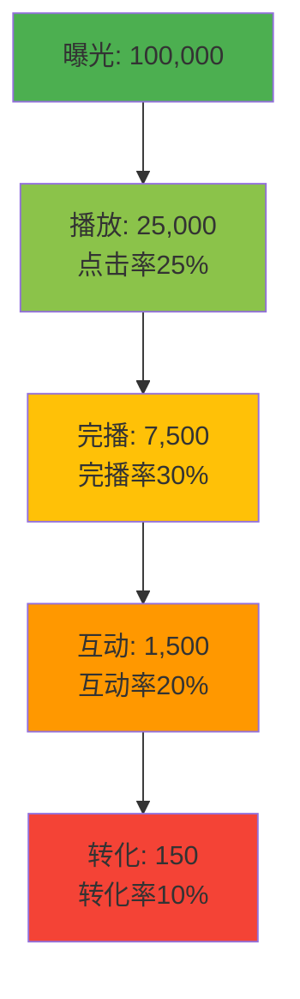

## 七、数据分析与优化

短视频与直播的变现能力，本质上是**数据驱动的决策能力**。盲目发布内容、凭感觉调整策略，是绝大多数创作者收入停滞的根本原因。本章系统讲解从数据采集、指标解读、分析方法到优化落地的完整闭环，帮助你用数据说话、用数据决策。

---

### 1. 为什么数据分析是变现的核心引擎

#### 1.1 流量分配的底层逻辑

所有主流平台（抖音、快手、视频号、B站、小红书）的推荐算法都基于**数据反馈**决定流量分配。其核心机制可以用下图表示：



平台考核的核心数据指标包括：

- **完播率**：视频被完整观看的比例（权重最高）
- **互动率**：点赞、评论、收藏、转发的综合比例
- **关注转化率**：看完后关注账号的比例
- **分享率**：将内容分享给他人的比例
- **停留时长**：用户在直播间或视频页的平均停留时间

不理解这些数据，就无法理解为什么有些视频爆了、有些石沉大海。

#### 1.2 从"感觉创作"到"数据创作"的转变

| 维度 | 感觉创作 | 数据创作 |
|------|----------|----------|
| 选题 | 想到什么拍什么 | 分析热门话题+受众需求数据 |
| 时长 | 凭感觉控制 | 根据完播率曲线优化 |
| 封面 | 觉得好看就行 | A/B测试点击率 |
| 发布时间 | 随时发 | 分析粉丝活跃时段 |
| 内容调整 | 等反馈不好再改 | 每周复盘数据，提前优化 |
| 变现策略 | 有广告就接 | 根据粉丝画像匹配变现方式 |

---

### 2. 短视频核心数据指标详解

#### 2.1 内容指标体系

短视频的数据分析需要关注**四层漏斗**：

```text
曝光层 → 消费层 → 互动层 → 转化层
```

**第一层：曝光指标**

| 指标 | 定义 | 健康基准 | 优化方向 |
|------|------|----------|----------|
| 推荐量 | 平台推送给多少用户 | 与粉丝量正相关 | 提升账号权重 |
| 曝光量 | 内容在信息流中出现的次数 | 推荐量的80%-95% | 优化发布时间 |
| 展示量 | 内容实际被用户看到的次数 | 曝光量的60%-80% | 优化封面和标题 |

**第二层：消费指标**

| 指标 | 定义 | 健康基准 | 优化方向 |
|------|------|----------|----------|
| 播放量 | 视频被点击播放的次数 | 展示量的15%-30% | 封面吸引力、标题钩子 |
| 完播率 | 完整观看的比例 | 15秒内≥45%，60秒≥20% | 内容节奏、钩子设计 |
| 平均播放时长 | 用户平均观看的秒数 | ≥视频时长的50% | 前3秒抓注意力 |
| 播放完成度 | 看到视频哪个百分比 | 关注50%和80%的流失点 | 在流失点前设置悬念 |

**第三层：互动指标**

| 指标 | 计算方式 | 健康基准 | 权重 |
|------|----------|----------|------|
| 点赞率 | 点赞数/播放量 | ≥3% | 中 |
| 评论率 | 评论数/播放量 | ≥0.5% | 高 |
| 收藏率 | 收藏数/播放量 | ≥1% | 高 |
| 转发率 | 转发数/播放量 | ≥0.3% | 最高 |
| 互动率 | (赞+评+藏+转)/播放量 | ≥5% | 综合 |

**第四层：转化指标**

| 指标 | 定义 | 适用场景 |
|------|------|----------|
| 关注转化率 | 新增粉丝/播放量 | 涨粉目标 |
| 主页访问率 | 点击头像进入主页的比例 | 品牌建设 |
| 商品点击率 | 点击购物车/链接的比例 | 电商带货 |
| 私信咨询率 | 收到私信/播放量 | 私域引流 |
| ROI | 收入/投入成本 | 付费投流 |

#### 2.2 指标之间的关联关系

数据不是孤立的，指标之间存在因果链：



**关键洞察**：完播率和互动率是影响推荐量的核心因素，而推荐量直接决定变现天花板。因此，优化内容本身（而非追求数量）才是提升收入的根本路径。

---

### 3. 直播间核心数据指标详解

#### 3.1 流量指标

| 指标 | 定义 | 健康基准 | 说明 |
|------|------|----------|------|
| 场观 | 整场直播的总观看人次 | 与粉丝量相关 | 反映引流能力 |
| 峰值在线 | 同时在线的最高人数 | 场观的5%-15% | 反映内容吸引力 |
| 平均在线 | 平均同时在线人数 | 峰值的30%-50% | 反映留存能力 |
| 新增曝光 | 直播间被推荐给的新用户数 | 场观的60%以上 | 依赖自然流量 |
| UV价值 | 成交额/独立访客数 | 因品类而异 | 核心变现效率指标 |

#### 3.2 互动指标

| 指标 | 计算方式 | 健康基准 |
|------|----------|----------|
| 互动率 | 互动人数/场观 | ≥8% |
| 评论率 | 评论人数/场观 | ≥5% |
| 点赞率 | 点赞人数/场观 | ≥15% |
| 粉丝团加入率 | 加入粉丝团/场观 | ≥1% |
| 平均停留时长 | 总停留/场观 | ≥1分钟 |

#### 3.3 转化指标（电商直播）

| 指标 | 计算方式 | 健康基准 |
|------|----------|----------|
| 商品点击率 | 点击商品人数/场观 | ≥8% |
| 转化率 | 下单人数/点击人数 | ≥5% |
| 客单价 | 成交额/成交单数 | 因品类而异 |
| GPM | 千次观看成交额 | ≥500元（高利润品） |
| 退货率 | 退货单数/成交单数 | ≤30% |

#### 3.4 直播数据的时段分析

直播间的数据不是均匀分布的，需要按时段拆解：



- **冷启动期（0-5分钟）**：前5分钟的留存率决定平台是否继续推流。如果5分钟后在线人数持续下降，说明开场内容需要优化。
- **爬升期（5-30分钟）**：关注新增用户的来源渠道（自然推荐、关注页、直播广场、付费流量），判断各渠道的引流效率。
- **稳定期（30-120分钟）**：这是变现的核心时段，重点关注商品点击率、转化率和客单价。
- **疲劳期（120分钟以上）**：关注粉丝流失速度，适时更换话题或推出福利品刺激互动。

---

### 4. 数据分析方法论

#### 4.1 对比分析法

对比是数据分析最基础也最有效的方法。需要进行**四个维度的对比**：

**① 自身纵向对比**

将本周数据与上周、上月对比，观察趋势：

```text
本周平均播放量：12,000
上周平均播放量：9,500
增长率：+26.3%
结论：内容策略调整有效，继续保持
```

**② 与同领域对标**

找到3-5个同类型、同粉丝量级的账号，对比关键指标：

| 对比项 | 你的账号 | 同类账号A | 同类账号B | 差距 |
|--------|----------|-----------|-----------|------|
| 平均播放量 | 12,000 | 25,000 | 18,000 | 偏低 |
| 完播率 | 28% | 35% | 32% | 偏低 |
| 互动率 | 6.2% | 4.8% | 5.5% | 优秀 |
| 更新频率 | 3次/周 | 7次/周 | 5次/周 | 偏低 |

**③ 账号内横向对比**

对比同一账号不同内容的数据表现，找出爆款规律：

| 内容类型 | 平均播放 | 完播率 | 互动率 | 转化率 |
|----------|----------|--------|--------|--------|
| 教程类 | 18,000 | 35% | 7.2% | 2.1% |
| 日常分享 | 5,000 | 22% | 3.8% | 0.5% |
| 热点追踪 | 28,000 | 18% | 5.1% | 0.8% |
| 产品测评 | 15,000 | 30% | 6.5% | 3.5% |

结论：教程类和产品测评的变现效率最高，应增加这两类内容比例。

**④ A/B测试对比**

控制变量，测试单一因素的影响：

- 测试封面风格：同一内容，两种封面，各发一条，对比点击率
- 测试发布时间：相似内容，在不同时段发布，对比初始播放量
- 测试标题句式：疑问句 vs 陈述句 vs 数字句式，对比完播率

#### 4.2 漏斗分析法

漏斗分析用于定位变现链路中的瓶颈环节：



分析要点：
- 如果**曝光→播放**转化率低于15%，问题在封面和标题
- 如果**播放→完播**转化率低于20%，问题在内容质量和节奏
- 如果**完播→互动**转化率低于10%，问题在互动引导设计
- 如果**互动→转化**转化率低于5%，问题在变现话术和信任建设

#### 4.3 用户画像分析

了解你的观众是谁，才能精准变现：

**基础画像维度**：

- **性别分布**：影响选品和话术风格
- **年龄分布**：决定消费能力和偏好
- **地域分布**：影响物流、定价和推广策略
- **活跃时段**：决定最佳发布时间和直播时间
- **设备分布**：iOS用户通常消费能力更强

**行为画像维度**：

- **内容偏好**：哪类内容互动最多
- **消费习惯**：客单价分布、购买频次
- **互动模式**：喜欢评论还是点赞、喜欢提问还是分享
- **流失节点**：在哪个环节离开

#### 4.4 归因分析法

当收入出现波动时，需要找到真正的原因：

**步骤一：确认波动幅度**

```text
本月收入：8,500元
上月收入：12,000元
下降幅度：-29.2%
```

**步骤二：拆解收入来源**

| 收入来源 | 上月 | 本月 | 变化 |
|----------|------|------|------|
| 广告分成 | 3,000 | 2,800 | -6.7% |
| 直播打赏 | 4,000 | 2,500 | -37.5% |
| 带货佣金 | 3,500 | 2,200 | -37.1% |
| 私域变现 | 1,500 | 1,000 | -33.3% |

**步骤三：定位问题来源**

直播打赏和带货佣金下降幅度最大，继续拆解：

- 直播场次是否减少？（是→运营问题）
- 直播时长是否缩短？（否）
- 平均在线人数是否下降？（是→流量问题）
- 流量来源是否变化？（自然推荐下降30%→内容问题）

**步骤四：制定针对性优化方案**

自然推荐下降→检查近期内容的完播率和互动率→发现完播率从32%降至21%→回溯内容→发现近期选题偏离核心领域→回归核心选题。

---

### 5. 数据分析实操工具

#### 5.1 平台原生工具

**抖音创作者服务中心**

- 入口：抖音App → 我 → 创作者服务中心
- 功能：视频数据、粉丝画像、收入分析、热门话题
- 优势：数据最准确，实时更新
- 局限：历史数据保留有限（通常90天）

**抖音电商罗盘**

- 入口：抖店后台 → 电商罗盘
- 功能：商品分析、直播间数据、达人分析、行业大盘
- 优势：电商数据最全面
- 局限：需要开通抖店

**快手创作者中心**

- 入口：快手App → 创作者中心
- 功能：作品分析、粉丝分析、收益分析
- 优势：数据颗粒度较细
- 局限：部分高级数据需要粉丝量达标

**视频号数据助手**

- 入口：微信 → 视频号 → 创作者中心 → 数据中心
- 功能：视频数据、直播数据、粉丝画像
- 优势：与微信生态打通，可追踪私域转化
- 局限：数据维度相对较少

**B站创作中心**

- 入口：B站 → 创作中心 → 数据中心
- 功能：稿件分析、粉丝分析、收益管理
- 优势：弹幕和评论数据分析独特
- 局限：商业化数据维度较少

#### 5.2 第三方数据工具

| 工具名称 | 主要功能 | 适用场景 | 价格 |
|----------|----------|----------|------|
| 蝉妈妈 | 抖音全维度数据分析 | 选品、对标分析、直播复盘 | 免费版+付费版（299-999元/月） |
| 飞瓜数据 | 抖音/快手数据分析 | 热门内容追踪、达人分析 | 免费版+付费版（369-1299元/月） |
| 新抖 | 抖音内容分析 | 热门视频追踪、话题发现 | 免费版+付费版（199元/月起） |
| 灰豚数据 | 多平台数据分析 | 跨平台对比、行业分析 | 免费版+付费版（299元/月起） |
| 考古加 | 小红书/抖音数据分析 | 小红书内容选题、竞品分析 | 免费版+付费版 |
| 新红 | 小红书数据分析 | KOL分析、笔记追踪 | 付费版（299元/月起） |
| 火烧云 | B站数据分析 | UP主分析、视频追踪 | 免费版+付费版 |

#### 5.3 自建数据追踪表

对于中小创作者，使用飞书多维表格或Excel建立自己的数据追踪体系更为实用：

**每日数据记录表模板**：

```markdown
| 日期 | 平台 | 内容标题 | 类型 | 播放量 | 完播率 | 点赞 | 评论 | 收藏 | 转发 | 新增粉丝 | 收入 |
|------|------|----------|------|--------|--------|------|------|------|------|----------|------|
| 6/20 | 抖音 | XX教程 | 教程 | 15,200 | 32% | 480 | 67 | 125 | 38 | 85 | 120 |
| 6/20 | 快手 | XX日常 | 日常 | 3,800 | 18% | 95 | 12 | 8 | 3 | 5 | 0 |
```

**周度汇总分析表模板**：

```markdown
| 周次 | 总播放量 | 平均完播率 | 总互动量 | 新增粉丝 | 总收入 | 最佳内容 | 最差内容 | 本周发现 |
|------|----------|------------|----------|----------|--------|----------|----------|----------|
| W25 | 85,000 | 28% | 4,200 | 320 | 850 | 教程A | 日常C | 教程类数据持续领先 |
```

---

### 6. 数据驱动的优化策略

#### 6.1 完播率优化

完播率是影响推荐权重最高的指标。优化方法按视频阶段拆解：

**前3秒（生死线）**：

- **悬念开场**："你知道90%的人都做错了这件事吗？"
- **结果前置**：先展示成品效果，再讲方法
- **冲突制造**：直接提出反常识的观点
- **数字冲击**："仅用3天，我的账号从0涨到了10万粉"
- **视觉冲击**：第一个画面必须抓眼球，避免渐入式开场

**中间段（节奏控制）**：

- 每15-20秒设置一个信息转折点
- 使用"但是"、"没想到"、"更关键的是"等转折词
- 画面切换频率保持3-5秒/镜头
- 避免长段纯口播，配合画面、字幕、特效

**结尾（留存设计）**：

- 设置系列感："下一期我会讲更核心的XX"
- 引导评论："你们觉得哪个方法最实用？评论区告诉我"
- 留悬念："最后一个方法效果最好，但大多数人不敢用"
- 价值升华："记住，XX的本质是XX"

#### 6.2 互动率优化

互动数据直接影响推荐量，优化策略如下：

**评论引导**：

- 在视频中故意留一个"小错误"，引发纠正型评论
- 提出选择题："A方案和B方案你选哪个？"
- 使用争议性观点（但不要引发负面舆情）
- 回复前20条评论，带动评论区氛围

**点赞引导**：

- 在内容中暗示点赞的价值："觉得有用就双击，下次还能看到"
- 制作"点赞触发器"：满足某个条件就点赞（如"如果你也遇到过这种情况"）

**收藏引导**：

- 提供实用信息："这个公式建议收藏，以后用得上"
- 制作系列内容："全套教程已合集，收藏不迷路"
- 提供可保存的模板、清单、表格

**转发引导**：

- 制作有社交货币属性的内容（测试、排名、对比）
- 提供对他人有价值的信息："转给需要的朋友"
- 制造话题性内容，让用户有分享的欲望

#### 6.3 直播间数据优化

**提升平均停留时长**：

- 每5-10分钟设置一个"福利点"（抽奖、秒杀、红包）
- 使用倒计时制造紧迫感："3分钟后上链接"
- 定期预告即将展示的内容："下一个产品是今天的重磅"
- 保持口播节奏，避免冷场超过30秒

**提升商品点击率**：

- 每次讲解商品前，先演示使用效果
- 使用价格对比锚定价值感
- 限时限量制造稀缺性
- 每件商品讲解时间控制在3-5分钟

**提升转化率**：

- 提前做好信任建设（展示资质、用户评价、退货保障）
- 使用阶梯式报价（先报高价再给优惠）
- 提供加赠赠品刺激下单
- 处理弹幕中的疑虑，消除购买障碍

#### 6.4 发布时间优化

不同平台、不同受众的最佳发布时间不同，需要用数据验证：

**分析方法**：

1. 在创作者后台查看"粉丝活跃时段"数据
2. 将内容在不同时间段发布（早7-9点、中午12-13点、晚18-20点、夜21-23点）
3. 记录每个时间段的初始2小时播放量
4. 统计7-14天数据，找出最优时段
5. 持续验证，因为受众行为会变化

**常见规律参考**：

| 内容类型 | 推荐发布时间 | 原因 |
|----------|------------|------|
| 知识/教程 | 早7-9点、晚20-22点 | 学习型用户活跃时段 |
| 美食/生活 | 11-13点、17-19点 | 饭前食欲高峰 |
| 娱乐/搞笑 | 12-13点、21-23点 | 午休和睡前放松 |
| 职场/技能 | 早8-9点、晚20-22点 | 上班族通勤和休息时段 |
| 直播带货 | 19-22点 | 用户消费意愿最强时段 |

---

### 7. 数据分析周期与复盘体系

#### 7.1 日复盘（每日15分钟）

检查项：
- 今日发布内容的核心数据（播放、完播、互动）
- 直播间关键指标（场观、在线、转化）
- 是否有异常波动（数据骤降或骤升）
- 竞品是否有值得关注的动态

#### 7.2 周复盘（每周1小时）

检查项：
- 本周各内容类型的数据对比
- 粉丝增长趋势和来源分析
- 收入来源拆解和变化趋势
- 下周内容计划调整
- A/B测试结果总结

#### 7.3 月复盘（每月2-3小时）

检查项：
- 月度数据大盘总览
- 收入增长/下降的归因分析
- 粉丝画像变化趋势
- 变现策略有效性评估
- 竞品对标分析
- 下月目标和策略调整

#### 7.4 季度复盘（每季度半天）

检查项：
- 账号整体发展方向评估
- 变现模式是否需要调整
- 内容定位是否需要迭代
- 是否进入新的平台或赛道
- 团队/资源配置是否合理

---

### 8. 常见数据误区与纠正

#### 误区一：只看播放量

**问题**：播放量高不代表变现能力强。一条百万播放的搞笑视频，可能带货转化率接近零。

**纠正**：关注与变现目标对齐的指标。涨粉看关注转化率，带货看商品点击率和转化率，广告看CPM。

#### 误区二：追求虚假互动

**问题**：通过互赞群、刷量等方式提升互动数据，导致账号标签混乱，推荐给非目标用户。

**纠正**：宁可数据真实地低，也不要虚假地高。真实数据才能指导正确的优化方向。

#### 误区三：忽略数据的滞后性

**问题**：发布后1小时数据不好就判断失败，频繁删除重发。

**纠正**：短视频的推荐是分批次进行的，有些内容在发布24-48小时后才开始起量。建议至少观察48小时再做判断。

#### 误区四：只看绝对值不看比率

**问题**：10万播放的视频有1000个点赞，和1万播放的视频有500个点赞，哪个更好？

**纠正**：比率比绝对值更重要。10万播放的点赞率是1%，1万播放的点赞率是5%——后者的互动质量远高于前者，也更容易获得持续推荐。

#### 误区五：套用他人数据基准

**问题**：看到别人说"完播率要达到30%"就焦虑自己的只有20%。

**纠正**：不同品类、不同时长、不同粉丝量级的数据基准完全不同。15秒的搞笑视频完播率40%很正常，5分钟的教程视频完播率15%可能已经很优秀。要用同类型、同量级账号的数据作为参照。

#### 误区六：数据好却不赚钱

**问题**：内容数据很好，粉丝增长很快，但收入没有同步增长。

**纠正**：数据好≠变现好。需要检查：粉丝画像是否匹配变现目标？变现路径是否顺畅？信任建设是否到位？客单价是否合理？

---

### 9. 高级数据分析技巧

#### 9.1 内容矩阵分析

将所有内容按**播放量**和**转化率**两个维度绘制矩阵：

```text
高播放 ┌────────────────┬────────────────┐
       │   流量型内容    │   明星型内容    │
       │  高播放低转化   │  高播放高转化   │
       │  (引流用)       │  (核心内容)     │
       ├────────────────┼────────────────┤
       │   无效内容      │   转化型内容    │
       │  低播放低转化   │  低播放高转化   │
       │  (淘汰)        │  (精准变现)     │
低播放 └────────────────┴────────────────┘
       低转化                      高转化
```

**运营策略**：
- **明星型内容**（高播放高转化）：重点投入，复制成功模式
- **流量型内容**（高播放低转化）：用于涨粉，但不作为变现主力
- **转化型内容**（低播放高转化）：精准触达目标用户，提升单粉丝价值
- **无效内容**（低播放低转化）：分析原因后淘汰或转型

#### 9.2 粉丝生命周期价值（LTV）分析

计算每个粉丝的长期价值，指导获客成本：

```text
粉丝LTV = 月均收入 / 月均新增粉丝数
```

如果粉丝LTV为5元，那么投放获客成本控制在3元以内（LTV的60%）就是合理的。

进一步拆解：

```text
粉丝LTV = 内容变现LTV + 直播变现LTV + 私域变现LTV
```

#### 9.3 竞品数据监控

建立竞品数据监控表，持续跟踪：

| 竞品账号 | 粉丝量 | 近7天涨粉 | 平均播放 | 更新频率 | 内容方向变化 | 值得学习的点 |
|----------|--------|-----------|----------|----------|-------------|-------------|
| 账号A | 50万 | +8,000 | 35,000 | 日更 | 开始做直播 | 直播话术 |
| 账号B | 30万 | +3,500 | 22,000 | 3次/周 | 转型测评 | 选题角度 |

---

### 10. 数据分析的常见坑与避坑指南

| 常见坑 | 具体表现 | 避坑方法 |
|--------|----------|----------|
| 数据焦虑 | 每小时刷一次数据，影响创作心态 | 设定固定复盘时间（如每天晚上9点） |
| 过度优化 | 为了完播率把视频剪得面目全非 | 数据是参考，内容质量才是根本 |
| 数据造假 | 刷量、买粉、互赞群 | 真实数据才能指导正确方向 |
| 忽略小样本 | 只发了3条视频就下结论 | 至少积累20-30条样本再分析 |
| 追逐热点丢定位 | 为了蹭流量偏离核心领域 | 热点可以用，但必须与账号定位结合 |
| 只分析不行动 | 复盘报告写了一堆，下一条内容照旧 | 每次复盘必须产出1-3条具体行动项 |
| 忽视平台规则变化 | 算法更新后仍用旧策略 | 关注官方公告，及时调整 |

---

### 11. 本章总结

数据分析与优化是短视频与直播变现的**底层能力**。核心要点：

1. **理解平台算法逻辑**：推荐机制基于数据反馈，完播率和互动率是核心权重
2. **建立完整的指标体系**：从曝光到转化的四层漏斗，每一层都需要监控
3. **掌握四大分析方法**：对比分析、漏斗分析、用户画像、归因分析
4. **善用分析工具**：平台原生工具+第三方工具+自建追踪表，三者结合
5. **建立复盘节奏**：日/周/月/季四级复盘，形成数据驱动的决策习惯
6. **避免常见误区**：不刷量、不焦虑、不只看绝对值、不套用他人基准
7. **持续优化迭代**：数据不是目的，用数据指导内容和变现策略的优化才是目的

记住：**没有数据支撑的优化是盲目的，没有行动落地的分析是无效的**。让数据成为你变现路上的指南针，而不是焦虑的来源。
