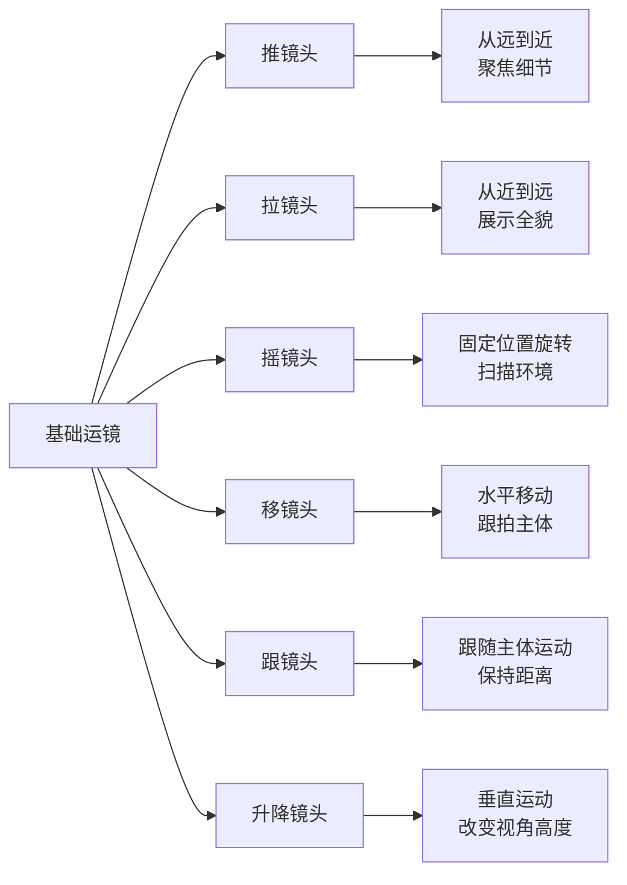
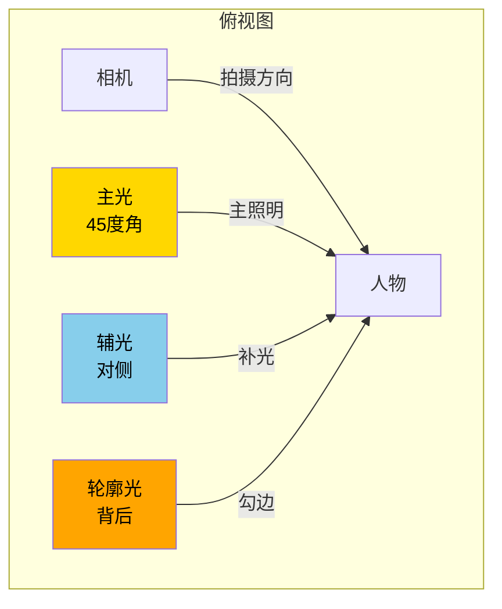

## 八、短视频拍摄与剪辑进阶技巧

内容策划决定了短视频的"灵魂"，而拍摄与剪辑技术则决定了它的"皮相"。在短视频平台上，用户的手指滑动速度极快——平均1.7秒就会决定是否继续观看。这意味着画面质感、镜头语言、剪辑节奏直接决定了内容能否被"看见"。本章从拍摄技术、灯光收音、剪辑方法、视觉包装四个维度，系统讲解短视频制作的进阶技巧，帮助你从"能拍"跨越到"拍好"。

### 8.1 手机拍摄参数设置与优化

#### 8.1.1 分辨率与帧率选择

分辨率和帧率是影响画面质量的两个核心参数，不同场景需要不同的组合策略：

| 参数组合 | 适用场景 | 优点 | 缺点 | 文件大小（1分钟） |
|---------|---------|------|------|-----------------|
| 1080P / 30fps | 日常Vlog、口播、教程 | 文件小，兼容性好 | 运动画面略有拖影 | 约150MB |
| 1080P / 60fps | 运动、舞蹈、快节奏内容 | 画面流畅，支持慢动作回放 | 文件较大，暗光表现略差 | 约250MB |
| 4K / 30fps | 产品展示、风景、高质量内容 | 画质极佳，后期裁剪空间大 | 文件巨大，上传压缩损失 | 约400MB |
| 4K / 60fps | 专业拍摄、商业广告 | 最高画质+最流畅 | 发热严重，存储消耗极大 | 约600MB |

**实操建议：**

- **抖音/快手日常内容**：1080P / 30fps 足够，平台会二次压缩，4K上传后画质差异不大
- **B站/YouTube高质量内容**：4K / 30fps，这些平台保留更多画质细节
- **需要慢动作回放的画面**：必须用 60fps 或更高帧率拍摄，后期降速才不会卡顿
- **弱光环境**：优先选 30fps，因为帧率越低，每帧曝光时间越长，暗光表现越好

**常见误区：** 很多新手盲目追求4K拍摄，但实际上传到平台后，4K视频会被压缩到1080P甚至720P，而且4K文件体积是1080P的4倍，导致剪辑卡顿、导出缓慢、占用大量存储。除非你需要后期大量裁剪画面，否则1080P是效率与质量的最佳平衡点。

#### 8.1.2 画幅比例与平台适配

不同平台对画幅有明确的偏好，选错画幅会直接影响推荐流量：

- **竖屏 9:16（1080×1920）**：抖音、快手、视频号、小红书的主流格式，全屏沉浸感强，适合个人创作者
- **横屏 16:9（1920×1080）**：B站、YouTube、西瓜视频的主流格式，适合教程、纪录片风格
- **方形 1:1（1080×1080）**：朋友圈、微博信息流，但短视频平台已很少使用
- **超宽屏 21:9**：电影感画面，适合高级叙事类内容，但上下黑边会损失展示面积

**关键技巧：** 如果你同时运营多个平台，建议拍摄时使用 16:9 横屏原始素材，后期通过剪辑软件裁切为 9:16 竖屏版本。这样同一个素材可以出两个版本，而且横屏裁切竖屏时可以通过调整画面位置实现"二次构图"，突出关键主体。

#### 8.1.3 对焦与曝光控制

专业感的画面需要精确控制对焦和曝光，而不是依赖手机的自动模式：

**手动对焦技巧：**
- 长按屏幕锁定对焦点（iPhone和安卓均支持"AE/AF锁定"）
- 口播类视频：对焦在眼睛位置，眼睛是最有表现力的区域
- 产品展示：对焦在产品核心卖点上，比如口红的质地、食物的纹理
- 转场拍摄：先对焦在近处物体，再手动切换到远处，利用焦点变化制造景深感

**手动曝光技巧：**
- 上下滑动屏幕调节曝光亮度（iOS在对焦框旁出现太阳图标）
- 宁欠勿过：稍微欠曝（暗一点）比过曝（亮一点）更好，因为暗部可以在后期提亮，但过曝的高光细节是无法恢复的
- 逆光场景：手动降低曝光，让人物面部正常曝光，背景过曝反而形成艺术效果

#### 8.1.4 HDR拍摄的正确使用

HDR（高动态范围）能同时保留亮部和暗部细节，但并非所有场景都适合开启：

**适合开启HDR的场景：**
- 室内人物面对窗户拍摄（室内暗+窗外亮的大光比场景）
- 阴天户外（天空与地面亮度差异大）
- 舞台灯光场景（聚光灯与暗区对比强烈）

**不适合开启HDR的场景：**
- 光线均匀的室内口播（HDR会增加处理负担，收益不大）
- 快速运动的画面（HDR合成可能导致运动物体出现"鬼影"）
- 后期需要大量调色的素材（HDR素材的调色曲线与SDR不同，增加后期难度）

**注意：** 部分旧款手机的HDR算法会导致画面出现不自然的"HDR感"——边缘发光、色彩失真。如果发现这种情况，建议关闭HDR，改用后期软件中的HDR效果来实现。

### 8.2 运镜手法与镜头语言

运镜是短视频区别于图文内容的核心竞争力。好的运镜能让普通场景变得有电影感，差的运镜则让优质内容显得业余。

#### 8.2.1 基础运镜六法

**推镜头（Zoom In / Dolly In）：**
- **含义：** 从远到近，引导观众注意力聚焦到某个细节
- **适用场景：** 产品特写、表情捕捉、关键信息强调
- **操作要点：** 移动身体向前走（物理推近），而非用手指捏屏幕放大（数码变焦会严重损失画质）。速度要匀速，不能忽快忽慢
- **实战案例：** 美食视频中，从餐桌全景推到一道菜的特写，再推到菜品上冒着热气的细节——层层递进，食欲感拉满

**拉镜头（Zoom Out / Dolly Out）：**
- **含义：** 从近到远，揭示环境或全貌
- **适用场景：** 开场展示环境、结尾收束画面、从细节到整体的叙事
- **操作要点：** 向后匀速退步，注意背后不要撞到东西（新手最常见的翻车场景）
- **实战案例：** 开头拍一双正在做手工的手，镜头缓缓拉远，揭示出整个工作台和满满的作品墙——"原来是个手工博主"

**摇镜头（Pan / Tilt）：**
- **含义：** 相机位置不动，上下或左右转动
- **适用场景：** 风景展示、环境介绍、从一个人物摇到另一个人物
- **操作要点：** 双手握稳手机，以腰部为轴心转动（不是手腕），保持匀速。如果需要精准控制，建议使用三脚架+手机夹
- **实战案例：** 旅游Vlog中，站在山顶从左到右摇一圈，360度展示山顶风景

**移镜头（Tracking Shot）：**
- **含义：** 相机水平移动，跟随或穿越场景
- **适用场景：** 跟拍行走、穿越走廊、展示空间
- **操作要点：** 步伐要小且稳，膝盖微曲吸收震动。如果预算允许，使用稳定器（如DJI OM系列）效果翻倍
- **实战案例：** 服装店探店视频，手持手机从门口走入店内，穿过一排排衣架，最终停在新品展示区

**跟镜头（Follow Shot）：**
- **含义：** 跟随主体运动，保持相对距离不变
- **适用场景：** 人物行走、宠物奔跑、车辆行驶
- **操作要点：** 跟拍时看屏幕构图而不是看路，所以要提前踩点排除障碍物。速度与被摄主体保持一致
- **实战案例：** 跟拍孩子在公园奔跑，始终保持孩子在画面中央偏左或偏右的位置，背景自然虚化

**升降镜头（Crane Shot / Jib）：**
- **含义：** 相机垂直运动，改变拍摄高度
- **适用场景：** 俯拍食物、仰拍建筑、从平视到俯瞰的视角变化
- **操作要点：** 手臂从低位举到高位，或蹲下再站起。动作要连贯，不要中途停顿
- **实战案例：** 开头蹲着拍桌面美食，缓缓站起变成俯拍，展示整桌宴席的全貌

#### 8.2.2 高级运镜组合

掌握了单个运镜后，可以将它们组合成更有叙事感的复合镜头：

**推+摇组合：** 一边向前走一边左右观察——模拟"走进一个空间四处打量"的主观视角，非常适合探店、看房、展会类内容。

**跟+升组合：** 跟拍主体行走，同时从低位逐渐升高——营造"逐渐揭示"的仪式感，适合产品发布、人物出场。

**移+推组合：** 平移穿越障碍物后推近到主体——"穿越式"运镜，电影感极强。比如穿过花丛推近到人脸，穿过货架推近到商品。

**实操建议：** 初学者不要贪多，先把"推、拉、跟"三个最常用的运镜练熟。每个运镜单独练习20次以上，确保能做到匀速、稳定、构图准确，再尝试组合。用稳定器可以降低80%的难度，推荐入门款：DJI OM 7（约800元）、智云Smooth 5（约600元）。

#### 8.2.3 转场技巧详解

转场是短视频中最能体现剪辑水平的环节。好的转场让画面切换自然流畅，差的转场让观众出戏：

**遮挡转场（最实用）：**
- 原理：画面被某个物体完全遮挡的瞬间切换到下一个场景
- 操作：用手掌、书本、衣服等遮住镜头，剪辑时在遮挡帧处切割，连接到下一个场景中同样从遮挡开始的画面
- 适用：换装视频、场景切换、时间跳跃
- 技巧：两个画面的遮挡物颜色和大小尽量接近，过渡更自然

**旋转转场（最炫酷）：**
- 原理：拍摄时快速旋转手机，在旋转模糊的瞬间切换
- 操作：拍摄结尾时快速向左旋转手机，下一段开头从快速向左旋转恢复到正常角度
- 适用：换装、变妆、场景突变
- 技巧：旋转方向要一致（都向左或都向右），速度要匹配

**甩镜转场（最丝滑）：**
- 原理：快速向一个方向甩动镜头，在运动模糊中切换
- 操作：拍摄结尾快速向右甩，下一段开头从左甩恢复到稳定
- 适用：快节奏剪辑、旅拍Vlog、多场景串联
- 技巧：甩动方向可以重复使用，形成节奏感。连续3-4个甩镜转场配合音乐节拍，效果炸裂

**匹配转场（最高级）：**
- 原理：利用两个画面中相似的形状、颜色或动作实现无缝过渡
- 操作：前一个画面结尾是一个圆形物体（如杯子），下一个画面开头也是一个圆形物体（如时钟），剪辑时在形状重合处切换
- 适用：创意短片、品牌广告、高级叙事
- 技巧：需要提前规划拍摄，在脚本阶段就设计好转场点

**实操工作流：** 拍摄转场素材时，每个转场动作至少拍3遍。第一遍找感觉，第二遍调细节，第三遍保底。剪辑时在剪映中使用"叠化"或"闪白"作为兜底转场，如果创意转场效果不好，还有后备方案。

### 8.3 构图法则与视觉设计

构图是拍摄的"骨架"，决定了画面是否好看、信息传达是否清晰。

#### 8.3.1 经典构图法则

**三分法构图（最基础也最实用）：**
将画面用两条横线和两条竖线均分为九宫格，将主体放在线条交叉点上。手机拍摄时打开"网格线"辅助（设置→相机→网格）。口播类视频将人物眼睛放在上方三分线位置；产品展示将产品放在交叉点上。

**对称构图（最适合建筑和空间）：**
利用场景中的对称元素，将对称轴放在画面中央。适合拍摄走廊、桥梁、建筑、桌面摆拍。对称构图天然给人"秩序感"和"高级感"。

**引导线构图（最适合风景和探店）：**
利用场景中的线条（道路、栏杆、河流、货架）将观众视线引导到主体上。引导线从画面角落延伸到中央主体，创造纵深感。

**框架构图（最适合人物和故事）：**
利用门框、窗户、树枝、拱门等元素形成"画中画"效果，将主体框在其中。框架构图能增加画面层次感，同时自然地将注意力集中在主体上。

**留白构图（最适合极简风和情绪表达）：**
大面积留白（天空、墙壁、纯色背景）+小面积主体。适合高级感产品展示、情绪类内容、文字叠加画面。留白区域可以放文字信息，兼具美观和实用。

#### 8.3.2 短视频构图的特殊考量

短视频构图与摄影构图有本质区别——需要考虑动态变化和平台特性：

- **主体偏上原则：** 短视频平台底部有文字、点赞按钮、评论区等UI元素，所以主体（尤其是人物面部）应该放在画面偏上1/3的位置，避免被UI遮挡
- **动态构图：** 视频是运动的，起始构图和结束构图可能完全不同。运镜过程中要持续关注构图变化，确保关键信息始终在"安全区域"内
- **字幕预留空间：** 画面下方1/4区域要留给字幕，不要在这个区域放重要信息
- **多平台适配：** 如果同一个素材要在竖屏和横屏平台使用，拍摄时将核心信息集中在画面中央区域，方便后期裁切

### 8.4 灯光与收音技术

#### 8.4.1 三点布光法详解

三点布光是影视行业最经典的灯光方案，由主光、辅光、轮廓光三个光源组成：

**主光（Key Light）：**
- 位置：放在人物前方45度角偏左或偏右，高度略高于人物头部
- 作用：提供主要照明，塑造面部立体感和明暗对比
- 强度：三个光源中最强，通常100%亮度
- 设备推荐：环形灯（100-300元，适合新手）、LED面板灯（300-800元，光线更可控）、柔光箱（200-500元，光线最柔和）

**辅光（Fill Light）：**
- 位置：放在主光对面，与主光对称放置
- 作用：消除主光产生的阴影，让暗部细节可见
- 强度：主光的50%-70%，不能比主光亮，否则面部会变成"大平脸"失去立体感
- 技巧：如果没有第二个灯，可以用白色泡沫板/白墙反射主光作为辅光（零成本方案）

**轮廓光（Back Light / Hair Light）：**
- 位置：放在人物后方偏上，从背后打向人物头部和肩膀
- 作用：在人物轮廓边缘形成一圈亮边，将人物从背景中"分离"出来
- 强度：主光的80%-120%，可以比主光稍亮
- 技巧：轮廓光最好用暖色调（色温3000K左右），与主光的冷白色形成冷暖对比，画面更有层次

#### 8.4.2 不同场景的灯光方案

**场景一：室内口播（最低成本方案）**

设备：一个环形灯（150元）+ 白墙
操作：面对窗户坐，环形灯放在手机后方正对人脸，背后白墙反射光线形成自然辅光。总成本150元，效果能打败80%的素人视频。

**场景二：产品展示（中等成本方案）**

设备：两个LED面板灯（600元）+ 柔光布（50元）+ 简易背景纸（30元）
操作：主光从左侧45度打向产品，辅光从右侧补光，柔光布蒙在灯前软化光线避免硬阴影。背景纸选择与产品对比色（浅色产品用深色背景，深色产品用浅色背景）。总成本约700元。

**场景三：美食拍摄（专业方案）**

设备：柔光箱（300元）+ 反光板（30元）+ LED灯带（50元）
操作：柔光箱从侧后方45度打光（模拟窗户自然光），正面用反光板补光，LED灯带放在桌面边缘营造氛围光。侧光能让食物表面的油脂、蒸汽、纹理更有质感——这就是为什么餐厅菜单照片总是侧面打光。总成本约400元。

#### 8.4.3 收音技术

短视频的画质可以妥协，但音质不能妥协——研究表明，观众对音质差的容忍度远低于画质差。模糊但清晰的声音比高清但嘈杂的画面更能留住观众。

**麦克风类型与选择：**

| 麦克风类型 | 价格区间 | 适用场景 | 推荐型号 | 核心优势 |
|-----------|---------|---------|---------|---------|
| 手机内置麦克风 | 0元 | 安静环境临时拍摄 | — | 零成本，随时可用 |
| 领夹麦克风 | 50-300元 | 口播、采访、Vlog | 罗德Wireless Go II（约1200元）、枫笛Blink500（约400元）、博雅MM1（约80元） | 隐藏性好，收音稳定 |
| 指向性麦克风 | 200-800元 | 户外拍摄、采访 | 罗德VideoMicro（约400元）、德仕BOYA BY-M1（约100元） | 降低环境噪音 |
| 枪式麦克风 | 300-2000元 | 专业拍摄、远距离收音 | 罗德NTG5（约3000元）、森海塞尔MKE600（约2000元） | 专业级音质 |
| USB电容麦 | 200-1500元 | 室内配音、播客 | 铁三角AT2020（约700元）、Blue Yeti（约900元） | 录音棚级音质 |

**收音实操要点：**
- 领夹麦别在衣领下方15cm处（胸口位置），太靠近嘴巴会有"喷麦"（气流声）
- 户外拍摄必须使用防风毛套（dead cat），风声是后期最难消除的噪音
- 录制前做5秒环境音采样，后期可以用降噪软件（如Adobe Audition的降噪功能）消除背景噪音
- 拍摄前关掉空调、风扇、冰箱等持续噪音源，这些噪音录进去后很难处理
- 如果同时录制多条素材，保持麦克风位置和增益设置不变，确保音量一致性

### 8.5 剪辑软件选择与核心工作流

#### 8.5.1 剪辑软件对比

| 软件 | 平台 | 价格 | 学习难度 | 核心优势 | 适合人群 |
|------|------|------|---------|---------|---------|
| 剪映/CapCut | 手机+电脑 | 免费 | ★★☆☆☆ | 模板丰富，一键成片，AI功能强 | 新手、快速出片 |
| VN视频剪辑 | 手机 | 免费 | ★★★☆☆ | 关键帧动画，专业级手机剪辑 | 手机专业剪辑 |
| Premiere Pro | 电脑 | 约150元/月 | ★★★★☆ | 行业标准，插件生态丰富 | 专业创作者 |
| Final Cut Pro | Mac | 一次性约1500元 | ★★★☆☆ | 苹果生态优化，渲染速度快 | Mac用户 |
| DaVinci Resolve | 电脑 | 免费版功能完整 | ★★★★★ | 调色功能业界顶级 | 调色需求高的创作者 |
| CapCut桌面版 | 电脑 | 免费 | ★★☆☆☆ | 免费且功能接近PR | 预算有限的专业需求 |

**选择建议：**
- 0-1万粉丝阶段：用剪映手机版就够了，模板和AI功能能帮你快速出片
- 1万-10万粉丝阶段：剪映桌面版或CapCut桌面版，开始学习关键帧、调色、多轨道剪辑
- 10万粉丝以上：Premiere Pro或Final Cut Pro，需要更精细的控制和更丰富的特效
- 需要高质量调色：DaVinci Resolve（免费版即可满足99%需求）

#### 8.5.2 短视频剪辑工作流（以剪映为例）

一个完整的短视频剪辑工作流包括以下步骤：

**第一步：素材整理（5分钟）**
- 将拍摄素材导入剪映，按拍摄顺序排列
- 标记可用素材（在好的片段上做标记），删除明显废片
- 将素材分为"必用"和"备选"两类

**第二步：粗剪（10分钟）**
- 按脚本顺序将素材拖入时间线
- 切掉每个片段的开头和结尾多余部分（通常各2-3秒）
- 确定视频的整体时长和节奏框架

**第三步：精剪（15分钟）**
- 逐帧调整剪辑点，确保每个切换都卡在动作或节奏点上
- 添加转场效果（优先使用"叠化"和"无转场硬切"，少用花哨转场）
- 调整片段播放速度：关键动作慢放（0.5x），过渡段快进（1.5-2x）

**第四步：音频处理（10分钟）**
- 添加背景音乐，调整音量（BGM通常是人声的20%-30%）
- 在剪辑点添加音效（whoosh、pop、ding等）
- 检查人声清晰度，必要时添加降噪

**第五步：字幕添加（10分钟）**
- 使用剪映的"智能字幕"自动生成字幕（准确率约95%）
- 逐句校对错别字和断句
- 为关键词添加高亮色或放大效果

**第六步：视觉包装（5分钟）**
- 添加片头/片尾模板
- 在关键信息处添加文字注释或箭头指引
- 统一调色风格（使用滤镜或手动调色）

**第七步：导出与检查（3分钟）**
- 导出设置：1080P、30fps、码率选择"推荐"或"高"
- 完整观看一遍导出成品，检查是否有跳帧、音画不同步、字幕错误
- 发布前在手机上预览，确认竖屏构图和字幕位置正确

#### 8.5.3 剪辑节奏控制——黄金法则

剪辑节奏是短视频的"呼吸"，节奏错了，再好的内容也留不住人：

**前3秒法则：**
- 前3秒必须出现最强钩子——问题、冲突、悬念、视觉冲击
- 不能有任何铺垫、自我介绍、片头动画
- 数据支撑：抖音数据显示，前3秒流失率高达65%，能撑过3秒的用户有40%会看完

**3-5秒法则：**
- 每3-5秒必须有一个"变化点"——画面切换、信息更新、情绪转变
- 如果一个镜头超过5秒没有任何变化，观众的注意力就会开始衰退
- 实操：口播类视频每3-5秒切一次景别（全景→中景→特写→中景循环）

**结尾引导法则：**
- 不要"自然结束"，要有明确的收尾动作
- 三种有效结尾：①总结金句+引导关注 ②悬念预告下期 ③互动提问（"你们觉得呢？"）
- 结尾停留1-2秒给观众点赞/关注的时间，不要说完就立刻黑屏

**不同内容类型的时长参考：**

| 内容类型 | 推荐时长 | 节奏特点 | 典型剪辑频率 |
|---------|---------|---------|------------|
| 搞笑/段子 | 15-30秒 | 快节奏，笑点密集 | 每2-3秒切一次 |
| 知识科普 | 30-60秒 | 中等节奏，信息密度高 | 每3-5秒切一次 |
| 教程/干货 | 1-3分钟 | 稍慢，但每步要清晰 | 每5-8秒切一次 |
| Vlog/生活 | 3-5分钟 | 舒缓，叙事感强 | 每5-10秒切一次 |
| 产品评测 | 2-4分钟 | 信息驱动，节奏均匀 | 每4-6秒切一次 |

### 8.6 字幕设计与视觉包装

#### 8.6.1 字幕设计规范

字幕不是"加上就行"，而是视觉设计的重要组成部分：

**字体选择原则：**
- 首选无衬线字体（思源黑体、阿里巴巴普惠体、HarmonyOS Sans），清晰易读
- 避免花体字、艺术字、手写体作为正文字幕（可以用于标题强调）
- 中英文混排时，英文字体要与中文字体风格统一

**字号与排版：**
- 竖屏视频：正文字幕不小于40px（在1080×1920画布上），标题不小于60px
- 横屏视频：正文字幕不小于30px
- 每行字幕不超过14个汉字，超过就换行
- 字幕底部与画面底边保持80-100px间距，避免被平台UI遮挡

**关键词高亮技巧：**
- 用亮黄色（#FFD700）或亮红色（#FF4444）高亮关键词
- 关键词可以放大到正文字号的1.3倍
- 数字、价格、品牌名、核心概念都需要高亮
- 不要全句高亮——如果都是重点，就没有重点了

**字幕动画：**
- 入场动画：弹入、逐字显示、渐显（推荐逐字显示，有"打字机"效果，增加信息期待感）
- 持续时间：每条字幕显示时间与语音同步，留0.2-0.3秒的视觉缓冲
- 退出动画：快速淡出即可，不要用太花哨的退场效果

#### 8.6.2 调色基础

调色是让视频从"手机拍的"变成"专业拍的"的关键一步：

**基础调色三步法：**

1. **调整曝光和对比度：** 确保画面亮度适中，暗部不死黑，亮部不过曝。对比度稍微提高（+10%-20%），让画面更有层次
2. **调整色温：** 暖色调（偏黄）给人温馨、食欲、亲切的感觉；冷色调（偏蓝）给人专业、科技、冷静的感觉。根据内容类型选择合适的色温基调
3. **调整饱和度：** 食物、风景、美妆类内容可以适当提高饱和度（+10%-30%），让颜色更鲜艳；知识类、商务类内容可以降低饱和度（-10%-20%），显得更专业

**不同内容类型的调色风格：**
- 美食类：暖色调、高饱和度、高对比度——让食物看起来更有食欲
- 美妆类：高亮度、偏粉暖色、适度饱和——让皮肤看起来更好
- 科技类：冷色调、低饱和度、高对比度——专业感和未来感
- 生活Vlog：日系清新风——低对比度、偏青绿色、柔和光线
- 知识口播：中性色温、适度对比、清晰自然——不要让调色分散注意力

**实用技巧：** 在剪映中，可以直接使用滤镜作为调色起点，然后微调参数。推荐的滤镜系列：「清新」系列适合日常Vlog，「胶片」系列适合复古风，「美食」系列专门优化了食物色彩。选定一个滤镜后，所有视频保持相同风格，形成个人视觉品牌。

#### 8.6.3 音效设计

音效是短视频中最被低估的元素。恰当的音效能让画面"活"起来：

**音效分类与使用场景：**

| 音效类型 | 具体音效 | 使用场景 | 获取渠道 |
|---------|---------|---------|---------|
| 转场音效 | Whoosh、Swoosh、滑动声 | 画面切换、运镜过渡 | 剪映音效库免费 |
| 强调音效 | Pop、Ding、叮咚 | 关键信息出现、文字弹出 | 剪映音效库免费 |
| 环境音效 | 鸟叫、风声、人群嘈杂 | 增加场景真实感 | 自然录制或音效库 |
| 情绪音效 | 心跳、鼓点、惊讶音效 | 悬念、紧张、搞笑瞬间 | 剪映音效库 |
| 反馈音效 | 滑动声、点击声、通知声 | 模拟手机操作、信息展示 | 剪映音效库 |

**音量层级设计：**
- 人声（口播/旁白）：0dB 到 -6dB（最大声的部分）
- 音效：-12dB 到 -18dB（辅助人声，不能盖过人声）
- 背景音乐：-18dB 到 -24dB（最低层，营造氛围但不干扰信息传达）

**剪映内置音效使用技巧：**
- 在"音频→音效"中搜索关键词即可找到海量免费音效
- 音效的时长要精确匹配画面动作——比如文字弹出的瞬间配上"pop"声，时间误差不超过0.1秒
- 同一个视频中不要使用超过5种不同类型的音效，否则会显得杂乱

### 8.7 特殊拍摄技法

#### 8.7.1 延时摄影与Hyperlapse

**延时摄影（Timelapse）：**
- 原理：以较低帧率（如每秒1帧）拍摄，播放时以正常速度播放，实现"时间压缩"效果
- 适用场景：日出日落、花开、食物制作过程、城市车流、云层移动
- 拍摄要点：手机固定在三脚架上不能动，关闭自动曝光和自动白平衡（否则画面会忽明忽暗闪烁），整个拍摄过程保持参数不变
- 时长参考：拍摄30分钟素材 → 压缩为10-15秒视频

**Hyperlapse（移动延时）：**
- 原理：边移动边拍摄延时，画面既有时间压缩又有空间移动
- 适用场景：走路穿越城市、沿街道行走、景区游览
- 拍摄要点：每走一步拍一帧，保持手机高度和朝向一致。开启手机的网格线作为参考线，确保水平线不歪
- 稳定技巧：后期用剪映的"防抖"功能二次稳定，效果接近专业稳定器

#### 8.7.2 慢动作拍摄

**拍摄设置：**
- iPhone：设置→相机→录制慢动作→1080P/240fps（1秒拍摄 = 8秒播放）
- 安卓：相机→更多→慢动作，或专业模式手动设置高帧率

**适用场景：**
- 美食：液体倒入杯中、芝士拉丝、刀切食物的瞬间
- 运动：跳跃、旋转、击球的瞬间
- 创意：头发飘动、布料飞舞、墨水扩散
- 转场：慢动作画面天然适合做两个快节奏镜头之间的"呼吸点"

**后期处理技巧：**
- 原始素材是60fps，可以在剪映中选择0.5x速度变成30fps的流畅慢动作
- 如果需要更慢（如0.25x），则需要拍摄120fps或240fps的素材
- 慢动作片段的前后要各留0.5秒的正常速度作为过渡，否则突然变速会很突兀

#### 8.7.3 第一视角拍摄（POV）

POV（Point of View）拍摄能让观众产生强烈的代入感：

**设备选择：**
- 手持：直接手持手机，但要注意手部不要抖动太大
- 胸挂支架：GoPro胸挂支架（约100元），解放双手，视角更稳定
- 头戴支架：适合需要双手操作的场景（如烹饪、手工、维修）

**适用场景：**
- 烹饪教程：第一视角展示切菜、炒菜的过程
- 探店Vlog：走进店铺，第一视角浏览商品
- 工作展示：程序员写代码、设计师画图、手工制作过程
- 体验分享：游乐设施、运动项目、新奇体验

### 8.8 新手常见错误与纠正

#### 8.8.1 拍摄常见错误

| 错误 | 具体表现 | 后果 | 纠正方法 |
|------|---------|------|---------|
| 逆光拍摄 | 面部全黑，背景过亮 | 观众看不清人，直接划走 | 面向窗户/灯光，或用补光灯 |
| 画面抖动 | 手持不稳，走路拍摄晃 | 观众头晕，体验极差 | 使用稳定器或三脚架 |
| 背景杂乱 | 身后堆满杂物、电线 | 显得不专业，分散注意力 | 简化背景或使用背景布 |
| 构图太满 | 人物头顶紧贴画面上边缘 | 视觉压迫感强，不舒适 | 头顶留出10%-15%空间 |
| 噪点过多 | 暗光环境下画面颗粒感重 | 画质低劣，观感差 | 增加灯光，或降低分辨率换更好暗光表现 |
| 竖屏拍横屏 | 手机竖着拍横屏内容 | 两侧大黑边，浪费画面 | 拍之前确认画幅设置 |

#### 8.8.2 剪辑常见错误

| 错误 | 具体表现 | 后果 | 纠正方法 |
|------|---------|------|---------|
| 转场过多 | 每个切换都用花式转场 | 眼花缭乱，注意力疲劳 | 80%用硬切或叠化，20%用特效转场 |
| BGM太响 | 背景音乐盖过人声 | 听不清说话内容，直接划走 | BGM音量降到人声的20%-30% |
| 节奏拖沓 | 长时间无变化的静态画面 | 观众注意力流失 | 每3-5秒制造一个变化点 |
| 字幕遮挡 | 字幕盖住人脸或关键信息 | 信息传达受阻 | 字幕放在画面下方安全区域 |
| 时长过长 | 3分钟能说完的事做了8分钟 | 完播率暴跌 | 每句话问自己"删掉后内容是否完整" |
| 音画不同步 | 嘴型和声音对不上 | 显得不专业 | 精确对齐音视频轨道 |

#### 8.8.3 进阶错误（已有一定经验的创作者）

- **过度依赖模板：** 剪映模板确实好用，但大量使用同一模板会导致内容同质化，观众审美疲劳。模板只作为灵感参考，关键剪辑点要自己设计
- **忽视音频设计：** 把所有精力放在画面上，音效和BGM随便配。好的音频设计能让完播率提升15%-25%
- **调色过度：** 饱和度拉满、滤镜叠加使用，导致画面失真。调色的目标是"自然地好看"，而不是"一看就调过色"
- **不看数据：** 剪辑风格固定不变，不根据数据反馈调整。通过抖音创作者后台的"视频数据→观众留存曲线"，找到观众流失的节点，分析是内容问题还是剪辑节奏问题

### 8.9 设备推荐与预算方案

#### 8.9.1 入门方案（总预算500元以内）

| 设备 | 推荐型号 | 预算 |
|------|---------|------|
| 手机 | 现有手机即可（iPhone 12以上/安卓骁龙870以上） | 0元 |
| 三脚架 | 手机桌面三脚架（可伸缩） | 30-50元 |
| 补光灯 | 环形补光灯（10寸） | 80-150元 |
| 麦克风 | 领夹麦克风（有线） | 30-80元 |
| 背景 | 纯色背景布+夹子 | 20-50元 |
| 剪辑软件 | 剪映（免费） | 0元 |
| **合计** | | **160-330元** |

这个方案适合刚起步的创作者，能覆盖口播、产品展示、简单Vlog的需求。画质和音质能打败90%不重视设备的竞品。

#### 8.9.2 进阶方案（总预算2000-5000元）

| 设备 | 推荐型号 | 预算 |
|------|---------|------|
| 手机稳定器 | DJI OM 7 / 智云Smooth 5 | 600-900元 |
| 补光灯 | 双LED面板灯套装 | 300-600元 |
| 麦克风 | 无线领夹麦克风（罗德Wireless Go II / 枫笛Blink500 Pro） | 400-1200元 |
| 三脚架 | 手机+相机两用三脚架（带液压云台） | 200-400元 |
| 背景系统 | 可折叠背景板+背景支架 | 100-300元 |
| 剪辑软件 | 剪映桌面版（免费）或 CapCut Pro | 0-200元/月 |
| **合计** | | **1600-3600元** |

这个方案适合有一定粉丝基础、开始接到商单的创作者。稳定器大幅提升运镜质量，无线麦克风保证户外收音，双灯系统实现三点布光。

#### 8.9.3 专业方案（总预算1万-3万元）

| 设备 | 推荐型号 | 预算 |
|------|---------|------|
| 相机 | Sony ZV-E10 / A6400 / 富士X-S20 | 4000-8000元 |
| 镜头 | 适马30mm F1.4（人像虚化）/ 16-50mm套头 | 1500-3000元 |
| 稳定器 | DJI RS 3 Mini / 智云Weebill 3 | 1500-2500元 |
| 灯光 | 专业LED灯×2 + 柔光箱 + 反光板 | 1000-3000元 |
| 麦克风 | 罗德NTG5枪麦 + Wireless Go II | 2000-4000元 |
| 剪辑软件 | Premiere Pro + DaVinci Resolve（免费版） | 150元/月 |
| **合计** | | **10000-25000元** |

这个方案适合全职内容创作者或小型工作室。相机的画质、景深控制、暗光表现远超手机，是内容差异化的重要手段。

### 8.10 AI工具赋能短视频制作

2024年以来，AI工具正在深度改变短视频制作流程：

**AI字幕生成：** 剪映的"智能字幕"功能准确率已达95%以上，支持中英双语，还能自动识别说话人。原本需要1小时的字幕工作，现在2分钟搞定。

**AI配音：** 不想露脸或不方便录音时，剪映的AI配音（文本服務）提供数十种自然人声。知识类博主常用"男声-磁性"或"女声-温柔"的AI配音，效果已经接近真人。

**AI脚本生成：** 使用ChatGPT或Kimi生成短视频脚本框架——输入主题，输出开头钩子、中间内容结构、结尾引导的完整脚本。但务必人工调整，AI生成的脚本缺乏个人风格和真实案例。

**AI画面生成：** Midjourney、DALL-E、Stable Diffusion可以生成短视频中需要的插图、背景、概念图。特别适合知识类视频中需要视觉辅助但没有实拍素材的场景。

**AI剪辑：** 剪映的"一键成片"功能可以根据素材自动生成剪辑方案。虽然成品需要人工微调，但能大幅缩短粗剪时间。

**AI去水印/换背景：** CapCut的"智能抠像"功能可以一键去除视频背景，不需要绿幕就能实现背景替换。适合在家拍摄但想要专业背景的创作者。

**使用建议：** AI工具是"加速器"而不是"替代者"。用AI提高效率（字幕、脚本、粗剪），但最终的创意、节奏、风格必须由人来把控。过度依赖AI会导致内容同质化，失去个人特色。

***

**本节要点回顾：**

1. 拍摄参数根据平台和内容类型选择，不要盲目追求4K
2. 运镜六法（推拉摇移跟升降）是基础功，先练熟再组合
3. 构图遵循三分法，同时考虑短视频平台的UI遮挡和字幕预留
4. 灯光用三点布光法，最低150元的环形灯就能大幅提升画质
5. 音质比画质更重要，领夹麦克风是性价比最高的收音投资
6. 剪辑节奏遵循"前3秒钩子 + 中间每3-5秒变化 + 结尾引导"法则
7. 字幕、调色、音效是视觉包装的三大支柱
8. AI工具能大幅提高制作效率，但创意和风格必须由人把控
9. 设备投入分阶段升级，500元入门方案就能打败大多数竞品
