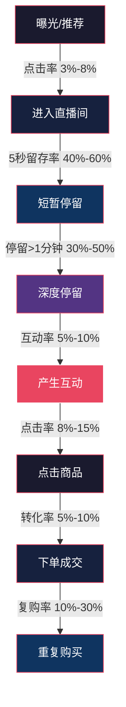
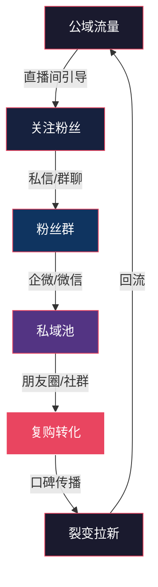

## 九、直播间进阶运营策略

当直播间完成冷启动、跑通基础变现模型后，想要突破增长瓶颈、实现规模化盈利，就需要从"会播"进阶到"懂运营"。进阶运营的核心不是学更多话术，而是建立**数据驱动的系统化运营体系**——用数据发现问题、用策略解决问题、用流程固化经验。

本节面向已经稳定开播3个月以上、月GMV稳定在1万以上的主播和运营团队，系统讲解从"能卖货"到"持续赚大钱"的进阶路径。

### 9.1 数据化运营：从感觉驱动到数据驱动

#### 9.1.1 直播核心数据指标体系

进阶运营的第一步是建立完整的数据监控体系。以下是直播间必须关注的核心指标及其健康基准值：

| 指标分类 | 具体指标 | 计算公式 | 健康基准值 | 异常信号 |
|---------|---------|---------|-----------|---------|
| 流量指标 | 场观（总观看人数） | 直播间累计UV | 因账号体量而异 | 连续3场下降>20% |
| 流量指标 | 峰值在线人数 | 同时在线最高值 | 场观的5%-15% | 峰值过低说明留人能力差 |
| 流量指标 | 平均在线人数 | 总观看时长÷直播时长 | 峰值的30%-50% | 均值与峰值差距过大说明留存差 |
| 留存指标 | 平均停留时长 | 用户总停留÷UV | >1分钟（及格），>3分钟（优秀） | <30秒说明内容吸引力不足 |
| 留存指标 | 5秒留存率 | 停留>5秒的用户÷UV | >40% | <25%需优化直播间视觉和开场 |
| 互动指标 | 互动率 | （评论+点赞+分享）÷UV | >5% | <2%说明互动引导不足 |
| 互动指标 | 评论率 | 评论人数÷UV | >2% | <1%说明缺乏互动话术设计 |
| 转化指标 | 点击率（CTR） | 商品点击÷UV | >8% | <3%说明选品或展示有问题 |
| 转化指标 | 转化率（CVR） | 成交人数÷商品点击人数 | >5% | <2%说明话术或价格竞争力不足 |
| 转化指标 | 千次观看成交额（GPM） | GMV÷（场观÷1000） | >500元 | <200元说明变现效率低 |
| 转化指标 | 客单价（ATV） | GMV÷成交笔数 | 因品类而异 | 连续下降需调整选品策略 |
| 粉丝指标 | 新增关注率 | 新增粉丝÷UV | >3% | <1%说明缺乏关注引导 |
| 粉丝指标 | 粉丝成交占比 | 粉丝成交÷总成交 | 15%-40%为健康 | >60%说明拉新能力不足 |

**数据复盘模板：** 每场直播结束后，按以下结构进行复盘：

```markdown
## 直播复盘报告 - [日期] [时段]

### 一、核心数据概览
| 指标 | 本场 | 上场 | 变化 | 目标值 |
|------|------|------|------|--------|
| 场观 | - | - | -% | - |
| 峰值在线 | - | - | -% | - |
| 平均停留 | - | - | -% | - |
| 互动率 | - | - | -% | - |
| GMV | - | - | -% | - |
| GPM | - | - | -% | - |
| 转化率 | - | - | -% | - |

### 二、流量来源分析
- 自然推荐：XX%（变化）
- 关注页：XX%（变化）
- 搜索：XX%（变化）
- 付费投流：XX%（变化）
- 短视频引流：XX%（变化）

### 三、关键时段分析
- 流量高峰：[时间段]，触发原因：[分析]
- 流量低谷：[时间段]，触发原因：[分析]
- 转化高峰：[时间段]，对应商品：[分析]

### 四、问题诊断与改进
| 问题 | 数据表现 | 根因分析 | 改进措施 | 执行责任人 |
|------|---------|---------|---------|-----------|
| - | - | - | - | - |

### 五、下场直播调整计划
- 选品调整：
- 话术优化：
- 时段调整：
- 投流策略：
```

#### 9.1.2 数据分析的五个关键维度

**维度一：流量漏斗分析**

直播间运营本质上是一个漏斗模型，每个环节都有转化损耗：



**漏斗优化原则：从最薄弱的环节开始。** 如果5秒留存率只有20%，不要急着优化转化率——用户根本没留下来，再好的话术也没用。先解决"留人"问题，再解决"卖货"问题。

**维度二：时段分析**

不同时段的用户画像和消费能力差异巨大：

| 时段 | 用户特征 | 适合品类 | 流量成本 | 竞争程度 |
|------|---------|---------|---------|---------|
| 6:00-9:00 | 早起人群，决策快 | 食品、日用品、养生 | 低 | 低 |
| 9:00-12:00 | 宝妈、退休人群 | 母婴、家居、食品 | 中低 | 中 |
| 12:00-14:00 | 午休白领 | 美妆、服饰、零食 | 中 | 中 |
| 14:00-18:00 | 自由职业、学生 | 服饰、数码、文具 | 中低 | 中 |
| 18:00-20:00 | 下班通勤 | 快消品、日用品 | 中高 | 高 |
| 20:00-23:00 | 黄金时段，全人群 | 全品类 | 高 | 极高 |
| 23:00-2:00 | 夜猫子，冲动消费 | 零食、娱乐、情感 | 中 | 低 |

**实操建议：** 不要盲目抢黄金时段。新号或中小号在竞争低谷时段（如早晨、深夜）开播，反而更容易获得平台推荐流量。等到账号权重提升后，再逐步切入黄金时段。

**维度三：商品数据矩阵分析**

用"曝光量×转化率"建立商品四象限：

| 象限 | 特征 | 策略 |
|------|------|------|
| 高曝光+高转化 | 明星款 | 加大库存，延长讲解时间，作为直播间标签 |
| 高曝光+低转化 | 潜力款 | 优化话术、价格、展示方式，给3次机会后淘汰 |
| 低曝光+高转化 | 遗珠款 | 增加讲解频次，优化排品位置，加大投流 |
| 低曝光+低转化 | 淘汰款 | 直接下架，腾出坑位给新品 |

**维度四：用户画像分析**

通过后台数据，深入分析成交用户的画像特征：

- **性别比例**：决定话术风格和选品方向
- **年龄分布**：决定价格带和品牌选择
- **地域分布**：决定物流策略和地域化选品
- **活跃时段**：决定开播时间
- **消费层级**：决定客单价区间

**维度五：竞品对标分析**

定期监控3-5个同品类头部直播间，记录以下数据：

```markdown
## 竞品直播间对标记录

### 竞品1：[直播间名称]
- 开播时间：
- 直播时长：
- 预估场观：
- 主推品类：
- 客单价区间：
- 引流方式：
- 话术特点：
- 场景风格：
- 可借鉴点：
- 差异化机会：
```

### 9.2 流量运营：突破自然流量天花板

#### 9.2.1 平台推荐流量的获取逻辑

各平台的推荐算法虽然细节不同，但核心逻辑一致：**平台会把流量分配给能创造更多平台价值的直播间。** 平台价值体现在三个维度：

1. **用户时长价值**：用户在你的直播间停留越久，平台的广告展示机会越多
2. **交易价值**：GMV越高，平台的佣金和广告收入越多
3. **内容价值**：优质内容吸引更多用户留在平台

因此，获取推荐流量的本质是提升这三个维度的表现。具体策略如下：

**提升用户时长价值：**
- 设计"钩子"节奏：每3-5分钟设置一个留住用户的理由（福利预告、悬念揭晓、互动游戏）
- 分段式直播结构：将2小时直播拆分为4-6个"小节目"，每个有独立主题和高潮
- 弹幕互动设计：设计需要用户打字参与的互动环节（如"扣1投票""打价格猜猜猜"）

**提升交易价值：**
- 优化GPM（千次观看成交额）：这是平台最关注的交易效率指标
- 合理排品：引流款拉人气→利润款做转化→福利款做互动→形象款做信任
- 控制讲解节奏：每个品5-15分钟，避免冗长讲解导致用户流失

**提升内容价值：**
- 差异化内容：不做千篇一律的叫卖，加入专业知识分享、使用场景演示、用户故事讲述
- 优质画面：灯光、布景、画质达到专业水准
- 稳定开播：固定时段、固定时长，培养用户观看习惯

#### 9.2.2 短视频引流矩阵

进阶运营不能只靠直播间本身拉流量，需要建立短视频引流矩阵：

```mermaid
graph LR
    A[短视频引流矩阵] --> B[预热视频]
    A --> C[切片视频]
    A --> D[种草视频]
    A --> E[人设视频]
    
    B --> B1[直播前2-4小时发布]
    B --> B2[预告福利和爆品]
    B --> B3[制造期待感]
    
    C --> C1[直播精彩片段剪辑]
    C --> C2[展示直播间氛围]
    C --> C3[引导"正在直播"标签]
    
    D --> D1[产品使用教程]
    D --> D2[效果对比展示]
    D --> D3[引导进直播间下单]
    
    E --> E1[幕后花絮]
    E --> E2[个人故事]
    E --> E3[增强粉丝黏性]
    
    style A fill:#e94560,stroke:#fff,color:#fff
```

**短视频引流的具体执行标准：**

| 视频类型 | 发布频率 | 最佳时长 | 发布时间 | 核心目标 |
|---------|---------|---------|---------|---------|
| 预热视频 | 每场直播前1-2条 | 15-30秒 | 开播前2-4小时 | 预告福利，引导预约 |
| 切片视频 | 每天1-2条 | 30-60秒 | 直播后1小时内 | 展示氛围，引流回放 |
| 种草视频 | 每周2-3条 | 1-3分钟 | 用户活跃时段 | 产品种草，建立信任 |
| 人设视频 | 每周1条 | 1-5分钟 | 任意时段 | 强化人设，增加黏性 |

#### 9.2.3 付费投流的进阶策略

当自然流量遇到天花板时，付费投流是突破的关键手段。进阶投流不是盲目砸钱，而是精细化的ROI管理。

**投流工具对比：**

| 工具 | 适用平台 | 计费方式 | 适用场景 | 起投门槛 |
|------|---------|---------|---------|---------|
| 千川（巨量千川） | 抖音 | OCPM/CPC | 直播间投流、短视频引流 | 300元/天 |
| 磁力金牛 | 快手 | OCPM/CPC | 直播间加热、涨粉 | 100元/天 |
| 腾讯广告 | 视频号 | OCPM/CPC | 视频号直播推广 | 300元/天 |
| DOU+ | 抖音 | 按曝光 | 短视频加热、直播间引流 | 100元/次 |

**进阶投流的四阶段模型：**

**第一阶段：测试期（第1-3天）**
- 目标：找到有效的素材和人群包
- 预算：每天200-500元
- 策略：多计划小预算跑，每个计划50-100元
- 变量测试：同时测试3-5个不同素材、3-5个人群定向
- 判断标准：ROI>1.5的计划保留，ROI<1的直接关停

**第二阶段：放量期（第4-7天）**
- 目标：放大有效计划的消耗
- 预算：每天500-2000元
- 策略：对测试期表现好的计划逐步加预算（每次加20%-30%）
- 注意事项：不要一次性大幅加预算，容易导致模型崩溃

**第三阶段：稳定期（第2-4周）**
- 目标：稳定ROI，持续放量
- 预算：根据ROI弹性调整
- 策略：保持3-5条主力计划在跑，定期补充新计划
- 关键动作：每天分析数据，及时关停衰退计划

**第四阶段：优化期（长期）**
- 目标：持续优化素材和人群，降低获客成本
- 策略：每周更新2-3组素材，避免素材疲劳；定期拓展新人群包

**投流ROI计算公式：**

```text
投流ROI = 投流带来的GMV ÷ 投流费用

盈亏平衡ROI = 1 ÷ (1 - 退货率) ÷ (1 - 平台佣金率 - 产品成本率)

示例：
- 退货率15%，平台佣金5%，产品成本率40%
- 盈亏平衡ROI = 1 ÷ 0.85 ÷ 0.55 ≈ 2.14
- 即投流ROI必须 > 2.14 才能盈利
```

#### 9.2.4 私域流量沉淀

进阶运营必须建立私域流量池，降低对平台公域流量的依赖：



**私域沉淀的关键动作：**

1. **直播间→粉丝群**：每场直播中引导加入粉丝群（"加入粉丝群领专属优惠券"）
2. **粉丝群→企微/微信**：在粉丝群定期发布"加微信领福利"活动
3. **私域运营节奏**：
   - 每天：朋友圈发布1-2条（产品种草、使用心得、限时福利）
   - 每周：社群活动1-2次（秒杀、抽奖、晒单返现）
   - 每月：私域专属直播1次（只有私域用户知道的低价）

### 9.3 排品策略与节奏控制

#### 9.3.1 进阶排品模型

基础排品是"引流款→利润款→福利款"的简单轮转。进阶排品需要根据直播节奏、流量波动、用户画像动态调整。

**波浪式排品法：**

将整场直播划分为多个"波浪周期"，每个周期30-45分钟：

```text
第1个波浪（0-45分钟）：开场蓄水→爆发→回落
  0-10分钟：福利款开场（拉人气、拉互动）
  10-25分钟：利润款A（主推品，详细讲解）
  25-35分钟：利润款B（关联品，连带销售）
  35-45分钟：福利款过渡（留住用户，为下一波蓄水）

第2个波浪（45-90分钟）：第二波爆发
  45-55分钟：形象款（提升信任，展示专业度）
  55-70分钟：利润款C（高客单价品，核心转化）
  70-80分钟：引流款（拉新用户，保持在线人数）
  80-90分钟：利润款D（趁热打铁，快速转化）

第3个波浪（90-120分钟）：收尾冲刺
  90-100分钟：爆品返场（用户呼声最高的品）
  100-110分钟：利润款E（最后一波转化）
  110-120分钟：福利款收尾（制造下次开播期待）
```

**排品的核心原则：**

| 原则 | 说明 | 示例 |
|------|------|------|
| 先聚人再卖货 | 开场用福利款/互动拉在线人数，等人气上来再推利润款 | 开播前10分钟只做互动和福利 |
| 张弛有度 | 紧张的逼单环节后，安排轻松的互动或福利环节 | 秒杀后安排抽奖，让用户喘口气 |
| 价格阶梯 | 相邻两个品的价格差距不超过3倍 | 99元品后不要直接上899元品 |
| 关联推荐 | 有使用关联的品排在一起 | 洗面奶后接爽肤水，裙子后接腰带 |
| 黄金时段推爆品 | 在线人数最高的时段推核心利润款 | 观察实时在线曲线，峰值时推主推品 |

#### 9.3.2 单品讲解的SOP流程

每个单品的讲解不是即兴发挥，而是有标准流程的：

```text
单品讲解SOP（总时长8-15分钟）

阶段1：造势（1-2分钟）
├── 制造期待："接下来这个品，是我准备了很久的重磅福利"
├── 用户痛点："你们有没有遇到过XXX的问题？"
└── 互动预热："想要的扣'想要'，人多我就上链接"

阶段2：展示（3-5分钟）
├── 产品展示：360度展示，特写镜头
├── 功能演示：实际使用效果，对比展示
├── 卖点强调：核心卖点说3遍，用不同方式表达
└── 信任背书：品牌故事、销量数据、用户评价

阶段3：逼单（2-4分钟）
├── 价格锚定："外面卖XXX，我们直播间只要XXX"
├── 赠品策略："买一送三，赠品价值超过主品"
├── 限时限量："只有100单，抢完恢复原价"
├── 从众引导："已经有XX人下单了，库存只剩XX"
└── 零风险承诺："7天无理由退，运费险我们出"

阶段4：成交（1-2分钟）
├── 步骤引导："点下方小黄车，第X号链接"
├── 问题解答：快速回复弹幕中的购买疑问
└── 催付提醒："下了单的截图发弹幕，抽免单"

阶段5：过渡（1分钟）
├── 感谢下单："谢谢所有下单的宝子们"
├── 预告下一品："下一个品更炸，千万不要走开"
└── 互动缓冲：回答弹幕问题，拉近关系
```

### 9.4 团队搭建与分工

#### 9.4.1 直播团队的角色与职责

当直播间月GMV超过5万，单人作战模式将严重制约发展。以下是不同阶段的团队配置建议：

| 阶段 | 月GMV | 团队规模 | 核心岗位 | 关键能力 |
|------|-------|---------|---------|---------|
| 起步期 | <1万 | 1人 | 主播（兼运营） | 全栈能力 |
| 成长期 | 1-5万 | 2-3人 | 主播+运营助理 | 基础分工 |
| 扩张期 | 5-20万 | 4-6人 | 主播+运营+场控+客服 | 专业分工 |
| 成熟期 | 20-100万 | 7-15人 | 完整团队+中控+投手 | 体系化运营 |
| 规模化 | >100万 | 15+人 | 多直播间+供应链+内容团队 | 矩阵化运营 |

**各岗位核心职责：**

**主播**
- 直播间内容输出和产品讲解
- 人设维护和粉丝关系经营
- 参与选品决策和内容策划
- 关键能力：表达力、感染力、应变力、产品理解力

**运营**
- 直播间整体策略制定和执行
- 数据分析和优化建议
- 选品调研和供应链对接
- 关键能力：数据分析能力、策略思维、资源整合能力

**场控（中控）**
- 直播现场节奏把控
- 实时数据监控（在线人数、互动率、转化率）
- 上下架商品操作、优惠券发放
- 弹幕管理和氛围营造
- 关键能力：反应速度、多任务处理、数据敏感度

**投手**
- 付费投流策略制定和执行
- 素材制作和优化
- 投放数据分析和ROI优化
- 关键能力：广告投放经验、数据分析能力、创意能力

**客服**
- 售前咨询和售后处理
- 评价管理和客户维护
- 退换货处理和投诉应对
- 关键能力：沟通能力、耐心、问题解决能力

#### 9.4.2 直播间沟通暗号系统

团队协作需要一套高效的沟通暗号，避免在直播间露出内部沟通内容：

| 暗号 | 含义 | 使用场景 |
|------|------|---------|
| "家人们等一下" | 场控需要调整设备或商品 | 主播配合暂停 |
| "助理帮我拿一下XX" | 需要场控递产品 | 产品展示环节 |
| "今天福利真的太好了" | 流量上涨，场控提醒主播 | 流量高峰时段 |
| "后台库存加一下" | 需要追加库存 | 库存即将售罄 |
| "切换下一个" | 当前品转化差，跳到下一个品 | 场控数据判断 |
| 比OK手势 | 一切正常，继续 | 无声沟通 |
| 比暂停手势 | 暂停当前环节 | 紧急情况 |

实际操作中，建议使用耳返或对讲系统进行实时沟通，比暗号更高效。

### 9.5 复购与用户生命周期管理

#### 9.5.1 用户分层运营

不是所有用户都值得同等投入。按消费行为将用户分层，差异化运营：

| 用户层级 | 定义 | 占比 | 运营策略 | 投入占比 |
|---------|------|------|---------|---------|
| S级-超级用户 | 累计消费>5000元，复购>5次 | 2%-5% | 1对1私域服务、专属折扣、新品优先体验 | 30% |
| A级-核心用户 | 累计消费1000-5000元，复购>3次 | 10%-15% | 私域群重点维护、定期回访、生日关怀 | 25% |
| B级-活跃用户 | 累计消费200-1000元，复购1-2次 | 20%-30% | 社群运营、活动触达、复购激励 | 25% |
| C级-普通用户 | 有消费但金额低，无复购 | 30%-40% | 内容触达、大促激活、新客专享 | 15% |
| D级-沉默用户 | 关注但从未消费/长期未互动 | 20%-30% | 低成本触达（短视频、推送），不额外投入 | 5% |

#### 9.5.2 复购驱动策略

**策略一：会员体系**

建立直播间专属会员体系，用等级和权益驱动复购：

```text
会员等级设计示例：

普通会员（注册即得）
├── 权益：新人优惠券、生日折扣
└── 门槛：关注直播间

银卡会员（消费满300元）
├── 权益：95折常态折扣、优先发货
└── 门槛：累计消费300元

金卡会员（消费满1000元）
├── 权益：9折折扣、专属客服、新品试用
└── 门槛：累计消费1000元

钻石会员（消费满3000元）
├── 权益：85折折扣、1对1服务、专属定制
└── 门槛：累计消费3000元
```

**策略二：周期性复购提醒**

对于有使用周期的产品（如护肤品、食品、日用品），在用户即将用完时主动触达：

- 购买后7天：发送使用指南和注意事项
- 购买后15天：询问使用体验
- 购买后25天（假设30天用完）：推送复购优惠
- 购买后35天：发送"老客专属价"促复购

**策略三：社群裂变**

设计老带新机制，让忠实用户主动帮你拉新：

| 裂变方式 | 机制 | 成本 | 效果 |
|---------|------|------|------|
| 分享有礼 | 分享直播间到朋友圈，截图领优惠券 | 低 | 中 |
| 拼团 | 3人成团享受折扣价 | 中 | 高 |
| 推荐返现 | 老客推荐新客下单，双方各得优惠 | 中 | 高 |
| 晒单返现 | 下单后晒图好评，返现5-10元 | 低 | 中 |
| 社群专属价 | 只有群内用户享受的价格 | 低 | 中高 |

### 9.6 直播间场景进阶设计

#### 9.6.1 场景与品类的匹配

直播间场景不是越华丽越好，而是要与品类和人设匹配：

| 品类 | 推荐场景 | 核心要素 | 避坑点 |
|------|---------|---------|--------|
| 美妆护肤 | 梳妆台/化妆间风格 | 镜子、灯光、产品陈列 | 不要太暗，影响肤色展示 |
| 服装 | 衣帽间/T台风格 | 全身镜、衣架、换装空间 | 留出走动空间 |
| 食品 | 厨房/餐桌风格 | 暖色调、餐具、食材展示 | 卫生整洁，避免杂乱 |
| 家居 | 样板间/客厅风格 | 家具实景、温馨氛围 | 不要太空旷，要有生活感 |
| 数码科技 | 科技感/简洁风格 | 大屏幕、产品拆解台 | 线材整理，避免杂乱 |
| 知识付费 | 书房/办公室风格 | 书架、白板、专业设备 | 背景不要太随意 |
| 农产品 | 产地/田园风格 | 实地取景、原生态元素 | 信号和网络保障 |

#### 9.6.2 灯光进阶配置

基础灯光是"一盏补光灯"，进阶灯光需要三点布光+氛围光：

```text
灯光布局示意图（俯视图）：

        [背景灯/氛围灯]
              |
              |
   [辅光]----[主播]----[主光]
              |
              |
        [轮廓光/发灯]
        
主光：45度角，最亮，决定整体亮度
辅光：对侧，亮度为主光的60%-70%，消除阴影
轮廓光：背后，勾勒主播轮廓，增加立体感
背景灯：照亮背景，营造氛围
```

**灯光参数建议：**

| 灯光类型 | 色温 | 亮度 | 推荐设备 | 价格区间 |
|---------|------|------|---------|---------|
| 主光 | 5500K（日光色） | 最亮 | 18寸环形灯/LED平板灯 | 200-800元 |
| 辅光 | 5500K | 中等 | LED平板灯 | 150-500元 |
| 轮廓光 | 3200K-5500K | 较暗 | LED灯棒 | 100-300元 |
| 背景灯 | 按风格调 | 较暗 | RGB灯带/氛围灯 | 50-200元 |

### 9.7 直播间风险控制与合规

#### 9.7.1 常见违规行为与处罚

平台对直播间的监管日趋严格，以下行为必须避免：

| 违规类型 | 具体行为 | 处罚力度 | 预防措施 |
|---------|---------|---------|---------|
| 虚假宣传 | 夸大功效、虚构成分、伪造数据 | 警告→封禁7天→永久封号 | 所有宣传话术提前审核，保留证据 |
| 价格欺诈 | 虚标原价、先涨后降、虚假折扣 | 警告→扣除保证金→封号 | 保留原价销售记录，折扣有据可查 |
| 导流外站 | 引导用户到微信/其他平台交易 | 警告→限流→封号 | 使用平台官方私域工具 |
| 低俗内容 | 穿着暴露、言语低俗、擦边球 | 警告→断播→封号 | 内容审核清单，开播前检查 |
| 售假/劣质 | 销售假冒伪劣产品 | 直接封号+法律追责 | 严格供应链审核，保留授权文件 |
| 刷单/刷数据 | 虚假交易、购买机器人 | 降权→限流→封号 | 真实运营，不走捷径 |

#### 9.7.2 合规经营清单

每次开播前，对照以下清单逐项检查：

```markdown
## 开播前合规检查清单

### 资质文件
- [ ] 营业执照在有效期内
- [ ] 食品经营许可证（如卖食品）
- [ ] 化妆品备案凭证（如卖美妆）
- [ ] 品牌授权书在有效期内
- [ ] 产品质检报告齐全

### 话术审核
- [ ] 无绝对化用语（最好、第一、100%）
- [ ] 无医疗功效宣称（治病、疗效）
- [ ] 无虚假限时限量信息
- [ ] 价格对比有据可查
- [ ] 赠品信息真实准确

### 商品合规
- [ ] 商品标题无违禁词
- [ ] 商品图片无侵权
- [ ] 商品描述与实物一致
- [ ] 退换货政策明确公示
- [ ] 发货时效明确承诺

### 直播间设置
- [ ] 直播间标题无违规词
- [ ] 背景无品牌侵权元素
- [ ] 背景音乐有版权或已获授权
- [ ] 弹幕关键词过滤已设置
```

#### 9.7.3 突发状况应急预案

| 突发状况 | 应急处理 | 预防措施 |
|---------|---------|---------|
| 网络中断 | 立即切换备用网络（4G/5G热点），场控在粉丝群通知 | 双网络备份，开播前测速 |
| 设备故障 | 切换备用设备，场控协助快速更换 | 关键设备双备份 |
| 恶意刷屏/黑粉 | 场控立即禁言+拉黑，主播不回应不纠缠 | 设置弹幕关键词过滤 |
| 用户投诉产品质量 | 当场承诺售后处理，引导私聊解决 | 不在直播间争论，避免扩散 |
| 库存系统异常 | 暂停当前品，切换到其他品，场控联系仓库 | 开播前确认库存准确 |
| 主播身体不适 | 提前准备"救场"方案（助播接替或转场） | 备有助播，关键场次双主播 |

### 9.8 多平台运营策略

#### 9.8.1 平台特性对比与选择

不同平台的用户画像、算法逻辑、变现方式差异显著：

| 维度 | 抖音 | 快手 | 视频号 | 淘宝直播 | B站 |
|------|------|------|--------|---------|-----|
| 核心用户 | 一二线为主，年轻化 | 下沉市场，年龄偏大 | 中老年、微信生态用户 | 有明确购物意图 | Z世代，高学历 |
| 流量逻辑 | 内容为王，算法推荐 | 社交+内容，关注权重高 | 社交裂变+推荐 | 搜索+推荐 | 内容质量+社区 |
| 变现优势 | 流量大、转化快 | 粉丝黏性强、复购高 | 私域联动、信任度高 | 购买意图强 | 粉丝付费意愿高 |
| 变现劣势 | 竞争激烈、流量不稳定 | 客单价偏低 | 流量增长慢 | 内容要求高 | 变现路径长 |
| 适合品类 | 全品类 | 食品、农产品、日用品 | 高客单、信任型产品 | 全品类 | 知识、二次元、数码 |
| 建议策略 | 短视频+直播组合拳 | 强化私域、信任运营 | 公众号+社群+直播联动 | 站外引流+站内转化 | 长内容+深度种草 |

#### 9.8.2 多平台布局的执行原则

**原则一：一主多辅**
不要平均分配精力。选择一个主平台深耕，其他平台作为辅助分发渠道。

**原则二：内容差异化**
同一场直播不要简单搬运。各平台的用户偏好不同，需要针对性调整：
- 抖音：节奏快、信息密度高、强视觉冲击
- 快手：真实接地气、强互动、讲故事
- 视频号：专业感、信任感、知识输出
- B站：深度内容、专业测评、社区互动

**原则三：错峰开播**
如果同时运营多个平台，错峰开播能最大化利用每个平台的流量红利期。

### 9.9 季节性运营与大促策略

#### 9.9.1 全年大促日历

| 月份 | 大促节点 | 适合品类 | 准备周期 | 关键动作 |
|------|---------|---------|---------|---------|
| 1月 | 年货节 | 食品、礼品、家居 | 2周 | 年货礼盒、家庭囤货 |
| 2月 | 情人节 | 美妆、饰品、鲜花 | 1周 | 情侣款、礼盒装 |
| 3月 | 三八节 | 美妆、服饰、个护 | 2周 | 女性专属优惠 |
| 4月 | 春季上新 | 服装、家居、户外 | 1周 | 春夏新品首发 |
| 5月 | 母亲节/520 | 美妆、珠宝、鲜花 | 2周 | 礼物场景营销 |
| 6月 | 618 | 全品类 | 4周 | 年中大促、囤货 |
| 7月 | 暑期 | 防晒、零食、学生用品 | 1周 | 暑期专题 |
| 8月 | 开学季 | 文具、数码、箱包 | 2周 | 学生/家长专属 |
| 9月 | 中秋节 | 食品、礼品、酒水 | 2周 | 月饼礼盒、团圆主题 |
| 10月 | 国庆 | 旅游、户外、食品 | 1周 | 假期专题 |
| 11月 | 双11 | 全品类 | 6周 | 年度最大促销 |
| 12月 | 双12/圣诞 | 全品类 | 3周 | 年末冲刺 |

#### 9.9.2 大促执行SOP

以双11为例，展示完整的6周备战计划：

```text
双11备战时间线

T-6周（准备期）
├── 确定大促目标GMV和预算
├── 选品定品，锁定核心爆品
├── 联系供应链确认库存和发货能力
└── 制定投流预算和素材计划

T-4周（预热期）
├── 发布大促预告短视频（每周2-3条）
├── 粉丝群预热活动（猜价格、投票选品）
├── 储备投流素材（5-10组）
└── 私域老客提前通知

T-2周（蓄水期）
├── 每天发布预热内容
├── 开启商品预售/预约
├── 加大投流测试，找到最优素材和人群
├── 直播间开始大促倒计时
└── 客服话术培训

T-1周（冲刺期）
├── 每天直播，保持热度
├── 投流全面放量
├── 私域密集触达
├── 最终确认库存和物流
└── 团队分工和流程彩排

大促当天
├── 提前1小时开播预热
├── 严格按照排品节奏执行
├── 场控实时监控数据，灵活调整
├── 投手持续优化投放
└── 客服全力保障售后

T+1周（复盘期）
├── 全面数据复盘
├── 用户反馈收集
├── 售后问题集中处理
├── 经验总结和文档沉淀
└── 下次大促改进计划
```

### 9.10 进阶运营的常见误区与纠正

| 误区 | 表现 | 后果 | 正确做法 |
|------|------|------|---------|
| 盲目追求场观 | 用低价引流款拉人，但转化极低 | GPM下降，平台减少推荐 | 关注转化效率而非单纯人数 |
| 过度依赖付费流量 | 自然流量占比<20% | 利润被投流成本吞噬 | 付费流量不超过总流量的50% |
| 频繁换品类 | 今天卖美妆，明天卖食品 | 标签混乱，推荐不精准 | 至少深耕一个品类6个月以上 |
| 忽视粉丝运营 | 只管卖货，不做粉丝维护 | 粉丝流失，复购率低 | 每场直播花10%时间做粉丝互动 |
| 照搬头部主播 | 模仿话术、场景、排品 | 东施效爽，失去个人特色 | 学习逻辑，不抄袭形式 |
| 追求直播时长 | 每天播8-10小时 | 精力耗尽，内容质量下降 | 质量>时长，有效直播3-5小时足够 |
| 忽视退货率 | 只看GMV不看退货 | 实际收入远低于预期 | 将退货率控制在15%以内 |
| 不做数据复盘 | 播完就结束，不分析数据 | 无法发现和解决问题 | 每场必复盘，用数据驱动优化 |

### 9.11 进阶运营能力自评

用以下清单评估自己的进阶运营水平，找到需要提升的方向：

```text
直播间进阶运营能力自评表

流量运营能力（满分25分）
□ 能稳定获取自然推荐流量（5分）
□ 能通过短视频有效引流到直播间（5分）
□ 掌握付费投流的基本策略和ROI优化（5分）
□ 建立了私域流量池并能持续触达（5分）
□ 能根据数据调整流量获取策略（5分）

我的得分：___/25

内容运营能力（满分25分）
□ 有完整的话术体系（开场/产品/逼单/成交）（5分）
□ 能设计有吸引力的直播间场景（5分）
□ 掌握排品节奏和波浪式排品法（5分）
□ 能制作有效的引流短视频（5分）
□ 有鲜明的个人人设和内容风格（5分）

我的得分：___/25

数据运营能力（满分25分）
□ 建立了完整的数据指标监控体系（5分）
□ 能做流量漏斗分析找到瓶颈环节（5分）
□ 能做商品数据矩阵分析优化选品（5分）
□ 能做用户画像分析指导运营决策（5分）
□ 每场直播后有系统的复盘流程（5分）

我的得分：___/25

商业运营能力（满分25分）
□ 建立了完善的供应链体系（5分）
□ 有清晰的变现模式和盈利模型（5分）
□ 掌握复购驱动和用户生命周期管理（5分）
□ 了解合规要求，能规避运营风险（5分）
□ 有团队协作和管理能力（5分）

我的得分：___/25

总分：___/100

评分标准：
90-100分：运营高手，具备规模化运营能力
70-89分：进阶水平，部分领域需要加强
50-69分：中级水平，系统性学习运营体系
<50分：基础阶段，建议先夯实基础再进阶
```

### 9.12 从进阶到精通：持续成长路径

进阶运营不是终点，而是新的起点。以下是持续成长的路径建议：

**阶段一：系统化（当前阶段）**
- 建立完整的运营体系和SOP
- 用数据驱动所有决策
- 团队分工明确，流程标准化

**阶段二：规模化**
- 复制成功模式，开设多个直播间
- 建立主播孵化体系
- 供应链深度整合，获取更大议价权

**阶段三：品牌化**
- 从"卖货主播"转型为"品牌IP"
- 开发自有品牌产品
- 跨平台、跨品类扩展

**阶段四：生态化**
- 建立MCN或供应链服务平台
- 孵化更多主播和品牌
- 从执行者转变为平台/生态的构建者

每个阶段的核心能力要求不同，但数据思维、用户思维、长期主义始终是贯穿其中的底层能力。直播间运营没有一劳永逸的方法论，唯有持续学习、持续迭代，才能在这个快速变化的领域保持竞争力。
