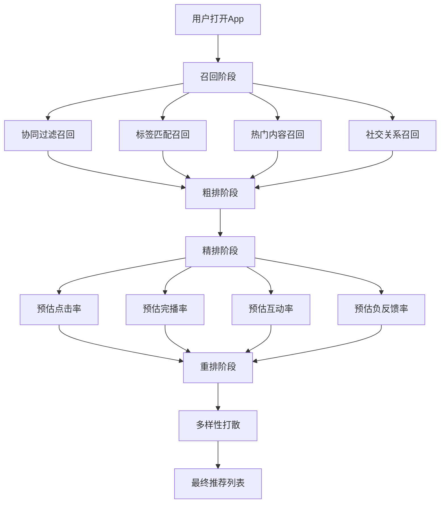

## 一、短视频平台算法推荐机制

短视频平台的本质是一个**内容分发系统**。理解算法推荐机制，是所有短视频变现的起点——你的内容再好，如果算法不推荐给用户，就等于不存在。本章从底层原理出发，逐层拆解各大平台的推荐逻辑，帮助你建立系统性的算法认知。

### 1.1 推荐算法的底层原理

在深入各平台之前，先理解推荐系统的基础技术架构。所有主流短视频平台的推荐算法都基于以下核心技术：

#### 1.1.1 协同过滤（Collaborative Filtering）

协同过滤是最基础的推荐思想，分为两种：

- **用户协同过滤**：找到与你行为相似的用户群，把他们喜欢但你还没看过的内容推荐给你。例如，用户A和用户B都点赞了视频1、2、3，用户B还点赞了视频4，那么系统会把视频4推荐给用户A。
- **内容协同过滤**：找到与你过去喜欢的内容相似的新内容推荐给你。例如你经常看烹饪视频，系统会推荐其他烹饪类内容，即使那些内容的作者你从未接触过。

#### 1.1.2 内容理解（Content Understanding）

平台通过多模态AI技术理解视频内容：

| 技术手段 | 识别内容 | 对推荐的影响 |
|---------|---------|------------|
| 图像识别 | 视频画面中的物体、场景、人脸 | 生成视觉标签，匹配兴趣人群 |
| 语音识别（ASR） | 视频中的语音内容 | 提取关键词和主题 |
| 自然语言处理（NLP） | 标题、描述、评论 | 理解内容语义和情感 |
| OCR文字识别 | 视频中的字幕和文字 | 补充内容理解 |
| 音乐/音频分析 | 背景音乐类型、节奏 | 匹配音乐偏好人群 |
| 行为序列分析 | 用户的观看、互动行为链 | 构建兴趣图谱 |

#### 1.1.3 实时特征与离线特征

推荐系统同时使用两类特征进行决策：

- **实时特征**（秒级更新）：用户当前会话的行为、当前视频的实时互动数据、时间段和场景特征
- **离线特征**（小时/天级更新）：用户长期兴趣画像、视频的历史表现数据、用户社交关系图谱

#### 1.1.4 推荐系统的四阶段流水线

一个视频从发布到被推荐给用户，经历四个关键阶段：

**第一阶段：召回（Recall）**——从数亿条内容中快速筛选出数千条候选内容。这一阶段追求速度，使用倒排索引、向量检索等技术，从标签库、兴趣池、关注池等多个通道并行召回。

**第二阶段：粗排（Pre-ranking）**——对数千条候选内容进行初步排序，使用轻量级模型快速评分，筛选出数百条进入精排。粗排模型的参数量通常在百万级，推理速度要求毫秒级。

**第三阶段：精排（Ranking）**——对数百条候选内容使用深度学习模型进行精确打分。精排模型参数量在十亿级，综合考虑用户特征、内容特征、上下文特征、交叉特征等多个维度，输出点击率、完播率、互动率等多项预估值。

**第四阶段：重排（Re-ranking）**——在精排结果基础上进行最终调整，包括：内容多样性打散（避免连续推荐同类内容）、广告插入、已看过内容过滤、时间衰减等策略。

### 1.2 抖音推荐算法详解

抖音是中国最大的短视频平台，日活用户超过7亿，其推荐算法是行业标杆。

#### 1.2.1 流量池分级机制

抖音采用"去中心化"的流量分发机制，核心逻辑可以概括为**赛马制**——每一条视频都在和其他同时间发布的视频竞争，数据表现好的获得更多流量。

| 流量池级别 | 播放量范围 | 进入条件 | 停留时间 |
|-----------|-----------|---------|---------|
| 初级流量池 | 200-500 | 发布即获得 | 30分钟-2小时 |
| 二级流量池 | 1,000-5,000 | 完播率>30%，互动率>5% | 2-6小时 |
| 三级流量池 | 1万-10万 | 数据持续优于同级内容 | 6-24小时 |
| 四级流量池 | 10万-100万 | 进入热门候选池 | 1-3天 |
| 五级流量池 | 100万-1000万 | 成为热门视频 | 3-7天 |
| 超级流量池 | 1000万+ | 现象级内容 | 持续推荐 |

**关键数据门槛参考值**（基于行业经验，非官方公布）：

- 完播率：初级池>30%，进阶池>45%，爆款>60%
- 点赞率：初级池>3%，进阶池>5%，爆款>8%
- 评论率：初级池>0.5%，进阶池>1%，爆款>2%
- 转发率：初级池>0.3%，进阶池>0.5%，爆款>1%
- 关注转化率：初级池>1%，进阶池>2%，爆款>3%

#### 1.2.2 核心指标权重排序

抖音算法评估视频质量的六大核心指标，按权重从高到低排列：

**第一：完播率（权重最高）**——用户是否看完整个视频。完播率是抖音判断内容质量的第一指标。提高完播率的方法包括：控制视频时长（新号建议7-15秒）、设置悬念开头、内容节奏紧凑、结尾设置反转或引导重看。

**第二：互动率**——点赞、评论、收藏、转发的综合比例。互动率反映用户对内容的情感投入程度。其中评论的权重高于点赞，因为评论需要更多思考和时间成本。引导评论的话术（如"你觉得呢？""评论区告诉我"）能显著提升互动率。

**第三：关注率**——看完视频后关注账号的比例。关注率反映内容的持续吸引力，是账号成长的核心指标。高关注率意味着用户不仅喜欢这条视频，还期待看到更多。

**第四：分享率**——视频被分享到外部的频率。分享是最高级别的用户行为——用户愿意用自己的社交信用为你背书。实用类、情感共鸣类、争议类内容的分享率通常较高。

**第五：停留时长**——用户在视频上停留的总时间。即使没有看完，停留时间长也说明内容有吸引力。对于长视频尤其重要。

**第六：负反馈率（惩罚指标）**——用户点击"不感兴趣"、举报、快速划走的比例。负反馈率高会直接降低推荐权重。内容与标题不符（标题党）、低质内容、违规内容最容易触发负反馈。

#### 1.2.3 推荐算法的完整运作流程

一条抖音视频从发布到被推荐，经历以下完整流程：

**步骤一：内容审核（0-30分钟）**
机器审核为主，检查画面是否违规、文字是否敏感、音频是否侵权。约95%的内容在10分钟内完成机器审核。机器无法判断的内容会进入人工审核队列。审核不通过的内容会被限流或下架。

**步骤二：标签生成与匹配（审核通过后立即）**
系统通过多模态AI自动为视频生成标签，包括：内容主题标签（美食、旅游、科技等）、情感标签（搞笑、感人、励志等）、人群标签（年龄、性别、地域等）。同时，系统为用户生成兴趣标签。标签越精准，推荐越高效。

**步骤三：初始流量池测试（发布后30分钟-2小时）**
视频被推送给200-500个用户，这些用户通常是：粉丝中活跃度较高的一部分、与视频标签匹配的潜在兴趣用户、同城用户（如果内容有地域属性）。

**步骤四：数据反馈与流量升级（2-6小时）**
系统收集初始用户的反馈数据，与同时间段、同类型的其他视频进行对比。如果数据表现优于平均水平，视频进入下一级流量池；如果数据低于平均水平，推荐逐渐衰减。

**步骤五：持续推荐或衰减（6小时-数天）**
数据持续优秀的视频会进入更大的流量池，获得更多推荐。数据不佳的视频推荐逐渐停止。但即使初期数据不好，如果视频被搜索、被分享到外部带来新的互动，仍然有机会重新获得推荐。

#### 1.2.4 抖音的流量分配时间窗口

理解时间窗口对于发布时间选择至关重要：

- **黄金30分钟**：发布后30分钟内的数据最关键，决定了能否进入二级流量池
- **第一波窗口（0-2小时）**：系统给予初始推荐，观察核心指标
- **第二波窗口（6-8小时）**：如果第一波数据好，系统扩大推荐范围
- **长尾窗口（24小时后）**：优质内容可能在发布数天甚至数周后突然爆发
- **搜索流量**：SEO优化好的视频可能在发布数月后仍然通过搜索获得稳定流量

#### 1.2.5 抖音的标签系统深度解析

抖音的标签系统分为三层：

**第一层：内容标签**——由AI自动识别生成，包括视频主题、画面元素、语音关键词、文字信息等。创作者无法直接控制，但可以通过优化内容来影响标签生成。

**第二层：账号标签**——通过持续发布同领域内容建立。新账号没有标签，需要3-5条同领域视频才能初步建立。账号标签越清晰，推荐给目标用户越精准。**切忌频繁切换内容领域**，这会导致账号标签混乱，推荐效率大幅下降。

**第三层：用户标签**——用户的行为数据生成的兴趣画像。系统会根据用户的历史观看、互动、搜索、购买等行为持续更新标签。新用户有冷启动问题，系统会通过热门内容和多样化推荐来探索其兴趣。

### 1.3 快手推荐算法特点

快手日活超过3.8亿，其算法逻辑与抖音有显著差异，形成了独特的生态。

#### 1.3.1 双列点选模式的算法影响

快手的双列点选模式（用户从多个封面中选择点击观看）对算法产生了深远影响：

- **点击率成为核心指标**：与抖音的单列沉浸式不同，快手用户需要主动点击才能观看，因此封面质量和标题文案的吸引力直接影响点击率
- **封面优化至关重要**：高清、有冲击力、信息量大的封面能显著提升点击率
- **标题文案的重要性更高**：标题需要在有限空间内传达核心信息并制造好奇心

#### 1.3.2 社交权重更大

快手的算法中，社交关系的权重显著高于抖音：

- **关注页流量占比约30-40%**：远高于抖音的10-15%，意味着粉丝粘性更强
- **私域流量价值更大**：快手创作者的粉丝复访率更高，粉丝的终身价值更大
- **"老铁经济"文化**：用户与创作者之间有更强的信任关系和情感连接
- **同城流量权重高**：快手在下沉市场渗透率高，同城内容获得更多推荐

#### 1.3.3 流量分配更均衡

快手的流量分配策略比抖音更加均衡：

- **基尼系数更低**：流量不会过度集中于头部创作者，中长尾创作者有更多机会
- **"普惠"理念**：快手创始人宿华多次强调"普惠"的算法价值观
- **内容生态更多元**：由于流量分配更均衡，快手的内容生态比抖音更加多元
- **适合垂直领域深耕**：在快手做垂直领域内容，更容易获得稳定流量

### 1.4 视频号推荐机制

视频号依托微信生态，拥有超过8亿月活用户，是短视频赛道的重要变量。

#### 1.4.1 社交推荐为主

视频号最大的独特性在于其社交推荐逻辑：

- **朋友点赞的内容优先推荐**：这是视频号最核心的推荐机制，一个朋友点赞就可能触发推荐给其所有好友
- **社交关系链影响推荐权重**：你的微信好友的兴趣会影响你看到的内容
- **朋友圈分享带来裂变流量**：视频号内容可以无缝分享到朋友圈和微信群
- **公众号关联**：视频号与公众号深度绑定，可以互相导流

#### 1.4.2 兴趣推荐为辅

除社交推荐外，视频号也有兴趣推荐机制：

- **基于浏览行为的兴趣推荐**：用户在视频号的观看行为会被记录用于个性化推荐
- **热门内容的广场推荐**：视频号的"推荐"页面展示热门和优质内容
- **搜索流量的SEO优化**：视频号搜索与微信搜一搜打通，搜索流量潜力巨大
- **附近的视频**：基于地理位置的本地内容推荐

#### 1.4.3 视频号的变现优势

视频号在变现方面有独特优势：

- **微信支付无缝对接**：用户可以直接在视频号内完成支付
- **私域流量沉淀**：可以通过视频号引导到个人微信、企业微信、社群
- **直播带货闭环**：视频号直播可以挂载微信小店商品
- **知识付费**：适合做课程、咨询等知识类产品

### 1.5 TikTok国际版算法与全球市场

TikTok在全球拥有超过15亿月活用户，是短视频出海的首选平台。

#### 1.5.1 TikTok算法核心特点

- **兴趣图谱优先**：TikTok更强调基于兴趣的内容推荐，而非社交关系，这意味着新账号也有机会获得大量曝光
- **全球化标签体系**：内容会被推送到多个国家和地区，标签选择决定受众范围
- **For You Page（FYP）机制**：FYP是TikTok的核心流量入口，算法会根据用户行为持续优化推荐
- **"冷启动"测试更激进**：TikTok对新内容的初始测试量更大，给予更多探索机会

#### 1.5.2 TikTok变现机会

| 变现方式 | 收入范围 | 门槛要求 | 适合人群 |
|---------|---------|---------|---------|
| Creator Fund | $0.02-$0.05/千次播放 | 1万粉丝+10万播放/30天 | 所有创作者 |
| Creator Rewards | 收益更高，按质量付费 | 1万粉丝+原创内容 | 高质量原创者 |
| 直播打赏 | 单场$50-$5000+ | 1000粉丝 | 有直播能力者 |
| TikTok Shop | 佣金制，因品类而异 | 各地区政策不同 | 有货源者 |
| 品牌合作 | $100-$10000+/条 | 有一定粉丝基础 | 各垂类达人 |
| 联盟营销 | 佣金5%-30% | 无硬性门槛 | 所有创作者 |

#### 1.5.3 TikTok与抖音的算法差异

尽管TikTok是抖音的海外版本，但两者在算法上有显著差异：

| 维度 | 抖音 | TikTok |
|-----|------|--------|
| 流量来源 | 推荐+关注+搜索+同城 | 推荐(FYP)+搜索+关注 |
| 社交权重 | 中等 | 较低 |
| 冷启动力度 | 保守（200-500） | 激进（更多初始测试） |
| 内容审核 | 严格（人工+机器） | 机器为主，各地区标准不同 |
| 变现生态 | 成熟（电商、广告、直播） | 发展中（Shop逐步开放） |
| 算法透明度 | 较低 | 中等（有官方推荐指南） |

### 1.6 小红书的内容生态与算法

小红书月活超过3亿，以"种草"文化著称，是生活方式类内容的重要平台。

#### 1.6.1 CES评分体系

小红书的推荐基于CES（Community Engagement Score）评分体系，各互动行为的权重如下：

| 互动行为 | 权重分值 | 用户行为成本 | 对推荐的影响 |
|---------|---------|------------|------------|
| 点赞 | 1分 | 低（一键操作） | 有一定帮助 |
| 收藏 | 1分 | 中（需要认同） | 表示内容有长期价值 |
| 评论 | 4分 | 高（需要思考和输入） | 显著提升推荐 |
| 转发 | 4分 | 高（需要社交背书） | 显著提升推荐 |
| 关注 | 8分 | 最高（长期承诺） | 最强推荐信号 |

**核心洞察**：评论和关注权重最高，说明小红书更看重深度互动而非浅层互动。一条有50条走心评论的笔记，推荐效果远好于有500个点赞但没有评论的笔记。

#### 1.6.2 小红书的流量分配逻辑

小红书的流量分配有以下特点：

- **搜索流量占比高**：约30-40%的流量来自搜索，远高于其他平台
- **笔记生命周期长**：一篇优质笔记可以在发布数月甚至一年后仍然通过搜索获得流量
- **"双列发现页"**：与快手类似，封面和标题的吸引力直接影响点击率
- **CES评分的时效性**：发布后2小时内的CES评分对推荐影响最大

#### 1.6.3 小红书SEO优化技巧

由于搜索流量占比高，SEO优化在小红书尤为重要：

**标题优化**：包含核心关键词（如"平价护肤""通勤穿搭"），使用数字和符号增加吸引力（如"5款""100元以内"），标题长度控制在15-20字。

**正文优化**：自然融入长尾关键词（不要堆砌），使用小红书的话题标签（#话题#），正文分段清晰，使用emoji增加可读性。

**封面优化**：使用高质量、精致的图片，封面文字清晰可读，风格统一建立辨识度。

**评论区优化**：主动回复评论增加互动数据，在评论区补充关键词和信息。

#### 1.6.4 小红书变现数据参考

| 粉丝量级 | 蒲公英报价范围 | 合作形式 | 月收入潜力 |
|---------|--------------|---------|-----------|
| 1千-5千粉 | 免费置换-200元 | 产品置换、小额合作 | 500-2000元 |
| 5千-1万粉 | 200-1500元/篇 | 图文/视频笔记 | 2000-8000元 |
| 1万-5万粉 | 1500-5000元/篇 | 专题笔记、合集 | 8000-3万元 |
| 5万-10万粉 | 5000-15000元/篇 | 品牌合作、直播 | 3万-10万元 |
| 10万-50万粉 | 1.5万-5万元/篇 | 品牌大使、专场 | 10万-30万元 |
| 50万粉+ | 5万-20万元/篇 | 年度合作、联名 | 30万-100万+元 |

### 1.7 B站（哔哩哔哩）算法与生态

B站月活超过3.4亿，以年轻用户和深度内容著称。

#### 1.7.1 B站算法特点

- **"一键三连"权重最高**：点赞、投币、收藏是B站最核心的互动指标，其中投币的权重最高（用户每天只有有限的币）
- **长视频友好**：B站对长视频（5-30分钟）有算法倾斜，完播率的计算方式也更适合长内容
- **分区推荐机制**：内容按分区（科技、生活、游戏、动画等）进行推荐，分区选择影响目标人群
- **热门排行榜**：各分区有独立的热门榜，上榜能带来显著流量

#### 1.7.2 B站用户画像

- **年龄**：18-35岁为主，Z世代占比超过70%
- **性别**：男性略多（约55%），但女性用户增长迅速
- **地域**：一二线城市占比高，消费能力中上
- **偏好**：知识类、科技类、游戏类、生活类内容最受欢迎
- **付费意愿**：对优质内容的付费意愿较强（大会员、充电、课程）

#### 1.7.3 B站变现方式

| 变现方式 | 收入模式 | 门槛 | 适合人群 |
|---------|---------|------|---------|
| 创作激励 | 按播放量分成，约1-3元/千次 | 1000粉丝+ | 所有创作者 |
| 充电计划 | 粉丝打赏 | 无硬性门槛 | 有忠实粉丝者 |
| 花火平台 | 品牌合作接单 | 1万粉丝+ | 各垂类UP主 |
| 直播 | 礼物打赏+带货 | 实名认证 | 有直播能力者 |
| 付费课程 | 知识付费 | 1万粉丝+ | 知识型UP主 |
| 悬赏计划 | 完成平台任务 | 满足条件 | 活跃创作者 |

### 1.8 各平台算法对比总览

以下表格横向对比五大主流平台的算法特征，帮助你快速选择适合自己的平台：

| 对比维度 | 抖音 | 快手 | 视频号 | 小红书 | B站 |
|---------|------|------|-------|-------|-----|
| 日活规模 | 7亿+ | 3.8亿+ | 8亿+月活 | 3亿+月活 | 3.4亿+月活 |
| 核心推荐 | 算法推荐 | 算法+社交 | 社交+算法 | CES评分 | 一键三连 |
| 流量分配 | 头部集中 | 相对均衡 | 社交驱动 | 搜索+推荐 | 分区推荐 |
| 内容形态 | 短视频为主 | 短视频为主 | 短视频+直播 | 图文+短视频 | 长视频为主 |
| 变现成熟度 | ★★★★★ | ★★★★ | ★★★ | ★★★★ | ★★★ |
| 粉丝价值 | 中等 | 较高 | 最高 | 高 | 高 |
| 新号友好度 | 中等 | 较高 | 较低 | 较高 | 中等 |
| 内容生命周期 | 短（3-7天） | 中（7-14天） | 中（7-30天） | 长（数月-1年） | 长（数月-1年） |
| 适合人群 | 泛人群 | 下沉市场 | 有私域者 | 女性/生活方式 | 年轻/知识型 |

### 1.9 算法优化的通用策略

无论在哪个平台，以下策略都适用：

#### 1.9.1 提升完播率的核心方法

完播率是所有平台最重要的指标之一。以下是经过验证的提升方法：

- **控制视频时长**：新账号建议7-15秒，有粉丝基础后逐步延长
- **前3秒法则**：前3秒必须抓住注意力，否则用户会划走。使用悬念、冲突、利益点开头
- **节奏紧凑**：每3-5秒设置一个信息点或画面变化，避免冗长铺垫
- **结尾钩子**：设置反转、悬念或引导重看（"看到最后有惊喜"）
- **字幕辅助**：添加字幕可以提升完播率15-30%，因为很多用户静音观看

#### 1.9.2 提升互动率的实用技巧

- **引导评论**：在视频中或结尾提出问题，引导用户评论（"你觉得哪个更好？"）
- **制造争议**：适度的争议性观点能激发评论，但要注意不要过度引发负面情绪
- **回复评论**：积极回复评论能提升评论区活跃度，进而提升推荐权重
- **设置投票**：利用平台的投票功能增加互动
- **预埋评论**：用自己的小号或让朋友先评论，引导讨论方向

#### 1.9.3 避免算法惩罚的行为

以下行为会触发算法惩罚，必须避免：

- **刷量刷赞**：平台有完善的反作弊系统，刷量不仅无效，还会导致账号降权
- **搬运抄袭**：直接搬运他人内容会被限流或下架，严重者封号
- **频繁删除作品**：删除作品会影响账号权重，建议隐藏而非删除
- **内容与账号标签不符**：频繁切换领域会导致账号标签混乱
- **违规内容**：涉政、涉黄、虚假信息等违规内容会被限流或封号
- **硬广告植入**：未报备的商业植入容易被系统识别并限流

### 1.10 常见误区与纠正

#### 误区一：发布时间决定一切

**错误认知**：只要在"最佳时间"发布就能获得高播放量。

**事实**：发布时间只是影响因素之一，内容质量才是决定性因素。一个优质的视频在任何时间发布都能获得推荐，而一个低质的视频在黄金时间发布也不会有好表现。发布时间的优化是在内容质量达标基础上的锦上添花。

#### 误区二：粉丝多=播放量高

**错误认知**：有了大量粉丝，发布的每条视频都会有高播放量。

**事实**：在抖音等平台，粉丝看到你内容的比例（粉丝触达率）通常只有5-15%。算法的核心逻辑是内容质量驱动而非粉丝数量驱动。很多百万粉账号的单条视频播放量可能只有几万。持续产出优质内容比积累粉丝更重要。

#### 误区三：算法可以被"破解"

**错误认知**：存在某种技巧或"黑科技"可以操纵算法获得推荐。

**事实**：算法的核心逻辑是把优质内容推荐给感兴趣的用户。任何试图"破解"算法的行为（如刷量、互赞互粉、使用违规工具）最终都会被平台识别并惩罚。专注于内容质量和用户价值，才是与算法共赢的正确方式。

#### 误区四：完播率100%就是好内容

**错误认知**：只要视频够短，完播率就能达到100%，算法就会推荐。

**事实**：算法不仅看完播率，还综合考虑互动率、分享率、关注率等多项指标。一个3秒的视频可能完播率很高，但如果没有任何互动，算法不会认为它是优质内容。此外，过短的视频往往无法传递足够的价值。

#### 误区五：限流等于被封号

**错误认知**：播放量下降就是被限流了，账号废了。

**事实**：播放量波动是正常现象，可能是因为：内容质量波动、发布时间不当、竞争环境变化、用户兴趣转移等。真正的限流通常是由于违规行为触发的，平台会通过"创作者服务中心"发出通知。遇到播放量下降，应该分析内容数据而非归咎于限流。

### 1.11 进阶：算法趋势与未来方向

#### 1.11.1 AI生成内容（AIGC）对算法的影响

2024年以来，AIGC内容大量涌入短视频平台，算法也在相应调整：

- **原创性检测加强**：平台开始使用AI识别AIGC内容，纯AI生成内容可能被降权
- **人机协作内容受鼓励**：人为主、AI为辅的创作方式获得算法认可
- **内容质量门槛提高**：AIGC降低了创作门槛，但也提高了脱颖而出的难度
- **个性化需求增强**：AI可以批量生产内容，但真正有个人特色的内容更难被替代

#### 1.11.2 算法透明化趋势

各平台正在逐步提高算法透明度：

- 抖音推出了"算法透明度"专题页面
- 快手公布了"普惠"算法理念
- TikTok发布了详细的推荐系统说明
- 监管部门要求平台公开算法基本原理

#### 1.11.3 多平台分发策略

在理解各平台算法差异的基础上，制定多平台分发策略：

- **主平台深耕**：选择1-2个最匹配的平台作为主阵地
- **内容适配**：同一个主题，根据各平台特点调整内容形式和长度
- **差异化运营**：不同平台使用不同的标题、封面、标签策略
- **数据对比**：通过对比各平台数据，找到最适合自己的平台组合
