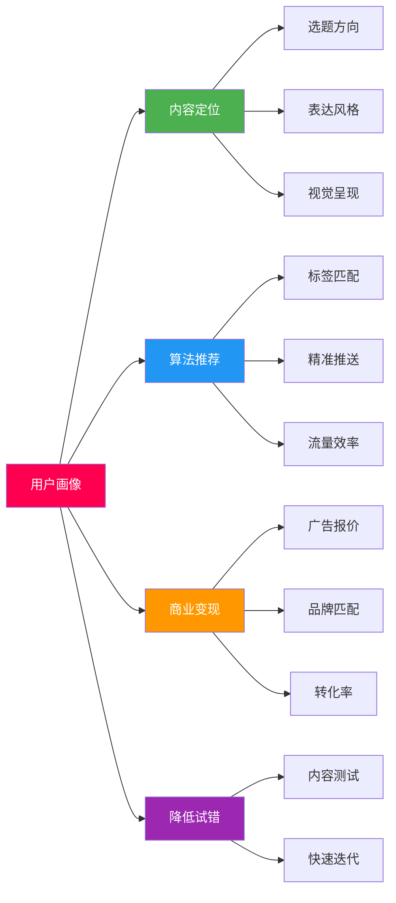
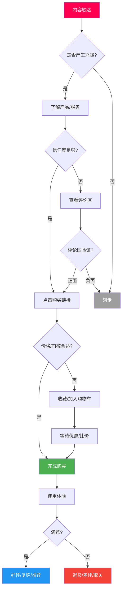
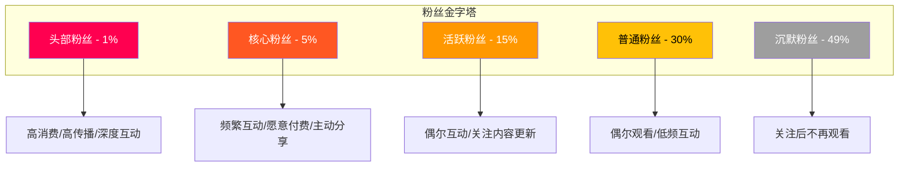
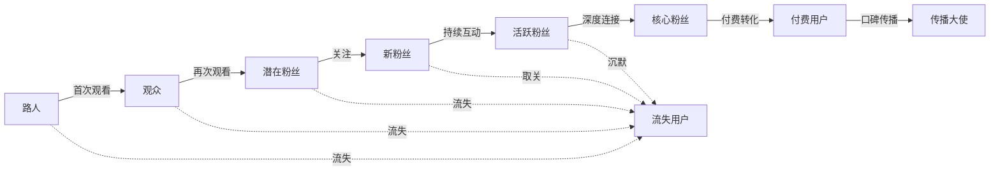

## 二、短视频用户画像与行为分析

用户画像与行为分析是短视频运营的底层基础设施。不理解你的观众是谁、他们在什么时间活跃、喜欢什么类型的内容、如何与内容互动，所有后续的内容策略、变现路径都是空中楼阁。本节将从用户画像构建方法、各平台用户特征、用户行为规律、实操分析工具四个维度展开，帮助你建立系统化的用户认知体系。

### 2.1 用户画像的核心概念

**什么是用户画像（User Persona）：**

用户画像是基于真实数据构建的虚拟用户模型，它将海量用户的共性特征抽象为一个具象化的"典型用户"。在短视频领域，用户画像包含以下维度：

| 维度 | 包含信息 | 数据来源 |
|------|----------|----------|
| 人口属性 | 年龄、性别、地域、学历、收入水平 | 平台后台、第三方数据平台 |
| 兴趣偏好 | 内容类型偏好、关注领域、消费倾向 | 用户行为数据、标签系统 |
| 行为特征 | 活跃时段、使用时长、互动习惯 | 平台埋点数据 |
| 消费能力 | 客单价区间、付费意愿、购物频次 | 电商数据、打赏数据 |
| 社交属性 | 社交活跃度、分享倾向、社群归属 | 互动数据、私域数据 |
| 设备信息 | 手机型号、网络环境、操作系统 | 平台技术采集 |

**为什么用户画像如此重要：**

1. **内容定位的基础**：明确了目标用户是谁，才能确定选题方向、表达方式、视觉风格
2. **算法推荐的钥匙**：平台通过标签匹配将内容推送给目标用户，画像越精准，推荐效率越高
3. **商业变现的前提**：广告主和品牌方需要看到你的粉丝画像与目标消费群体的匹配度
4. **降低试错成本**：有清晰的用户画像，内容创作从"盲目猜测"变为"精准命中"



### 2.2 各平台用户画像对比

不同平台的用户群体存在显著差异，选择平台的第一步就是理解各平台的用户构成。

#### 2.2.1 抖音用户画像

抖音是目前中国最大的短视频平台，日活用户超过7亿，覆盖最广泛的用户群体。

**核心人口统计：**
- **年龄分布**：18-24岁占28%，25-35岁占38%，36-45岁占20%，46岁以上占14%
- **性别比例**：女性约52%，男性约48%
- **地域分布**：一二线城市占45%，三四线城市占35%，五线及以下占20%
- **学历分布**：本科及以上约45%，大专约25%，高中及以下约30%
- **收入水平**：月收入3000-8000元的中等收入群体占比最大

**用户行为特征：**
- 平均日使用时长约100分钟，高于行业平均水平
- 晚间7点-11点是使用高峰期
- 短视频（15秒-1分钟）完播率最高
- 直播间停留时长中位数约3-5分钟
- 用户对新鲜事物接受度高，容易被种草

**适合的内容方向：**
- 泛娱乐（搞笑、剧情、舞蹈）
- 生活方式（美食、旅行、家居）
- 知识科普（健康、育儿、职场技能）
- 电商带货（美妆、服装、食品）

#### 2.2.2 快手用户画像

快手日活用户约3.9亿，用户群体特征与抖音形成差异化互补。

**核心人口统计：**
- **年龄分布**：18-24岁占22%，25-35岁占32%，36-45岁占25%，46岁以上占21%
- **性别比例**：女性约47%，男性约53%（男性略多）
- **地域分布**：一二线城市占30%，三四线城市占40%，五线及以下占30%
- 下沉市场渗透率明显高于抖音

**用户行为特征：**
- 用户忠诚度高，关注关系链更强
- "老铁文化"浓厚，社区归属感强
- 直播打赏意愿高于其他平台
- 信任驱动消费，复购率较高
- 双列点选模式下封面点击率是关键指标

**适合的内容方向：**
- 真实生活记录（三农、赶海、乡村生活）
- 手工技能展示（木工、修理、烹饪）
- 工厂/源头供应链带货
- 情感类直播（聊天、连麦、才艺）

#### 2.2.3 视频号用户画像

视频号依托微信12亿用户基础，用户群体偏成熟。

**核心人口统计：**
- **年龄分布**：25-35岁占25%，36-45岁占30%，46-55岁占28%，55岁以上占17%
- **性别比例**：女性约55%，男性约45%
- **地域分布**：覆盖广泛，中老年用户比例是所有平台中最高的
- 用户消费能力中等偏上，尤其36岁以上群体有较强购买力

**用户行为特征：**
- 社交推荐权重极高，朋友点赞的内容优先展示
- 用户更偏向熟人社交场景下的内容消费
- 对鸡汤、养生、家庭关系类内容有高偏好
- 购买决策受社交信任影响大
- 晚间8点-10点是活跃高峰

**适合的内容方向：**
- 中老年生活方式（养生、广场舞、旅游）
- 家庭教育（亲子关系、学习方法）
- 情感正能量（励志、人生感悟）
- 本地生活（同城探店、区域服务）

#### 2.2.4 B站用户画像

B站（哔哩哔哩）拥有3.3亿月活用户，是年轻人的文化社区。

**核心人口统计：**
- **年龄分布**：18-24岁占40%，25-30岁占30%，31-35岁占18%，35岁以上占12%
- **性别比例**：男性约57%，女性约43%
- **地域分布**：一二线城市占比超过60%
- **学历分布**：本科及以上占比超过55%，是所有平台中学历最高的

**用户行为特征：**
- 偏好长视频（5-20分钟），内容深度要求高
- 一键三连（点赞、投币、收藏）是核心互动指标
- 用户对广告植入容忍度低，要求内容硬核
- 弹幕文化独特，弹幕互动是重要参与方式
- 社区归属感强，有自己的文化体系和"黑话"

**适合的内容方向：**
- 知识深度讲解（科技、历史、哲学、经济）
- 二次元和游戏（动漫、游戏攻略、虚拟主播）
- 生活记录与Vlog（高质量拍摄和剪辑）
- 测评与教程（数码、软件、学习方法）

#### 2.2.5 小红书用户画像

小红书月活用户超过3亿，是"种草"文化的发源地。

**核心人口统计：**
- **年龄分布**：18-24岁占35%，25-34岁占40%，35岁以上占25%
- **性别比例**：女性约70%，男性约30%（女性用户为主）
- **地域分布**：一二线城市占比超过65%
- **消费能力**：中高消费群体为主，注重品质和审美

**用户行为特征：**
- 搜索行为占比高（约40%的流量来自搜索）
- 用户决策链路：种草→搜索→比较→购买
- 对真实分享和"素人体验"信任度高
- 图文笔记和短视频笔记并重
- CES评分（Community Engagement Score）决定推荐权重

**适合的内容方向：**
- 美妆护肤（产品测评、妆容教程、成分分析）
- 穿搭时尚（日常穿搭、品牌推荐）
- 家居装修（装修攻略、好物分享）
- 美食探店（餐厅推荐、自制食谱）
- 母婴育儿（育儿经验、产品推荐）

#### 2.2.6 TikTok国际版用户画像

TikTok全球月活超过15亿，覆盖150多个国家和地区。

**核心人口统计：**
- **年龄分布**：18-24岁占36%，25-34岁占33%，35-44岁占18%，45岁以上占13%
- **性别比例**：女性约57%，男性约43%
- **主要市场**：美国（1.5亿）、东南亚（3亿+）、欧洲（1.5亿+）、中东/拉美（快速增长）
- Z世代（1997-2012年出生）是核心用户群体

**用户行为特征：**
- 内容消费节奏更快，注意力更短
- 对创意和娱乐性要求极高
- 音乐和特效驱动内容传播
- 挑战赛（Challenge）和二创文化盛行
- 购买决策受KOL和KOC影响大

**适合的内容方向：**
- 创意娱乐（舞蹈、模仿、搞笑短剧）
- 生活方式（DIY、Organize、Transformation）
- 教育科普（Language learning、Life hacks）
- 美食制作（Recipe、Food review）
- 跨境电商（中国商品种草、Dropshipping）

#### 2.2.7 各平台用户画像对比总表

| 特征维度 | 抖音 | 快手 | 视频号 | B站 | 小红书 | TikTok |
|----------|------|------|--------|-----|--------|--------|
| 核心年龄 | 18-35 | 18-45 | 25-55 | 18-30 | 18-34 | 18-28 |
| 性别偏向 | 均衡 | 男性略多 | 女性略多 | 男性略多 | 女性为主 | 女性略多 |
| 城市层级 | 全覆盖 | 下沉为主 | 全覆盖 | 一二线 | 一二线 | 全球市场 |
| 消费能力 | 中等 | 中低 | 中等偏上 | 中等 | 中高 | 差异大 |
| 内容偏好 | 泛娱乐 | 真实生活 | 生活情感 | 深度知识 | 种草分享 | 创意娱乐 |
| 关键指标 | 完播率 | 互动率 | 社交推荐 | 一键三连 | 搜索+CES | 创意+娱乐性 |
| 最佳变现 | 电商+广告 | 打赏+电商 | 私域+广告 | 知识付费 | 种草+电商 | Creator Fund |

### 2.3 短视频用户行为分析

理解用户"怎么用"比理解用户"是谁"更重要。用户行为分析揭示的是用户的决策过程和互动模式。

#### 2.3.1 用户观看行为模型

**AISAS注意力模型在短视频场景的应用：**

```mermaid
graph LR
    A[Attention 注意] --> I[Interest 兴趣]
    I --> S[Search 搜索]
    S --> A2[Action 行动]
    A2 --> S2[Share 分享]

    A -.-> A1[封面/标题吸引]
    I -.-> I1[前3秒抓住注意力]
    S -.-> S1[搜索相关视频/评论区]
    A2 -.-> A12[关注/购买/下载]
    S2 -.-> S21[转发/@好友/二创]

    style A fill:#FF0050,color:#fff
    style I fill:#FF5722,color:#fff
    style S fill:#FF9800,color:#fff
    style A2 fill:#4CAF50,color:#fff
    style S2 fill:#2196F3,color:#fff
```

**关键行为节点拆解：**

1. **注意力捕获（前1-3秒）**
   - 用户在信息流中的平均滑动速度约为每1.5秒一条
   - 前3秒决定了用户是否停留，完播率的50%取决于开头
   - 高效开头模式：冲突前置、悬念设置、数据冲击、视觉奇观
   - 失败的开头：自我介绍、缓慢铺垫、无关画面

2. **兴趣维持（3-15秒）**
   - 用户一旦停留，期待值被建立，需要持续提供价值
   - 信息密度要高，避免无效填充
   - 每3-5秒设置一个"钩子"（反转、新信息、情绪刺激）

3. **深度参与（15秒-完整观看）**
   - 完整观看的用户更容易产生互动行为
   - 结尾设置行动召唤（CTA）：点赞、评论、关注、分享
   - 结尾的悬念可以引导用户看下一个视频

4. **互动决策**
   - 点赞：最低成本的正向反馈，通常在看完后的1-2秒内决定
   - 评论：需要更强的情绪触发（共鸣、争议、好奇）
   - 收藏：认为内容有长期价值（教程、干货、攻略）
   - 转发/分享：认为内容对朋友有价值或能表达自己

**完播率的阶梯效应：**

| 视频时长 | 合格完播率 | 优秀完播率 | 爆款完播率 |
|----------|-----------|-----------|-----------|
| 15秒以内 | >50% | >65% | >80% |
| 15-30秒 | >40% | >55% | >70% |
| 30-60秒 | >30% | >45% | >60% |
| 1-3分钟 | >25% | >35% | >50% |
| 3-5分钟 | >20% | >30% | >40% |
| 5分钟以上 | >15% | >25% | >35% |

> **注意：** 以上数据为行业经验值，不同垂类差异较大。知识类、教程类视频的完播率通常低于娱乐类，但收藏率和转化率更高。不要为了追求完播率而刻意缩短有价值的内容。

#### 2.3.2 用户活跃时间规律

掌握用户的活跃时间规律，可以最大化内容的初始播放量和互动数据。

**全平台通用活跃规律：**

| 时间段 | 活跃度 | 用户状态 | 适合内容类型 |
|--------|--------|----------|-------------|
| 7:00-9:00 | 中等 | 通勤/早起 | 资讯速览、正能量、早间干货 |
| 11:30-13:30 | 中高 | 午休 | 轻松娱乐、美食、生活记录 |
| 17:00-19:00 | 中高 | 下班通勤 | 搞笑、情感、生活类 |
| 19:00-22:00 | 最高 | 晚间休闲 | 全品类内容黄金时段 |
| 22:00-00:00 | 中高 | 睡前 | 情感、治愈、故事、ASMR |
| 00:00-7:00 | 低 | 深夜/凌晨 | 不建议发布 |

**各平台最佳发布时间差异：**

- **抖音**：周二至周四的12:00-13:00和18:00-20:00效果最佳
- **快手**：晚间19:00-22:00是最佳时段，周末流量更高
- **视频号**：晚间20:00-22:00，与微信使用高峰重合
- **B站**：周五晚和周末是流量高峰，适合中长视频
- **小红书**：晚间19:00-22:00，周末的10:00-12:00也是小高峰
- **TikTok**：因覆盖全球市场，需根据目标地区时区调整

**发布时间策略：**

- 提前30分钟发布，让算法有时间完成初始推荐和审核
- 新账号建议固定时间发布，培养用户期待
- 观察后台数据，找到自己账号粉丝的活跃高峰
- 避开重大新闻/热点事件发布（会被抢占注意力）

#### 2.3.3 用户互动行为分析

**互动类型与价值排序：**

```text
互动价值从高到低：
关注 > 转发 > 评论 > 收藏 > 点赞 > 完播

算法权重从高到低（抖音为例）：
完播率 > 互动率 > 关注率 > 分享率 > 停留时长
```

> 注意：互动价值和算法权重是两个不同的维度。关注对创作者商业价值最高，但完播率对算法推荐最直接。

**用户评论行为洞察：**

- 约60%的评论发生在视频发布后的2小时内
- 争议性话题的评论量是普通内容的3-5倍
- 评论区的"神回复"可以成为二次传播的素材
- 前10条评论的质量影响后续用户的评论意愿（引导评论很重要）
- 带疑问句的视频评论率比陈述句高40%

**用户分享行为洞察：**

- 分享率通常远低于点赞率（约为点赞率的1/10-1/20）
- 用户分享的核心动机：社交货币（让自己显得有见识/有趣）、情绪共鸣、实用价值
- 触发分享的高概率内容类型：反常识观点、情感共鸣故事、实用干货清单、强烈争议
- 分享到微信群的内容，阅读率比分享到朋友圈低，但转化率更高

**用户关注行为洞察：**

- 用户关注一个账号通常需要看到2-3条优质内容
- 单条视频涨粉率（关注/播放）的基准值约为1%-3%
- "系列内容"是涨粉的利器，因为用户会期待下一期
- 账号主页的视觉设计和简介影响30%的关注决策
- 粉丝的7日留存率（关注后7天内是否再次观看）是衡量粉丝质量的核心指标

#### 2.3.4 用户消费决策行为

短视频场景下的消费行为与传统电商有本质区别：

**短视频消费决策路径：**



**冲动消费 vs 理性消费的触发条件：**

| 类型 | 触发条件 | 典型品类 | 客单价区间 | 转化窗口 |
|------|----------|----------|-----------|----------|
| 冲动消费 | 限时优惠、从众效应、情绪驱动 | 零食、饰品、小家电 | 9.9-99元 | 即时决策 |
| 半冲动 | 种草积累、价格刺激、场景触发 | 美妆、服装、家居 | 100-500元 | 1-3天 |
| 理性消费 | 功能需求、口碑验证、多方比较 | 数码、课程、服务 | 500元以上 | 3-7天 |

### 2.4 用户画像构建方法

#### 2.4.1 平台后台数据分析法

各平台的创作者后台是最直接的数据来源。

**抖音创作者服务中心：**

- **粉丝数据**：性别、年龄、地域、活跃时间分布
- **内容数据**：每条视频的播放量、完播率、互动率
- **流量来源**：推荐页、关注页、搜索、个人主页的流量占比
- **观众画像**：新增粉丝和流失粉丝的特征对比

操作步骤：
1. 打开抖音 → 我 → 创作者服务中心
2. 查看"数据分析"→"粉丝画像"
3. 重点关注粉丝的年龄分布、性别比例、地域分布、活跃时间
4. 对比"视频数据"中的观众画像和粉丝画像，识别偏差

**快手创作者中心：**

- 粉丝画像分析，包括性别、年龄、地域
- 作品分析，每条视频的详细数据
- 直播数据，包括观看人数、打赏收入、互动率
- 流量来源分析

**视频号助手：**

- 通过"视频号助手"小程序或PC端查看
- 粉丝画像相对基础，主要提供性别和年龄
- 社交推荐数据是视频号独有的分析维度

**B站创作中心：**

- 粉丝画像包括性别、年龄、地域
- 视频数据包括播放量、互动率、弹幕数
- 充电和花火合作数据

**小红书创作者中心：**

- 粉丝画像和笔记数据
- CES评分详解
- 搜索流量关键词分析

#### 2.4.2 第三方数据工具

当平台后台数据不够深入时，可以借助第三方工具：

| 工具名称 | 主要功能 | 适用平台 | 价格区间 |
|----------|----------|----------|----------|
| 蝉妈妈 | 达人分析、商品分析、直播监控 | 抖音 | 免费/付费（299-999元/月） |
| 飞瓜数据 | 账号分析、热门内容追踪、竞品监控 | 抖音/快手 | 免费/付费（199-899元/月） |
| 新抖 | 抖音数据分析、热门话题追踪 | 抖音 | 免费/付费（299元/月起） |
| 灰豚数据 | 全平台数据分析、行业报告 | 全平台 | 付费（399元/月起） |
| 新红 | 小红书数据分析、达人排行 | 小红书 | 免费/付费（299元/月起） |
| 千瓜数据 | 小红书深度分析、品牌投放监控 | 小红书 | 付费（399元/月起） |
| 火烧云 | B站数据分析、UP主排行 | B站 | 免费/付费 |
| TikTok Analytics | TikTok官方分析工具 | TikTok | 免费 |

#### 2.4.3 手动调研法

数据工具无法替代真实的人工调研，尤其是对用户心理和深层需求的理解。

**评论区挖掘法：**
- 阅读自己和竞品视频的评论区，提炼用户的真实需求和痛点
- 关注高频出现的问题、诉求、情绪表达
- 建立"用户需求库"，将评论分类整理

**私信/社群互动法：**
- 主动回复私信，了解粉丝的具体需求
- 在粉丝群发起话题讨论，收集反馈
- 定期做问卷调查（可通过评论区置顶或群公告引导）

**竞品账号分析法：**
- 选择3-5个同领域头部账号，分析其粉丝画像
- 观察他们的内容选题规律、互动方式、变现策略
- 找到他们未覆盖的细分需求作为差异化切入点

**搜索词分析法：**
- 利用各平台的搜索功能，查看相关搜索词和热搜词
- 搜索词反映的是用户的真实需求和关注点
- 抖音的"巨量算数"、小红书的搜索联想词都是有价值的参考

#### 2.4.4 用户画像模板

将以上数据整合为一个完整的用户画像文档：

```text
【用户画像模板】

一、基础信息
- 昵称/代号：_____（给你的典型用户起一个名字）
- 年龄：_____ 岁
- 性别：_____
- 地域：_____
- 学历：_____
- 职业：_____
- 月收入：_____ 元

二、内容偏好
- 最喜欢的3个内容类型：_____
- 日均刷视频时长：_____ 分钟
- 最活跃的时间段：_____
- 最常使用的平台：_____
- 互动偏好（点赞/评论/收藏/分享）：_____

三、消费特征
- 月均在短视频消费：_____ 元
- 最近一次购买品类：_____
- 价格敏感度：高/中/低
- 决策因素排序：价格>质量>品牌>口碑

四、痛点与需求
- 核心痛点1：_____
- 核心痛点2：_____
- 核心痛点3：_____
- 期望的内容形式：_____

五、信息来源
- 数据来源：_____
- 样本量：_____
- 更新日期：_____
```

### 2.5 用户分层与精细化运营

不是所有用户都有相同的价值。通过用户分层，可以将有限的精力投入到最有价值的用户群体上。

#### 2.5.1 用户价值分层模型



**各层用户运营策略：**

| 用户层级 | 占比 | 特征 | 运营重点 | 变现方式 |
|----------|------|------|----------|----------|
| 头部粉丝 | 1% | 每条必看、主动传播、高付费意愿 | 专属内容、私域维护、情感连接 | 高客单产品、1对1服务 |
| 核心粉丝 | 5% | 频繁互动、愿意购买、主动推荐 | 社群运营、定期互动、专属福利 | 付费社群、课程、复购产品 |
| 活跃粉丝 | 15% | 偶尔互动、关注更新、有一定付费意愿 | 优质内容触达、活动引导 | 广告转化、中等客单产品 |
| 普通粉丝 | 30% | 偶尔观看、低频互动 | 提升内容吸引力、触发互动 | 广告曝光、低价引流品 |
| 沉默粉丝 | 49% | 关注后不再活跃 | 内容召回、激活推送 | 几乎无法直接变现 |

#### 2.5.2 用户生命周期管理

一个用户从第一次看到你的内容到成为忠实粉丝，经历以下阶段：



**各阶段运营重点：**

1. **路人→观众**：优化封面和标题，前3秒抓注意力
2. **观众→潜在粉丝**：提供高价值内容，建立信任
3. **潜在粉丝→新粉丝**：设计关注引导（系列内容、关注提醒、利益点）
4. **新粉丝→活跃粉丝**：持续输出优质内容，保持互动
5. **活跃粉丝→核心粉丝**：私域运营，建立情感连接
6. **核心粉丝→付费用户**：提供付费产品/服务，满足更深层需求
7. **付费用户→传播大使**：超预期体验，激励分享推荐

### 2.6 常见误区与纠正方法

**误区一：只看粉丝数量，忽视粉丝质量**

许多创作者追求粉丝数量，认为粉丝越多越好。实际上，10万精准粉丝的商业价值可能远超100万泛粉丝。一个拥有5万精准宝妈粉丝的账号，带货母婴产品的转化率可能远超一个50万泛娱乐粉丝的账号。

纠正方法：关注粉丝画像与目标受众的匹配度，用"有效粉丝率"（与目标受众匹配的粉丝占比）代替纯粉丝数量来衡量账号价值。

**误区二：用刻板印象代替数据**

"我的目标用户是25-35岁的一线城市女性"——这种笼统的画像缺乏实际指导意义。你真的知道她们的收入水平、消费习惯、内容偏好、活跃时间吗？

纠正方法：用平台后台的真实数据构建画像，而不是凭感觉推测。每3个月更新一次用户画像，因为用户群体可能随内容方向变化而改变。

**误区三：忽视流失用户分析**

只关注新增粉丝和互动数据，不分析取关原因。如果每天新增100个粉丝但流失80个，净增只有20个，说明内容存在严重问题。

纠正方法：关注粉丝净增量而非总增量。分析取关高峰与内容发布的关系，找出导致取关的内容特征并加以改进。

**误区四：盲目模仿头部账号的用户策略**

头部账号的用户群体和你的可能完全不同。他们的内容风格、互动方式、发布时间是基于他们特定的用户群体优化的，直接照搬可能适得其反。

纠正方法：参考头部账号的策略框架，但根据自己的用户画像做调整。通过小规模测试验证策略有效性后再规模化执行。

**误区五：用户画像一成不变**

用户画像应该是动态更新的。随着账号内容方向调整、粉丝群体增长、平台用户群体变化，用户画像也需要相应更新。

纠正方法：建立定期分析机制（建议每季度一次），对比用户画像的变化趋势。特别关注粉丝年龄、地域、兴趣的变化方向。

**误区六：过度依赖单一数据指标**

只看完播率或者只看点赞数，忽视了整体数据的平衡。高完播率可能是因为视频太短，高点赞可能来自争议话题而非内容价值。

纠正方法：建立多维数据看板，综合分析完播率、互动率、关注转化率、分享率等指标。关注指标之间的关联关系而非孤立看待某个指标。

### 2.7 实战应用：如何用用户画像指导内容创作

#### 2.7.1 画像驱动的选题策略

假设通过数据分析，你得出以下用户画像：

```text
典型用户：小雅，28岁，二线城市，互联网公司运营，月入8000-12000元
内容偏好：职场技能提升、个人成长、效率工具
活跃时间：午休12:00-13:00 和 晚间20:00-22:00
互动偏好：收藏干货内容，偶尔评论分享
痛点：工作效率低、职业发展焦虑、缺乏系统学习路径
```

基于这个画像的选题策略：

| 选题方向 | 具体选题示例 | 预期效果 | 发布时间 |
|----------|-------------|----------|----------|
| 效率工具 | "3个AI工具让你每天多出2小时" | 高收藏 | 12:00 |
| 职场技能 | "运营人必会的5个数据分析思维" | 高关注 | 20:00 |
| 个人成长 | "月薪5000到20000，我用了这3个方法" | 高互动 | 21:00 |
| 焦虑缓解 | "28岁还没升管理层？别慌，看看这个" | 高转发 | 22:00 |

#### 2.7.2 画像驱动的内容风格

根据用户画像调整内容的表达方式：

- **语言风格**：针对年轻职场人，使用轻松但专业的语气，避免过于严肃
- **视觉风格**：简洁、有设计感的排版，符合一二线城市审美
- **节奏控制**：信息密度高，每3-5秒一个信息点，符合效率导向型用户的偏好
- **价值呈现**：直接给出"怎么做"，而非长篇理论铺垫

#### 2.7.3 画像驱动的变现策略

根据用户消费能力和付费意愿设计变现路径：

- **引流品**：免费效率工具清单（获取关注和收藏）
- **低价品**：9.9元的效率模板合集（培养付费习惯）
- **主力品**：99-199元的系统课程（匹配消费能力）
- **高价品**：499元的1对1职业咨询（针对核心粉丝）

> **核心原则**：用户画像不是一次性任务，而是持续迭代的过程。随着数据积累和账号成长，画像会越来越精准，内容与用户的匹配度也会越来越高。保持"数据驱动+用户思维"的双重意识，才能在短视频赛道上走得更远。

***
