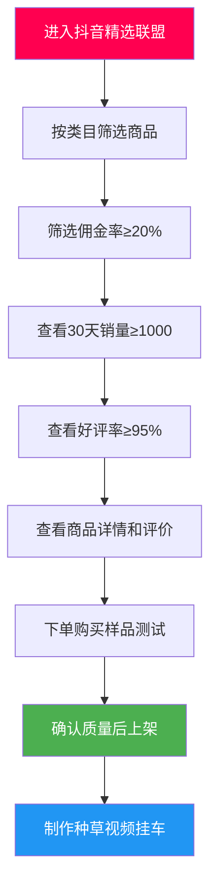
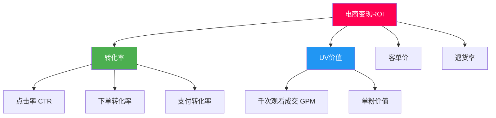
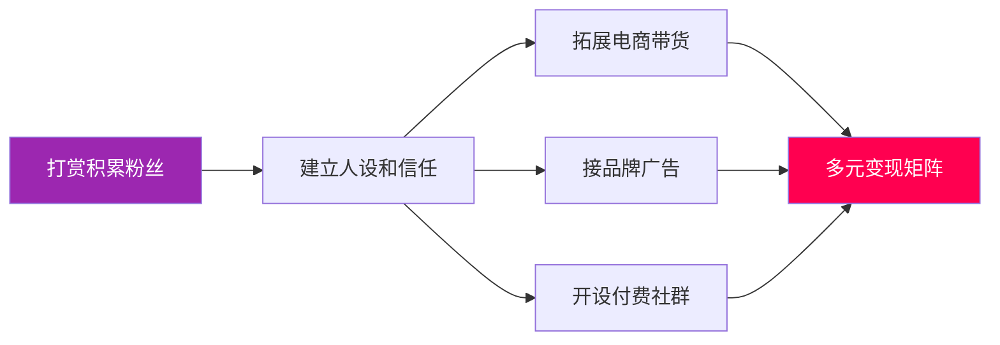
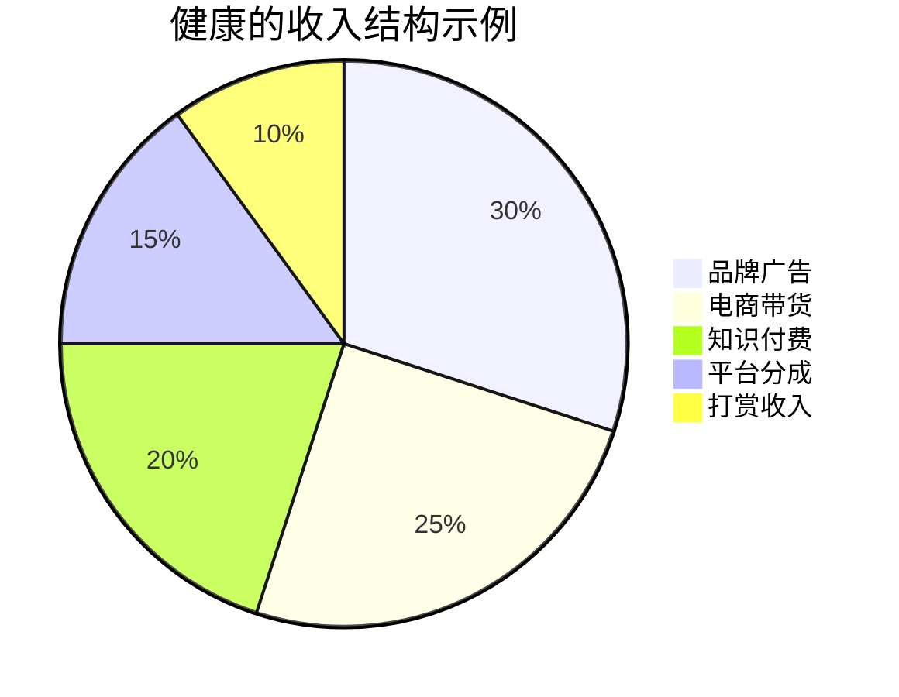
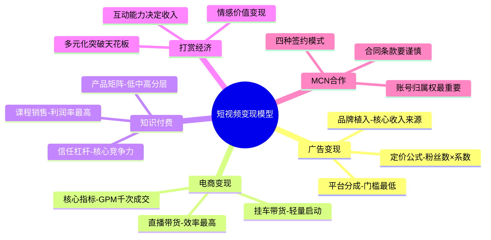

## 三、短视频变现模型分析

短视频变现并非单一路径，而是由多个相互交织的商业模型构成的收入体系。理解每种模型的底层逻辑、适用条件和收入天花板，是制定变现策略的前提。本章将五大变现模型逐一拆解，从商业原理到实操细节，帮助你找到最适合自己的变现组合。

### 3.0 变现模型全景图

```mermaid
graph TB
    SV[短视频变现体系] --> AD[广告变现]
    SV --> EC[电商变现]
    SV --> KP[知识付费]
    SV --> TK[打赏经济]
    SV --> MCN[MCN合作]

    AD --> AD1[平台广告分成]
    AD --> AD2[品牌广告植入]
    AD --> AD3[信息流广告]
    AD --> AD4[定制内容广告]

    EC --> EC1[短视频挂车]
    EC --> EC2[直播带货]
    EC --> EC3[橱窗带货]
    EC --> EC4[内容种草]

    KP --> KP1[课程销售]
    KP --> KP2[付费社群]
    KP --> KP3[1对1咨询]
    KP --> KP4[电子资料]

    TK --> TK1[直播打赏]
    TK --> TK2[连麦PK]
    TK --> TK3[才艺表演]
    TK --> TK4[情感陪伴]

    MCN --> MCN1[保底+分成]
    MCN --> MCN2[纯分成模式]
    MCN --> MCN3[项目制合作]
    MCN --> MCN4[孵化模式]

    SV --> R[收入最大化]
    AD --> R
    EC --> R
    KP --> R
    TK --> R
    MCN --> R

    style SV fill:#FF0050,color:#fff
    style AD fill:#4CAF50,color:#fff
    style EC fill:#2196F3,color:#fff
    style KP fill:#FF9800,color:#fff
    style TK fill:#9C27B0,color:#fff
    style MCN fill:#607D8B,color:#fff
```

**变现模型核心特征对比：**

| 模型 | 启动门槛 | 收入天花板 | 变现周期 | 核心依赖 | 适合人群 |
|------|---------|-----------|---------|---------|---------|
| 广告变现 | 低（需粉丝量达标） | 中（取决于粉丝量级） | 中（3-6个月起） | 流量规模 | 泛娱乐、生活类创作者 |
| 电商变现 | 中（需选品/供应链） | 极高（无上限） | 短（可即时变现） | 信任+选品能力 | 有供应链资源或强种草力 |
| 知识付费 | 中（需专业积累） | 高（边际成本趋零） | 中（需内容沉淀） | 专业权威性 | 教师、专家、行业老手 |
| 打赏经济 | 低（只需才艺/人设） | 中低（天花板明显） | 短（直播即可） | 人设+互动能力 | 才艺型、情感型主播 |
| MCN合作 | 高（需一定影响力） | 中高（取决于谈判力） | 长（需先做出成绩） | 粉丝量+内容质量 | 有一定粉丝基础的创作者 |

> **变现选择建议：** 知识型创作者优先选择"知识付费+广告"组合；生活方式类创作者适合"电商带货+打赏"；有供应链优势的直接走"直播带货"路线。初期不要贪多，选1-2个方向深耕。变现的本质是"信任变现"——没有信任基础，任何模型都难以运转。

---

### 3.1 广告变现模型

广告变现是短视频创作者最常见、门槛最低的收入来源。其本质是将创作者积累的流量注意力，出售给需要曝光的品牌方。理解广告变现的底层逻辑，需要先搞清楚一个公式：

**广告收入 = 曝光量 × eCPM（千次曝光收益）**

eCPM的高低取决于三个因素：粉丝画像的商业价值、内容领域的广告主密度、以及创作者的议价能力。美妆、母婴、汽车等领域的eCPM通常是搞笑、情感类的3-5倍，因为这些领域的广告主预算更充裕、目标用户消费能力更强。

#### 3.1.1 平台广告分成

平台广告分成是创作者通过平台内置的广告系统获取收入的方式，门槛最低，但单价也最低。

**抖音中视频计划（西瓜视频）：**
- 准入条件：发布≥3条横屏视频（16:9），单条≥1分钟，累计播放量≥17000
- 收益计算：按有效播放量计算，每万次有效播放收益约1-10元，取决于内容领域和用户停留时长
- 关键细节："有效播放"指用户观看≥5秒的播放，不足5秒的不计入收益
- 收益优化：横屏视频收益高于竖屏，因为广告展示面积更大；视频时长1-5分钟为最佳收益区间，太短广告展示不够，太长完播率下降

**快手光合计划：**
- 准入条件：粉丝≥10000，近30天发布≥1条原创视频
- 收益计算：根据视频质量分和播放量综合计算，每万次播放收益约2-8元
- 特点：快手的流量分配更去中心化，中小创作者的曝光机会相对均等

**视频号创作者分成：**
- 准入条件：粉丝≥100，发布内容符合规范
- 收益计算：在视频下方展示广告，按点击量分成
- 特点：依托微信社交生态，转发到朋友圈和群聊的流量不计入广告分成，需注意

**B站创作激励：**
- 准入条件：达到LV4且信用分≥80
- 收益计算：综合播放量、互动率、内容质量计算，每万次播放约3-15元
- 特点：B站用户粘性高、停留时间长，适合深度内容创作者

> **实操提示：** 平台广告分成单靠一个平台收入有限。建议同一内容根据平台特性微调后多平台分发，比如将抖音视频裁剪为横屏版发西瓜、调整封面风格发B站，实现"一次创作，多平台收益"。

#### 3.1.2 品牌广告植入

品牌广告植入是创作者通过接品牌商单获取收入，单价远高于平台分成，是中腰部创作者的核心收入来源。

**主流接单平台：**

| 平台 | 适用平台 | 准入门槛 | 结算方式 | 特点 |
|------|---------|---------|---------|------|
| 巨量星图 | 抖音 | 粉丝≥10000 | 平台担保 | 官方渠道，品牌方多，抽佣5%-10% |
| 磁力引擎 | 快手 | 粉丝≥10000 | 平台担保 | 快手官方，抽佣约10% |
| 花火平台 | B站 | 粉丝≥10000 | 平台担保 | B站官方，适合深度内容 |
| 蒲公英 | 小红书 | 粉丝≥1000 | 平台担保 | 种草属性强，美妆母婴类溢价高 |
| 微博任务 | 微博 | 粉丝≥10000 | 平台担保 | 热搜话题配合 |

**品牌合作的定价逻辑：**

创作者报价通常以"粉丝数×系数"为基础。不同领域的系数差异巨大：

- 美妆护肤：0.03-0.1元/粉丝（即10万粉丝报价3000-10000元/条）
- 母婴育儿：0.03-0.08元/粉丝
- 科技数码：0.02-0.06元/粉丝
- 美食探店：0.02-0.05元/粉丝
- 搞笑娱乐：0.01-0.03元/粉丝
- 生活记录：0.01-0.02元/粉丝

实际报价还需考虑互动率（互动率≥3%可以溢价20%-50%）、近期爆款率、粉丝画像匹配度等因素。

**广告植入的三种形式：**

1. **硬广植入（定制视频）：** 整条视频围绕品牌产品创作，曝光充分但容易引起用户反感。适合粉丝忠诚度高的创作者。
2. **软广植入（内容融合）：** 将产品自然融入内容场景，如在美食视频中使用某品牌厨具。接受度最高，但对创作能力要求也最高。
3. **口播植入（简短提及）：** 在视频开头或结尾用5-10秒口播推荐。曝光有限但对内容影响最小，适合不愿过度商业化的创作者。

> **关键提醒：** 接广告必须在视频中明确标注"广告""合作"等标识，否则违反《广告法》和平台规定，轻则限流重则封号。巨量星图等平台会在视频上自动添加"广告"标识，走私下交易的风险极高。

#### 3.1.3 信息流广告与定制内容广告

这两种模式通常由MCN机构或广告代理公司对接，个人创作者较少直接接触：

**信息流广告合作：** 品牌方将广告素材嵌入创作者视频的信息流中，按CPM（千次曝光）或CPC（单次点击）付费。创作者提供内容，品牌方投放广告，双方按效果分成。这种方式创作者不直接制作广告内容，但需要提供高质量的"内容载体"。

**定制内容广告：** 品牌方支付固定费用，要求创作者制作完全定制化的内容。这类合作通常需要签订合同，明确内容要求、发布时间、数据要求等。报价通常是普通广告植入的2-3倍，但创作自由度受限。

#### 3.1.4 广告变现的常见误区与进阶策略

**误区一：粉丝越多广告收入越高。** 粉丝量只是基础，互动率和粉丝画像才是决定eCPM的关键。一个5万粉丝的母婴账号，广告单价可能超过50万粉丝的搞笑账号。

**误区二：接广告会掉粉。** 优质广告内容本身也是有价值的内容。关键是选品要与账号调性一致，植入要自然。频繁接低质量广告才会掉粉。

**误区三：所有广告都要接。** 短期接了不匹配的广告可能赚几千元，但长期会损害账号调性和粉丝信任。建议建立"品牌白名单"，只接与账号定位匹配的品牌。

**进阶策略——广告收入最大化路径：**

---

### 3.2 电商变现模型

电商变现是短视频领域变现效率最高的模型，其核心逻辑是"内容即货架"——通过优质内容建立信任，再将信任转化为购买行为。电商变现的收入没有天花板，取决于选品能力、供应链效率和内容转化率。

#### 3.2.1 短视频挂车

短视频挂车（也称"小黄车""商品橱窗"）是最轻量的电商变现方式，在视频中嵌入商品链接，用户点击购买后创作者获取佣金。

**开通条件（抖音为例）：**
- 个人主页发布≥10条公开原创视频
- 粉丝≥1000
- 完成实名认证
- 缴纳500元保证金（可退）

**选品的核心逻辑：**

选品是挂车变现成败的关键。好的选品需要同时满足三个条件：

1. **高佣金率：** 通常≥20%才有足够的利润空间。佣金率在商品详情页或精选联盟中可以查看。
2. **高转化率：** 看商品的"已售"数量和评价，优先选择月销1000+、好评率≥95%的商品。
3. **高匹配度：** 商品必须与你的内容定位高度匹配。做美食内容就挂厨具食材，做穿搭内容就挂服饰配饰。

**选品实操流程：**

> **避坑指南：** 绝对不要为了高佣金去推劣质商品。一条差评视频的传播力是好评的10倍，推一次烂货可能毁掉几个月积累的信任。永远自己先试用，觉得好再推荐。

**挂车视频的创作技巧：**

- **痛点切入法：** 先描述用户的痛点场景，再引出产品作为解决方案。如"每次切洋葱都哭到怀疑眼睛？试试这个切洋葱神器"。
- **使用展示法：** 直接展示产品的使用过程和效果对比。真实、直观、有说服力。
- **场景种草法：** 将产品融入日常生活场景，让用户产生"我也需要"的共鸣。如在旅行vlog中自然展示使用的行李箱。
- **测评对比法：** 将同类产品做对比测评，突出推荐产品的优势。客观、专业、有参考价值。

**挂车数据优化：**

挂车视频的核心指标不是播放量，而是**GPM（千次观看成交金额）**。GPM = 成交金额 / 观看次数 × 1000。行业基准：

- GPM ≥ 100元：优秀，说明内容转化率很高
- GPM 50-100元：良好，有优化空间
- GPM < 50元：需要优化选品或内容

#### 3.2.2 直播带货

直播带货是电商变现效率最高的方式，因为直播间具备即时互动、实时展示、限时促销等天然优势，转化率通常是短视频的5-10倍。直播带货的详细商业逻辑将在下一章（第四节）深入展开，这里先建立基本认知。

**直播带货的基本模型：**

| 模式 | 说明 | 启动门槛 | 利润率 |
|------|------|---------|-------|
| 佣金带货 | 推广他人商品，赚取佣金 | 低（无需囤货） | 10%-30% |
| 自营带货 | 销售自己的产品 | 高（需供应链） | 30%-70% |
| 达人专场 | 品牌方付费邀请专场直播 | 中（需一定影响力） | 固定坑位费+佣金 |
| 混场直播 | 多品牌商品混合推荐 | 低 | 佣金为主 |

**新手开播前的准备清单：**

1. **硬件准备：** 手机或电脑+摄像头、补光灯（环形灯+侧面补光）、收音设备（领夹麦或桌面麦）、稳定的网络（上行≥10Mbps）
2. **软件准备：** 直播伴侣/OBS推流软件、直播贴片和背景设计、商品链接提前挂好
3. **内容准备：** 直播脚本（至少准备3小时的内容框架）、商品话术（每个商品的卖点、价格、优惠信息）、互动话题（准备10个以上可以和观众聊的话题）
4. **选品准备：** 至少准备20个SKU、设置引流款（低价高性价比，吸引人气）和利润款（主推商品，保证收益）

#### 3.2.3 橱窗带货与内容种草

**橱窗带货：** 在个人主页设置商品橱窗，用户可以随时浏览和购买。橱窗带货的转化率较低，但属于"睡后收入"——设置好之后不需要额外维护。适合粉丝量较大、有一定搜索流量的账号。

**内容种草：** 通过优质内容影响用户的购买决策，但不直接挂商品链接。种草内容的目标是建立品牌认知和购买意向，用户可能在其他渠道（如淘宝、京东）完成购买。这种方式的直接变现较弱，但可以接品牌的种草广告，按CPE（单次互动成本）或固定费用结算。

#### 3.2.4 电商变现的关键指标与数据优化

电商变现需要关注的核心指标体系：

**数据优化的核心策略：**

- **提升点击率：** 封面图要有产品卖点、标题要包含价格信息或优惠信息、视频前3秒要抓住注意力
- **提升转化率：** 详细展示产品功能、提供真实使用体验、设置限时优惠增加紧迫感
- **降低退货率：** 真实展示产品、不过度美化、明确告知适用场景和限制条件
- **提升客单价：** 组合销售（买A送B）、阶梯优惠（满200减30）、推荐关联商品

**电商变现的常见误区：**

1. **误区：追求低价走量。** 低价商品佣金低、利润薄，且容易吸引价格敏感型用户，退货率高。应优先选择中高客单价、高佣金率的商品。
2. **误区：只看播放量不看GPM。** 一条10万播放但GPM只有20元的视频，收入远不如一条1万播放但GPM为200元的视频。
3. **误区：频繁更换品类。** 今天推美妆明天推数码，粉丝画像会越来越混乱，推荐算法也无法精准匹配。垂直深耕才能积累高价值粉丝。

---

### 3.3 知识付费模型

知识付费是短视频领域利润率最高的变现模型——没有库存、没有物流、边际成本趋近于零。一次课程录制完成后，每多卖一份的成本几乎为零。但知识付费的核心前提是**专业权威性**——你必须在某个领域有足够的积累和公信力，用户才会为你的知识买单。

#### 3.3.1 课程销售

课程销售是知识付费最主要的形式，包括录播课程、直播课程和训练营三种模式。

**课程产品矩阵设计：**

一个成熟的知识付费IP通常会设计从低到高的产品矩阵，满足不同用户的需求：

| 产品层级 | 价格区间 | 产品形式 | 目的 | 示例 |
|---------|---------|---------|------|------|
| 引流课 | 0-9.9元 | 短视频/电子书/试听课 | 获取用户、建立信任 | 《5分钟学会手机摄影构图》 |
| 入门课 | 9.9-99元 | 录播课程（3-10节） | 体验交付质量、筛选付费用户 | 《手机摄影入门：从零到出片》 |
| 进阶课 | 99-999元 | 系统课程（10-50节） | 主要利润来源 | 《手机摄影大师课：30天系统提升》 |
| 高阶服务 | 999-9999元 | 训练营/1对1/年度会员 | 高价值用户深度服务 | 《摄影变现训练营：21天实战》 |
| 定制服务 | 10000元+ | 1对1辅导/企业内训 | 超高客单价 | 《企业短视频团队搭建咨询》 |

**课程开发的完整流程：**

1. **需求调研（1-2周）：** 通过评论区、私信、问卷了解粉丝最想学什么。用抖音搜索框查看相关关键词的搜索量，判断市场需求。
2. **课程大纲设计（1周）：** 将知识体系拆解为模块→章节→知识点的三级结构。每个章节控制在10-20分钟，符合碎片化学习习惯。
3. **内容录制（2-4周）：** 录播课建议使用"讲解+屏幕演示+实操"的混合形式。画面质量不必追求完美，但声音必须清晰。
4. **平台选择与上架（1周）：** 可选平台包括抖音学浪、小鹅通、知识星球、网易云课堂等。抖音学浪的优势是可以直接在抖音内完成闭环，用户无需跳转。
5. **推广与迭代（持续）：** 通过短视频内容持续引流到课程，根据用户反馈不断优化课程内容。

#### 3.3.2 付费社群

付费社群是将粉丝转化为长期付费用户的重要方式，通过社群提供持续的价值输出。

**社群产品设计要素：**

- **明确定位：** 社群解决什么问题？提供什么价值？如"每日早报+行业分析+资源对接"
- **定价策略：** 低门槛社群（99-365元/年）适合走量，高门槛社群（999-9999元/年）适合深度服务
- **内容规划：** 每日/每周固定内容输出，如每日早报、每周直播、每月资源包
- **互动机制：** 定期组织活动、话题讨论、作业打卡，保持社群活跃度
- **退出机制：** 设置明确的服务周期和续费规则，避免"永久会员"的交付压力

**主流社群工具对比：**

| 工具 | 价格 | 特点 | 适合场景 |
|------|------|------|---------|
| 知识星球 | 平台抽佣5% | 微信生态、操作简单 | 文字内容为主的社群 |
| 小鹅通 | 年费4800元起 | 功能全面、支持直播 | 需要完整课程+社群功能 |
| 微信群+小程序 | 小程序开发成本 | 最贴近用户、触达率高 | 小规模高价值社群 |
| Discord | 免费 | 功能强大、支持频道分类 | 技术类、游戏类社群 |

#### 3.3.3 一对一咨询与电子资料

**一对一咨询：** 适合已经有行业影响力的专业人士。定价策略：初期可以低价（199-499元/小时）积累案例和口碑，中期提价（500-2000元/小时），高端阶段可以按项目收费（5000-50000元/项目）。咨询前需要设计标准化的需求问卷，提前了解客户问题，提高咨询效率。

**电子资料：** 包括电子书、模板、工具包、资源清单等。这类产品的优势是制作成本低、可反复销售。定价通常在9.9-99元之间。关键是内容要有"立刻可用"的价值——用户买的不是知识，而是可以直接使用的成果物。

#### 3.3.4 知识付费的核心竞争力构建

知识付费领域竞争激烈，如何建立核心竞争力？

**差异化定位的四个维度：**

1. **身份差异化：** 你是谁？有什么独特的经历或背景？如"前大厂产品经理""10年一线教师""从负债到年入百万的创业者"
2. **方法差异化：** 你的方法论有什么独特之处？如"3步法""5分钟速成""不走弯路的系统路径"
3. **结果差异化：** 你的学员取得了什么成果？用真实案例和数据说话
4. **体验差异化：** 你的课程交付体验有什么不同？如"边学边练""1对1批改作业""终身更新"

> **知识付费的本质是"信任杠杆"：** 用户购买的不是课程本身，而是对"学完这个课程能达到某个结果"的信任。因此，持续输出免费优质内容、展示真实案例和学员成果、保持专业领域的深耕，是知识付费持续变现的基础。

---

### 3.4 打赏经济模型

打赏经济是短视频和直播领域最古老的变现方式，其本质是"情感价值变现"——用户为情感满足、社交互动和即时快感付费。打赏经济的核心不在于内容质量，而在于**人设魅力和互动能力**。

#### 3.4.1 打赏收入的构成

**打赏收入 = 观众人数 × 付费率 × 人均打赏金额**

三个变量的优化方向各不相同：

- **提升观众人数：** 通过短视频引流、直播间封面优化、开播时间选择（晚8-11点为黄金时段）
- **提升付费率：** 通过人设建设、情感连接、互动技巧，让观众产生"支持主播"的意愿
- **提升人均打赏金额：** 通过连麦PK、才艺展示、限时活动等刺激消费

**各平台打赏机制对比：**

| 平台 | 礼物单价区间 | 平台抽成比例 | 主播实际到手 | 特色玩法 |
|------|-------------|-------------|-------------|---------|
| 抖音 | 0.1-3000元/个 | 约50% | 约50% | 连麦PK、粉丝团 |
| 快手 | 0.1-2888元/个 | 约50% | 约50% | 快手小店、家族体系 |
| B站 | 0.1-1245元/个 | 约50% | 约50% | 舰长/提督/总督（月度订阅） |
| 视频号 | 0.1-2000元/个 | 约50% | 约50% | 微信生态社交裂变 |

> **注意：** 如果有MCN合作，主播实际到手可能再扣除10%-30%的MCN分成，最终到手比例可能低至30%-40%。签约前务必看清合同条款。

#### 3.4.2 提升打赏收入的实操技巧

**直播间互动技巧：**

1. **欢迎每一个进入直播间的人：** 念出用户名并打招呼，让用户感到被重视。这是最基础也最有效的互动方式。
2. **引导话题讨论：** 抛出开放性问题让观众参与讨论，如"你们觉得XX怎么样？打在公屏上"
3. **设置互动机制：** 如"点赞到10万唱一首歌""评论区抽3个人连麦"
4. **感谢打赏并放大仪式感：** 收到打赏后立刻口头感谢，念出用户名和金额，给予特殊称呼（如"感谢XX大哥的火箭"）

**连麦PK策略：**

连麦PK是刺激打赏最有效的方式。PK的紧张感和竞争氛围会激发粉丝的"支持欲"，打赏金额通常是平时的3-10倍。

- 选择与自己粉丝量相当的主播PK，太强的对手会打击粉丝信心
- PK前预热："今晚8点和XX主播PK，大家来给我加油"
- PK规则要有趣味性，惩罚要有看点（如输了做10个俯卧撑、唱一首搞笑歌曲）
- PK后感谢支持者，增强粉丝的归属感和成就感

#### 3.4.3 打赏经济的局限性与突破

**打赏经济的三大局限：**

1. **天花板明显：** 纯靠打赏的收入上限取决于在线人数和付费率，增长空间有限
2. **收入不稳定：** 打赏收入波动极大，好的时候日入过万，差的时候可能颗粒无收
3. **身心消耗大：** 需要长时间在线直播、持续保持高能量状态、应对各种观众情绪，长期下来身心俱疲

**突破策略——从打赏到多元变现：**

成熟的主播不会只依赖打赏，而是以打赏为起点，逐步拓展到电商、广告、知识付费等多元变现：

---

### 3.5 MCN机构合作模型

MCN（Multi-Channel Network）是连接创作者和品牌方的中介机构。对于有一定粉丝基础的创作者，MCN可以提供流量扶持、商业资源、运营指导等支持，但同时也意味着收入分成和创作自由度的让渡。

#### 3.5.1 MCN提供的核心资源

**流量扶持：** MCN与平台有合作关系，可以为旗下创作者争取更多的流量推荐资源，如参与平台活动、获得流量券、进入优质内容池等。但流量扶持并非无限的，MCN通常会将资源集中投入到潜力最大的创作者身上。

**商业资源：** MCN拥有品牌方的商务对接渠道，可以为创作者匹配合适的广告合作。对于个人创作者来说，接到品牌商单的难度远大于有MCN背书的创作者。

**内容指导：** 大型MCN通常有专业的运营团队，可以提供选题策划、拍摄指导、数据分析、账号诊断等服务。这对于内容创作能力尚在成长中的创作者尤其有价值。

**供应链支持：** 对于走电商路线的创作者，MCN可以提供货源、仓储、物流等供应链支持，降低电商创业的门槛。

#### 3.5.2 四种签约模式详解

| 模式 | 合作周期 | 收入分配 | 适合阶段 | 风险等级 |
|------|---------|---------|---------|---------|
| 保底+分成 | 通常1-3年 | 保底月薪（2000-20000元）+流水分成（30%-70%） | 新人起步期 | 低（有保底兜底） |
| 纯分成 | 通常1-2年 | 流水分成（40%-70%），无保底 | 有一定粉丝基础 | 中（收入取决于业绩） |
| 项目制 | 按项目 | 单个项目固定费用或分成 | 成熟创作者 | 低（灵活度最高） |
| 孵化模式 | 通常2-5年 | MCN全额投入，分成比例更高（MCN拿60%-80%） | 零基础新人 | 高（绑定时间长） |

**签约前必须确认的关键条款：**

1. **账号归属权：** 合同到期后账号归谁？这是最重要的条款。很多MCN合同规定账号归MCN所有，创作者解约后"净身出户"。
2. **竞业限制：** 解约后多久不能在其他平台发布内容？限制范围是否合理？
3. **分成计算方式：** 是按税前还是税后？扣除平台抽成后再分还是先分再扣？
4. **保底承诺：** 保底金额是否写入合同？保底是否有附加条件（如每月发布数量、直播时长）？
5. **解约条件：** 什么情况下可以解约？违约金是多少？是否有对赌条款？
6. **独家条款：** 是否限制在其他平台发布内容？独家合作的范围是否合理？

> **血泪教训：** 签MCN合同前一定要请律师审核。很多创作者因为不懂法律条款，在合同中吃了大亏——账号被MCN拿走、分成被各种名目克扣、解约要赔几十万违约金。一份律师审核费用（1000-3000元）可能帮你避免几十万的损失。

#### 3.5.3 什么情况下应该/不应该签MCN

**应该签MCN的情况：**
- 你是完全的新手，不懂运营，需要系统化的指导和扶持
- 你的内容方向需要供应链支持（如电商带货）
- 你有内容能力但缺乏商业对接渠道
- MCN提供的资源和条件确实优于你独立运营

**不应该签MCN的情况：**
- 你已经有成熟的运营能力和稳定的收入来源
- MCN要求的分成比例过高（超过50%）
- 合同条款中账号归属权归MCN
- MCN没有明确的资源投入承诺，只画大饼
- 你只是因为"听起来很厉害"而想签，没有明确的需求

#### 3.5.4 如何选择靠谱的MCN

**判断MCN靠谱程度的五个维度：**

1. **旗下达人案例：** 查看MCN旗下已签约达人的发展情况。注意区分"签约时已有粉丝"和"从零孵化成功"的案例，后者更能体现MCN的真实能力。
2. **合作品牌质量：** MCN对接的品牌是大品牌还是小品牌？品牌质量和数量反映了MCN的商业资源水平。
3. **合同条款公平性：** 靠谱的MCN合同条款相对公平，不会设置过高的违约金或过长的绑定期。
4. **运营团队专业度：** 了解对接你的运营人员的从业经验和专业能力。
5. **行业口碑：** 在创作者社群中打听MCN的口碑，了解其他签约创作者的真实体验。

---

### 3.6 变现模型组合策略

单一变现模型的收入有限且风险集中。成熟的创作者通常会组合多种变现模型，构建多元化的收入结构。

#### 3.6.1 不同阶段的变现组合

**起步期（0-1万粉丝）：**
- 核心：专注内容创作，建立账号定位
- 变现：几乎为零，偶尔可以接小额广告（几百元/条）
- 重点：不要急着变现，先把内容质量和粉丝基础做好

**成长期（1-10万粉丝）：**
- 核心：开始尝试多种变现方式
- 变现组合：平台广告分成（稳定但少量）+ 小额品牌广告（每条1000-5000元）+ 挂车带货（试水电商）
- 重点：测试哪种变现方式最适合自己的账号定位

**成熟期（10-50万粉丝）：**
- 核心：建立稳定的变现矩阵
- 变现组合：品牌广告（每条5000-50000元）+ 电商带货（月GMV 5-50万）+ 知识付费（课程/社群）
- 重点：提升变现效率，优化每种变现方式的ROI

**头部期（50万+粉丝）：**
- 核心：构建个人品牌和商业体系
- 变现组合：年度品牌代言 + 自营电商 + 知识付费产品矩阵 + MCN合作或自建团队
- 重点：从"创作者"转型为"创业者"，建立可规模化的商业模型

#### 3.6.2 收入结构健康度评估

一个健康的短视频收入结构应该满足以下标准：

| 指标 | 健康标准 | 危险信号 |
|------|---------|---------|
| 单一来源占比 | ≤40% | 任何单一来源>60% |
| 被动收入占比 | ≥20% | 全部依赖主动创作 |
| 电商GMV退货率 | ≤15% | >30% |
| 广告收入稳定性 | 月波动≤30% | 月波动>50% |
| 知识付费续费率 | ≥30% | <10% |

#### 3.6.3 变现效率提升的关键杠杆

无论选择哪种变现组合，提升变现效率的核心杠杆都是相通的：

1. **提升内容质量：** 内容是一切变现的基础。好内容带来好流量，好流量带来好收入。
2. **精准定位粉丝画像：** 粉丝画像越精准，广告eCPM越高、电商转化率越高、知识付费付费率越高。
3. **建立信任资产：** 信任是变现的"货币"。每一次真诚的内容输出、每一次靠谱的产品推荐、每一次有价值的互动，都是在积累信任资产。
4. **数据驱动决策：** 不要凭感觉做决策。关注每种变现方式的核心数据（eCPM、GPM、转化率、续费率），用数据指导优化方向。
5. **持续学习迭代：** 短视频行业变化极快，平台规则、算法机制、用户偏好都在不断变化。保持学习和迭代的能力，才能持续保持变现竞争力。

---

### 3.7 本节核心要点回顾

> **最后的忠告：** 变现不是目的，而是价值交换的结果。先想清楚你能为用户提供什么独特的价值，变现自然水到渠成。急于变现而忽视内容质量，是短视频创作者最常见的致命错误。记住：**内容是1，变现是后面的0——没有前面的1，后面再多的0都没有意义。**

***
