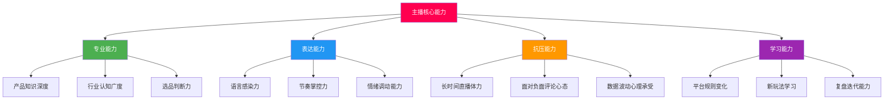
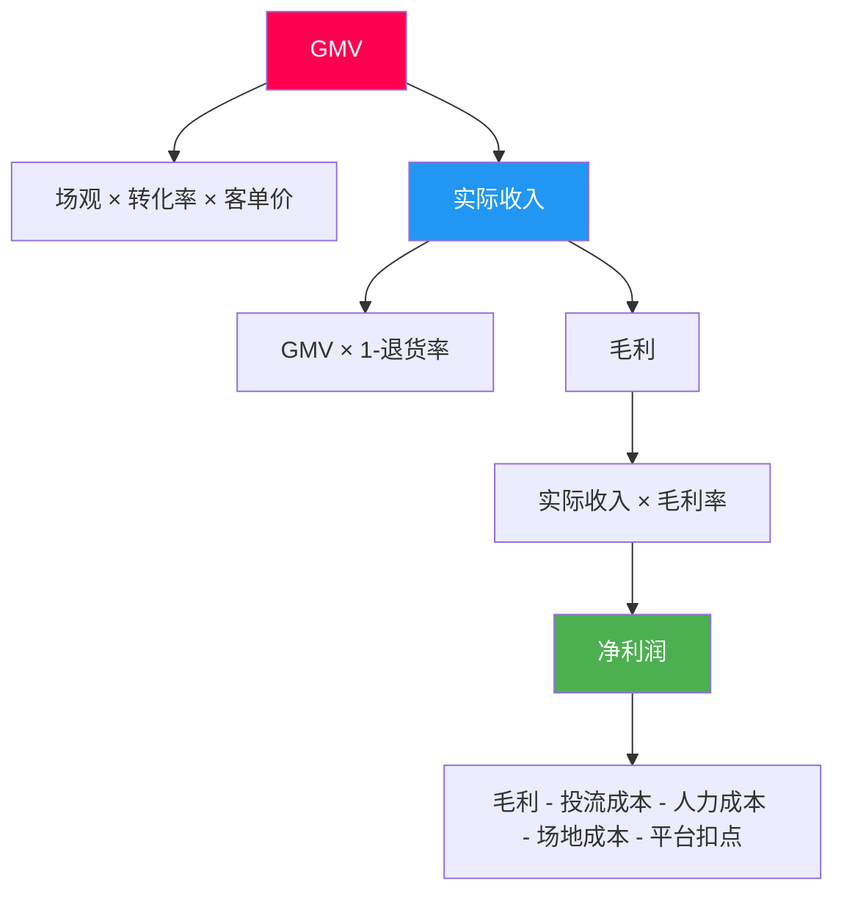
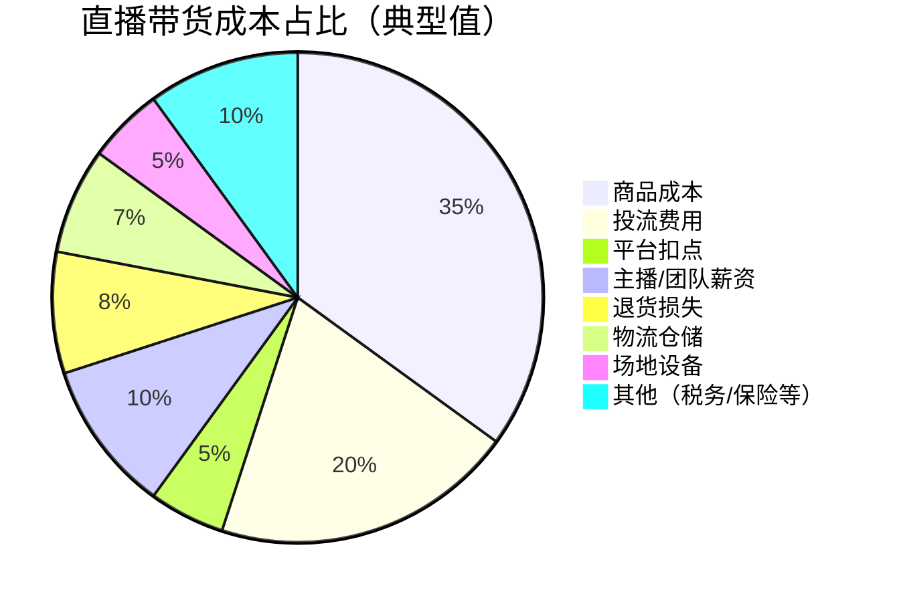
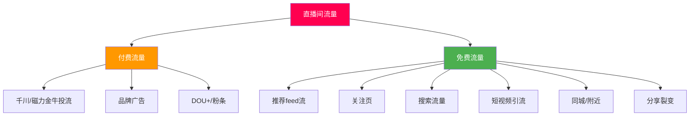
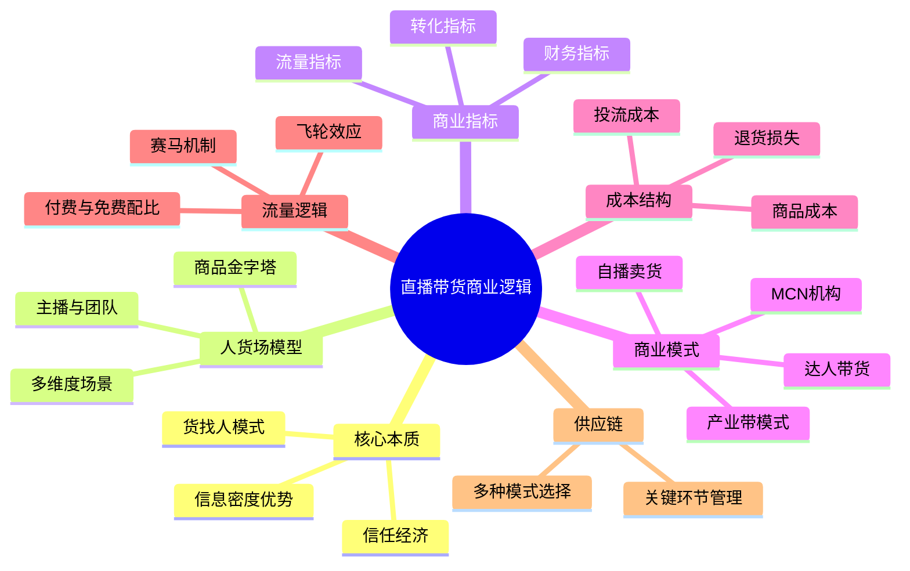

## 四、直播带货商业逻辑

直播带货并非简单的"在镜头前卖东西"，而是一套以**人（主播）、货（商品）、场（直播间）**为核心三角，以**信任经济**为底层驱动力，以**算法分发**为流量引擎的完整商业系统。理解其商业逻辑，是进入直播电商赛道的前提——不懂逻辑就上场，等于蒙眼开车。

### 4.1 直播带货的本质：信任经济的高效变现

#### 4.1.1 为什么直播间能卖货？

传统电商的购买路径是"需求→搜索→比价→下单"，用户带着明确需求主动寻找商品。而直播带货的路径完全不同：


这是一条**从"人找货"到"货找人"**的路径逆转。用户本来没有购物意图，但在直播间营造的氛围中，被信任的主播"种草"后完成购买。这背后是三个核心机制在起作用：

| 机制 | 说明 | 传统电商对比 |
|------|------|-------------|
| **信任转移** | 用户对主播的信任转移到商品上 | 信任来自品牌和平台 |
| **信息密度** | 短时间内通过视频+语音+互动获得大量商品信息 | 依赖图文详情页，信息密度低 |
| **决策压缩** | 从了解到购买的时间被压缩到几分钟 | 用户可能浏览数天反复比较 |
| **情绪驱动** | 限时限量制造紧迫感，从众效应降低决策门槛 | 理性决策为主 |
| **社交互动** | 实时问答、弹幕互动消除疑虑 | 单向信息传递，疑问无人解答 |

#### 4.1.2 信任的构建层次

信任不是凭空出现的，它有一条明确的构建路径：

```text
第一层：注意力信任（好看/有趣 → 愿意停留）
    ↓
第二层：专业信任（懂行/有经验 → 相信推荐）
    ↓
第三层：人格信任（真诚/靠谱 → 愿意托付）
    ↓
第四层：情感信任（陪伴/共鸣 → 无条件支持）
```

**案例拆解：** 以头部主播为例，李佳琦的信任基础是"专业"（BA出身，懂美妆），薇娅的信任基础是"人设"（全品类选品官，帮粉丝砍价），而东方甄选的信任基础是"知识"（教师背景，文化共鸣）。三条不同的信任路径，都能通向高GMV。

**关键启示：** 信任是直播带货最核心的资产，没有之一。粉丝数可以刷，GMV可以注水，但信任无法造假——退货率是检验信任的试金石。信任度高的直播间，退货率通常在15%-25%；信任度低的直播间，退货率可以高达50%-70%。

### 4.2 人货场三角模型深度拆解

#### 4.2.1 人（主播与团队）

主播是直播带货的"灵魂"，但绝不是唯一关键角色。一个成熟的直播间需要以下角色配合：

| 角色 | 职责 | 关键能力 |
|------|------|----------|
| **主播** | 产品讲解、互动引导、氛围把控 | 表达力、感染力、应变力 |
| **副播/助播** | 补充信息、回答弹幕、节奏配合 | 产品知识、配合默契度 |
| **场控** | 控制节奏、切换商品、管理上下架 | 流程熟悉度、时间把控力 |
| **运营** | 数据监控、投流策略、实时调整 | 数据分析能力、平台规则理解 |
| **客服** | 处理售后、回答私信 | 服务意识、问题处理效率 |

**主播的核心能力模型：**



#### 4.2.2 货（商品体系）

商品是直播带货的"弹药"，选品直接决定了直播间的利润空间和用户口碑。完整的商品体系包含四个层次：

**商品金字塔模型：**

```text
          △ 形象款（5%-10%）
         ／＼  高客单价，提升直播间调性
        ／  ＼ 如：限量联名、高端套装
       ／────＼
      ／ 利润款（40%-50%） ＼
     ／  中高客单价，利润空间大  ＼
    ／   如：品牌正装、组合套装    ＼
   ／──────────────────────────＼
  ／     活动款（20%-25%）          ＼
 ／  限时折扣，制造紧迫感和话题       ＼
／   如：秒杀品、满赠品                  ＼
────────────────────────────────────────
      引流款（20%-30%）
      低价高性价比，吸引进入直播间
      如：9.9包邮、1元秒杀
```

**选品的核心评估维度：**

1. **需求匹配度**：商品与直播间粉丝画像的契合程度。一个以25-35岁女性为主的直播间卖钓鱼装备，无论产品多好都很难卖动。
2. **利润结构**：不是看单品利润率，而是看综合利润率。引流款可以亏钱，但利润款必须有足够空间覆盖引流款的成本。
3. **展示效果**：直播是视觉+听觉的媒介，适合展示、效果直观的商品天然占优。食品可以试吃、服装可以试穿、美妆可以试妆——这些品类在直播中有天然优势。
4. **供应链稳定性**：爆单后能否及时发货？品质是否稳定？这是很多新手忽略但致命的问题。
5. **售后风险**：退货率高的品类（如服装）需要预留更多利润空间；退货率低的品类（如食品、日用品）可以接受较低利润率。

#### 4.2.3 场（直播间场景）

直播间的"场"不仅是物理空间，更是一个**多维度的消费场景**：

- **视觉场**：灯光、背景、产品陈列——第一印象决定用户是否停留
- **听觉场**：主播声音、背景音乐、音效——氛围感的关键组成
- **信息场**：价格标签、产品参数、优惠信息——降低决策成本
- **情绪场**：紧迫感、从众感、惊喜感——推动冲动消费
- **互动场**：弹幕、连麦、抽奖——参与感提升留存

**不同品类的场景设计差异：**

| 品类 | 场景风格 | 灯光重点 | 关键道具 | 案例参考 |
|------|----------|----------|----------|----------|
| 美妆护肤 | 简约时尚，镜面元素 | 柔和环形灯，显色准确 | 化妆镜、试色卡 | 李佳琦 |
| 服装穿搭 | 衣帽间风格 | 全身照光，色温准确 | 全身镜、衣架 | 交个朋友 |
| 食品生鲜 | 厨房/餐桌风格 | 暖色调，突出食欲感 | 餐具、试吃道具 | 东方甄选 |
| 数码3C | 科技感极简风 | 冷白光，突出产品细节 | 展示架、对比设备 | 疯狂小杨哥 |
| 家居日用 | 生活化场景 | 自然光或暖白光 | 实际使用场景搭建 | 蜜蜂惊喜社 |

### 4.3 直播带货的核心商业指标

直播带货的商业逻辑可以用一套完整的指标体系来量化。这些指标分为流量指标、转化指标、财务指标三个层次：

#### 4.3.1 流量指标层

| 指标 | 计算公式 | 健康基准 | 说明 |
|------|----------|----------|------|
| **场观** | 单场直播累计观看人数 | 根据账号量级而定 | 衡量直播间整体曝光量 |
| **峰值在线** | 同时在线人数最高值 | 场观的5%-15% | 反映直播间的即时吸引力 |
| **平均在线** | 整场平均同时在线人数 | 峰值的30%-50% | 衡量直播间的持续吸引力 |
| **平均停留时长** | 用户总停留时长÷UV | >1分钟（合格），>3分钟（优秀） | 反映内容吸引力 |
| **UV价值** | GMV÷UV | >1元（及格），>3元（优秀） | 每个独立访客贡献的GMV |

#### 4.3.2 转化指标层

| 指标 | 计算公式 | 健康基准 | 说明 |
|------|----------|----------|------|
| **点击率（CTR）** | 商品点击人数÷直播间UV | >5% | 反映商品吸引力 |
| **转化率（CVR）** | 下单人数÷商品点击人数 | >5%（及格），>10%（优秀） | 核心转化效率指标 |
| **GPM** | 千次观看成交额 | >500元（及格），>2000元（优秀） | 平台衡量直播间商业效率的关键指标 |
| **客单价** | GMV÷成交订单数 | 因品类而异 | 反映用户消费能力和商品结构 |
| **连带率** | 总件数÷总订单数 | >1.2 | 反映搭配推荐能力 |

#### 4.3.3 财务指标层

| 指标 | 计算公式 | 健康基准 | 说明 |
|------|----------|----------|------|
| **毛利率** | （售价-成本）÷售价 | >40%（可持续） | 扣除商品成本后的利润空间 |
| **退货率** | 退货订单÷总订单 | <30%（服装），<10%（食品） | 直接影响实际收入 |
| **ROI（投产比）** | GMV÷投流成本 | >3（盈利线） | 付费流量的投入产出比 |
| **净利率** | 净利润÷GMV | >10% | 扣除所有成本后的实际利润率 |

**关键关系图：**



### 4.4 直播带货的主流商业模式

#### 4.4.1 按角色定位分类

**模式一：达人带货型**

```text
定位：靠个人IP和内容能力为品牌/商家带货
收入来源：坑位费 + 佣金（通常20%-50%）
优势：轻资产，无需囤货，风险低
劣势：依赖个人IP，供应链不可控
适合人群：有内容创作能力、粉丝基础的创作者
代表案例：李佳琦、广东夫妇
```

**模式二：自播卖货型**

```text
定位：品牌或商家自己开播卖自家产品
收入来源：商品利润（100%归己）
优势：供应链可控，利润率高，品牌资产沉淀
劣势：需要库存投入，运营成本高
适合人群：有供应链优势的品牌方/工厂
代表案例：格力、太平鸟、珀莱雅
```

**模式三：MCN机构型**

```text
定位：孵化/签约主播，规模化运营多个直播间
收入来源：主播GMV分成（通常30%-70%）+ 品牌服务费
优势：规模化、矩阵化、抗风险能力强
劣势：管理成本高，主播流失风险
适合人群：有资金和团队的创业团队
代表案例：遥望科技、交个朋友、无忧传媒
```

**模式四：产业带型**

```text
定位：依托产业带优势，源头工厂直接开播
收入来源：商品利润，极致性价比
优势：价格优势明显，供应链反应速度快
劣势：品牌溢价低，过度依赖低价策略
适合人群：产业带工厂主/批发商
代表案例：义乌小商品、织里童装、南通家纺
```

#### 4.4.2 按平台生态分类

不同平台的直播带货逻辑有显著差异：

| 维度 | 抖音电商 | 快手电商 | 视频号电商 | 淘宝直播 |
|------|----------|----------|-----------|----------|
| **流量逻辑** | 兴趣推荐为主 | 关注+发现并重 | 社交推荐为主 | 搜索+推荐 |
| **核心优势** | 算法精准，爆款逻辑 | 私域粘性高，复购强 | 微信生态，社交裂变 | 购买意图强，转化高 |
| **用户画像** | 一二线为主，年轻化 | 下沉市场，家庭用户 | 30岁+，中高消费力 | 全线城市，购物心智强 |
| **核心指标** | GPM>千次成交额 | 信任电商GMV | 社交互动率 | 转化率 |
| **退货率** | 较高（40%-60%） | 较低（20%-40%） | 中等（30%-50%） | 中等（30%-50%） |
| **适合品类** | 美妆、服饰、食品 | 农产品、日用品、白牌 | 知识付费、高客单价 | 全品类 |
| **起号难度** | 中等（算法红利尚存） | 较低（老铁文化） | 较高（需要社交资源） | 较高（竞争激烈） |

### 4.5 直播带货的成本结构与盈利模型

#### 4.5.1 成本拆解

很多人只看GMV觉得直播带货很赚钱，但实际成本远比想象中复杂：

**单场直播成本结构：**



**各项成本详解：**

| 成本项 | 占比范围 | 说明 |
|--------|----------|------|
| **商品成本** | 30%-50% | 采购/生产成本，因品类差异大 |
| **投流费用** | 10%-30% | 千川、磁力金牛等付费流量投入 |
| **平台扣点** | 1%-5% | 平台技术服务费，因类目而异 |
| **主播薪资** | 5%-15% | 底薪+提成，头部主播提成可达30%+ |
| **退货损失** | 5%-15% | 退回商品的物流费、损耗、二次销售折价 |
| **物流仓储** | 5%-10% | 快递费、仓储费、打包人工费 |
| **场地设备** | 3%-8% | 直播间租金、设备折旧、耗材 |
| **其他** | 5%-10% | 税务、保险、软件工具、培训等 |

#### 4.5.2 盈利计算公式

**核心盈利公式：**

```text
净利润 = 实际GMV ×（1-退货率）× 毛利率 - 投流成本 - 固定运营成本

其中：
实际GMV = 场观 × 转化率 × 客单价
投流成本 = 自然流量占比的补足 + 直接付费投放
固定运营成本 = 人员工资 + 场地 + 设备折旧 + 其他固定支出
```

**盈利临界点计算示例：**

假设一场直播的参数如下：
- 场观：10,000人
- 转化率：3%
- 客单价：100元
- GMV = 10,000 × 3% × 100 = 30,000元
- 退货率：30%
- 实际GMV = 30,000 × 70% = 21,000元
- 毛利率：50%
- 毛利 = 21,000 × 50% = 10,500元
- 投流成本：5,000元
- 固定成本：3,000元/天
- **净利润 = 10,500 - 5,000 - 3,000 = 2,500元**

这个例子说明，表面GMV 3万的直播间，实际净利润可能只有2,500元。**利润率（净利润/GMV）仅为8.3%**。这就是为什么很多看似热闹的直播间实际上在亏钱。

#### 4.5.3 不同阶段的盈利策略

| 阶段 | 核心目标 | 投流策略 | 利润预期 | 关键指标 |
|------|----------|----------|----------|----------|
| **冷启动期（0-1万粉）** | 跑通模型，验证选品 | 少量投放测试人群包 | 允许亏损 | 停留时长、互动率 |
| **成长期（1-10万粉）** | 放大GMV，优化转化 | 加大投放，精细化运营 | 盈亏平衡 | GPM、转化率 |
| **成熟期（10万+粉）** | 稳定盈利，扩大利润 | 降低付费流量占比 | 持续盈利 | 净利润率、复购率 |
| **矩阵期** | 多号布局，规模化 | 矩阵号差异化投放 | 规模利润 | 单号利润、整体ROI |

### 4.6 直播带货的流量获取逻辑

#### 4.6.1 流量来源全景

直播间流量来源可分为付费流量和免费流量两大类：



#### 4.6.2 流量分配机制

平台推荐直播间流量的核心逻辑是**赛马机制**——在同一时间段、同一品类的直播间之间，谁的数据表现更好，谁就获得更多流量推荐。

**平台关注的核心数据（按权重排序）：**

1. **停留时长**（权重最高）：用户愿意看，说明内容有价值
2. **互动率**：评论、点赞、分享、关注——反映用户参与度
3. **商品点击率**：用户对商品感兴趣
4. **转化率/GPM**：商业效率，平台收入直接相关
5. **UV价值**：每个用户创造了多少商业价值
6. **粉丝转化率**：为平台沉淀了多少新增粉丝

**流量正循环（飞轮效应）：**

```text
好内容 → 用户停留 → 平台给更多流量 → 更多用户进来
    ↑                                      ↓
  数据优化 ← 数据反馈 ← 转化变现 ← 互动提升
```

**流量负循环（死亡螺旋）：**

```text
内容差 → 用户快速划走 → 平台减少推荐 → 流量下降
    ↑                                      ↓
  更难优化 ← 数据恶化 ← 恶性循环 ← 在线人数下降
```

#### 4.6.3 付费流量与免费流量的配比

健康的直播间应该追求**自然流量为主、付费流量为辅**的结构：

| 阶段 | 付费流量占比 | 免费流量占比 | 说明 |
|------|-------------|-------------|------|
| 冷启动期 | 60%-80% | 20%-40% | 用付费流量快速冷启动 |
| 成长期 | 40%-60% | 40%-60% | 逐步提升自然流量占比 |
| 成熟期 | 20%-40% | 60%-80% | 自然流量为主，付费为辅 |
| 理想状态 | 10%-20% | 80%-90% | 最佳盈利结构 |

**核心原则：** 付费流量是"启动器"和"放大器"，不是"永动机"。如果一个直播间离开付费流量就没有自然流量，说明内容或选品有问题，需要回到基本面优化。

### 4.7 直播带货的供应链逻辑

#### 4.7.1 供应链模式对比

| 模式 | 说明 | 启动资金 | 利润率 | 风险等级 | 适合阶段 |
|------|------|----------|--------|----------|----------|
| **纯佣代发** | 不囤货，商家一件代发 | <5,000元 | 10%-20% | 低 | 新手入门 |
| **少量囤货** | 热销款备少量库存 | 1万-5万 | 20%-35% | 中低 | 有稳定销量 |
| **批量采购** | 批量进货，压低成本 | 5万-50万 | 30%-50% | 中 | 成熟团队 |
| **自有工厂/品牌** | 自产自销 | 50万+ | 40%-60% | 高 | 品牌化运营 |
| **联营分利** | 与品牌联合运营，利润分成 | 看合作模式 | 25%-40% | 中 | 中腰部达人 |

#### 4.7.2 供应链管理的关键环节

```text
选品 → 打样/验货 → 谈判议价 → 备货 → 入仓/质检 → 发货 → 售后处理 → 数据复盘 → 迭代选品
```

**新手常见的供应链坑：**

1. **贪便宜进低质量货**：低价不等于高利润，退货率一高，利润全赔进去。建议先自己试用，再推荐给粉丝。
2. **不签合同口头合作**：供应商临时涨价、断货、以次充好——没有合同约束，出了问题只能自己承担。
3. **不做小批量测试**：一次性大批进货，结果卖不动砸在手里。任何新品先小量测试，数据验证后再放量。
4. **忽视库存周转率**：库存积压=资金冻结。健康库存周转天数应在30天以内。
5. **物流环节掉链子**：发货慢、包装差、快递暴力分拣——任何一个环节出问题，都会变成差评和退货。

### 4.8 直播带货的平台规则与合规要求

#### 4.8.1 核心红线（碰了就封号）

| 违规类型 | 具体表现 | 处罚 |
|----------|----------|------|
| **虚假宣传** | 夸大功效、虚构数据、伪造证书 | 降权/封号+罚款 |
| **违禁品销售** | 假货、三无产品、违禁药品 | 永久封号+法律追责 |
| **诱导私下交易** | 引导用户脱离平台付款 | 封号 |
| **刷单炒信** | 虚假交易提升销量数据 | 降权/封号 |
| **价格欺诈** | 先提价再降价、虚假原价 | 降权+罚款 |

#### 4.8.2 广告法敏感词（高频踩雷区）

直播话术中必须规避的敏感表述：

- **绝对化用语**："最好""第一""国家级""顶级"——需要有权威认证支撑
- **虚假承诺**："100%有效""包治""永不反弹"——无法验证的功效描述
- **诱导性用语**："不买就亏""错过再也没有"——过度制造焦虑
- **对比贬低**：直接点名竞品缺点——属于不正当竞争

**安全表达替换示例：**

| 危险表述 | 安全替换 |
|----------|----------|
| "全网最低价" | "我们争取到了非常有竞争力的价格" |
| "100%纯天然" | "主要成分为天然提取物" |
| "销量第一" | "销量领先"或"广受好评" |
| "永久美白" | "持续使用可改善肤色" |

### 4.9 直播带货的常见商业误区

#### 误区一：GMV至上，忽视利润

很多新手主播盲目追求GMV数字，觉得"卖了100万"就很厉害。但实际上，100万GMV如果退货率50%、毛利率30%、投流花30万，最终是**亏损**的。

**正确思维：** 关注"到账利润"而非"账面GMV"。真正的商业效率用"单小时净利润"衡量。

#### 误区二：盲目追求粉丝数量

粉丝多不等于能卖货。100万泛粉的转化率可能不到0.1%，而10万精准粉丝的转化率可以达到5%-10%。**粉丝质量远比数量重要。**

#### 误区三：觉得"只要价格低就能卖"

低价确实是引流利器，但纯靠低价的直播间有两个致命问题：利润不可持续、用户没有忠诚度。一旦有更低价格出现，用户立刻流失。**性价比≠纯低价。**

#### 误区四：忽视退货率

退货率是直播带货最容易被忽视的"利润杀手"。退货不仅意味着收入损失，还产生额外物流成本、库存压力、甚至商品损耗。控制退货率的核心在于**精准选品+真实展示+合理预期管理**。

#### 误区五：过度依赖单一主播

所有鸡蛋放在一个篮子里，主播一旦停播、跳槽、出问题，整个业务立刻停摆。成熟团队应该建立**主播矩阵**，确保没有单点故障。

#### 误区六：认为自然流量是"免费的"

自然流量虽然不直接花钱，但获取自然流量需要投入内容制作、团队运营、账号维护等隐性成本。而且自然流量不够稳定，完全依赖自然流量等于把命运交给算法。

### 4.10 直播带货的未来趋势

#### 4.10.1 AI与数字人直播

AI数字人技术正在快速成熟，部分品类已经可以实现24小时无人直播。但目前数字人在情感表达、即时互动、复杂话术方面仍有明显短板，更适合标准化商品（如日用品、标准食品）的常规时段直播。

#### 4.10.2 私域+直播融合

公域流量越来越贵，将直播间用户沉淀到私域（企业微信、社群、小程序）已成为行业共识。私域用户复购率是公域的3-5倍，获客成本趋近于零。

#### 4.10.3 内容电商深化

纯叫卖式直播的流量红利正在消退，平台算法越来越倾向推荐"有价值的内容+商品"组合。未来的直播间需要同时提供**信息价值、情绪价值和社交价值**，而不只是卖货。

#### 4.10.4 跨境直播电商

TikTok Shop、Shopee Live等海外平台的直播电商正在快速增长，中国供应链+中国直播运营经验的组合在东南亚、中东、拉美市场有明显优势。

### 4.11 本节核心要点回顾



**一句话总结：** 直播带货的商业逻辑可以用一个公式表达——**利润 = 信任度 × 选品能力 × 流量效率 × 运营精细度 - 各项成本**。每个环节都有优化空间，但信任是根基，没有信任，其他一切归零。

---
