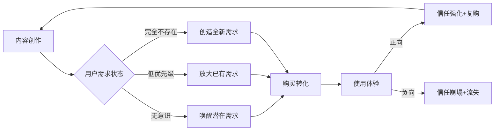
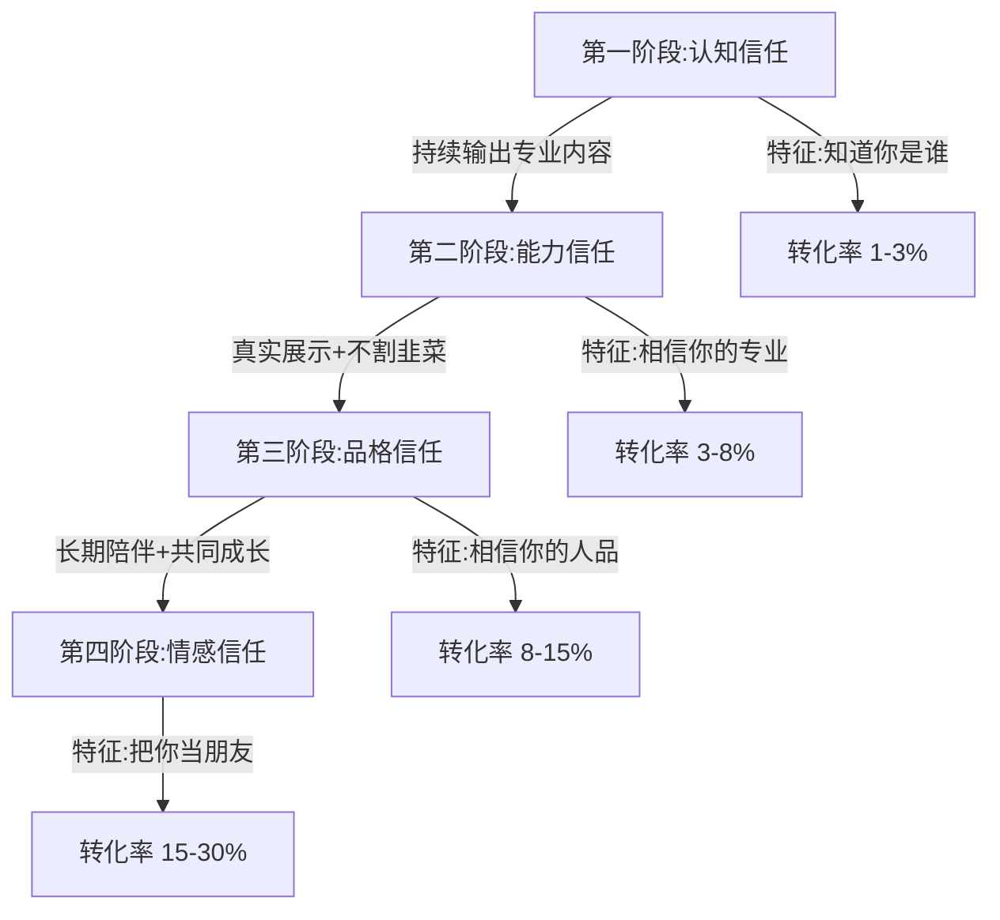
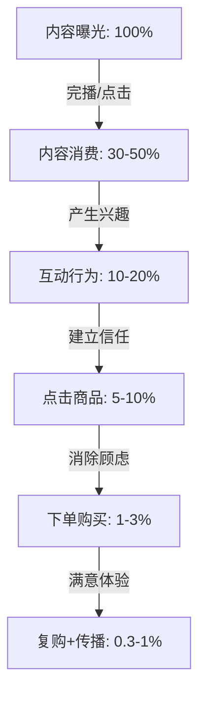
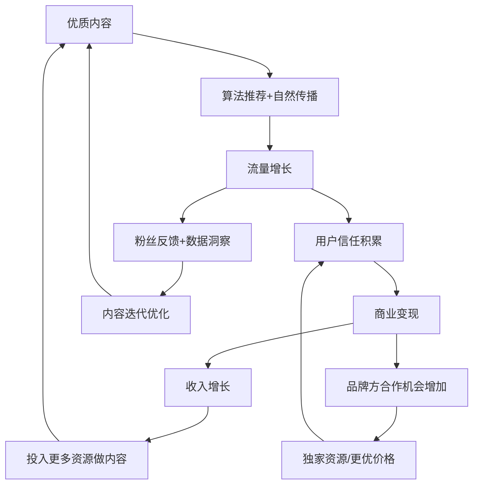
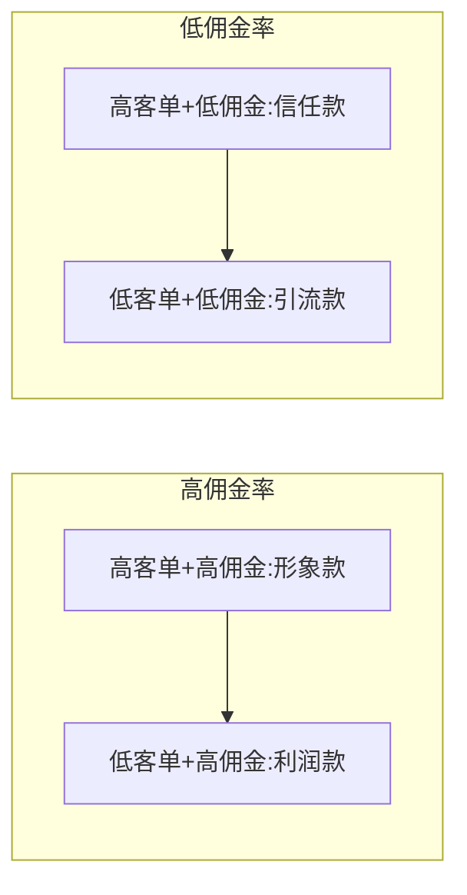
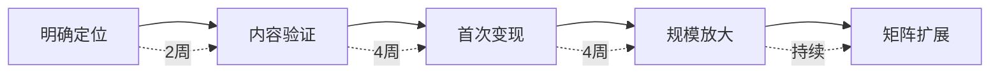

## 五、内容电商的底层逻辑

### 5.1 什么是内容电商：与传统电商的本质区别

传统电商是**"人找货"**的逻辑——用户有明确需求，打开淘宝/京东搜索关键词，比价下单。整个链路是：**需求→搜索→比价→购买**。平台的核心能力是"货架管理"，商家竞争的是搜索排名和价格。

内容电商是**"货找人"**的逻辑——用户本来没有购买意图，刷短视频或看直播时被内容激发了购买欲。整个链路是：**内容→兴趣→信任→购买**。平台的核心能力是"内容分发"，创作者竞争的是内容质量和用户信任。

两种模式的根本差异如下：

| 维度 | 传统电商（货架电商） | 内容电商 |
|------|---------------------|---------|
| 用户意图 | 主动搜索，需求明确 | 被动触达，需求待激发 |
| 流量来源 | 搜索+付费推广 | 内容推荐+社交传播 |
| 核心能力 | 供应链+价格优势 | 内容力+信任关系 |
| 转化逻辑 | 比价→选最优 | 种草→冲动/信任购买 |
| 用户关系 | 一次性交易为主 | 可沉淀为长期关系 |
| 复购驱动 | 价格+品牌 | 人设+内容+社群 |
| 典型平台 | 淘宝、京东、拼多多 | 抖音、快手、视频号、小红书 |
| 商业本质 | 流量变现 | 注意力+信任变现 |

> **关键认知：** 内容电商不是"在短视频里卖东西"这么简单。它的本质是**用内容创造购买需求**——用户本来没想买，你的内容让他觉得"我需要这个"。理解这一点，才能理解为什么有些账号粉丝很少但变现能力极强，而有些百万粉丝大号却带不动货。

### 5.2 内容电商的四大底层机制

#### 机制一：需求创造机制——从"满足需求"到"制造需求"

传统商业的核心是"发现需求→满足需求"。内容电商的核心能力是**在用户没有意识到自己有需求的时候，通过内容让他意识到需求的存在**。

需求创造有三个层次：

**第一层：唤醒潜在需求。** 用户有模糊的需求但没有意识到，内容帮他具象化。例如，一个讲收纳技巧的短视频，用户看完后意识到"我家也需要收纳盒"——这个需求一直存在，只是没被激活。

**第二层：放大已有需求。** 用户知道自己有需求，但优先级不高、预算有限。内容通过场景化展示让需求变得紧迫。例如，防晒霜测评视频通过展示紫外线对皮肤的累积伤害，让用户觉得"必须现在就买"。

**第三层：创造全新需求。** 用户完全没有这个需求，内容创造出全新的消费场景。例如，"围炉煮茶"短视频让大量用户购买了此前从未考虑过的煮茶器具。



**实操要点：** 不要试图在内容里"推销产品"，而要"展示问题→放大痛感→给出解决方案"。产品是解决方案的一部分，而不是内容的主角。

#### 机制二：信任传导机制——从"相信平台"到"相信个人"

传统电商的信任基础是**平台信用体系**——用户信任淘宝/京东的售后保障、评价系统、假一赔三等机制。内容电商的信任基础是**人格化信任**——用户信任的是"这个人"，而不是平台。

人格化信任的建立路径分为四个阶段：



| 信任阶段 | 用户心理 | 内容策略 | 转化率参考 |
|---------|---------|---------|-----------|
| 认知信任 | "这人是谁？看起来有点东西" | 持续输出垂直领域专业内容 | 1%-3% |
| 能力信任 | "他确实懂行，推荐的东西靠谱" | 展示专业背景、实操效果、对比测试 | 3%-8% |
| 品格信任 | "他不会为了赚钱坑我" | 主动揭露产品缺点、不做虚假承诺、退款售后痛快 | 8%-15% |
| 情感信任 | "他推荐的我都想试试" | 长期陪伴、生活分享、价值观共鸣、粉丝互动 | 15%-30% |

> **为什么信任是内容电商的核心资产？** 因为用户在内容场景下的购买决策时间极短（通常5-15秒），来不及做详细比价和产品研究。此时，用户是否信任推荐者，直接决定了是否下单。这就是为什么1000个铁杆粉丝（每个粉丝年消费1000元）可以产生100万年收入——信任本身就是变现能力。

#### 机制三：注意力-转化漏斗机制

内容电商的转化过程遵循一个标准的漏斗模型，但与传统营销漏斗有关键区别：**每一层的筛选标准不是"兴趣程度"，而是"内容匹配度"**。



**各环节的核心指标与优化策略：**

**曝光→内容消费（完播率/点击率）：** 这是漏斗入口，决定流量规模。短视频的核心是前3秒吸引力（悬念、冲突、利益点），直播的核心是封面和开播前30秒的话术设计。完播率从30%提升到50%，后续每一层的绝对数量都会按比例增长。

**内容消费→互动行为（互动率）：** 用户看完内容后是否点赞、评论、收藏、转发。互动行为既反映内容质量，也是算法推荐的重要信号。提升互动率的关键是在内容中设计"互动钩子"——提问、投票、争议观点、实用信息让"看完想收藏"。

**互动→点击商品（点击率）：** 用户从对内容感兴趣过渡到对商品感兴趣。这个环节的核心是**内容与商品的自然衔接**——硬广植入会导致大量用户流失，而"故事型种草"（用真实场景展示产品使用效果）可以将点击率提升3-5倍。

**点击→下单（转化率）：** 用户点击商品后最终完成支付。影响因素包括：商品详情页质量、价格竞争力、促销机制（限时折扣、赠品）、支付便捷性。直播间的限时限量话术在此环节尤为关键。

**下单→复购（复购率）：** 首单用户体验决定是否产生复购。产品质量、物流速度、售后服务、后续内容的持续吸引力共同影响复购率。

#### 机制四：内容-商业飞轮机制

内容电商最具威力的特征是**正向飞轮效应**——优质内容带来流量，流量带来商业收入，商业收入反哺更好的内容，形成自我强化的增长循环。



**飞轮转动的三个关键加速点：**

1. **内容质量加速器**：前100条内容决定了账号的算法标签和初始粉丝画像。投入足够精力打磨前期内容，比后期花钱投流更有效。一个从第一条内容就保持高质量的账号，冷启动速度是"先发再优化"账号的3-5倍。

2. **信任复利加速器**：信任是会复利的。第一次推荐好产品，第二次用户更容易下单；第二次体验好，第三次推荐的转化率更高。信任一旦建立，后续每一次变现的边际成本都在降低。

3. **数据飞轮加速器**：每一次内容发布都产生数据反馈（什么内容完播率高、什么选品转化率高、什么时段流量好），这些数据指导下一次内容创作，使内容-变现效率持续提升。

### 5.3 内容电商的三大商业模式

#### 模式一：内容种草+橱窗/挂车（轻模式）

**运作机制：** 通过短视频内容展示产品使用场景或效果，在视频中挂载商品链接或引导用户访问个人主页橱窗下单。

**核心特征：**
- 不需要囤货，多数走代发或分销
- 内容与商品高度关联，但不以"卖货"为直接目的
- 单条视频的转化率通常在0.5%-3%
- 适合有内容创作能力但没有供应链的创作者

**典型内容结构：**
```text
痛点切入（3秒）→ 场景展示（10秒）→ 产品引入（5秒）→ 使用效果（10秒）→ 引导行动（2秒）
```

**关键数据：**
- 平均佣金率：10%-30%（视品类而定）
- 千次播放收入（RPM）：5-50元
- 单条爆款视频收入范围：几百到几十万元
- 内容生命周期：3-7天（抖音），7-30天（视频号）

#### 模式二：直播带货（重模式）

**运作机制：** 通过直播间实时展示、讲解、促销商品，用户在直播间完成从了解到下单的全过程。主播是内容的生产者，也是销售员。

**核心特征：**
- 实时互动，转化链路最短
- 需要团队协作（主播、运营、场控、客服）
- 需要供应链支撑（选品、库存、物流）
- 单场GMV从几千到几千万不等

**直播带货的经济模型：**

| 收入来源 | 占比 | 说明 |
|---------|------|------|
| 商品佣金 | 60%-80% | 按成交额的20%-50%抽佣 |
| 坑位费 | 10%-20% | 品牌方支付的上架费用 |
| 平台流量激励 | 5%-15% | 平台的直播激励计划 |
| 打赏收入 | 0%-10% | 部分直播间兼有打赏 |

**直播间成本结构：**

| 成本项 | 占比 | 说明 |
|--------|------|------|
| 商品采购/代发成本 | 40%-60% | 自营模式下占比更高 |
| 人员工资 | 10%-20% | 主播、运营、场控等 |
| 流量投放 | 10%-25% | DOU+/千川/磁力金牛等 |
| 场地+设备 | 3%-8% | 直播间租金、灯光、摄像等 |
| 售后+退货 | 5%-15% | 退货率高的品类此项占比大 |

**盈亏平衡计算示例：**
- 假设客单价80元，佣金率30%，场均UV 5000人，转化率3%
- 单场GMV = 5000 × 3% × 80 = 12,000元
- 佣金收入 = 12,000 × 30% = 3,600元
- 扣除投流成本（1,500元）+ 人员分摊（800元）+ 售后（600元）
- 单场净利润 = 3,600 - 2,900 = 700元
- 日播模式下月利润 = 700 × 30 = 21,000元

> 这个计算表明，中小直播间要想盈利，核心变量是**转化率**和**客单价**。转化率从3%提升到5%，月利润直接翻倍以上。

#### 模式三：知识付费+内容电商（高利润模式）

**运作机制：** 通过免费内容建立专业形象和信任，引导用户购买付费课程、社群、咨询服务。部分创作者在此基础上叠加实物商品销售，形成"知识付费+实物电商"的复合模式。

**核心特征：**
- 利润率极高（知识产品边际成本接近零）
- 对创作者的专业能力和人设要求最高
- 复购和转介绍比例高
- 适合有真正专业积累的创作者

**收入结构示例（月均）：**

| 收入来源 | 金额 | 占比 | 说明 |
|---------|------|------|------|
| 系统课程 | 30,000元 | 40% | 定价299-999元的系列课程 |
| 付费社群 | 15,000元 | 20% | 年费制社群，每人199-999元 |
| 一对一咨询 | 10,000元 | 13% | 500-2000元/次 |
| 推荐商品佣金 | 12,000元 | 16% | 推荐与专业相关的实物产品 |
| 电子资料/模板 | 8,000元 | 11% | 低单价高复购 |
| **合计** | **75,000元** | **100%** | — |

### 5.4 内容电商的核心公式

理解内容电商的底层逻辑，需要掌握一个核心公式：

```text
内容电商收入 = 流量 × 转化率 × 客单价 × 复购率
```

这四个变量各自有独立的驱动因素：

| 变量 | 驱动因素 | 优化方向 |
|------|---------|---------|
| **流量** | 内容质量、发布频率、平台推荐、投放预算 | 提升完播率和互动率以获得算法推荐；稳定更新频率维持账号权重 |
| **转化率** | 信任深度、内容-商品匹配度、促销机制、产品详情页 | 先建立信任再带货；选择与内容调性一致的商品；设计有吸引力的促销组合 |
| **客单价** | 品类选择、用户画像、品牌溢价、组合销售 | 选择高客单价品类；通过内容塑造产品价值感；设计满减/组合装提升件单价 |
| **复购率** | 产品质量、售后服务、持续内容输出、私域运营 | 严选产品把关品质；建立私域社群持续触达；定期回访和专属优惠 |

**优化优先级：** 不同阶段应聚焦不同的变量——

- **起步期**（0-1万粉丝）：优先提升**转化率**。粉丝少时，每个粉丝都很珍贵，要确保内容-商品匹配度高，让有限的流量最大化变现。
- **成长期**（1-10万粉丝）：优先提升**流量**。此时内容方法论已经成熟，应该追求规模增长。
- **成熟期**（10万+粉丝）：优先提升**客单价和复购率**。流量增长放缓后，深度挖掘单客价值成为增长的关键。

### 5.5 内容电商的选品逻辑

选品是内容电商中最被低估的能力。很多创作者把90%的精力放在内容创作上，只花10%的时间选品。但实际上，**选品对最终收入的影响可能比内容更大**——同一个创作者，推荐A产品和推荐B产品，收入差距可以达到10倍。

#### 选品四象限模型



| 象限 | 选品类型 | 佣金率参考 | 客单价参考 | 作用 | 配比建议 |
|------|---------|-----------|-----------|------|---------|
| 引流款 | 日用百货、零食小吃 | 5%-15% | 9.9-49元 | 吸引用户首次下单，降低决策门槛 | 20%-30% |
| 利润款 | 美妆护肤、食品保健 | 20%-40% | 50-200元 | 贡献主要利润 | 40%-50% |
| 形象款 | 品牌商品、高端产品 | 10%-25% | 200元以上 | 提升账号调性和信任度 | 10%-15% |
| 福利款 | 平台补贴品、亏本引流品 | 0%-5% | 1-19.9元 | 直播间拉人气、拉停留 | 10%-20% |

#### 选品六维评估法

每个候选产品都需要在以下六个维度上评估打分（每项1-5分，总分30分，低于18分的产品不建议推）：

| 维度 | 评估标准 | 权重 |
|------|---------|------|
| **需求刚性** | 用户是否真的需要这个产品？是刚需还是可有可无？ | ×1.5 |
| **内容匹配度** | 这个产品与你的账号定位、内容调性是否一致？ | ×1.5 |
| **利润空间** | 佣金率是否足够覆盖运营成本并有合理利润？ | ×1.2 |
| **竞争程度** | 同类产品有多少创作者在推？你的差异化优势是什么？ | ×1.0 |
| **复购潜力** | 用户用完后是否需要再次购买？是否有系列品可以追销？ | ×1.0 |
| **售后风险** | 退货率高不高？品控是否有保障？是否容易引发投诉？ | ×1.3 |

> **选品铁律：** 宁可不推，也不推烂产品。一条差评的传播力是好评的5倍，一个翻车视频可以毁掉几个月的信任积累。

### 5.6 内容电商中的心理学原理

内容电商之所以有效，背后有一系列经得起验证的心理学机制。理解这些机制不是为了"操控"用户，而是为了**更高效地把好产品匹配给需要它的人**。

#### 锚定效应

**原理：** 人在做决策时，会过度依赖第一个接收到的信息（"锚"）作为参照。

**内容电商应用：**
- 直播间先展示专柜价格（锚），再给出直播价格（对比），用户感知到巨大优惠
- 短视频中先展示"其他方案"的高成本，再展示推荐产品的性价比
- 价格展示顺序：原价→折扣价→到手价→赠品价值，层层递进让用户觉得"赚到了"

#### 社会认同（从众效应）

**原理：** 人在不确定时，会参考他人的行为作为决策依据。

**内容电商应用：**
- 直播间实时滚动的"XX人正在购买"弹幕
- "这款已经卖了3万单了"的话术设计
- 展示评论区真实用户的使用反馈截图
- 短视频中展示销量数据、好评截图

#### 稀缺性原理

**原理：** 越稀缺的东西越有价值，人对"可能失去"的恐惧大于对"可能获得"的渴望。

**内容电商应用：**
- "最后500单，卖完就没了"——限量
- "今天这个价格只有直播间有，明天恢复原价"——限时
- "库存只备了2000份"——限量+限时双重刺激
- 注意：稀缺性必须是真实的，虚假稀缺会迅速损害信任

#### 损失厌恶

**原理：** 人对损失的痛感是获得同等收益快感的2-2.5倍。

**内容电商应用：**
- "不用这个防晒霜，你的皮肤每天都在加速老化"——不买的损失
- "这个优惠券今天过期，不用就浪费了"——已有权益的损失
- "你的同行都在用这个工具提升效率了"——竞争落后的损失

#### 互惠原则

**原理：** 当一方给予另一方好处时，受益方会产生回报的心理义务。

**内容电商应用：**
- 先免费分享大量实用知识（付出），再推荐产品（索取），用户接受度更高
- 直播间先发几波福利（付出），再推主力商品（索取）
- 持续输出高质量免费内容建立"情感账户"，变现时用户不会反感

### 5.7 不同平台的内容电商特征

虽然底层逻辑相同，但不同平台的内容电商运作方式有显著差异：

| 维度 | 抖音 | 快手 | 视频号 | 小红书 |
|------|------|------|--------|--------|
| **流量逻辑** | 算法推荐为主 | 算法+社交并重 | 社交推荐为主 | 搜索+推荐并重 |
| **电商成熟度** | 最高，闭环最完整 | 高，信任经济强 | 中等，快速追赶 | 中等，种草→外跳 |
| **用户决策特点** | 冲动消费为主，决策快 | 信任消费为主，重人设 | 熟人推荐，决策周期长 | 理性种草，搜索比价 |
| **最佳品类** | 美妆、食品、日用 | 食品、农产品、白牌 | 保健、家居、知识付费 | 美妆、母婴、家居 |
| **内容形式偏好** | 短视频为主，直播为辅 | 直播权重高 | 短视频+直播均重要 | 图文+短视频 |
| **客单价区间** | 30-150元 | 20-80元 | 50-300元 | 50-200元 |
| **退货率** | 30%-50% | 15%-30% | 20%-35% | 10%-25% |
| **核心优势** | 流量规模大，商业化工具完善 | 粉丝粘性高，退货率低 | 微信生态联动，私域转化强 | 种草效果好，用户消费力强 |
| **核心挑战** | 竞争激烈，流量成本持续上升 | 客单价偏低，品牌化难度大 | 推荐机制不成熟，流量不稳定 | 电商闭环尚未完全打通 |

### 5.8 内容电商的常见认知误区

#### 误区一："粉丝多=变现强"

**真相：** 粉丝数量和变现能力之间没有线性关系。10万精准粉丝的变现能力可能超过100万泛粉丝。关键变量是**粉丝画像与商品品类的匹配度**。一个做母婴内容的账号，粉丝以25-35岁宝妈为主，推荐母婴产品的转化率远高于一个百万粉丝的搞笑账号推荐同类产品。

**正确做法：** 从第一天就明确变现方向，围绕变现目标设计内容吸引目标用户，而不是追求泛流量。

#### 误区二："好内容自然能变现"

**真相：** 好内容带来流量，但流量不等于收入。大量"有流量没收入"的账号证明了这一点。内容好只是变现的必要条件，不是充分条件。从"有流量"到"能变现"之间，还需要：合适的变现模式、匹配的选品、有效的转化设计。

**正确做法：** 在规划内容时就把变现路径设计进去。先想清楚"这个账号靠什么赚钱"，再想"做什么内容能吸引到愿意为此付费的用户"。

#### 误区三："低价=好卖"

**真相：** 低价确实能降低决策门槛，但低价带来的用户质量最低、忠诚度最差、退货率最高。真正的内容电商高手追求的是**让用户为价值买单，而不是为低价买单**。一个定价299元的高品质产品，如果内容能充分展示其价值，转化率可能高于9.9元的劣质产品。

**正确做法：** 不要在价格上竞争，要在价值展示上竞争。用内容把产品价值讲透，让用户觉得"值这个价"。

#### 误区四："投流就能解决一切"

**真相：** 付费流量（DOU+、千川等）是放大器，不是发动机。如果内容本身不够好、转化率不够高，投流只会加速亏损。公式：**亏损 = 投放金额 × (1 - ROI)**。ROI<1时，投得越多亏得越多。

**正确做法：** 先用自然流量验证内容和选品的可行性（至少10条内容跑出稳定数据），确认ROI>2后再逐步放量。投流的正确姿势是"锦上添花"，不是"雪中送炭"。

#### 误区五："内容电商不需要售后"

**真相：** 内容电商的售后比传统电商更重要。因为用户购买决策基于对创作者的信任，如果售后体验差，伤害的不是一单生意，而是**整个信任资产**。一个在直播间被坑的用户，会在评论区、社群、甚至自己的社交账号上传播负面信息，造成信任崩塌的连锁反应。

**正确做法：** 把售后当作内容的一部分。主动跟进用户使用体验，出现问题第一时间解决，把售后成本当作维护信任资产的必要投入。

### 5.9 从理论到实践：内容电商的落地路径

理解底层逻辑之后，落地执行需要一个清晰的路径：

**第一步：明确定位（第1-2周）**
- 确定你的专业领域和目标受众
- 确定变现模式（种草带货/直播带货/知识付费）
- 分析竞品账号，找到差异化切入点
- 搭建账号基础设置（头像、简介、背景图）

**第二步：内容验证（第3-6周）**
- 发布20-30条内容，测试不同选题和形式
- 关注完播率、互动率、涨粉率等核心数据
- 找到"数据好+与变现方向一致"的内容类型
- 逐步缩小内容范围，建立清晰的账号标签

**第三步：首次变现（第7-10周）**
- 根据验证结果选择第一批商品或产品
- 设计内容-商品的自然衔接方式
- 小规模测试转化率和用户反馈
- 收集用户评价，优化选品和话术

**第四步：规模放大（第11周起）**
- 确认ROI为正后，逐步增加内容发布频率
- 建立稳定的选品-内容-变现SOP
- 引入付费投放放大效果
- 建立私域社群沉淀核心用户



### 5.10 内容电商的本质总结

回到最根本的问题：内容电商的底层逻辑到底是什么？

可以用一句话概括：**内容电商的本质是用信息差和信任关系重构商品流通链路。**

传统商品流通是：品牌→经销商→零售终端→消费者。每一层都有加价，消费者支付的是"渠道成本+信息不对称溢价"。

内容电商的流通是：创作者（用内容筛选用户+建立信任）→消费者。创作者替代了经销商、广告渠道和部分零售终端的功能，将节省的渠道成本转化为自己的收入。

这意味着内容电商创作者实际上承担了三个角色：
1. **媒体**——生产内容获取注意力
2. **渠道**——连接商品和消费者
3. **信任中介**——用自己的信誉为商品背书

能够同时把这三个角色做好的人，就是内容电商时代最大的赢家。

> **最后的忠告：** 内容电商的核心竞争力不是"卖货技巧"，而是"持续输出有价值内容的能力"和"维护用户信任的长期主义"。技巧可以学、可以模仿，但能力和信任只能靠时间积累。不要追求一夜暴富的捷径，把基础功练扎实，内容电商的复利效应会让你获得远超预期的回报。

***
