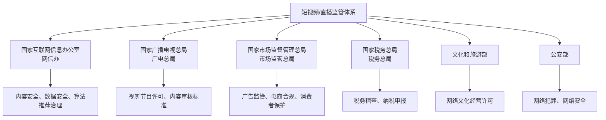
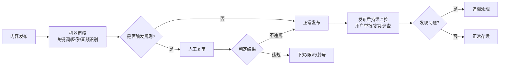
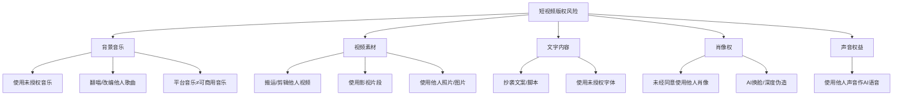

## 六、短视频行业的法律法规与合规要求

短视频与直播行业在爆发式增长的同时，也迎来了日益严格的监管环境。从内容审核、知识产权保护到税务合规，创作者和运营者必须建立系统的法律意识，才能在合规的框架内持续变现。本章从法律体系全景出发，逐层拆解内容合规、商业合规、数据隐私、税务义务等核心板块，帮助你构建完整的合规知识体系。

---

### 1. 短视频行业监管体系全景

#### 1.1 核心法律法规框架

中国短视频行业的监管涉及多个法律层级，从全国人大立法到部门规章再到平台自治规则，形成了一套多层次的规范体系。

| 层级 | 法律法规 | 核心规制内容 | 施行时间 |
|------|----------|-------------|---------|
| 法律 | 《网络安全法》 | 网络安全、数据保护、实名制 | 2017.06 |
| 法律 | 《电子商务法》 | 电商直播、消费者权益、纳税义务 | 2019.01 |
| 法律 | 《广告法》 | 广告发布、虚假宣传、特殊商品广告 | 2021修订 |
| 法律 | 《著作权法》 | 版权保护、合理使用、侵权责任 | 2021.06 |
| 法律 | 《个人信息保护法》 | 个人信息收集、使用、跨境传输 | 2021.11 |
| 法律 | 《未成年人保护法》 | 未成年人网络保护、打赏限制 | 2021.06 |
| 法律 | 《反不正当竞争法》 | 商业诋毁、虚假交易、刷量炒信 | 2019修订 |
| 行政法规 | 《互联网信息服务管理办法》 | 互联网信息服务提供者义务 | 2011修订 |
| 部门规章 | 《网络视听节目服务管理规定》 | 短视频/直播节目许可与内容管理 | 2021修订 |
| 部门规章 | 《互联网直播服务管理规定》 | 直播资质、实名、内容审核 | 2016.12 |
| 规范性文件 | 《网络短视频内容审核标准细则》(100条) | 短视频内容审核具体标准 | 2021.12 |
| 规范性文件 | 《关于加强网络直播规范管理工作的指导意见》 | 打赏限额、实名、未成年保护 | 2021.02 |

#### 1.2 主要监管机构及职责



**关键点：** 短视频创作者面对的不是单一监管方，而是多部门交叉监管。一次直播带货可能同时涉及广告法（市场监管总局）、电商法（商务部）、税法（税务总局）和内容管理（网信办/广电总局）的规制。

#### 1.3 2023-2025年监管趋势

近年来监管呈现以下趋势，创作者需要前瞻性地关注：

- **算法透明化：** 《互联网信息服务算法推荐管理规定》要求平台公示算法基本原理，创作者需理解推荐算法与合规的关系
- **MCN机构纳入监管：** 2024年起多地将MCN机构纳入网络表演经纪机构管理，要求持证经营
- **直播电商专项治理：** 虚假宣传、价格欺诈、"最低价"承诺等成为重点打击对象
- **AI生成内容标注：** 《生成式人工智能服务管理暂行办法》要求AI生成内容必须明确标注
- **跨境内容监管：** 涉及境外平台的内容发布、跨境直播带货面临更严格的合规审查

---

### 2. 内容合规：100条审核标准详解

#### 2.1 内容红线分类

《网络短视频内容审核标准细则》列出了100条审核标准，涵盖21个大类禁止内容。创作者必须熟知以下核心红线：

**绝对红线（触碰即封号/追究刑责）：**

1. **危害国家安全：** 反对宪法确定的基本原则、危害国家统一和领土完整、泄露国家秘密、损害国家荣誉和利益
2. **煽动非法活动：** 煽动民族仇恨/歧视、破坏民族团结、宣扬恐怖主义/极端主义、宣扬邪教
3. **暴力与色情：** 展示淫秽色情、渲染暴力血腥、宣扬赌博、教唆犯罪
4. **虚假信息：** 散布谣言扰乱社会秩序、编造传播虚假险情疫情灾情

**高风险内容（易触发限流/警告/下架）：**

| 类别 | 具体违规情形 | 常见触发场景 |
|------|-------------|-------------|
| 低俗擦边 | 性暗示动作/语言、暴露着装 | 舞蹈类、健身类内容过度展示 |
| 标题党 | 惊悚/夸大/歪曲标题 | "震惊！""99%的人不知道" |
| 虚假宣传 | 夸大功效、虚构经历 | 美妆/保健品/教育培训类 |
| 封建迷信 | 占卜算命、风水转运 | 玄学类、星座类内容 |
| 争议言论 | 地域歧视、性别对立 | 社会评论类内容 |
| 未标注广告 | 商业推广未明确标识 | 种草/测评/软植入类 |
| 侵犯隐私 | 未经同意拍摄/曝光他人 | 街拍、Vlog、纠纷曝光 |

#### 2.2 特殊品类内容的额外要求

**医疗健康类：**
- 不得发布诊疗方案、处方建议
- 不得宣传未经验证的偏方、秘方
- 健康科普需标注"本内容仅供健康科普，不作为诊疗依据"
- 涉及医疗器械/药品的，需持有相关资质

**财经金融类：**
- 不得直接推荐个股、预测具体涨跌
- 不得承诺投资回报率
- 金融产品推广需标注风险提示
- 涉及证券/期货分析需持有投资咨询资格

**教育培训类：**
- 不得制造焦虑（"你的孩子正在被同龄人抛弃"）
- 不得虚构培训效果、师资背景
- 需标明机构办学许可证号
- 不得以"保过""保分"作为宣传卖点

**食品/保健品/化妆品类：**
- 不得使用"最高级""最佳""第一"等绝对化用语
- 不得暗示治疗功效（保健品不是药品）
- 美妆效果展示需标注"效果因人而异"
- 食品类需标注生产许可证号

#### 2.3 内容审核机制与应对策略

平台的内容审核一般分为三个阶段：



**合规实操建议：**

1. **发布前自查清单：** 每次发布前对照100条标准逐项检查，重点检查标题、封面、前3秒画面、口播文案
2. **敏感词规避：** 不要试图用谐音字、拼音缩写绕过审核——平台的NLP模型已能识别大多数变体，且刻意规避可能加重处罚
3. **合规话术模板：** 为常见品类准备合规话术模板（如保健品："本品为保健食品，不能替代药物治疗"）
4. **内容存档：** 所有发布内容本地备份，包括文案脚本、拍摄素材、审核截图，以备申诉使用

---

### 3. 知识产权合规

#### 3.1 短视频中的版权风险地图

短视频涉及的版权问题远比大多数人意识到的复杂。以下是主要风险点：



#### 3.2 背景音乐版权解决方案

背景音乐是短视频侵权的最高发区域。解决方案如下：

| 方案 | 适用场景 | 成本 | 风险等级 |
|------|---------|------|---------|
| 平台曲库 | 日常创作 | 免费 | 低（仅限该平台使用） |
| CC0/公共领域音乐 | 通用创作 | 免费 | 极低 |
| 正版音乐授权平台 | 商业推广 | 50-5000元/首 | 极低 |
| 原创/定制音乐 | 品牌账号 | 视情况 | 极低 |
| AI生成音乐 | 日常创作 | 免费-低价 | 中（版权归属待定） |

**关键注意事项：**
- 平台提供的音乐库通常**仅授权在该平台使用**，将视频搬运到其他平台时，音乐授权不随之转移
- 翻唱他人歌曲仍需获得词曲著作权人的许可，短视频平台的"翻唱功能"通常已获得平台层面的批量授权
- AI生成音乐的版权归属在中国法律框架下尚无明确定论，商业使用需谨慎

#### 3.3 合理使用的边界

《著作权法》第24条规定了合理使用的情形，但短视频创作中常见的"二次创作"（如影视解说、混剪、Reaction视频）是否属于合理使用，实践中争议很大：

**可能构成合理使用的情形：**
- 为个人学习、研究或欣赏使用他人作品
- 为介绍、评论某一作品或说明某一问题，在作品中适当引用他人已发表的作品
- 时事新闻报道中不可避免地再现或引用

**通常不构成合理使用的情形：**
- 影视剧完整剧情解说（即使有个人评论）
- 大段剪辑他人视频拼接成"合集"
- 将他人原创内容翻译/改编后发布
- 以商业推广为目的使用他人作品

**实操建议：** 如果你的"二次创作"以他人的作品为主要内容、替代了原作品的市场价值，那么即使添加了个人评论，也很难被认定为合理使用。安全做法是获得授权，或仅使用极少量素材并确保自己的原创内容占绝对主体。

#### 3.4 商标权与商业标识合规

- 不得在视频中擅自使用他人注册商标做商业推广
- "测评"类内容可以提及品牌名称（属于描述性合理使用），但不得暗示品牌授权或合作关系
- 直播带货中销售假冒商品，主播可能承担连带责任

---

### 4. 广告与商业推广合规

#### 4.1 广告标识义务

根据《广告法》和《互联网广告管理办法》，所有商业推广内容必须明确标注为广告。具体要求：

**必须标注"广告"的情形：**
- 品牌方付费的种草/测评内容
- 通过星图、蒲公英等平台接的商单
- 软植入（产品在视频中自然出现但实际为付费安排）
- 直播带货（整个直播或单个商品环节）
- 团购/优惠券推广（有佣金收入的）

**违规后果：**
- 平台层面：限流、下架、扣除信用分、封禁商业化权限
- 行政层面：市场监管部门可处以广告费用3-5倍罚款，无法计算的处20万-100万元罚款
- 民事层面：消费者可要求赔偿

#### 4.2 直播带货的特殊合规要求

直播带货融合了广告法、电商法、消费者权益保护法的多重规制：

**主播/创作者的义务：**

| 义务 | 具体要求 | 法律依据 |
|------|---------|---------|
| 真实体验 | 推荐商品应基于真实使用体验 | 《广告法》第4条 |
| 资质核验 | 核验商家的营业执照、许可证 | 《电子商务法》第27条 |
| 信息公示 | 公示商品的生产者、产地、价格 | 《电子商务法》第17条 |
| 禁止虚假宣传 | 不得虚构使用效果、编造用户评价 | 《反不正当竞争法》第8条 |
| 价格合规 | 不得虚构原价、虚假折扣 | 《价格法》第14条 |
| 售后保障 | 7天无理由退换货等 | 《消费者权益保护法》第25条 |

**重点风险场景：**

1. **"最低价"承诺：** 2023年起，多个头部主播因"全网最低价"宣传被处罚。《广告法》禁止使用"最低""最佳"等绝对化用语，除非有客观数据支撑
2. **虚假产地/成分：** 宣称"进口""有机""纯天然"需有相应证明
3. **食品/保健品直播：** 不得宣传治疗功效，不得使用患者/医生形象作推荐
4. **"饥饿营销"：** 虚构库存紧张、限量抢购可能构成价格欺诈

#### 4.3 特殊商品的广告限制

以下品类在短视频/直播中有严格的广告限制：

```mermaid
graph TD
    A[特殊商品广告限制] --> B[禁止广告]
    A --> C[限制广告]
    A --> D[需前置审批]
    
    B --> B1[烟草]
    B --> B2[处方药]
    B --> B3[枪支弹药/管制刀具]
    
    C --> C1[酒类：不得出现饮酒动作]
    C --> C2[非处方药：需忠告语]
    C --> C3[医疗器械：需标注禁忌]
    C --> C4[保健食品：需标注"不能替代药物"]
    C --> C5[教育培训：不得承诺效果]
    C --> C6[房地产：需标注预售许可证]
    
    D --> D1[药品广告：需药品广告审查批准文号]
    D --> D2[医疗器械广告：需审查批准]
    D --> D3[农药/兽药广告：需审查批准]
```

---

### 5. 数据隐私与个人信息保护

#### 5.1 创作者的数据合规义务

短视频创作者在运营过程中会接触到大量用户数据，需要遵守《个人信息保护法》：

**常见数据处理场景及合规要点：**

| 场景 | 涉及数据 | 合规要求 |
|------|---------|---------|
| 直播互动 | 弹幕、昵称、头像 | 平台已获得用户授权，创作者无需额外处理 |
| 粉丝群运营 | 微信号、手机号、地址 | 需明确告知收集目的，获得同意 |
| 抽奖/送礼 | 姓名、联系方式、收货地址 | 需取得单独同意，明示处理目的 |
| 短视频中出现他人 | 面部、声音、姓名 | 需获得本人同意（肖像权+隐私权） |
| 私信沟通 | 聊天记录、个人信息 | 不得截图公开，除非获得对方同意 |
| 数据分析 | 用户行为数据 | 使用平台官方工具，不自行爬取 |

#### 5.2 未成年人保护

涉及未成年人的内容受到特别严格的保护：

1. **不得诱导未成年人打赏：** 2021年起，未成年人打赏可全额退款，主播/平台需配合
2. **未成年人出镜限制：** 不得利用未成年人牟利，不得让未成年人进行不适宜的表演
3. **青少年模式：** 平台在青少年模式下限制打赏、消费、使用时长等功能
4. **儿童个人信息：** 收集14岁以下儿童信息需获得监护人同意

#### 5.3 数据安全实践建议

- **最小化收集：** 只收集业务必需的用户信息，不索取多余权限
- **加密存储：** 用户联系方式、地址等信息加密存储，定期清理过期数据
- **避免泄露：** 直播时不展示后台数据（如订单信息、用户私信），截图打码处理
- **第三方工具审查：** 使用数据分析工具前，审查其隐私政策和数据安全资质

---

### 6. 税务合规

#### 6.1 短视频创作者的收入类型与纳税义务

短视频创作者的收入来源多样，每种收入对应不同的税务处理方式：

| 收入类型 | 所得类别 | 税率 | 计税方式 |
|---------|---------|------|---------|
| 平台广告分成（如创作激励） | 劳务报酬所得 | 20%-40%（预扣） | 年终汇算清缴，多退少补 |
| 直播打赏/礼物 | 劳务报酬所得 | 20%-40%（预扣） | 同上 |
| 商务推广/广告费 | 劳务报酬所得 | 20%-40%（预扣） | 同上 |
| 直播带货佣金 | 劳务报酬所得 | 20%-40%（预扣） | 同上 |
| 自营店铺收入 | 经营所得 | 5%-35% | 查账征收或核定征收 |
| 签约MCN的工资薪金 | 工资薪金所得 | 3%-45% | 累进税率 |

**重要提醒：**
- 平台通常会代扣代缴个人所得税（劳务报酬预扣），但创作者仍需在次年3-6月进行年度汇算清缴
- 多平台收入需要合并计算，可能触发更高的税率档
- 部分平台仅对超过起征点的收入代扣税，小额收入未代扣不等于免税

#### 6.2 税务筹划的合法路径

**注册个体工商户/个人独资企业：**
- 将劳务报酬转化为经营所得，适用5%-35%累进税率
- 可享受小规模纳税人增值税减免政策（月销售额10万以下免征增值税）
- 可列支合理的经营成本（设备购置、场地租金、助手薪资等）

**合理列支成本：**
- 拍摄设备（相机、灯光、收音设备）
- 场地费用（工作室租金、布景费用）
- 工具费用（剪辑软件、素材平台、数据工具）
- 学习费用（培训课程、行业大会）
- 外包费用（剪辑、设计、运营外包）

**税务合规红线：**
- **绝对不能虚开发票**
- **不能通过私人账户隐匿收入**
- **不能将个人消费列为经营成本**
- **不能利用税收洼地的核定征收进行避税**（2021年税务总局已对此进行专项清理）

#### 6.3 MCN签约的税务考量

签约MCN机构时，合同中的税务条款直接影响你的实际收入：

- **劳务合同 vs 经纪合同：** 劳动关系下MCN代扣工资薪金税（3%-45%）；合作关系下各自独立纳税
- **分成比例与税负：** 50%分成不等于到手50%——需明确分成是税前还是税后
- **发票问题：** 个人无法给MCN开具发票，MCN可能以此压低分成比例或要求你注册个体户
- **社保公积金：** 劳动关系下MCN应缴纳社保，合作关系下无此义务但也无此保障

---

### 7. 平台规则与自治规范

#### 7.1 主流平台合规规则对比

除法律法规外，各平台还有自己的社区规范和商业化规则，违规同样面临处罚：

| 规则维度 | 抖音 | 快手 | B站 | 视频号 |
|---------|------|------|-----|--------|
| 账号实名 | 必须 | 必须 | 必须 | 必须 |
| 带货门槛 | 1000粉+发布10条 | 0粉可开橱窗 | 1000粉+实名认证 | 0粉可开橱窗 |
| 广告标识要求 | 必须通过星图/蒲公英接单 | 必须标注"广告" | 必须标注"合作" | 必须标注"广告" |
| 内容审核 | AI初审+人工复审 | AI初审+人工复审 | AI+风纪委员会 | AI初审+人工复审 |
| 信用分体系 | 12分制 | 信用分制 | 风纪委员制度 | 信用分制 |
| 违规处罚 | 限流→下架→封号 | 限流→下架→封号 | 禁言→封号 | 限流→下架→封号 |

#### 7.2 平台处罚的应对策略

**收到违规通知后的处理流程：**

1. **确认违规内容：** 仔细阅读违规通知，定位具体违规内容和条款
2. **判断是否误判：** 如果确实是误判，准备申诉材料（截图、原始素材、合规依据）
3. **及时申诉：** 大多数平台的申诉窗口为7-30天，逾期不予受理
4. **申诉材料准备：**
   - 原始内容截图/录屏
   - 合规依据说明（引用具体法规或平台规则）
   - 如果涉及授权，提供授权文件
5. **多渠道申诉：** APP内申诉 + 客服电话 + 官方邮箱，重要账号可联系平台运营对接人

**申诉成功率提升技巧：**
- 文字说明要简洁明了，直指误判点
- 附上截图证据，标注关键信息
- 引用平台自身的规则条文作为依据
- 态度客观理性，不使用情绪化语言
- 如果第一次申诉失败，可以补充新材料再次申诉

---

### 8. 合规体系建设实操指南

#### 8.1 创作者合规自检清单

将以下清单打印或保存为文档，每次发布内容前逐项检查：

**内容层面：**
- [ ] 标题无夸大、惊悚、虚假信息
- [ ] 封面无低俗、暴力、误导性画面
- [ ] 视频内容无政治敏感、色情擦边、暴力血腥
- [ ] 引用他人素材已获得授权或属于合理使用范围
- [ ] 背景音乐已确认版权状态
- [ ] AI生成内容已明确标注
- [ ] 涉及专业领域（医疗/法律/金融）的内容已添加免责声明

**商业层面：**
- [ ] 所有商业推广内容已标注"广告"/"合作"
- [ ] 推荐商品基于真实体验，无虚假宣传
- [ ] 已核实商家资质和产品许可
- [ ] 价格信息真实，无虚构原价/虚假折扣
- [ ] 未使用绝对化用语（"最好""第一""最低价"）
- [ ] 特殊品类（药品/保健品/金融产品）已满足额外合规要求

**数据隐私层面：**
- [ ] 视频中出现的他人面部已获得本人同意
- [ ] 未泄露任何用户的个人信息
- [ ] 抽奖/活动已明示规则和隐私处理方式
- [ ] 未涉及未成年人不当内容

#### 8.2 合规风险评估矩阵

定期（建议每季度一次）对自己的内容矩阵进行风险评估：

| 风险等级 | 内容类型 | 发生概率 | 影响程度 | 应对措施 |
|---------|---------|---------|---------|---------|
| 高风险 | 直播带货（食品/保健品） | 高 | 高（罚款+封号） | 法务审核+合规话术+全程录屏 |
| 高风险 | 财经/医疗科普 | 中 | 高（行政处罚） | 资质合规+免责声明+内容审核 |
| 中风险 | 影视解说/二次创作 | 高 | 中（下架+版权投诉） | 授权获取+原创占比提升 |
| 中风险 | 种草/测评类 | 中 | 中（虚假宣传风险） | 真实体验+广告标识+数据引用 |
| 低风险 | 纯原创内容（日常/知识） | 低 | 低 | 基础审核即可 |

#### 8.3 专业支持资源

当遇到以下情况时，建议寻求专业法律支持：

- 收到法院传票或律师函
- 被市场监管部门调查
- 涉及金额较大的合同纠纷
- MCN解约争议
- 账号被永久封禁且申诉无果
- 税务稽查或补税通知

**获取法律支持的途径：**
- 中国互联网协会调解中心（在线纠纷调解）
- 当地市场监督管理局（投诉举报）
- 知识产权法院/互联网法院（版权纠纷）
- 专业律师（建议找有互联网行业经验的律师）
- 平台官方创作者服务（部分平台提供法律咨询服务）

---

### 9. 典型案例警示

#### 9.1 内容违规案例

**案例一：某头部主播虚假宣传燕窝事件**
- **事实：** 直播中将糖水宣传为"燕窝"，涉及虚假宣传
- **处罚：** 市场监管部门罚款90万元，平台封禁60天，品牌方被吊销营业执照
- **教训：** 带货前必须核验产品成分和功效，不能仅听信品牌方的宣传话术

**案例二：某博主"AI换脸"侵权案**
- **事实：** 使用AI技术将他人面部替换到视频中并发布
- **判决：** 侵犯肖像权，赔偿精神损害抚慰金和经济损失
- **教训：** AI技术不是法外之地，深度伪造需获得被换脸者本人同意

**案例三：某知识博主税务稽查案**
- **事实：** 通过私人账户收取广告费，未申报纳税
- **处罚：** 补缴税款、滞纳金和罚款合计数百万元
- **教训：** 私人账户收款不等于隐形收入，银行大额交易监控+税务大数据比对让隐匿收入几乎不可能

#### 9.2 合规经营的成功案例

**案例：某美妆博主的合规化转型**
- **背景：** 此前因多次被判定"夸大宣传"导致限流
- **措施：**
  - 所有产品推荐标注"效果因人而异"
  - 测试数据引用第三方检测报告
  - 接入星图平台进行规范化商单合作
  - 为每条商业推广内容制作合规标注
- **结果：** 6个月内商业合作收入提升40%，零违规记录

---

### 10. 常见误区与纠正

| 误区 | 正确认知 |
|------|---------|
| "小博主不会被查" | 税务稽查依赖大数据比对，与粉丝量无关 |
| "用了平台曲库就万无一失" | 平台曲库授权通常仅限本平台，跨平台搬运仍侵权 |
| "加了'不构成医疗建议'就没问题" | 免责声明不能免除违法责任，只是降低风险 |
| "没收到侵权通知就说明没问题" | 权利人可能尚未发现或正在取证，不代表不侵权 |
| "自己拍的内容就完全归自己" | 涉及他人肖像、音乐、品牌标识的内容仍需合规 |
| "口头约定就可以接商单" | 没有书面合同，出现纠纷时难以维权 |
| "MCN会帮我处理合规问题" | 合规是创作者自己的义务，MCN不能替代个人责任 |
| "删掉违规内容就没事了" | 平台有存档，监管部门有技术手段恢复已删除内容 |

---

### 11. 进阶：合规驱动的商业模式优化

合规不只是"不做错事"，更是构建竞争壁垒的手段：

1. **合规即信任：** 在直播带货中，合规经营的创作者更容易获得品牌长期合作，因为品牌方也面临合规压力
2. **合规降低运营风险：** 建立合规审核流程后，内容被下架/限流的概率大幅降低，相当于提升了流量效率
3. **合规拓宽变现渠道：** 持有相关资质（如食品经营许可证）的创作者，可以销售更多品类的商品
4. **合规内容更具长尾价值：** 不依赖擦边、标题党的优质内容，生命周期更长，长期收益更高

**建立合规优势的具体做法：**
- 将合规审核纳入内容生产SOP（标准作业流程），而不是事后补救
- 建立品牌合作的资质审查机制，拒绝不合规的商单
- 定期更新合规知识（关注网信办、市场监管总局官网公告）
- 加入行业自律组织（如中国网络视听节目服务协会），获取最新行业规范

---

> **核心要点：** 短视频行业的法律法规体系复杂且动态更新，创作者需要建立"合规前置"的思维——在内容创作和商业变现的每个环节都提前考虑合规要求，而不是事后补救。合规不是创作的束缚，而是长期稳定变现的基石。
