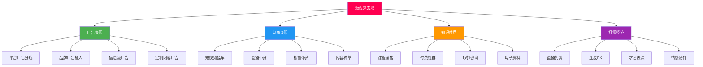
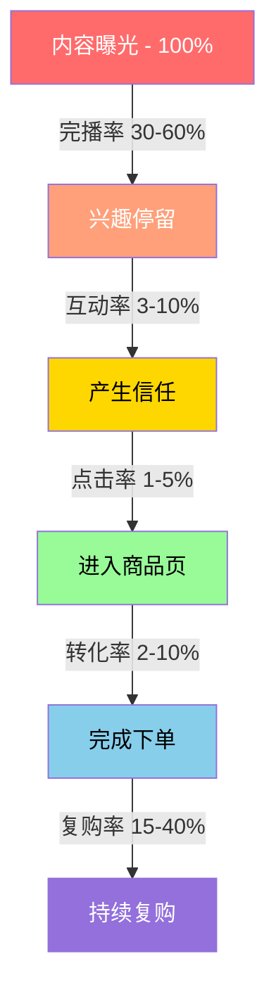
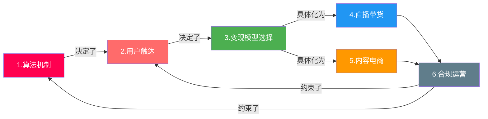

## 本节小结：短视频与直播变现的理论基础

本节从六个维度构建了短视频与直播变现的理论认知框架。理论不是空中楼阁——每一条原理都直接指导后续的实操决策。下面逐一回顾核心要点，并梳理它们之间的内在关联。

### 一、平台算法推荐机制：流量分配的游戏规则

**核心结论：** 短视频平台的本质是"注意力分配器"，算法决定了你的内容能被多少人看到。不理解算法，一切运营都是盲人摸象。

**抖音——赛马制流量池：**

抖音采用去中心化的流量分发机制，新视频先投入200-500的基础流量池，根据数据表现逐级晋升：

| 流量池层级 | 播放量范围 | 晋升条件 |
|------------|------------|----------|
| 初级池 | 200-500 | 发布即获得 |
| 二级池 | 1,000-5,000 | 完播率、互动率达标 |
| 三级池 | 1万-10万 | 数据持续优秀 |
| 高级池 | 10万-1000万 | 各项指标全面领先 |

算法权重排序：**完播率 > 互动率 > 关注率 > 分享率 > 停留时长**。完播率是第一权重，这意味着视频的前3秒决定生死。

**快手——社交+兴趣双轮驱动：**

快手采用双列点选模式，用户主动选择观看内容，算法更重视社交关系链（关注、同城）和内容质量的长期积累。快手的流量分配更"公平"，头部创作者不会垄断大部分流量，中小创作者有更多生存空间。

**视频号——社交推荐为主：**

视频号的独特之处在于依托微信社交关系链。朋友点赞的内容会被推荐给朋友的朋友，形成"社交裂变式"传播。这意味着在视频号上，冷启动的关键不是内容质量（虽然也重要），而是你的社交网络质量和第一批点赞者的社交影响力。

**实操启示：** 同一条内容在三个平台的表现可能天差地别。抖音重"刺激感"（3秒抓眼球），快手重"真实感"（接地气、有温度），视频号重"信任感"（社交背书）。选平台就是选打法，不存在"一套内容打天下"的策略。

### 二、用户画像与行为分析：你的内容给谁看

**核心结论：** 用户画像决定了内容调性、选品策略和定价区间。用错了语气说话，内容再好也没人买单。

**三大平台用户画像对比：**

| 维度 | 抖音 | 快手 | 视频号 |
|------|------|------|--------|
| 核心年龄 | 25-35岁 | 18-40岁（下沉为主） | 30-50岁 |
| 城市分布 | 一二线为主 | 三四线及以下占60% | 一二线+新一线 |
| 消费特征 | 追求品质、冲动消费 | 注重性价比、信任消费 | 决策周期长、客单价高 |
| 内容偏好 | 精致、有创意、快节奏 | 真实、有烟火气、慢节奏 | 实用、有深度、有社交价值 |
| 付费意愿 | 中高（受内容种草驱动） | 中等（受信任关系驱动） | 高（受社交推荐驱动） |

**用户行为的四个关键节点：**

1. **注意力捕获**（0-3秒）：用户决定是否继续观看。黄金法则：前3秒必须给出"信息钩子"——悬念、冲突、利益点、视觉冲击。
2. **内容消费**（3秒-结束）：用户是否看完。节奏感、信息密度、情绪曲线是核心。完播率>60%算优秀。
3. **互动决策**（看完后）：是否点赞/评论/收藏。"有用"和"有感"是互动的两个触发器。
4. **转化行为**（互动后）：是否关注/购买/分享。信任感和紧迫感是转化的催化剂。

**实操启示：** 先确定你要服务哪类人群，再反推内容风格和选品策略。想卖高端护肤品就别用快手的老铁风格，想卖日用百货就别在视频号端着架子讲大道理。

### 三、变现模型分析：钱从哪里来

**核心结论：** 短视频变现不是只有"带货"一条路。四大变现模型各有适用场景，选对模型比努力更重要。

**四大变现模型全景：**



**各模型的关键参数对比：**

| 变现模型 | 启动门槛 | 收入天花板 | 粉丝量要求 | 核心能力要求 | 典型收入来源 |
|----------|----------|------------|------------|--------------|--------------|
| 广告变现 | 低 | 中（1-10万/月） | 1万+ | 内容质量、垂直度 | 星图接单、平台分成 |
| 电商变现 | 中 | 高（无上限） | 1000+（挂车） | 选品、供应链、话术 | 佣金、自有品牌利润 |
| 知识付费 | 中 | 高（10-100万/月） | 5000+ | 专业深度、教学能力 | 课程、社群、咨询 |
| 打赏经济 | 低 | 中低（不稳定） | 无硬性要求 | 才艺、人格魅力、互动 | 礼物分成（到手30-50%） |

**变现路径选择建议：**

- **知识型创作者**（教师、行业专家、技能达人）：优先选择"知识付费+广告"组合。知识付费的毛利率高达80%以上，且不受供应链限制。
- **生活方式类创作者**（美食、旅行、穿搭）：适合"电商带货+打赏"双引擎。内容本身就是种草，转化路径短。
- **有供应链优势的**（工厂主、批发商、品牌方）：直接走"直播带货"路线，利润空间最大。
- **才艺型创作者**（歌手、舞者、脱口秀）：以"打赏+广告"为主，后期可拓展知识付费（教学）。

**MCN合作的四种模式：**

| 模式 | 特点 | 适合阶段 | 分成比例 |
|------|------|----------|----------|
| 保底+分成 | 有基本收入保障 | 成长期创作者 | 保底+30-50%流水分成 |
| 纯分成 | 无保底，按比例分 | 已有一定收入的创作者 | 50-70%归创作者 |
| 项目制 | 按单个项目合作 | 有明确商业需求时 | 按项目协商 |
| 孵化模式 | MCN全额投入 | 新人（有潜力） | MCN分成比例更高 |

> **重要提醒：** 打赏收入的平台抽成通常为50%-70%，主播实际到手仅为打赏总额的30%-50%。不要被直播间的"礼物雨"迷惑，实际收入远低于表面数字。打赏收入不稳定，不应作为主要变现模型。

### 四、直播带货商业逻辑：人货场的三角关系

**核心结论：** 直播带货的本质是"信任变现"——用户因为信任主播而购买。人、货、场三大要素缺一不可。

**"人"——主播的核心能力模型：**

| 能力维度 | 具体要求 | 权重 |
|----------|----------|------|
| 人设定位 | 清晰的记忆点（专业、亲和、搞笑、高端） | 25% |
| 表达能力 | 话术流畅、节奏把控、情绪调动 | 30% |
| 产品知识 | 对所售产品深入了解，能回答专业问题 | 25% |
| 互动能力 | 及时回应弹幕、制造话题、引导下单 | 20% |

**"货"——选品的四象限法则：**

```text
                    高毛利
                      │
        形象款(10%)   │   利润款(50%)
        提升调性      │   核心盈利产品
                      │
  低复购 ─────────────┼───────────── 高复购
                      │
        引流款(20%)   │   福利款(20%)
        吸引流量      │   培养消费习惯
                      │
                    低毛利
```

- **引流款（20%）**：低价高性价比，用来拉人气。例：9.9元包邮的小商品。
- **利润款（50%）**：中等价格、高复购率，是直播间的核心盈利来源。例：客单价50-200元的日常消费品。
- **形象款（10%）**：高价高品质，用来提升直播间调性和信任感。例：品牌正品、限量款。
- **福利款（20%）**：低毛利但高复购，培养用户消费习惯。例：日用消耗品的超值套装。

**"场"——直播间场景搭建要素：**

| 要素 | 基础配置 | 进阶配置 | 投资预算 |
|------|----------|----------|----------|
| 灯光 | 环形补光灯（100-300元） | 三点布光（主光+辅光+轮廓光） | 500-2000元 |
| 摄像 | 手机前置摄像头 | 专业相机+采集卡 | 3000-10000元 |
| 收音 | 手机内置麦克风 | 领夹麦/指向性麦克风 | 200-1000元 |
| 背景 | 干净墙面+简单装饰 | 品牌背景板+产品展示架 | 500-3000元 |
| 网络 | 100Mbps宽带 | 专线+备用网络 | 按需 |

**直播话术的四个阶段：**

1. **开场话术**（前5分钟）：自我介绍+今日福利预告+互动引导。目的：留住进入直播间的用户，拉升在线人数。
2. **产品介绍**（核心时段）：痛点切入→产品展示→使用演示→价格对比→限时优惠。每款产品控制在5-10分钟。
3. **逼单话术**（临门一脚）：倒计时、限量、赠品、价格对比、用户证言。制造紧迫感和从众心理。
4. **成交后维护**：感谢+售后说明+预告下次直播+引导关注。降低退货率，培养复购。

**实操启示：** 新手做直播带货，最容易犯的错误是"只关注产品不关注人"。用户来直播间不只是买东西，更是来"逛"和"玩"。主播的人格魅力和互动体验，往往比产品本身更能决定转化率。

### 五、内容电商的底层逻辑：创造需求而非满足需求

**核心结论：** 内容电商与传统电商的根本区别在于——传统电商是"人找货"（用户有明确需求，主动搜索），内容电商是"货找人"（用户没有明确需求，被内容激发购买欲）。

**两种电商模式的本质差异：**

| 维度 | 传统电商（搜索电商） | 内容电商 |
|------|----------------------|----------|
| 用户意图 | 有明确购买需求 | 无明确需求，被内容种草 |
| 流量逻辑 | 关键词搜索→商品列表 | 内容推荐→兴趣激发→下单 |
| 决策路径 | 搜索→比价→下单（理性） | 刷到→心动→下单（感性） |
| 转化关键 | 价格、销量、评价 | 内容质量、主播信任、场景代入 |
| 客单价 | 因比价而偏低 | 因冲动消费而偏高 |
| 复购驱动 | 价格和习惯 | 内容粘性和信任关系 |

**内容电商的三层转化漏斗：**



**内容种草的四个层次：**

1. **功能种草**：展示产品的使用效果和功能优势。最基础的种草方式，适合标品和功能性产品。例：测评视频、开箱视频。
2. **场景种草**：将产品嵌入具体生活场景，让用户产生代入感。例：在家做早餐时用到的厨具，旅行途中用到的装备。
3. **情绪种草**：通过情绪共鸣激发购买欲。例："犒劳自己"、"精致生活"、"送给妈妈的礼物"。
4. **信任种草**：通过长期内容积累建立信任，用户"闭眼买"。例：专业医生推荐的保健品、资深厨师推荐的调料。

**内容电商的选品原则：**

- **高视觉冲击力**：在手机小屏幕上，视觉效果好的产品更容易被"种草"。例：美妆、美食、服装。
- **高情感附加值**：能承载情感表达的产品更容易冲动消费。例：礼物、饰品、鲜花。
- **低决策成本**：单价在用户"不心疼"的范围内。抖音上50-200元是黄金价格带。
- **高复购率**：消耗品比耐用品更适合内容电商。例：零食、日用品比家电更适合。
- **易展示效果**：能在15-60秒内展示出明显效果的产品。例：清洁剂的前后对比、化妆品的上妆效果。

**实操启示：** 内容电商的核心竞争力不是"低价"，而是"种草能力"。同样的产品，会种草的主播能卖100元，不会种草的只能靠降价到60元来竞争。投入精力提升内容质量，比投入精力谈更低的进货价更有长期价值。

### 六、法律法规与合规要求：守住底线才能走得远

**核心结论：** 短视频与直播行业的监管日趋严格，合规不是可选项，而是生存条件。一次违规可能导致账号限流、封禁甚至法律诉讼。

**必须了解的核心法规：**

| 法规/规范 | 核心要求 | 违规后果 |
|-----------|----------|----------|
| 《广告法》 | 不得虚假宣传、使用绝对化用语 | 罚款20-100万元 |
| 《电子商务法》 | 直播带货需明确标注广告、如实描述商品 | 行政处罚+民事赔偿 |
| 《网络直播营销管理办法》 | 主播实名制、不得诱导未成年人打赏 | 平台处罚+行政处罚 |
| 《消费者权益保护法》 | 七天无理由退货、售后保障 | 民事赔偿+平台处罚 |
| 《食品安全法》 | 食品类直播需有相关资质 | 行政处罚+刑事责任 |
| 平台社区规范 | 各平台的具体内容审核标准 | 限流、降权、封号 |

**高频违规场景与避坑指南：**

| 违规类型 | 常见表现 | 正确做法 |
|----------|----------|----------|
| 虚假宣传 | "全网最低价"、"100%有效" | 用"性价比高"、"多数用户反馈良好" |
| 绝对化用语 | "最好的"、"第一"、"唯一" | 用"优质的"、"领先的"、"其中一种" |
| 诱导消费 | "不买就亏了"、"错过再等一年" | 客观介绍产品价值和优惠信息 |
| 未标注广告 | 品牌合作内容未标明 | 在视频/直播中明确标注"广告"或"合作" |
| 侵权使用 | 未经授权使用他人音乐、图片、视频 | 使用平台自带素材库或购买正版授权 |
| 数据造假 | 刷粉、刷单、刷互动 | 合规运营，依靠内容质量获取真实数据 |

**特殊品类的资质要求：**

- **食品类**：需要食品经营许可证、食品生产许可证，散装食品还需卫生许可证。
- **美妆类**：需要化妆品生产许可证，特殊化妆品（美白、防晒等）还需特殊化妆品注册证。
- **保健品类**：需要保健食品批准文号，不得宣称治疗功效。
- **医疗器械类**：需要医疗器械经营许可证，二类及以上需备案或注册。
- **金融理财类**：需要相关金融牌照，不得承诺收益。

**账号安全的五条红线：**

1. **不碰政治敏感话题**：不评论时政、不传播未经证实的社会事件。
2. **不碰低俗内容**：不打擦边球，不利用性暗示吸引流量。
3. **不碰虚假数据**：不刷粉、不刷单、不买僵尸粉。
4. **不碰侵权内容**：不搬运他人视频、不盗用他人音乐和图片。
5. **不碰违禁商品**：不销售假冒伪劣、三无产品、违禁品。

> **风险提示：** 2024年以来，平台对直播带货的监管力度持续加大。抖音、快手均建立了"信用分"体系，违规行为会累积扣分，分数低于阈值将限制直播功能甚至封号。合规运营不是"吃亏"，而是对自身商业资产的保护。

### 七、六节内容的内在关联

这六个知识模块不是孤立的，它们构成了一个完整的认知闭环：



**关联逻辑说明：**

1. **算法决定触达**：你了解了平台的推荐算法，才知道如何让内容被目标用户看到。抖音的赛马制要求高完播率，快手的社交权重要求建立信任关系，视频号的社交裂变要求撬动初始社交网络。
2. **用户画像决定变现模型**：你了解了用户是谁，才能选择合适的变现模型。年轻女性用户适合美妆电商，中年知识群体适合知识付费，下沉市场用户适合高性价比商品直播。
3. **变现模型指导实操**：变现模型确定后，才能针对性地设计直播带货策略或内容电商策略。
4. **合规是底线约束**：无论选择哪种变现路径，都必须在法律法规的框架内运行。合规不是限制，而是让你走得更远的保障。

### 八、从理论到实操：下一步行动建议

完成理论基础的学习后，建议按以下顺序推进：

| 步骤 | 行动 | 对应理论模块 | 预期成果 |
|------|------|--------------|----------|
| 1 | 选择1-2个目标平台，深度体验其推荐机制 | 算法机制 | 形成平台直觉 |
| 2 | 确定目标用户画像，制定内容调性方案 | 用户画像 | 内容风格明确 |
| 3 | 选择1种变现模型作为主攻方向 | 变现模型 | 商业模式清晰 |
| 4 | 学习核心技巧模块的对应章节 | 综合应用 | 掌握实操方法 |
| 5 | 从小规模测试开始，验证理论假设 | 综合应用 | 积累实战数据 |

> **关键提醒：** 理论学习的目的是"建立正确的认知框架"，而不是"记住所有知识点"。在后续的实操过程中，如果遇到具体问题，回来查阅对应的理论模块，往往能找到问题的根源。理论和实践是螺旋上升的关系——先学理论指导实践，再用实践印证和深化理论。

### 九、核心术语速查表

本节涉及的关键术语汇总，方便后续查阅：

| 术语 | 含义 | 所属模块 |
|------|------|----------|
| 赛马制 | 平台通过小范围数据测试决定是否扩大推送的机制 | 算法机制 |
| 完播率 | 视频被完整观看的比例，抖音算法的第一权重指标 | 算法机制 |
| 流量池 | 平台为内容分配的初始曝光量级，数据达标后逐级晋升 | 算法机制 |
| UV价值 | 每个独立访客带来的平均收入 = GMV ÷ UV数 | 变现模型 |
| GMV | 成交总额（Gross Merchandise Value） | 变现模型 |
| ROI | 投入产出比（Return on Investment） | 变现模型 |
| 星图 | 抖音的商业合作平台，连接创作者与品牌方 | 广告变现 |
| 挂车 | 在短视频中嵌入商品链接，用户点击即可购买 | 电商变现 |
| DOU+ | 抖音的付费推广工具，用付费流量撬动自然流量 | 算法机制 |
| MCN | 多频道网络（Multi-Channel Network），批量孵化和管理创作者的机构 | 变现模型 |
| 人货场 | 直播带货的三大核心要素：主播、商品、场景 | 直播带货 |
| 四象限选品法 | 将商品按毛利和复购率分为引流款/利润款/形象款/福利款 | 直播带货 |
| 种草 | 通过内容影响用户购买决策，使其产生购买欲望 | 内容电商 |
| 私域流量 | 可反复触达、无需付费的自有用户池（如微信群、企业微信） | 内容电商 |

> **学习自检：** 如果你能用自己的话解释"为什么抖音的完播率比点赞率更重要"、"内容电商和搜索电商的本质区别是什么"、"直播带货的四象限选品法如何运用"这三个问题，说明你已经掌握了理论基础的核心内容。可以进入核心技巧模块的学习了。
