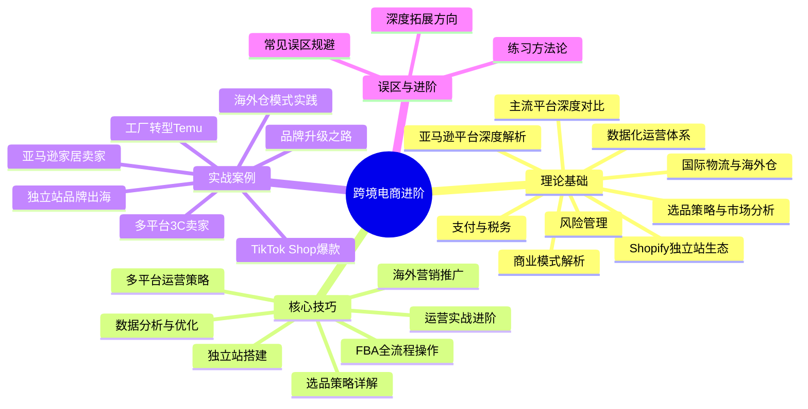
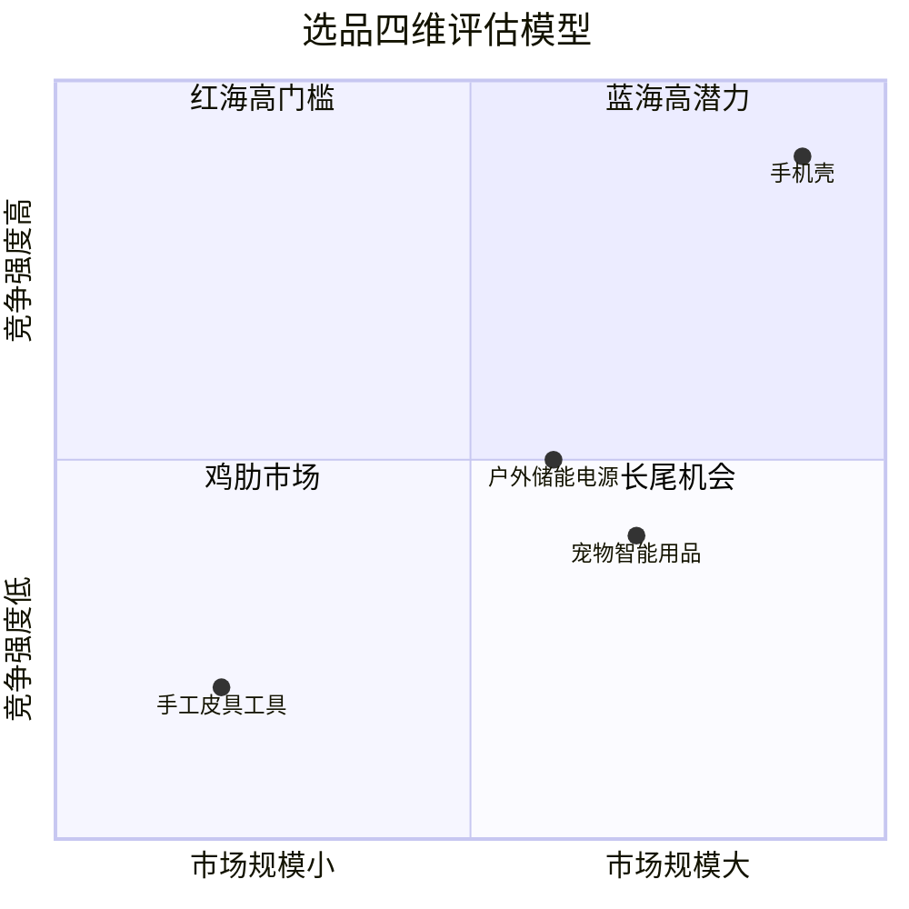
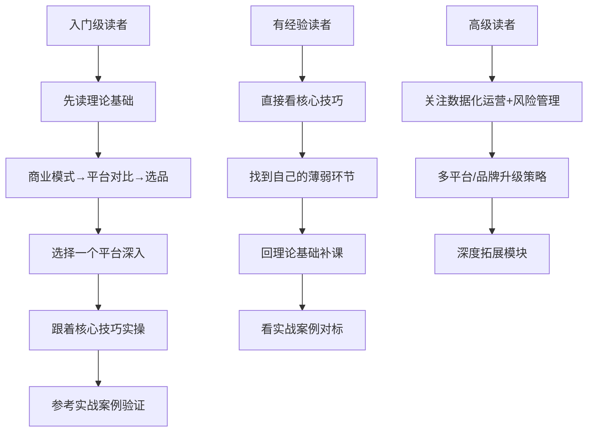

## 章节概览

跨境电商是将商品通过互联网销售到海外市场的商业模式，是当前全球贸易数字化转型的核心驱动力。据海关总署数据，2024年中国跨境电商进出口额达2.63万亿元人民币，同比增长10.8%，其中出口额超过2万亿元，占中国货物出口总额的约7.5%。全球范围内，跨境电子商务市场规模在2025年预计突破8万亿美元，年复合增长率（CAGR）保持在25%以上。

本章从商业模式、平台选择、运营实操、营销推广、数据分析、风险管理六大维度，系统构建跨境电商进阶知识体系，帮助读者从"知道跨境电商"跨越到"能独立操盘跨境电商业务"。

### 一、本章知识地图

### 二、核心知识体系

#### 2.1 跨境电商商业模式全景

跨境电商并非简单的"把东西卖到国外"，而是一个涵盖选品、采购、仓储、物流、支付、营销、客服、合规的完整商业链条。本章首先厘清三种主流商业模式的本质差异：

| 模式 | 核心特征 | 典型平台 | 启动资金 | 利润率 | 运营复杂度 |
|------|----------|----------|----------|--------|------------|
| **第三方平台卖家** | 依托平台流量，按规则运营 | Amazon、eBay、Temu、Shopee | 3万-20万元 | 10%-30% | 中等 |
| **独立站品牌** | 自建网站，自主获客 | Shopify、WooCommerce、Magento | 5万-50万元 | 30%-60% | 高 |
| **DTC品牌出海** | 品牌+供应链+渠道一体化 | 自有站+平台+社交电商 | 50万-500万元 | 40%-70% | 很高 |

每种模式没有绝对的优劣，关键在于匹配自身的资源禀赋：有供应链优势的工厂型卖家适合从Temu/亚马逊起步；有内容创作能力的团队适合TikTok Shop+独立站组合；有品牌运营经验的团队可以走DTC路线。

#### 2.2 亚马逊平台深度解析

亚马逊是全球最大的电商平台之一，2024年净销售额超过6000亿美元，第三方卖家贡献了平台60%以上的销售额。本章对亚马逊的解析覆盖：

- **A10算法机制**：搜索排名的核心逻辑从A9演进到A10，更加强调外部流量、转化率和客户满意度。理解算法是亚马逊运营的第一课。
- **FBA（Fulfillment by Amazon）全流程**：从创建发货计划、贴标装箱、头程物流选择，到库存管理、长期仓储费规避、退货处理的完整操作链路。
- **Listing优化工程**：标题、五点描述、A+页面、后台关键词、图片/视频的系统化优化方法，以及如何通过A/B测试持续迭代。
- **广告体系**：SP（Sponsored Products）、SB（Sponsored Brands）、SD（Sponsored Display）三种广告类型的投放策略、竞价逻辑、预算分配和优化节奏。
- **品牌注册与保护**：Amazon Brand Registry的申请流程、品牌旗舰店搭建、品牌分析工具的使用，以及应对跟卖和侵权的实战策略。

#### 2.3 独立站生态构建

独立站（Self-hosted E-commerce Website）是摆脱平台依赖、构建品牌资产的核心路径。本章以Shopify为主线，覆盖独立站从0到1的完整生命周期：

- **建站选型对比**：Shopify vs WooCommerce vs Magento vs BigCommerce，从技术门槛、成本结构、扩展性、SEO友好度四个维度横向对比。
- **Shopify建站实操**：域名选择、主题安装与定制、支付网关接入（Stripe/PayPal/本地化支付）、物流配置、税务设置、应用插件选型。
- **转化率优化（CRO）**：落地页设计原则、购物车弃单挽回策略、信任要素构建（评价/认证/支付标识）、页面加载速度优化。
- **SEO与内容营销**：独立站的SEO基础架构、博客内容策略、结构化数据标记、外链建设。

#### 2.4 选品策略与市场分析

选品是跨境电商成败的第一道分水岭。"七分靠选品，三分靠运营"是行业共识。本章构建了系统化的选品方法论：

**选品四维评估模型：**

- **市场容量分析**：利用Jungle Scout、Helium 10、Keepa等工具评估目标品类的月搜索量、销售量、市场增长率。
- **竞争格局评估**：分析头部卖家数量、品牌集中度、新卖家进入难度、价格带分布。
- **利润模型计算**：完整的成本结构拆解——采购成本、头程物流、平台佣金、FBA费用、广告费、退货率、汇率波动——确保目标毛利率在25%以上。
- **供应链可行性**：国内产业带匹配（如深圳3C、义乌小商品、佛山家具、南通家纺）、起订量谈判、品质控制方案。
- **合规风险筛查**：目标市场的认证要求（CE/FCC/FDA/UL）、知识产权排查（专利/商标/版权）、禁售/限售品类识别。

#### 2.5 国际物流与海外仓

物流是跨境电商的成本大户和体验核心。物流成本通常占商品售价的15%-30%，物流时效直接影响客户评价和复购率。

**主流物流方式对比：**

| 物流方式 | 时效 | 成本（每kg） | 适用场景 | 追踪能力 |
|----------|------|-------------|----------|----------|
| 国际快递（DHL/FedEx/UPS） | 3-7天 | ¥80-150 | 高价值、时效敏感商品 | 全程追踪 |
| 专线物流 | 7-15天 | ¥30-60 | 中等价值商品 | 关键节点追踪 |
| 邮政小包 | 15-30天 | ¥15-30 | 低价值轻小件 | 有限追踪 |
| 海运散货 | 30-45天 | ¥5-15 | 大批量补货 | 到港追踪 |
| 海运整柜 | 25-40天 | ¥3-8 | 大批量、高周转商品 | 到港追踪 |
| 中欧班列 | 15-20天 | ¥15-25 | 欧洲市场、中等批量 | 关键节点追踪 |

**海外仓运营体系：** FBA仓、第三方海外仓（万邑通、谷仓、递四方）、自建仓的适用场景与成本对比，以及海外仓的库存管理、滞销处理、退换货流程。

#### 2.6 支付与税务

跨境支付和税务合规是卖家最容易忽视、但一旦出问题代价最大的领域。

- **收款工具对比**：Payoneer、PingPong、万里汇（WorldFirst）、连连支付、LianLian Pay的费率、到账时效、支持币种、资金安全性对比。
- **VAT/增值税**：欧盟VAT注册与申报、英国脱欧后的税务变化、美国各州销售税（Nexus规则）、日本消费税。
- **关税与清关**：HS编码查询、关税计算、DDP与DDU条款的区别、低申报风险与海关查验应对。
- **外汇管理**：汇率波动对利润的影响、锁汇策略、跨境资金合规回流路径。

#### 2.7 主流平台深度对比

除亚马逊外，跨境电商卖家面临众多平台选择。本章对主流平台进行多维度深度对比：

| 平台 | 核心市场 | 佣金率 | 适合品类 | 入驻门槛 | 流量特征 |
|------|----------|--------|----------|----------|----------|
| Amazon | 北美、欧洲、日本 | 8%-15% | 全品类 | 中等 | 搜索+推荐 |
| Shopify独立站 | 全球 | 0%（平台费另计） | 品牌商品 | 低 | 自主获客 |
| Temu | 北美、欧洲 | 0%（供货价模式） | 性价比商品 | 低 | 算法推荐 |
| TikTok Shop | 东南亚、北美、英国 | 2%-8% | 时尚、美妆、家居 | 中等 | 内容+直播 |
| Shopee | 东南亚、拉美 | 2%-6% | 快消品、时尚 | 低 | 搜索+社交 |
| Lazada | 东南亚 | 1%-4% | 全品类 | 低 | 搜索+活动 |
| eBay | 全球 | 10%-15% | 收藏品、二手、小众 | 低 | 搜索+拍卖 |
| Etsy | 北美、欧洲 | 6.5% | 手工艺品、定制品 | 低 | 搜索+社区 |

#### 2.8 数据化运营体系

数据驱动是跨境电商从"凭感觉"到"科学运营"的分水岭。本章构建完整的数据运营框架：

- **核心指标体系**：ACOS（广告销售成本比）、TACOS（总广告成本比）、转化率、BSR（Best Sellers Rank）、库存周转天数、客户获取成本（CAC）、客户终身价值（LTV）。
- **数据采集工具**：Jungle Scout、Helium 10、Keepa、SellerSprite（卖家精灵）、数魔跨境。
- **数据分析方法**：竞品分析漏斗、关键词矩阵分析、广告归因分析、库存健康度评估。
- **数据可视化与报表**：用Google Data Studio / Looker Studio构建运营仪表盘，实现日报/周报/月报自动化。

#### 2.9 风险管理

跨境电商面临的风险维度远多于国内电商，系统化的风险管理是持续经营的保障：

- **账号安全风险**：关联账号、侵权投诉、虚假评论、政策违规的预防和应对。
- **供应链风险**：供应商断货、品质波动、原材料涨价的预警和缓冲机制。
- **物流风险**：港口拥堵、海关查验、包裹丢失的应急预案。
- **汇率风险**：主要货币波动对利润的影响和对冲策略。
- **政策合规风险**：平台政策变更、目标市场法规变动的跟踪和响应机制。
- **知识产权风险**：商标抢注、专利侵权、版权纠纷的预防和应对。

### 三、核心技巧模块

理论基础之后，本章进入实操层面，提供七大核心技巧：

1. **亚马逊FBA全流程操作**——从注册到发货到日常运营的每一步操作指南，含截图级详细步骤和费用计算模板。
2. **Shopify独立站搭建**——从零搭建一个高转化率独立站的完整流程，含主题选择、应用推荐、支付配置。
3. **选品策略详解**——基于数据工具的实操选品流程，含选品评分卡模板和供应链对接话术。
4. **海外营销推广**——Facebook/Google/TikTok广告投放全流程、红人营销（Influencer Marketing）合作框架、EDM邮件营销。
5. **多平台运营策略**——如何在亚马逊+独立站+TikTok Shop之间分配资源，实现流量互补和风险分散。
6. **数据分析与优化**——从数据采集到分析到行动的闭环方法，含Google Analytics 4配置和广告归因模型选择。
7. **运营实战进阶**——季节性运营节奏、库存规划模型、团队搭建与分工、利润率优化策略。

### 四、实战案例模块

本章精选七个真实案例，覆盖不同模式、不同阶段、不同品类的跨境电商实战场景：

| 案例 | 模式 | 品类 | 关键看点 |
|------|------|------|----------|
| 案例一：从零起步的亚马逊家居卖家 | 第三方平台 | 家居用品 | 新手从0到月销10万美元的完整路径 |
| 案例二：Shopify独立站品牌出海 | 独立站 | 时尚配饰 | DTC品牌从建站到品牌化的全过程 |
| 案例三：多平台运营的3C卖家 | 多平台 | 3C电子 | 平台组合策略与资源分配 |
| 案例四：海外仓模式的成功实践 | 平台+海外仓 | 大件家居 | 海外仓选型与库存管理 |
| 案例五：TikTok Shop爆款打造 | 社交电商 | 美妆个护 | 短视频+直播带货的方法论 |
| 案例六：从亚马逊到独立站的品牌升级 | 品牌升级 | 户外运动 | 从卖货到做品牌的转型路径 |
| 案例七：Temu卖家的工厂转型 | 工厂转型 | 日用百货 | 传统工厂切入跨境电商的模式 |

每个案例均按照"背景→策略→执行→数据→复盘"的结构展开，包含具体的数据节点、关键决策点、踩坑经历和经验总结。

### 五、本章学习路径建议

**建议学习顺序：**

- **零基础读者（0-6个月经验）**：理论基础第1-4节 → 核心技巧第1-3节 → 实战案例一 → 理论基础剩余 → 核心技巧剩余 → 实战案例全部 → 误区规避
- **中级卖家（6-24个月经验）**：核心技巧全部 → 实战案例对标 → 理论基础查漏补缺 → 数据化运营 → 风险管理
- **高级卖家（2年以上经验）**：数据分析与优化 → 多平台策略 → 品牌升级案例 → 深度拓展 → 团队管理与规模化

### 六、关键术语速查

| 术语 | 英文 | 含义 |
|------|------|------|
| FBA | Fulfillment by Amazon | 亚马逊代发货服务 |
| ACOS | Advertising Cost of Sales | 广告销售成本比（广告花费/广告销售额） |
| TACOS | Total Advertising Cost of Sales | 总广告成本比（广告花费/总销售额） |
| BSR | Best Sellers Rank | 畅销排名 |
| ASIN | Amazon Standard Identification Number | 亚马逊标准识别号 |
| SKU | Stock Keeping Unit | 库存量单位 |
| CPC | Cost Per Click | 每次点击成本 |
| CTR | Click-Through Rate | 点击率 |
| CVR | Conversion Rate | 转化率 |
| ROAS | Return on Ad Spend | 广告投资回报率 |
| LTV | Lifetime Value | 客户终身价值 |
| DTC | Direct to Consumer | 直接面向消费者 |
| VAT | Value Added Tax | 增值税 |
| HS Code | Harmonized System Code | 海关编码 |
| MOQ | Minimum Order Quantity | 最小起订量 |
| 3PL | Third-Party Logistics | 第三方物流 |
| CRO | Conversion Rate Optimization | 转化率优化 |
| EDM | Electronic Direct Mail | 电子邮件营销 |
| KOL | Key Opinion Leader | 关键意见领袖 |
| UGC | User Generated Content | 用户生成内容 |

### 七、本章预期收获

完成本章全部内容的学习和实践后，你将具备以下能力：

1. **商业模式判断力**——能根据自身资源和目标市场，选择最合适的跨境电商模式和平台组合。
2. **选品决策能力**——掌握数据驱动的选品方法论，能独立完成从市场调研到供应商对接的全流程。
3. **平台运营能力**——熟练操作至少一个主流平台（亚马逊或Shopify），具备独立管理店铺日常运营的能力。
4. **营销推广能力**——理解海外主流营销渠道的运作机制，能制定和执行基本的推广计划。
5. **数据分析能力**——能读懂核心运营数据，基于数据做出优化决策，而非凭感觉行事。
6. **风险识别能力**——能识别跨境电商各环节的主要风险点，并有相应的预防和应对措施。
7. **财务核算能力**——能完整计算商品成本结构，准确评估利润率，做出理性的定价和采购决策。

跨境电商是一个快速变化的领域，平台规则、市场趋势、竞争格局都在持续演变。本章提供的不是一成不变的操作手册，而是可复用的思维框架和方法论——掌握了底层逻辑，你就能在变化中找到自己的确定性。
