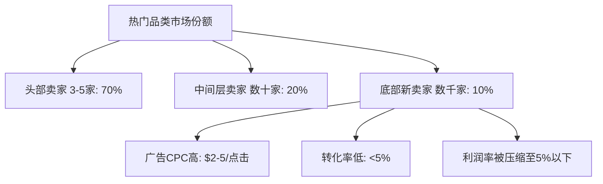
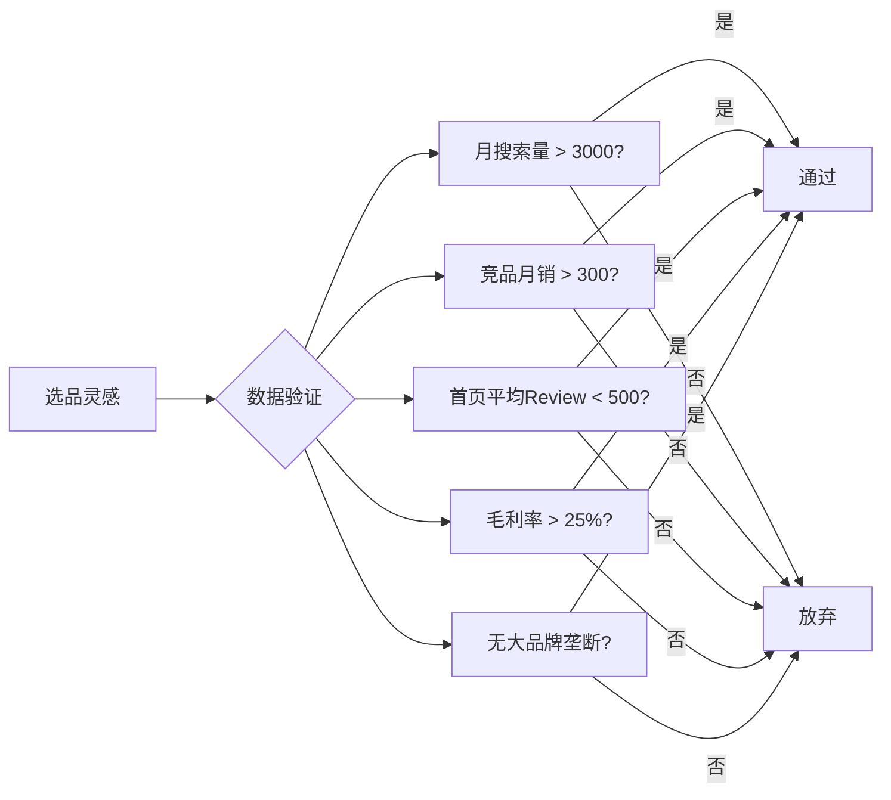
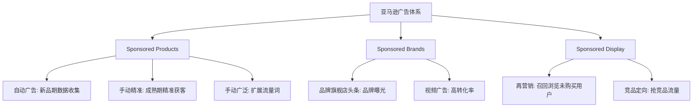
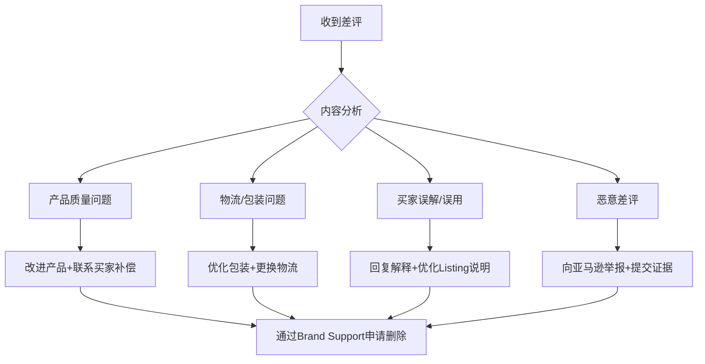
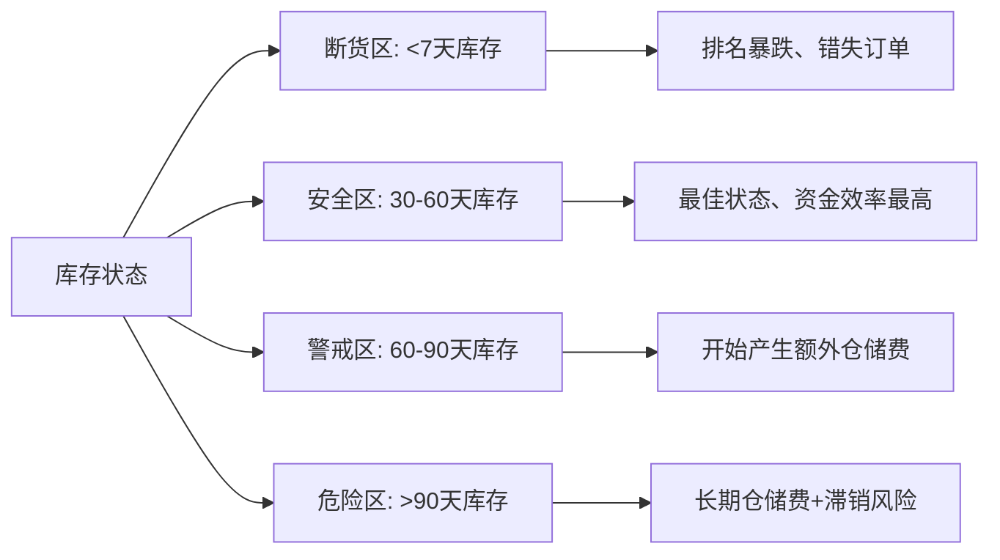
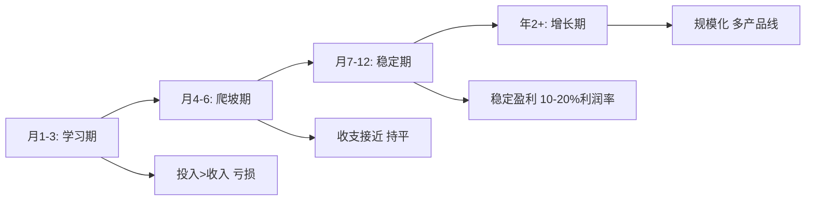

# 常见误区：跨境电商新手避坑指南

跨境电商是一个高度复杂的系统工程，涉及选品、运营、物流、资金、合规等多个环节。每一个环节都有大量新手容易踩中的"坑"。本章从选品、运营、物流、资金、合规、心态六个维度，系统梳理跨境电商最常见的误区，结合真实案例和数据，帮你绕过前人走过的弯路。

> **核心理念：** 误区的本质是信息不对称和认知偏差。避免误区的关键不是"知道不该做什么"，而是"理解为什么不该做，以及应该怎么做"。

## 一、选品误区

选品是跨境电商的第一步，也是决定成败的关键环节。据Jungle Scout 2024年数据，超过60%的亚马逊新卖家在选品阶段犯下致命错误，导致首批库存滞销。

### 误区1：只看热门品类，忽视竞争格局

**错误认知：** 看到某个品类销量高（如手机壳、瑜伽垫）就盲目进入，认为"市场大就能分一杯羹"。

**深层分析：**

热门品类的竞争格局通常呈"金字塔"结构：头部3-5个大卖家占据70%以上的市场份额，中间层几十个卖家瓜分剩余20%，底部数千个新卖家争夺不到10%的残余流量。



**真实数据对比：**

| 指标 | 热门品类（手机壳） | 细分品类（钓鱼用手机支架） |
|------|-------------------|--------------------------|
| 月搜索量 | 500,000+ | 8,000-15,000 |
| 竞争卖家数 | 50,000+ | 200-500 |
| 平均CPC | $3.50 | $0.80 |
| 首页卖家平均Review | 5,000+ | 200-500 |
| 新品上架难度 | 极高 | 中等 |
| 平均利润率 | 5-8% | 20-35% |

**正确做法：**

1. **用数据评估竞争度：** 在Jungle Scout或Helium 10中输入关键词，如果首页卖家平均Review超过1000个、平均CPC超过$2，对新卖家来说就是红海市场
2. **寻找"需求存在但供给不足"的细分：** 搜索量在5000-30000之间、首页卖家Review低于300的产品，是最适合新手切入的蓝海
3. **评估自身资源匹配度：** 列出你的启动资金、供应链资源、运营经验，选择与之匹配的品类难度
4. **从细分市场切入，逐步扩展：** 先在一个细分品类站稳脚跟，建立品牌认知后再向关联品类扩展

### 误区2：忽视产品合规和认证

**错误认知：** "产品好卖就行，认证以后再说"。

**深层分析：**

不同国家对产品安全的法规要求差异巨大。以美国市场为例，CPSC（消费品安全委员会）在2023年共发布467项产品召回令，其中约30%涉及中国出口产品。一旦产品被召回，不仅损失全部库存，还面临每项违规最高$1500万的罚款。

**各主要市场核心认证要求：**

| 目标市场 | 认证/标准 | 适用品类 | 未合规后果 |
|---------|----------|---------|-----------|
| 美国 | FCC认证 | 电子产品、无线设备 | 海关扣押、罚款$10万+ |
| 美国 | UL认证 | 电气产品、充电器 | 产品下架、法律责任 |
| 美国 | CPSC/CPSIA | 儿童产品、玩具 | 召回、罚款、刑事责任 |
| 美国 | FDA注册 | 食品、化妆品、医疗器械 | 海关拒绝入关 |
| 欧盟 | CE认证 | 绝大多数消费品 | 海关扣押、市场禁入 |
| 欧盟 | REACH法规 | 化学品相关产品 | 罚款、产品下架 |
| 欧盟 | WEEE指令 | 电子电气产品 | 注册义务、罚款 |
| 英国 | UKCA认证 | 替代CE的英国标准 | 无法在英国销售 |
| 日本 | PSE认证 | 电气产品 | 海关扣押、罚款 |
| 日本 | JATE认证 | 通信设备 | 无法入网销售 |

**真实案例：**

2023年，某深圳卖家在亚马逊美国站销售一款蓝牙耳机，未做FCC认证。产品上架3个月后被竞争对手举报，亚马逊直接下架全部Listing，冻结账户余额$8万。卖家补办FCC认证花了2个月，期间损失了旺季销售窗口，最终亏损超过$15万。

**正确做法：**

1. **选品阶段就评估合规成本：** 将认证费用纳入产品成本核算。FCC认证约$3000-8000，CE认证约$2000-5000，UL认证约$5000-15000
2. **选择有资质的检测机构：** 优先选择SGS、TUV、Intertek等国际认可机构，避免"假证"
3. **保留完整的认证文件：** 测试报告、证书、技术文档，随时备查
4. **持续关注法规变化：** 订阅目标市场的产品安全法规更新，如CPSC的召回通报

### 误区3：选择侵权产品或跟卖

**错误认知：** "卖别人验证过的产品更安全"，或"跟卖大牌的Listing可以蹭流量"。

**深层分析：**

知识产权侵权是跨境电商最严重的法律风险之一。亚马逊2023年处理了超过700万件侵权投诉，封禁了超过20万个卖家账户。侵权不仅涉及商标，还包括外观专利、实用新型专利、版权和商业秘密。

**侵权类型与风险等级：**

| 侵权类型 | 常见场景 | 风险等级 | 后果 |
|---------|---------|---------|------|
| 商标侵权 | 使用他人品牌名、Logo | ★★★★★ | 即时下架、账户冻结、诉讼赔偿 |
| 外观专利 | 模仿产品外观设计 | ★★★★ | 产品下架、赔偿$5万-$100万 |
| 实用新型专利 | 使用他人专利技术方案 | ★★★★ | 产品下架、赔偿 |
| 版权侵权 | 盗用图片、文案、视频 | ★★★ | Listing下架、DMCA投诉 |
| 假冒伪劣 | 销售假冒品牌产品 | ★★★★★ | 刑事责任、巨额赔偿 |

**正确做法：**

1. **注册自有品牌商标：** 在目标市场国家注册商标。美国商标注册约$250-350/类（通过USPTO直接申请），周期约8-12个月
2. **选品阶段进行专利检索：** 使用Google Patents、USPTO、EPO数据库检索产品是否有专利保护
3. **避免跟卖：** 跟卖是亚马逊特有的功能，但对新卖家风险极大。即使你卖的是正品，也可能被品牌方投诉
4. **建立品牌护城河：** 完成亚马逊Brand Registry注册，获得A+页面、品牌旗舰店等权益
5. **遇到投诉及时处理：** 收到侵权投诉后，48小时内联系投诉方协商撤诉，或提交Plan of Action申诉

### 误区4：选品只凭感觉，不做数据验证

**错误认知：** "我觉得这个产品好卖"或"身边朋友都说好"。

**深层分析：**

主观判断和数据验证之间的差距往往是生死线。某产品你认为"人人都需要"，但实际月搜索量可能只有500；某产品你觉得"太普通了"，但月销量可能超过1万件。

**数据验证的核心指标：**



**正确做法：**

1. **至少使用两款数据工具交叉验证：** Jungle Scout + Helium 10，或Keepa + Sorftime
2. **关注趋势而非快照：** 查看过去12个月的搜索量趋势，排除季节性产品误导
3. **验证供应链可行性：** 在1688、阿里国际站搜索供应商，确认有稳定货源且MOQ（最小起订量）可接受
4. **小批量测试：** 首批订单控制在200-500件，验证市场反馈后再扩大采购

---

## 二、运营误区

运营能力决定了产品能否被目标消费者看到并购买。很多卖家有好产品，却因为运营不专业而失败。

### 误区5：Listing优化不到位

**错误认知：** "把产品信息填上去就行了"，或者过度堆砌关键词导致文案不通顺。

**深层分析：**

Listing是你的"线上销售员"。亚马逊A9算法通过关键词匹配、点击率（CTR）、转化率（CVR）三个维度决定Listing的排名。一个优化良好的Listing，转化率可以是粗糙Listing的3-5倍。

**Listing优化的核心要素：**

| 要素 | 权重 | 优化要点 | 常见错误 |
|------|------|---------|---------|
| 标题 | ★★★★★ | 品牌名+核心关键词+核心卖点+规格 | 堆砌关键词、标题过长 |
| 主图 | ★★★★★ | 白底、高分辨率、占比85%+ | 图片模糊、背景杂乱 |
| 五点描述 | ★★★★ | 5个核心卖点，每点200字符内 | 写成说明书、缺乏说服力 |
| 后台关键词 | ★★★ | 250字节，不重复标题关键词 | 浪费字符、使用无效词 |
| A+页面 | ★★★ | 品牌故事+产品对比+使用场景 | 纯文字无图、排版混乱 |
| 视频 | ★★★★ | 产品展示+使用演示+用户评价 | 时长过长、画质差 |

**正确做法：**

1. **关键词研究：** 用Helium 10的Cerebro工具反查竞品ASIN，找出高流量关键词，按搜索量排序
2. **标题公式：** `[品牌名] + [核心关键词] + [核心卖点1] + [核心卖点2] + [规格/颜色/数量]`，控制在200字符内
3. **主图要求：** 2000x2000像素、纯白背景RGB(255,255,255)、产品占比85%以上、使用专业摄影或3D渲染
4. **五点描述模板：** 每点用一个"痛点/卖点"开头，然后解释如何解决/实现，最后补充具体参数
5. **持续A/B测试：** 使用亚马逊的"Manage Your Experiments"功能，对标题和主图进行A/B测试

**Listing优化检查清单：**

```text
□ 标题包含3-5个核心关键词，200字符内
□ 主图为白底高清图，产品占比>85%
□ 副图包含尺寸对比图、使用场景图、细节特写图
□ 五点描述每点聚焦一个卖点，有具体数据支撑
□ 后台Search Terms填满250字节，不含标题已用词
□ A+页面有品牌故事、产品对比表格、FAQ
□ 有产品视频（时长30-60秒为佳）
□ 价格有竞争力（参考竞品定价区间）
□ 变体结构合理（颜色/尺寸/套装）
□ 产品描述（Description）用HTML格式化
```

### 误区6：广告投放不专业

**错误认知：** "开个自动广告就等着出单"，或者"广告花得多就卖得多"。

**深层分析：**

亚马逊广告系统是一个复杂的竞价拍卖机制。不专业的广告投放会导致"钱花了但没效果"。据Perpetua 2024年数据，专业优化的广告ACoS（广告销售成本比）平均为15-25%，而新手卖家的ACoS普遍在50-80%，甚至超过100%。

**广告投放的常见错误模式：**

| 错误模式 | 表现 | 后果 | 正确做法 |
|---------|------|------|---------|
| 只开自动广告 | 不手动优化关键词 | ACOS高、流量不精准 | 自动+手动组合，用自动广告数据反哺手动 |
| 盲目提高竞价 | 为抢排名无限制加价 | 广告成本失控 | 基于TACoS目标倒推合理竞价 |
| 不否定无效词 | 搜索词报告里大量无关词 | 预算浪费 | 每周分析搜索词报告，否定无效词 |
| 新品不投广告 | 认为广告是浪费钱 | 无流量、无订单、无Review | 新品期用广告积累数据和Review |
| 广告预算一成不变 | 不根据数据调整 | 错失机会或浪费预算 | 每周复盘，动态调整 |

**亚马逊广告类型与适用场景：**



**正确做法：**

1. **新品广告策略（前30天）：** 同时开启自动广告（紧密匹配+宽泛匹配）和手动精准广告，日预算$20-30自动、$15-20手动
2. **每周分析搜索词报告：** 将自动广告中转化好的词添加到手动精准广告中，将无关词添加到否定关键词
3. **计算TACoS而非只看ACoS：** TACoS = 广告花费 / 总销售额（含自然订单），目标控制在10-15%
4. **设置竞价策略：** 使用"动态竞价-仅降低"或"动态竞价-提高和降低"，根据转化数据自动调整
5. **预算分配原则：** 利润款给更多预算引流，利润款和新品款3:1分配

### 误区7：忽视Review管理和客户反馈

**错误认知：** "Review是自然而然的事"，或者"差评删掉就行"。

**深层分析：**

Review是消费者决策的核心依据。数据显示，92%的消费者在购买前会阅读Review，而拥有15条以上Review的产品比0 Review的产品转化率高3.5倍。同时，1条1星Review需要约10条5星Review才能将评分拉回。

**Review对转化率的影响：**

| Review数量 | 评分 | 相对转化率 | 说明 |
|-----------|------|-----------|------|
| 0 | - | 基准100% | 无社交证明 |
| 1-10 | 4.5+ | 180-220% | 开始建立信任 |
| 11-50 | 4.3+ | 250-350% | 转化率显著提升 |
| 50-200 | 4.2+ | 350-450% | 社交证明充足 |
| 200+ | 4.0+ | 400-500% | 头部产品 |

**正确做法：**

1. **合规获取Review：** 使用亚马逊Vine计划（$200/ASIN，最多30个Review）或Request a Review按钮
2. **差评处理流程：**



3. **主动收集正面Review：** 产品包装内放置感谢卡（不能诱导好评），使用售后跟进邮件
4. **监控Review变化：** 设置Review提醒工具（如FeedbackWhiz），第一时间响应差评
5. **利用Review优化产品：** 从竞品差评中挖掘产品改进方向，从好评中提炼卖点

### 误区8：定价策略混乱

**错误认知：** "价格越低越好卖"，或者"成本加个比例就行了"。

**深层分析：**

定价是一个需要综合考虑成本结构、竞品定价、品牌定位、利润目标的系统决策。盲目低价会导致利润归零，定价过高则会导致无人问津。很多卖家犯的错误是只计算了"产品成本+物流费"，忽略了平台费用、广告费、退货损耗等隐性成本。

**跨境电商完整成本结构：**

```text
售价 = 产品成本 + 头程物流 + 平台佣金 + FBA费用 + 广告费 + 退货损耗 + 利润

示例（售价$29.99的产品）：
  产品成本:        $4.50  (15%)
  头程物流:        $1.20  (4%)
  平台佣金(15%):   $4.50  (15%)
  FBA配送费:       $5.40  (18%)
  广告费(15%):     $4.50  (15%)
  退货损耗(3%):    $0.90  (3%)
  仓储费:          $0.30  (1%)
  ──────────────────────
  总成本:          $21.30 (71%)
  净利润:          $8.69  (29%)
```

**定价策略对比：**

| 策略 | 适用场景 | 优势 | 风险 |
|------|---------|------|------|
| 渗透定价 | 新品上市、抢占市场 | 快速获取市场份额 | 利润低、后续提价难 |
| 竞品跟随 | 标品市场、同质化严重 | 避免价格战 | 缺乏差异化 |
| 价值定价 | 品牌产品、差异化产品 | 高利润空间 | 需要品牌支撑 |
| 动态定价 | 旺季促销、清库存 | 灵活应对市场变化 | 需要实时监控 |

**正确做法：**

1. **建立完整的成本核算表：** 列出所有成本项，计算真实利润率
2. **参考竞品定价区间：** 使用Keepa查看竞品历史价格，找到市场可接受的价格带
3. **预留足够的广告预算：** 新品期广告占比可达20-30%，成熟期控制在10-15%
4. **使用优惠券和促销辅助定价：** 设置5-15%的Coupon提升点击率，效果好于直接降价

---

## 三、物流误区

物流是跨境电商的"最后一公里"，直接影响客户体验和账号健康。

### 误区9：物流方案选择不当

**错误认知：** "选最便宜的物流就行"，或者"所有产品都用同一种物流"。

**深层分析：**

不同产品特性需要不同的物流方案。大件家具走FBA的成本可能比自发货高3倍以上，而小件标准品用FBA的效率远高于自发货。选错物流方案不仅影响成本，还可能导致配送时效差、包装破损、退货率高等连锁问题。

**物流方案对比矩阵：**

| 方案 | 时效 | 成本 | 适用产品 | 客户体验 | 管理难度 |
|------|------|------|---------|---------|---------|
| FBA | 1-2天 | 高 | 小件标准品 | ★★★★★ | 低 |
| 第三方海外仓 | 2-5天 | 中高 | 中大件、多平台 | ★★★★ | 中 |
| 直发(专线) | 7-15天 | 中 | 中等价值产品 | ★★★ | 中 |
| 邮政小包 | 15-30天 | 低 | 低价值小件 | ★★ | 高 |
| 国际快递 | 3-7天 | 极高 | 高价值急件 | ★★★★ | 低 |

**正确做法：**

1. **按产品特性选方案：** 小件标品（<2kg）首选FBA，大件非标品考虑第三方海外仓，测款期用专线小包
2. **计算总物流成本而非单一运费：** 包含头程运费+FBA配送费+仓储费+退货处理费
3. **测试多家物流商：** 对比时效、丢包率、包装质量，选择性价比最优的服务商
4. **建立物流应急预案：** 准备2-3家备选物流商，旺季前提前备货

### 误区10：库存管理不善

**错误认知：** "多备点货总比断货好"，或者"等没货了再补"。

**深层分析：**

库存管理是跨境电商资金效率的核心。库存过多会占用大量资金、产生仓储费（亚马逊长期仓储费高达$6.90/立方英尺/月）、增加滞销风险；库存过少则导致断货，断货期间Listing排名会急剧下降，恢复排名需要额外投入3-5倍的广告费。

**库存管理的"黄金区间"：**



**正确做法：**

1. **计算安全库存：** 安全库存 = 日均销量 × 补货周期天数 × 1.5（安全系数）
2. **设置库存预警线：** 当库存低于30天销量时触发补货流程
3. **使用库存管理工具：** RestockPro、SoStocked等工具自动化补货计算
4. **定期清理滞销库存：** 超过90天未动销的产品，通过促销、站外清货或移除处理
5. **旺季提前备货：** 黑五、Prime Day等旺季前60-90天开始备货，避免入仓排队

### 误区11：忽视退货管理和逆向物流

**错误认知：** "退货是不可避免的损失"，不主动管理退货流程。

**深层分析：**

亚马逊的平均退货率约为5-15%，服装类目高达25-30%。退货不仅损失产品成本和运费，还会影响账号绩效指标。但退货也是产品改进的重要数据来源。

**退货原因分析与应对：**

| 退货原因 | 占比 | 应对策略 |
|---------|------|---------|
| 产品与描述不符 | 30% | 优化Listing准确性，使用真实图片 |
| 产品质量问题 | 25% | 加强质检，改进生产工艺 |
| 尺寸/规格不合适 | 20% | 提供详细尺寸表和对比参考 |
| 物流损坏 | 10% | 改善包装方案 |
| 买家后悔/不需要 | 10% | 无法完全避免，可通过售后挽回 |
| 其他原因 | 5% | 具体分析处理 |

**正确做法：**

1. **分析退货数据：** 每月导出退货报告，按原因分类统计，找出主要退货原因
2. **优化产品和Listing：** 根据退货原因改进产品或修正Listing描述
3. **改善包装方案：** 针对易碎品使用气泡膜、珍珠棉等防震包装
4. **利用退货产品：** 可修复的退货产品通过Amazon Renewed或独立站折扣渠道二次销售

---

## 四、资金与财务误区

资金是跨境电商的"血液"，财务管理不善是导致卖家失败的主要原因之一。

### 误区12：启动资金准备不足

**错误认知：** "几万块钱就能做跨境电商"。

**深层分析：**

跨境电商的资金周转周期通常为60-90天（从付款给供应商到收到平台回款）。在此期间，你需要持续投入资金用于备货、物流、广告等。资金准备不足会导致"明明产品卖得不错，但钱不够补货"的尴尬局面。

**启动资金详细拆解（以亚马逊FBA为例，单一产品）：**

| 费用项目 | 预估金额 | 说明 |
|---------|---------|------|
| 首批备货（500件） | $2,000-5,000 | 取决于产品单价 |
| 头程物流 | $500-1,500 | 海运/空运/快递差异大 |
| FBA入库配送 | $200-500 | 亚马逊入库费用 |
| Listing优化（摄影+设计） | $300-800 | 主图、A+页面制作 |
| 品牌注册 | $500-1,000 | 商标注册费 |
| 广告预算（首月） | $600-1,500 | 日均$20-50 |
| 工具订阅 | $100-300/月 | Jungle Scout、Helium 10等 |
| 应急资金 | $1,000-3,000 | 补货、退货、意外支出 |
| **合计** | **$5,200-13,600** | 单产品启动成本 |

**正确做法：**

1. **按产品数量倍增预算：** 如果计划同时运营3个产品，启动资金需$15,000-40,000
2. **预留至少3个月的运营资金：** 包括广告费、仓储费、补货资金
3. **控制初期产品数量：** 新手建议从1-2个产品开始，验证模式后再扩展
4. **建立资金使用计划：** 按月规划资金用途，确保现金流不断裂

### 误区13：忽视利润核算

**错误认知：** "看到账户余额增加了就是赚钱了"。

**深层分析：**

跨境电商的成本项远比想象中多。很多卖家只计算了"产品成本+物流费"，忽略了平台佣金、FBA费用、广告费、退货损耗、仓储费、汇率损失等隐性成本。结果出现"卖得越多亏得越多"的情况。

**完整利润核算公式：**

```text
净利润 = 售价 - 产品成本 - 头程物流 - 平台佣金 - FBA费用 
       - 广告费 - 退货损耗 - 仓储费 - 工具费 - 汇率损失
       - 包装材料 - 摄影设计摊销 - 商标维护费

实际利润率 = 净利润 / 售价 × 100%

健康利润率基准：
  目标利润率 > 20%（优秀）
  可接受利润率 10-20%（一般）
  危险利润率 < 10%（需要优化）
  亏损状态（需要立即调整或放弃）
```

**正确做法：**

1. **使用专业利润核算工具：** 卖家精灵、Helium 10 Profits、Sellics Profit等，自动计算每笔订单的真实利润
2. **建立月度利润报表：** 每月统计各产品的真实利润率，淘汰利润低于10%的产品
3. **关注现金流而非账面利润：** 利润和现金流是两回事，库存占用的是现金而非利润
4. **定期审查成本结构：** 每季度检查各项成本是否有优化空间

### 误区14：忽视汇率风险管理

**错误认知：** "汇率波动影响不大"，不关注外汇风险。

**深层分析：**

跨境电商涉及多币种交易，汇率波动直接影响利润。例如，人民币兑美元汇率从7.1波动到6.8，你的美元收入换算成人民币就会损失约4%。对于利润率只有15-20%的卖家，4%的汇率损失意味着利润减少20-25%。

**正确做法：**

1. **选择合适的收款工具：** Payoneer、万里汇（WorldFirst）、PingPong等，对比汇率和手续费
2. **适时结汇：** 关注汇率走势，在汇率有利时集中结汇
3. **使用多币种账户：** 部分收款工具支持多币种持有，可以在汇率有利时再换汇
4. **将汇率波动纳入定价：** 预留3-5%的汇率缓冲空间

---

## 五、合规与法律误区

合规是跨境电商的底线，忽视合规可能导致账号被封、货物被扣、甚至面临法律诉讼。

### 误区15：税务合规意识薄弱

**错误认知：** "小卖家不需要关注税务"，或"可以用个人身份避税"。

**深层分析：**

全球税务合规化趋势不可逆转。欧盟的VAT（增值税）、美国的Sales Tax、英国的VAT等都要求跨境卖家合规申报。亚马逊等平台已与各国税务局共享数据，逃税风险极高。

**各主要市场税务要求：**

| 市场 | 税种 | 注册门槛 | 税率 | 申报周期 |
|------|------|---------|------|---------|
| 欧盟 | VAT | 使用FBA即需注册 | 19-27%（各国不同） | 月度/季度 |
| 英国 | VAT | 使用FBA即需注册 | 20% | 季度 |
| 美国 | Sales Tax | 有经济关联即需注册 | 0-10%（各州不同） | 月度/季度 |
| 加拿大 | GST/HST | 年收入超CAD$30,000 | 5-15% | 季度 |
| 澳大利亚 | GST | 年收入超AUD$75,000 | 10% | 季度 |

**正确做法：**

1. **在目标市场注册税号：** 欧盟VAT可通过一站式服务（OSS）简化注册
2. **使用税务自动化工具：** Avalara、TaxJar等自动计算和申报Sales Tax
3. **保留完整的财务记录：** 所有交易记录、发票、报税文件至少保存7年
4. **咨询专业税务顾问：** 跨境税务复杂，专业建议可以帮你节省大量成本

### 误区16：忽视数据隐私合规

**错误认知：** "数据隐私法规跟电商卖家关系不大"。

**深层分析：**

GDPR（欧盟通用数据保护条例）、CCPA（加州消费者隐私法案）等法规对电商卖家收集、使用、存储消费者数据有严格要求。违规罚款最高可达年全球营收的4%或2000万欧元（取较高者）。

**正确做法：**

1. **在网站/店铺设置隐私政策：** 明确说明数据收集目的、使用方式、存储期限
2. **获取用户明确同意：** Cookie弹窗、营销邮件订阅需要opt-in而非opt-out
3. **确保数据安全：** 使用HTTPS、加密存储、定期备份
4. **响应用户数据请求：** GDPR要求在30天内响应用户的数据访问、删除请求

### 误区17：平台规则不熟悉

**错误认知：** "平台规则太多了，出了问题再说"。

**深层分析：**

亚马逊有超过200条卖家政策，违反任何一条都可能导致Listing下架或账户暂停。最常见的违规包括：刷单操控Review、滥用变体、侵权、虚假宣传等。

**常见平台违规及后果：**

| 违规类型 | 严重程度 | 首次处罚 | 再犯处罚 |
|---------|---------|---------|---------|
| 刷单操控Review | ★★★★★ | 账户暂停 | 永久封禁 |
| 滥用变体 | ★★★★ | Listing下架 | 账户暂停 |
| 知识产权侵权 | ★★★★★ | 即时下架 | 账户暂停+法律追责 |
| 虚假宣传 | ★★★ | Listing下架 | 账户暂停 |
| 操控搜索排名 | ★★★★ | Listing下架 | 账户暂停 |
| 多账户关联 | ★★★★★ | 所有账户永久封禁 | - |

**正确做法：**

1. **通读平台卖家政策：** 在开店前完整阅读平台的卖家政策和行为准则
2. **关注政策更新：** 订阅平台的卖家公告，及时了解政策变化
3. **建立合规自查机制：** 每月检查一次Listing、广告、运营是否符合平台规则
4. **保留申诉模板：** 准备好常见违规的申诉信模板，以便快速响应

---

## 六、心态与策略误区

跨境电商是一场马拉松，不是百米冲刺。心态和策略的偏差往往比技术错误更致命。

### 误区18：急于求成，期望过高

**错误认知：** "做跨境电商可以快速暴富"，"三个月就能月入十万"。

**深层分析：**

跨境电商的真实成长曲线是"前期投入-中期积累-后期爆发"。新手卖家通常需要6-12个月才能实现稳定盈利。期望过高会导致心态失衡，做出冲动决策（如盲目扩大投入、选择灰色手段）。

**跨境电商典型成长曲线：**



**正确做法：**

1. **设定合理的阶段性目标：**
   - 第1-3个月：完成选品、上架、获取前10个Review
   - 第4-6个月：优化Listing、控制ACoS、实现单产品日销5-10单
   - 第7-12个月：稳定盈利、扩展第二个产品
2. **建立"学费"心态：** 前期投入视为学习成本，而非"投资回报"
3. **记录和复盘：** 每周记录运营数据，每月复盘策略效果
4. **保持学习：** 跨境电商行业变化快，持续学习是生存的基本要求

### 误区19：闭门造车，不愿交流

**错误认知：** "自己摸索就能成功"，"同行是冤家"。

**深层分析：**

跨境电商行业信息更新快、政策变化频繁、竞争态势复杂。独自摸索会走大量弯路，而同行交流可以帮你避开已知的坑、获取最新的行业情报。

**正确做法：**

1. **加入卖家社群：** 知无不言、创蓝论坛等跨境电商社区
2. **参加行业展会：** 广交会、深圳跨境电商展等行业活动
3. **关注行业媒体：** 雨果跨境、亿邦动力等专业媒体
4. **寻找导师或加入卖家圈：** 向有经验的卖家学习可以少走3-5年弯路
5. **付费学习：** 优质的付费课程可以系统性提升能力，但要警惕"割韭菜"课程

### 误区20：盲目追求规模，忽视风险控制

**错误认知：** "规模越大越好"，急于扩展产品线、开通多站点。

**深层分析：

规模扩张需要资金、团队、管理能力的同步提升。过快扩张会导致管理失控、资金链断裂、产品质量下降等问题。很多卖家在月销$10万时赚到了钱，扩展到月销$50万时反而亏了。

**正确做法：**

1. **先做好一个产品再扩展：** 单个产品实现稳定盈利后，再考虑下一个
2. **控制扩展节奏：** 每次只增加1-2个产品，给团队足够的时间消化
3. **建立风险控制机制：** 设定最大库存金额、最大广告投入、止损线等
4. **多元化布局：** 不要把所有鸡蛋放在一个篮子里（多平台、多站点）

---

## 误区自检清单

以下清单涵盖了本章所有误区。建议新卖家在开店前逐项检查，在运营过程中定期复查。

**选品阶段：**
```text
□ 是否用数据工具验证了市场需求和竞争度？
□ 是否确认了目标市场的产品合规要求？
□ 是否进行了专利和商标检索？
□ 是否评估了供应链的可行性？
□ 是否计算了完整的产品成本和预期利润率？
```

**运营阶段：**
```text
□ Listing是否进行了关键词研究和优化？
□ 主图和副图是否达到专业水准？
□ 是否制定了广告投放策略和预算？
□ 是否建立了Review获取和管理机制？
□ 定价是否包含了所有成本项？
□ 是否定期分析运营数据并优化？
```

**物流阶段：**
```text
□ 是否根据产品特性选择了合适的物流方案？
□ 是否设置了库存预警和补货计划？
□ 是否监控退货数据并分析原因？
□ 是否了解了目标市场的关税和进口要求？
```

**资金阶段：**
```text
□ 是否准备了足够的启动资金（含3个月运营资金）？
□ 是否建立了完整的利润核算体系？
□ 是否了解了汇率风险并采取了对冲措施？
□ 是否有资金使用计划和现金流预测？
```

**合规阶段：**
```text
□ 是否在目标市场注册了必要的税号？
□ 是否了解了平台的卖家政策和行为准则？
□ 是否设置了数据隐私政策？
□ 是否保留了所有合规文件和记录？
```

---

## 避坑总结

| 误区维度 | 典型错误 | 核心教训 | 优先级 |
|---------|---------|---------|--------|
| 选品 | 凭感觉选品、忽视合规 | 数据驱动，合规先行 | ★★★★★ |
| 运营 | Listing粗糙、广告盲目 | 精细化运营，持续优化 | ★★★★★ |
| 物流 | 方案不当、库存失控 | 科学管理，平衡成本与时效 | ★★★★ |
| 资金 | 资金不足、利润不清 | 充足准备，精细核算 | ★★★★ |
| 合规 | 税务忽视、规则不熟 | 合规是底线，不是选项 | ★★★★★ |
| 心态 | 急于求成、闭门造车 | 长期主义，开放学习 | ★★★ |

> **最后的忠告：** 跨境电商没有捷径，但有弯路。本章列出的20个误区，是无数卖家用真金白银换来的教训。避免这些误区，不代表你一定成功，但至少可以让你的试错成本降低50%以上。记住：**在跨境电商中，少犯错比多做对更重要。**
