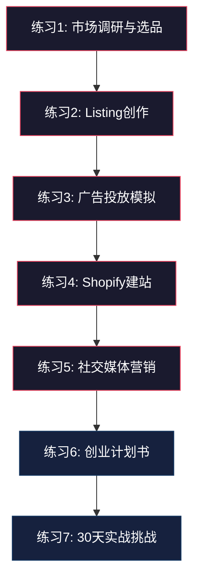
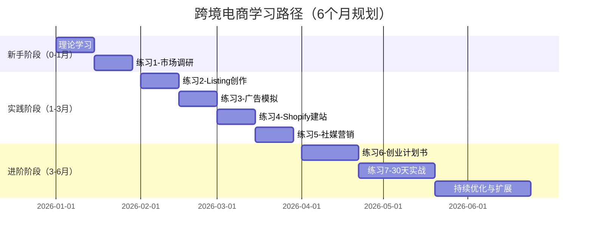

# 练习方法：跨境电商实操训练体系

跨境电商是一门实践性极强的学科。你可以把选品理论背得滚瓜烂熟，但如果从未亲手跑过一次完整的市场调研流程，从未在真实平台上架过一个产品，从未面对过广告烧钱却没有转化的焦虑——那一切都只是纸上谈兵。

本章设计了七个递进式练习，覆盖从基础技能到综合实战的完整链路。每个练习都有明确的训练目标、可量化的输出成果、详细的评估标准和常见坑点提醒。建议按顺序完成，不要跳步。



---

## 一、基础技能训练

### 练习1：市场调研与选品练习

#### 为什么这个练习排在第一位

选品是跨境电商生死攸关的第一步。业内有一句话叫"七分靠选品，三分靠运营"，这不是夸张。一个好产品可以让运营能力平庸的卖家赚到钱，一个烂产品能让运营高手也亏得血本无归。市场调研和选品能力不是看几篇文章就能获得的，必须亲手操作工具、亲手分析数据、亲手做决策，才能建立起对市场的直觉判断力。

#### 训练目标

掌握从品类发现到最终选品决策的完整方法论，能够独立完成一份数据驱动的市场调研报告，并做出合理的选品决策。

#### 第一阶段：工具熟悉（第1-3天）

**注册并配置分析工具：**

| 工具名称 | 适用平台 | 免费试用 | 核心功能 | 学习重点 |
|---------|---------|---------|---------|---------|
| Jungle Scout | Amazon | 7天 | 产品数据库、关键词搜索器、供应商数据库 | Product Database筛选逻辑 |
| Helium 10 | Amazon | 免费版有限功能 | Black Box选品、Cerebro反查、Magnet关键词 | Black Box多维度筛选 |
| Keepa | Amazon | 免费版可用 | 价格历史、BSR排名趋势、库存追踪 | 读懂价格走势和排名波动 |
| Google Trends | 全平台 | 完全免费 | 搜索趋势、地区热度、相关查询 | 区分季节性趋势和持续增长 |
| AliExpress热销榜 | 供应链端 | 免费 | 热销产品、供应商评分 | 找到供应链源头 |

**工具学习的具体操作步骤：**

1. **Jungle Scout Product Database实操**
   - 打开Product Database，选择目标市场（建议先从美国站开始）
   - 设置筛选条件初版：月销量 200-2000，评价数 < 300，售价 $15-$50
   - 点击搜索后，按"月销量"降序排列
   - 逐个点击产品，查看其BSR（Best Sellers Rank）趋势图
   - 重点关注：BSR是否稳定（而非忽高忽低），价格是否稳定（而非频繁降价促销）

2. **Keepa数据解读训练**
   - 找5个你日常使用的Amazon产品，用Keepa查看其历史数据
   - 观察价格曲线：稳定的价格曲线说明竞争格局成熟，频繁波动说明在打价格战
   - 观察BSR曲线：季节性产品会有明显的波峰波谷，常青产品曲线平稳
   - 观察Buy Box价格：如果多个卖家抢Buy Box导致价格频繁变动，说明这个品类竞争激烈

3. **Google Trends交叉验证**
   - 将你关注的品类关键词输入Google Trends
   - 时间范围选择"过去5年"，看长期趋势是上升、平稳还是下降
   - 地区设置选择"全球"，看主要市场分布
   - 查看"相关查询"，发现你可能忽略的细分需求

#### 第二阶段：品类深度调研（第4-10天）

**选择3-5个你感兴趣的品类进行调研。选品类的原则：**

- 你对这个品类有一定的认知基础（兴趣或经验）
- 品类不是极度红海（如手机壳、数据线）
- 品类不是极度小众（月搜索量低于1000的要谨慎）
- 产品不是易碎、超大件、带电池或液体（物流难度高）

**每个品类的调研框架：**

```text
品类名称：_______________
调研日期：_______________

一、市场规模评估
├── Amazon核心关键词月搜索量：________
├── 品类头部10名月均销量：________
├── 品类头部10名月均收入：________
├── 品类评论总量级：________
└── Google Trends 5年趋势：上升/平稳/下降

二、竞争格局分析
├── 头部卖家数量（月销>1000）：________
├── 品牌集中度（头部3名市占率）：________%
├── 平均评论数（前20名）：________
├── 新品（上架<6个月）能否进入前100：是/否
└── 是否有大品牌垄断：是/否

三、价格带分析
├── 主流价格区间：$________ - $________
├── 头部卖家平均售价：$________
├── 估算采购成本（1688参考）：$________
├── FBA费用估算：$________
├── 估算毛利率：________%
└── 是否存在低价内卷：是/否

四、差异化机会
├── 差评高频抱怨点 TOP5：
│   1. ________________
│   2. ________________
│   3. ________________
│   4. ________________
│   5. ________________
├── 现有产品的明显短板：________
└── 可能的改进方向：________
```

**差评分析的正确方法：**

差评分析是选品调研中最有价值的环节，但很多人只是随便看几条就完事。正确的方法是：

1. 打开品类头部5个产品的差评（1-2星）
2. 每个产品至少阅读50条差评
3. 用Excel记录每条差评的核心抱怨点，分类归纳
4. 统计每类抱怨出现的频次
5. 找到高频且可以通过产品改进解决的问题

**举例：** 假设你在调研"厨房硅胶铲"品类，你发现：
- 32%的差评提到"铲头太软，炒菜时翻不动"
- 28%的差评提到"手柄连接处容易断裂"
- 19%的差评提到"用久了有异味"
- 12%的差评提到"颜色与图片不符"
- 9%的差评提到"不耐高温，会融化"

这就告诉你：如果你能找到铲头更硬、手柄连接更牢固的供应商，你的产品就有了差异化的竞争优势。

#### 第三阶段：竞品深度拆解（第11-15天）

**每个品类选择5个竞品，按以下维度逐一拆解：**

**竞品分析模板：**

```text
竞品名称：_______________
ASIN：_______________
上架日期：_______________
当前售价：$________
月销量估算：________
评论数：________
评分：________

一、Listing分析
├── 标题关键词布局：_______________
├── 主图风格（白底/场景/模特）：_______________
├── 五点描述的卖点排序逻辑：_______________
├── A+页面质量评分（1-10）：________
├── 视频有无：是/否
└── 后台关键词推测：_______________

二、定价策略
├── 当前售价：$________
├── 历史最低价：$________（通过Keepa查看）
├── 是否有优惠券：是/否，面额________
├── 是否参加Subscribe & Save：是/否
└── 多件装折扣：_______________

三、广告投放分析
├── 自然排名关键词数量：________
├── 广告排名关键词数量：________
├── 核心广告关键词 TOP5：_______________
└── 广告位类型（搜索/商品页）：_______________

四、评价分析
├── 好评高频词 TOP5：_______________
├── 差评高频词 TOP5：_______________
├── 买家图片/视频数量：________
└── 卖家回复差评的态度和频率：_______________
```

#### 第四阶段：选品决策（第16-18天）

**将调研数据汇总到决策矩阵中：**

| 评估维度 | 权重 | 品类A得分 | 品类B得分 | 品类C得分 |
|---------|------|----------|----------|----------|
| 市场规模（月销量） | 20% | /10 | /10 | /10 |
| 竞争强度（评论数/品牌集中度） | 20% | /10 | /10 | /10 |
| 利润空间（毛利率） | 20% | /10 | /10 | /10 |
| 差异化可行性 | 15% | /10 | /10 | /10 |
| 供应链难度 | 10% | /10 | /10 | /10 |
| 物流复杂度 | 10% | /10 | /10 | /10 |
| 季节性风险 | 5% | /10 | /10 | /10 |
| **加权总分** | **100%** | **/10** | **/10** | **/10** |

**打分标准说明：**

- **市场规模 9-10分：** 核心关键词月搜索量 > 10000，头部卖家月销 > 2000
- **市场规模 7-8分：** 月搜索量 5000-10000，头部月销 1000-2000
- **市场规模 5-6分：** 月搜索量 2000-5000，头部月销 500-1000
- **竞争强度 9-10分：** 头部平均评论 < 100，无大品牌垄断
- **竞争强度 5-6分：** 头部平均评论 200-500，有1-2个大品牌
- **竞争强度 1-4分：** 头部平均评论 > 1000，强品牌垄断

#### 输出成果清单

| 成果 | 最低标准 | 优秀标准 |
|------|---------|---------|
| 品类调研报告 | 每品类500字，包含市场规模、竞争格局、价格带 | 每品类1500字+，含趋势图表、数据来源标注 |
| 竞品分析表格 | 每品类5个竞品的基本信息 | 含差评分析、广告策略推断、差异化机会 |
| 选品决策文档 | 选择1个品类并说明理由 | 决策矩阵+SWOT分析+风险预案 |

#### 常见坑点

- **坑1：只看销量不看利润率。** 月销1万件但每件只赚$1的产品，不如月销500件每件赚$10的产品。算清楚FBA费用、广告费、退货率之后的真实利润。
- **坑2：忽略季节性因素。** 用Google Trends看5年数据，而不是只看最近3个月。圣诞节前两个月的数据会虚高。
- **坑3：被"蓝海"概念忽悠。** 月搜索量只有300的品类不是蓝海，是没市场。真正的蓝海是需求大但供给质量差的品类。
- **坑4：照搬国内热销品。** 国内卖得好的产品在国外不一定有市场，文化差异、使用习惯差异都很大。必须用数据验证。

---

### 练习2：Listing创作练习

#### 为什么Listing是"线上销售员"

在实体店，销售员可以主动介绍产品、回答疑问、引导购买。在线上，Listing就是你的销售员。标题决定搜索曝光，主图决定点击率，五点描述决定转化率，A+页面决定品牌信任度。一条优秀的Listing可以将转化率从8%提升到15%以上，这意味着同样的流量可以多赚近一倍的钱。

#### 训练目标

掌握亚马逊Listing全要素的创作方法，能够独立完成一条高转化率的产品Listing，并理解每个要素背后的搜索算法逻辑。

#### 第一阶段：关键词研究（第1-3天）

**关键词研究是Listing创作的地基。** 关键词选错了，后面写得再好也没有曝光。

**关键词挖掘的四个来源：**

1. **Amazon搜索框自动补全**
   - 在Amazon搜索框输入产品核心词，记录所有下拉建议
   - 对每个建议词再次输入，获取长尾词
   - 例如输入"silicone spatula"，可能得到：silicone spatula set, silicone spatula for cooking, silicone spatula heat resistant, silicone spatula for nonstick pans...
   - 这些下拉建议代表了真实的用户搜索行为

2. **竞品Listing反查**
   - 用Helium 10的Cerebro工具，输入竞品ASIN
   - 获取该产品自然排名和广告排名的所有关键词
   - 按搜索量排序，筛选出与你的产品相关的词
   - 重点关注自然排名前20的关键词——这些是真正带来流量的词

3. **Amazon Brand Analytics（如果有品牌备案）**
   - 搜索词报告可以看到真实的搜索频率排名
   - 点击份额和转化份额告诉你这个词的竞争程度

4. **Google Keyword Planner**
   - 用于验证搜索趋势和发现Amazon工具可能遗漏的词
   - 特别适合发现场景化关键词（如"best spatula for scrambled eggs"）

**关键词分类和优先级：**

```text
关键词库结构：
├── 核心关键词（3-5个）
│   ├── 搜索量最高，与产品直接相关
│   ├── 必须出现在标题中
│   └── 示例：silicone spatula, cooking spatula set
├── 中频关键词（10-15个）
│   ├── 搜索量中等，描述产品特性
│   ├── 放在标题后半段和五点描述中
│   └── 示例：heat resistant spatula, nonstick spatula, kitchen utensil set
├── 长尾关键词（20-30个）
│   ├── 搜索量较低但转化率高
│   ├── 放在五点描述、A+页面和后台Search Terms中
│   └── 示例：silicone spatula for baking cookies, BPA free spatula for eggs
└── 场景关键词（10-15个）
    ├── 描述使用场景或用户痛点
    ├── 放在五点描述和产品描述中
    └── 示例：gift for mom who loves cooking, wedding registry kitchen essentials
```

#### 第二阶段：标题创作（第4-6天）

**亚马逊标题的基本公式：**

```text
品牌名 + 核心关键词 + 核心卖点/材质 + 规格/尺寸 + 适用场景/人群
```

**好的标题实例分析：**

```text
OXO Good Grips 3-Piece Silicone Spatula Set - Heat Resistant,
BPA-Free, Non-Stick Safe - Includes Large Turner, Small Turner
& Spoon Spatula - Dishwasher Safe Kitchen Utensils for Cooking & Baking
```

拆解：
- "OXO Good Grips" — 品牌名，建立信任
- "3-Piece Silicone Spatula Set" — 核心关键词+数量规格
- "Heat Resistant, BPA-Free, Non-Stick Safe" — 三个核心卖点（正好对应高频差评痛点）
- "Includes Large Turner, Small Turner & Spoon Spatula" — 产品具体内容，减少"与预期不符"退货
- "Dishwasher Safe Kitchen Utensils for Cooking & Baking" — 场景关键词+长尾关键词

**标题创作的五条铁律：**

1. **核心关键词必须在标题前80个字符内。** Amazon移动端只显示前80个字符，如果核心关键词被截断，你损失了一半的曝光机会。
2. **不要堆砌关键词。** "Silicone Spatula Silicone Turner Silicone Cooking Tool" 这种堆砌会被算法降权，也会让用户觉得不专业。
3. **数字比文字更有吸引力。** "3-Piece Set" 比 "Three Piece Set" 更醒目，"Heat Resistant to 600°F" 比 "Very Heat Resistant" 更有说服力。
4. **每个词都要有存在的理由。** 如果一个词既不是关键词也不能打动买家，就删掉它。
5. **严格遵守Amazon的标题规范。** 不要全大写（品牌名除外），不要用特殊符号（如★、♥），不要包含促销信息（如"SALE"、"Free Shipping"）。

**练习：为同一个产品写5个不同版本的标题，然后用以下标准评估：**

| 评估维度 | 权重 | 评分标准 |
|---------|------|---------|
| 关键词覆盖 | 30% | 核心关键词是否在前80字符，是否覆盖中频关键词 |
| 可读性 | 25% | 是否流畅易读，是否有逻辑层次 |
| 卖点传达 | 25% | 是否在标题中突出核心差异化卖点 |
| 合规性 | 10% | 是否符合Amazon标题规范 |
| 移动端友好 | 10% | 前80字符是否传达了关键信息 |

#### 第三阶段：五点描述创作（第7-10天）

**五点描述（Bullet Points）的结构公式：**

```text
[卖点关键词大写] - 具体描述卖点，解释为什么这对买家重要，
说明与其他产品的区别，唤起使用场景的情感共鸣。
```

**五点描述的内容排布策略：**

| 位置 | 内容 | 目的 |
|------|------|------|
| 第1点 | 最核心的差异化卖点 | 抓住注意力，传达"为什么选我" |
| 第2点 | 产品质量/材质/工艺 | 建立信任，降低购买顾虑 |
| 第3点 | 使用场景/多功能性 | 扩大受众，增加使用想象空间 |
| 第4点 | 实用细节（尺寸/兼容性/清洁） | 回答常见疑问，减少退货 |
| 第5点 | 售后保障/赠品/包装 | 最后推动，消除购买犹豫 |

**实例对比——同一个硅胶铲产品的五点描述：**

**普通版（很多卖家的水平）：**
> - Made of food grade silicone
> - Heat resistant up to 600°F
> - Easy to clean
> - Set of 3 different sizes
> - Good for cooking

问题：没有具体数据，没有场景感，没有差异化，读完记不住任何信息。

**优化版：**
> - 【UPGRADED NYLON CORE DESIGN】Unlike flimsy silicone spatulas that flop when flipping, our turner features a reinforced nylon core wrapped in food-grade silicone — sturdy enough to flip a full burger patty with one hand, yet flexible enough to scrape every last bit from the pan.
> - 【600°F HEAT SHIELD】Made from BPA-free, LFGB-certified silicone that won't melt, warp, or release chemicals even at 600°F. Safe for non-stick, ceramic, cast iron, and stainless steel cookware — no more worrying about scratching your expensive pans.
> - 【3-PIECE SET FOR EVERY TASK】Includes a large turner (13.5") for flipping pancakes and burgers, a small turner (11") for eggs and fish, and a spoon spatula (11.5") for stirring sauces and serving soups. One set handles 90% of your cooking needs.
> - 【EFFORTLESS CLEANING】Seamless one-piece design means no food gets trapped in crevices. Simply rinse under warm water or toss in the dishwasher. Unlike wooden utensils, they won't absorb odors, stain, or develop mold.
> - 【PERFECT GIFT WITH CONFIDENCE】Arrives in a premium gift box, ideal for housewarming, weddings, or anyone who loves cooking. Backed by our 180-day no-questions-asked replacement guarantee — if anything goes wrong, we'll make it right.

#### 第四阶段：图片规划（第11-14天）

**亚马逊产品图片的7张图片黄金配置：**

| 图片位置 | 内容 | 作用 | 技术要求 |
|---------|------|------|---------|
| 主图（必须） | 产品白底图 | 点击率的第一决定因素 | 纯白背景，产品占画面85%以上，1000x1000px以上 |
| 图2 | 产品卖点信息图 | 展示核心特性和尺寸 | 标注关键参数，用箭头/图标辅助说明 |
| 图3 | 使用场景图 | 让买家想象拥有后的生活 | 真实使用环境，自然光线，展示使用动作 |
| 图4 | 对比图/细节图 | 突出差异化优势 | 与竞品对比（不提品牌名），或展示材质细节 |
| 图5 | 尺寸/规格图 | 回答"多大""多长"的疑问 | 用参照物（如手、手机）展示真实尺寸 |
| 图6 | 多角度/全家福 | 展示产品全貌和配件 | 如果是套装，展示所有包含的物品 |
| 图7 | 品牌故事/包装图 | 建立品牌感，提升开箱体验 | 展示包装、品牌LOGO、附赠品 |

**主图拍摄的五个关键点：**

1. **光线：** 使用柔光箱或在阴天窗边拍摄，避免硬阴影。硬阴影会让产品看起来廉价。
2. **角度：** 45度俯角是最万能的角度，能同时展示产品正面和侧面。
3. **锐度：** 产品必须绝对清晰，任何模糊都会降低专业感。
4. **白平衡：** 确保颜色准确。色差是退货的主要原因之一。
5. **后期：** 适度提亮和锐化，但不要过度PS导致实物与图片不符。

#### 输出成果清单

| 成果 | 最低标准 | 优秀标准 |
|------|---------|---------|
| 关键词库 | 30个关键词，含搜索量 | 100+关键词，分层分类，含竞争度分析 |
| 标题 | 1个符合规范的标题 | 5个版本+评估对比分析 |
| 五点描述 | 5条卖点描述 | 每条150-250字符，含关键词植入策略说明 |
| 图片方案 | 7张图片的内容规划 | 含拍摄脚本、参考图、后期处理要求 |
| 完整Listing | 至少2个产品 | 含A+页面文案、后台Search Terms |

#### 常见坑点

- **坑1：标题堆砌关键词导致不可读。** Amazon的A10算法已经能理解语义，堆砌关键词不会提升排名，反而降低转化率。
- **坑2：五点描述写成了说明书。** 不要罗列参数，要讲故事。"Heat resistant to 600°F"不如"Safe for non-stick, ceramic, cast iron cookware — no more worrying about scratching your expensive pans"。
- **坑3：主图用手机随便拍。** 主图是点击率的第一决定因素。如果预算有限，至少投资一套柔光箱（约200元），效果差距是天壤之别。
- **坑4：忽略移动端体验。** 超过70%的Amazon流量来自移动端。标题前80字符、主图的清晰度、五点描述的前半句——这些是移动端用户第一眼看到的内容。

---

### 练习3：广告投放模拟练习

#### 为什么需要先模拟再实战

亚马逊广告是"付费流量"的核心入口，也是最容易烧钱的环节。一个新品的广告预算如果不会控制，每天烧$50-$100却没有订单是常见的事。在实际投放前，通过模拟练习理解广告的底层逻辑、建立对数据的敏感度，可以帮你省下真金白银。

#### 训练目标

理解亚马逊广告的底层竞价逻辑，掌握广告结构搭建方法，能够制定合理的广告策略并预估投放效果。

#### 第一阶段：广告系统学习（第1-3天）

**亚马逊广告类型全景图：**

| 广告类型 | 展示位置 | 适用场景 | 计费方式 | 适合阶段 |
|---------|---------|---------|---------|---------|
| SP（Sponsored Products） | 搜索结果页、商品详情页 | 单品推广，获取精准流量 | CPC | 新品期核心广告 |
| SB（Sponsored Brands） | 搜索结果页顶部横幅 | 品牌推广，展示多个产品 | CPC | 品牌备案后使用 |
| SBV（Sponsored Brands Video） | 搜索结果页中间 | 视频广告，高点击率 | CPC | 有视频素材时优先 |
| SD（Sponsored Display） | 商品详情页、站外 | 再营销，抢竞品流量 | CPC/vCPM | 稳定期拓展流量 |

**SP广告的关键词匹配类型详解：**

```text
假设你的产品是"silicone spatula set"

1. 广泛匹配（Broad Match）
   触发词：silicone cooking utensils, spatula kitchen tools,
   rubber spatula for baking, silicone turner set...
   特点：流量最大，但精准度最低
   建议：新品期用来"跑词"，发现你没想到的关键词

2. 词组匹配（Phrase Match）
   触发词：silicone spatula set of 3, best silicone spatula set,
   silicone spatula set heat resistant...
   特点：必须包含"silicone spatula set"这个完整词组，前后可以有其他词
   建议：用于扩展中等精准度的流量

3. 精准匹配（Exact Match）
   触发词：silicone spatula set, silicone spatula sets
   特点：只触发与关键词高度匹配的搜索词
   建议：用于核心转化词，控制ACOS
```

**广告竞价的核心逻辑：**

亚马逊广告不是"出价最高者得"，而是用"第二价格拍卖"机制：

```text
实际扣费 = 下一名的广告得分 / 你的质量得分 + $0.01

其中：
广告得分 = 出价 × 质量得分
质量得分 = 预估点击率 × 预估转化率 × 相关性
```

这意味着：即使你的出价比竞品低，如果你的Listing质量更好（点击率和转化率更高），你仍然可以赢得更好的广告位，而且实际扣费更低。

**核心数据指标及健康范围：**

| 指标 | 含义 | 新品期健康值 | 成熟期健康值 |
|------|------|------------|------------|
| ACoS（广告销售成本比） | 广告花费/广告销售额 | 30%-50% | 15%-25% |
| TACoS（总广告成本比） | 广告花费/总销售额 | 15%-25% | 5%-10% |
| CTR（点击率） | 点击数/展示数 | 0.3%-0.5% | 0.5%-1.0% |
| CVR（转化率） | 订单数/点击数 | 8%-12% | 12%-20% |
| CPC（每次点击成本） | 广告花费/点击数 | 品类相关 | 品类相关 |

#### 第二阶段：广告策略制定（第4-7天）

**新品广告的"三阶段打法"：**

**阶段一：数据收集期（第1-2周）**

```text
目标：收集关键词数据，不追求盈利
预算：$20-$30/天
结构：
├── 自动广告（Auto Campaign）
│   ├── 紧密匹配：$0.75竞价
│   ├── 宽泛匹配：$0.60竞价
│   ├── 同类商品：$0.50竞价
│   └── 关联商品：$0.50竞价
└── 手动广泛（Manual Broad）
    ├── 10-15个核心关键词
    ├── 广泛匹配
    └── 竞价 = 建议竞价 × 0.8

操作：
- 每天查看搜索词报告
- 将高转化词加入手动精准广告
- 将不相关词添加为否定关键词
```

**阶段二：精准投放期（第3-4周）**

```text
目标：降低ACOS，提升转化率
预算：$30-$50/天
结构：
├── 自动广告（降低竞价，收割长尾流量）
├── 手动精准（Manual Exact）
│   ├── 从阶段一筛选出的10-20个转化词
│   ├── 精准匹配
│   └── 竞价 = 建议竞价 × 1.0
├── 手动词组（Manual Phrase）
│   ├── 5-10个中频关键词
│   └── 竞价 = 建议竞价 × 0.9
└── 否定关键词列表（从阶段一积累）

操作：
- 每3天优化一次竞价
- ACoS低于目标的词，提高竞价获取更多流量
- ACoS高于目标的词，降低竞价或暂停
- 持续从自动广告中发掘新词
```

**阶段三：利润优化期（第5周起）**

```text
目标：盈利，降低TACoS
预算：根据利润率动态调整
结构：
├── 品牌广告（SB/SBV，如果有品牌备案）
├── 展示广告（SD，针对竞品ASIN）
├── 手动精准（核心盈利广告组）
├── 手动词组（补充流量）
└── 自动广告（降为辅助角色）

操作：
- 以ACOS = 毛利率为盈亏平衡线
- 低于盈亏平衡线的广告组加大投入
- 高于盈亏平衡线的广告组优化或暂停
- TACoS持续下降说明自然排名在提升
```

#### 第三阶段：模拟投放练习（第8-12天）

**使用Excel/Google Sheets搭建广告模拟器：**

```text
广告模拟表结构：

Sheet1 - 基础参数设置
├── 产品售价：$29.99
├── 产品成本：$8.00
├── FBA费用：$5.50
├── 佣金（15%）：$4.50
├── 毛利/单：$11.99
├── 毛利率：40%
├── 目标ACoS：30%
└── 日预算：$30

Sheet2 - 关键词数据表
├── 关键词
├── 匹配类型
├── 日均展示量
├── 预估CTR → 预估点击量
├── 预估CVR → 预估订单量
├── 出价
├── 日花费 = 点击量 × 出价
├── 日收入 = 订单量 × 售价
├── ACoS = 日花费/日收入
└── 利润 = 日收入 - 日花费 - (订单量 × 单位成本)

Sheet3 - 场景模拟
├── 场景1：新品期保守投放
├── 场景2：旺季加大投放
├── 场景3：竞品降价后的应对
└── 场景4：关键词竞价上涨50%
```

**模拟三个场景并记录决策逻辑：**

**场景1：你的核心关键词"silicone spatula set"ACoS高达60%，但转化率不错（15%）。你该怎么办？**

思考方向：
- ACoS高但转化率好，说明竞价太高而不是Listing有问题
- 方案A：降低竞价10%-15%，观察点击量是否大幅下降
- 方案B：优化Listing提升转化率，使ACoS自然下降
- 方案C：在该关键词的精准匹配中降低竞价，同时在词组匹配中保留

**场景2：进入旺季（如Prime Day前两周），你的广告预算应该怎么调整？**

思考方向：
- 旺季CPC通常上涨30%-50%，需要提前提高竞价锁定位置
- 预算至少翻倍，避免中午就花完日预算
- 增加SB和SBV广告，抢占搜索结果页的更多版面
- 提前2-3天开始加大投放，不要等到Prime Day当天

**场景3：一个新竞品用极低价格+高广告投入抢市场，你该怎么应对？**

思考方向：
- 不要跟着打价格战，先观察对方能烧多久
- 把广告预算集中在自己的转化率最高的关键词上
- 加大SD广告投放，直接在对方的Listing页面展示你的广告
- 强化Listing差异化（更好的图片、更详细的描述、更多的评价）

#### 输出成果清单

| 成果 | 最低标准 | 优秀标准 |
|------|---------|---------|
| 广告策略文档 | 包含广告类型选择和竞价策略 | 含三阶段打法的具体参数和调整逻辑 |
| 关键词出价表 | 10个关键词的出价建议 | 含搜索量、预估CPC、预估ACoS、优先级排序 |
| Excel模拟器 | 能计算基本的ACOS和利润 | 含多个场景模拟、敏感度分析、盈亏平衡计算 |
| A/B测试方案 | 列出要测试的变量 | 含测试周期、样本量要求、判定标准 |

#### 常见坑点

- **坑1：新品期就追求低ACoS。** 新品期广告的主要目的是"花钱买数据"和"推动自然排名"，不是盈利。ACoS在30%-50%是正常的。
- **坑2：只看ACoS不看TACoS。** ACoS只衡量广告订单的效率，TACoS衡量广告对整体业务的影响。TACoS持续下降说明你的自然流量在增长。
- **坑3：频繁调整竞价。** 亚马逊广告数据有24-48小时的延迟，频繁调整会导致数据不稳定。建议每3-5天调整一次，每次调整幅度不超过20%。
- **坑4：不做否定关键词。** 如果不加否定词，你的自动广告会把预算浪费在不相关的搜索词上。每周至少检查一次搜索词报告。

---

## 二、实操技能训练

### 练习4：Shopify独立站搭建练习

#### 为什么独立站是品牌化的必经之路

平台是"租来的店铺"，规则随时可能变、佣金可能涨、甚至可能被封号。独立站是"自己的房子"，你拥有完全的控制权：客户数据、品牌展示、营销自由度。成熟的品牌卖家通常采用"平台+独立站"的双轨模式——平台负责走量和验证市场，独立站负责品牌溢价和客户沉淀。

#### 训练目标

能够独立搭建一个完整的Shopify独立站，包含产品展示、购物流程、支付对接、基础SEO设置，并理解独立站与平台运营的核心差异。

#### 第一阶段：基础搭建（第1-3天）

**Shopify账号注册和基础设置清单：**

```text
注册步骤：
1. 访问 shopify.com，点击"Start free trial"（14天免费）
2. 填写邮箱、密码、店铺名称
   └── 店铺名称建议：品牌名+.com（可用namechk.com检查域名可用性）
3. 回答几个关于业务的基本问题（可跳过）
4. 进入后台Dashboard

必须完成的基础设置：
├── Settings → General
│   ├── Store name, Legal name
│   ├── Store address（影响税率计算）
│   ├── Contact email, Phone
│   └── Store currency（建议USD，即使你在中国）
├── Settings → Payments
│   ├── Shopify Payments（如果目标市场支持）
│   ├── PayPal Express Checkout
│   └── 第三方支付（如Stripe，2Checkout）
├── Settings → Checkout
│   ├── Customer accounts: 可选（建议"optional"）
│   ├── Form fields: 全部启用
│   └── Order processing: 选"Email"确认
├── Settings → Shipping
│   ├── 设置运费区域（Domestic / International）
│   ├── 运费模板（免邮门槛、固定运费、实时运费）
│   └── 打包方式设置
├── Settings → Taxes
│   ├── 自动税率计算（Shopify内置）
│   └── 是否含税显示价格
└── Settings → Notifications
    ├── 订单确认邮件
    ├── 发货通知邮件
    └── 建议自定义邮件模板，加入品牌元素
```

**主题选择指南：**

| 主题 | 价格 | 适合场景 | 优势 | 劣势 |
|------|------|---------|------|------|
| Dawn | 免费 | 刚起步，预算有限 | 速度快，官方维护 | 功能有限 |
| Debut | 免费 | 单品类少量产品 | 简洁大方 | 自定义选项少 |
| Prestige | $350 | 奢侈品/高端品牌 | 设计精美，功能丰富 | 价格高 |
| Impulse | $350 | 多品类大库存 | 筛选功能强大 | 学习成本高 |
| Sense | 免费 | 美妆/个护 | 现代感强，适合视觉类产品 | 通用性一般 |

**建议新手从Dawn主题开始**，功能够用、速度快、SEO友好，等业务跑通了再考虑升级付费主题。

#### 第二阶段：产品上架（第4-6天）

**产品上架的标准流程：**

```text
每个产品需要准备的素材清单：
├── 产品图片（5-8张）
│   ├── 主图：白底或浅色背景，800x800px以上
│   ├── 场景图：2-3张，展示使用场景
│   ├── 细节图：1-2张，展示材质/工艺
│   └── 尺寸图：1张，标注精确尺寸
├── 产品标题
│   ├── 格式：[品牌名] + [产品名] + [核心卖点] + [规格]
│   └── 字符数：50-70个字符
├── 产品描述
│   ├── 第一段：核心卖点+解决什么问题
│   ├── 第二段：产品特性和材质
│   ├── 第三段：使用场景和用户评价
│   └── 第四段：售后保障
├── 产品变体
│   ├── 颜色、尺寸、款式等变体设置
│   └── 每个变体独立SKU和价格
├── SEO设置
│   ├── 页面标题（Title Tag）
│   ├── Meta描述
│   ├── URL handle
│   └── Alt文本（图片）
└── 其他
    ├── 产品类型（Product Type）
    ├── 供应商（Vendor）
    ├── 标签（Tags）
    └── 库存追踪
```

**Shopify产品描述的写作技巧：**

与Amazon不同，Shopify上你有完全的自由来设计产品页面。好的产品描述应该：

1. **用标题分段，不要写成一大段文字。** 用户是"扫描"不是"阅读"。
2. **先讲好处（Benefit），再讲特性（Feature）。** 不说"Made of 304 stainless steel"，说"Built to last a lifetime — our 304 stainless steel construction won't rust, stain, or degrade, even after years of daily use."
3. **加入社会证明。** "Join 10,000+ happy customers"比"We are the best"有力得多。
4. **使用可扫描的列表。** 关键特性用 bullet points 展示，不要埋在段落里。
5. **加入FAQ。** 把客服最常被问到的3-5个问题放在产品页面底部。

#### 第三阶段：页面设计与优化（第7-10天）

**必须创建的页面：**

| 页面 | 内容要求 | SEO价值 |
|------|---------|---------|
| Home（首页） | 品牌故事、核心产品、促销活动、社会证明 | 高——权重最高 |
| About Us | 品牌起源、创始故事、团队、使命愿景 | 中——建立信任 |
| Contact Us | 联系方式、表单、FAQ链接 | 中——客服入口 |
| FAQ | 常见问题解答，至少10个问题 | 高——长尾关键词 |
| Shipping Policy | 运费、时效、追踪方式 | 低——但必须有 |
| Return Policy | 退货条件、流程、时效 | 低——但必须有 |
| Privacy Policy | 隐私条款（Shopify可自动生成） | 低——合规要求 |

**首页布局的黄金结构：**

```text
1. Hero Banner（首屏大图）
   └── 一句话品牌定位 + CTA按钮
2. 畅销产品展示
   └── 3-4个核心产品，带价格和"Add to Cart"
3. 品牌价值主张
   └── 3-4个图标+文字，如"Free Shipping"、"1-Year Warranty"
4. 社会证明
   └── 评价、媒体报道、用户数量
5. 品牌故事简介
   └── 2-3句话 + "Learn More"链接
6. 邮件订阅
   └── 优惠码换取邮箱，如"Get 10% OFF your first order"
7. 页脚
   └── 导航、社交媒体链接、支付方式图标
```

#### 第四阶段：支付和物流（第11-14天）

**支付方式设置要点：**

- **Shopify Payments（推荐）：** 费率最低（2.9% + $0.30/笔），支持信用卡直接支付，但需要美国/英国/加拿大等国家的身份或公司注册。
- **PayPal：** 覆盖面最广，海外买家接受度高，但费率略高（3.49% + $0.49/笔）。
- **Stripe：** 功能强大，支持多种支付方式，适合有技术能力的团队。
- **中国卖家常见方案：** 如果无法开通Shopify Payments，使用PayPal + Stripe（通过香港公司注册）或第三方支付如Asiabill、钱海等。

**运费策略的三种模式：**

| 策略 | 做法 | 优点 | 缺点 | 适用场景 |
|------|------|------|------|---------|
| 包邮 | 全场免运费，运费含在产品价格中 | 转化率高，心理上更吸引 | 产品价格显得高 | 客单价 > $30的产品 |
| 阶梯免邮 | 满$49免邮，否则收$5.99 | 提升客单价 | 需要计算利润 | 多SKU店铺 |
| 实时运费 | 根据重量/地区计算实际运费 | 透明公平 | 结算时看到运费可能弃购 | 大件/重货 |

**建议：新站初期使用"满额免邮"策略，免邮门槛设在你的平均客单价的120%左右。**

#### 输出成果清单

| 成果 | 最低标准 | 优秀标准 |
|------|---------|---------|
| Shopify网站 | 能正常访问和浏览 | PC+移动端自适应，加载速度<3秒 |
| 产品数量 | 5个产品完整上架 | 10+产品，含变体、SEO设置 |
| 必要页面 | 首页+关于我们+联系我们 | 含FAQ、政策页面、博客 |
| 购物测试 | 能走完从浏览到下单的流程 | 含邮件通知、订单管理、退款测试 |
| SEO基础 | 每个页面有标题和描述 | 含站点地图提交、Google Analytics安装、结构化数据 |

#### 常见坑点

- **坑1：贪图花哨主题导致加载缓慢。** 页面加载超过3秒，53%的用户会离开。图片压缩（用TinyPNG）、减少不必要的插件是基本操作。
- **坑2：没有设置运费就上线。** 不要让买家在结算时才发现"运费比产品还贵"，这是弃购的最大原因之一。
- **坑3：产品描述直接从1688搬过来。** 1688的产品描述是给批发商看的，不是给消费者看的。必须重写，用消费者的语言讲消费者关心的事。
- **坑4：忽略SEO设置。** Shopify自带的SEO功能很强，但需要你手动填写Title Tag、Meta Description、Alt Text。这些是免费流量的基础。

---

### 练习5：社交媒体营销练习

#### 为什么社交媒体是独立站的命脉

独立站没有平台的自然流量，流量来源主要靠三个渠道：付费广告（Facebook/Google Ads）、社交媒体内容营销、SEO（见效慢但长期有效）。其中社交媒体营销是性价比最高的方式——前期投入时间，后期可以持续获得免费流量。对于跨境电商来说，Instagram和TikTok是目前最核心的两个内容平台。

#### 训练目标

能够独立制定社交媒体内容策略，创作符合平台调性的内容，建立基础的粉丝互动能力，并理解社交媒体与电商转化之间的链路。

#### 第一阶段：账号搭建（第1-3天）

**Instagram商业账号设置清单：**

```text
必须完成的设置：
├── 用户名（Username）
│   ├── 与品牌名一致，简洁好记
│   ├── 不要用太多下划线和数字
│   └── 检查所有平台的用户名一致性（用namechk.com）
├── 头像
│   ├── 品牌LOGO，确保在小尺寸下清晰可辨
│   └── 建议使用纯色背景+简洁图形
├── Bio（简介）
│   ├── 第1行：一句话说明你是谁/做什么
│   ├── 第2行：核心价值主张或差异化
│   ├── 第3行：行动号召（CTA）
│   └── 第4行：链接（用Linktree或Beacons聚合多个链接）
├── Highlights（精选故事）
│   ├── 产品展示（Product）
│   ├── 用户评价（Reviews）
│   ├── 使用教程（How to Use）
│   ├── 品牌故事（About Us）
│   └── 促销活动（Deals）
└── 联系方式
    ├── 邮箱
    └── WhatsApp（如果目标市场常用）
```

**TikTok商业账号设置要点：**

- 切换为Business Account（免费）
- 用户名和头像与Instagram保持一致
- Bio简洁有力，带链接
- 关注同品类的10-20个标杆账号，观察他们的内容风格

#### 第二阶段：内容创作（第4-12天）

**内容策略框架——"4E法则"：**

| 内容类型 | 目的 | 占比 | 示例 |
|---------|------|------|------|
| Educate（教育） | 提供有用的知识，建立专业度 | 30% | "5个你不知道的厨房清洁小技巧" |
| Entertain（娱乐） | 引起情感共鸣，增加传播 | 25% | "当我把新买的硅胶铲第一次用在不粘锅上…" |
| Engage（互动） | 增加粉丝参与，提升活跃度 | 20% | "投票：你更喜欢红色还是蓝色？" |
| Earn（转化） | 直接推动销售 | 25% | "限时8折，仅剩最后50套" |

**Instagram内容模板——10条帖子的具体方案：**

```text
帖子1：产品开箱视频（Reel）
├── 15-30秒，展示拆箱过程和产品细节
├── 配文："Finally arrived! Can't wait to test this out 🎁"
└── 标签：#unboxing #kitchenhacks #cookingtools

帖子2：使用前后对比（Carousel）
├── 5-7张图，对比旧工具vs新工具的使用效果
├── 配文："Upgraded my kitchen game! Swipe to see the difference →"
└── 标签：#kitchenupgrade #cookingathome

帖子3：烹饪教程（Reel）
├── 60秒，用产品制作一道简单菜品
├── 配文："Made the perfect omelette with our new spatula! Full recipe in bio 🍳"
└── CTA：点击Bio链接购买

帖子4：用户评价分享（Static Image）
├── 截图真实用户评价（征得同意）
├── 配文："This is why we do what we do ❤️ Thank you @[username]!"
└── 标签：#customreview #happycustomer

帖子5：幕后花絮（Stories）
├── 展示产品设计/生产/包装的过程
├── 使用Stories投票功能互动
└── 建立品牌的"透明感"

帖子6：知识科普（Carousel）
├── "硅胶厨具的5个安全使用误区"
├── 每页一个误区+正确做法
└── 高收藏率的内容类型

帖子7：生活方式场景（Reel）
├── 展示产品在日常生活中的自然使用
├── 不要硬广，要像朋友推荐
└── 配文自然随性

帖子8：限时促销（Static Image）
├── 设计精美的促销图
├── 明确的优惠码和截止时间
├── 配文："48 hours only! Use code SAVE20 for 20% off 🔥"

帖子9：问答/互动（Stories）
├── 使用"Ask me anything"贴纸
├── 收集用户问题，在后续帖子中回答
└── 增加互动率和粉丝粘性

帖子10：产品合集推荐（Carousel）
├── "厨房必备的5件工具"
├── 你的产品自然地出现在其中
└── 不要全是自己的产品，搭配其他知名品牌显得更真实
```

#### 第三阶段：发布策略与数据分析（第13-18天）

**最佳发布时间（以美国市场为例）：**

| 平台 | 最佳发布时间（EST） | 原因 |
|------|-------------------|------|
| Instagram | 周二-周五 11AM-1PM | 午休时间刷手机高峰 |
| Instagram | 周日 10AM-2PM | 周末休闲时间 |
| TikTok | 周二-周四 7AM-9AM | 通勤路上 |
| TikTok | 周五-周六 7PM-11PM | 休闲娱乐高峰 |

**注意：以上是美国东部时间（EST），你需要根据目标市场调整。如果你的目标市场是美国，中国时间需要加12-13小时。**

**数据分析跟踪表：**

```text
每周数据复盘表：

帖子编号：___
发布日期：___
内容类型：□教育 □娱乐 □互动 □转化
内容格式：□图片 □视频 □轮播 □Stories

Instagram数据：
├── 展示数（Impressions）：___
├── 触达人数（Reach）：___
├── 点赞数：___
├── 评论数：___
├── 收藏数：___
├── 分享数：___
├── 个人主页访问：___
├── 链接点击：___
└── 关注数变化：___

TikTok数据：
├── 播放量：___
├── 点赞数：___
├── 评论数：___
├── 分享数：___
├── 完播率：___%
└── 关注数变化：___

互动率计算：
Instagram互动率 = (点赞+评论+收藏+分享) / 触达人数 × 100%
TikTok互动率 = (点赞+评论+分享) / 播放量 × 100%

行业基准参考：
├── Instagram互动率 > 3% 为优秀
├── Instagram互动率 1%-3% 为良好
├── TikTok互动率 > 5% 为优秀
└── TikTok互动率 2%-5% 为良好
```

#### 输出成果清单

| 成果 | 最低标准 | 优秀标准 |
|------|---------|---------|
| 社交媒体营销计划 | 包含内容主题和发布频率 | 含4E内容分配、月度内容日历、KPI目标 |
| 内容作品 | 10条帖子 | 15+条，含不同格式（图片/视频/轮播/Stories） |
| 数据分析报告 | 记录基础数据 | 含互动率分析、内容类型对比、优化建议 |

#### 常见坑点

- **坑1：一上来就硬卖。** 社交媒体的核心是"社交"不是"商务"。80%的内容应该是提供价值（教育/娱乐/互动），只有20%是直接卖货。
- **坑2：买粉丝。** 假粉丝不会互动，会拉低你的互动率，导致算法减少你的曝光。100个真粉丝比10000个假粉有价值得多。
- **坑3：不回复评论和私信。** 社交媒体的核心是"互动"。每一条评论都值得回复，每一条私信都应该在24小时内回应。
- **坑4：内容风格不统一。** 你的视觉风格（色调、字体、滤镜）和语言风格（专业/轻松/幽默）应该保持一致，建立品牌辨识度。

---

## 三、综合实战训练

### 练习6：跨境电商创业计划书

#### 为什么创业前必须写计划书

写创业计划书不是走过场，而是强迫你在花真金白银之前想清楚所有关键问题。很多时候，创业失败不是因为执行不力，而是因为一开始就没想清楚：目标客户是谁、产品差异化在哪里、钱够不够用半年、最可能死在哪个环节。

#### 训练目标

能够独立撰写一份结构完整、数据充分、逻辑自洽的跨境电商创业计划书，涵盖商业模式、市场分析、产品策略、运营计划、财务预测和风险评估六大模块。

#### 计划书完整框架与写作指导

**第一章：执行摘要（Executive Summary）**

执行摘要虽然放在最前面，但应该最后写——它是整份计划书的高度浓缩。

```text
模板：
[品牌名] 是一家专注于 [品类] 的跨境电商企业，通过 [平台/独立站/多平台] 
面向 [目标市场] 的 [目标客户群体] 销售 [产品类型]。

我们的核心竞争优势是：
1. [差异化优势1——如供应链独家资源]
2. [差异化优势2——如产品设计专利]
3. [差异化优势3——如本地化营销能力]

首年目标：月销售额达到 $______，毛利率 ______%，净利润 $______。
三年愿景：成为 [品类] 领域的头部跨境品牌，年销售额突破 $______。

启动资金需求：$______，预计 [N] 个月实现盈亏平衡。
```

**第二章：市场分析（Market Analysis）**

```text
2.1 行业概况
├── 品类全球市场规模：$______（引用Statista、Grand View Research等）
├── 年均增长率（CAGR）：______%
├── 主要增长驱动因素：______
└── 行业发展趋势：______

2.2 目标市场分析
├── 首选市场：______（如美国）
│   ├── 市场规模：$______
│   ├── 消费者特征：______
│   ├── 购买决策因素排序：______
│   └── 竞争格局：______
├── 备选市场：______（如欧洲五国）
└── 市场进入策略：______

2.3 竞争分析
├── 直接竞品（5家）
│   ├── 竞品名称、定价、月销量、评分
│   ├── 竞品优势和劣势
│   └── 我们的差异化切入点
├── 间接竞品：______
└── 竞争壁垒分析：______
```

**第三章：产品策略（Product Strategy）**

```text
3.1 选品标准
├── 毛利率 > ______%
├── 月搜索量 > ______
├── 评论数 < ______（头部）
├── 重量 < ______kg（物流友好）
└── 无专利/合规风险

3.2 首批产品计划（MVP思维）
├── 产品1：______，售价 $______，成本 $______，毛利 ______%
├── 产品2：______，售价 $______，成本 $______，毛利 ______%
├── 产品3：______，售价 $______，成本 $______，毛利 ______%
└── 首批采购量：每SKU ______ 件，总采购成本 $______

3.3 产品差异化策略
├── 功能差异化：______
├── 设计差异化：______
├── 包装差异化：______
└── 服务差异化：______

3.4 供应商管理
├── 备选供应商数量：至少3家
├── 样品测试流程：______
├── 质量检验标准：______
└── 付款条件：______
```

**第四章：运营策略（Operations Plan）**

```text
4.1 渠道策略
├── 主力平台：______（如Amazon US）
├── 辅助平台：______（如Shopify独立站）
├── 各渠道定位和预期占比：______
└── 上架时间线：______

4.2 营销推广计划
├── Amazon PPC预算：$______/月，目标ACoS ______%
├── 社交媒体营销：______
├── KOL/红人合作：______
└── 邮件营销：______

4.3 客户服务
├── 客服工具：______（如Zendesk）
├── 响应时间目标：< 24小时
├── 退货处理流程：______
└── 评价管理策略：______
```

**第五章：财务预测（Financial Projections）**

```text
5.1 启动资金预算明细

| 项目 | 金额（$） | 说明 |
|------|----------|------|
| 首批采购 | ______ | 3个SKU × N件 |
| 样品和模具 | ______ | 含产品打样费用 |
| 品牌设计 | ______ | LOGO、包装、A+设计 |
| 产品摄影 | ______ | 主图、场景图、视频 |
| Amazon开店费 | $39.99/月 | 专业卖家月费 |
| FBA头程物流 | ______ | 海运/空运到FBA仓库 |
| 广告预算（3个月） | ______ | 前3个月的广告投入 |
| 商标注册 | ______ | 美标$250-$350 |
| 工具订阅 | ______ | Helium10、Keepa等 |
| 应急储备 | ______ | 总预算的15%-20% |
| **合计** | **$______** | |

5.2 月度现金流预测（前12个月）

| 月份 | 销售收入 | 产品成本 | FBA费用 | 广告费 | 其他费用 | 净利润 | 累计现金流 |
|------|---------|---------|---------|--------|---------|--------|----------|
| M1 | $____ | $____ | $____ | $____ | $____ | $____ | $____ |
| M2 | ... | ... | ... | ... | ... | ... | ... |
| ... | ... | ... | ... | ... | ... | ... | ... |

5.3 关键财务指标
├── 盈亏平衡点：月销售额 $______
├── 预计盈亏平衡时间：第______个月
├── 首年预期净利润：$______
├── 投资回报率（ROI）：______%
└── 库存周转天数目标：______天
```

**第六章：风险评估（Risk Assessment）**

| 风险类型 | 风险描述 | 概率 | 影响 | 应对措施 |
|---------|---------|------|------|---------|
| 供应链风险 | 供应商断货或涨价 | 中 | 高 | 至少2家备选供应商，保持30天安全库存 |
| 平台风险 | Listing被下架或账号被封 | 低 | 极高 | 严格遵守平台规则，多平台分散风险 |
| 市场风险 | 竞争加剧导致价格战 | 高 | 中 | 持续产品差异化，建立品牌溢价 |
| 物流风险 | 物流延误或丢件 | 中 | 中 | 选择可靠的物流商，购买运输保险 |
| 汇率风险 | 人民币升值压缩利润 | 中 | 中 | 定期结汇，外汇对冲工具 |
| 合规风险 | 产品不符合目标国法规 | 低 | 极高 | 上架前做合规检测，获取必要认证 |
| 现金流风险 | 资金链断裂 | 中 | 极高 | 保留20%应急资金，控制库存周转 |

#### 输出成果清单

| 成果 | 最低标准 | 优秀标准 |
|------|---------|---------|
| 创业计划书 | 5000字以上，包含六大模块 | 10000字+，含市场数据来源、竞品截图、详细财务模型 |
| 财务预测表格 | 12个月的收入和支出预测 | 含敏感度分析（乐观/中性/悲观三种场景） |
| 风险评估文档 | 列出5个以上风险 | 含概率评估、影响评估、具体应对方案 |

---

### 练习7：30天跨境电商实战挑战

#### 为什么需要一个30天的系统训练

前面六个练习是"单项训练"，这个挑战是"综合实战"。通过30天的密集训练，把选品、建站、上架、营销、广告这些独立技能串联起来，形成完整的运营闭环。30天不足以让你赚到钱，但足以让你走完一遍从0到1的全流程，建立起对跨境电商全貌的认知。

#### 训练目标

在30天内完成从市场调研到店铺上线运营的全流程，建立跨境电商的系统化运营能力。

#### 第一周：学习准备与市场调研（Day 1-7）

```cpp
Day 1：行业认知日
├── 上午：通读本章理论基础部分
├── 下午：注册Amazon买家账号，以消费者身份体验购物流程
├── 晚上：浏览Amazon Best Sellers、New Releases、Movers & Shakers
└── 输出：500字的行业认知笔记

Day 2：工具配置日
├── 注册Jungle Scout或Helium 10试用账号
├── 安装Keepa浏览器插件
├── 注册Google Trends并熟悉操作
├── 注册1688买家账号（为后续找供应商做准备）
└── 输出：各工具的登录截图和功能笔记

Day 3：品类发现日
├── 在Jungle Scout Product Database中用不同筛选条件搜索
├── 条件组合1：月销200-1000，评论<100，售价$15-$40
├── 条件组合2：月销500-2000，评论<300，售价$20-$60
├── 条件组合3：月销1000-5000，评论<500，售价$30-$80
├── 记录20个感兴趣的品类/产品
└── 输出：20个候选产品的基础数据表

Day 4-5：深度调研日
├── 从20个候选中筛选出5个
├── 每个品类完成完整的市场调研模板（参考练习1）
├── 用Keepa查看价格和排名历史
├── 用Google Trends验证搜索趋势
└── 输出：5份品类调研报告

Day 6：竞品分析日
├── 选择最有潜力的2个品类
├── 每个品类分析5个竞品（参考练习2的竞品分析模板）
├── 重点做差评分析，找出产品改进机会
└── 输出：10份竞品分析报告

Day 7：选品决策日
├── 完成决策矩阵打分
├── 选择最终的1-2个产品
├── 在1688上寻找3-5个供应商
├── 联系供应商索取报价和样品
└── 输出：选品决策文档，含决策理由
```

**第一周复盘检查点：**
- [ ] 是否完成了至少3个品类的深度调研？
- [ ] 是否有数据支撑的选品决策？
- [ ] 是否找到了至少3个潜在供应商？

#### 第二周：品牌搭建与产品准备（Day 8-14）

```text
Day 8：品牌定位日
├── 确定品牌名称（简洁、好记、可注册商标）
├── 检查商标可用性（USPTO网站搜索）
├── 检查域名和社交媒体用户名可用性
├── 确定品牌定位和价值主张
└── 输出：品牌定位文档

Day 9：视觉设计日
├── 设计或委托设计品牌LOGO
├── 确定品牌色彩体系（主色+辅色+中性色）
├── 设计产品包装方案
├── 创建品牌素材库（Canva或Figma）
└── 输出：品牌视觉指南

Day 10：Shopify建站日
├── 注册Shopify试用账号
├── 选择并安装主题
├── 完成基础设置（参考练习4）
├── 创建品牌页面（About Us, Contact, FAQ, Policies）
└── 输出：完成基础框架的网站

Day 11-12：产品上架日
├── 撰写产品标题、描述、五点（参考练习2的方法）
├── 完成关键词研究和SEO设置
├── 如果有样品，拍摄产品图片
├── 如果没有样品，使用供应商图片+自己设计信息图
├── 设置价格、变体、库存
└── 输出：完整的Shopify产品页面

Day 13：Amazon准备日
├── 注册Amazon卖家账号（或使用已有账号）
├── 完成账号设置（税务信息、银行账户等）
├── 创建产品Listing
├── 准备FBA发货计划（如果使用FBA）
└── 输出：可上架的Amazon Listing

Day 14：内容准备日
├── 拍摄/制作产品视频（开箱、使用演示）
├── 设计A+页面/品牌故事内容
├── 准备社交媒体账号资料和首条内容
├── 注册Google Analytics和Search Console
└── 输出：营销素材库
```

**第二周复盘检查点：**
- [ ] Shopify网站是否可以正常访问和购买？
- [ ] 产品Listing是否包含完整的标题、描述、图片？
- [ ] 品牌视觉是否统一且专业？

#### 第三周：营销推广启动（Day 15-21）

```text
Day 15：社交媒体启动日
├── 创建Instagram和TikTok商业账号
├── 完善账号资料（参考练习5）
├── 发布第一条帖子（品牌介绍）
├── 关注同品类的20个标杆账号
└── 输出：完整的社交媒体账号

Day 16-17：内容创作日
├── 按照4E法则规划内容日历
├── 创作7条Instagram内容（混合图片/视频/轮播）
├── 创作3条TikTok短视频
├── 预排发布时间
└── 输出：7天的内容素材库

Day 18：邮件营销设置日
├── 注册Klaviyo或Mailchimp账号
├── 设置欢迎邮件自动化流程
├── 创建邮件订阅弹窗
├── 设计第一封促销邮件
└── 输出：邮件营销自动化流程

Day 19：广告策略日
├── 制定Amazon SP广告计划（参考练习3）
├── 设置Facebook/Instagram广告账号
├── 创建第一个广告Campaign（引流到独立站）
├── 设定测试预算（$10-$20/天）
└── 输出：广告投放计划

Day 20：KOL合作准备日
├── 在Instagram和TikTok上找到10个相关品类的KOL
├── 评估KOL的粉丝质量（互动率、评论真实性）
├── 准备合作邀约邮件模板
├── 发出3-5封合作邀约
└── 输出：KOL合作候选名单和邀约记录

Day 21：发布与推广日
├── 按计划发布社交媒体内容
├── 启动Amazon广告
├── 启动Facebook广告（小额测试）
├── 开始每天查看数据
└── 输出：推广启动报告
```

**第三周复盘检查点：**
- [ ] 社交媒体是否开始获得曝光和互动？
- [ ] Amazon广告数据是否开始积累？
- [ ] 是否有任何渠道产出了第一笔订单？

#### 第四周：运营优化与复盘（Day 22-30）

```text
Day 22-23：数据分析日
├── 分析Amazon广告数据
│   ├── 哪些关键词的ACoS最低？
│   ├── 哪些关键词在浪费预算？
│   └── 需要添加哪些否定关键词？
├── 分析Shopify数据
│   ├── 流量来源分布
│   ├── 页面跳出率
│   └── 转化漏斗分析
├── 分析社交媒体数据
│   ├── 哪类内容互动率最高？
│   ├── 粉丝增长趋势
│   └── 最佳发布时间验证
└── 输出：多维度数据分析报告

Day 24-25：优化执行日
├── 优化Amazon广告竞价和否定词
├── 优化Shopify网站的高跳出率页面
├── 调整社交媒体内容策略
├── 优化产品定价（如果数据支持）
└── 输出：优化行动清单和执行记录

Day 26-27：客服与评价管理日
├── 处理所有客户咨询和投诉
├── 发送售后跟进邮件，请求评价
├── 分析退货原因（如果有退货）
├── 完善FAQ页面
└── 输出：客服流程优化方案

Day 28-29：扩展规划日
├── 评估是否需要增加新产品
├── 评估是否需要拓展新市场
├── 制定下一阶段（第2-3个月）的运营计划
├── 更新财务预测
└── 输出：下一阶段运营计划

Day 30：总结复盘日
├── 撰写30天总结报告
│   ├── 成果盘点（上了几个产品、获得多少流量/订单）
│   ├── 关键数据汇总
│   ├── 做对了什么？
│   ├── 做错了什么？
│   ├── 最大的收获是什么？
│   └── 最大的教训是什么？
├── 制定下一阶段的OKR
└── 输出：30天总结报告（至少2000字）
```

#### 挑战规则

1. **每天必须完成指定任务，不允许跳过。** 如果某天确实无法完成，必须在第二天补上。
2. **每天写工作日志（至少200字）。** 记录当天做了什么、遇到什么问题、怎么解决的、有什么心得。
3. **每周日进行一次复盘（至少500字）。** 回顾本周目标完成情况，分析差距原因，调整下周计划。
4. **所有输出成果必须保存为文档。** 最终汇总成一份完整的30天实战报告。
5. **遇到问题先自己搜索解决，解决不了再求助。** 培养独立解决问题的能力是实战挑战的核心目标之一。

#### 30天挑战的预期成果

| 指标 | 保守预期 | 乐观预期 |
|------|---------|---------|
| 产品上架数 | 2-3个 | 5-8个 |
| Shopify网站 | 基础版可访问 | 完整版可购买 |
| 社交媒体粉丝 | 50-100 | 200-500 |
| Amazon订单 | 0-5单 | 10-30单 |
| 独立站订单 | 0-2单 | 5-15单 |
| 广告花费 | $200-$400 | $400-$800 |
| 实战经验 | 完整的流程认知 | 初步的运营数据 |

**注意：30天不是用来赚钱的，而是用来学习的。** 不要因为没有出单就沮丧。如果你在30天内走完了从选品到上架到推广的全流程，你就已经比90%的人领先了——大多数人永远停留在"学习阶段"，从不敢真正动手。

---

## 练习总结

### 学习路径全景图



### 各阶段的核心目标

| 阶段 | 时间 | 核心能力 | 对应练习 | 成功标志 |
|------|------|---------|---------|---------|
| 新手阶段 | 0-1个月 | 市场洞察力 | 练习1 | 能独立完成一份数据驱动的选品报告 |
| 基础阶段 | 1-2个月 | 内容创作力 | 练习2-3 | 能写出专业级Listing，理解广告逻辑 |
| 实践阶段 | 2-3个月 | 平台运营力 | 练习4-5 | 能独立搭建网站，能制定社媒策略 |
| 进阶阶段 | 3-6个月 | 商业决策力 | 练习6-7 | 能写出完整的创业计划书，能跑通全流程 |

### 四个必须牢记的原则

1. **数据驱动，而非直觉驱动。** 每一个选品决策、每一次广告优化、每一条内容调整，都应该基于数据而非"我觉得"。建立数据意识是跨境电商从业者的第一个分水岭。

2. **最小可行产品（MVP）思维。** 不要追求完美再上线。先用最低成本验证市场需求（50件小批量试水），验证通过再加大投入。失败的成本越低，你尝试的次数就越多，成功的概率就越高。

3. **复利式学习。** 跨境电商的知识是高度互联的——选品能力影响广告效果，Listing质量影响广告ACOS，客服水平影响评价数量，评价数量又影响转化率。每提升一个环节的能力，其他环节也会受益。

4. **保持耐心和长期主义。** 跨境电商不是一夜暴富的项目。从零到月入过万通常需要6-12个月的持续投入。不要因为第一个月没出单就放弃，也不要因为第三个月出单了就盲目扩张。稳步前进，持续优化。
