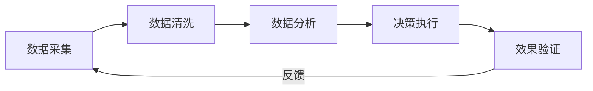
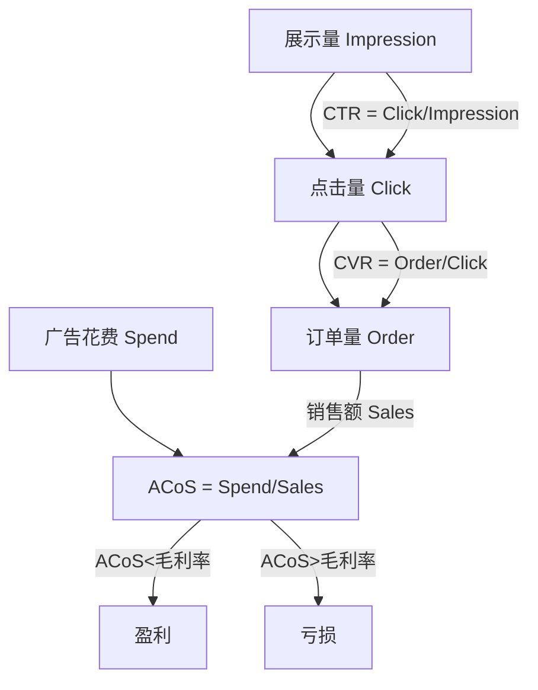
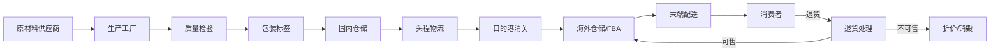
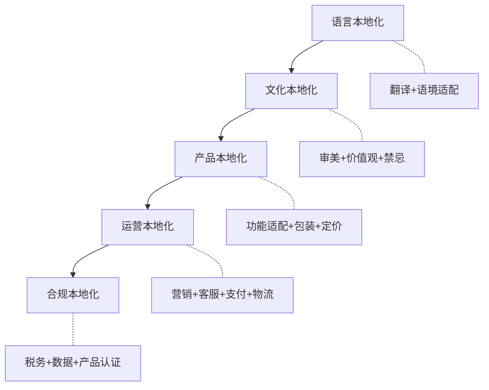
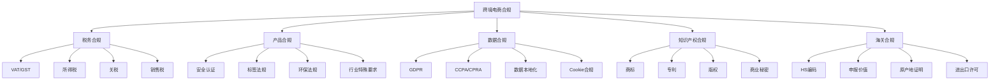

# 第26章 跨境电商进阶 — 深度拓展

本章深度拓展涵盖跨境电商运营中最核心的五个高阶领域：数据驱动运营体系、品牌出海方法论、供应链深度优化、全球化本地运营、合规风险管理，以及前沿增长机会。每个领域从底层逻辑到实操工具，从入门框架到高级策略，逐层深入。

---

## 一、跨境电商数据驱动运营体系

### 1.1 数据分析的底层逻辑

在跨境电商领域，数据分析不是锦上添花的附加能力，而是决定生死的核心竞争力。两个卖同样产品的卖家，数据能力的差异可能直接导致一个年利润百万，另一个亏损退场。

数据分析的核心框架是**五步闭环**：



- **数据采集的广度和深度**决定了分析的基础——采集太少会遗漏关键信号，采集太多会淹没噪声
- **数据清洗的质量**决定了分析的准确性——脏数据比没有数据更危险，因为它会引导错误决策
- **分析方法的科学性**决定了洞察的价值——相关性不等于因果性，幸存者偏差是跨境电商数据分析中最常见的陷阱
- **决策执行的效率**决定了变现的速度——再好的洞察如果不能快速落地，就失去了窗口期
- **效果验证的严谨性**决定了持续优化的可能——没有A/B测试的决策都是猜测

### 1.2 选品数据模型

选品是数据分析应用最广泛、也最容易出错的环节。科学的选品需要建立多维评估模型，而不是凭感觉或跟风。

**四维选品评估模型**：

| 维度 | 核心指标 | 数据来源 | 合格线 |
|------|----------|----------|--------|
| 市场需求 | 月搜索量、搜索趋势、季节性系数 | Google Trends, Jungle Scout, Helium 10 | 月搜索量>5000，趋势稳定或上升 |
| 竞争强度 | 头部卖家评价数、品牌集中度、广告密度 | Keepa, 卖家精灵, BSR排名 | 前10名平均评价<500，CR<60% |
| 利润空间 | 预估毛利率、广告占比、退货率 | FBA计算器+行业均值 | 毛利率>30%，净利率>15% |
| 供应链可行性 | 供应商数量、MOQ、交货周期、质量合格率 | 1688, 阿里巴巴国际站 | 供应商>3家，MOQ<500，交期<30天 |

**选品数据采集的实操流程**：

第一步，使用 Helium 10 的 Cerebro 工具反查竞品关键词，获取月搜索量和竞争度数据。重点关注搜索量在5000-50000之间的"中腰部关键词"——这类关键词竞争适中，转化率通常高于大词。

第二步，使用 Jungle Scout 的 Product Database 筛选目标品类，设置月销量>300、评价数<500、售价$15-$75的筛选条件。这个价格区间是冲动购买和理性决策的交汇点，转化率最优。

第三步，使用 Keepa 追踪目标产品的历史价格、BSR排名、评价增长曲线。重点关注以下信号：
- BSR排名波动幅度——波动大说明市场不稳定，受促销和季节影响大
- 评价增长速度——增速过快可能有刷评嫌疑，增速过慢说明品类关注度低
- 价格走势——持续下降说明竞争加剧，利润空间在被压缩

第四步，计算全链路成本模型。很多卖家只算采购成本和平台佣金，忽略了许多隐性成本：

```text
全链路成本 = 采购成本
           + 国际运费（头程海运/空运/快递）
           + 平台佣金（通常8%-15%）
           + FBA仓储费（月度+长期仓储费）
           + FBA配送费（按尺寸和重量分段）
           + 广告费（初期ACoS通常30%-50%）
           + 退货成本（退货率×退货处理费）
           + 退货损耗（退货率×产品成本×不可售比例）
           + 关税（按HS编码和申报价值计算）
           + 包装和标签成本
           + 质检成本
           + 汇率损失（通常1%-3%）
```

以一个售价$29.99的家居产品为例，成本拆解如下：

| 成本项 | 金额(USD) | 占比 |
|--------|-----------|------|
| 采购成本 | $4.50 | 15.0% |
| 头程运费（海运） | $1.20 | 4.0% |
| FBA配送费 | $5.40 | 18.0% |
| 平台佣金（15%） | $4.50 | 15.0% |
| 月度仓储费 | $0.30 | 1.0% |
| 广告费（ACoS 25%） | $7.50 | 25.0% |
| 退货成本（5%退货率） | $0.80 | 2.7% |
| 关税 | $0.60 | 2.0% |
| 包装标签 | $0.30 | 1.0% |
| 汇率损失 | $0.45 | 1.5% |
| **总成本** | **$25.55** | **85.2%** |
| **净利润** | **$4.44** | **14.8%** |

这个案例说明，表面上30%的毛利在扣除所有成本后，净利润率可能只有14.8%。如果广告ACoS超过25%或退货率超过5%，就可能亏损。

### 1.3 广告投放数据优化体系

跨境电商的广告投放是一个持续优化的博弈过程。以亚马逊PPC为例，建立一套完整的数据优化体系需要理解以下核心指标之间的关系：

**广告指标关系图**：



**广告优化的阶段策略**：

**阶段一：数据采集期（第1-2周）**

新品上架初期，开启自动广告（Auto Campaign）和手动广泛匹配（Broad Match）广告组，每日预算$20-$30。目标不是盈利，而是采集关键词数据。

自动广告的作用是让亚马逊的算法帮你发现潜在的高转化关键词。建议同时开启四种匹配方式的自动广告组：
- 紧密匹配（Close Match）：展示在搜索词与产品高度相关的查询中
- 宽泛匹配（Loose Match）：展示在相关但不太精确的查询中
- 同类商品（Substitutes）：展示在相似产品的详情页中
- 关联商品（Complements）：展示在互补产品的详情页中

**阶段二：数据清洗期（第3-4周）**

下载搜索词报告（Search Term Report），对每个搜索词进行分类：

| 分类 | 处理方式 | 示例 |
|------|----------|------|
| 高转化高相关 | 加入手动精准匹配，提高出价 | "silicone baking mat" CVR 15% |
| 高点击低转化 | 否定关键词或降低出价 | "baking mat large" CTR 2% CVR 1% |
| 低相关词 | 添加否定关键词 | "baking recipes" |
| 竞品品牌词 | 单独广告组监控 | "OXO baking mat" |

**阶段三：利润优化期（第2-3个月）**

当积累了足够的转化数据后，开始优化ACoS。核心策略：

- **竞价调整公式**：`建议出价 = 目标ACoS × 产品售价 × CVR`
  - 例：目标ACoS 20%，售价$29.99，CVR 12% → 建议出价 = 0.20 × 29.99 × 0.12 = $0.72
- **分时段投放**：根据订单高峰时段调整竞价。美国站的订单高峰通常在东部时间早上9-11点和晚上7-10点
- **否定策略优化**：每周检查搜索词报告，将无关词和低效词添加为否定关键词
- **商品定向广告**：针对竞品的ASIN投放定向广告，抢占竞品详情页流量

**阶段四：TACoS控制期（长期）**

TACoS（Total Advertising Cost of Sales）= 广告花费 / 总销售额（含自然订单）。TACoS比ACoS更能反映广告的真实效率。

健康的TACoS演变路径：
- 新品期（0-3个月）：TACoS 20%-35%（高广告投入换流量和评价）
- 成长期（3-6个月）：TACoS 12%-20%（自然排名开始上升）
- 成熟期（6个月+）：TACoS 5%-12%（自然流量为主，广告为辅）

如果TACoS在成熟期仍然>15%，说明产品的自然竞争力不足，需要回到Listing优化和产品差异化上找原因。

### 1.4 用户行为数据分析

**转化漏斗分析**是提升运营效率最直接的方法。以亚马逊产品详情页为例，完整的转化漏斗包括：

```text
搜索展示（Impression）
    ↓ CTR 15%-25%
点击进入（Click/Page View）
    ↓ CVR 8%-15%
加入购物车（Add to Cart）
    ↓ 60%-75%
完成购买（Purchase）
    ↓ 2%-5% 自然退货率
最终留存（Retained Order）
```

每个环节的流失都有不同的原因和优化方向：

- **搜索展示→点击（CTR优化）**：主图质量、价格竞争力、标题关键词、评价星级、Prime标志
- **点击→加购（详情页说服力）**：副图展示、A+内容、描述文案、视频、价格锚定
- **加购→购买（决策助推）**：优惠券、限时折扣、库存紧张提示、免运费门槛
- **购买→留存（体验管理）**：产品质量、物流时效、售后响应、包装体验

**Review数据分析**是产品优化的金矿。通过NLP工具（如 Helium 10的Review Insights）对竞品和自有产品的评价进行分析，可以提取以下洞察：

- **高频正面关键词**：客户最看重的产品优势，应在Listing中强化
- **高频负面关键词**：客户最大的痛点，是产品改进和差异化的机会
- **使用场景词**：客户实际使用产品的场景，可用于优化关键词和A+内容
- **期望落差词**：如"以为""期望""不如预期"等，揭示描述与实际体验的差距

### 1.5 数据分析工具矩阵

| 工具类型 | 推荐工具 | 适用场景 | 月费用(USD) |
|----------|----------|----------|-------------|
| 选品工具 | Jungle Scout, Helium 10 | 市场调研、竞品分析 | $30-$100 |
| 关键词工具 | Helium 10 Cerebro/Magnet | 关键词反查和挖掘 | 含在Helium 10套餐中 |
| 价格追踪 | Keepa, CamelCamelCamel | 历史价格和排名追踪 | Keepa $19/月 |
| 广告优化 | Perpetua, Pacvue, Quartile | 自动化广告竞价优化 | $250-$500+ |
| 利润核算 | SellerBoard, HelloProfit | 真实利润计算和追踪 | $15-$50 |
| 评论分析 | ReviewMeta, FeedbackWhiz | 评价分析和邮件跟进 | $20-$50 |
| 综合分析 | 卖家精灵, 数魔跨境 | 中文界面综合分析 | ¥200-¥500/月 |
| BI工具 | Google Data Studio, Tableau | 自定义数据看板 | 免费-$70/月 |

对于年销售额超过$50万的卖家，建议搭建自定义BI看板，将各平台的销售、广告、库存、利润数据整合到一个统一的仪表盘中，实现真正的数据驱动决策。

---

## 二、品牌出海方法论

### 2.1 从卖货到品牌的战略转型

跨境电商正在经历从"卖货模式"到"品牌模式"的深刻分化。这两种模式在底层逻辑上有根本性的差异：

| 维度 | 卖货模式 | 品牌模式 |
|------|----------|----------|
| 核心驱动力 | 信息差、价格优势 | 品牌认知、用户忠诚 |
| 利润来源 | 规模效应、成本压缩 | 品牌溢价、复购率 |
| 竞争壁垒 | 低（容易被复制） | 高（品牌资产不可复制） |
| 客户关系 | 一次性交易 | 长期关系、社区 |
| 生命周期 | 跟随品类和平台周期 | 跨越品类和平台周期 |
| 估值逻辑 | 利润倍数（通常2-4x） | 品牌价值+增长潜力（通常5-10x） |
| 典型代表 | 铺货卖家、跟卖卖家 | Anker, SHEIN, PatPat |

品牌出海的四大核心价值：

**第一，品牌溢价能力**。消费者愿意为信任的品牌支付更高的价格。Anker的充电宝售价是同类白牌产品的2-3倍，但消费者仍然选择Anker，因为品牌代表了质量保证和售后保障。品牌溢价直接提升毛利率，从15%-20%的白牌水平提升到30%-50%的品牌水平。

**第二，用户忠诚度**。品牌能够建立与消费者的情感连接。有数据表明，品牌忠诚客户的复购率是新客的3-5倍，获取成本仅为新客的1/5。这意味着品牌越强，获客成本越低，利润越高，形成正向飞轮。

**第三，渠道议价权**。知名品牌在与平台、供应商、物流商的谈判中拥有更强的议价能力。当你的品牌有了足够的市场认知度，平台会主动给你更好的资源位，供应商会给你更优惠的账期，物流商给你更低的费率。

**第四，抗风险能力**。品牌资产不易被竞争对手复制。卖货模式的核心竞争力（价格、渠道）随时可能被取代，但品牌的认知度和忠诚度一旦建立，就能在市场波动中保持相对稳定的业绩。2021年亚马逊封号潮中，有品牌力的卖家损失远小于纯卖货卖家。

### 2.2 品牌定位与差异化体系

品牌定位是品牌出海的起点，也是最重要的决策。定位错误，后续所有的投入都是浪费。

**品牌定位画布（Brand Positioning Canvas）**：

```text
┌─────────────────────────────────────────────────────────┐
│                    品牌定位画布                           │
├──────────────┬──────────────────┬───────────────────────┤
│  目标客户     │   核心价值主张     │   差异化优势           │
│  (WHO)       │   (WHAT)         │   (WHY US)            │
│              │                  │                       │
│  人口统计     │  解决什么问题     │  技术/设计/体验/       │
│  行为特征     │  满足什么需求     │  价值观/服务            │
│  心理画像     │  创造什么价值     │                       │
├──────────────┼──────────────────┼───────────────────────┤
│  竞争格局     │   品牌人格        │   品牌承诺             │
│  (VS WHO)    │   (HOW)         │   (PROMISE)           │
│              │                  │                       │
│  直接竞品     │  品牌调性         │  一句话承诺             │
│  间接竞品     │  沟通风格         │  可验证的价值保证       │
│  替代方案     │  视觉语言         │                       │
└──────────────┴──────────────────┴───────────────────────┘
```

**差异化策略的四个层次**（由浅入深）：

**层次一：产品差异化**——通过技术创新、设计创新或功能创新，打造与竞争对手不同的产品。这是最直接也最容易被消费者感知的差异化。

案例：Anker在充电技术上的持续投入。当大多数竞品还在用5W充电时，Anker率先推出PowerIQ智能充电技术，后来又率先推出GaN氮化镓充电器，在同样的体积下提供更高的功率。每一次技术迭代都强化了"充电专家"的品牌认知。

实操方法：
1. 从竞品的1-3星差评中提取客户痛点
2. 将痛点转化为产品改进需求
3. 与供应商合作开发差异化功能
4. 申请外观专利或实用新型专利保护

**层次二：体验差异化**——通过优质的购物体验、售后服务、包装设计等，为消费者创造超越产品本身的附加价值。

案例：DTC美妆品牌Glossier的"unboxing experience"（开箱体验）。每个包裹都包含粉色泡泡袋、品牌贴纸、产品小样和手写感谢卡。这种精心设计的开箱体验让消费者忍不住在社交媒体上分享，形成了大量的用户生成内容（UGC），相当于免费的品牌传播。

**层次三：价值观差异化**——通过传递独特的品牌价值观，吸引认同这些价值观的消费者群体。

案例：户外品牌Patagonia的"Don't Buy This Jacket"（不要买这件夹克）广告。这个反直觉的广告传递了环保和可持续的价值观，反而激发了消费者的认同和购买欲望。Patagonia的年营收超过$10亿，其中很大一部分来自认同其环保理念的忠实客户。

**层次四：社群差异化**——通过建立品牌的用户社区，让消费者成为品牌的一部分，形成归属感和身份认同。

案例：Peloton不仅仅卖健身设备，它建立了一个"家庭健身社区"。用户在骑行时可以看到其他用户的排名，参加直播课程，互相鼓励。这种社群归属感让Peloton的用户留存率远高于传统健身设备品牌。

### 2.3 多渠道品牌建设矩阵

品牌出海需要在多个渠道进行协同的品牌建设，每个渠道有不同的定位和作用：

| 渠道 | 核心作用 | 品牌建设重点 | 流量特征 | 投入优先级 |
|------|----------|------------|----------|-----------|
| 独立站(DTC) | 品牌主阵地、数据资产 | 品牌故事、用户旅程、内容SEO | 自然流量+付费引流 | ★★★★★ |
| 亚马逊 | 销量引擎、信任背书 | A+内容、品牌旗舰店、Vine计划 | 平台搜索流量 | ★★★★★ |
| TikTok Shop | 年轻用户触达、社交种草 | 短视频内容、达人合作 | 社交流量+推荐流量 | ★★★★ |
| Instagram | 视觉品牌形象、社区互动 | 生活方式内容、UGC转发 | 社交流量 | ★★★★ |
| YouTube | 深度内容、信任建设 | 产品评测、使用教程、品牌故事 | 搜索流量+推荐流量 | ★★★ |
| Pinterest | 长期流量、视觉SEO | 产品Pin、场景图、信息图 | 搜索流量（生命周期长） | ★★★ |
| 线下渠道 | 品牌信任、覆盖扩展 | 零售终端体验、样品展示 | 线下自然流量 | ★★（成熟期） |

**独立站的核心地位**：

独立站是品牌建设的核心阵地，原因有三：第一，独立站可以完全掌控品牌形象和用户体验，不受平台规则的限制；第二，独立站可以积累第一方用户数据（邮箱、购买行为、偏好），这是品牌最有价值的资产；第三，独立站的用户LTV（终身价值）通常是平台用户的2-3倍，因为没有竞品的直接比较。

独立站建设的核心指标：

- 自然流量占比：成熟品牌应>40%（说明品牌认知度足够强）
- 邮箱订阅转化率：>3%为合格，>5%为优秀
- 复购率：>20%为合格，>35%为优秀
- 客户获取成本(CAC)：应低于客户LTV的1/3
- 邮件营销收入占比：成熟品牌应>25%

### 2.4 品牌知识产权保护体系

品牌出海必须建立系统化的知识产权保护体系，否则辛苦建立的品牌资产随时可能被侵蚀。

**知识产权保护清单**：

| 保护类型 | 行动项 | 时间节点 | 预算参考 |
|----------|--------|----------|----------|
| 商标注册 | 在目标市场国家/地区注册商标 | 品牌创立初期（提前6-12个月） | 美国$250-$350/类，欧盟€850/类 |
| 品牌备案 | 在亚马逊进行品牌备案（Brand Registry） | 商标注册完成后立即 | 免费 |
| 外观专利 | 对独特产品外观申请外观设计专利 | 产品设计定稿后 | $1000-$3000 |
| 实用专利 | 对创新功能申请实用新型或发明专利 | 产品研发完成后 | $5000-$15000 |
| 版权登记 | 登记品牌Logo、产品图片、营销素材的版权 | 设计完成后 | $35-$55/件（美国） |
| 域名保护 | 注册主要市场的域名（.com/.co.uk/.de/.jp等） | 品牌命名确定后 | $10-$50/年/域名 |
| 社交媒体账号 | 在所有主流社交平台注册品牌账号 | 品牌命名确定后 | 免费 |

**商标保护的常见陷阱**：

- **抢注问题**：在一些国家（如美国、欧盟），商标保护采用"先申请"原则。如果你的品牌名被人抢注，你可能无法在该市场销售。建议在确定品牌名后，立即在主要目标市场提交商标申请。
- **分类保护**：商标保护是按类别（Nice Classification）进行的。只注册了一个类别不代表在其他类别受保护。建议至少在产品所属类别和相关类别都进行注册。
- **续展问题**：商标通常需要每10年续展一次。美国商标还需要在第5-6年提交使用声明（Section 8）。错过续展期限可能导致商标失效。

---

## 三、供应链深度优化

### 3.1 供应链全局优化框架

跨境电商供应链涉及从原材料采购到最终消费者手中的完整链路，任何一个环节的效率低下都会产生"牛鞭效应"——上游的微小波动在下游被放大。



供应链优化的核心目标是在**成本、速度、质量**三个维度之间找到最佳平衡。不同品类和品牌定位对这三个维度的优先级不同：

| 品牌定位 | 成本优先级 | 速度优先级 | 质量优先级 | 典型品类 |
|----------|-----------|-----------|-----------|----------|
| 性价比品牌 | ★★★★★ | ★★★ | ★★★ | 日用百货、基础3C |
| 中端品牌 | ★★★★ | ★★★★ | ★★★★ | 家居、服饰、美妆 |
| 高端品牌 | ★★★ | ★★★★ | ★★★★★ | 电子产品、户外装备 |
| 快时尚 | ★★★★ | ★★★★★ | ★★ | 服饰、饰品 |

### 3.2 供应商管理深度优化

**供应商评估体系（SCARF模型）**：

- **S（Supplier Quality）质量**：产品合格率、质量稳定性、质量认证（ISO 9001等）
- **C（Cost）成本**：单位成本、阶梯报价、付款条件、隐性成本
- **A（Agility）灵活性**：最小起订量(MOQ)、交货周期、紧急订单响应能力
- **R（Reliability）可靠性**：按时交货率、订单准确率、历史合作记录
- **F（Financial Health）财务健康**：企业规模、经营年限、信用评级

**供应商分级管理策略**：

| 等级 | 分类标准 | 管理策略 | 合作深度 |
|------|----------|----------|----------|
| A级（战略供应商） | SCARF总分>90，年度采购额>50万 | 战略合作，联合开发新品，优先产能保障 | 深度绑定 |
| B级（优选供应商） | SCARF总分75-90，年度采购额10-50万 | 定期评估，持续改进，给予稳定订单 | 稳定合作 |
| C级（合格供应商） | SCARF总分60-75 | 基础合作，按需下单，定期考核 | 普通合作 |
| D级（淘汰供应商） | SCARF总分<60 | 逐步减少订单，寻找替代供应商 | 淘汰过渡 |

**供应商谈判的实战技巧**：

1. **阶梯报价谈判**：不要接受供应商的第一份报价。以1000件为基准，分别询问500件、1000件、3000件、5000件、10000件的价格，了解阶梯定价的幅度。通常MOQ每翻一倍，单价下降3%-8%。
2. **账期谈判**：新供应商先用30%定金+70%发货前付款的模式。合作3-5个订单后，尝试谈判30%定金+70%见提单副本付款（即到港后付款），甚至30天账期。账期可以大幅改善现金流。
3. **独家供货谈判**：如果你的采购额占供应商总产量的20%以上，可以谈判独家供货权，换取更好的价格和优先产能。
4. **联合开发**：与核心供应商联合开发新品，供应商承担模具费，你承诺最低采购量。这种模式可以降低你的前期投入，同时锁定供应商的独家产能。

### 3.3 物流方案深度优化

**跨境物流方式对比矩阵**：

| 物流方式 | 时效 | 成本(USD/kg) | 适用场景 | 限制条件 |
|----------|------|-------------|----------|----------|
| 国际快递(DHL/FedEx/UPS) | 3-7天 | $8-$15 | 高价值小件、样品、紧急补货 | 重量限制、偏远地区附加费 |
| 空运专线 | 7-15天 | $4-$8 | 中等价值、时效敏感 | 需要报关、最低计费重量 |
| 海运整柜(FCL) | 25-40天 | $0.5-$1.5 | 大批量、大体积产品 | 最少1个集装箱(20GP/40GP) |
| 海运拼箱(LCL) | 30-45天 | $1.5-$3 | 中等批量、体积产品 | 最低1CBM起运 |
| 铁路(中欧班列) | 15-20天 | $2-$4 | 中等时效、性价比平衡 | 线路固定、品类限制 |
| 海外仓一件代发 | 1-5天(本地) | $2-$5(含仓储) | 本地化配送、退货处理 | 需要提前备货、仓储成本 |

**物流成本优化的五个杠杆**：

**杠杆一：包装优化**。FBA配送费按尺寸分段计费，包装尺寸的微小差异可能导致配送费差距$1-$3/件。建议：
- 使用实际尺寸匹配的包装，避免"大盒装小物"
- 可压缩产品使用真空压缩包装，减少体积重量
- 咨询供应商是否可以提供FBA标准尺寸的包装方案

**杠杆二：头程物流组合**。不要只用一种头程物流方式。建议采用"海运为主+空运为辅"的组合策略：
- 常规补货用海运，每2-3周发一批，成本最低
- 断货紧急补货用空运，成本高但能保住Listing排名
- 新品首发用空运+快递，快速到达抢占先机

**杠杆三：批量发货议价**。物流费用随货量增加而递减。与物流商签订季度或年度合作协议，承诺总货量，换取更低的单价。通常年度总货量>50吨可以获得10%-20%的折扣。

**杠杆四：关税筹划**。合理利用自贸协定和关税优惠政策。例如，通过RCEP（区域全面经济伙伴关系协定），中国出口到东盟国家的部分产品可以享受关税减免。确保HS编码申报准确，错误申报不仅面临罚款，还可能多缴关税。

**杠杆五：退货逆向物流**。退货是跨境电商最大的隐性成本之一。优化退货策略：
- 设置合理的退货门槛，避免过度宽松的退货政策
- 使用海外仓进行退货质检和翻新，减少退货损失
- 不可售退货产品可以折价清仓或捐赠（可抵税）

### 3.4 库存管理深度优化

**安全库存计算模型**：

```text
安全库存 = Z × σ × √LT

其中：
Z = 服务水平对应的Z值（95%服务水平→Z=1.65，99%→Z=2.33）
σ = 日需求量的标准差
LT = 补货提前期（天）
```

举例：某产品日均销量20件，标准差5件，补货提前期30天（海运），要求95%的服务水平：

```text
安全库存 = 1.65 × 5 × √30 ≈ 45件
```

再订货点 = 日均销量 × 补货提前期 + 安全库存 = 20 × 30 + 45 = 645件

即当库存降至645件时，就需要立即下单补货。

**库存健康度评估指标**：

| 指标 | 计算方式 | 健康范围 | 预警信号 |
|------|----------|----------|----------|
| 库存周转天数 | 平均库存 / 日均销售成本 | 30-60天 | >90天（滞销风险）或<15天（断货风险） |
| IPI评分(亚马逊) | 亚马逊库存绩效指数 | >500分 | <350分（限制仓储容量） |
| 冗余库存比例 | 冗余库存金额 / 总库存金额 | <10% | >20%（资金浪费严重） |
| 断货率 | 断货SKU数 / 总SKU数 | <5% | >10%（严重影响排名） |
| 库存资金占比 | 库存金额 / 月销售额 | 1.5-3个月 | >4个月（现金流压力大） |

**滞销库存处理策略**：

当产品库存周转天数超过90天时，需要启动滞销处理流程：

1. **轻度滞销（90-120天）**：降价5%-10%促销，配合Coupon和Deal活动清理
2. **中度滞销（120-180天）**：降价15%-30%，使用Lightning Deal或Best Deal促销
3. **重度滞销（>180天）**：大幅降价清仓，或通过站外Deal网站（Slickdeals等）处理
4. **顽固滞销**：移除FBA库存，在二手平台折价出售，或捐赠给慈善机构（可获得税务抵扣）

### 3.5 供应链数字化工具

| 工具类型 | 推荐工具 | 核心功能 | 适用规模 |
|----------|----------|----------|----------|
| ERP系统 | 领星、积加、马帮 | 订单管理、库存管理、财务核算 | 中大型卖家 |
| 采购管理 | 1688跨境专供、Global Sources | 供应商对接、询价比价 | 全规模 |
| 物流追踪 | 17TRACK、4PX、云途 | 全链路物流追踪 | 全规模 |
| 质检服务 | QIMA、SGS、华测 | 第三方验货、质量检测 | 中大型卖家 |
| WMS系统 | 易仓WMS、万里牛 | 仓库管理、拣货打包、库存盘点 | 使用海外仓的卖家 |
| 需求预测 | Inventory Planner、Forecastly | 基于AI的销量预测和补货建议 | 中大型卖家 |

---

## 四、全球市场本地化运营

### 4.1 本地化的战略层次

本地化运营不仅仅是语言翻译，它是一个涵盖**语言→文化→产品→运营→合规**五个层次的系统工程。



每个层次的投入回报比不同。语言和文化本地化的投入产出比最高——一个文化适配的广告素材比直接翻译的素材转化率高3-5倍。

### 4.2 重点市场深度本地化指南

**北美市场（美国+加拿大）**：

| 维度 | 本地化要点 |
|------|-----------|
| 语言 | 美式英语为主，加拿大需英法双语；避免英式拼写（colour→color） |
| 文化 | 注重个人主义和创新精神；幽默感直接且自嘲式；避免政治敏感话题 |
| 定价 | 以$X.99结尾的心理定价策略；美国消费者习惯看到折扣标签 |
| 营销 | Google Ads+Facebook/Instagram为主；感恩节/黑五/网一是年度最大促销季 |
| 支付 | 信用卡为主（Visa/Mastercard），PayPal普及率高，Apple Pay增长快 |
| 物流 | FBA为主，2日达是标配；消费者对物流时效期望高 |
| 客服 | 需要英语母语水平客服；期望快速响应（24小时内） |
| 合规 | FDA（食品药品）、FCC（电子设备）、CPSIA（儿童产品）、Prop 65（加州） |

**欧洲市场**：

| 维度 | 本地化要点 |
|------|-----------|
| 语言 | 至少覆盖英/德/法/西/意五种语言；德语市场对翻译质量要求最高 |
| 文化 | 注重环保和可持续性；产品安全标准严格；隐私意识强 |
| 定价 | 欧元区统一货币但各国消费力不同；必须含税显示价格（VAT） |
| 营销 | Google Ads为主，本地平台如Cdiscount(法)、Allegro(波兰)不可忽视 |
| 支付 | 信用卡+PayPal；本地银行转账重要（iDEAL/荷兰、Sofort/德国、Bancontact/比利时） |
| 物流 | 欧洲FBA需注册VAT；跨境可利用亚马逊Pan-European FBA |
| 合规 | CE认证、REACH法规、WEEE指令、GDPR数据保护、EPR（生产者延伸责任） |

**日本市场**：

| 维度 | 本地化要点 |
|------|-----------|
| 语言 | 日语翻译必须精准，假名使用、敬语层次要正确；产品说明越详细越好 |
| 文化 | 注重品质和细节；包装精美度直接影响评价；"おもてなし"（待客之道） |
| 定价 | 日元定价以"0"结尾居多（¥980, ¥2980）；日本消费者对性价比敏感 |
| 营销 | Yahoo Japan+LINE为主；Twitter（X）在日本用户量大；亚马逊日本站增长快 |
| 支付 | 信用卡+便利店支付（Konbini）+银行转账；货到付款仍有需求 |
| 物流 | 日本消费者期望次日达；乐天和亚马逊日本站的物流标准极高 |
| 合规 | PSE（电气产品）、PSC（消费品安全）、食品卫生法、药机法（化妆品） |

**东南亚市场**：

| 维度 | 本地化要点 |
|------|-----------|
| 语言 | 至少覆盖英语、泰语、印尼语、越南语；马来语市场与印尼语相近 |
| 文化 | 穆斯林市场（印尼/马来）注意宗教禁忌；社交属性强，KOL影响力大 |
| 定价 | 价格敏感度高；$1-$15区间动销最快；大促期间折扣幅度需>30% |
| 营销 | TikTok+Shopee/Lazada为主；直播电商渗透率高；社群营销效果好 |
| 支付 | 电子钱包（GrabPay/GoPay/ShopeePay/Touch'n Go）；货到付款仍占30%-50% |
| 物流 | 基础设施不完善；Shopee/Lazada自有物流为主；岛屿国家物流成本高 |
| 合规 | 各国标准不统一；印尼SNI认证、泰国TISI认证、越南MoH认证 |

**中东市场**：

| 维度 | 本地化要点 |
|------|-----------|
| 语言 | 阿拉伯语为主，从右到左(RTL)排版；英语可作为辅助语言 |
| 文化 | 伊斯兰文化为核心；斋月是最大消费季；颜色偏好（绿色受欢迎，避免猪/狗图案） |
| 定价 | 消费力强（尤其UAE/沙特）；高端产品有市场；COD比例高需考虑退货成本 |
| 营销 | Snapchat+Instagram+TikTok为主；Noon和Amazon.sa是主要电商平台 |
| 支付 | 信用卡+COD（货到付款仍占40%-60%）；本地电子钱包（STC Pay等）增长快 |
| 物流 | 地址系统不完善；最后一公里配送困难；noon FBN（Fulfilled by noon）可选 |
| 合规 | 沙特SASO认证、阿联酋ESMA认证、清真认证（食品和美妆类） |

### 4.3 本地化内容营销体系

**内容本地化的三层架构**：

**第一层：翻译层**——将核心产品信息翻译成目标语言。这是最低标准，但很多卖家连这一步都没有做好。常见错误包括：机翻质量差（语法错误、语义不通）、度量单位未转换（英寸/磅vs厘米/千克）、日期格式未适配（MM/DD/YYYY vs DD/MM/YYYY）。

**第二层：适配层**——根据当地文化重新创作内容。直接翻译的效果远不如本地创作。例如，面向美国市场的营销素材强调"创新"和"个人表达"，面向日本市场强调"品质"和"匠心"，面向东南亚市场强调"性价比"和"社群推荐"。

**第三层：原创层**——在目标市场创造原生内容。与当地KOL合作、招募当地内容创作者、建立本地化内容团队。这是成本最高但效果最好的方式。

**KOL营销的本地化执行框架**：

| 阶段 | 动作 | 预算参考 | 效果预期 |
|------|------|----------|----------|
| 微型KOL铺量 | 联系50-100个粉丝1K-10K的微型KOL，免费寄样换内容 | 产品成本+$500-$1000物流 | 50-100条UGC内容 |
| 中型KOL合作 | 与5-10个粉丝10K-100K的KOL合作付费推广 | $200-$2000/位 | 精准曝光+转化 |
| 头部KOL背书 | 与1-2个粉丝>100K的头部KOL深度合作 | $2000-$20000/位 | 品牌背书+大规模曝光 |
| 长期品牌大使 | 签约1-3个长期品牌大使 | 月费$500-$5000+佣金 | 持续稳定的品牌曝光 |

### 4.4 支付本地化深度指南

支付环节是转化漏斗中流失率最高的环节之一。数据显示，提供本地主流支付方式可以将结账转化率提升15%-30%。

**全球主要支付方式覆盖矩阵**：

| 支付方式 | 北美 | 欧洲 | 日本 | 东南亚 | 中东 | 拉美 |
|----------|------|------|------|--------|------|------|
| 信用卡/借记卡 | ★★★★★ | ★★★★ | ★★★★ | ★★ | ★★★ | ★★ |
| PayPal | ★★★★★ | ★★★★★ | ★★★ | ★★ | ★★ | ★★★ |
| Apple Pay | ★★★★ | ★★★★ | ★★★ | ★ | ★★ | ★ |
| Google Pay | ★★★ | ★★★ | ★★ | ★★ | ★★ | ★ |
| 银行转账 | ★ | ★★★★ | ★★★★ | ★ | ★★ | ★★★ |
| 电子钱包 | ★ | ★★ | ★★ | ★★★★★ | ★★★ | ★★★★ |
| 货到付款(COD) | - | ★ | ★ | ★★★★ | ★★★★★ | ★★★★ |
| BNPL(先买后付) | ★★★★ | ★★★★ | ★ | ★ | ★★ | ★★ |

**聚合支付平台选择**：

- **Stripe**：覆盖46个国家，支持135+种货币，API文档完善，开发者友好。费率2.9%+$0.30/笔（美国）。适合独立站卖家。
- **Adyen**：覆盖全球，支持250+种支付方式，企业级解决方案。费率因交易量而异。适合大型品牌。
- **PayPal**：全球最普及的第三方支付，买家信任度高。费率3.49%+$0.49/笔（美国）。适合各规模卖家。
- **Airwallex（空中云汇）**：中国背景的跨境支付平台，支持多币种账户，汇率优惠。适合中国卖家。
- **PingPong**：专注于跨境电商的支付服务商，支持多平台收款，提现费率低。适合中国跨境卖家。

---

## 五、合规风险管理深度指南

### 5.1 合规风险全景图

跨境电商面临的合规风险可以用"五维合规模型"来系统化管理：



### 5.2 税务合规深度指南

**VAT/GST合规（欧盟）**：

欧盟于2021年7月实施了新的VAT规则（EU VAT E-Commerce Package），主要变化包括：

1. **取消低价值商品免税门槛**：之前从欧盟外寄入的价值≤€22的商品免VAT，新规则取消了这一免税门槛，所有进口商品都需要缴纳VAT。
2. **IOSS（Import One-Stop Shop）**：价值≤€150的商品可以通过IOSS一站式申报，在销售时收取VAT，简化清关流程。
3. **平台代扣代缴**：如果通过在线平台（如亚马逊）销售，平台负责代扣代缴VAT。

**各主要市场VAT税率参考**：

| 国家/地区 | 标准税率 | 低税率 | 注册门槛 |
|-----------|----------|--------|----------|
| 英国 | 20% | 5%/0% | 远程销售即需注册 |
| 德国 | 19% | 7% | 远程销售即需注册 |
| 法国 | 20% | 5.5%/2.1% | 远程销售即需注册 |
| 意大利 | 22% | 10%/5%/4% | 远程销售即需注册 |
| 西班牙 | 21% | 10%/4% | 远程销售即需注册 |
| 荷兰 | 21% | 9% | 远程销售即需注册 |
| 日本(消费税) | 10% | 8% | 年销售额>1000万日元 |
| 澳大利亚(GST) | 10% | 0% | 年销售额>7.5万澳元 |

**美国销售税合规**：

美国没有联邦层面的增值税，但各州有自己的销售税（Sales Tax）。2018年South Dakota v. Wayfair案后，各州可以对远程销售者征收销售税。关键规则：

- 经济关联（Economic Nexus）：在某州年销售额超过一定门槛（通常$100,000或200笔交易）就需要在该州征收销售税
- 物理关联（Physical Nexus）：在某州有仓库、办公室或员工就需要征收销售税
- 亚马逊的FBA库存构成物理关联，因此使用FBA的卖家需要在有FBA仓库的州征收销售税

建议使用TaxJar或Avalara等自动化税务工具来管理美国各州的销售税合规。

### 5.3 产品合规深度指南

**全球主要市场产品认证要求速查表**：

| 认证 | 市场 | 适用品类 | 认证周期 | 费用参考 |
|------|------|----------|----------|----------|
| CE | 欧盟 | 电子、机械、玩具、医疗器械等 | 4-12周 | $2000-$10000 |
| UKCA | 英国 | 同CE（英国脱欧后） | 4-12周 | $2000-$10000 |
| FCC | 美国 | 电子、通信设备 | 2-6周 | $3000-$15000 |
| UL | 美国 | 电气安全相关产品 | 6-16周 | $5000-$30000 |
| PSE | 日本 | 电气产品 | 4-8周 | $3000-$10000 |
| PSC | 日本 | 消费品安全（压力锅、头盔等） | 4-8周 | $2000-$8000 |
| SASO | 沙特 | 多品类 | 2-8周 | $1000-$5000 |
| SAA | 澳大利亚 | 电气产品 | 4-8周 | $3000-$10000 |
| KC | 韩国 | 电子、通信设备 | 4-10周 | $3000-$10000 |
| CCC | 中国 | 电子、汽车零部件等 | 8-16周 | $5000-$20000 |

**产品标签合规检查清单**：

- [ ] 产品名称和型号
- [ ] 制造商名称和地址
- [ ] 原产国标识（Made in [Country]）
- [ ] 产品材料成分
- [ ] 使用说明和安全警告（当地语言）
- [ ] 认证标志（CE/FCC/UL等）
- [ ] 条形码（UPC/EAN）
- [ ] 尺寸和重量（当地计量单位）
- [ ] 保质期/生产日期（食品、化妆品类）
- [ ] 回收标识（WEEE标志、回收三角标等）
- [ ] 能效标签（欧盟ErP指令要求的品类）

### 5.4 数据合规深度指南

**GDPR合规核心要求**：

| 要求 | 具体内容 | 实操建议 |
|------|----------|----------|
| 合法性基础 | 必须有合法理由处理用户数据 | 获取明确同意（opt-in）或基于合同必要性 |
| 数据最小化 | 只收集必要的数据 | 审查所有数据收集字段，删除不必要的 |
| 透明性 | 告知用户数据如何被使用 | 发布清晰的隐私政策（当地语言） |
| 数据主体权利 | 用户有权访问、删除、迁移自己的数据 | 建立数据主体请求处理流程 |
| 数据安全 | 采取适当的技术和组织措施 | 加密存储、访问控制、定期安全审计 |
| 数据泄露通知 | 72小时内报告数据泄露 | 建立数据泄露应急响应流程 |
| 数据保护影响评估 | 高风险处理活动需提前评估 | 对新的数据处理活动进行DPIA |
| 跨境传输 | 向第三国传输数据需有合法机制 | 使用标准合同条款(SCC)或充分性认定 |

**CCPA/CPRA合规要点**（加州）：

- 年收入>$2500万 或 处理>10万加州消费者数据 或 50%+收入来自数据出售的企业需要遵守
- 消费者有权知道收集了哪些数据、数据被出售给了谁
- 消费者有权要求删除个人数据
- 消费者有权选择退出数据出售（Do Not Sell My Personal Information链接）
- 2023年起CPRA新增了数据更正权和限制使用敏感数据的权利

### 5.5 合规管理体系建设

**合规管理成熟度模型**：

| 阶段 | 特征 | 适用规模 | 投入建议 |
|------|------|----------|----------|
| 阶段一：被动响应 | 出了问题才处理 | 年销售额<$50万 | 每年$2000-$5000（基础认证+税务代理） |
| 阶段二：基础合规 | 完成必要的认证和注册 | 年销售额$50万-$200万 | 每年$5000-$20000（认证+税务+法律顾问） |
| 阶段三：主动合规 | 建立合规流程和检查清单 | 年销售额$200万-$1000万 | 每年$20000-$50000（合规专员+外部顾问） |
| 阶段四：合规驱动 | 合规成为竞争优势 | 年销售额>$1000万 | 每年$50000+（合规团队+系统+持续培训） |

**合规风险评估模板**：

```text
产品名称：_______________
目标市场：_______________

一、产品合规检查
├─ 安全认证要求：___________ (已完成/进行中/未开始)
├─ 标签法规要求：___________ (已完成/进行中/未开始)
├─ 环保法规要求：___________ (已完成/进行中/未开始)
└─ 行业特殊要求：___________ (已完成/进行中/未开始)

二、税务合规检查
├─ VAT/GST注册：____________ (已完成/进行中/未开始)
├─ 所得税申报：_____________ (已完成/进行中/未开始)
├─ 关税合规：_______________ (已完成/进行中/未开始)
└─ 销售税(美国)：___________ (已完成/进行中/未开始)

三、数据合规检查
├─ 隐私政策更新：___________ (已完成/进行中/未开始)
├─ Cookie同意机制：_________ (已完成/进行中/未开始)
├─ 数据处理协议：___________ (已完成/进行中/未开始)
└─ 数据泄露响应流程：_______ (已完成/进行中/未开始)

四、知识产权检查
├─ 商标注册：_______________ (已完成/进行中/未开始)
├─ 专利检索：_______________ (已完成/进行中/未开始)
├─ 侵权风险评估：___________ (已完成/进行中/未开始)
└─ 品牌备案：_______________ (已完成/进行中/未开始)

五、海关合规检查
├─ HS编码确认：_____________ (已完成/进行中/未开始)
├─ 申报价值合规：___________ (已完成/进行中/未开始)
├─ 原产地证明：_____________ (已完成/进行中/未开始)
└─ 进出口许可：_____________ (已完成/进行中/未开始)

风险评级：□ 低风险  □ 中风险  □ 高风险
负责人：_______________
完成期限：_______________
```

---

## 六、前沿增长机会

### 6.1 社交电商与直播出海

社交电商正在重塑跨境电商的流量格局。2025年全球社交电商市场规模预计超过$1.2万亿美元，年增长率超过30%。

**社交电商的三个核心战场**：

**TikTok Shop**：2022年在东南亚和英国上线后增长迅猛，2023年进入美国市场。TikTok Shop的核心逻辑是"内容驱动购买"——用户在刷短视频时被种草，直接在App内完成购买。对于卖家来说，核心能力是内容创作和达人合作能力，而不是传统的搜索优化能力。

TikTok Shop运营要点：
- 短视频是流量入口：每天发布2-3条15-60秒的产品展示/使用视频
- 达人带货是增长引擎：通过TikTok Shop的达人广场（Affiliate Marketplace）招募达人，采用纯佣金模式（15%-30%），零前期成本
- 直播是转化加速器：每天直播2-4小时，展示产品使用场景，回答观众问题
- 数据指标：GPM（千次观看成交额）> $500为优秀，视频完播率> 30%为合格

**Instagram Shopping**：Instagram的购物功能（Shopping Tags, Checkout）让用户可以在浏览图片和视频时直接购买产品。适合视觉属性强的品类，如时尚、家居、美妆、食品。

**WhatsApp Commerce**：在巴西、印度、东南亚等市场，WhatsApp是主要的沟通工具。通过WhatsApp Business API，卖家可以实现产品目录展示、订单管理、客户服务的一站式体验。

### 6.2 AI驱动的跨境电商

AI正在从多个维度改变跨境电商的运营方式：

**AI在选品中的应用**：
- 趋势预测：基于搜索数据、社交媒体热度、消费行为数据预测品类趋势
- 竞品监控：自动追踪竞品的价格变化、评价趋势、广告策略
- 需求缺口分析：通过NLP分析评论数据，发现未被满足的市场需求

**AI在内容创作中的应用**：
- Listing优化：使用GPT-4/Claude等大语言模型生成多语言产品标题、描述、关键词
- 图片生成：使用Midjourney/DALL-E生成产品场景图、生活风格图
- 视频制作：使用AI视频工具（如HeyGen、Synthesia）生成产品介绍视频和多语言讲解视频
- 广告素材：使用AI批量生成A/B测试广告文案和创意

**AI在客服中的应用**：
- 多语言AI客服：使用ChatGPT API搭建7×24小时多语言客服机器人
- 工单分类和路由：AI自动识别客户问题类型，分配给合适的客服人员
- 情感分析：AI分析客户消息的情感倾向，优先处理愤怒或失望的客户

**AI在供应链中的应用**：
- 需求预测：基于历史销售数据、季节性因素、市场趋势预测未来销量
- 动态定价：根据竞品价格、库存水平、市场需求自动调整产品价格
- 库存优化：AI计算最优的补货时间、补货数量和库存分配方案

### 6.3 DTC（Direct-to-Consumer）品牌出海

DTC模式是品牌出海的最高形态——品牌直接面向消费者，不依赖任何中间渠道。DTC品牌的核心竞争力在于**品牌故事×产品力×用户关系**的三角。

**DTC品牌的成功公式**：

```text
DTC成功 = 产品力（差异化×品质）
        × 品牌力（故事×视觉×价值观）
        × 获客效率（CAC优化×LTV提升）
        × 运营效率（供应链×物流×客服）
```

**DTC品牌的典型增长路径**：

| 阶段 | 时间 | GMV目标 | 核心任务 | 关键指标 |
|------|------|---------|----------|----------|
| 冷启动 | 0-6个月 | $0-$5万/月 | 验证PMF（产品市场匹配） | 复购率>15% |
| 产品验证 | 6-12个月 | $5万-$20万/月 | 打磨产品和用户体验 | CAC<$30，LTV/CAC>3 |
| 规模增长 | 12-24个月 | $20万-$100万/月 | 扩大获客渠道，优化转化 | TACoS<20%，毛利>40% |
| 品牌成熟 | 24个月+ | $100万+/月 | 品牌扩展，品类延伸 | 自然流量>50%，品牌搜索量增长 |

**DTC品牌的三个核心资产**：

1. **邮件列表**：这是DTC品牌最有价值的资产。通过网站弹窗、内容升级、购买后邀请等方式积累邮件列表。邮件营销的ROI通常在$36:$1（即每投入$1邮件营销费用，获得$36收入）。
2. **品牌社区**：通过Facebook Group、Discord、Reddit等平台建立品牌社区，让用户互相交流使用体验，形成品牌拥护者。
3. **第一方数据**：通过网站分析、购买历史、偏好设置等收集用户行为数据，用于个性化推荐和精准营销。

### 6.4 新兴市场机会

**拉美市场**：巴西和墨西哥是拉美最大的电商市场。Mercado Libre是该地区的主导平台，类似于"拉美的亚马逊"。拉美市场的特点是：年轻人口比例高（中位年龄29岁）、移动电商渗透率高、信用卡普及率较低（BNPL和分期付款是主流）。市场机会在于消费电子、时尚服饰、美妆个护品类。

**印度市场**：印度拥有14亿人口，电商渗透率仍在快速增长中。Flipkart（沃尔玛旗下）和Amazon India是主要平台。印度市场的挑战是：价格敏感度极高、物流基础设施不完善、支付以UPI（统一支付接口）为主。适合的品类是手机配件、家居用品、个人护理。

**非洲市场**：非洲是全球最后一个巨大的未开发电商市场。Jumia是非洲最大的电商平台，覆盖11个国家。非洲市场的特点是：人口年轻（中位年龄19岁）、移动互联网增长快、物流和支付基础设施仍在建设中。长期来看，非洲是跨境电商的战略性市场。

### 6.5 跨境电商的危机管理

成熟的跨境电商企业需要建立危机管理预案，应对以下常见风险场景：

**场景一：账号被封/Listing被下架**
- 预防：严格遵守平台政策，不刷单、不操纵评论、不侵权
- 应对：准备申诉材料模板，了解申诉流程和时间窗口
- 后备：多账号布局（合规）、独立站作为后备渠道

**场景二：供应链断裂**
- 预防：核心品类至少有2-3个备选供应商
- 应对：启用备选供应商，调整产品组合，优先保障高利润产品
- 后备：安全库存缓冲（至少覆盖30天销售）

**场景三：汇率大幅波动**
- 预防：使用远期外汇合约锁定汇率，分散收款币种
- 应对：调整定价策略，与供应商重新谈判成本分担
- 后备：保留一定比例的外汇资产，减少换汇频率

**场景四：地缘政治风险**
- 预防：关注国际政治动态，评估制裁和贸易壁垒风险
- 应对：调整市场布局，减少对单一市场的依赖
- 后备：多市场、多渠道分散布局

**场景五：竞争对手恶意攻击**
- 预防：品牌备案、透明计划（Transparency Program）、差评监控
- 应对：向平台提交投诉，收集证据，必要时法律维权
- 后备：建立品牌护城河，降低对单一平台的依赖

---

## 七、本节要点回顾

| 章节 | 核心要点 | 关键行动 |
|------|----------|----------|
| 数据驱动运营 | 五步闭环、四维选品模型、广告优化四阶段 | 搭建数据看板，建立选品评估体系 |
| 品牌出海 | 品牌定位画布、四层差异化、多渠道协同 | 完成品牌定位，启动品牌备案和商标注册 |
| 供应链优化 | SCARF供应商评估、物流成本五个杠杆、安全库存模型 | 建立供应商评估体系，优化物流方案组合 |
| 本地化运营 | 五层本地化框架、重点市场指南、支付覆盖矩阵 | 完成目标市场本地化方案，接入本地支付 |
| 合规管理 | 五维合规模型、产品认证速查、合规成熟度模型 | 完成合规风险评估，建立合规检查清单 |
| 前沿增长 | 社交电商、AI应用、DTC模式、新兴市场 | 评估社交电商和AI工具的适用性，制定增长计划 |

跨境电商是一个复杂的系统工程，从数据到品牌、从供应链到本地化、从合规到创新，每个环节都需要持续的学习和优化。本节提供的框架、模型和工具是一个起点——真正的竞争力来自于在实战中不断迭代和精进。
