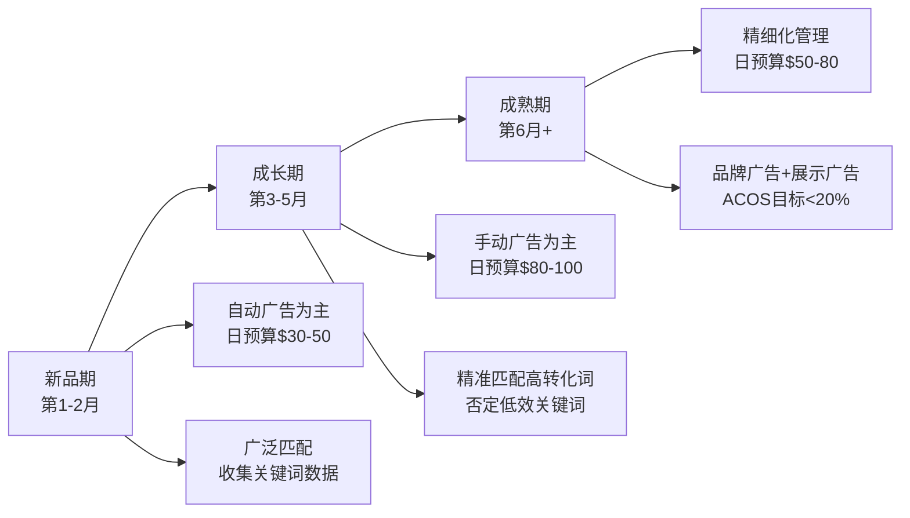
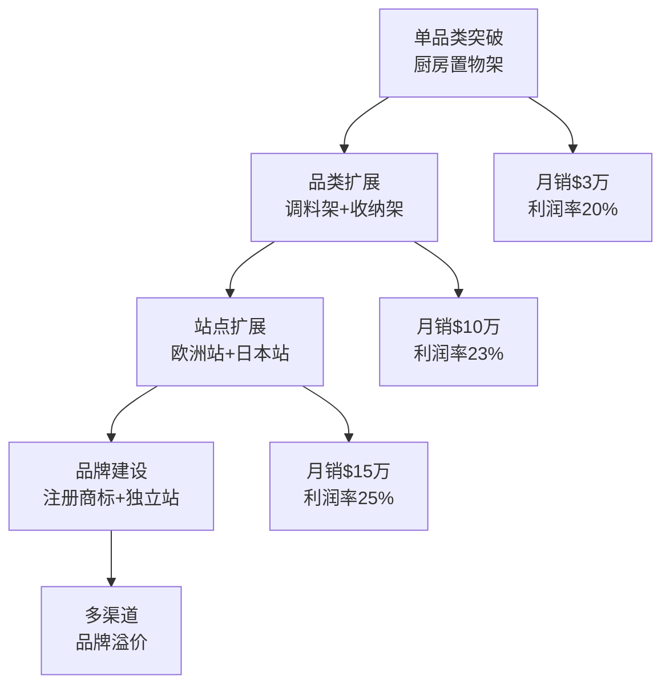
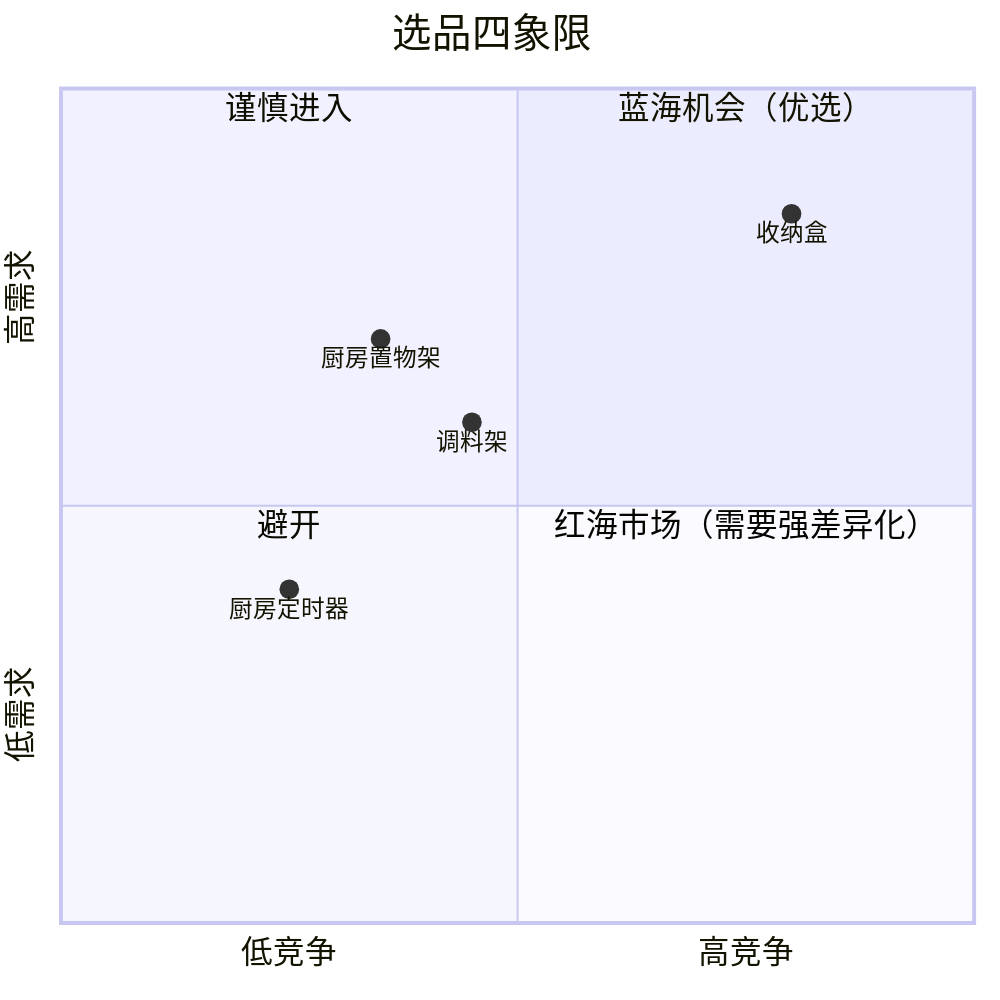

## 案例一：从零起步的亚马逊家居卖家

本案例完整还原一位传统批发商转型亚马逊跨境电商的全过程——从市场调研、选品决策、供应链搭建，到运营优化、危机应对和规模化扩张。每个阶段都附有具体数据、工具用法和可复制的方法论，帮助读者理解"从零到月销15万美元"背后的完整逻辑链。

---

### 案例主角与背景

**基本信息**

| 项目 | 详情 |
|------|------|
| 化名 | 刘先生 |
| 年龄 | 35岁（2021年入行时） |
| 前职业 | 国内家居用品批发商（广东佛山，经营8年） |
| 启动资金 | 约30万人民币 |
| 入驻平台 | 亚马逊美国站（Amazon.com） |
| 主营品类 | 厨房收纳类产品 |
| 当前规模 | 月销售额15万美元+，净利润率约25% |
| 发展周期 | 2年（2021年Q2至2023年Q2） |

**为什么选择亚马逊而非其他平台？**

刘先生在转型前对比了四个主流跨境电商平台：

| 平台 | 优势 | 劣势 | 适配度评估 |
|------|------|------|------------|
| 亚马逊美国站 | 流量最大、FBA物流成熟、家居品类需求旺盛 | 竞争激烈、规则严格、资金门槛较高 | ★★★★★ |
| eBay | 入驻门槛低、适合二手/特色商品 | 家居品类竞争力弱、增长天花板低 | ★★★ |
| Shopify独立站 | 品牌自主性强、无平台佣金 | 需自行引流、获客成本高 | ★★ |
| Wish | 移动端流量大 | 客单价低、家居品类不适合 | ★ |

最终选择亚马逊的核心逻辑：刘先生在佛山有稳定的家居供应链资源，而亚马逊美国站的家居品类年增长率保持在15%以上，FBA模式解决了跨境物流痛点，且家居收纳类产品单价适中（$15-$40），既不会因价格太低导致利润微薄，也不会因价格太高导致转化率低。

---

### 第一阶段：市场调研与选品（第1-2个月）

#### 调研工具与方法

刘先生使用了三款工具进行交叉验证，避免单一数据源的偏差：

**工具一：Jungle Scout（核心工具）**
- 用途：品类市场规模评估、竞品销量估算、关键词挖掘
- 具体操作：输入"Kitchen Organizer"等核心词，获取月搜索量、竞品数量、平均售价、平均Review数
- 发现数据：厨房收纳品类月搜索量约120万次，Top 100卖家月均销量800-3000件，平均售价$22

**工具二：Helium 10（辅助验证）**
- 用途：关键词趋势分析、竞品Listing质量评估
- 具体操作：使用Cerebro反查竞品ASIN的关键词布局，使用Magnet挖掘长尾词
- 发现数据："spice rack organizer"月搜索量8.5万次，竞争度中等偏低

**工具三：Keepa（价格与排名追踪）**
- 用途：查看竞品历史价格波动、BSR排名变化趋势
- 具体操作：追踪Top 20竞品近6个月的价格和排名曲线
- 发现数据：厨房置物架品类季节性波动小（全年需求稳定），这对新手卖家非常友好

#### 选品决策矩阵

刘先生建立了量化评分模型，对三个备选细分品类进行打分：

| 评估维度（权重） | 厨房置物架 | 调料架 | 收纳盒 |
|------------------|-----------|--------|--------|
| 月搜索量（20%） | 8/10 | 7/10 | 9/10 |
| 竞争强度（25%） | 7/10 | 8/10 | 5/10 |
| 利润空间（25%） | 8/10 | 7/10 | 6/10 |
| 供应链难度（15%） | 8/10 | 7/10 | 9/10 |
| 差异化空间（15%） | 9/10 | 6/10 | 4/10 |
| **加权总分** | **7.95** | **7.10** | **6.35** |

**最终决策：以厨房置物架为主打，调料架为第二品类，暂不进入收纳盒市场。**

收纳盒被淘汰的原因：该品类已高度同质化，头部卖家Review数量超过5000条，新卖家几乎没有差异化空间，且塑料材质的产品容易陷入价格战。

#### 选品标准的量化定义

不是拍脑袋决定，而是用数据设定明确的筛选门槛：

```text
选品筛选公式：
  售价区间：$15-$40
    → 低于$15：扣除FBA费用和广告费后利润微薄
    → 高于$40：转化率显著下降，且退货率上升
  
  月销量门槛：500件以上
    → 验证市场需求真实存在，而非伪需求
  
  竞品Review上限：200条以下
    → 超过200条说明头部卖家已建立壁垒，新手难以突破
  
  目标利润率：25%以上
    → 计算公式：（售价 - 产品成本 - FBA费用 - 头程运费 - 广告费 - 平台佣金）÷ 售价
  
  重量限制：单件不超过5磅
    → 控制FBA配送费和头程物流成本
```

#### 产品差异化策略

选品只是第一步，真正的壁垒在于差异化。刘先生对竞品Top 20的差评进行了逐条分析，归纳出消费者的核心痛点：

| 消费者痛点（来自竞品差评） | 出现频次 | 刘先生的改进方案 |
|---------------------------|---------|-----------------|
| 材质太薄，容易变形 | 高频 | 采用0.8mm加厚不锈钢（竞品普遍0.5mm） |
| 尺寸固定，不适配不同橱柜 | 高频 | 设计可调节宽度结构（3档调节） |
| 安装复杂，缺少工具 | 中频 | 随包装附赠螺丝刀和水平仪 |
| 包装简陋，运输中易损坏 | 中频 | 采用EPE珍珠棉+瓦楞纸双层防护 |
| 无使用说明，英文标注不清 | 低频 | 附赠图文并茂的英文安装指南 |

**差异化的核心逻辑不是"我觉得消费者需要什么"，而是"消费者在差评里实际抱怨了什么"。** 竞品的差评就是新手卖家最好的产品研发指南。

---

### 第二阶段：供应链搭建（第2-3个月）

#### 供应商筛选流程

刘先生利用佛山本地的产业集群优势，同时通过1688和线下展会两条渠道寻找供应商：

**线上渠道（1688筛选）：**
1. 搜索"厨房置物架 不锈钢 定制"，筛选"实力商家"标签
2. 初步筛选出20家供应商，逐一索要产品目录和报价
3. 根据起订量、交货周期、定制能力缩小到8家
4. 索要样品（每家3-5款），进行实物对比

**线下渠道（广交会+佛山本地工厂）：**
1. 参加第129届广交会（线上），与5家工厂建立联系
2. 实地走访佛山南海区3家不锈钢制品工厂
3. 重点考察：生产线规模、质检流程、出口经验

**供应商评分卡：**

| 评估项 | 权重 | 供应商A | 供应商B | 供应商C |
|--------|------|---------|---------|---------|
| 单价竞争力 | 25% | 8 | 7 | 9 |
| 起订量灵活性 | 15% | 6 | 9 | 5 |
| 定制开发能力 | 20% | 9 | 5 | 7 |
| 品控体系 | 25% | 7 | 8 | 6 |
| 交期稳定性 | 15% | 8 | 7 | 6 |
| **总分** | | **7.60** | **7.10** | **6.65** |

最终选择供应商A作为主供应商（占70%订单量），供应商B作为备选（占30%），避免单一供应商依赖。

#### 成本结构拆解

以主打产品"可调节不锈钢厨房置物架"为例，单件完整成本分析：

| 成本项 | 金额（美元） | 占售价比例 |
|--------|-------------|-----------|
| 产品采购成本（含定制） | $4.50 | 22.5% |
| 头程海运运费（分摊） | $1.20 | 6.0% |
| FBA配送费 | $5.18 | 25.9% |
| FBA仓储费（月均） | $0.45 | 2.3% |
| 平台佣金（15%） | $3.00 | 15.0% |
| 广告费（ACOS 25%） | $5.00 | 25.0% |
| 其他（退货、损耗等） | $0.47 | 2.4% |
| **总成本** | **$19.80** | **99.0%** |
| **售价** | **$20.00** | - |

第一阶段利润率仅约1%，这几乎是亚马逊新品期的常态。随着以下因素改善，利润率逐步提升：
- 销量上升后，采购单价从$4.50降至$3.80（量大议价）
- 广告ACOS从25%降至15%（自然流量占比提升）
- 头程运费从$1.20降至$0.80（优化物流方案）
- 退货率从8%降至3%（产品改进后）

成熟期利润率提升至约25%（$5.00/件），月销3000件以上时，月净利润约$15,000。

---

### 第三阶段：Listing打造与上架（第3-4个月）

#### Listing优化的七个关键要素

**1. 标题优化（Title）**

标题是搜索排名的第一权重因素。刘先生的标题公式：

```text
[品牌名] + [核心关键词] + [材质/特性] + [尺寸/规格] + [使用场景] + [差异化卖点]

示例：
"BrandX Spice Rack Organizer - Heavy Duty Stainless Steel, 
Adjustable 3-Tier Kitchen Shelf, Rustproof Storage for Cabinet 
& Countertop, with Installation Tools Included"

关键词布局原则：
- 核心关键词放在标题前80个字符内（移动端只显示前80字符）
- 不堆砌关键词，保持标题可读性
- 包含2-3个高搜索量关键词 + 2-3个长尾关键词
```

**2. 主图与辅图设计（7张图片策略）**

| 图片位置 | 内容要求 | 设计要点 |
|---------|---------|---------|
| 主图（白底） | 产品正面45度角 | 纯白背景、占画面85%以上、无文字水印 |
| 图2 | 产品尺寸标注图 | 标注长宽高、承重数据 |
| 图3 | 使用场景图（厨房实拍） | 展示实际使用效果，营造生活感 |
| 图4 | 卖点对比图 | 左右对比：普通产品 vs 本产品（材质厚度、承重等） |
| 图5 | 细节特写 | 焊接点、表面处理、可调节结构 |
| 图6 | 包装内容物展示 | 展示所有配件、工具、说明书 |
| 图7 | 安装步骤图 | 4步安装流程，降低用户使用门槛 |

**3. 五点描述（Bullet Points）**

```text
✅ ADJUSTABLE & SPACE-SAVING: 3-tier design with adjustable width 
   (12"-18") fits most kitchen cabinets and countertops. Maximize 
   vertical storage space without cluttering your kitchen.

✅ HEAVY-DUTY STAINLESS STEEL: Made from 0.8mm thick food-grade 
   stainless steel (30% thicker than competitors). Holds up to 
   30 lbs per tier without bending or warping.

✅ RUSTPROOF & EASY TO CLEAN: Premium brushed finish resists 
   fingerprints, water spots, and rust. Simply wipe clean with 
   a damp cloth — no special maintenance needed.

✅ TOOL-FREE INSTALLATION IN 5 MINUTES: Comes with screwdriver, 
   level tool, and illustrated English manual. No drilling required. 
   Set up your organizer in minutes, not hours.

✅ 100% SATISFACTION GUARANTEE: We stand behind our product with 
   a 30-day money-back guarantee and responsive US-based customer 
   support. Questions? Contact us anytime.
```

每条Bullet Point的结构：**卖点关键词（大写）+ 具体数据/事实 + 消费者利益**

**4. A+页面（品牌注册后可用）**

A+页面的转化率提升效果约为3%-10%。刘先生的A+页面包含：
- 品牌故事模块：讲述"从佛山工厂到美国家庭"的品牌理念
- 产品对比表：本品牌 vs 竞品，在材质、承重、尺寸调节等维度逐项对比
- 使用场景画廊：6张不同厨房风格的实拍图
- FAQ模块：预回答"承重多少""是否适配我的橱柜"等高频问题

**5. 后台关键词（Search Terms）**

```text
填写原则：
- 不重复标题中已有的关键词
- 包含西班牙语等多语言关键词（美国有大量西语用户）
- 包含常见拼写错误（如"organiser" vs "organizer"）
- 包含同义词和相关词（shelf, rack, holder, stand）
- 总字节控制在250字节以内
```

**6. 视频内容**

产品视频是转化率的重要推手。刘先生制作了两段视频：
- 产品功能展示视频（60秒）：展示安装过程、承重测试、多场景使用
- 开箱体验视频（90秒）：从拆包装到安装完成的完整流程

**7. 定价策略**

新品上架采用"渗透定价法"：
- 首月定价$17.99（低于竞品均价$22），快速积累销量和Review
- 第2个月提价至$19.99
- 第3个月稳定在$21.99
- 成熟期定价$22.99-$24.99

---

### 第四阶段：流量获取与广告运营（第4-8个月）

#### 广告策略三阶段模型



**新品期（第1-2个月）：数据收集阶段**

| 广告类型 | 目的 | 日预算 | 目标ACOS |
|---------|------|--------|---------|
| 自动广告（紧密匹配） | 收集亚马逊推荐关键词 | $20 | 不限 |
| 自动广告（宽泛匹配） | 拓展长尾词覆盖 | $15 | 不限 |
| 手动广告（广泛匹配） | 验证核心词表现 | $15 | 不限 |

关键动作：每3天下载一次搜索词报告，筛选出有转化的关键词，加入手动广告组。

**成长期（第3-5个月）：精准投放阶段**

| 广告类型 | 目的 | 日预算 | 目标ACOS |
|---------|------|--------|---------|
| 手动精准匹配 | 锁定高转化关键词 | $40 | 25%以下 |
| 手动词组匹配 | 持续挖掘新关键词 | $20 | 30%以下 |
| 自动广告（低预算） | 持续收集新词 | $10 | 不限 |
| 竞品ASIN定向 | 抢竞品详情页流量 | $15 | 25%以下 |

关键动作：每周优化一次，暂停ACOS超过40%的关键词，提高出价抢Top of Search位置。

**成熟期（第6个月以后）：利润最大化阶段**

核心策略从"花钱买流量"转向"用最少的钱维持最大销量"。此时自然流量占比应达到60%以上，广告ACOS控制在15%-20%。

#### Review积累策略

Review是亚马逊转化率的核心影响因素。刘先生的Review获取路径：

**合规路径一：Amazon Vine计划**
- 条件：品牌注册 + 新品ASIN
- 效果：送出30件产品，获得约15-20条Vine Review
- 成本：每件产品的成本+运费，约$15×30=$450
- 注意：Vine评价质量不可控，可能出现差评

**合规路径二：售后邮件跟进**
- 时机：产品签收后7天发送第一封，14天发送第二封
- 内容：先问使用体验，再引导评价（不能直接要求好评）
- 效果：约3%-5%的买家会留下评价

**合规路径三：产品包装内卡片**
- 内容：感谢卡 + 品牌故事 + 售后联系方式
- 注意：不能写"leave a 5-star review"，只能说"share your experience"
- 配合品牌官网的注册页面，建立私域流量

**绝对不能触碰的红线：**
- ❌ 刷单刷评（亚马逊算法识别率极高，封号风险大）
- ❌ 用折扣换好评
- ❌ 让亲友刷评
- ❌ 在评价中附带条件（如"好评返现"）

---

### 第五阶段：遇到的挑战与解决方案

#### 挑战一：物流成本暴涨（2021年下半年）

**问题描述：** 2021年下半年，全球海运价格从疫情前的$3,000/柜暴涨至$8,000-$12,000/柜。刘先生每月需要发2-3个40尺柜，物流成本每月增加约$15,000，直接吞噬利润。

**应对策略：**

| 策略 | 具体做法 | 节省幅度 |
|------|---------|---------|
| 提前备货 | 将备货周期从2个月延长到4个月，利用淡季低价锁定仓位 | 运费节省20% |
| 优化包装 | 将产品包装体积缩小15%（改用更紧凑的内盒设计），每柜多装300件 | 单件运费降低$0.15 |
| 海运+空派组合 | 70%走海运保供，30%走空派应对紧急补货 | 平衡时效和成本 |
| 锁价合同 | 与货代签订3个月锁价协议，规避短期价格波动 | 成本可预测 |

**结果：** 通过以上组合策略，单件物流成本从$1.50降至$1.20，部分抵消了海运涨价的影响。

#### 挑战二：竞争对手恶意价格战（2022年初）

**问题描述：** 一个新卖家进入同一细分市场，以低于成本价（$12.99）销售同类产品，导致刘先生的销量在两周内下降40%。

**应对策略：**

刘先生没有跟着降价，而是采取了"价值竞争"策略：

1. **短期应对（1-2周）：** 开启Coupon优惠券（5%-10%折扣），保持Listing价格不变但给消费者感知上的优惠
2. **中期强化（2-4周）：** 加大广告投入，抢夺更多展示位，同时优化A+页面突出品质差异
3. **长期壁垒：** 推出升级版产品（增加防滑垫、改进包装），与低价竞品拉开体验差距

**关键判断依据：** 低于成本价的竞争对手不可能长期维持。刘先生通过Keepa追踪该竞品，发现其在2个月后提价至$18.99（利润压力下扛不住），3个月后退出市场。

**教训：** 永远不要和竞争对手比谁更能亏钱，而要比谁的产品更有价值、谁的运营更精细。

#### 挑战三：差评危机与品质管控（2022年中）

**问题描述：** 一批货中约5%的产品出现焊接点开裂问题，在一周内收到8条1-2星差评，BSR排名从Top 500跌至Top 2000。

**应对策略：**

```text
危机处理四步法：

第一步：止损（24小时内）
  → 联系FBA暂停该批次发货（如果可能）
  → 检查库存中同批次产品，申请移除问题库存

第二步：补救（48小时内）
  → 逐条回复差评，诚恳道歉并提供退款/补发
  → 通过Buyer-Seller Messaging主动联系差评买家
  → 提供免费更换+额外补偿（如赠送配件）

第三步：根治（1-2周内）
  → 联系供应商，要求提供质检报告
  → 增加来料检验环节：每批货抽检10%
  → 要求供应商增加焊接强度测试工序

第四步：预防（长期）
  → 建立品质检验SOP：来料检→过程检→出货检
  → 每季度进行一次第三方质检（SGS或BV）
  → 在Listing中增加品质承诺，转化差评危机为信任建设
```

**结果：** 差评中的3条被买家修改为4-5星（因为主动补救），新增的好评逐渐稀释了差评影响。2个月后BSR排名恢复至Top 300。

#### 挑战四：库存积压与长期仓储费（2022年Q4）

**问题描述：** 对第四季度旺季预估过于乐观，备货量是平时的3倍，但旺季销量未达预期，导致大量库存积压。FBA长期仓储费每月额外扣除约$2,000。

**应对策略：**
- 开启Outlet Deal（清仓促销），降价20%快速消化库存
- 使用Coupon + Lightning Deal组合促销
- 将部分库存移至第三方海外仓（仓储费更低），等待后续慢慢销售
- 调整未来备货公式：**备货量 = 近3个月日均销量 × 补货周期天数 × 1.2（安全系数）**

---

### 第六阶段：规模化扩张（第12-24个月）

#### 扩张路径



**品类扩展逻辑：** 围绕"厨房收纳"这个核心场景扩展，而不是盲目进入不相关品类。新品类复用已有的供应链、关键词库和客户群体，获客成本比从零开始低50%以上。

**多站点扩张时的注意事项：**
- 欧洲站需要VAT税号（英国+德国优先注册），合规成本约$2,000-$3,000
- 日本站需要日语Listing和客服支持，建议找本地化服务商
- 每个新站点独立核算利润，不要用美国站的利润补贴其他站点的亏损

#### 团队搭建

从一个人单打独斗到5人小团队的演变：

| 阶段 | 时间 | 团队规模 | 关键岗位 |
|------|------|---------|---------|
| 起步期 | 第1-6月 | 1人 | 刘先生一人负责所有环节 |
| 成长期 | 第7-12月 | 2人 | +1名运营助理（处理客服、日常广告调整） |
| 扩张期 | 第13-18月 | 3人 | +1名美工（负责图片、A+页面、视频） |
| 成熟期 | 第19-24月 | 5人 | +1名采购（供应商管理、品控）、+1名财务（多站点核算） |

---

### 核心财务数据汇总

| 指标 | 新品期（1-3月） | 成长期（4-8月） | 成熟期（9-24月） |
|------|----------------|----------------|-----------------|
| 月均销售额 | $5,000-$15,000 | $30,000-$80,000 | $100,000-$150,000 |
| 月均广告费 | $1,500 | $5,000 | $8,000 |
| 广告ACOS | 35%-50% | 20%-30% | 15%-20% |
| 自然流量占比 | 20% | 45% | 65% |
| 净利润率 | -5%至5% | 15%-20% | 22%-28% |
| 月均净利润 | -$500至$500 | $5,000-$15,000 | $25,000-$40,000 |
| 累计投入回本 | - | 第8个月回本 | 持续盈利 |

---

### 可复制的方法论提炼

刘先生的成功并非不可复制的运气，而是可以提炼为一套方法论：

**选品四象限法：**



**运营优先级矩阵：**

| 优先级 | 事项 | 说明 |
|--------|------|------|
| P0 | 产品质量 | 一切的根基，品质问题会导致差评、退货、账号风险 |
| P1 | Listing优化 | 搜索排名和转化率的核心，直接影响流量和销量 |
| P2 | 广告运营 | 付费流量是新品期的生命线，成熟期转为利润调节器 |
| P3 | Review积累 | 社会证明，直接影响转化率，但需要时间积累 |
| P4 | 品牌建设 | 长期壁垒，短期内不是最紧迫的事 |

**成本控制黄金法则：**
1. 产品成本不超过售价的25%
2. 广告费不超过售价的20%（成熟期应低于15%）
3. 物流总成本（头程+FBA）不超过售价的35%
4. 退货率控制在5%以下
5. 库存周转天数控制在60天以内

---

### 常见误区与避坑指南

| 误区 | 正确认知 | 后果 |
|------|---------|------|
| "有好产品就能卖" | 产品是基础，但Listing质量、广告运营、Review积累缺一不可 | 好产品无人问津 |
| "价格越低越好卖" | 低价吸引的是价格敏感客户，忠诚度低且利润薄 | 陷入价格战泥潭 |
| "广告越多越好" | 过度依赖广告会压缩利润，核心是提升自然排名 | 赚了销量赔了利润 |
| "一次性上很多品" | 新手应集中资源打透一个品类，再考虑扩展 | 资源分散，每个品都做不好 |
| "差评是灾难" | 差评是改进产品的信号，也是展示服务态度的机会 | 错失改进机会 |
| "备货越多越安全" | 库存积压会产生长期仓储费，占用大量资金 | 现金流断裂 |

---

### 读者行动清单

如果你也想复制这条路径，以下是按时间线排列的行动清单：

**第1个月：调研期**
- [ ] 注册Jungle Scout或Helium 10账号（月费$30-$50）
- [ ] 确定3个备选品类，用选品矩阵量化评估
- [ ] 分析每个品类Top 20竞品的差评，归纳消费者痛点
- [ ] 制定选品标准清单（售价、销量、Review数、利润率门槛）

**第2个月：准备期**
- [ ] 通过1688和线下渠道筛选5家以上供应商
- [ ] 索要样品并对比，确定1-2家主供应商
- [ ] 完成产品定制方案（材质、尺寸、功能改进）
- [ ] 注册亚马逊卖家账号，完成品牌注册（Brand Registry）

**第3个月：上架期**
- [ ] 完成Listing全套优化（标题、图片、Bullet Points、A+页面）
- [ ] 发送首批FBA库存（建议300-500件）
- [ ] 开启自动广告，日预算$30-$50
- [ ] 注册Vine计划，获取早期Review

**第4-6个月：运营期**
- [ ] 每周优化广告，筛选高转化关键词
- [ ] 持续积累Review，目标30条以上
- [ ] 根据销量数据调整备货节奏
- [ ] 分析利润率，逐步优化成本结构

---

### 总结

刘先生的案例证明了一条可复制的亚马逊成功路径：**精准选品 → 差异化产品 → 精细化运营 → 持续优化迭代**。这不是一夜暴富的故事，而是一个传统批发商用2年时间，通过系统学习和严格执行，建立起稳定盈利的跨境电商业务。

核心启示有三点：
1. **用数据说话，不凭感觉决策**——从选品到广告优化，每一步都有量化标准
2. **差异化是新手唯一的出路**——不要和巨头比价格，要比品质、比体验、比服务
3. **现金流管理决定生死**——控制好备货节奏和利润率，才能活到赚钱的那一天
