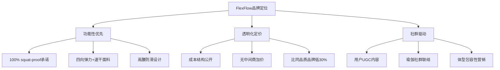
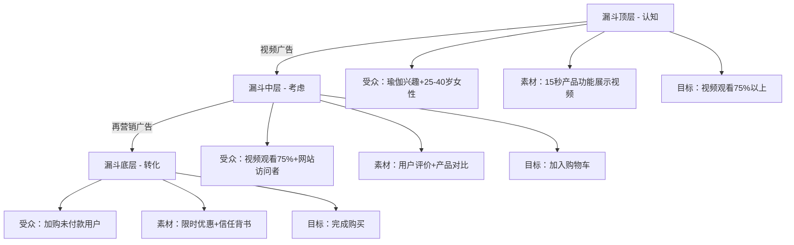
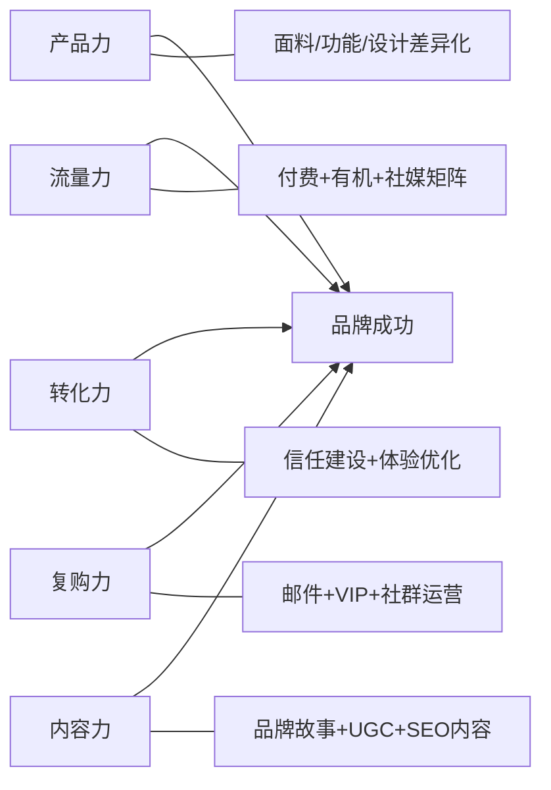

## 案例二：Shopify独立站品牌出海

### 一、案例背景

林晨，29岁，前深圳某跨境电商公司品牌运营经理，2022年底辞职创业。她选择了一条与铺货模式截然不同的路径——通过Shopify独立站打造自有DTC（Direct-to-Consumer）品牌，主攻北美女性瑜伽服饰市场。

**为什么选择独立站而非亚马逊？**

| 维度 | 亚马逊 | Shopify独立站 |
|------|--------|--------------|
| 客户归属 | 平台拥有客户数据 | 品牌拥有全部客户数据 |
| 品牌溢价空间 | 价格战严重，溢价有限 | 可通过品牌故事实现30-50%溢价 |
| 复购触达 | 依赖平台推送 | 邮件、短信、社媒直接触达 |
| 利润结构 | 佣金15%+广告费20-30% | Shopify月费$39+支付手续费2.9% |
| 流量来源 | 平台内搜索流量 | 自主获取，多元化渠道 |
| 合规风险 | 政策变动可封店 | 自主可控，风险分散 |

林晨的判断逻辑：瑜伽服饰是高复购品类，客户一旦认可品牌会持续购买，而亚马逊无法让她建立直接的客户关系。独立站虽然前期获客成本高，但LTV（客户终身价值）远高于平台模式。

**启动资源盘点：**

- 启动资金：个人积蓄15万元人民币（约2万美元）
- 供应链资源：前同事介绍的东莞瑜伽服代工厂，起订量200件/款
- 语言能力：英语CET-6，日常沟通无障碍
- 技术能力：零建站经验，但学习能力强
- 目标市场：美国25-40岁女性瑜伽爱好者

### 二、品牌定位与市场调研

#### 2.1 市场调研方法

林晨没有盲目启动，而是花了整整4周做市场调研。她的调研框架分为三个层面：

**第一层：宏观趋势验证**

使用Google Trends对比关键词趋势，确认"yoga leggings""women's activewear"等核心词近5年搜索量持续上升。同时查看Statista数据：美国运动服饰市场规模2023年约800亿美元，其中瑜伽品类年增长率约8-10%。

**第二层：竞品深度分析**

她选择了5个直接竞品独立站进行系统拆解：

| 竞品 | 定价区间 | 核心卖点 | 社媒粉丝量 | 月访问量(估) |
|------|---------|---------|-----------|------------|
| Gymshark | $30-$60 | 性价比+社区文化 | Instagram 680万 | 500万+ |
| Alo Yoga | $80-$150 | 高端时尚+明星背书 | Instagram 380万 | 300万+ |
| Girlfriend Collective | $45-$80 | 环保材质+包容性尺码 | Instagram 85万 | 80万+ |
| Wolven | $50-$90 | 独特印花+环保理念 | Instagram 12万 | 15万+ |
| Colorfulkoala | $20-$35 | 亚马逊爆款+低价 | Instagram 5万 | 30万+ |

通过SimilarWeb（免费版可查看流量概览）和社交平台手动统计，她发现一个明显的市场空白：定价$40-$60区间、同时具备设计感和功能性、面向普通瑜伽爱好者（而非专业运动员）的品牌较少。

**第三层：目标用户画像**

她通过Reddit的r/yoga、r/xxfitness板块和Facebook瑜伽社群，收集了200+条关于瑜伽裤的真实用户吐槽，归纳出核心痛点：

1. **透光问题**（squat-proof）：最频繁被提及，便宜裤子做深蹲时透光
2. **腰部下滑**：运动过程中裤子不断往下掉
3. **尺码不一致**：不同品牌尺码差异大，退货率高
4. **设计同质化**：满大街纯黑色，缺乏个性选择
5. **面料闷热**：高温瑜伽时透气性差

#### 2.2 品牌定位策略

基于调研结果，林晨确定了品牌定位：

**品牌名称**：FlexFlow Yoga

**定位语**：Squat-proof leggings designed for real yogis, not just influencers.

**差异化三角**：



**定价策略**：主力产品定价$48-$58，对比Alo Yoga的$98-$128，形成"品质接近、价格减半"的心智占位。

### 三、供应链搭建与产品开发

#### 3.1 工厂筛选与合作

林晨通过1688和前同事推荐，筛选了4家东莞瑜伽服工厂，最终选定一家的原因：

| 评估维度 | 工厂A（选定） | 工厂B | 工厂C | 工厂D |
|---------|-------------|-------|-------|-------|
| 起订量 | 200件/款 | 500件/款 | 100件/款 | 300件/款 |
| 打样周期 | 7天 | 14天 | 10天 | 12天 |
| 面料选择 | 10+种 | 5种 | 8种 | 3种 |
| ODM能力 | 强，有设计团队 | 弱，纯代工 | 中等 | 中等 |
| 品控体系 | 有ISO认证 | 无 | 有 | 无 |
| 付款方式 | 30%定金+70%发货前 | 全款预付 | 50%+50% | 全款预付 |

**关键谈判要点：**

1. **起订量争取**：首批每个SKU仅200件，承诺3个月内复购则总量达标
2. **面料定制**：要求使用75%尼龙+25%氨纶的配比（对标Lululemon的Nulu面料手感），克重230gsm
3. **品控标准**：要求每批次抽检比例10%，重点检查缝线强度和面料弹性回复率
4. **独家条款**：6个月内不出售同款设计给其他卖家

**产品线规划（首批）：**

| 产品 | 定价 | 成本(含运费) | 毛利率 | SKU数 |
|------|------|------------|--------|-------|
| 高腰瑜伽裤(纯色) | $48 | $12 | 68% | 5色×5码=25 |
| 高腰瑜伽裤(印花) | $55 | $15 | 65% | 3花色×5码=15 |
| 运动内衣 | $32 | $8 | 67% | 4色×4码=16 |
| 瑜伽上衣 | $38 | $10 | 66% | 3色×4码=12 |

首批总投入：面料+生产+包装约2.8万元，物流到美国海外仓约1.2万元，合计约4万元。

#### 3.2 品牌视觉体系

林晨在Fiverr上找到一位专做运动品牌视觉的设计师（费用$350），完成以下品牌资产：

- **Logo设计**：简约线条风格，体现柔韧与流动感
- **品牌色系**：主色深靛蓝(#1B365D)，辅色暖灰(#A89F91)，点缀色珊瑚橘(#E8735A)
- **品牌字体**：标题Montserrat Bold，正文Open Sans
- **产品摄影风格**：自然光+户外场景，模特为真实体型多样性（非精修过度的网红照）
- **包装设计**：可降解玉米淀粉包装袋+品牌贴纸+手写风格感谢卡

### 四、Shopify独立站搭建实操

#### 4.1 建站技术方案

| 配置项 | 选择 | 理由 |
|--------|------|------|
| Shopify套餐 | Basic $39/月 | 初期功能完全够用 |
| 主题 | Dawn(免费) + 自定义 | Shopify OS 2.0架构，性能优秀 |
| 域名 | flexflowyoga.com | Namesilo购买$8.99/年 |
| 支付 | Shopify Payments + PayPal | 覆盖95%+用户支付习惯 |
| 邮件营销 | Klaviyo免费版 | 250联系人以内免费，深度集成Shopify |
| 评价插件 | Judge.me免费版 | 支持带图评价，SEO友好 |
| 分析 | Google Analytics 4 + Shopify Analytics | 全链路数据追踪 |

**总月度固定成本**：约$48/月（Shopify $39 + 域名均摊$0.75 + 其他插件约$8）

#### 4.2 核心页面搭建

**首页结构设计：**

```text
Hero Banner（全屏视频：瑜伽动作展示）
    ↓
信任徽章栏（Free Shipping / 30-Day Returns / Squat-Proof Guaranteed）
    ↓
主推产品轮播（3款核心产品+CTA按钮）
    ↓
品牌故事模块（Why FlexFlow？3个差异化要点+配图）
    ↓
用户评价展示（精选5条带图真实评价）
    ↓
Instagram动态嵌入（自动展示最新UGC内容）
    ↓
邮件订阅弹窗（首单9折优惠码换取邮箱）
    ↓
页脚（政策链接+社交链接+支付图标）
```

**产品页关键要素：**

- **产品标题**：包含核心关键词，如"High-Waist Squat-Proof Yoga Leggings - Midnight Blue"
- **价格展示**：原价划线+现价+折算每日成本（"Less than $1/day for your practice"）
- **尺码指南**：交互式尺码表，输入身高体重自动推荐尺码（使用Kiwi Sizing插件免费版）
- **面料说明**：具体成分比例+触感描述+功能说明，而非泛泛而谈
- **社会证明**：评价数量+星级+精选评价置顶
- **FAQ模块**：直接在产品页回答退货政策、洗涤方法、发货时效

#### 4.3 SEO基础配置

林晨在建站同时就做好了SEO基础工作：

**关键词布局：**

| 页面类型 | 目标关键词 | 月搜索量 | 竞争度 |
|---------|-----------|---------|--------|
| 首页 | squat proof leggings | 8,100 | 中 |
| 产品页1 | high waist yoga pants women | 12,000 | 高 |
| 产品页2 | best yoga leggings for hot yoga | 3,600 | 低 |
| 博客1 | how to choose yoga pants fabric guide | 1,900 | 低 |
| 博客2 | yoga pants vs leggings difference | 2,400 | 低 |

**技术SEO清单：**

- [x] 提交sitemap.xml到Google Search Console
- [x] 设置301重定向（旧URL到新URL）
- [x] 压缩所有产品图片到200KB以内（使用TinyPNG）
- [x] 启用Shopify内置CDN加速
- [x] 设置结构化数据标记（Product Schema）
- [x] 确保移动端响应式设计通过Google Mobile-Friendly Test

### 五、流量获取与营销策略

#### 5.1 冷启动策略（第1-3个月）

林晨的启动预算有限（月预算$1500），因此采取"精准投放+内容种草"的组合策略：

**Facebook/Instagram广告（月预算$800）**

采用三层漏斗结构：



**广告素材测试结果：**

| 素材类型 | CPM | CTR | CPC | 转化率 | ROAS |
|---------|-----|-----|-----|--------|------|
| 产品功能视频（squat测试） | $8.50 | 2.8% | $0.30 | 3.2% | 2.8x |
| 用户UGC开箱视频 | $7.20 | 3.1% | $0.23 | 2.9% | 3.1x |
| 静态产品图轮播 | $12.00 | 1.5% | $0.80 | 1.8% | 1.5x |
| Before/After对比图 | $9.80 | 2.2% | $0.45 | 2.5% | 2.2x |

结论：UGC开箱视频和squat-proof测试视频表现最佳，后续预算集中在这两类素材。

**KOL/KOC合作（月预算$400）**

不找大博主，专注微影响力者（5K-50K粉丝）：

- 联系方式：通过Instagram DM直接联系，回复率约15%
- 合作模式：免费寄样+佣金分成（15%销售佣金）
- 筛选标准：粉丝互动率>3%、内容风格与品牌一致、真实使用瑜伽产品
- 首月合作了8位KOC，带来约$2,400直接销售额+大量UGC素材

**邮件营销（成本$0）**

设置自动化邮件流：

| 触发条件 | 邮件内容 | 发送时机 | 打开率 | 转化率 |
|---------|---------|---------|--------|--------|
| 注册未购买 | 欢迎信+9折码 | 即时 | 45% | 8% |
| 浏览未加购 | 社会证明+产品亮点 | 1小时后 | 32% | 3% |
| 加购未付款 | 限时提醒+免费运费 | 3小时后 | 38% | 12% |
| 购买后7天 | 使用指南+洗涤建议 | 购买后7天 | 55% | — |
| 购买后30天 | 新品推荐+专属折扣 | 购买后30天 | 28% | 5% |

#### 5.2 增长阶段策略（第4-8个月）

**Google Ads启动（月预算$600）**

从Facebook广告中验证过的关键词和受众出发：

- **搜索广告**：针对高购买意图关键词（"buy squat proof leggings online"），CPC约$1.20，转化率4.5%
- **购物广告**：产品图片直接展示在搜索结果中，CTR比文字广告高30%
- **再营销广告**：针对过去30天网站访问者展示动态产品广告

**内容营销矩阵：**

林晨建立了"3-2-1"内容节奏：每周3篇Instagram帖子、2条Reels/TikTok、1篇博客文章。

博客内容策略——不是写品牌宣传文，而是写用户真正搜索的问题：

1. "How to Tell if Your Yoga Pants Are Squat-Proof (5 Simple Tests)"
2. "Yoga Fabric Guide: Nylon vs Polyester vs Cotton - Which is Best?"
3. "How to Wash Yoga Pants So They Last 3x Longer"
4. "Plus Size Yoga Pants: What Actually Works (Tested by Real Yogis)"
5. "Hot Yoga Clothing: What to Wear When It's 105°F in the Room"

每篇博客自然植入产品链接，带来持续的有机流量。6个月后，博客贡献了全站25%的有机流量。

#### 5.3 复购与留存体系

这是独立站相比平台最大的优势——客户数据归品牌所有。

**VIP会员体系：**

| 等级 | 条件 | 权益 |
|------|------|------|
| Bronze | 首次购买 | 9折欢迎码+免费运费 |
| Silver | 累计消费$100+ | 85折专属码+新品提前购 |
| Gold | 累计消费$250+ | 8折码+免费赠品+生日礼 |

**复购数据（第6个月统计）：**

| 指标 | 数值 |
|------|------|
| 首单客户到二单转化率 | 28% |
| 平均复购间隔 | 45天 |
| 老客贡献收入占比 | 42% |
| 邮件营销收入占比 | 35% |
| 客户终身价值(LTV) | $126 |

### 六、关键运营数据

#### 6.1 启动期（第1-3个月）

| 指标 | 第1月 | 第2月 | 第3月 |
|------|-------|-------|-------|
| 网站访问量 | 1,200 | 3,500 | 8,200 |
| 转化率 | 1.2% | 1.8% | 2.4% |
| 订单数 | 14 | 63 | 197 |
| 营收 | $720 | $3,200 | $10,200 |
| 广告花费 | $1,200 | $1,500 | $1,800 |
| ROAS | 0.6x | 2.1x | 5.7x |
| 净利润 | -$1,800 | -$300 | $2,400 |

第1个月亏损是正常的——测试广告素材、积累评价、优化转化路径。关键看趋势是否向好。

#### 6.2 增长期（第4-8个月）

| 指标 | 第4月 | 第6月 | 第8月 |
|------|-------|-------|-------|
| 网站月访问量 | 15,000 | 28,000 | 45,000 |
| 转化率 | 2.8% | 3.2% | 3.5% |
| 月订单数 | 420 | 896 | 1,575 |
| 月营收 | $22,000 | $48,000 | $85,000 |
| 月广告花费 | $4,000 | $7,500 | $12,000 |
| 综合ROAS | 5.5x | 6.4x | 7.1x |
| 月净利润 | $6,500 | $15,000 | $28,000 |
| 邮件订阅者 | 2,800 | 8,500 | 18,000 |
| 复购率 | 22% | 28% | 35% |

#### 6.3 成熟期数据（第12个月）

| 指标 | 数值 |
|------|------|
| 月均营收 | $120,000 |
| 月均净利润 | $38,000 |
| 毛利率 | 65% |
| 净利率 | 32% |
| 网站月访问量 | 80,000 |
| 转化率 | 3.8% |
| 客单价(AOV) | $56 |
| 有机流量占比 | 40% |
| 付费流量占比 | 45% |
| 直接访问占比 | 15% |
| 邮件列表 | 35,000人 |
| 复购客户贡献收入占比 | 45% |
| 退货率 | 6%（行业平均15-20%） |
| SKU数量 | 45个 |

### 七、踩过的坑与教训

#### 坑一：首批库存压太多资金

首批产品林晨按"每款500件"下单，总计约6万元，结果前2个月只卖了30%。现金流一度非常紧张。

**教训**：DTC品牌首批应控制在200件/SKU以内，用预售+快速补货模式替代大批量备货。后来她改用"首单200件→测试2周→爆款追加500件"的节奏。

#### 坑二：Facebook广告学习期被干扰

前两周频繁调整广告组预算和受众，导致机器学习期反复重置，CPA飙升到$45（目标$20以内）。

**教训**：新广告组发布后至少等72小时再做判断，学习期内不修改任何设置。Facebook的机器学习需要约50个转化事件才能稳定。

#### 坑三：尺码问题导致高退货率

首批产品尺码偏小，退货率一度达到22%。每单退货成本（退货运费+产品损耗）约$12。

**解决方案**：

1. 产品页增加详细尺码表+模特试穿数据（身高/体重/穿着尺码）
2. 首页增加"Find Your Size"互动工具
3. 在尺码指南页面加入"如果你在两个尺码之间，建议选大一号"的提示
4. 退货率从22%降至6%

#### 坑四：忽视了Shopify Payments的保留金

Shopify Payments在新店铺前90天会保留一定比例的款项（通常10-20%），用于覆盖潜在的退款和欺诈风险。林晨第一个月$720的收入被保留了$140，导致现金流更紧张。

**教训**：提前了解支付服务商的资金保留政策，预留足够的运营现金流。90天后保留金政策会放松。

#### 坑五：盲目追求网站"完美"

林晨花了3周时间反复调整网站设计，从配色到间距到动画效果，迟迟不上线。

**教训**：MVP思维——网站达到"可用"标准就立即上线，在真实流量中发现问题比自己想象问题更有效。后来她的网站经过20+次迭代才变成现在的样子，但每一次迭代都基于真实数据。

### 八、品牌出海核心方法论总结

#### 8.1 独立站品牌成功的五个关键要素



#### 8.2 资金效率对比：独立站 vs 亚马逊

| 维度 | Shopify独立站 | 亚马逊FBA |
|------|--------------|----------|
| 启动资金 | 3-5万元 | 8-15万元 |
| 月固定成本 | $48起 | FBA仓储费+月租$39.99 |
| 毛利率 | 60-70% | 30-45% |
| 客户归属 | 100%自有 | 平台所有 |
| 复购触达 | 邮件/SMS直接触达 | 依赖平台推送 |
| 品牌溢价 | 可支撑30-50%溢价 | 价格战压力大 |
| 核心能力要求 | 内容+广告+品牌 | 选品+运营+广告 |

#### 8.3 给新手的实操建议

**第一周行动清单：**

1. 注册Shopify账号（有3天免费+首月$1试用期）
2. 选择Dawn主题，不要花时间纠结主题
3. 确定一个细分品类，不贪多
4. 找到1-2家供应商，各打样1-2款产品
5. 使用Canva免费版做基础品牌视觉

**第一个月行动清单：**

1. 上线3-5个SKU，不求多求精
2. 设置Google Analytics和Facebook Pixel
3. 开始$10/天的小额广告测试
4. 撰写3篇SEO博客文章
5. 建立Instagram账号，每天发1条帖子

**三个月内不要做的事：**

- 不要追求网站设计完美，够用就行
- 不要同时上太多SKU，3-5款足够测试
- 不要找大博主合作，先用微KOC积累素材
- 不要忽视邮件列表建设，从第一天就开始收集邮箱
- 不要只依赖Facebook广告，同时布局SEO和内容

#### 8.4 进阶：从Shopify到品牌生态

当月营收突破$50,000后，林晨开始构建品牌生态：

1. **Shopify App扩展**：安装LoyaltyLion（积分系统）、ReCharge（订阅模式——每月寄新款到家）
2. **多渠道布局**：Amazon作为补充渠道（占总营收20%），但核心仍为独立站
3. **品牌内容矩阵**：YouTube瑜伽教程频道（嵌入产品使用场景）、播客采访瑜伽教练
4. **线下触点**：赞助本地瑜伽活动，提供试穿体验
5. **产品线扩展**：从瑜伽裤扩展到瑜伽垫、瑜伽砖、冥想坐垫等周边

### 九、核心工具清单

| 类别 | 工具 | 用途 | 费用 |
|------|------|------|------|
| 建站 | Shopify | 电商平台 | $39/月 |
| 主题 | Dawn | Shopify OS 2.0免费主题 | 免费 |
| 设计 | Canva | 社媒图片/Banner | 免费版够用 |
| 设计 | Figma | 品牌视觉体系 | 免费版 |
| 邮件 | Klaviyo | 邮件营销自动化 | 免费(250人内) |
| 广告 | Meta Ads Manager | Facebook/Instagram广告 | 按消耗 |
| 广告 | Google Ads | 搜索/购物广告 | 按消耗 |
| 分析 | Google Analytics 4 | 网站流量分析 | 免费 |
| SEO | Google Search Console | 搜索表现监控 | 免费 |
| SEO | Ubersuggest | 关键词研究 | 免费版 |
| 评价 | Judge.me | 产品评价管理 | 免费版 |
| 尺码 | Kiwi Sizing | 智能尺码推荐 | 免费版 |
| 图片压缩 | TinyPNG | 产品图压缩 | 免费 |
| 社媒管理 | Later | 社媒排期发布 | 免费版 |
| 海外仓 | ShipBob | 美国本土发货 | 按件计费 |

---

> **本案例核心启示**：Shopify独立站品牌出海的本质不是"建一个网站卖货"，而是"建立一个直接触达消费者的品牌"。前期投入更小、利润率更高、客户资产完全自有，但需要更强的内容能力和品牌思维。选品差异化是基础，内容营销是引擎，邮件复购是利润放大器。对于愿意深耕细分品类、重视长期品牌价值的创业者，独立站是比平台模式更具可持续性的选择。
